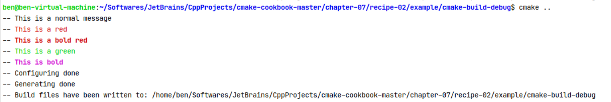

# [CMake Cookbook](https://www.bookstack.cn/read/CMake-Cookbook/content-preface-preface-chinese.md)

源码下载<https://github.com/dev-cafe/cmake-cookbook>

# 第1章 从可执行文件到库

## [1.1 将单个源文件编译为可执行文件](https://www.bookstack.cn/read/CMake-Cookbook/content-chapter1-1.1-chinese.md)

```cpp
cmake_minimum_required(VERSION 3.14 FATAL_ERROR)

project(recipe-01 LANGUAGES CXX)

set(CMAKE_CXX_STANDARD 20)

aux_source_directory(. DIR_SRCS)

add_executable(hello-world ${DIR_SRCS})  # 生成可执行文件名称与工程名字可任意指定，没有相关联关系
```

在`build`目录：

```cpp
$ cmake ..
$ cmake --build .  # 与make一样效果。--build <dir> = Build a CMake-generated project binary tree. 可通过cmake -help查看帮助
$ cmake --build . --target clean  # 与make clean效果一样
```

**NOTE**:*CMake语言不区分大小写，但是参数区分大小写。*

**TIPS**:*CMake中，C++是默认的编程语言。不过，我们还是建议使用`LANGUAGES`选项在`project`命令中显式地声明项目的语言。*

要配置项目并生成构建器，我们必须通过命令行界面(CLI)运行CMake。CMake CLI提供了许多选项，`cmake -help`将输出以显示列出所有可用选项的完整帮助信息，我们将在书中对这些选项进行更多地了解。正如您将从`cmake -help`的输出中显示的内容，它们中的大多数选项会让你您访问CMake手册，查看详细信息。通过下列命令生成构建器：

```
$ mkdir -p build
$ cd build$ cmake ..
```

这里，我们创建了一个目录`build`(生成构建器的位置)，进入`build`目录，并通过指定`CMakeLists.txt`的位置(本例中位于父目录中)来调用CMake。可以使用以下命令行来实现相同的效果：

```
$ cmake -H. -Bbuild  # 如果在build目录，则命令为cmake -H.. -B.
```

该命令是跨平台的，使用了`-H`和`-B`为CLI选项。`-H`表示当前目录中搜索根`CMakeLists.txt`文件。`-Bbuild`告诉CMake在一个名为`build`的目录中生成所有的文件。

**NOTE**:*`cmake -H. -Bbuild`也属于CMake标准使用方式: https://cmake.org/pipermail/cmake-developers/2018-January/030520.html 。不过，我们将在本书中使用传统方法(创建一个构建目录，进入其中，并通过将CMake指向`CMakeLists.txt`的位置来配置项目)。*

运行`cmake`命令会输出一系列状态消息，显示配置信息：

```
$ cmake ..
-- The CXX compiler identification is GNU 10.2.0
-- Check for working CXX compiler: /usr/bin/c++.exe
-- Check for working CXX compiler: /usr/bin/c++.exe - works
-- Detecting CXX compiler ABI info
-- Detecting CXX compiler ABI info - done
-- Detecting CXX compile features
-- Detecting CXX compile features - done
-- Configuring done
-- Generating done
-- Build files have been written to: /cygdrive/d/Program Files/JetBrains/CppProject/TestProject/build
```

**NOTE**:*在与`CMakeLists.txt`相同的目录中执行`cmake .`，原则上足以配置一个项目。然而，CMake会将所有生成的文件写到项目的根目录中。这将是一个源代码内构建，通常是不推荐的，因为这会混合源代码和项目的目录树。我们首选的是源外构建。*

CMake是一个构建系统生成器。将描述构建系统(如：Unix Makefile、Ninja、Visual Studio等)应当如何操作才能编译代码。然后，CMake为所选的构建系统生成相应的指令。默认情况下，在GNU/Linux和macOS系统上，CMake使用Unix Makefile生成器。Windows上，Visual Studio是默认的生成器。在下一个示例中，我们将进一步研究生成器，并在第13章中重新讨论生成器。

GNU/Linux上，CMake默认生成Unix Makefile来构建项目：

- `Makefile`: `make`将运行指令来构建项目。
- `CMakefile`：包含临时文件的目录，CMake用于检测操作系统、编译器等。此外，根据所选的生成器，它还包含特定的文件。
- `cmake_install.cmake`：处理安装规则的CMake脚本，在项目安装时使用。
- `CMakeCache.txt`：如文件名所示，CMake缓存。CMake在重新运行配置时使用这个文件。

要构建示例项目，我们运行以下命令：

```
$ cmake --build .
```

最后，CMake不强制指定构建目录执行名称或位置，我们完全可以把它放在项目路径之外。这样做同样有效：

```
$ mkdir -p /tmp/someplace
$ cd /tmp/someplace
$ cmake /path/to/source
$ cmake --build .
```

官方文档 https://cmake.org/runningcmake/ 给出了运行CMake的简要概述。由CMake生成的构建系统，即上面给出的示例中的Makefile，将包含为给定项目构建目标文件、可执行文件和库的目标及规则。`hello-world`可执行文件是在当前示例中的唯一目标，运行以下命令：

```
$ cmake --build . --target help  # 和make help效果一样
The following are some of the valid targets for this Makefile:
... all (the default if no target is provided)
... clean
... depend
... edit_cache
... rebuild_cache
... hello-world
... main.o
... main.i
... main.s
```

CMake生成的目标比构建可执行文件的目标要多。可以使用`cmake --build . --target <target-name>`语法，实现如下功能：

- **all**(或Visual Studio generator中的ALL_BUILD)是默认目标，将在项目中构建所有目标。
- **clean**，删除所有生成的文件。
- **rebuild_cache**，将调用CMake为源文件生成依赖(如果有的话)。
- **edit_cache**，这个目标允许直接编辑缓存。

对于更复杂的项目，通过测试阶段和安装规则，CMake将生成额外的目标：

- **test**(或Visual Studio generator中的**RUN_TESTS**)将在CTest的帮助下运行测试套件。我们将在第4章中详细讨论测试和CTest。
- **install**，将执行项目安装规则。我们将在第10章中讨论安装规则。
- **package**，此目标将调用CPack为项目生成可分发的包。打包和CPack将在第11章中讨论。

## [1.2 切换生成器](https://www.bookstack.cn/read/CMake-Cookbook/content-chapter1-1.2-chinese.md)

CMake针对不同平台支持本地构建工具列表。同时支持命令行工具(如Unix Makefile和Ninja)和集成开发环境(IDE)工具。用以下命令，可在平台上找到生成器名单，以及已安装的CMake版本：

```
$ cmake --help
```

这个命令的输出，将列出CMake命令行界面上所有的选项，您会找到可用生成器的列表。例如，安装了CMake 3.11.2的GNU/Linux机器上的输出：

```
Generators

The following generators are available on this platform (* marks default):
* Unix Makefiles               = Generates standard UNIX makefiles.
  Ninja                        = Generates build.ninja files.
  Ninja Multi-Config           = Generates build-<Config>.ninja files.
  CodeBlocks - Ninja           = Generates CodeBlocks project files.
  CodeBlocks - Unix Makefiles  = Generates CodeBlocks project files.
  CodeLite - Ninja             = Generates CodeLite project files.
  CodeLite - Unix Makefiles    = Generates CodeLite project files.
  Sublime Text 2 - Ninja       = Generates Sublime Text 2 project files.
  Sublime Text 2 - Unix Makefiles
                               = Generates Sublime Text 2 project files.
  Kate - Ninja                 = Generates Kate project files.
  Kate - Unix Makefiles        = Generates Kate project files.
  Eclipse CDT4 - Ninja         = Generates Eclipse CDT 4.0 project files.
  Eclipse CDT4 - Unix Makefiles= Generates Eclipse CDT 4.0 project files.
```

**具体实施**

我们将重用前一节示例中的`hello-world.cpp`和`CMakeLists.txt`。惟一的区别在使用CMake时，因为现在必须显式地使用命令行方式，用`-G`切换生成器。

1. 首先，使用以下步骤配置项目:

   ```
   ben@ben-virtual-machine:~/Softwares/JetBrains/CppProjects/TestProject/build$ cmake -G Ninja ..
   -- The C compiler identification is GNU 7.5.0
   -- The CXX compiler identification is GNU 7.5.0
   -- Check for working C compiler: /usr/bin/cc
   -- Check for working C compiler: /usr/bin/cc - works
   -- Detecting C compiler ABI info
   -- Detecting C compiler ABI info - done
   -- Detecting C compile features
   -- Detecting C compile features - done
   -- Check for working CXX compiler: /usr/bin/c++
   -- Check for working CXX compiler: /usr/bin/c++ - works
   -- Detecting CXX compiler ABI info
   -- Detecting CXX compiler ABI info - done
   -- Detecting CXX compile features
   -- Detecting CXX compile features - done
   -- Configuring done
   -- Generating done
   -- Build files have been written to: /home/ben/Softwares/JetBrains/CppProjects/TestProject/build
   ```

2. 第二步，构建项目：

   ```
   $ cmake --build .  # 这里也可以使用命令ninja来进行构建
   [2/2] Linking CXX executable hello-world
   ```

**如何工作**

与前一个配置相比，每一步的输出没什么变化。每个生成器都有自己的文件集，所以编译步骤的输出和构建目录的内容是不同的：

- `build.ninja`和`rules.ninja`：包含Ninja的所有的构建语句和构建规则。
- `CMakeCache.txt`：CMake会在这个文件中进行缓存，与生成器无关。
- `CMakeFiles`：包含由CMake在配置期间生成的临时文件。
- `cmake_install.cmake`：CMake脚本处理安装规则，并在安装时使用。

`cmake --build .`将`ninja`命令封装在一个跨平台的接口中。

## [1.3 构建和链接静态库和动态库](https://www.bookstack.cn/read/CMake-Cookbook/content-chapter1-1.3-chinese.md)

**准备工作**

回看第一个例子，这里并不再为可执行文件提供单个源文件，我们现在将引入一个类，用来包装要打印到屏幕上的消息。更新一下的`hello-world.cpp`:

```c++
#include "Message.h"

#include <cstdlib>
#include <iostream>

int main() {
    Message say_hello("Hello, CMake World!");
    std::cout << say_hello << std::endl;
    Message say_goodbye("Goodbye, CMake World");
    std::cout << say_goodbye << std::endl;
    return EXIT_SUCCESS;
}
```

`Message`类包装了一个字符串，并提供重载过的`<<`操作，并且包括两个源码文件：`Message.hpp`头文件与`Message.cpp`源文件。`Message.hpp`中的接口包含以下内容：

```c++
#ifndef RECIPE_01_MESSAGE_H
#define RECIPE_01_MESSAGE_H
#pragma once

#include <iosfwd>
#include <string>

class Message {
public:
    Message(const std::string& m) : message_(m) {}

    friend std::ostream& operator<<(std::ostream& os, Message& obj) {
        return obj.printObject(os);
    }

private:
    std::string message_;

    std::ostream& printObject(std::ostream& os);
};

#endif //RECIPE_01_MESSAGE_H

```

`Message.cpp`实现如下：

```c++
#include "Message.h"
#include <iostream>
#include <string>

std::ostream& Message::printObject(std::ostream& os) {
    os << "This is my very nice message: " << std::endl;
    os << message_;
    return os;
}
```

**具体实施**

这里有两个文件需要编译，所以`CMakeLists.txt`必须进行修改。本例中，先把它们编译成一个库，而不是直接编译成可执行文件:

1. 创建目标——静态库。库的名称和源码文件名相同，具体代码如下：

   ```
   add_library(message STATIC Message.h Message.cpp)
   ```

2. 创建`hello-world`可执行文件的目标部分不需要修改：

   ```
   add_executable(hello-world hello-world.cpp)
   ```

3. 最后，将目标库链接到可执行目标：

   ```
   target_link_libraries(hello-world message)
   ```

   ```
   cmake_minimum_required(VERSION 3.14 FATAL_ERROR)
   
   project(recipe-03 LANGUAGES CXX)
   
   set(CMAKE_CXX_STANDARD 20)
   
   add_library(message STATIC Message.h Message.cpp)
   
   add_executable(hello-world hello-world.cpp)
   
   target_link_libraries(hello-world message)
   ```

4. 对项目进行配置和构建。库编译完成后，将连接到`hello-world`可执行文件中：

   ```
   $ mkdir -p build
   $ cd build
   $ cmake ..
   $ cmake --build .
   ```

   ```
   Scanning dependencies of target message
   [ 25%] Building CXX object CMakeFiles/message.dir/Message.cpp.o
   [ 50%] Linking CXX static library libmessage.a
   [ 50%] Built target message
   Scanning dependencies of target hello-world
   [ 75%] Building CXX object CMakeFiles/hello-world.dir/hello-world.cpp.o
   [100%] Linking CXX executable hello-world.exe
   [100%] Built target hello-world
   
   # 在build目录可以看到内容有libmessage.a静态库：
   $ ls -l
   总用量 224
   -rwxrw-r--+ 1 Ben Ben   1429 11月 27 21:54 cmake_install.cmake
   -rwxrw-r--+ 1 Ben Ben  13549 11月 27 21:54 CMakeCache.txt
   drwxrwxr-x+ 1 Ben Ben      0 11月 27 21:54 CMakeFiles
   -rwxrwxr-x+ 1 Ben Ben 189656 11月 27 21:54 hello-world.exe
   -rwxrw-r--+ 1 Ben Ben   2948 11月 27 21:54 libmessage.a
   -rwxrw-r--+ 1 Ben Ben   6677 11月 27 21:54 Makefile
   ```

   ```c++
   $ ./hello-world.exe
   This is my very nice message:
   Hello, CMake World!
   This is my very nice message:
   Goodbye, CMake World
   ```

**工作原理**

本节引入了两个新命令：

- `add_library(message STATIC Message.hpp Message.cpp)`：生成必要的构建指令，将指定的源码编译到库中。`add_library`的第一个参数是目标名。整个`CMakeLists.txt`中，可使用相同的名称来引用库。生成的库的实际名称将由CMake通过在前面添加前缀`lib`和适当的扩展名作为后缀来形成。生成库是根据第二个参数(`STATIC`或`SHARED`)和操作系统确定的。
- `target_link_libraries(hello-world message)`: 将库链接到可执行文件。此命令还确保`hello-world`可执行文件可以正确地依赖于消息库。因此，在消息库链接到`hello-world`可执行文件之前，需要完成消息库的构建。

编译成功后，构建目录包含`libmessage.a`一个静态库(在GNU/Linux上)和`hello-world`可执行文件。

- **STATIC**：用于创建静态库，即编译文件的打包存档，以便在链接其他目标时使用，例如：可执行文件。
- **SHARED**：用于创建动态库，即可以动态链接，并在运行时加载的库。可以在`CMakeLists.txt`中使用`add_library(message SHARED Message.hpp Message.cpp)`从静态库切换到动态共享对象(DSO)。
- **OBJECT**：可将给定`add_library`的列表中的源码编译到目标文件，不将它们归档到静态库中，也不能将它们链接到共享对象中。如果需要一次性创建静态库和动态库，那么使用对象库尤其有用。我们将在本示例中演示。
- **MODULE**：又为DSO组。与`SHARED`库不同，它们不链接到项目中的任何目标，不过可以进行动态加载。该参数可以用于构建运行时插件。

--------------

本地验证：

如果修改为`add_library(message SHARED Message.hpp Message.cpp)`，则生成动态库`cygmessage.dll`和`libmessage.dll.a`，如果删除该`cygmessage.dll`，则运行`./hello_world.exe`则报错：

```
$ ./hello-world.exe
D:/Program Files/JetBrains/CppProject/TestProject/build/hello-world.exe: error while loading shared libraries: cygmessag
e.dll: cannot open shared object file: No such file or directory
```

如果修改为`add_library(message OBJECT Message.h Message.cpp)`，则不会生成`.dll`和`.a`文件，只有一个`hello_world.exe`

------

CMake还能够生成特殊类型的库，这不会在构建系统中产生输出，但是对于组织目标之间的依赖关系，和构建需求非常有用：

- **IMPORTED**：此类库目标表示位于项目外部的库。此类库的主要用途是，对现有依赖项进行构建。因此，`IMPORTED`库将被视为不可变的。我们将在本书的其他章节演示使用`IMPORTED`库的示例。参见: https://cmake.org/cmake/help/latest/manual/cmakebuildsystem.7.html#imported-targets
- **INTERFACE**：与`IMPORTED`库类似。不过，该类型库可变，没有位置信息。它主要用于项目之外的目标构建使用。我们将在本章第5节中演示`INTERFACE`库的示例。参见: https://cmake.org/cmake/help/latest/manual/cmake-buildsystem.7.html#interface-libraries
- **ALIAS**：顾名思义，这种库为项目中已存在的库目标定义别名。不过，不能为`IMPORTED`库选择别名。参见: https://cmake.org/cmake/help/latest/manual/cmake-buildsystem.7.html#alias-libraries

本例中，我们使用`add_library`直接集合了源代码。后面的章节中，我们将使用`target_sources`汇集源码，特别是在第7章。请参见Craig Scott的这篇精彩博文: https://crascit.com/2016/01/31/enhanced-source-file-handling-with-target_sources/ ，其中有对`target_sources`命令的具体使用。

**更多信息**

现在展示`OBJECT`库的使用，修改`CMakeLists.txt`，如下：

```cmake
cmake_minimum_required(VERSION 3.14 FATAL_ERROR)

project(recipe-03 LANGUAGES CXX)

set(CMAKE_CXX_STANDARD 20)

add_library(message-objs
        OBJECT
        Message.h
        Message.cpp
        )
# this is only needed for older compilers
# but doesn't hurt either to have it
set_target_properties(message-objs
        PROPERTIES
        POSITION_INDEPENDENT_CODE 1
        )
add_library(message-shared
        SHARED
        $<TARGET_OBJECTS:message-objs>
        )
add_library(message-static
        STATIC
        $<TARGET_OBJECTS:message-objs>
        )
add_executable(hello-world hello-world.cpp)
target_link_libraries(hello-world message-static)

编译时可以看到扫描了四个对象：message-objs/message-static/hello-world/message-shared：
$ cmake --build .
Scanning dependencies of target message-objs
[ 20%] Building CXX object CMakeFiles/message-objs.dir/Message.cpp.o
[ 20%] Built target message-objs
Scanning dependencies of target message-static
[ 40%] Linking CXX static library libmessage-static.a
[ 40%] Built target message-static
Scanning dependencies of target hello-world
[ 60%] Building CXX object CMakeFiles/hello-world.dir/hello-world.cpp.o
[ 80%] Linking CXX executable hello-world.exe
[ 80%] Built target hello-world
Scanning dependencies of target message-shared
[100%] Linking CXX shared library cygmessage-shared.dll
[100%] Built target message-shared
```

首先，`add_library`改为`add_library(Message-objs OBJECT Message.hpp Message.cpp)`。此外，需要保证编译的目标文件与生成位置无关。可以通过使用`set_target_properties`命令，设置`message-objs`目标的相应属性来实现。

**NOTE**: *可能在某些平台和/或使用较老的编译器上，需要显式地为目标设置`POSITION_INDEPENDENT_CODE`属性。*

现在，可以使用这个对象库来获取静态库(`message-static`)和动态库(`message-shared`)。要注意引用对象库的生成器表达式语法:`$<TARGET_OBJECTS:message-objs>`。生成器表达式是CMake在生成时(即配置之后)构造，用于生成特定于配置的构建输出。参见: https://cmake.org/cmake/help/latest/manual/cmake-generator-expressions.7.html 。我们将在第5章中深入研究生成器表达式。最后，将`hello-world`可执行文件链接到消息库的静态版本。

-------------------------------

本地试验：

修改CMakeLists.txt如下：

```
cmake_minimum_required(VERSION 3.14 FATAL_ERROR)

project(recipe-03 LANGUAGES CXX)

set(CMAKE_CXX_STANDARD 20)

set(SRC_MESSAGE Message.h Message.cpp)

add_library(message-shared
        SHARED
        ${SRC_MESSAGE}
        )
add_library(message-static
        STATIC
        ${SRC_MESSAGE}
        )
add_executable(hello-world hello-world.cpp)
target_link_libraries(hello-world message-static)

编译时可以看到扫描了三个对象：message-static/hello-world/message-shared：
$ cmake --build .
Scanning dependencies of target message-static
[ 16%] Building CXX object CMakeFiles/message-static.dir/Message.cpp.o
[ 33%] Linking CXX static library libmessage-static.a
[ 33%] Built target message-static
Scanning dependencies of target hello-world
[ 50%] Building CXX object CMakeFiles/hello-world.dir/hello-world.cpp.o
[ 66%] Linking CXX executable hello-world.exe
[ 66%] Built target hello-world
Scanning dependencies of target message-shared
[ 83%] Building CXX object CMakeFiles/message-shared.dir/Message.cpp.o
[100%] Linking CXX shared library cygmessage-shared.dll
[100%] Built target message-shared
```

---------------

是否可以让CMake生成同名的两个库？换句话说，它们都可以被称为`message`，而不是`message-static`和`message-share`d吗？我们需要修改这两个目标的属性：

```
cmake_minimum_required(VERSION 3.14 FATAL_ERROR)

project(recipe-03 LANGUAGES CXX)

set(CMAKE_CXX_STANDARD 20)

add_library(message-objs
        OBJECT
        Message.h
        Message.cpp
        )
# this is only needed for older compilers
# but doesn't hurt either to have it
set_target_properties(message-objs
        PROPERTIES
        POSITION_INDEPENDENT_CODE 1
        )
add_library(message-shared
        SHARED
        $<TARGET_OBJECTS:message-objs>
        )
set_target_properties(message-shared
        PROPERTIES
        OUTPUT_NAME "message"
        )
add_library(message-static
        STATIC
        $<TARGET_OBJECTS:message-objs>
        )
set_target_properties(message-static
        PROPERTIES
        OUTPUT_NAME "message"
        )
add_executable(hello-world hello-world.cpp)
target_link_libraries(hello-world message-static)

编译：
$ cmake --build .
Scanning dependencies of target message-objs
[ 20%] Building CXX object CMakeFiles/message-objs.dir/Message.cpp.o
[ 20%] Built target message-objs
Scanning dependencies of target message-static
[ 40%] Linking CXX static library libmessage.a
[ 40%] Built target message-static
Scanning dependencies of target hello-world
[ 60%] Building CXX object CMakeFiles/hello-world.dir/hello-world.cpp.o
[ 80%] Linking CXX executable hello-world.exe
[ 80%] Built target hello-world
Scanning dependencies of target message-shared
[100%] Linking CXX shared library cygmessage.dll
[100%] Built target message-shared

$ ls -l
总用量 364
-rwxrw-r--+ 1 Ben Ben   1429 11月 27 22:37 cmake_install.cmake
-rwxrw-r--+ 1 Ben Ben  13549 11月 27 22:37 CMakeCache.txt
drwxrwxr-x+ 1 Ben Ben      0 11月 27 22:38 CMakeFiles
-rwxrwxr-x+ 1 Ben Ben 137251 11月 27 22:38 cygmessage.dll
-rwxrwxr-x+ 1 Ben Ben 189656 11月 27 22:38 hello-world.exe
-rwxrw-r--+ 1 Ben Ben   2948 11月 27 22:37 libmessage.a
-rwxrw-r--+ 1 Ben Ben   2828 11月 27 22:38 libmessage.dll.a
-rwxrw-r--+ 1 Ben Ben   7738 11月 27 22:37 Makefile
```

我们可以链接到DSO吗？这取决于操作系统和编译器：

1. GNU/Linux和macOS上，不管选择什么编译器，它都可以工作。
2. Windows上，不能与Visual Studio兼容，但可以与MinGW和MSYS2兼容。

这是为什么呢？生成好的DSO组需要程序员限制符号的可见性。需要在编译器的帮助下实现，但不同的操作系统和编译器上，约定不同。CMake有一个机制来处理这个问题，我们将在第10章中解释它如何工作。

## 1.4 用条件句控制编译

**具体实施**

从与上一个示例的的源代码开始，我们希望能够在不同的两种行为之间进行切换：

1. 将`Message.hpp`和`Message.cpp`构建成一个库(静态或动态)，然后将生成库链接到`hello-world`可执行文件中。
2. 将`Message.hpp`，`Message.cpp`和`hello-world.cpp`构建成一个可执行文件，但不生成任何一个库。

让我们来看看如何使用`CMakeLists.txt`来实现：

1. 首先，定义最低CMake版本、项目名称和支持的语言：

   ```
   cmake_minimum_required(VERSION 3.5 FATAL_ERROR)
   project(recipe-04 LANGUAGES CXX)
   ```

2. 我们引入了一个新变量`USE_LIBRARY`，这是一个逻辑变量，值为`OFF`。我们还打印了它的值：

   ```
   set(USE_LIBRARY OFF)
   message(STATUS "Compile sources into a library? ${USE_LIBRARY}")  # 加了status，以-- Compile source into a library? OFF显示；不加status，无前缀--
   ```

3. CMake中定义`BUILD_SHARED_LIBS`全局变量，并设置为`OFF`。调用`add_library`并省略第二个参数，将构建一个静态库：

   ```
   set(BUILD_SHARED_LIBS OFF)
   ```

4. 然后，引入一个变量`_sources`，包括`Message.hpp`和`Message.cpp`：

   ```
   list(APPEND _sources Message.hpp Message.cpp)
   ```

5. 然后，引入一个基于`USE_LIBRARY`值的`if-else`语句。如果逻辑为真，则`Message.hpp`和`Message.cpp`将打包成一个库：

   ```
   if(USE_LIBRARY)
       # add_library will create a static library
       # since BUILD_SHARED_LIBS is OFF
       add_library(message ${_sources})
       add_executable(hello-world hello-world.cpp)
       target_link_libraries(hello-world message)
   else()
       add_executable(hello-world hello-world.cpp ${_sources})
   endif()
   ```

6. 我们可以再次使用相同的命令集进行构建。由于`USE_LIBRARY`为`OFF`, `hello-world`可执行文件将使用所有源文件来编译。可以通过在GNU/Linux上，运行`objdump -x`命令进行验证。

   ```c++
   cmake_minimum_required(VERSION 3.14 FATAL_ERROR)
   
   project(recipe-04 LANGUAGES CXX)
   
   set(CMAKE_CXX_STANDARD 20)
   
   # introduce a toggle for using a library
   set(USE_LIBRARY ON)
   
   message(STATUS "Compile sources into a library? ${USE_LIBRARY}")  # 加了status，以-- Compile source into a library? OFF显示；不加status，无前缀--
   
   # BUILD_SHARED_LIBS is a global flag offered by CMake
   # to toggle the behavior of add_library
   set(BUILD_SHARED_LIBS OFF)  # 这里设置为ON，则add_library会默认生成动态库
   
   # list sources
   list(APPEND _sources Message.h Message.cpp)
   
   if (USE_LIBRARY)
       # add_library will create a static library
       # since BUILD_SHARED_LIBS is OFF
       add_library(message ${_sources})  # 如果没有BUILD_SHARED_LIBS变量，则默认生成STATIC库
   
       add_executable(hello-world hello-world.cpp)
   
       target_link_libraries(hello-world message)
   else ()
       add_executable(hello-world hello-world.cpp ${_sources})
   endif ()
   ```

**工作原理**

我们介绍了两个变量：`USE_LIBRARY`和`BUILD_SHARED_LIBS`。这两个变量都设置为`OFF`。如CMake语言文档中描述，逻辑真或假可以用多种方式表示：

- 如果将逻辑变量设置为以下任意一种：`1`、`ON`、`YES`、`true`、`Y`或非零数，则逻辑变量为`true`。
- 如果将逻辑变量设置为以下任意一种：`0`、`OFF`、`NO`、`false`、`N`、`IGNORE、NOTFOUND`、空字符串，或者以`-NOTFOUND`为后缀，则逻辑变量为`false`。

`USE_LIBRARY`变量将在第一个和第二个行为之间切换。`BUILD_SHARED_LIBS`是CMake的一个全局标志。因为CMake内部要查询`BUILD_SHARED_LIBS`全局变量，所以`add_library`命令可以在不传递`STATIC/SHARED/OBJECT`参数的情况下调用；如果为`false`或未定义，将生成一个静态库。

这个例子说明，可以引入条件来控制CMake中的执行流。但是，当前的设置不允许从外部切换，不需要手动修改`CMakeLists.txt`。原则上，我们希望能够向用户开放所有设置，这样就可以在不修改构建代码的情况下调整配置，稍后将展示如何做到这一点。

**NOTE**:*`else()`和`endif()`中的`()`，可能会让刚开始学习CMake代码的同学感到惊讶。其历史原因是，因为其能够指出指令的作用范围。例如，可以使用`if(USE_LIBRARY)…else(USE_LIBRARY)…endif(USE_LIBIRAY)`。这个格式并不唯一，可以根据个人喜好来决定使用哪种格式。*

**TIPS**:*`_sources`变量是一个局部变量，不应该在当前范围之外使用，可以在名称前加下划线。*

## 1.5 向用户显示选项

前面的配置中，我们引入了条件句：通过硬编码的方式给定逻辑变量值。不过，这会影响用户修改这些变量。CMake代码没有向读者传达，该值可以从外部进行修改。推荐在`CMakeLists.txt`中使用`option()`命令，以选项的形式显示逻辑开关，用于外部设置，从而切换构建系统的生成行为。本节的示例将向您展示，如何使用这个命令。

**具体实施**

看一下前面示例中的静态/动态库示例。与其硬编码`USE_LIBRARY`为`ON`或`OFF`，现在为其设置一个默认值，同时也可以从外部进行更改：

1. 用一个选项替换上一个示例的`set(USE_LIBRARY OFF)`命令。该选项将修改`USE_LIBRARY`的值，并设置其默认值为`OFF`：

   ```
   option(USE_LIBRARY "Compile sources into a library" OFF)  # 默认值为OFF
   ```

2. 现在，可以通过CMake的`-D`CLI选项，将信息传递给CMake来切换库的行为：

   ```c++
   $ mkdir -p build
   $ cd build
   $ cmake -D USE_LIBRARY=ON ..
   -- ...
   -- Compile sources into a library? ON
   -- ...
   
   $ cmake --build .
   Scanning dependencies of target message
   [ 25%] Building CXX object CMakeFiles/message.dir/Message.cpp.o
   [ 50%] Linking CXX static library libmessage.a
   [ 50%] Built target message
   Scanning dependencies of target hello-world
   [ 75%] Building CXX object CMakeFiles/hello-world.dir/hello-world.cpp.o
   [100%] Linking CXX executable hello-world
   [100%] Built target hello-world
   ```

`-D`开关用于为CMake设置任何类型的变量：逻辑变量、路径等等。

**工作原理**

`option`可接受三个参数：

```
option(<option_variable> "help string" [initial value])
```

- `<option_variable>`表示该选项的变量的名称。
- `"help string"`记录选项的字符串，在CMake的终端或图形用户界面中可见。
- `[initial value]`选项的默认值，可以是`ON`或`OFF`。

**更多信息**

有时选项之间会有依赖的情况。示例中，我们提供生成静态库或动态库的选项。但是，如果没有将`USE_LIBRARY`逻辑设置为`ON`，则此选项没有任何意义。CMake提供`cmake_dependent_option()`命令用来定义依赖于其他选项的选项：

```c++
include(CMakeDependentOption)
cmake_dependent_option(MAKE_STATIC_LIBRARY "Compile sources into a static library" OFF
        "USE_LIBRARY" ON
        )
cmake_dependent_option(MAKE_SHARED_LIBRARY "Compile sources into a shared library" ON
        "USE_LIBRARY" ON
        )
```

如果`USE_LIBRARY`为`ON`，`MAKE_STATIC_LIBRARY`默认值为`OFF`，否则`MAKE_STATIC_LIBRARY`默认值为`ON`。可以这样运行：

```
$ cmake -D USE_LIBRARY=OFF -D MAKE_SHARED_LIBRARY=ON ..
```

这仍然不会构建库，因为`USE_LIBRARY`仍然为`OFF`。

CMake有适当的机制，通过包含模块来扩展其语法和功能，这些模块要么是CMake自带的，要么是定制的。本例中，包含了一个名为`CMakeDependentOption`的模块。如果没有`include`这个模块，`cmake_dependent_option()`命令将不可用。参见 https://cmake.org/cmake/help/latest/module/CMakeDependentOption.html

**TIPS**:*手册中的任何模块都可以以命令行的方式使用`cmake --help-module <name-of-module>`。例如，`cmake --help-module CMakeDependentOption`将打印刚才讨论的模块的手册页(帮助页面)。*

完整CMakeLists.txt如下：

`````c++
cmake_minimum_required(VERSION 3.14 FATAL_ERROR)

project(recipe-04 LANGUAGES CXX)

set(CMAKE_CXX_STANDARD 20)

option(USE_LIBRARY OFF)  # Default value is OFF

message(STATUS "Compile sources into a library? ${USE_LIBRARY}")

include(CMakeDependentOption)
# 如果USE_LIBRARY为true，则MAKE_STATIC_LIBRARY值为OFF，否则为ON
cmake_dependent_option(MAKE_STATIC_LIBRARY "Compile sources into a static library" OFF
        "USE_LIBRARY" ON
        )
cmake_dependent_option(MAKE_SHARED_LIBRARY "Compile sources into a shared library" ON
        "USE_LIBRARY" ON
        )

# list sources
list(APPEND _sources Message.cpp)

message(STATUS "Compile sources into a STATIC library? ${MAKE_STATIC_LIBRARY}")
message(STATUS "Compile sources into a SHARED library? ${MAKE_SHARED_LIBRARY}")
if (USE_LIBRARY)
    if (MAKE_SHARED_LIBRARY)
        add_library(message SHARED ${_sources})
    else ()
        add_library(message STATIC ${_sources})
    endif ()

    add_executable(hello-world hello-world.cpp)
    target_link_libraries(hello-world message)
else ()
    add_executable(hello-world hello-world.cpp ${_sources})
endif ()
`````

## 1.6 指定编译器

目前为止，我们还没有过多考虑如何选择编译器。CMake可以根据平台和生成器选择编译器，还能将编译器标志设置为默认值。然而，我们通常控制编译器的选择。在后面的示例中，我们还将考虑构建类型的选择，并展示如何控制编译器标志。

**具体实施**

如何选择一个特定的编译器？例如，如果想使用Intel或Portland Group编译器怎么办？CMake将语言的编译器存储在`CMAKE_<LANG>_COMPILER`变量中，其中`<LANG>`是受支持的任何一种语言，对于我们的目的是`CXX`、`C`或`Fortran`。用户可以通过以下两种方式之一设置此变量：

1. 使用CLI中的`-D`选项，例如：

   ```
   $ cmake -D CMAKE_CXX_COMPILER=clang++ ..
   ```

2. 通过导出环境变量`CXX`(C++编译器)、`CC`(C编译器)和`FC`(Fortran编译器)。例如，使用这个命令使用`clang++`作为`C++`编译器：

   ```
   $ env CXX=clang++ cmake ..
   ```

到目前为止讨论的示例，都可以通过传递适当的选项，配置合适的编译器。

**NOTE**:*CMake了解运行环境，可以通过其CLI的`-D`开关或环境变量设置许多选项。前一种机制覆盖后一种机制，但是我们建议使用`-D`显式设置选项。显式优于隐式，因为环境变量可能被设置为不适合(当前项目)的值。*

我们在这里假设，其他编译器在标准路径中可用，CMake在标准路径中执行查找编译器。如果不是这样，用户将需要将完整的编译器可执行文件或包装器路径传递给CMake。

**TIPS**:*我们建议使用`-D CMAKE_<LANG>_COMPILER`CLI选项设置编译器，而不是导出`CXX`、`CC`和`FC`。这是确保跨平台并与非POSIX兼容的唯一方法。为了避免变量污染环境，这些变量可能会影响与项目一起构建的外部库环境。*

**工作原理**

配置时，CMake会进行一系列平台测试，以确定哪些编译器可用，以及它们是否适合当前的项目。一个合适的编译器不仅取决于我们所使用的平台，还取决于我们想要使用的生成器。CMake执行的第一个测试基于项目语言的编译器的名称。例如，`cc`是一个工作的`C`编译器，那么它将用作`C`项目的默认编译器。GNU/Linux上，使用Unix Makefile或Ninja时, GCC家族中的编译器很可能是`C++`、`C`和`Fortran`的默认选择。Microsoft Windows上，将选择Visual Studio中的`C++`和`C`编译器(前提是Visual Studio是生成器)。如果选择MinGW或MSYS Makefile作为生成器，则默认使用MinGW编译器。

**更多信息**

我们的平台上的CMake，在哪里可以找到可用的编译器和编译器标志？CMake提供`--system-information`标志，它将把关于系统的所有信息转储到屏幕或文件中。要查看这个信息，请尝试以下操作：

```
$ cmake --system-information information.txt
```

文件中(本例中是`information.txt`)可以看到`CMAKE_CXX_COMPILER`、`CMAKE_C_COMPILER`和`CMAKE_Fortran_COMPILER`的默认值，以及默认标志。我们将在下一个示例中看到相关的标志。

CMake提供了额外的变量来与编译器交互：

- `CMAKE_<LANG>_COMPILER_LOADED`:如果为项目启用了语言`<LANG>`，则将设置为`TRUE`。
- `CMAKE_<LANG>_COMPILER_ID`:编译器标识字符串，编译器供应商所特有。例如，`GCC`用于GNU编译器集合，`AppleClang`用于macOS上的Clang, `MSVC`用于Microsoft Visual Studio编译器。注意，不能保证为所有编译器或语言定义此变量。
- `CMAKE_COMPILER_IS_GNU<LANG>`:如果语言`<LANG>`是GNU编译器集合的一部分，则将此逻辑变量设置为`TRUE`。注意变量名的`<LANG>`部分遵循GNU约定：C语言为`CC`, C++语言为`CXX`, Fortran语言为`G77`。
- `CMAKE_<LANG>_COMPILER_VERSION`:此变量包含一个字符串，该字符串给定语言的编译器版本。版本信息在`major[.minor[.patch[.tweak]]]`中给出。但是，对于`CMAKE_<LANG>_COMPILER_ID`，不能保证所有编译器或语言都定义了此变量。

我们可以尝试使用不同的编译器，配置下面的示例`CMakeLists.txt`。这个例子中，我们将使用CMake变量来探索已使用的编译器(及版本)：

```
cmake_minimum_required(VERSION 3.14 FATAL_ERROR)

project(recipe-06 LANGUAGES CXX)

message(STATUS "Is the C++ compiler loaded? ${CMAKE_CXX_COMPILER_LOADED}")
if (CMAKE_CXX_COMPILER_LOADED)
    message(STATUS "The C++ compiler ID is: ${CMAKE_CXX_COMPILER_ID}")
    message(STATUS "Is the C++ from GNU? ${CMAKE_COMPILER_IS_GNUCXX}")
    message(STATUS "The C++ compiler version is: ${CMAKE_CXX_COMPILER_VERSION}")
endif ()
message(STATUS "Is the C compiler loaded? ${CMAKE_C_COMPILER_LOADED}")
if (CMAKE_C_COMPILER_LOADED)
    message(STATUS "The C compiler ID is: ${CMAKE_C_COMPILER_ID}")
    message(STATUS "Is the C from GNU? ${CMAKE_COMPILER_IS_GNUCC}")
    message(STATUS "The C compiler version is: ${CMAKE_C_COMPILER_VERSION}")
endif ()
```

注意，这个例子不包含任何目标，没有要构建的东西，我们只关注配置步骤:

```
$ cmake ..

...
-- Is the C++ compiler loaded? 1
-- The C++ compiler ID is: GNU
-- Is the C++ from GNU? 1
-- The C++ compiler version is: 8.1.0
-- Is the C compiler loaded? 1
-- The C compiler ID is: GNU
-- Is the C from GNU? 1
-- The C compiler version is: 8.1.0
...
```

当然，输出将取决于可用和已选择的编译器(及版本)。

## 1.7 切换构建类型

CMake可以配置构建类型，例如：Debug、Release等。配置时，可以为Debug或Release构建设置相关的选项或属性，例如：编译器和链接器标志。控制生成构建系统使用的配置变量是`CMAKE_BUILD_TYPE`。该变量默认为空，CMake识别的值为:

1. **Debug**：用于在没有优化的情况下，使用带有调试符号构建库或可执行文件。
2. **Release**：用于构建的优化的库或可执行文件，不包含调试符号。
3. **RelWithDebInfo**：用于构建较少的优化库或可执行文件，包含调试符号。
4. **MinSizeRel**：用于不增加目标代码大小的优化方式，来构建库或可执行文件。

**具体实施**

示例中，我们将展示如何为项目设置构建类型：

1. 首先，定义最低CMake版本、项目名称和支持的语言：

   ```
   cmake_minimum_required(VERSION 3.5 FATAL_ERROR)project(recipe-07 LANGUAGES C CXX)
   ```

2. 然后，设置一个默认的构建类型(本例中是Release)，并打印一条消息。要注意的是，该变量被设置为缓存变量，可以通过缓存进行编辑：

   ```
   if (NOT CMAKE_BUILD_TYPE)
       set(CMAKE_BUILD_TYPE Release CACHE STRING "Build type" FORCE)
   endif()
   message(STATUS "Build type: ${CMAKE_BUILD_TYPE}")
   ```

3. 最后，打印出CMake设置的相应编译标志：

   ```
   message(STATUS "C flags, Debug configuration: ${CMAKE_C_FLAGS_DEBUG}")
   message(STATUS "C flags, Release configuration: ${CMAKE_C_FLAGS_RELEASE}")
   message(STATUS "C flags, Release configuration with Debug info: ${CMAKE_C_FLAGS_RELWITHDEBINFO}")
   message(STATUS "C flags, minimal Release configuration: ${CMAKE_C_FLAGS_MINSIZEREL}")
   message(STATUS "C++ flags, Debug configuration: ${CMAKE_CXX_FLAGS_DEBUG}")
   message(STATUS "C++ flags, Release configuration: ${CMAKE_CXX_FLAGS_RELEASE}")
   message(STATUS "C++ flags, Release configuration with Debug info: ${CMAKE_CXX_FLAGS_RELWITHDEBINFO}")
   message(STATUS "C++ flags, minimal Release configuration: ${CMAKE_CXX_FLAGS_MINSIZEREL}")
   ```

4. 验证配置的输出:

   ```
   $ cmake ..
   ...
   -- Build type: Release
   -- C flags, Debug configuration: -g
   -- C flags, Release configuration: -O3 -DNDEBUG
   -- C flags, Release configuration with Debug info: -O2 -g -DNDEBUG
   -- C flags, minimal Release configuration: -Os -DNDEBUG
   -- C++ flags, Debug configuration: -g
   -- C++ flags, Release configuration: -O3 -DNDEBUG
   -- C++ flags, Release configuration with Debug info: -O2 -g -DNDEBUG
   -- C++ flags, minimal Release configuration: -Os -DNDEBUG
   ```

5. 切换构建类型:

   ```
   $ cmake -D CMAKE_BUILD_TYPE=Debug ..
   -- Build type: Debug
   -- C flags, Debug configuration: -g
   -- C flags, Release configuration: -O3 -DNDEBUG
   -- C flags, Release configuration with Debug info: -O2 -g -DNDEBUG
   -- C flags, minimal Release configuration: -Os -DNDEBUG
   -- C++ flags, Debug configuration: -g
   -- C++ flags, Release configuration: -O3 -DNDEBUG
   -- C++ flags, Release configuration with Debug info: -O2 -g -DNDEBUG
   -- C++ flags, minimal Release configuration: -Os -DNDEBUG
   ```

**工作原理**

我们演示了如何设置默认构建类型，以及如何(从命令行)覆盖它。这样，就可以控制项目，是使用优化，还是关闭优化启用调试。我们还看到了不同配置使用了哪些标志，这主要取决于选择的编译器。需要在运行CMake时显式地打印标志，也可以仔细阅读运行`CMake --system-information`的输出，以了解当前平台、默认编译器和语言的默认组合是什么。下一个示例中，我们将讨论如何为不同的编译器和不同的构建类型，扩展或调整编译器标志。

**更多信息**

我们展示了变量`CMAKE_BUILD_TYPE`，如何切换生成构建系统的配置(这个链接中有说明: https://cmake.org/cmake/help/v3.5/variable/CMAKE_BUILD_TYPE.html )。Release和Debug配置中构建项目通常很有用，例如：评估编译器优化级别的效果。对于单配置生成器，如Unix Makefile、MSYS Makefile或Ninja，因为要对项目重新配置，这里需要运行CMake两次。不过，CMake也支持复合配置生成器。这些通常是集成开发环境提供的项目文件，最显著的是Visual Studio和Xcode，它们可以同时处理多个配置。可以使用`CMAKE_CONFIGURATION_TYPES`变量可以对这些生成器的可用配置类型进行调整，该变量将接受一个值列表(可从这个链接获得文档:https://cmake.org/cmake/help/v3.5/variable/CMAKE_CONFIGURATION_TYPES.html)。

下面是对Visual Studio的CMake调用:

```
$ mkdir -p build
$ cd build
$ cmake .. -G"Visual Studio 12 2017 Win64" -D CMAKE_CONFIGURATION_TYPES="Release;Debug"
```

将为Release和Debug配置生成一个构建树。然后，您可以使`--config`标志来决定构建这两个中的哪一个:

```
$ cmake --build . --config Release
```

**NOTE**:*当使用单配置生成器开发代码时，为Release版和Debug创建单独的构建目录，两者使用相同的源代码。这样，就可以在两者之间切换，而不用重新配置和编译。*

## 1.8 设置编译器选项

前面的示例展示了如何探测CMake，从而获得关于编译器的信息，以及如何切换项目中的编译器。后一个任务是控制项目的编译器标志。CMake为调整或扩展编译器标志提供了很大的灵活性，您可以选择下面两种方法:

- CMake将编译选项视为目标属性。因此，可以根据每个目标设置编译选项，而不需要覆盖CMake默认值。
- 可以使用`-D`CLI标志直接修改`CMAKE_<LANG>_FLAGS_<CONFIG>`变量。这将影响项目中的所有目标，并覆盖或扩展CMake默认值。

本示例中，我们将展示这两种方法。

**准备工作**

编写一个示例程序，计算不同几何形状的面积，`computer_area.cpp`：

```c++
#include "geometry_circle.hpp"
#include "geometry_polygon.hpp"
#include "geometry_rhombus.hpp"
#include "geometry_square.hpp"
#include <cstdlib>
#include <iostream>

int main() {
    using namespace geometry;
    double radius = 2.5293;
    double A_circle = area::circle(radius);
    std::cout << "A circle of radius " << radius << " has an area of " << A_circle
              << std::endl;
    int nSides = 19;
    double side = 1.29312;
    double A_polygon = area::polygon(nSides, side);
    std::cout << "A regular polygon of " << nSides << " sides of length " << side
              << " has an area of " << A_polygon << std::endl;
    double d1 = 5.0;
    double d2 = 7.8912;
    double A_rhombus = area::rhombus(d1, d2);
    std::cout << "A rhombus of major diagonal " << d1 << " and minor diagonal " << d2
              << " has an area of " << A_rhombus << std::endl;
    double l = 10.0;
    double A_square = area::square(l);
    std::cout << "A square of side " << l << " has an area of " << A_square
              << std::endl;
    return EXIT_SUCCESS;
}
```

函数的各种实现分布在不同的文件中，每个几何形状都有一个头文件和源文件。总共有4个头文件和5个源文件要编译：

```
.
├─ CMakeLists.txt
├─ compute-areas.cpp
├─ geometry_circle.cpp
├─ geometry_circle.hpp
├─ geometry_polygon.cpp
├─ geometry_polygon.hpp
├─ geometry_rhombus.cpp
├─ geometry_rhombus.hpp
├─ geometry_square.cpp
└─ geometry_square.hpp
```

**具体实施**

现在已经有了源代码，我们的目标是配置项目，并使用编译器标示进行实验:

1. 设置CMake的最低版本:

   ```
   cmake_minimum_required(VERSION 3.5 FATAL_ERROR)
   ```

2. 声明项目名称和语言:

   ```
   project(recipe-08 LANGUAGES CXX)
   ```

3. 然后，打印当前编译器标志。CMake将对所有C++目标使用这些:

   ```
   message("C++ compiler flags: ${CMAKE_CXX_FLAGS}")
   ```

4. 为目标准备了标志列表，其中一些将无法在Windows上使用:

   ```
   list(APPEND flags "-fPIC" "-Wall")if(NOT WIN32)  list(APPEND flags "-Wextra" "-Wpedantic")endif()
   ```

5. 添加了一个新的目标——`geometry`库，并列出它的源依赖关系:

   ```
   add_library(geometry
     STATIC
       geometry_circle.cpp
       geometry_circle.hpp
       geometry_polygon.cpp
       geometry_polygon.hpp
       geometry_rhombus.cpp
       geometry_rhombus.hpp
       geometry_square.cpp
       geometry_square.hpp
     )
   ```

6. 为这个库目标设置了编译选项:

   ```
   target_compile_options(geometry
     PRIVATE
       ${flags}
     )
   ```

7. 然后，将生成`compute-areas`可执行文件作为一个目标:

   ```
   add_executable(compute-areas compute-areas.cpp)
   ```

8. 还为可执行目标设置了编译选项:

   ```
   target_compile_options(compute-areas
     PRIVATE
       "-fPIC"
     )
   ```

9. 最后，将可执行文件链接到geometry库:

   ```
   target_link_libraries(compute-areas geometry)
   ```

完整CMakeLists.txt：

```c++
cmake_minimum_required(VERSION 3.14 FATAL_ERROR)

project(recipe-08 LANGUAGES CXX)

set(CMAKE_CXX_STANDARD 20)

message("C++ compiler flags: ${CMAKE_CXX_FLAGS}")

list(APPEND flags "-fPIC" "-Wall")
if (NOT WIN32)
    list(APPEND flags "-Wextra" "-Wpedantic")
endif ()

add_library(geometry
        STATIC
        geometry_circle.cpp
        geometry_circle.hpp
        geometry_polygon.cpp
        geometry_polygon.hpp
        geometry_rhombus.cpp
        geometry_rhombus.hpp
        geometry_square.cpp
        geometry_square.hpp
        )

target_compile_options(geometry
        PRIVATE
        ${flags}
        )

add_executable(compute-areas compute_areas.cpp)

target_compile_options(compute-areas
        PRIVATE
        "-fPIC")

target_link_libraries(compute-areas geometry)
```

--------------

[**target_compile_definitions和target_compile_options中第二个参数的含义**](https://blog.csdn.net/qq_34369618/article/details/96358204)

Libs can define their compile flags as PRIVATE, PUBLIC or INTERFACE.

- PRIVATE basically means the flags are only applied to this library.
- PUBLIC and INTERFACE flags are also applied to any target which links to it (i.e. its dependees);
- the difference between these two being that INTERFACE flags aren’t applied to the library itself - only its dependees

PRIVATE只把flag加入我这个库
PUBLIC和INTERFACE会加入任何链接我的目标的编译属性
INTERFACE不把flag加入我这个库，而指使别人怎么做

---------------

**如何工作**

本例中，警告标志有`-Wall`、`-Wextra`和`-Wpedantic`，将这些标示添加到`geometry`目标的编译选项中； `compute-areas`和 `geometry`目标都将使用`-fPIC`标志。编译选项可以添加三个级别的可见性：`INTERFACE`、`PUBLIC`和`PRIVATE`。

可见性的含义如下:

- **PRIVATE**，编译选项会应用于给定的目标，不会传递给与目标相关的目标。我们的示例中， 即使`compute-areas`将链接到`geometry`库，`compute-areas`也不会继承`geometry`目标上设置的编译器选项。
- **INTERFACE**，给定的编译选项将只应用于指定目标，并传递给与目标相关的目标。
- **PUBLIC**，编译选项将应用于指定目标和使用它的目标。

目标属性的可见性CMake的核心，我们将在本书中经常讨论这个话题。以这种方式添加编译选项，不会影响全局CMake变量`CMAKE_<LANG>_FLAGS_<CONFIG>`，并能更细粒度控制在哪些目标上使用哪些选项。

我们如何验证，这些标志是否按照我们的意图正确使用呢？或者换句话说，如何确定项目在CMake构建时，实际使用了哪些编译标志？一种方法是，使用CMake将额外的参数传递给本地构建工具。本例中会设置环境变量`VERBOSE=1`：

```c++
$ mkdir -p build
$ cd build
$ cmake ..
$ cmake --build . -- VERBOSE=1
    
... lots of output ...
    
[ 14%] Building CXX object CMakeFiles/geometry.dir/geometry_circle.cpp.o
/usr/bin/c++ -fPIC -Wall -Wextra -Wpedantic -o CMakeFiles/geometry.dir/geometry_circle.cpp.o -c /home/bast/tmp/cmake-cookbook/chapter-01/recipe-08/cxx-example/geometry_circle.cpp
[ 28%] Building CXX object CMakeFiles/geometry.dir/geometry_polygon.cpp.o
/usr/bin/c++ -fPIC -Wall -Wextra -Wpedantic -o CMakeFiles/geometry.dir/geometry_polygon.cpp.o -c /home/bast/tmp/cmake-cookbook/chapter-01/recipe-08/cxx-example/geometry_polygon.cpp
[ 42%] Building CXX object CMakeFiles/geometry.dir/geometry_rhombus.cpp.o
/usr/bin/c++ -fPIC -Wall -Wextra -Wpedantic -o CMakeFiles/geometry.dir/geometry_rhombus.cpp.o -c /home/bast/tmp/cmake-cookbook/chapter-01/recipe-08/cxx-example/geometry_rhombus.cpp
[ 57%] Building CXX object CMakeFiles/geometry.dir/geometry_square.cpp.o
/usr/bin/c++ -fPIC -Wall -Wextra -Wpedantic -o CMakeFiles/geometry.dir/geometry_square.cpp.o -c /home/bast/tmp/cmake-cookbook/chapter-01/recipe-08/cxx-example/geometry_square.cpp
    
... more output ...

[ 85%] Building CXX object CMakeFiles/compute-areas.dir/compute-areas.cpp.o
/usr/bin/c++ -fPIC -o CMakeFiles/compute-areas.dir/compute-areas.cpp.o -c /home/bast/tmp/cmake-cookbook/chapter-01/recipe-08/cxx-example/compute-areas.cpp

... more output ...
```

输出确认编译标志，确认指令设置正确。

--------------

修改geometry的编译选项为INTERFACE：

```c++
target_compile_options(geometry
        INTERFACE
        ${flags}
        )
可以看到如下：
[ 57%] Building CXX object CMakeFiles/geometry.dir/geometry_square.cpp.o 
/usr/bin/c++    -std=gnu++1z -o CMakeFiles/geometry.dir/geometry_square.cpp.o -c /home/ben/Softwares/JetBrains/CppProjects/TestProject/geometry_square.cpp
...
[ 85%] Building CXX object CMakeFiles/compute-areas.dir/compute_areas.cpp.o
/usr/bin/c++    -fPIC -Wall -Wextra -Wpedantic -std=gnu++1z -o CMakeFiles/compute-areas.dir/compute_areas.cpp.o -c /home/ben/Softwares/JetBrains/CppProjects/TestProject/compute_areas.cpp
```

再修改compute-areas编译选项为INTERFACE，则看到编译内容和上面一样：

```c++
target_compile_options(compute-areas
        INTERFACE
        "-fPIC")
```

----------------

控制编译器标志的第二种方法，不用对`CMakeLists.txt`进行修改。如果想在这个项目中修改`geometry`和`compute-areas`目标的编译器选项，可以使用CMake参数进行配置：

```
$ cmake -D CMAKE_CXX_FLAGS="-fno-exceptions -fno-rtti" ..
```

这将使用`-fno-rtti - fpic - wall - Wextra - wpedantic`配置`geometry`目标，同时使用`-fno exception -fno-rtti - fpic`配置`compute-areas`。

**NOTE**:*本书中，我们推荐为每个目标设置编译器标志。使用`target_compile_options()`不仅允许对编译选项进行细粒度控制，而且还可以更好地与CMake的更高级特性进行集成。*

---------------

查看配置了在cmake命令中增加`CMAKE_CXX_FLAGS`效果：

```c++
$ cmake -D CMAKE_CXX_FLAGS="-fno-exceptions -fno-rtti" ..
-- The CXX compiler identification is GNU 7.5.0
-- Check for working CXX compiler: /usr/bin/c++
-- Check for working CXX compiler: /usr/bin/c++ - works
-- Detecting CXX compiler ABI info
-- Detecting CXX compiler ABI info - done
-- Detecting CXX compile features
-- Detecting CXX compile features - done
C++ compiler flags: -fno-exceptions -fno-rtti
-- Configuring done
-- Generating done

$ cmake --build . -- VERBOSE=1  
[ 57%] Building CXX object CMakeFiles/geometry.dir/geometry_square.cpp.o
/usr/bin/c++    -fno-exceptions -fno-rtti   -fPIC -Wall -Wextra -Wpedantic -std=gnu++1z -o CMakeFiles/geometry.dir/geometry_square.cpp.o -c /home/ben/Softwares/JetBrains/CppProjects/TestProject/geometry_square.cpp
...
[ 85%] Building CXX object CMakeFiles/compute-areas.dir/compute_areas.cpp.o
/usr/bin/c++    -fno-exceptions -fno-rtti   -fPIC -std=gnu++1z -o CMakeFiles/compute-areas.dir/compute_areas.cpp.o -c /home/ben/Softwares/JetBrains/CppProjects/TestProject/compute_areas.cpp
```

--------------

**更多信息**

大多数时候，编译器有特性标示。当前的例子只适用于`GCC`和`Clang`；其他供应商的编译器不确定是否会理解(如果不是全部)这些标志。如果项目是真正跨平台，那么这个问题就必须得到解决，有三种方法可以解决这个问题。

最典型的方法是将所需编译器标志列表附加到每个配置类型CMake变量`CMAKE_<LANG>_FLAGS_<CONFIG>`。标志确定设置为给定编译器有效的标志，因此将包含在`if-endif`子句中，用于检查`CMAKE_<LANG>_COMPILER_ID`变量，例如：

```c++
if(CMAKE_CXX_COMPILER_ID MATCHES GNU)
  list(APPEND CMAKE_CXX_FLAGS "-fno-rtti" "-fno-exceptions")
  list(APPEND CMAKE_CXX_FLAGS_DEBUG "-Wsuggest-final-types" "-Wsuggest-final-methods" "-Wsuggest-override")
  list(APPEND CMAKE_CXX_FLAGS_RELEASE "-O3" "-Wno-unused")
endif()
if(CMAKE_CXX_COMPILER_ID MATCHES Clang)
  list(APPEND CMAKE_CXX_FLAGS "-fno-rtti" "-fno-exceptions" "-Qunused-arguments" "-fcolor-diagnostics")
  list(APPEND CMAKE_CXX_FLAGS_DEBUG "-Wdocumentation")
  list(APPEND CMAKE_CXX_FLAGS_RELEASE "-O3" "-Wno-unused")
endif()
```

更细粒度的方法是，不修改`CMAKE_<LANG>_FLAGS_<CONFIG>`变量，而是定义特定的标志列表：

```
set(COMPILER_FLAGS)
set(COMPILER_FLAGS_DEBUG)
set(COMPILER_FLAGS_RELEASE)

if(CMAKE_CXX_COMPILER_ID MATCHES GNU)
  list(APPEND CXX_FLAGS "-fno-rtti" "-fno-exceptions")
  list(APPEND CXX_FLAGS_DEBUG "-Wsuggest-final-types" "-Wsuggest-final-methods" "-Wsuggest-override")
  list(APPEND CXX_FLAGS_RELEASE "-O3" "-Wno-unused")
endif()
if(CMAKE_CXX_COMPILER_ID MATCHES Clang)
  list(APPEND CXX_FLAGS "-fno-rtti" "-fno-exceptions" "-Qunused-arguments" "-fcolor-diagnostics")
  list(APPEND CXX_FLAGS_DEBUG "-Wdocumentation")
  list(APPEND CXX_FLAGS_RELEASE "-O3" "-Wno-unused")
endif()
```

稍后，使用**生成器表达式**来设置编译器标志的基础上，为每个配置和每个目标生成构建系统:

```
target_compile_options(compute-areas
        PRIVATE
        ${CXX_FLAGS}
        "$<$<CONFIG:Debug>:${CXX_FLAGS_DEBUG}>"
        "$<$<CONFIG:Release>:${CXX_FLAGS_RELEASE}>"
        )
```

当前示例中展示了这两种方法，我们推荐后者(特定于项目的变量和`target_compile_options`)。

两种方法都有效，并在许多项目中得到广泛应用。不过，每种方式都有缺点。`CMAKE_<LANG>_COMPILER_ID`不能保证为所有编译器都定义。此外，一些标志可能会被弃用，或者在编译器的较晚版本中引入。与`CMAKE_<LANG>_COMPILER_ID`类似，`CMAKE_<LANG>_COMPILER_VERSION`变量不能保证为所有语言和供应商都提供定义。尽管检查这些变量的方式非常流行，但我们认为更健壮的替代方法是检查所需的标志集是否与给定的编译器一起工作，这样项目中实际上只使用有效的标志。结合特定于项目的变量、`target_compile_options`和生成器表达式，会让解决方案变得非常强大。我们将在第7章的第3节中展示，如何使用`check-and-set`模式。

-----------

使用上面的生成器表达式方式验证：

```c++
$ cmake -DCMAKE_BUILD_TYPE=Release ..
$ cmake --build . -- VERBOSE=1

# 其中-O3 -DNDEBUG是Release模式时的默认选项
[ 85%] Building CXX object CMakeFiles/compute-areas.dir/compute_areas.cpp.o
/usr/bin/c++    -O3 -DNDEBUG   -fno-rtti -fno-exceptions -O3 -Wno-unused -std=gnu++1z -o CMakeFiles/compute-areas.dir/compute_areas.cpp.o -c /home/ben/Softwares/JetBrains/CppProjects/TestProject/compute_areas.cpp

###################
$ cmake -DCMAKE_BUILD_TYPE=Debug ..
$ cmake --build . -- VERBOSE=1
    
# 其中-g是Debug模式时的默认选项
[ 85%] Building CXX object CMakeFiles/compute-areas.dir/compute_areas.cpp.o
/usr/bin/c++    -g   -fno-rtti -fno-exceptions -Wsuggest-final-types -Wsuggest-final-methods -Wsuggest-override -std=gnu++1z -o CMakeFiles/compute-areas.dir/compute_areas.cpp.o -c /home/ben/Softwares/JetBrains/CppProjects/TestProject/compute_areas.cpp

###################
$ cmake ..
$ cmake --build . -- VERBOSE=1
    
# 如果不指定Release或Debug，则不会有对应的选项，也没有${CXX_FLAGS_DEBUG}和${CXX_FLAGS_RELEASE}
[ 85%] Building CXX object CMakeFiles/compute-areas.dir/compute_areas.cpp.o
/usr/bin/c++    -fno-rtti -fno-exceptions -std=gnu++1z -o CMakeFiles/compute-areas.dir/compute_areas.cpp.o -c /home/ben/Softwares/JetBrains/CppProjects/TestProject/compute_areas.cpp
```

--------------

## 1.9 为语言设定标准

编程语言有不同的标准，即提供改进的语言版本。启用新标准是通过设置适当的编译器标志来实现的。前面的示例中，我们已经展示了如何为每个目标或全局进行配置。3.1版本中，CMake引入了一个独立于平台和编译器的机制，用于为`C++`和`C`设置语言标准：为目标设置`<LANG>_STANDARD`属性。

**具体实施**

将逐步构建`CMakeLists.txt`，并展示如何设置语言标准(本例中是`C++14`):

1. 声明最低要求的CMake版本，项目名称和语言:

   ```
   cmake_minimum_required(VERSION 3.5 FATAL_ERROR)
   project(recipe-09 LANGUAGES CXX)
   ```

2. 要求在Windows上导出所有库符号:

   ```
   set(CMAKE_WINDOWS_EXPORT_ALL_SYMBOLS ON)
   ```

3. 需要为库添加一个目标，这将编译源代码为一个动态库:

   ```
   add_library(animals
     SHARED
       Animal.cpp
       Animal.hpp
       Cat.cpp
       Cat.hpp
       Dog.cpp
       Dog.hpp
       Factory.hpp
     )
   ```

4. 现在，为目标设置了`CXX_STANDARD`、`CXX_EXTENSIONS`和`CXX_STANDARD_REQUIRED`属性。还设置了`position_independent_code`属性，以避免在使用一些编译器构建DSO时出现问题:

   ```
   set_target_properties(animals
     PROPERTIES
       CXX_STANDARD 14
       CXX_EXTENSIONS OFF
       CXX_STANDARD_REQUIRED ON
       POSITION_INDEPENDENT_CODE 1
   )
   ```

5. 然后，为”动物农场”的可执行文件添加一个新目标，并设置它的属性:

   ```
   add_executable(animal-farm animal-farm.cpp)
   set_target_properties(animal-farm
     PROPERTIES
       CXX_STANDARD 14
       CXX_EXTENSIONS OFF
       CXX_STANDARD_REQUIRED ON
     )
   ```

6. 最后，将可执行文件链接到库:

   ```
   target_link_libraries(animal-farm animals)
   ```

7. 现在，来看看猫和狗都说了什么:

   ```
   $ mkdir -p build
   $ cd build
   $ cmake ..
   $ cmake --build .
   $ ./animal-farm
   
   I'm Simon the cat!
   I'm Marlowe the dog!
   ```

完整CMakeLists.txt

```c++
# set minimum cmake version
cmake_minimum_required(VERSION 3.5 FATAL_ERROR)

# project name and language
project(recipe-09 LANGUAGES CXX)

set(CMAKE_WINDOWS_EXPORT_ALL_SYMBOLS ON)

add_library(animals
        SHARED
        Animal.cpp
        Animal.hpp
        Cat.cpp
        Cat.hpp
        Dog.cpp
        Dog.hpp
        Factory.hpp
        )

set_target_properties(animals
        PROPERTIES
        CXX_STANDARD 14
        CXX_EXTENSIONS OFF
        CXX_STANDARD_REQUIRED ON
        POSITION_INDEPENDENT_CODE 1
        )

add_executable(animal-farm animal-farm.cpp)

set_target_properties(animal-farm
        PROPERTIES
        CXX_STANDARD 14
        CXX_EXTENSIONS OFF
        CXX_STANDARD_REQUIRED ON
        )

target_link_libraries(animal-farm animals)
```

**工作原理**

步骤4和步骤5中，我们为动物和动物农场目标设置了一些属性:

- **CXX_STANDARD**会设置我们想要的标准。
- **CXX_EXTENSIONS**告诉CMake，只启用`ISO C++`标准的编译器标志，而不使用特定编译器的扩展。
- **CXX_STANDARD_REQUIRED**指定所选标准的版本。如果这个版本不可用，CMake将停止配置并出现错误。当这个属性被设置为`OFF`时，CMake将寻找下一个标准的最新版本，直到一个合适的标志。这意味着，首先查找`C++14`，然后是`C++11`，然后是`C++98`。（译者注：目前会从`C++20`或`C++17`开始查找）

**TIPS**:*如果语言标准是所有目标共享的全局属性，那么可以将`CMAKE_<LANG>_STANDARD`、`CMAKE_<LANG>_EXTENSIONS`和`CMAKE_<LANG>_STANDARD_REQUIRED`变量设置为相应的值。所有目标上的对应属性都将使用这些设置。*

**更多信息**

通过引入编译特性，CMake对语言标准提供了更精细的控制。这些是语言标准引入的特性，比如`C++11`中的可变参数模板和`Lambda`表达式，以及`C++14`中的自动返回类型推断。可以使用`target_compile_features()`命令要求为特定的目标提供特定的特性，CMake将自动为标准设置正确的编译器标志。也可以让CMake为可选编译器特性，生成兼容头文件。

**TIPS**:*我们建议阅读CMake在线文档，全面了解`cmake-compile-features`和如何处理编译特性和语言标准: https://cmake.org/cmake/help/latest/manual/cmake-compile-features.7.html 。*

## 1.10 使用控制流


# 第3章 检测外部库和程序

本章中主要内容有:

- 检测Python解释器
- 检测Python库
- 检测Python模块和包
- 检测BLAS和LAPACK数学库
- 检测OpenMP并行环境
- 检测MPI并行环境
- 检测Eigen库
- 检测Boost库
- 检测外部库:Ⅰ. 使用pkg-config
- 检测外部库:Ⅱ. 书写find模块

我们的项目常常会依赖于其他项目和库。本章将演示，如何检测外部库、框架和项目，以及如何链接到这些库。CMake有一组预打包模块，用于检测常用库和程序，例如：Python和Boost。可以使用`cmake --help-module-list`获得现有模块的列表。但是，不是所有的库和程序都包含在其中，有时必须自己编写检测脚本。本章将讨论相应的工具，了解CMake的`find`族命令:

- **find_file**：在相应路径下查找命名文件
- **find_library**：查找一个库文件
- **find_package**：从外部项目查找和加载设置
- **find_path**：查找包含指定文件的目录
- **find_program**：找到一个可执行程序

**NOTE**:*可以使用`--help-command`命令行显示CMake内置命令的打印文档。*

## 3.1 检测Python解释器

Python是一种非常流行的语言。许多项目用Python编写的工具，从而将主程序和库打包在一起，或者在配置或构建过程中使用Python脚本。这种情况下，确保运行时对Python解释器的依赖也需要得到满足。本示例将展示如何检测和使用Python解释器。

我们将介绍`find_package`命令，这个命令将贯穿本章。

**具体实施**

我们将逐步建立`CMakeLists.txt`文件:

1. 首先，定义CMake最低版本和项目名称。注意，这里不需要任何语言支持:

   ```
   cmake_minimum_required(VERSION 3.5 FATAL_ERROR)
   project(recipe-01 LANGUAGES NONE)
   ```

2. 然后，使用`find_package`命令找到Python解释器:

   ```
   find_package(PythonInterp REQUIRED)
   ```

3. 然后，执行Python命令并捕获它的输出和返回值:

   ```
   execute_process(
     COMMAND
         ${PYTHON_EXECUTABLE} "-c" "print('Hello, world!')"
     RESULT_VARIABLE _status
     OUTPUT_VARIABLE _hello_world
     ERROR_QUIET
     OUTPUT_STRIP_TRAILING_WHITESPACE
     )
   ```

4. 最后，打印Python命令的返回值和输出:

   ```
   message(STATUS "RESULT_VARIABLE is: ${_status}")
   message(STATUS "OUTPUT_VARIABLE is: ${_hello_world}")
   ```

5. 配置项目:

   ```
   $ mkdir -p build
   $ cd build
   $ cmake ..
   -- Found PythonInterp: /usr/bin/python (found version "3.6.5")
   -- RESULT_VARIABLE is: 0
   -- OUTPUT_VARIABLE is: Hello, world!
   -- Configuring done
   -- Generating done
   -- Build files have been written to: /home/user/cmake-cookbook/chapter-03/recipe-01/example/build
   ```

完整CMakeLists.txt如下：

```
cmake_minimum_required(VERSION 3.14 FATAL_ERROR)

project(recipe-01 LANGUAGES NONE)

set(CMAKE_CXX_STANDARD 20)

#find_package(PythonInterp REQUIRED)  # python
#find_package(PythonInterp 3.5 REQUIRED)  # -- Found PythonInterp: /usr/bin/python3 (found suitable version "3.8.5", minimum required is "3.5")
find_package(Python3 COMPONENTS Interpreter)  # python3

execute_process(
        COMMAND
        ${Python3_EXECUTABLE} "-c" "print('Hello, world!')"  #${Python3_EXECUTABLE}, 参考https://cmake.org/cmake/help/v3.12/module/FindPython3.html
        RESULT_VARIABLE _status
        OUTPUT_VARIABLE _output
        ERROR_QUIET
        OUTPUT_STRIP_TRAILING_WHITESPACE
)

message(STATUS "RESULT_VARIABLE is: ${_status}")
message(STATUS "OUTPUT_VARIABLE is: ${_output}")

# 输出：
ben@ben-virtual-machine:~/Softwares/JetBrains/CppProjects/TestProject/cmake-build-debug$ cmake ..
-- Found Python3: /usr/bin/python3.8 (found version "3.8.5") found components: Interpreter 
-- RESULT_VARIABLE is: 0
-- OUTPUT_VARIABLE is: Hello, world!
-- Configuring done
-- Generating done
-- Build files have been written to: /home/ben/Softwares/JetBrains/CppProjects/TestProject/cmake-build-debug
```

**工作原理**

`find_package`是用于发现和设置包的CMake模块的命令。这些模块包含CMake命令，用于标识系统标准位置中的包。CMake模块文件称为`Find<name>.cmake`，当调用`find_package(<name>)`时，模块中的命令将会运行。

除了在系统上实际查找包模块之外，查找模块还会设置了一些有用的变量，反映实际找到了什么，也可以在自己的`CMakeLists.txt`中使用这些变量。对于Python解释器，相关模块为`FindPythonInterp.cmake`附带的设置了一些CMake变量:

- **PYTHONINTERP_FOUND**：是否找到解释器
- **PYTHON_EXECUTABLE**：Python解释器到可执行文件的路径
- **PYTHON_VERSION_STRING**：Python解释器的完整版本信息
- **PYTHON_VERSION_MAJOR**：Python解释器的主要版本号
- **PYTHON_VERSION_MINOR** ：Python解释器的次要版本号
- **PYTHON_VERSION_PATCH**：Python解释器的补丁版本号

可以强制CMake，查找特定版本的包。例如，要求Python解释器的版本大于或等于2.7：`find_package(PythonInterp 2.7)`

可以强制满足依赖关系:

```
find_package(PythonInterp REQUIRED)
```

如果在查找位置中没有找到适合Python解释器的可执行文件，CMake将中止配置。

**TIPS**:*CMake有很多查找软件包的模块。我们建议在CMake在线文档中查询`Find<package>.cmake`模块，并在使用它们之前详细阅读它们的文档。`find_package`命令的文档可以参考 https://cmake.org/cmake/help/v3.5/command/find_package.html 。在线文档的一个很好的替代方法是浏览 https://github.com/Kitware/CMake/tree/master/Modules 中的CMake模块源代码——它们记录了模块使用的变量，以及模块可以在`CMakeLists.txt`中使用的变量。*

-------------

可以在CMake目录找到对应的cmake文件：

`/home/ben/Softwares/cmake-3.17.0-Linux-x86_64/share/cmake-3.17/Modules/FindPython3.cmake`

该cmake文件有说明会输出哪些变量：

```
...
This module will set the following variables in your project
(see :ref:`Standard Variable Names <CMake Developer Standard Variable Names>`):

``Python3_FOUND``
  System has the Python 3 requested components.
``Python3_Interpreter_FOUND``
  System has the Python 3 interpreter.
``Python3_EXECUTABLE``
  Path to the Python 3 interpreter.
``Python3_INTERPRETER_ID``
  A short string unique to the interpreter. Possible values include:
    * Python
    * ActivePython
    * Anaconda
    * Canopy
    * IronPython
...
```

-----------------

**更多信息**

软件包没有安装在标准位置时，CMake无法正确定位它们。用户可以使用CLI的`-D`参数传递相应的选项，告诉CMake查看特定的位置。Python解释器可以使用以下配置:

```
$ cmake -D PYTHON_EXECUTABLE=/custom/location/python ..
```

这将指定非标准`/custom/location/python`安装目录中的Python可执行文件。

**NOTE**:*每个包都是不同的，`Find<package>.cmake`模块试图提供统一的检测接口。当CMake无法找到模块包时，我们建议您阅读相应检测模块的文档，以了解如何正确地使用CMake模块。可以在终端中直接浏览文档，本例中可使用`cmake --help-module FindPythonInterp`查看。*

除了检测包之外，我们还想提到一个便于打印变量的helper模块。本示例中，我们使用了以下方法:

```
message(STATUS "RESULT_VARIABLE is: ${_status}")
message(STATUS "OUTPUT_VARIABLE is: ${_hello_world}")
```

使用以下工具进行调试:

```
include(CMakePrintHelpers)
cmake_print_variables(_status _output)
```

将产生以下输出:

```
-- _status="0" ; _output="Hello, world!"
```

有关打印属性和变量的更多信息，请参考 https://cmake.org/cmake/help/v3.5/module/CMakePrintHelpers.html 。

## 3.2 检测Python库

可以使用Python工具来分析和操作程序的输出。然而，还有更强大的方法可以将解释语言(如Python)与编译语言(如C或C++)组合在一起使用。一种是扩展Python，通过编译成共享库的C或C++模块在这些类型上提供新类型和新功能，这是第9章的主题。另一种是将Python解释器嵌入到C或C++程序中。两种方法都需要下列条件:

- Python解释器的工作版本
- Python头文件Python.h的可用性
- Python运行时库libpython

三个组件所使用的Python版本必须相同。我们已经演示了如何找到Python解释器；本示例中，我们将展示另外两种方式。

**准备工作**

我们将一个简单的Python代码，嵌入到C程序中，可以在Python文档页面上找到。源文件称为`hello-embedded-python.c`:

```
#include <Python.h>
int main(int argc, char *argv[]) {
  Py_SetProgramName(argv[0]); /* optional but recommended */
  Py_Initialize();
  PyRun_SimpleString("from time import time,ctime\n"
                     "print 'Today is',ctime(time())\n");
  Py_Finalize();
  return 0;
}
```

此代码将在程序中初始化Python解释器的实例，并使用Python的`time`模块，打印日期。

**NOTE**:*嵌入代码可以在Python文档页面的 https://docs.python.org/2/extending/embedding.html 和 https://docs.python.org/3/extending/embedding.html 中找到。*

**具体实施**

以下是`CMakeLists.txt`中的步骤:

1. 包含CMake最低版本、项目名称和所需语言:

   ```
   cmake_minimum_required(VERSION 3.5 FATAL_ERROR)
   project(recipe-02 LANGUAGES C)
   ```

2. 制使用C99标准，这不严格要求与Python链接，但有时你可能需要对Python进行连接:

   ```
   set(CMAKE_C_STANDARD 99)
   set(CMAKE_C_EXTENSIONS OFF)
   set(CMAKE_C_STANDARD_REQUIRED ON)
   ```

3. 找到Python解释器。这是一个`REQUIRED`依赖:

   ```
   find_package(PythonInterp REQUIRED)
   ```

4. 找到Python头文件和库的模块，称为`FindPythonLibs.cmake`:

   ```
   find_package(PythonLibs ${PYTHON_VERSION_MAJOR}.${PYTHON_VERSION_MINOR} EXACT REQUIRED)
   ```

5. 使用`hello-embedded-python.c`源文件，添加一个可执行目标:

   ```
   add_executable(hello-embedded-python hello-embedded-python.c)
   ```

6. 可执行文件包含`Python.h`头文件。因此，这个目标的`include`目录必须包含Python的`include`目录，可以通过`PYTHON_INCLUDE_DIRS`变量进行指定:

   ```
   target_include_directories(hello-embedded-python
     PRIVATE
         ${PYTHON_INCLUDE_DIRS}
       )
   ```

7. 最后，将可执行文件链接到Python库，通过`PYTHON_LIBRARIES`变量访问:

   ```
   target_link_libraries(hello-embedded-python
     PRIVATE
         ${PYTHON_LIBRARIES}
       )
   ```

8. 现在，进行构建:

   ```
   $ mkdir -p build
   $ cd build
   $ cmake ..
   ...
   -- Found PythonInterp: /usr/bin/python (found version "3.6.5")
   -- Found PythonLibs: /usr/lib/libpython3.6m.so (found suitable exact version "3.6.5")
   ```

9. 最后，执行构建，并运行可执行文件:

   ```
   $ cmake --build .
   $ ./hello-embedded-python
   Today is Thu Jun 7 22:26:02 2018
   ```

**工作原理**

`FindPythonLibs.cmake`模块将查找Python头文件和库的标准位置。由于，我们的项目需要这些依赖项，如果没有找到这些依赖项，将停止配置，并报出错误。

注意，我们显式地要求CMake检测安装的Python可执行文件。这是为了确保可执行文件、头文件和库都有一个匹配的版本。这对于不同版本，可能在运行时导致崩溃。我们通过`FindPythonInterp.cmake`中定义的`PYTHON_VERSION_MAJOR`和`PYTHON_VERSION_MINOR`来实现:

```
find_package(PythonInterp REQUIRED)
find_package(PythonLibs ${PYTHON_VERSION_MAJOR}.${PYTHON_VERSION_MINOR} EXACT REQUIRED)
```

使用`EXACT`关键字，限制CMake检测特定的版本，在本例中是匹配的相应Python版本的包括文件和库。我们可以使用`PYTHON_VERSION_STRING`变量，进行更接近的匹配:

```
find_package(PythonInterp REQUIRED)
find_package(PythonLibs ${PYTHON_VERSION_STRING} EXACT REQUIRED)
```

**更多信息**

当Python不在标准安装目录中，我们如何确定Python头文件和库的位置是正确的？对于Python解释器，可以通过CLI的`-D`选项传递`PYTHON_LIBRARY`和`PYTHON_INCLUDE_DIR`选项来强制CMake查找特定的目录。这些选项指定了以下内容:

- **PYTHON_LIBRARY**：指向Python库的路径
- **PYTHON_INCLUDE_DIR**：Python.h所在的路径

这样，就能获得所需的Python版本。

**TIPS**:*有时需要将`-D PYTHON_EXECUTABLE`、`-D PYTHON_LIBRARY`和`-D PYTHON_INCLUDE_DIR`传递给CMake CLI，以便找到及定位相应的版本的组件。*

要将Python解释器及其开发组件匹配为完全相同的版本可能非常困难，对于那些将它们安装在非标准位置或系统上安装了多个版本的情况尤其如此。CMake 3.12版本中增加了新的Python检测模块，旨在解决这个棘手的问题。我们`CMakeLists.txt`的检测部分也将简化为:

```
find_package(Python COMPONENTS Interpreter Development REQUIRED)
```

我们建议您阅读新模块的文档，地址是: https://cmake.org/cmake/help/v3.12/module/FindPython.html

## 3.3 检测Python模块和包


## [cmake教程(find_package使用)](https://cloud.tencent.com/developer/article/1338349)

下面以工程demo为示例, 项目目录结构如下：

```javascript
├── cmake
│   └── FindDEMOLIB.cmake
├── CMakeLists.txt
├── demo.cpp
├── demo.h
└── demoMain.cpp
```

其中demo.h和demo.cpp生成lib，demoMain.cpp链接对应的lib生成可执行文件

文件内容如下:

```c++
//=========================demo.h===================
#ifndef DEMO_H
#define DEMO_H

namespace demo {
    void printDemo();
}

#endif //RECIPE_02_DEMO_H


//======================demo.cpp==================
#include "demo.h"
#include <iostream>

namespace demo {
    void printDemo() {
        std::cout << "this is demo" << std::endl;
    }
}

//======================demoMain.cpp==================
#include "demo.h"

int main() {
    demo::printDemo();
    return 0;
}
```

首先我们使用demo.h和demo.cpp 生成静态lib，并安装：

```javascript
ben@ben-virtual-machine:~/Softwares/JetBrains/CppProjects/TestProject/cmake-build-debug$ make install
[ 50%] Built target demo_lib
[100%] Built target demoMain
Install the project...
-- Install configuration: ""
-- Installing: /home/ben/Softwares/JetBrains/CppProjects/TestProject/install/lib/libdemo_lib.a
-- Up-to-date: /home/ben/Softwares/JetBrains/CppProjects/TestProject/install/include/demo.h
```

FindDEMOLIB.cmake的内容如下（精简版本）：

```c++
message(STATUS "now using FindDEMOLIB.cmake find demo lib")

find_path(DEMOLIB_INCLUDE_DIR demo.h ${PROJECT_SOURCE_DIR}/install/include)
message(STATUS "./h dir ${DEMOLIB_INCLUDE_DIR}")

find_library(DEMOLIB_LIBRARY libdemo_lib.a ${PROJECT_SOURCE_DIR}/install/lib)
message(STATUS "lib dir: ${DEMOLIB_LIBRARY}")

if (DEMOLIB_INCLUDE_DIR AND DEMOLIB_LIBRARY)
    set(DEMOLIB_FOUND TRUE)
endif(DEMOLIB_INCLUDE_DIR AND DEMOLIB_LIBRARY)
```

主CMakeLists.txt内容如下：

```c++
cmake_minimum_required(VERSION 3.14 FATAL_ERROR)

project(demo LANGUAGES CXX)

set(SRC_LIB demo.cpp)
add_library(demo_lib STATIC ${SRC_LIB})

install(TARGETS demo_lib DESTINATION ${PROJECT_SOURCE_DIR}/install/lib)
install(FILES demo.h DESTINATION ${PROJECT_SOURCE_DIR}/install/include)

set(SRC_EXE demoMain.cpp)

list(APPEND CMAKE_MODULE_PATH ${PROJECT_SOURCE_DIR}/cmake)
message(STATUS "cmake_module_path: ${CMAKE_INCLUDE_PATH}")
find_package(DEMOLIB)

if (DEMOLIB_FOUND)
    add_executable(demoMain ${SRC_EXE})
    message(STATUS "found demo ${DEMOLIB_INCLUDE_DIR} ${DEMOLIB_LIBRARY}")
    include_directories(${DEMOLIB_INCLUDE_DIR})
    target_link_libraries(demoMain ${DEMOLIB_LIBRARY})
else()
    message(STATUS "not found DEMOLIB_FOUND")
endif(DEMOLIB_FOUND)
```

编译输出信息如下：

```
ben@ben-virtual-machine:~/Softwares/JetBrains/CppProjects/TestProject/cmake-build-debug$ cmake ..
-- cmake_module_path: 
-- now using FindDEMOLIB.cmake find demo lib
-- ./h dir /home/ben/Softwares/JetBrains/CppProjects/TestProject/install/include
-- lib dir: /home/ben/Softwares/JetBrains/CppProjects/TestProject/install/lib/libdemo_lib.a
-- found demo /home/ben/Softwares/JetBrains/CppProjects/TestProject/install/include /home/ben/Softwares/JetBrains/CppProjects/TestProject/install/lib/libdemo_lib.a
-- Configuring done
-- Generating done
-- Build files have been written to: /home/ben/Softwares/JetBrains/CppProjects/TestProject/cmake-build-debug
```

make：

```
ben@ben-virtual-machine:~/Softwares/JetBrains/CppProjects/TestProject/cmake-build-debug$ make
[ 50%] Built target demo_lib
[100%] Built target demoMain
```

运行：

```
ben@ben-virtual-machine:~/Softwares/JetBrains/CppProjects/TestProject/cmake-build-debug$ ./demoMain 
this is demo
```

# 第4章 创建和运行测试

本章中，我们将演示如何使用流行的测试库和框架，将测试集成到CMake构建结构中，并谨记以下目标：

- 让用户、开发人员和持续集成服务很容易地运行测试集。应该像使用`Unix Makefile`时，键入`make test`一样简单。
- 通过最小化测试时间，高效地运行测试，最大限度地提高运行测试的概率——理想情况下，每次代码修改都该如此。

## 4.1 创建一个简单的单元测试

CTest是CMake的测试工具，本示例中，我们将使用CTest进行单元测试。为了保持对CMake/CTest的关注，我们的测试代码会尽可能的简单。计划是编写和测试能够对整数求和的代码，示例代码只会对整数进行累加，不处理浮点数。就像年轻的卡尔•弗里德里希•高斯(Carl Friedrich Gauss)，被他的老师测试从1到100求和所有自然数一样，我们将要求代码做同样的事情。为了说明CMake没有对实际测试的语言进行任何限制，我们不仅使用C++可执行文件测试代码，还使用Python脚本和shell脚本作为测试代码。为了简单起见，我们将不使用任何测试库来实现，但是我们将在 后面的示例中介绍C++测试框架。

**准备工作**

代码示例由三个文件组成。实现源文件`sum_integs.cpp`对整数向量进行求和，并返回累加结果：

```c++
#include "sum_integers.hpp"
#include <vector>
int sum_integers(const std::vector<int> integers) {
    auto sum = 0;
    for (auto i : integers) {
        sum += i;
    }
    return sum;
}
```

这个示例是否是优雅的实现并不重要，接口以`sum_integers`的形式导出。接口在`sum_integers.hpp`文件中声明，详情如下:

```c++
#pragma once
#include <vector>
int sum_integers(const std::vector<int> integers);
```

最后，main函数在`main.cpp`中定义，从`argv[]`中收集命令行参数，将它们转换成整数向量，调用`sum_integers`函数，并将结果打印到输出中:

```c++
#include "sum_integers.hpp"
#include <iostream>
#include <string>
#include <vector>
// we assume all arguments are integers and we sum them up
// for simplicity we do not verify the type of arguments
int main(int argc, char *argv[]) {
    std::vector<int> integers;
    for (auto i = 1; i < argc; i++) {
        integers.push_back(std::stoi(argv[i]));
    }
    auto sum = sum_integers(integers);
    std::cout << sum << std::endl;
}
```

测试这段代码使用C++实现(`test.cpp`)，Bash shell脚本实现(`test.sh`)和Python脚本实现(`test.py`)，只要实现可以返回一个零或非零值，从而CMake可以解释为成功或失败。

C++例子(`test.cpp`)中，我们通过调用`sum_integers`来验证1 + 2 + 3 + 4 + 5 = 15：

```c++
#include "sum_integers.hpp"
#include <vector>
int main() {
    auto integers = {1, 2, 3, 4, 5};
  if (sum_integers(integers) == 15) {
        return 0;
    } else {
        return 1;
    }
}
```

Bash shell脚本调用可执行文件：

```shell
#!/usr/bin/env bash
EXECUTABLE=$1
OUTPUT=$($EXECUTABLE 1 2 3 4)
if [ "$OUTPUT" = "10" ]
then
    exit 0
else
    exit 1
fi
```

此外，Python脚本调用可执行文件(使用`--executable`命令行参数传递)，并使用`--short`命令行参数执行：

```python
import subprocess
import argparse
# test script expects the executable as argument
parser = argparse.ArgumentParser()
parser.add_argument('--executable',
                                         help='full path to executable')
parser.add_argument('--short',
                                         default=False,
                    action='store_true',
                    help='run a shorter test')
args = parser.parse_args()
def execute_cpp_code(integers):
    result = subprocess.check_output([args.executable] + integers)
    return int(result)
if args.short:
    # we collect [1, 2, ..., 100] as a list of strings
    result = execute_cpp_code([str(i) for i in range(1, 101)])
    assert result == 5050, 'summing up to 100 failed'
else:
    # we collect [1, 2, ..., 1000] as a list of strings
    result = execute_cpp_code([str(i) for i in range(1, 1001)])
    assert result == 500500, 'summing up to 1000 failed'
```

**具体实施**

现在，我们将逐步描述如何为项目设置测试：

1. 对于这个例子，我们需要C++11支持，可用的Python解释器，以及Bash shell:

    ```cmake
    cmake_minimum_required(VERSION 3.5 FATAL_ERROR)
    project(recipe-01 LANGUAGES CXX)
    set(CMAKE_CXX_STANDARD 11)
    set(CMAKE_CXX_EXTENSIONS OFF)
    set(CMAKE_CXX_STANDARD_REQUIRED ON)
    find_package(PythonInterp REQUIRED)
    find_program(BASH_EXECUTABLE NAMES bash REQUIRED)
    ```

2. 然后，定义库及主要可执行文件的依赖关系，以及测试可执行文件：

    ```cmake
    # example library
    add_library(sum_integers sum_integers.cpp)
    # main code
    add_executable(sum_up main.cpp)
    target_link_libraries(sum_up sum_integers)
    # testing binary
    add_executable(cpp_test test.cpp)
    target_link_libraries(cpp_test sum_integers)
    ```

3. 最后，打开测试功能并定义四个测试。最后两个测试， 调用相同的Python脚本，先没有任何命令行参数，再使用`--short`：

    ```cmake
    enable_testing()
    add_test(
      NAME bash_test
      COMMAND ${BASH_EXECUTABLE} ${CMAKE_CURRENT_SOURCE_DIR}/test.sh $<TARGET_FILE:sum_up>
      )
    add_test(
      NAME cpp_test
      COMMAND $<TARGET_FILE:cpp_test>
      )
    add_test(
      NAME python_test_long
      COMMAND ${PYTHON_EXECUTABLE} ${CMAKE_CURRENT_SOURCE_DIR}/test.py --executable $<TARGET_FILE:sum_up>
      )
    add_test(
      NAME python_test_short
      COMMAND ${PYTHON_EXECUTABLE} ${CMAKE_CURRENT_SOURCE_DIR}/test.py --short --executable $<TARGET_FILE:sum_up>
      )
    ```

4. 现在，我们已经准备好配置和构建代码。先手动进行测试：

    ```shell
    $ mkdir -p build
    $ cd build
    $ cmake ..
    $ cmake --build .
    $ ./sum_up 1 2 3 4 5
    15
    ```

5. 然后，我们可以用`ctest`运行测试集：

    ```shell
    $ ctest
    Test project /home/user/cmake-recipes/chapter-04/recipe-01/cxx-example/build
    Start 1: bash_test
    1/4 Test #1: bash_test ........................ Passed 0.01 sec
    Start 2: cpp_test
    2/4 Test #2: cpp_test ......................... Passed 0.00 sec
    Start 3: python_test_long
    3/4 Test #3: python_test_long ................. Passed 0.06 sec
    Start 4: python_test_short
    4/4 Test #4: python_test_short ................ Passed 0.05 sec
    100% tests passed, 0 tests failed out of 4
    Total Test time (real) = 0.12 sec
    ```

6. 还应该尝试中断实现，以验证测试集是否能捕捉到更改。

**工作原理**

这里的两个关键命令：

- `enable_testing()`，测试这个目录和所有子文件夹(因为我们把它放在主`CMakeLists.txt`)。
- `add_test()`，定义了一个新的测试，并设置测试名称和运行命令。

```cmake
add_test(
  NAME cpp_test
  COMMAND $<TARGET_FILE:cpp_test>
  )
```

上面的例子中，使用了生成器表达式:`$<TARGET_FILE:cpp_test>`。生成器表达式，是在生成**构建系统生成时**的表达式。我们将在第5章第9节中详细地描述生成器表达式。此时，我们可以声明`$<TARGET_FILE:cpp_test>`变量，将使用`cpp_test`可执行目标的完整路径进行替换。

生成器表达式在测试时非常方便，因为不必显式地将可执行程序的位置和名称，可以硬编码到测试中。以一种可移植的方式实现这一点非常麻烦，因为可执行文件和可执行后缀(例如，Windows上是`.exe`后缀)的位置在不同的操作系统、构建类型和生成器之间可能有所不同。使用生成器表达式，我们不必显式地了解位置和名称。

也可以将参数传递给要运行的`test`命令，例如：

```cmake
add_test(
  NAME python_test_short
  COMMAND ${PYTHON_EXECUTABLE} ${CMAKE_CURRENT_SOURCE_DIR}/test.py --short --executable $<TARGET_FILE:sum_up>
  )
```

这个例子中，我们按顺序运行测试，并展示如何缩短总测试时间并行执行测试(第8节)，执行测试用例的子集(第9节)。这里，可以自定义测试命令，可以以任何编程语言运行测试集。CTest关心的是，通过命令的返回码测试用例是否通过。CTest遵循的标准约定是，返回零意味着成功，非零返回意味着失败。可以返回零或非零的脚本，都可以做测试用例。

既然知道了如何定义和执行测试，那么了解如何诊断测试失败也很重要。为此，我们可以在代码中引入一个bug，让所有测试都失败:

```shell
Start 1: bash_test
1/4 Test #1: bash_test ........................***Failed 0.01 sec
    Start 2: cpp_test
2/4 Test #2: cpp_test .........................***Failed 0.00 sec
    Start 3: python_test_long
3/4 Test #3: python_test_long .................***Failed 0.06 sec
    Start 4: python_test_short
4/4 Test #4: python_test_short ................***Failed 0.06 sec
0% tests passed, 4 tests failed out of 4
Total Test time (real) = 0.13 sec
The following tests FAILED:
1 - bash_test (Failed)
2 - cpp_test (Failed)
3 - python_test_long (Failed)
4 - python_test_short (Failed)
Errors while running CTest
```

如果我们想了解更多，可以查看文件`test/Temporary/lasttestsfailure.log`。这个文件包含测试命令的完整输出，并且在分析阶段，要查看的第一个地方。使用以下CLI开关，可以从CTest获得更详细的测试输出：

- `--output-on-failure`:将测试程序生成的任何内容打印到屏幕上，以免测试失败。
- `-v`:将启用测试的详细输出。
- `-vv`:启用更详细的输出。

CTest提供了一个非常方快捷的方式，可以重新运行以前失败的测试；要使用的CLI开关是`--rerun-failed`，在调试期间非常有用。

**更多信息**

考虑以下定义:

```cmake
add_test(
  NAME python_test_long
  COMMAND ${PYTHON_EXECUTABLE} ${CMAKE_CURRENT_SOURCE_DIR}/test.py --executable $<TARGET_FILE:sum_up>
  )
```

前面的定义可以通过显式指定脚本运行的`WORKING_DIRECTORY`重新表达，如下:

```cmake
add_test(
  NAME python_test_long
  COMMAND ${PYTHON_EXECUTABLE} test.py --executable $<TARGET_FILE:sum_up>
  WORKING_DIRECTORY ${CMAKE_CURRENT_SOURCE_DIR}
  )
```

测试名称可以包含`/`字符，按名称组织相关测试也很有用，例如：

```cmake
add_test(
  NAME python/long
  COMMAND ${PYTHON_EXECUTABLE} test.py --executable $<TARGET_FILE:sum_up>
  WORKING_DIRECTORY ${CMAKE_CURRENT_SOURCE_DIR}
  )
```

有时候，我们需要为测试脚本设置环境变量。这可以通过`set_tests_properties`实现:

```cmake
set_tests_properties(python_test
  PROPERTIES
    ENVIRONMENT
      ACCOUNT_MODULE_PATH=${CMAKE_CURRENT_SOURCE_DIR}
      ACCOUNT_HEADER_FILE=${CMAKE_CURRENT_SOURCE_DIR}/account/account.h
      ACCOUNT_LIBRARY_FILE=$<TARGET_FILE:account>
  )
```

这种方法在不同的平台上并不总可行，CMake提供了解决这个问题的方法。下面的代码片段与上面给出的代码片段相同，在执行实际的Python测试脚本之前，通过`CMAKE_COMMAND`调用CMake来预先设置环境变量:

```cmake
add_test(
  NAME
      python_test
  COMMAND
    ${CMAKE_COMMAND} -E env
    ACCOUNT_MODULE_PATH=${CMAKE_CURRENT_SOURCE_DIR}
    ACCOUNT_HEADER_FILE=${CMAKE_CURRENT_SOURCE_DIR}/account/account.h
    ACCOUNT_LIBRARY_FILE=$<TARGET_FILE:account>
    ${PYTHON_EXECUTABLE}
    ${CMAKE_CURRENT_SOURCE_DIR}/account/test.py
  )
```

同样，要注意使用生成器表达式`$<TARGET_FILE:account>`来传递库文件的位置。

我们已经使用`ctest`命令执行测试，CMake还将为生成器创建目标(Unix Makefile生成器为`make test`，Ninja工具为`ninja test`，或者Visual Studio为`RUN_TESTS`)。这意味着，还有另一种(几乎)可移植的方法来运行测试：

```shell
$ cmake --build . --target test
```

不幸的是，当使用Visual Studio生成器时，我们需要使用`RUN_TESTS`来代替:

```shell
$ cmake --build . --target RUN_TESTS
```

**NOTE**:*`ctest`提供了丰富的命令行参数。其中一些内容将在以后的示例中探讨。要获得完整的列表，需要使用`ctest --help`来查看。命令`cmake --help-manual ctest`会将向屏幕输出完整的ctest手册。*

## 4.2 使用Catch2库进行单元测试

前面的配置中，使用返回码来表示`test.cpp`测试的成功或失败。对于简单功能没问题，但是通常情况下，我们想要使用一个测试框架，它提供了相关基础设施来运行更复杂的测试，包括固定方式进行测试，与数值公差的比较，以及在测试失败时输出更好的错误报告。这里，我们用目前比较流行的测试库Catch2( https://github.com/catchorg/Catch2 )来进行演示。这个测试框架有个很好的特性，它可以通过单个头库包含在项目中进行测试，这使得编译和更新框架特别容易。这个配置中，我们将CMake和Catch2结合使用，来测试上一个求和代码。

我们需要`catch.hpp`头文件，可以从 https://github.com/catchorg/Catch2 (我们使用的是版本2.0.1)下载，并将它与`test.cpp`一起放在项目的根目录下。

**准备工作**

`main.cpp`、`sum_integers.cpp`和`sum_integers.hpp`与之前的示例相同，但将更新`test.cpp`:

```cmake
#include "sum_integers.hpp"
// this tells catch to provide a main()
// only do this in one cpp file
#define CATCH_CONFIG_MAIN
#include "catch.hpp"
#include <vector>
TEST_CASE("Sum of integers for a short vector", "[short]")
{
  auto integers = {1, 2, 3, 4, 5};
  REQUIRE(sum_integers(integers) == 15);
}
TEST_CASE("Sum of integers for a longer vector", "[long]")
{
  std::vector<int> integers;
  for (int i = 1; i < 1001; ++i)
  {
    integers.push_back(i);
  }
  REQUIRE(sum_integers(integers) == 500500);
}
```

`catch.hpp`头文件可以从https://github.com/catchorg/Catch2 (版本为2.0.1)下载，并将它与`test.cpp`放在项目的根目录中。

**具体实施**

使用Catch2库，需要修改之前的所使用`CMakeList.txt`：

1. 保持`CMakeLists.txt`大多数部分内容不变:

    ```cmake
    # set minimum cmake version
    cmake_minimum_required(VERSION 3.5 FATAL_ERROR)
    # project name and language
    project(recipe-02 LANGUAGES CXX)
    # require C++11
    set(CMAKE_CXX_STANDARD 11)
    set(CMAKE_CXX_EXTENSIONS OFF)
    set(CMAKE_CXX_STANDARD_REQUIRED ON)
    # example library
    add_library(sum_integers sum_integers.cpp)
    # main code
    add_executable(sum_up main.cpp)
    target_link_libraries(sum_up sum_integers)
    # testing binary
    add_executable(cpp_test test.cpp)
    target_link_libraries(cpp_test sum_integers)
    ```

2. 对于上一个示例的配置，需要保留一个测试，并重命名它。注意，`--success`选项可传递给单元测试的可执行文件。这是一个Catch2选项，测试成功时，也会有输出:

    ```cmake
    enable_testing()
    add_test(
      NAME catch_test
      COMMAND $<TARGET_FILE:cpp_test> --success
      )
    ```

3. 就是这样！让我们来配置、构建和测试。CTest中，使用`-V`选项运行测试，以获得单元测试可执行文件的输出:

    ```shell
    $ mkdir -p build
    $ cd build
    $ cmake ..
    $ cmake --build .
    $ ctest -V
    UpdateCTestConfiguration from :/home/user/cmake-cookbook/chapter-04/recipe-02/cxx-example/build/DartConfiguration.tcl
    UpdateCTestConfiguration from :/home/user/cmake-cookbook/chapter-04/recipe-02/cxx-example/build/DartConfiguration.tcl
    Test project /home/user/cmake-cookbook/chapter-04/recipe-02/cxx-example/build
    Constructing a list of tests
    Done constructing a list of tests
    Updating test list for fixtures
    Added 0 tests to meet fixture requirements
    Checking test dependency graph...
    Checking test dependency graph end
    test 1
    Start 1: catch_test
    1: Test command: /home/user/cmake-cookbook/chapter-04/recipe-02/cxx-example/build/cpp_test "--success"
    1: Test timeout computed to be: 10000000
    1:
    1: ~~~~~~~~~~~~~~~~~~~~~~~~~~~~~~~~~~~~~~~~~~~~~~~~~~~~~~~~~~~~~~~~~~~
    1: cpp_test is a Catch v2.0.1 host application.
    1: Run with -? for options
    1:
    1: ----------------------------------------------------------------
    1: Sum of integers for a short vector
    1: ----------------------------------------------------------------
    1: /home/user/cmake-cookbook/chapter-04/recipe-02/cxx-example/test.cpp:10
    1: ...................................................................
    1:
    1: /home/user/cmake-cookbook/chapter-04/recipe-02/cxx-example/test.cpp:12:
    1: PASSED:
    1: REQUIRE( sum_integers(integers) == 15 )
    1: with expansion:
    1: 15 == 15
    1:
    1: ----------------------------------------------------------------
    1: Sum of integers for a longer vector
    1: ----------------------------------------------------------------
    1: /home/user/cmake-cookbook/chapter-04/recipe-02/cxx-example/test.cpp:15
    1: ...................................................................
    1:
    1: /home/user/cmake-cookbook/chapter-04/recipe-02/cxx-example/test.cpp:20:
    1: PASSED:
    1: REQUIRE( sum_integers(integers) == 500500 )
    1: with expansion:
    1: 500500 (0x7a314) == 500500 (0x7a314)
    1:
    1: ===================================================================
    1: All tests passed (2 assertions in 2 test cases)
    1:
    1/1 Test #1: catch_test ....................... Passed 0.00 s
    100% tests passed, 0 tests failed out of 1
    Total Test time (real) = 0.00 se
    ```

4. 我们也可以测试`cpp_test`的二进制文件，可以直接从Catch2中看到输出:

    ```shell
    $ ./cpp_test --success
    ~~~~~~~~~~~~~~~~~~~~~~~~~~~~~~~~~~~~~~~~~~~~~~~~~~~~~~~~~~~~~~~~~~~
    cpp_test is a Catch v2.0.1 host application.
    Run with -? for options
    -------------------------------------------------------------------
    Sum of integers for a short vector
    -------------------------------------------------------------------
    /home/user/cmake-cookbook/chapter-04/recipe-02/cxx-example/test.cpp:10
    ...................................................................
    /home/user/cmake-cookbook/chapter-04/recipe-02/cxx-example/test.cpp:12:
    PASSED:
    REQUIRE( sum_integers(integers) == 15 )
    with expansion:
    15 == 15
    -------------------------------------------------------------------
    Sum of integers for a longer vector
    -------------------------------------------------------------------
    /home/user/cmake-cookbook/chapter-04/recipe-02/cxx-example/test.cpp:15
    ...................................................................
    /home/user/cmake-cookbook/chapter-04/recipe-02/cxx-example/test.cpp:20:
    PASSED:
    REQUIRE( sum_integers(integers) == 500500 )
    with expansion:
    500500 (0x7a314) == 500500 (0x7a314)
    ===================================================================
    All tests passed (2 assertions in 2 test cases)
    ```

5. Catch2将生成一个可执行文件，还可以尝试执行以下命令，以探索单元测试框架提供的选项:

    ```shell
    $ ./cpp_test --help
    ```

**工作原理**

Catch2是一个单头文件测试框架，所以不需要定义和构建额外的目标。只需要确保CMake能找到`catch.hpp`，从而构建`test.cpp`即可。为了方便起见，将它放在与`test.cpp`相同的目录中，我们可以选择一个不同的位置，并使用`target_include_directory`指示该位置。另一种方法是将头部封装到接口库中，这可以在Catch2文档中说明( https://github.com/catchorg/catch2/blob/maste/docs/build.systems.md#cmake ):

```
# Prepare "Catch" library for other executables 
set(CATCH_INCLUDE_DIR
${CMAKE_CURRENT_SOURCE_DIR}/catch) 
add_library(Catch
INTERFACE) 
target_include_directories(Catch INTERFACE
${CATCH_INCLUDE_DIR})
```

然后，我们对库进行如下链接:

```
target_link_libraries(cpp_test Catch)
```

回想一下第3中的讨论，在第1章从简单的可执行库到接口库，是CMake提供的伪目标库，这些伪目标库对于指定项目外部目标的需求非常有用。

-----------

本地试验，增加Catch Interface库后，可将catch.hpp文件移到catch目录，同时test.cpp中引用头文件为`#include "catch.hpp"`，而不用指定catch目录：

```
├── catch
│   └── catch.hpp
└── test.cpp
```

```cmake
# Prepare "Catch" library for other executables
set(CATCH_INCLUDE_DIR
        ${CMAKE_CURRENT_SOURCE_DIR}/catch)
add_library(Catch
        INTERFACE)
target_include_directories(Catch INTERFACE
        ${CATCH_INCLUDE_DIR})

# testing binary
add_executable(cpp_test test.cpp)
target_link_libraries(cpp_test sum_integers Catch)
```

--------------------

**更多信息**

这是一个简单的例子，主要关注CMake。当然，Catch2提供了更多功能。有关Catch2框架的完整文档，可访问 https://github.com/catchorg/Catch2 。

Catch2代码库包含有CMake函数，用于解析Catch测试并自动创建CMake测试，不需要显式地输入`add_test()`函数，可见 https://github.com/catchorg/Catch2/blob/master/contrib/ParseAndAddCatchTests.cmake 。

## 4.3 使用Google Test库进行单元测试

本示例中，我们将演示如何在CMake的帮助下使用Google Test框架实现单元测试。与前一个配置相比，Google Test框架不仅仅是一个头文件，也是一个库，包含两个需要构建和链接的文件。可以将它们与我们的代码项目放在一起，但是为了使代码项目更加轻量级，我们将选择在配置时，下载一个定义良好的Google Test，然后构建框架并链接它。我们将使用较新的`FetchContent`模块(从CMake版本3.11开始可用)。第8章中会继续讨论`FetchContent`，在这里将讨论模块在底层是如何工作的，并且还将演示如何使用`ExternalProject_Add`进行模拟。此示例的灵感来自(改编自) https://cmake.org/cmake/help/v3.11/module/FetchContent.html 示例。

**准备工作**

`main.cpp`、`sum_integers.cpp`和`sum_integers.hpp`与之前相同，修改`test.cpp`:

```c++
#include "sum_integers.hpp"
#include "gtest/gtest.h"
#include <vector>
int main(int argc, char **argv) {
  ::testing::InitGoogleTest(&argc, argv);
  return RUN_ALL_TESTS();
}
TEST(example, sum_zero) {
  auto integers = {1, -1, 2, -2, 3, -3};
  auto result = sum_integers(integers);
  ASSERT_EQ(result, 0);
}
TEST(example, sum_five) {
  auto integers = {1, 2, 3, 4, 5};
  auto result = sum_integers(integers);
  ASSERT_EQ(result, 15);
}
```

如上面的代码所示，我们显式地将`gtest.h`，而不将其他Google Test源放在代码项目存储库中，会在配置时使用`FetchContent`模块下载它们。

**具体实施**

下面的步骤描述了如何设置`CMakeLists.txt`，使用GTest编译可执行文件及其相应的测试:

1. 与前两个示例相比，`CMakeLists.txt`的开头基本没有变化，CMake 3.11才能使用`FetchContent`模块:

    ```cmake
    # set minimum cmake version
    cmake_minimum_required(VERSION 3.11 FATAL_ERROR)
    # project name and language
    project(recipe-03 LANGUAGES CXX)
    # require C++11
    set(CMAKE_CXX_STANDARD 11)
    set(CMAKE_CXX_EXTENSIONS OFF)
    set(CMAKE_CXX_STANDARD_REQUIRED ON)
    set(CMAKE_WINDOWS_EXPORT_ALL_SYMBOLS ON)
    # example library
    add_library(sum_integers sum_integers.cpp)
    # main code
    add_executable(sum_up main.cpp)
    target_link_libraries(sum_up sum_integers)
    ```

2. 然后引入一个`if`，检查`ENABLE_UNIT_TESTS`。默认情况下，它为`ON`，但有时需要设置为`OFF`，以免在没有网络连接时，也能使用Google Test:

    ```cmake
    option(ENABLE_UNIT_TESTS "Enable unit tests" ON)
    message(STATUS "Enable testing: ${ENABLE_UNIT_TESTS}")
    if(ENABLE_UNIT_TESTS)
        # all the remaining CMake code will be placed here
    endif()
    ```

3. `if`内部包含`FetchContent`模块，声明要获取的新内容，并查询其属性:

    ```cmake
    include(FetchContent)
    FetchContent_Declare(
      googletest
      GIT_REPOSITORY https://github.com/google/googletest.git
      GIT_TAG release-1.8.0
    )
    FetchContent_GetProperties(googletest)
    ```

4. 如果内容还没有获取到，将尝试获取并配置它。这需要添加几个可以链接的目标。本例中，我们对`gtest_main`感兴趣。该示例还包含一些变通方法，用于使用在Visual Studio下的编译:

    ```cmake
    if(NOT googletest_POPULATED)
      FetchContent_Populate(googletest)
      # Prevent GoogleTest from overriding our compiler/linker options
      # when building with Visual Studio
      set(gtest_force_shared_crt ON CACHE BOOL "" FORCE)
      # Prevent GoogleTest from using PThreads
      set(gtest_disable_pthreads ON CACHE BOOL "" FORCE)
      # adds the targers: gtest, gtest_main, gmock, gmock_main
      add_subdirectory(
        ${googletest_SOURCE_DIR}
        ${googletest_BINARY_DIR}
        )
      # Silence std::tr1 warning on MSVC
      if(MSVC)
        foreach(_tgt gtest gtest_main gmock gmock_main)
          target_compile_definitions(${_tgt}
            PRIVATE
                "_SILENCE_TR1_NAMESPACE_DEPRECATION_WARNING"
          )
        endforeach()
      endif()
    endif()
    ```

5. 然后，使用`target_sources`和`target_link_libraries`命令，定义`cpp_test`可执行目标并指定它的源文件:

    ```cmake
    add_executable(cpp_test "")
    target_sources(cpp_test
      PRIVATE
          test.cpp
      )
    target_link_libraries(cpp_test
      PRIVATE
        sum_integers
        gtest_main
      )
    ```

6. 最后，使用`enable_test`和`add_test`命令来定义单元测试:

    ```cmake
    enable_testing()
    add_test(
      NAME google_test
      COMMAND $<TARGET_FILE:cpp_test>
      )
    ```

7. 现在，准备配置、构建和测试项目:

    ```shell
    $ mkdir -p build
    $ cd build
    $ cmake ..
    $ cmake --build .
    $ ctest
    Test project /home/user/cmake-cookbook/chapter-04/recipe-03/cxx-example/build
        Start 1: google_test
    1/1 Test #1: google_test ...................... Passed 0.00 sec
    100% tests passed, 0 tests failed out of 1
    Total Test time (real) = 0.00 sec
    ```

8. 可以直接运行`cpp_test`:

    ```shell
    $ ./cpp_test
    [==========] Running 2 tests from 1 test case.
    [----------] Global test environment set-up.
    [----------] 2 tests from example
    [ RUN ] example.sum_zero
    [ OK ] example.sum_zero (0 ms)
    [ RUN ] example.sum_five
    [ OK ] example.sum_five (0 ms)
    [----------] 2 tests from example (0 ms total)
    [----------] Global test environment tear-down
    [==========] 2 tests from 1 test case ran. (0 ms total)
    [ PASSED ] 2 tests.
    ```

**工作原理**

`FetchContent`模块支持通过`ExternalProject`模块，在配置时填充内容，并在其3.11版本中成为CMake的标准部分。而`ExternalProject_Add()`在构建时(见第8章)进行下载操作，这样`FetchContent`模块使得构建可以立即进行，这样获取的主要项目和外部项目(在本例中为Google Test)仅在第一次执行CMake时调用，使用`add_subdirectory`可以嵌套。

为了获取Google Test，首先声明外部内容:

```cmake
include(FetchContent)
FetchContent_Declare(
    googletest
  GIT_REPOSITORY https://github.com/google/googletest.git
  GIT_TAG release-1.8.0
)
```

本例中，我们获取了一个带有特定标记的Git库(release-1.8.0)，但是我们也可以从Subversion、Mercurial或HTTP(S)源获取一个外部项目。有关可用选项，可参考相应的`ExternalProject_Add`命令的选项，网址是https://cmake.org/cmake/help/v3.11/module/ExternalProject.html 。

调用`FetchContent_Populate()`之前，检查是否已经使用`FetchContent_GetProperties()`命令处理了内容填充；否则，调用`FetchContent_Populate()`超过一次后，就会抛出错误。

`FetchContent_Populate(googletest)`用于填充源并定义`googletest_SOURCE_DIR`和`googletest_BINARY_DIR`，可以使用它们来处理Google Test项目(使用`add_subdirectory()`，因为它恰好也是一个CMake项目):

```cmake
add_subdirectory(
  ${googletest_SOURCE_DIR}
  ${googletest_BINARY_DIR}
  )
```

前面定义了以下目标：`gtest`、`gtest_main`、`gmock`和`gmock_main`。这个配置中，作为单元测试示例的库依赖项，我们只对`gtest_main`目标感兴趣：

```cmake
target_link_libraries(cpp_test
  PRIVATE
    sum_integers
    gtest_main
)
```

构建代码时，可以看到如何正确地对Google Test进行配置和构建。有时，我们希望升级到更新的Google Test版本，这时需要更改的唯一一行就是详细说明`GIT_TAG`的那一行。

**更多信息**

了解了`FetchContent`及其构建时的近亲`ExternalProject_Add`，我们将在第8章中重新讨论这些命令。有关可用选项的详细讨论，可参考https://cmake.org/cmake/help/v3.11/module/FetchContent.html 。

本示例中，我们在配置时获取源代码，也可以将它们安装在系统环境中，并使用`FindGTest`模块来检测库和头文件(https://cmake.org/cmake/help/v3.5/module/FindTest.html )。从3.9版开始，CMake还提供了一个Google Test模块(https://cmake.org/cmake/help/v3.9/module/GoogleTest.html )，它提供了一个`gtest_add_tests`函数。通过搜索Google Test宏的源代码，可以使用此函数自动添加测试。

当然，Google Test有许多有趣的的特性，可在 https://github.com/google/googletest 查看。

## [4.4 使用Boost Test进行单元测试](https://www.bookstack.cn/read/CMake-Cookbook/content-chapter4-4.4-chinese.md)

## 4.5 使用动态分析来检测内存缺陷

内存缺陷：写入或读取越界，或者内存泄漏(已分配但从未释放的内存)，会产生难以跟踪的bug，最好尽早将它们检查出来。Valgrind( [http://valgrind.org](http://valgrind.org/) )是一个通用的工具，用来检测内存缺陷和内存泄漏。本节中，我们将在使用CMake/CTest测试时使用Valgrind对内存问题进行警告。

**准备工作**

对于这个配置，需要三个文件。第一个是测试的实现(我们可以调用文件`leaky_implementation.cpp`):

```cpp
#include "leaky_implementation.hpp"
int do_some_work() {
  // we allocate an array
  double *my_array = new double[1000];
  // do some work
  // ...
  // we forget to deallocate it
  // delete[] my_array;
  return 0;
}
```

还需要相应的头文件(`leaky_implementation.hpp`):

```cpp
#pragma once
int do_some_work();
```

并且，需要测试文件(`test.cpp`):

```c++
#include "leaky_implementation.hpp"
int main() {
  int return_code = do_some_work();
  return return_code;
}
```

我们希望测试通过，因为`return_code`硬编码为`0`。这里我们也期望检测到内存泄漏，因为`my_array`没有释放。

**具体实施**

下面展示了如何设置CMakeLists.txt来执行代码动态分析:

1. 我们首先定义CMake最低版本、项目名称、语言、目标和依赖关系:

    ```cmake
    cmake_minimum_required(VERSION 3.5 FATAL_ERROR)
    project(recipe-05 LANGUAGES CXX)
    set(CMAKE_CXX_STANDARD 11)
    set(CMAKE_CXX_EXTENSIONS OFF)
    set(CMAKE_CXX_STANDARD_REQUIRED ON)
    add_library(example_library leaky_implementation.cpp)
    add_executable(cpp_test test.cpp)
    target_link_libraries(cpp_test example_library)
    ```

2. 然后，定义测试目标，还定义了`MEMORYCHECK_COMMAND`:

    ```cmake
    find_program(MEMORYCHECK_COMMAND NAMES valgrind)
    set(MEMORYCHECK_COMMAND_OPTIONS "--trace-children=yes --leak-check=full")
    # add memcheck test action
    include(CTest)
    enable_testing()
    add_test(
      NAME cpp_test
      COMMAND $<TARGET_FILE:cpp_test>
      )
    ```

3. 运行测试集，报告测试通过情况，如下所示:

    ```shell
    $ ctest
    Test project /home/user/cmake-recipes/chapter-04/recipe-05/cxx-example/build
    Start 1: cpp_test
    1/1 Test #1: cpp_test ......................... Passed 0.00 sec
    100% tests passed, 0 tests failed out of 1
    Total Test time (real) = 0.00 sec
    ```

4. 现在，我们希望检查内存缺陷，可以观察到被检测到的内存泄漏:

    ```shell
    $ ctest -T memcheck
    Site: myhost
    Build name: Linux-c++
    Create new tag: 20171127-1717 - Experimental
    Memory check project /home/user/cmake-recipes/chapter-04/recipe-05/cxx-example/build
    Start 1: cpp_test
    1/1 MemCheck #1: cpp_test ......................... Passed 0.40 sec
    100% tests passed, 0 tests failed out of 1
    Total Test time (real) = 0.40 sec
    -- Processing memory checking output:
    1/1 MemCheck: #1: cpp_test ......................... Defects: 1
    MemCheck log files can be found here: ( * corresponds to test number)
    /home/user/cmake-recipes/chapter-04/recipe-05/cxx-example/build/Testing/Temporary/MemoryChecker.*.log
    Memory checking results:
    Memory Leak - 1
    ```

    -------------------

    本地验证，需要安装valgrind，否则只会显示如下两行：

    ```shell
    $ ctest -T memcheck
    Site: ben-virtual-machine
    Build name: Linux-c++
    ```

    -----------------------------------

5. 最后一步，应该尝试修复内存泄漏，并验证`ctest -T memcheck`没有报告错误。

**工作原理**

使用`find_program(MEMORYCHECK_COMMAND NAMES valgrind)`查找valgrind，并将`MEMORYCHECK_COMMAND`设置为其绝对路径。我们显式地包含CTest模块来启用`memcheck`测试操作，可以使用`CTest -T memcheck`来启用这个操作。此外，使用`set(MEMORYCHECK_COMMAND_OPTIONS "--trace-children=yes --leak-check=full")`，将相关参数传递给Valgrind。内存检查会创建一个日志文件，该文件可用于详细记录内存缺陷信息。

**NOTE**:*一些工具，如代码覆盖率和静态分析工具，可以进行类似地设置。然而，其中一些工具的使用更加复杂，因为需要专门的构建和工具链。Sanitizers就是这样一个例子。有关更多信息，请参见https://github.com/arsenm/sanitizers-cmake 。另外，请参阅第14章，其中讨论了AddressSanitizer和ThreadSanitizer。*

**更多信息**

该方法可向测试面板报告内存缺陷，这里演示的功能也可以独立于测试面板使用。我们将在第14章中重新讨论，与CDash一起使用的情况。

有关Valgrind及其特性和选项的文档，请参见[http://valgrind.org](http://valgrind.org/) 。

## 4.6 预期测试失败

理想情况下，我们希望所有的测试能在每个平台上通过。然而，也可能想要测试预期的失败或异常是否会在受控的设置中进行。这种情况下，我们将把预期的失败定义为成功。我们认为，这通常应该交给测试框架(例如：Catch2或Google Test)的任务，它应该检查预期的失败并向CMake报告成功。但是，在某些情况下，您可能希望将测试的非零返回代码定义为成功；换句话说，您可能想要颠倒成功和失败的定义。在本示例中，我们将演示这种情况。

**准备工作**

这个配置的测试用例是一个很小的Python脚本(`test.py`)，它总是返回1，CMake将其解释为失败:

```python
import sys
# simulate a failing test
sys.exit(1)
```

**实施步骤**

如何编写CMakeLists.txt来完成我们的任务:

1. 这个示例中，不需要任何语言支持从CMake，但需要Python:

    ```cmake
    cmake_minimum_required(VERSION 3.5 FATAL_ERROR)
    project(recipe-06 LANGUAGES NONE)
    find_package(PythonInterp REQUIRED)
    ```

2. 然后，定义测试并告诉CMake，测试预期会失败:

    ```cmake
    enable_testing()
    add_test(example ${PYTHON_EXECUTABLE} ${CMAKE_CURRENT_SOURCE_DIR}/test.py)
    set_tests_properties(example PROPERTIES WILL_FAIL true)
    ```

3. 最后，报告是一个成功的测试，如下所示:

    ```shell
    $ mkdir -p build
    $ cd build
    $ cmake ..
    $ cmake --build .
    $ ctest
    Test project /home/user/cmake-recipes/chapter-04/recipe-06/example/build
    Start 1: example
    1/1 Test #1: example .......................... Passed 0.00 sec
    100% tests passed, 0 tests failed out of 1
    Total Test time (real) = 0.01 sec
    ```

**工作原理**

使用`set_tests_properties(example PROPERTIES WILL_FAIL true)`，将属性`WILL_FAIL`设置为`true`，这将转换成功与失败。但是，这个特性不应该用来临时修复损坏的测试。

**更多信息**

如果需要更大的灵活性，可以将测试属性`PASS_REGULAR_EXPRESSION`和`FAIL_REGULAR_EXPRESSION`与`set_tests_properties`组合使用。如果设置了这些参数，测试输出将根据参数给出的正则表达式列表进行检查，如果匹配了正则表达式，测试将通过或失败。可以在测试中设置其他属性，完整的属性列表可以参考：https://cmake.org/cmake/help/v3.5/manual/cmake-properties.7.html#properties-on-tests 。

## 4.7 使用超时测试运行时间过长的测试

理想情况下，测试集应该花很短的时间进行，以便开发人员经常运行测试，并使每个提交(变更集)进行测试成为可能(或更容易)。然而，有些测试可能会花费更长的时间或者被卡住(例如，由于高文件I/O负载)，我们可能需要设置超时来终止耗时过长的测试，它们延迟了整个测试，并阻塞了部署管道。本示例中，我们将演示一种设置超时的方法，可以针对每个测试设置不同的超时。

**准备工作**

这个示例是一个Python脚本(`test.py`)，它总是返回0。为了保持这种简单性，并保持对CMake方面的关注，测试脚本除了等待两秒钟外什么也不做。实际中，这个测试脚本将执行更有意义的工作:

```python
import sys
import time
# wait for 2 seconds
time.sleep(2)
# report success
sys.exit(0)
```

**具体实施**

我们需要通知CTest终止测试，如下:

1. 我们定义项目名称，启用测试，并定义测试:

    ```cmake
    # set minimum cmake version
    cmake_minimum_required(VERSION 3.5 FATAL_ERROR)
    # project name
    project(recipe-07 LANGUAGES NONE)
    # detect python
    find_package(PythonInterp REQUIRED)
    # define tests
    enable_testing()
    # we expect this test to run for 2 seconds
    add_test(example ${PYTHON_EXECUTABLE} ${CMAKE_CURRENT_SOURCE_DIR}/test.py)
    ```

2. 另外，我们为测试指定时限，设置为10秒:

    ```cmake
    set_tests_properties(example PROPERTIES TIMEOUT 10)
    ```

3. 知道了如何进行配置和构建，并希望测试能够通过:

    ```shell
    $ ctest
    Test project /home/user/cmake-recipes/chapter-04/recipe-07/example/build
    Start 1: example
    1/1 Test #1: example .......................... Passed 2.01 sec
    100% tests passed, 0 tests failed out of 1
    Total Test time (real) = 2.01 sec
    ```

4. 现在，为了验证超时是否有效，我们将`test.py`中的`sleep`命令增加到11秒，并重新运行测试:

    ```shell
    $ ctest
    Test project /home/user/cmake-recipes/chapter-04/recipe-07/example/build
    Start 1: example
    1/1 Test #1: example ..........................***Timeout 10.01 sec
    0% tests passed, 1 tests failed out of 1
    Total Test time (real) = 10.01 sec
    The following tests FAILED:
    1 - example (Timeout)
    Errors while running CTest
    ```

**工作原理**

`TIMEOUT`是一个方便的属性，可以使用`set_tests_properties`为单个测试指定超时时间。如果测试运行超过了这个设置时间，不管出于什么原因(测试已经停止或者机器太慢)，测试将被终止并标记为失败。

## 4.8 并行测试

大多数现代计算机都有4个或更多个CPU核芯。CTest有个非常棒的特性，能够并行运行测试，如果您有多个可用的核。这可以减少测试的总时间，而减少总测试时间才是真正重要的，从而开发人员频繁地进行测试。本示例中，我们将演示这个特性，并讨论如何优化测试以获得最大的性能。

其他测试可以进行相应地表示，我们把这些测试脚本放在`CMakeLists.txt`同目录下面的test目录中。

**准备工作**

我们假设测试集包含标记为a, b，…，j的测试用例，每一个都有特定的持续时间:

| 测试用例   | 该单元的耗时 |
| :--------- | :----------- |
| a, b, c, d | 0.5          |
| e, f, g    | 1.5          |
| h          | 2.5          |
| i          | 3.5          |
| j          | 4.5          |

时间单位可以是分钟，但是为了保持简单和简短，我们将使用秒。为简单起见，我们可以用Python脚本表示`test a`，它消耗0.5个时间单位:

```
import sysimport time# wait for 0.5 secondstime.sleep(0.5)# finally report successsys.exit(0)
```

其他测试同理。我们将把这些脚本放在`CMakeLists.txt`下面，一个名为`test`的目录中。

**具体实施**

对于这个示例，我们需要声明一个测试列表，如下:

1. `CMakeLists.txt`非常简单：

    ```cmake
    # set minimum cmake version
    cmake_minimum_required(VERSION 3.5 FATAL_ERROR)
    # project name
    project(recipe-08 LANGUAGES NONE)
    # detect python
    find_package(PythonInterp REQUIRED)
    # define tests
    enable_testing()
    add_test(a ${PYTHON_EXECUTABLE} ${CMAKE_CURRENT_SOURCE_DIR}/test/a.py)
    add_test(b ${PYTHON_EXECUTABLE} ${CMAKE_CURRENT_SOURCE_DIR}/test/b.py)
    add_test(c ${PYTHON_EXECUTABLE} ${CMAKE_CURRENT_SOURCE_DIR}/test/c.py)
    add_test(d ${PYTHON_EXECUTABLE} ${CMAKE_CURRENT_SOURCE_DIR}/test/d.py)
    add_test(e ${PYTHON_EXECUTABLE} ${CMAKE_CURRENT_SOURCE_DIR}/test/e.py)
    add_test(f ${PYTHON_EXECUTABLE} ${CMAKE_CURRENT_SOURCE_DIR}/test/f.py)
    add_test(g ${PYTHON_EXECUTABLE} ${CMAKE_CURRENT_SOURCE_DIR}/test/g.py)
    add_test(h ${PYTHON_EXECUTABLE} ${CMAKE_CURRENT_SOURCE_DIR}/test/h.py)
    add_test(i ${PYTHON_EXECUTABLE} ${CMAKE_CURRENT_SOURCE_DIR}/test/i.py)
    add_test(j ${PYTHON_EXECUTABLE} ${CMAKE_CURRENT_SOURCE_DIR}/test/j.py)
    ```

2. 我们可以配置项目，使用`ctest`运行测试，总共需要17秒:

    ```shell
    $ mkdir -p build
    $ cd build
    $ cmake ..
    $ ctest
    
    Start 1: a
    1/10 Test #1: a ................................ Passed 0.51 sec
    Start 2: b
    2/10 Test #2: b ................................ Passed 0.51 sec
    Start 3: c
    3/10 Test #3: c ................................ Passed 0.51 sec
    Start 4: d
    4/10 Test #4: d ................................ Passed 0.51 sec
    Start 5: e
    5/10 Test #5: e ................................ Passed 1.51 sec
    Start 6: f
    6/10 Test #6: f ................................ Passed 1.51 sec
    Start 7: g
    7/10 Test #7: g ................................ Passed 1.51 sec
    Start 8: h
    8/10 Test #8: h ................................ Passed 2.51 sec
    Start 9: i
    9/10 Test #9: i ................................ Passed 3.51 sec
    Start 10: j
    10/10 Test #10: j ................................ Passed 4.51 sec
    100% tests passed, 0 tests failed out of 10
    Total Test time (real) = 17.11 sec
    ```

3. 现在，如果机器有4个内核可用，我们可以在不到5秒的时间内在4个内核上运行测试集:

    ```shell
    $ ctest --parallel 4
    
    Start 10: j
    Start 9: i
    Start 8: h
    Start 5: e
    1/10 Test #5: e ................................ Passed 1.51 sec
    Start 7: g
    2/10 Test #8: h ................................ Passed 2.51 sec
    Start 6: f
    3/10 Test #7: g ................................ Passed 1.51 sec
    Start 3: c
    4/10 Test #9: i ................................ Passed 3.63 sec
    5/10 Test #3: c ................................ Passed 0.60 sec
    Start 2: b
    Start 4: d
    6/10 Test #6: f ................................ Passed 1.51 sec
    7/10 Test #4: d ................................ Passed 0.59 sec
    8/10 Test #2: b ................................ Passed 0.59 sec
    Start 1: a
    9/10 Test #10: j ................................ Passed 4.51 sec
    10/10 Test #1: a ................................ Passed 0.51 sec
    100% tests passed, 0 tests failed out of 10
    Total Test time (real) = 4.74 sec
    ```

----------------------------

本地验证：如果不设置Test的COST属性，首次运行时，仍是按abcd...这样的顺序运行。首次运行过后，会有缓存记录用例耗时长短`cmake-build-debug/Testing/Temporary/CTestCostData.txt`，再次运行，则会按耗时长到短来并行运行用例。

如果设置Test的COST属性`set_tests_properties(j PROPERTIES COST 4.5)`，则首次或非首次并行运行时，都会按耗时长到短来运行用例 。

https://cmake.org/cmake/help/v3.9/prop_test/COST.html

COST

Set this to a floating point value. Tests in a test set will be run in descending order of cost.

This property describes the cost of a test. You can explicitly set this value; tests with higher COST values will run first.

--------------------------

**工作原理**

可以观察到，在并行情况下，测试j、i、h和e同时开始。当并行运行时，总测试时间会有显著的减少。观察`ctest --parallel 4`的输出，我们可以看到并行测试运行从最长的测试开始，最后运行最短的测试。从最长的测试开始是一个非常好的策略。这就像打包移动的盒子：从较大的项目开始，然后用较小的项目填补空白。a-j测试在4个核上的叠加比较，从最长的开始，如下图所示:

```
--> time
core 1: jjjjjjjjj
core 2: iiiiiiibd
core 3: hhhhhggg
core 4: eeefffac
```

按照定义测试的顺序运行，运行结果如下:

```
--> time
core 1: aeeeiiiiiii
core 2: bfffjjjjjjjjj
core 3: cggg
core 4: dhhhhh
```

按照定义测试的顺序运行测试，总的来说需要更多的时间，因为这会让2个核大部分时间处于空闲状态(这里的核3和核4)。CMake知道每个测试的时间成本，是因为我们先顺序运行了测试，将每个测试的成本数据记录在`test/Temporary/CTestCostData.txt`文件中:

```
a 1 0.506776
b 1 0.507882
c 1 0.508175
d 1 0.504618
e 1 1.51006
f 1 1.50975
g 1 1.50648
h 1 2.51032
i 1 3.50475
j 1 4.51111
```

如果在配置项目之后立即开始并行测试，它将按照定义测试的顺序运行测试，在4个核上的总测试时间明显会更长。这意味着什么呢？这意味着，我们应该减少的时间成本来安排测试？这是一种决策，但事实证明还有另一种方法，我们可以自己表示每次测试的时间成本:

```cmake
add_test(a ${PYTHON_EXECUTABLE} ${CMAKE_CURRENT_SOURCE_DIR}/test/a.py)
add_test(b ${PYTHON_EXECUTABLE} ${CMAKE_CURRENT_SOURCE_DIR}/test/b.py)
add_test(c ${PYTHON_EXECUTABLE} ${CMAKE_CURRENT_SOURCE_DIR}/test/c.py)
add_test(d ${PYTHON_EXECUTABLE} ${CMAKE_CURRENT_SOURCE_DIR}/test/d.py)
set_tests_properties(a b c d PROPERTIES COST 0.5)
add_test(e ${PYTHON_EXECUTABLE} ${CMAKE_CURRENT_SOURCE_DIR}/test/e.py)
add_test(f ${PYTHON_EXECUTABLE} ${CMAKE_CURRENT_SOURCE_DIR}/test/f.py)
add_test(g ${PYTHON_EXECUTABLE} ${CMAKE_CURRENT_SOURCE_DIR}/test/g.py)
set_tests_properties(e f g PROPERTIES COST 1.5)
add_test(h ${PYTHON_EXECUTABLE} ${CMAKE_CURRENT_SOURCE_DIR}/test/h.py)
set_tests_properties(h PROPERTIES COST 2.5)
add_test(i ${PYTHON_EXECUTABLE} ${CMAKE_CURRENT_SOURCE_DIR}/test/i.py)
set_tests_properties(i PROPERTIES COST 3.5)
add_test(j ${PYTHON_EXECUTABLE} ${CMAKE_CURRENT_SOURCE_DIR}/test/j.py)
set_tests_properties(j PROPERTIES COST 4.5)
```

成本参数可以是一个估计值，也可以从`test/Temporary/CTestCostData.txt`中提取。

**更多信息**

除了使用`ctest --parallel N`，还可以使用环境变量`CTEST_PARALLEL_LEVEL`将其设置为所需的级别。

## 4.9 运行测试子集

前面的示例中，我们学习了如何在CMake的帮助下并行运行测试，并讨论了从最长的测试开始是最高效的。虽然，这种策略将总测试时间最小化，但是在特定特性的代码开发期间，或者在调试期间，我们可能不希望运行整个测试集。对于调试和代码开发，我们只需要能够运行选定的测试子集。在本示例中，我们将实现这一策略。

**准备工作**

在这个例子中，我们假设总共有六个测试：前三个测试比较短，名称分别为`feature-a`、`feature-b`和`feature-c`，还有三个长测试，名称分别是`feature-d`、`benchmark-a`和`benchmark-b`。这个示例中，我们可以用Python脚本表示这些测试，可以在其中调整休眠时间:

```python
import sys
import time
# wait for 0.1 seconds
time.sleep(0.1)
# finally report success
sys.exit(0)
```

**具体实施**

以下是我们CMakeLists.txt文件内容的详细内容:

1. `CMakeLists.txt`中，定义了六个测试:

    ```cmake
    cmake_minimum_required(VERSION 3.5 FATAL_ERROR)
    # project name
    project(recipe-09 LANGUAGES NONE)
    # detect python
    find_package(PythonInterp REQUIRED)
    # define tests
    enable_testing()
    add_test(
      NAME feature-a
      COMMAND ${PYTHON_EXECUTABLE} ${CMAKE_CURRENT_SOURCE_DIR}/test/feature-a.py
      )
    add_test(
      NAME feature-b
      COMMAND ${PYTHON_EXECUTABLE} ${CMAKE_CURRENT_SOURCE_DIR}/test/feature-b.py
      )
    add_test(
      NAME feature-c
      COMMAND ${PYTHON_EXECUTABLE} ${CMAKE_CURRENT_SOURCE_DIR}/test/feature-c.py
      )
    add_test(
      NAME feature-d
      COMMAND ${PYTHON_EXECUTABLE} ${CMAKE_CURRENT_SOURCE_DIR}/test/feature-d.py
      )
    add_test(
      NAME benchmark-a
      COMMAND ${PYTHON_EXECUTABLE} ${CMAKE_CURRENT_SOURCE_DIR}/test/benchmark-a.py
      )
    add_test(
      NAME benchmark-b
      COMMAND ${PYTHON_EXECUTABLE} ${CMAKE_CURRENT_SOURCE_DIR}/test/benchmark-b.py
      )
    ```

2. 此外，我们给较短的测试贴上`quick`的标签，给较长的测试贴上`long`的标签:

    ```cmake
    set_tests_properties(
      feature-a
      feature-b
      feature-c
      PROPERTIES
          LABELS "quick"
      )
    set_tests_properties(
      feature-d
      benchmark-a
      benchmark-b
      PROPERTIES
          LABELS "long"
      )
    ```

3. 我们现在可以运行测试集了，如下:

    ```shell
    $ mkdir -p build
    $ cd build
    $ cmake ..
    $ ctest
    
    Start 1: feature-a
    1/6 Test #1: feature-a ........................ Passed 0.11 sec
    Start 2: feature-b
    2/6 Test #2: feature-b ........................ Passed 0.11 sec
    Start 3: feature-c
    3/6 Test #3: feature-c ........................ Passed 0.11 sec
    Start 4: feature-d
    4/6 Test #4: feature-d ........................ Passed 0.51 sec
    Start 5: benchmark-a
    5/6 Test #5: benchmark-a ...................... Passed 0.51 sec
    Start 6: benchmark-b
    6/6 Test #6: benchmark-b ...................... Passed 0.51 sec
    100% tests passed, 0 tests failed out of 6
    Label Time Summary:
    long = 1.54 sec*proc (3 tests)
    quick = 0.33 sec*proc (3 tests)
    Total Test time (real) = 1.87 sec
    ```

**工作原理**

现在每个测试都有一个名称和一个标签。CMake中所有的测试都是有编号的，所以它们也带有唯一编号。定义了测试标签之后，我们现在可以运行整个集合，或者根据它们的名称(使用正则表达式)、标签或编号运行测试。

按名称运行测试(运行所有具有名称匹配功能的测试):

```shell
$ ctest -R feature

Start 1: feature-a
1/4 Test #1: feature-a ........................ Passed 0.11 sec
Start 2: feature-b
2/4 Test #2: feature-b ........................ Passed 0.11 sec
Start 3: feature-c
3/4 Test #3: feature-c ........................ Passed 0.11 sec
Start 4: feature-d
4/4 Test #4: feature-d ........................ Passed 0.51 sec
100% tests passed, 0 tests failed out of 4
```

按照标签运行测试(运行所有的长测试):

```shell
$ ctest -L long

Start 4: feature-d
1/3 Test #4: feature-d ........................ Passed 0.51 sec
Start 5: benchmark-a
2/3 Test #5: benchmark-a ...................... Passed 0.51 sec
Start 6: benchmark-b
3/3 Test #6: benchmark-b ...................... Passed 0.51 sec
100% tests passed, 0 tests failed out of 3
```

根据数量运行测试(运行测试2到4)产生的结果是:

```shell
$ ctest -I 2,4 （2,4之间不能有空格）

Start 2: feature-b
1/3 Test #2: feature-b ........................ Passed 0.11 sec
Start 3: feature-c
2/3 Test #3: feature-c ........................ Passed 0.11 sec
Start 4: feature-d
3/3 Test #4: feature-d ........................ Passed 0.51 sec
100% tests passed, 0 tests failed out of 3
```

**更多信息**

尝试使用`$ ctest --help`，将看到有大量的选项可供用来定制测试。

## 4.10 使用测试固件

这个示例的灵感来自于Craig Scott，我们建议读者也参考相应的博客文章来了解更多的背景知识，https://crascit.com/2016/10/18/test-fixtures-withcmake-ctest/ ，此示例的动机是演示如何使用测试固件。这对于更复杂的测试非常有用，这些测试需要在测试运行前进行设置，以及在测试完成后执行清理操作(例如：创建示例数据库、设置连接、断开连接、清理测试数据库等等)。我们需要运行一个设置或清理操作的测试，并能够以一种可预测和健壮的方式自动触发这些步骤，而不需要引入代码重复。这些设置和清理步骤可以委托给测试框架(例如Google Test或Catch2)，我们在这里将演示如何在CMake级别实现测试固件。

**准备工作**

我们将准备4个Python脚本，并将它们放在`test`目录下:`setup.py`、`features-a.py`、`features-b.py`和`clean-up.py`。

**具体实施**

我们从`CMakeLists.txt`结构开始，附加一些步骤如下:

1. 基础CMake语句:

    ```cmake
    # set minimum cmake version
    cmake_minimum_required(VERSION 3.5 FATAL_ERROR)
    # project name
    project(recipe-10 LANGUAGES NONE)
    # detect python
    find_package(PythonInterp REQUIRED)
    # define tests
    enable_testing()
    ```

2. 然后，定义了4个测试步骤，并将它们绑定到一个固件上:

    ```cmake
    add_test(
      NAME setup
      COMMAND ${PYTHON_EXECUTABLE} ${CMAKE_CURRENT_SOURCE_DIR}/test/setup.py
      )
    set_tests_properties(
      setup
      PROPERTIES
          FIXTURES_SETUP my-fixture
      )
    add_test(
      NAME feature-a
      COMMAND ${PYTHON_EXECUTABLE} ${CMAKE_CURRENT_SOURCE_DIR}/test/feature-a.py
      )
    add_test(
      NAME feature-b
      COMMAND ${PYTHON_EXECUTABLE} ${CMAKE_CURRENT_SOURCE_DIR}/test/feature-b.py
      )
    set_tests_properties(
      feature-a
      feature-b
      PROPERTIES
          FIXTURES_REQUIRED my-fixture
      )
    add_test(
      NAME cleanup
      COMMAND ${PYTHON_EXECUTABLE} ${CMAKE_CURRENT_SOURCE_DIR}/test/cleanup.py
      )
    set_tests_properties(
      cleanup
      PROPERTIES
          FIXTURES_CLEANUP my-fixture
      )
    ```

3. 运行整个集合，如下面的输出所示:

    ```shell
    $ mkdir -p build
    $ cd build
    $ cmake ..
    $ ctest
    
    Start 1: setup
    1/4 Test #1: setup ............................ Passed 0.01 sec
    Start 2: feature-a
    2/4 Test #2: feature-a ........................ Passed 0.01 sec
    Start 3: feature-b
    3/4 Test #3: feature-b ........................ Passed 0.00 sec
    Start 4: cleanup
    4/4 Test #4: cleanup .......................... Passed 0.01 sec
    100% tests passed, 0 tests failed out of 4
    ```

4. 然而，当我们试图单独运行测试特性时。它正确地调用设置步骤和清理步骤:

    ```shell
    $ ctest -R feature-a
    
    Start 1: setup
    1/3 Test #1: setup ............................ Passed 0.01 sec
    Start 2: feature-a
    2/3 Test #2: feature-a ........................ Passed 0.00 sec
    Start 4: cleanup
    3/3 Test #4: cleanup .......................... Passed 0.01 sec
    100% tests passed, 0 tests failed out of 3
    ```

**工作原理**

在本例中，我们定义了一个文本固件，并将其称为`my-fixture`。我们为安装测试提供了`FIXTURES_SETUP`属性，并为清理测试了`FIXTURES_CLEANUP`属性，并且使用`FIXTURES_REQUIRED`，我们确保测试`feature-a`和`feature-b`都需要安装和清理步骤才能运行。将它们绑定在一起，可以确保在定义良好的状态下，进入和离开相应的步骤。

# 第5章 配置时和构建时的操作

## 5.1 使用平台无关的文件操作

有些项目构建时，可能需要与平台的文件系统进行交互。也就是检查文件是否存在、创建新文件来存储临时信息、创建或提取打包文件等等。使用CMake不仅能够在不同的平台上生成构建系统，还能够在不复杂的逻辑情况下，进行文件操作，从而独立于操作系统。本示例将展示，如何以可移植的方式下载库文件。

**准备工作**

我们将展示如何提取Eigen库文件，并使用提取的源文件编译我们的项目。这个示例中，将重用第3章第7节的线性代数例子`linear-algebra.cpp`，用来检测外部库和程序、检测特征库。这里，假设已经包含Eigen库文件，已在项目构建前下载。

**具体实施**

项目需要解压缩Eigen打包文件，并相应地为目标设置包含目录:

1. 首先，使能C++11项目:

   ```cmake
   cmake_minimum_required(VERSION 3.5 FATAL_ERROR)
   project(recipe-01 LANGUAGES CXX)
   set(CMAKE_CXX_STANDARD 11)
   set(CMAKE_CXX_EXTENSIONS OFF)
   set(CMAKE_CXX_STANDARD_REQUIRED ON)
   ```

2. 我们将自定义目标添加到构建系统中，自定义目标将提取构建目录中的库文件:

   ```cmake
   add_custom_target(unpack-eigen
     ALL
     COMMAND
         ${CMAKE_COMMAND} -E tar xzf ${CMAKE_CURRENT_SOURCE_DIR}/eigen-eigen-5a0156e40feb.tar.gz
     COMMAND
         ${CMAKE_COMMAND} -E rename eigen-eigen-5a0156e40feb eigen-3.3.4
     WORKING_DIRECTORY
         ${CMAKE_CURRENT_BINARY_DIR}
     COMMENT
         "Unpacking Eigen3 in ${CMAKE_CURRENT_BINARY_DIR}/eigen-3.3.4"
     )
   ```

3. 为源文件添加了一个可执行目标:

   ```cmake
   add_executable(linear-algebra linear-algebra.cpp)
   ```

4. 由于源文件的编译依赖于Eigen头文件，需要显式地指定可执行目标对自定义目标的依赖关系:

   ```cmake
   add_dependencies(linear-algebra unpack-eigen)
   ```

5. 最后，指定包含哪些目录:

   ```cmake
   target_include_directories(linear-algebra
     PRIVATE
         ${CMAKE_CURRENT_BINARY_DIR}/eigen-3.3.4
     )
   ```

**工作原理**

细看`add_custom_target`这个命令（本地试验，需要增加`${CMAKE_COMMAND} -E rm -rf eigen-3.3.4`命令，否则多次执行会报错无法重命名：Error renaming from "eigen-eigen-5a0156e40feb" to "eigen-3.3.4": Directory not empty。并且该rm -rf命令也同样可以在windows平台生效）：

```cmake
add_custom_target(unpack-eigen
  ALL
  COMMAND
    ${CMAKE_COMMAND} -E rm -rf eigen-3.3.4
  COMMAND
      ${CMAKE_COMMAND} -E tar xzf ${CMAKE_CURRENT_SOURCE_DIR}/eigen-eigen-5a0156e40feb.tar.gz
  COMMAND
      ${CMAKE_COMMAND} -E rename eigen-eigen-5a0156e40feb eigen-3.3.4
  WORKING_DIRECTORY
      ${CMAKE_CURRENT_BINARY_DIR}
  COMMENT
      "Unpacking Eigen3 in ${CMAKE_CURRENT_BINARY_DIR}/eigen-3.3.4"
  )
```

构建系统中引入了一个名为`unpack-eigen`的目标。因为我们传递了`ALL`参数，目标将始终被执行。`COMMAND`参数指定要执行哪些命令。本例中，我们希望提取存档并将提取的目录重命名为`egan -3.3.4`，通过以下两个命令实现:

```cmake
${CMAKE_COMMAND} -E tar xzf ${CMAKE_CURRENT_SOURCE_DIR}/eigen-eigen-5a0156e40feb.tar.gz
${CMAKE_COMMAND} -E rename eigen-eigen-5a0156e40feb eigen-3.3.4
```

注意，使用`-E`标志调用CMake命令本身来执行实际的工作。对于许多常见操作，CMake实现了一个对所有操作系统都通用的接口，这使得构建系统独立于特定的平台。`add_custom_target`命令中的下一个参数是工作目录。我们的示例中，它对应于构建目录：`CMAKE_CURRENT_BINARY_DIR`。最后一个参数`COMMENT`，用于指定CMake在执行自定义目标时输出什么样的消息。

**更多信息**

构建过程中必须执行一系列没有输出的命令时，可以使用`add_custom_target`命令。正如我们在本示例中所示，可以将自定义目标指定为项目中其他目标的依赖项。此外，自定义目标还可以依赖于其他目标。

使用`-E`标志可以以与操作系统无关的方式，运行许多公共操作。运行`cmake -E`或`cmake -E help`可以获得特定操作系统的完整列表。例如，这是Linux系统上命令的摘要:

```shell
Usage: cmake -E <command> [arguments...]
Available commands:
  capabilities              - Report capabilities built into cmake in JSON format
  chdir dir cmd [args...]   - run command in a given directory
  compare_files file1 file2 - check if file1 is same as file2
  copy <file>... destination  - copy files to destination (either file or directory)
  copy_directory <dir>... destination   - copy content of <dir>... directories to 'destination' directory
  copy_if_different <file>... destination  - copy files if it has changed
  echo [<string>...]        - displays arguments as text
  echo_append [<string>...] - displays arguments as text but no new line
  env [--unset=NAME]... [NAME=VALUE]... COMMAND [ARG]...
                            - run command in a modified environment
  environment               - display the current environment
  make_directory <dir>...   - create parent and <dir> directories
  md5sum <file>...          - create MD5 checksum of files
  sha1sum <file>...         - create SHA1 checksum of files
  sha224sum <file>...       - create SHA224 checksum of files
  sha256sum <file>...       - create SHA256 checksum of files
  sha384sum <file>...       - create SHA384 checksum of files
  sha512sum <file>...       - create SHA512 checksum of files
  remove [-f] <file>...     - remove the file(s), use -f to force it
  remove_directory dir      - remove a directory and its contents
  rename oldname newname    - rename a file or directory (on one volume)
  server                    - start cmake in server mode
  sleep <number>...         - sleep for given number of seconds
  tar [cxt][vf][zjJ] file.tar [file/dir1 file/dir2 ...]
                            - create or extract a tar or zip archive
  time command [args...]    - run command and display elapsed time
  touch file                - touch a file.
  touch_nocreate file       - touch a file but do not create it.
Available on UNIX only:
  create_symlink old new    - create a symbolic link new -> old
```

## 5.2 配置时运行自定义命令

运行CMake生成构建系统，从而指定原生构建工具必须执行哪些命令，以及按照什么顺序执行。我们已经了解了CMake如何在配置时运行许多子任务，以便找到工作的编译器和必要的依赖项。本示例中，我们将讨论如何使用`execute_process`命令在配置时运行定制化命令。

**具体实施**

第3章第3节中，我们已经展示了`execute_process`查找Python模块NumPy时的用法。本例中，我们将使用`execute_process`命令来确定，是否存在特定的Python模块(本例中为Python CFFI)，如果存在，我们在进行版本确定:

1. 对于这个简单的例子，不需要语言支持:

   ```cmake
   cmake_minimum_required(VERSION 3.5 FATAL_ERROR)
   project(recipe-02 LANGUAGES NONE)
   ```

2. 我们要求Python解释器执行一个简短的代码片段，因此，需要使用`find_package`来查找解释器：

   ```cmake
   find_package(PythonInterp REQUIRED)
   ```

3. 然后，调用`execute_process`来运行一个简短的Python代码段；下一节中，我们将更详细地讨论这个命令（相当于执行` python -c "import os; print(os.__version__)"`）:

   ```cmake
   # this is set as variable to prepare
   # for abstraction using loops or functions
   set(_module_name "cffi")
   execute_process(
     COMMAND
         ${PYTHON_EXECUTABLE} "-c" "import ${_module_name}; print(${_module_name}.__version__)"
     OUTPUT_VARIABLE _stdout
     ERROR_VARIABLE _stderr
     OUTPUT_STRIP_TRAILING_WHITESPACE
     ERROR_STRIP_TRAILING_WHITESPACE
     #OUTPUT_FILE ${CMAKE_CURRENT_BINARY_DIR}/output.txt
     #ERROR_FILE ${CMAKE_CURRENT_BINARY_DIR}/error.txt
     )
   ```

4. 然后，打印结果：

   ```cmake
   if(_stderr MATCHES "ModuleNotFoundError")
       message(STATUS "Module ${_module_name} not found")
   else()
       message(STATUS "Found module ${_module_name} v${_stdout}")
   endif()
   ```

5. 下面是一个配置示例(假设Python CFFI包安装在相应的Python环境中):

   ```shell
   $ mkdir -p build
   $ cd build
   $ cmake ..
   -- Found PythonInterp: /home/user/cmake-cookbook/chapter-05/recipe-02/example/venv/bin/python (found version "3.6.5")
   -- Found module cffi v1.11.5
   ```

**工作原理**

`execute_process`命令将从当前正在执行的CMake进程中派生一个或多个子进程，从而提供了在配置项目时运行任意命令的方法。可以在一次调用`execute_process`时执行多个命令。但请注意，每个命令的输出将通过管道传输到下一个命令中。该命令接受多个参数:

- WORKING_DIRECTORY，指定应该在哪个目录中执行命令。
- RESULT_VARIABLE将包含进程运行的结果。这要么是一个整数，表示执行成功，要么是一个带有错误条件的字符串。
- OUTPUT_VARIABLE和ERROR_VARIABLE将包含执行命令的标准输出和标准错误。由于命令的输出是通过管道传输的，因此只有最后一个命令的标准输出才会保存到OUTPUT_VARIABLE中。
- INPUT_FILE指定标准输入重定向的文件名
- OUTPUT_FILE指定标准输出重定向的文件名
- ERROR_FILE指定标准错误输出重定向的文件名
- 设置OUTPUT_QUIET和ERROR_QUIET后，CMake将静默地忽略标准输出和标准错误。
- 设置OUTPUT_STRIP_TRAILING_WHITESPACE，可以删除运行命令的标准输出中的任何尾随空格
- 设置ERROR_STRIP_TRAILING_WHITESPACE，可以删除运行命令的错误输出中的任何尾随空格。

有了这些了解这些参数，回到我们的例子当中:

```cmake
set(_module_name "cffi")
execute_process(
  COMMAND
      ${PYTHON_EXECUTABLE} "-c" "import ${_module_name}; print(${_module_name}.__version__)"
  OUTPUT_VARIABLE _stdout
  ERROR_VARIABLE _stderr
  OUTPUT_STRIP_TRAILING_WHITESPACE
  ERROR_STRIP_TRAILING_WHITESPACE
  )
if(_stderr MATCHES "ModuleNotFoundError")
    message(STATUS "Module ${_module_name} not found")
else()
  message(STATUS "Found module ${_module_name} v${_stdout}")
endif()
```

该命令检查`python -c "import cffi; print(cffi.__version__)"`的输出。如果没有找到模块，`_stderr`将包含`ModuleNotFoundError`，我们将在if语句中对其进行检查。本例中，我们将打印`Module cffi not found`。如果导入成功，Python代码将打印模块的版本，该模块通过管道输入`_stdout`，这样就可以打印如下内容:

```cmake
message(STATUS "Found module ${_module_name} v${_stdout}")
```

**更多信息**

本例中，只打印了结果，但实际项目中，可以警告、中止配置，或者设置可以查询的变量，来切换某些配置选项。

代码示例会扩展到多个Python模块(如Cython)，以避免代码重复。一种选择是使用`foreach`循环模块名，另一种方法是将代码封装为函数或宏。我们将在第7章中讨论这些封装。

第9章中，我们将使用Python CFFI和Cython。现在的示例，可以作为有用的、可重用的代码片段，来检测这些包是否存在。

## 5.3 构建时运行自定义命令:Ⅰ. 使用add_custom_command

项目的构建目标取决于命令的结果，这些命令只能在构建系统生成完成后的构建执行。CMake提供了三个选项来在构建时执行自定义命令:

1. 使用`add_custom_command`编译目标，生成输出文件。
2. `add_custom_target`的执行没有输出。
3. 构建目标前后，`add_custom_command`的执行可以没有输出。

这三个选项强制执行特定的语义，并且不可互换。接下来的三个示例将演示具体的用法。

**准备工作**

我们将重用第3章第4节中的C++示例，以说明如何使用`add_custom_command`的第一个选项。代码示例中，我们了解了现有的BLAS和LAPACK库，并编译了一个很小的C++包装器库，以调用线性代数的Fortran实现。

我们将把代码分成两部分。`linear-algebra.cpp`的源文件与第3章、第4章没有区别，并且将包含线性代数包装器库的头文件和针对编译库的链接。源代码将打包到一个压缩的tar存档文件中，该存档文件随示例项目一起提供。存档文件将在构建时提取，并在可执行文件生成之前，编译线性代数的包装器库。

**具体实施**

`CMakeLists.txt`必须包含一个自定义命令，来提取线性代数包装器库的源代码：

1. 从CMake最低版本、项目名称和支持语言的定义开始:

   ```cmake
   cmake_minimum_required(VERSION 3.5 FATAL_ERROR)
   project(recipe-03 LANGUAGES CXX Fortran)
   ```

2. 选择C++11标准:

   ```cmake
   set(CMAKE_CXX_STANDARD 11)
   set(CMAKE_CXX_EXTENSIONS OFF)
   set(CMAKE_CXX_STANDARD_REQUIRED ON)
   ```

3. 然后，在系统上查找BLAS和LAPACK库:

   ```cmake
   find_package(BLAS REQUIRED)
   find_package(LAPACK REQUIRED)
   ```

4. 声明一个变量`wrap_BLAS_LAPACK_sources`来保存`wrap_BLAS_LAPACK.tar.gz`压缩包文件的名称:

   ```cmake
   set(wrap_BLAS_LAPACK_sources
     ${CMAKE_CURRENT_BINARY_DIR}/wrap_BLAS_LAPACK/CxxBLAS.hpp
     ${CMAKE_CURRENT_BINARY_DIR}/wrap_BLAS_LAPACK/CxxBLAS.cpp
     ${CMAKE_CURRENT_BINARY_DIR}/wrap_BLAS_LAPACK/CxxLAPACK.hpp
     ${CMAKE_CURRENT_BINARY_DIR}/wrap_BLAS_LAPACK/CxxLAPACK.cpp
     )
   ```

5. 声明自定义命令来提取`wrap_BLAS_LAPACK.tar.gz`压缩包，并更新提取文件的时间戳。注意这个`wrap_BLAS_LAPACK_sources`变量的预期输出:

   ```cmake
   add_custom_command(
     OUTPUT
         ${wrap_BLAS_LAPACK_sources}
     COMMAND
         ${CMAKE_COMMAND} -E tar xzf ${CMAKE_CURRENT_SOURCE_DIR}/wrap_BLAS_LAPACK.tar.gz
     COMMAND
         ${CMAKE_COMMAND} -E touch ${wrap_BLAS_LAPACK_sources}
     WORKING_DIRECTORY
         ${CMAKE_CURRENT_BINARY_DIR}
     DEPENDS
         ${CMAKE_CURRENT_SOURCE_DIR}/wrap_BLAS_LAPACK.tar.gz
     COMMENT
         "Unpacking C++ wrappers for BLAS/LAPACK"
     VERBATIM
     )
   ```

6. 接下来，添加一个库目标，源文件是新解压出来的:

   ```cmake
   add_library(math "")
   target_sources(math
     PRIVATE
         ${CMAKE_CURRENT_BINARY_DIR}/wrap_BLAS_LAPACK/CxxBLAS.cpp
         ${CMAKE_CURRENT_BINARY_DIR}/wrap_BLAS_LAPACK/CxxLAPACK.cpp
     PUBLIC
         ${CMAKE_CURRENT_BINARY_DIR}/wrap_BLAS_LAPACK/CxxBLAS.hpp
         ${CMAKE_CURRENT_BINARY_DIR}/wrap_BLAS_LAPACK/CxxLAPACK.hpp
     )
   target_include_directories(math
     INTERFACE
         ${CMAKE_CURRENT_BINARY_DIR}/wrap_BLAS_LAPACK
     )
   target_link_libraries(math
     PUBLIC
         ${LAPACK_LIBRARIES}
     )
   ```

7. 最后，添加`linear-algebra`可执行目标。可执行目标链接到库:

   ```cmake
   add_executable(linear-algebra linear-algebra.cpp)
   target_link_libraries(linear-algebra
     PRIVATE
         math
     )
   ```

8. 我们配置、构建和执行示例:

   ```shell
   $ mkdir -p build
   $ cd build
   $ cmake ..
   $ cmake --build .
   $ ./linear-algebra 1000
   
   C_DSCAL done
   C_DGESV done
   info is 0
   check is 4.35597e-10
   ```

**工作原理**

让我们来了解一下`add_custom_command`的使用:

```cmake
add_custom_command(
  OUTPUT
      ${wrap_BLAS_LAPACK_sources}
  COMMAND
      ${CMAKE_COMMAND} -E tar xzf ${CMAKE_CURRENT_SOURCE_DIR}/wrap_BLAS_LAPACK.tar.gz
  COMMAND
      ${CMAKE_COMMAND} -E touch ${wrap_BLAS_LAPACK_sources}
  WORKING_DIRECTORY
      ${CMAKE_CURRENT_BINARY_DIR}
  DEPENDS
      ${CMAKE_CURRENT_SOURCE_DIR}/wrap_BLAS_LAPACK.tar.gz
  COMMENT
      "Unpacking C++ wrappers for BLAS/LAPACK"
  VERBATIM
  )
```

`add_custom_command`向目标添加规则，并通过执行命令生成输出。`add_custom_command`中声明的任何目标，即在相同的`CMakeLists.txt`中声明的任何目标，使用输出的任何文件作为源文件的目标，在构建时会有规则生成这些文件。因此，源文件生成在构建时，目标和自定义命令在构建系统生成时，将自动处理依赖关系。

我们的例子中，输出是压缩`tar`包，其中包含有源文件。要检测和使用这些文件，必须在构建时提取打包文件。通过使用带有`-E`标志的CMake命令，以实现平台独立性。下一个命令会更新提取文件的时间戳。这样做是为了确保没有处理陈旧文件。`WORKING_DIRECTORY`可以指定在何处执行命令。示例中，`CMAKE_CURRENT_BINARY_DIR`是当前正在处理的构建目录。`DEPENDS`参数列出了自定义命令的依赖项。例子中，压缩的`tar`是一个依赖项。CMake使用`COMMENT`字段在构建时打印状态消息。最后，`VERBATIM`告诉CMake为生成器和平台生成正确的命令，从而确保完全独立。

我们来仔细看看这用使用方式和打包库的创建：

```cmake
add_library(math "")
target_sources(math
  PRIVATE
    ${CMAKE_CURRENT_BINARY_DIR}/wrap_BLAS_LAPACK/CxxBLAS.cpp
    ${CMAKE_CURRENT_BINARY_DIR}/wrap_BLAS_LAPACK/CxxLAPACK.cpp
  PUBLIC
    ${CMAKE_CURRENT_BINARY_DIR}/wrap_BLAS_LAPACK/CxxBLAS.hpp
    ${CMAKE_CURRENT_BINARY_DIR}/wrap_BLAS_LAPACK/CxxLAPACK.hpp
  )
target_include_directories(math
  INTERFACE
      ${CMAKE_CURRENT_BINARY_DIR}/wrap_BLAS_LAPACK
  )
target_link_libraries(math
  PUBLIC
      ${LAPACK_LIBRARIES}
  )
```

我们声明一个没有源的库目标，是因为后续使用`target_sources`填充目标的源。这里实现了一个非常重要的目标，即让依赖于此目标的目标，了解需要哪些目录和头文件，以便成功地使用库。C++源文件的目标是`PRIVATE`，因此只用于构建库。因为目标及其依赖项都需要使用它们来成功编译，所以头文件是`PUBLIC`。包含目录使用`target_include_directories`指定，其中`wrap_BLAS_LAPACK`声明为`INTERFACE`，因为只有依赖于`math`目标的目标需要它。

`add_custom_command`有两个限制:

- 只有在相同的`CMakeLists.txt`中，指定了所有依赖于其输出的目标时才有效。
- 对于不同的独立目标，使用`add_custom_command`的输出可以重新执行定制命令。这可能会导致冲突，应该避免这种情况的发生。

第二个限制，可以使用`add_dependencies`来避免。不过，规避这两个限制的正确方法是使用`add_custom_target`命令，我们将在下一节的示例中详细介绍。

-----------

如上工程找不到Fortran库，所以参考写的本地验证工程：[5-3验证工程](projects/5-3/TestProject)。其`CMakeLists.txt`内容如下：

```cmake
cmake_minimum_required(VERSION 3.16)
project(TestProject)

set(CMAKE_CXX_STANDARD 14)

set(say_hello_sources
        ${CMAKE_CURRENT_BINARY_DIR}/say_hello/foo.h
        ${CMAKE_CURRENT_BINARY_DIR}/say_hello/foo.cpp
        )

add_custom_command(
        OUTPUT
        ${say_hello_sources}
        COMMAND
        ${CMAKE_COMMAND} -E tar xzf ${CMAKE_CURRENT_SOURCE_DIR}/say_hello.tar.gz
        COMMAND
        ${CMAKE_COMMAND} -E touch ${say_hello_sources}
        WORKING_DIRECTORY
        ${CMAKE_CURRENT_BINARY_DIR}
        DEPENDS
        ${CMAKE_CURRENT_SOURCE_DIR}/say_hello.tar.gz
        COMMENT
        "Unpacking C++ say_hello headers and sources"
        VERBATIM
)

add_library(say_hello "")
# 这里的PUBLIC指定的h文件，可以不用指定；但cpp文件必须指定
target_sources(say_hello
        PRIVATE
        ${CMAKE_CURRENT_BINARY_DIR}/say_hello/foo.cpp
        PUBLIC
        ${CMAKE_CURRENT_BINARY_DIR}/say_hello/foo.h
        )
# 这里的包含目录必须指定为INTERFACE或PUBLIC，一是给say_hello库使用，二是给依赖say_hello的库使用
target_include_directories(say_hello
        INTERFACE
        ${CMAKE_CURRENT_BINARY_DIR}/say_hello
        )

add_executable(TestProject main.cpp)
target_link_libraries(TestProject
        PRIVATE
        say_hello
        )
```

执行命令输出如下：

```shell
$ cmake ..
$ cmake --build .

[ 16%] Unpacking C++ say_hello headers and sources
Scanning dependencies of target say_hello
[ 33%] Building CXX object CMakeFiles/say_hello.dir/say_hello/foo.cpp.o
[ 50%] Linking CXX static library libsay_hello.a
[ 50%] Built target say_hello
Scanning dependencies of target TestProject
[ 66%] Building CXX object CMakeFiles/TestProject.dir/main.cpp.o
[ 83%] Linking CXX executable TestProject
[100%] Built target TestProject
```

如果`say_hello`库使用的源文件，不是`add_custom_command`的`output`，则`add_custom_command`不会执行，因为没有任务目标依赖它。

```cmake
cmake_minimum_required(VERSION 3.16)
project(TestProject)

set(CMAKE_CXX_STANDARD 14)

set(say_hello_sources
        ${CMAKE_CURRENT_BINARY_DIR}/say_hello/foo.h
        ${CMAKE_CURRENT_BINARY_DIR}/say_hello/foo.cpp
        )

add_custom_command(
        OUTPUT
        ${say_hello_sources}
        COMMAND
        ${CMAKE_COMMAND} -E tar xzf ${CMAKE_CURRENT_SOURCE_DIR}/say_hello.tar.gz
        COMMAND
        ${CMAKE_COMMAND} -E touch ${say_hello_sources}
        WORKING_DIRECTORY
        ${CMAKE_CURRENT_BINARY_DIR}
        DEPENDS
        ${CMAKE_CURRENT_SOURCE_DIR}/say_hello.tar.gz
        COMMENT
        "Unpacking C++ say_hello headers and sources"
        VERBATIM
)

add_library(say_hello "")
target_sources(say_hello
        PRIVATE
        ${CMAKE_CURRENT_SOURCE_DIR}/foo.cpp
        PUBLIC
        ${CMAKE_CURRENT_SOURCE_DIR}/foo.h
        )
target_include_directories(say_hello
        INTERFACE
        ${CMAKE_CURRENT_SOURCE_DIR}
        )

add_executable(TestProject main.cpp)
target_link_libraries(TestProject
        PRIVATE
        say_hello
        )
```

执行命令输出如下：

```shell
$ cmake ..
$ cmake --build .

Scanning dependencies of target say_hello
[ 25%] Building CXX object CMakeFiles/say_hello.dir/foo.cpp.o
[ 50%] Linking CXX static library libsay_hello.a
[ 50%] Built target say_hello
Scanning dependencies of target TestProject
[ 75%] Building CXX object CMakeFiles/TestProject.dir/main.cpp.o
[100%] Linking CXX executable TestProject
[100%] Built target TestProject
```

可看到并未执行`add_custom_command`进行输出，在构建目录中也没有tar包的解压文件。

---------------

## 5.4 构建时运行自定义命令:Ⅱ. 使用add_custom_target

我们在前面的示例，讨论了`add_custom_command`有一些限制，可以通过`add_custom_target`绕过这些限制。这个CMake命令将引入新的目标，与`add_custom_command`相反，这些目标依次执行不返回输出。可以将`add_custom_target`和`add_custom_command`结合使用。使用这种方法，可以与其依赖项所在目录不同的目录指定自定义目标，CMake基础设施对项目设计模块化非常有用。

**准备工作**

我们将重用前一节示例，对源码进行简单的修改。特别是，将把压缩后的`tar`打包文件放在名为`deps`的子目录中，而不是存储在主目录中。这个子目录包含它自己的`CMakeLists.txt`，将由主`CMakeLists.txt`调用。

**具体实施**

我们将从主`CMakeLists.txt`开始，然后讨论`deps/CMakeLists.txt`:

1. 声明启用C++11：

   ```cmake
   cmake_minimum_required(VERSION 3.5 FATAL_ERROR)
   project(recipe-04 LANGUAGES CXX Fortran)
   set(CMAKE_CXX_STANDARD 11)
   set(CMAKE_CXX_EXTENSIONS OFF)
   set(CMAKE_CXX_STANDARD_REQUIRED ON)
   ```

2. 现在，继续讨论`deps/CMakeLists.txt`。这通过`add_subdirectory`命令实现:

   ```cmake
   add_subdirectory(deps)
   ```

3. `deps/CMakeLists.txt`中，我们首先定位必要的库(BLAS和LAPACK):

   ```cmake
   find_package(BLAS REQUIRED)
   find_package(LAPACK REQUIRED)
   ```

4. 然后，我们将`tar`包的内容汇集到一个变量`MATH_SRCS`中:

   ```cmake
   set(MATH_SRCS
     ${CMAKE_CURRENT_BINARY_DIR}/wrap_BLAS_LAPACK/CxxBLAS.cpp
     ${CMAKE_CURRENT_BINARY_DIR}/wrap_BLAS_LAPACK/CxxLAPACK.cpp
     ${CMAKE_CURRENT_BINARY_DIR}/wrap_BLAS_LAPACK/CxxBLAS.hpp
     ${CMAKE_CURRENT_BINARY_DIR}/wrap_BLAS_LAPACK/CxxLAPACK.hpp
     )
   ```

5. 列出要打包的源之后，定义一个目标和一个命令。这个组合用于提取`${CMAKE_CURRENT_BINARY_DIR}`中的包。但是，这里我们在一个不同的范围内，引用`deps/CMakeLists.txt`，因此`tar`包将存放在到主项目构建目录下的`deps`子目录中:

   ```cmake
   add_custom_target(BLAS_LAPACK_wrappers
     WORKING_DIRECTORY
         ${CMAKE_CURRENT_BINARY_DIR}
     DEPENDS
         ${MATH_SRCS}
     COMMENT
         "Intermediate BLAS_LAPACK_wrappers target"
     VERBATIM
     )
   add_custom_command(
     OUTPUT
         ${MATH_SRCS}
     COMMAND
         ${CMAKE_COMMAND} -E tar xzf ${CMAKE_CURRENT_SOURCE_DIR}/wrap_BLAS_LAPACK.tar.gz
     WORKING_DIRECTORY
         ${CMAKE_CURRENT_BINARY_DIR}
     DEPENDS
         ${CMAKE_CURRENT_SOURCE_DIR}/wrap_BLAS_LAPACK.tar.gz
     COMMENT
         "Unpacking C++ wrappers for BLAS/LAPACK"
     )
   ```

6. 添加数学库作为目标，并指定相应的源，包括目录和链接库:

   ```cmake
   add_library(math "")
   target_sources(math
     PRIVATE
         ${MATH_SRCS}
     )
   target_include_directories(math
     INTERFACE
         ${CMAKE_CURRENT_BINARY_DIR}/wrap_BLAS_LAPACK
     )
   # BLAS_LIBRARIES are included in LAPACK_LIBRARIES
   target_link_libraries(math
     PUBLIC
         ${LAPACK_LIBRARIES}
     )
   ```

7. 执行完`deps/CMakeLists.txt`中的命令，返回到父范围，定义可执行目标，并将其链接到另一个目录的数学库:

   ```cmake
   add_executable(linear-algebra linear-algebra.cpp)
   target_link_libraries(linear-algebra
     PRIVATE
         math
     )
   ```

## 工作原理

用户可以使用`add_custom_target`，在目标中执行定制命令。这与我们前面讨论的`add_custom_command`略有不同。**`add_custom_target`添加的目标没有输出，因此总会执行**（这里不太对，如果没有目录依赖`add_custom_target`添加的目标，则不会执行该目标）。因此，可以在子目录中引入自定义目标，并且仍然能够在主`CMakeLists.txt`中引用它。

本例中，使用`add_custom_target`和`add_custom_command`提取了源文件的包。这些源文件稍后用于编译另一个库，我们设法在另一个(父)目录范围内链接这个库。构建`CMakeLists.txt`文件的过程中，`tar`包是在`deps`下，`deps`是项目构建目录下的一个子目录。这是因为在CMake中，构建树的结构与源树的层次结构相同。

这个示例中有一个值得注意的细节，就是我们把数学库的源标记为`PRIVATE`:

```cmake
set(MATH_SRCS
  ${CMAKE_CURRENT_BINARY_DIR}/wrap_BLAS_LAPACK/CxxBLAS.cpp
  ${CMAKE_CURRENT_BINARY_DIR}/wrap_BLAS_LAPACK/CxxLAPACK.cpp
  ${CMAKE_CURRENT_BINARY_DIR}/wrap_BLAS_LAPACK/CxxBLAS.hpp
  ${CMAKE_CURRENT_BINARY_DIR}/wrap_BLAS_LAPACK/CxxLAPACK.hpp
  )
# ...
add_library(math "")
target_sources(math
  PRIVATE
      ${MATH_SRCS}
  )
# ...
```

虽然这些源代码是`PRIVATE`，但我们在父范围内编译了`linear-algebra.cpp`，并且这个源代码包括`CxxBLAS.hpp`和`CxxLAPACK.hpp`。为什么这里使用`PRIVATE`，以及如何编译`linear-algebra.cpp`，并构建可执行文件呢？如果将头文件标记为`PUBLIC`, CMake就会在创建时停止，并出现一个错误，“无法找到源文件”，因为要生成(提取)还不存在于文件树中的源文件。

这是一个已知的限制(参见https://gitlab.kitware.com/cmake/cmake/issues/1633 ，以及相关的博客文章:https://samthursfield.wordpress.com/2015/11/21/cmake-depende-ncies-targets-and-files-and-custom-commands )。我们通过声明源代码为`PRIVATE`来解决这个限制。这样CMake时，没有获得对不存在源文件的依赖。但是，CMake内置的C/C++文件依赖关系扫描器在构建时获取它们，并编译和链接源代码。

-------------

参考：[5-4验证工程](projects/5-4/TestProject)。本地试验，如果没有任何目录依赖`add_custom_target`的目标，`add_custom_target`不会执行，故需要在使用`add_dependency`增加依赖：

```cmake
cmake_minimum_required(VERSION 3.16)
project(TestProject)

set(CMAKE_CXX_STANDARD 14)
set(CMAKE_CXX_EXTENSIONS OFF)
set(CMAKE_CXX_STANDARD_REQUIRED ON)

add_subdirectory(deps)

add_executable(TestProject main.cpp)
target_link_libraries(TestProject
        PRIVATE
        say_hello
        )
add_dependencies(TestProject say_hello_target)
```

-----------

## 5.5 构建时为特定目标运行自定义命令

本节示例将展示，如何使用`add_custom_command`的第二个参数，来执行没有输出的自定义操作，这对于构建或链接特定目标之前或之后执行某些操作非常有用。由于自定义命令仅在必须构建目标本身时才执行，因此我们实现了对其执行的目标级控制。我们将通过一个示例来演示，在构建目标之前打印目标的链接，然后在编译后，立即测量编译后，可执行文件的静态分配大小。

**准备工作**

本示例中，我们将使用Fortran代码(`example.f90`):

```fortran
program example
  implicit none
  real(8) :: array(20000000)
  real(8) :: r
  integer :: i
  do i = 1, size(array)
    call random_number(r)
    array(i) = r
  end do
  print *, sum(array)
end program
```

虽然我们选择了Fortran，但Fortran代码的对于后面的讨论并不重要，因为有很多遗留的Fortran代码，存在静态分配大小的问题。

这段代码中，我们定义了一个包含20,000,000双精度浮点数的数组，这个数组占用160MB的内存。在这里，我们并不是推荐这样的编程实践。一般来说，这些内存的分配和代码中是否使用这段内存无关。一个更好的方法是只在需要时动态分配数组，随后立即释放。

示例代码用随机数填充数组，并计算它们的和——这样是为了确保数组确实被使用，并且编译器不会优化分配。我们将使用Python脚本(`static-size.py`)来统计二进制文件静态分配的大小，该脚本用size命令来封装:

```python
import subprocess
import sys
# for simplicity we do not check number of
# arguments and whether the file really exists
file_path = sys.argv[-1]
try:
    output = subprocess.check_output(['size', file_path]).decode('utf-8')
except FileNotFoundError:
    print('command "size" is not available on this platform')
    sys.exit(0)
size = 0.0
for line in output.split('\n'):
    if file_path in line:
        # we are interested in the 4th number on this line
        size = int(line.split()[3])
print('{0:.3f} MB'.format(size/1.0e6))
```

要打印链接行，我们将使用第二个Python helper脚本(`echo-file.py`)打印文件的内容:

```python
import sys
# for simplicity we do not verify the number and
# type of arguments
file_path = sys.argv[-1]
try:
    with open(file_path, 'r') as f:
print(f.read())
except FileNotFoundError:
    print('ERROR: file {0} not found'.format(file_path))
```

**具体实施**

来看看`CMakeLists.txt`：

1. 首先声明一个Fortran项目:

   ```cmake
   cmake_minimum_required(VERSION 3.5 FATAL_ERROR)
   project(recipe-05 LANGUAGES Fortran)
   ```

2. 例子依赖于Python解释器，所以以一种可移植的方式执行helper脚本:

   ```
   find_package(PythonInterp REQUIRED)
   ```

3. 本例中，默认为“Release”构建类型，以便CMake添加优化标志:

   ```cmake
   if(NOT CMAKE_BUILD_TYPE)
       set(CMAKE_BUILD_TYPE Release CACHE STRING "Build type" FORCE)
   endif()
   ```

4. 现在，定义可执行目标:

   ```cmake
   add_executable(example "")
   target_sources(example
     PRIVATE
         example.f90
     )
   ```

5. 然后，定义一个自定义命令，在`example`目标在已链接之前，打印链接行:

   ```cmake
   add_custom_command(
     TARGET
         example
     PRE_LINK
         COMMAND
             ${PYTHON_EXECUTABLE}
             ${CMAKE_CURRENT_SOURCE_DIR}/echo-file.py
               ${CMAKE_CURRENT_BINARY_DIR}/CMakeFiles/example.dir/link.txt
     COMMENT
         "link line:"
     VERBATIM
     )
   ```

6. 测试一下。观察打印的链接行和可执行文件的静态大小:

   ```shell
   $ mkdir -p build
   $ cd build
   $ cmake ..
   $ cmake --build .
   
   Scanning dependencies of target example
   [ 50%] Building Fortran object CMakeFiles/example.dir/example.f90.o
   [100%] Linking Fortran executable example
   link line:
   /usr/bin/f95 -O3 -DNDEBUG -O3 CMakeFiles/example.dir/example.f90.o -o example
   static size of executable:
   160.003 MB
   [100%] Built target example
   ```

**工作原理**

当声明了库或可执行目标，就可以使用`add_custom_command`将其他命令锁定到目标上。这些命令将在特定的时间执行，与它们所附加的目标的执行相关联。CMake通过以下选项，定制命令执行顺序:

- **PRE_BUILD**：在执行与目标相关的任何其他规则之前执行的命令。
- **PRE_LINK**：使用此选项，命令在编译目标之后，调用链接器或归档器之前执行。Visual Studio 7或更高版本之外的生成器中使用`PRE_BUILD`将被解释为`PRE_LINK`。
- **POST_BUILD**：如前所述，这些命令将在执行给定目标的所有规则之后运行。

本例中，将两个自定义命令绑定到可执行目标。`PRE_LINK`命令将`${CMAKE_CURRENT_BINARY_DIR}/CMakeFiles/example.dir/link.txt`的内容打印到屏幕上。在我们的例子中，链接行是这样的:

```shell
link line:
/usr/bin/f95 -O3 -DNDEBUG -O3 CMakeFiles/example.dir/example.f90.o -o example
```

使用Python包装器来实现这一点，它依赖于shell命令。

第二步中，`POST_BUILD`自定义命令调用Python helper脚本`static-size.py`，生成器表达式`$<target_file:example>`作为参数。CMake将在生成时(即生成生成系统时)将生成器表达式扩展到目标文件路径。然后，Python脚本`static-size.py`使用size命令获取可执行文件的静态分配大小，将其转换为MB，并打印结果。我们的例子中，获得了预期的160 MB:

```shell
 static size of executable:
 160.003 MB
```


-------------

本地试验，自定义命令：

```cmake
cmake_minimum_required(VERSION 3.16)
project(TestProject)

find_package(PythonInterp REQUIRED)

if (NOT CMAKE_BUILD_TYPE)
    set(CMAKE_BUILD_TYPE Release CACHE STRING "Build type" FORCE)
endif (NOT CMAKE_BUILD_TYPE)

add_executable(TestProject main.cpp)

target_link_libraries(TestProject pthread)

add_custom_command(
        TARGET
        TestProject
        PRE_BUILD
        COMMAND
        ${PYTHON_EXECUTABLE} "-c" "print('Before build')"
        COMMENT
        "pre build: "
        VERBATIM
)

add_custom_command(
        TARGET
        TestProject
        PRE_LINK
        COMMAND
        ${PYTHON_EXECUTABLE} ${CMAKE_CURRENT_SOURCE_DIR}/echo-file.py ${CMAKE_CURRENT_BINARY_DIR}/CMakeFiles/TestProject.dir/link.txt
        COMMENT
        "link line:"
        VERBATIM
)

add_custom_command(
        TARGET
        TestProject
        POST_BUILD
        COMMAND
        ${PYTHON_EXECUTABLE} ${CMAKE_CURRENT_SOURCE_DIR}/static-size.py $<TARGET_FILE:TestProject>
        COMMENT
        "static size of executable:"
        VERBATIM
)
```

执行命令输出如下：

```shell
$ cmake ..
$ cmake --build . 

[ 50%] Building CXX object CMakeFiles/TestProject.dir/main.cpp.o
[100%] Linking CXX executable TestProject
pre build: 
Before build
link line:
/usr/bin/c++  -g   CMakeFiles/TestProject.dir/main.cpp.o  -o TestProject 

static size of executable:
0.009 MB
[100%] Built target TestProject
```

-------------------

## 5.6 探究编译和链接命令

生成构建系统期间最常见的操作，是试图评估在哪种系统上构建项目。这意味着要找出哪些功能工作，哪些不工作，并相应地调整项目的编译。使用的方法是查询依赖项是否被满足的信号，或者在代码库中是否启用工作区。接下来的几个示例，将展示如何使用CMake执行这些操作。我们将特别讨论以下事宜:

1. 如何确保代码能成功编译为可执行文件。
2. 如何确保编译器理解相应的标志。
3. 如何确保特定代码能成功编译为运行可执行程序。

**准备工作**

示例将展示如何使用来自对应的`Check<LANG>SourceCompiles.cmake`标准模块的`check_<lang>_source_compiles`函数，以评估给定编译器是否可以将预定义的代码编译成可执行文件。该命令可帮助你确定:

- 编译器支持所需的特性。
- 链接器工作正常，并理解特定的标志。
- 可以使用`find_package`找到的包含目录和库。

本示例中，我们将展示如何检测OpenMP 4.5标准的循环特性，以便在C++可执行文件中使用。使用一个C++源文件，来探测编译器是否支持这样的特性。CMake提供了一个附加命令`try_compile`来探究编译。本示例将展示，如何使用这两种方法。

**TIPS**:*可以使用CMake命令行界面来获取关于特定模块(`cmake --help-module <module-name>`)和命令(`cmake --help-command <command-name>`)的文档。示例中，`cmake --help-module CheckCXXSourceCompiles`将把`check_cxx_source_compiles`函数的文档输出到屏幕上，而`cmake --help-command try_compile`将对`try_compile`命令执行相同的操作。*

**具体实施**

我们将同时使用`try_compile`和`check_cxx_source_compiles`，并比较这两个命令的工作方式:

1. 创建一个C++11工程：

   ```cmake
   cmake_minimum_required(VERSION 3.9 FATAL_ERROR)
   project(recipe-06 LANGUAGES CXX)
   set(CMAKE_CXX_STANDARD 11)
   set(CMAKE_CXX_EXTENSIONS OFF)
   set(CMAKE_CXX_STANDARD_REQUIRED ON)
   ```

2. 查找编译器支持的OpenMP：

   ```cmake
   find_package(OpenMP)
   if(OpenMP_FOUND)
       # ... <- the steps below will be placed here
   else()
       message(STATUS "OpenMP not found: no test for taskloop is run")
   endif()
   ```

3. 如果找到OpenMP，再检查所需的特性是否可用。为此，设置了一个临时目录，`try_compile`将在这个目录下来生成中间文件。我们把它放在前面步骤中引入的`if`语句中:

   ```cmake
   set(_scratch_dir ${CMAKE_CURRENT_BINARY_DIR}/omp_try_compile)
   ```

4. 调用`try_compile`生成一个小项目，以尝试编译源文件`taskloop.cpp`。编译成功或失败的状态，将保存到`omp_taskloop_test_1`变量中。需要为这个示例编译设置适当的编译器标志、包括目录和链接库。因为使用导入的目标`OpenMP::OpenMP_CXX`，所以只需将`LINK_LIBRARIES`选项设置为`try_compile`即可。如果编译成功，则任务循环特性可用，我们为用户打印一条消息:

   ```cmake
   try_compile(
     omp_taskloop_test_1
         ${_scratch_dir}
     SOURCES
         ${CMAKE_CURRENT_SOURCE_DIR}/taskloop.cpp
     LINK_LIBRARIES
         OpenMP::OpenMP_CXX
     )
   message(STATUS "Result of try_compile: ${omp_taskloop_test_1}")
   ```

5. 要使用`check_cxx_source_compiles`函数，需要包含`CheckCXXSourceCompiles.cmake`模块文件。其他语言也有类似的模块文件，C(`CheckCSourceCompiles.cmake`)和Fortran(`CheckFortranSourceCompiles.cmake`):

   ```cmake
   include(CheckCXXSourceCompiles)
   ```

6. 我们复制源文件的内容，通过`file(READ ...)`命令读取内容到一个变量中，试图编译和连接这个变量:

   ```cmake
   file(READ ${CMAKE_CURRENT_SOURCE_DIR}/taskloop.cpp _snippet)  # Read file content to _snippet
   ```

7. 我们设置了`CMAKE_REQUIRED_LIBRARIES`。这对于下一步正确调用编译器是必需的。注意使用导入的`OpenMP::OpenMP_CXX`目标，它还将设置正确的编译器标志和包含目录:

   ```cmake
   set(CMAKE_REQUIRED_LIBRARIES OpenMP::OpenMP_CXX)
   ```

8. 使用代码片段作为参数，调用`check_cxx_source_compiles`函数。检查结果将保存到`omp_taskloop_test_2`变量中:

   ```cmake
   check_cxx_source_compiles("${_snippet}" omp_taskloop_test_2)
   ```

9. 调用`check_cxx_source_compiles`并向用户打印消息之前，我们取消了变量的设置:

   ```cmake
   unset(CMAKE_REQUIRED_LIBRARIES)message(STATUS "Result of check_cxx_source_compiles: ${omp_taskloop_test_2}"
   ```

10. 最后，进行测试：

    ```cmake
    $ mkdir -p build
    $ cd build
    $ cmake ..
    
    -- ...
    -- Found OpenMP_CXX: -fopenmp (found version "4.5")
    -- Found OpenMP: TRUE (found version "4.5")
    -- Result of try_compile: TRUE
    -- Performing Test omp_taskloop_test_2
    -- Performing Test omp_taskloop_test_2 - Success
    -- Result of check_cxx_source_compiles: 1
    ```

**工作原理**

`try_compile`和`check_cxx_source_compiles`都将编译源文件，并将其链接到可执行文件中。如果这些操作成功，那么输出变量`omp_task_loop_test_1`(前者)和`omp_task_loop_test_2`(后者)将被设置为`TRUE`。然而，这两个命令实现的方式略有不同。`check_<lang>_source_compiles`命令是`try_compile`命令的简化包装。因此，它提供了一个接口:

1. 要编译的代码片段必须作为CMake变量传入。大多数情况下，这意味着必须使用`file(READ ...)`来读取文件。然后，代码片段被保存到构建目录的`CMakeFiles/CMakeTmp`子目录中。
2. 微调编译和链接，必须通过设置以下CMake变量进行:
   - CMAKE_REQUIRED_FLAGS：设置编译器标志。
   - CMAKE_REQUIRED_DEFINITIONS：设置预编译宏。
   - CMAKE_REQUIRED_INCLUDES：设置包含目录列表。
   - CMAKE_REQUIRED_LIBRARIES：设置可执行目标能够连接的库列表。
3. 调用`check_<lang>_compiles_function`之后，必须手动取消对这些变量的设置，以确保后续使用中，不会保留当前内容。

**NOTE**:*使用CMake 3.9中可以对于OpenMP目标进行导入,但是目前的配置也可以使用CMake的早期版本，通过手动为`check_cxx_source_compiles`设置所需的标志和库:`set(CMAKE_REQUIRED_FLAGS ${OpenMP_CXX_FLAGS})`和`set(CMAKE_REQUIRED_LIBRARIES ${OpenMP_CXX_LIBRARIES})`。*

**TIPS**:*Fortran下，CMake代码的格式通常是固定的，但也有意外情况。为了处理这些意外，需要为`check_fortran_source_compiles`设置`-ffree-form`编译标志。可以通过`set(CMAKE_REQUIRED_FLAGS “-ffree-form")`实现。*

这个接口反映了：测试编译是通过，在CMake调用中直接生成和执行构建和连接命令来执行的。

命令`try_compile`提供了更完整的接口和两种不同的操作模式:

1. 以一个完整的CMake项目作为输入，并基于它的`CMakeLists.txt`配置、构建和链接。这种操作模式提供了更好的灵活性，因为要编译项目的复杂度是可以选择的。
2. 提供了源文件，和用于包含目录、链接库和编译器标志的配置选项。

因此，`try_compile`基于在项目上调用CMake，其中`CMakeLists.txt`已经存在(在第一种操作模式中)，或者基于传递给`try_compile`的参数动态生成文件。

**更多信息**

本示例中概述的类型检查并不总是万无一失的，并且可能产生假阳性和假阴性。作为一个例子，可以尝试注释掉包含`CMAKE_REQUIRED_LIBRARIES`的行。运行这个例子仍然会报告“成功”，这是因为编译器将忽略OpenMP的`pragma`字段。

当返回了错误的结果时，应该怎么做？构建目录的`CMakeFiles`子目录中的`CMakeOutput.log`和`CMakeError.log`文件会提供一些线索。它们记录了CMake运行的操作的标准输出和标准错误。如果怀疑结果有误，应该通过搜索保存编译检查结果的变量集来检查前者。如果你怀疑有误报，你应该检查后者。

调试`try_compile`需要一些注意事项。即使检查不成功，CMake也会删除由该命令生成的所有文件。幸运的是，`debug-trycompile`将阻止CMake进行删除。如果你的代码中有多个`try_compile`调用，一次只能调试一个:

1. 运行CMake，不使用`--debug-trycompile`，将运行所有`try_compile`命令，并清理它们的执行目录和文件。

2. 从CMake缓存中删除保存检查结果的变量。缓存保存到`CMakeCache.txt`文件中。要清除变量的内容，可以使用`-U`的CLI开关，后面跟着变量的名称，它将被解释为一个全局表达式，因此可以使用`*`和`?`：

   ```
   $ cmake -U <variable-name>
   ```

3. 再次运行CMake，使用`--debug-trycompile`。只有清除缓存的检查才会重新运行。这次不会清理执行目录和文件。

**TIPS**:*`try_compile`提供了灵活和干净的接口，特别是当编译的代码不是一个简短的代码时。我们建议在测试编译时，小代码片段时使用`check_<lang>_source_compile`。其他情况下，选择`try_compile`。*

## 5.7 探究编译器标志命令

设置编译器标志，对是否能正确编译至关重要。不同的编译器供应商，为类似的特性实现有不同的标志。即使是来自同一供应商的不同编译器版本，在可用标志上也可能存在细微的差异。有时，会引入一些便于调试或优化目的的新标志。本示例中，我们将展示如何检查所选编译器是否可用某些标志。

**准备工作**

Sanitizers(请参考https://github.com/google/Sanitizers )已经成为静态和动态代码分析的非常有用的工具。通过使用适当的标志重新编译代码并链接到必要的库，可以检查内存错误(地址清理器)、未初始化的读取(内存清理器)、线程安全(线程清理器)和未定义的行为(未定义的行为清理器)相关的问题。与同类型分析工具相比，Sanitizers带来的性能损失通常要小得多，而且往往提供关于检测到的问题的更详细的信息。缺点是，代码(可能还有工具链的一部分)需要使用附加的标志重新编译。

本示例中，我们将设置一个项目，使用不同的Sanitizers来编译代码，并展示如何检查，编译器标志是否正确使用。

**具体实施**

Clang编译器已经提供了Sanitizers，GCC也将其引入工具集中。它们是为C和C++程序而设计的。最新版本的Fortran也能使用这些编译标志，并生成正确的仪表化库和可执行程序。不过，本文将重点介绍C++示例。

1. 声明一个C++11项目：

   ```cmake
   cmake_minimum_required(VERSION 3.5 FATAL_ERROR)
   project(recipe-07 LANGUAGES CXX)
   set(CMAKE_CXX_STANDARD 11)
   set(CMAKE_CXX_EXTENSIONS OFF)
   set(CMAKE_CXX_STANDARD_REQUIRED ON)
   ```

2. 声明列表`CXX_BASIC_FLAGS`，其中包含构建项目时始终使用的编译器标志`-g3`和`-O1`:

   ```cmake
   list(APPEND CXX_BASIC_FLAGS "-g3" "-O1")
   ```

3. 这里需要包括CMake模块`CheckCXXCompilerFlag.cmake`。C的模块为`CheckCCompilerFlag.cmake`，Fotran的模块为`CheckFortranCompilerFlag.cmake`(Fotran的模块是在CMake 3.3添加)：

   ```cmake
   include(CheckCXXCompilerFlag)
   ```

4. 我们声明一个`ASAN_FLAGS`变量，它包含Sanitizer所需的标志，并设置`CMAKE_REQUIRED_FLAGS`变量，`check_cxx_compiler_flag`函数在内部使用该变量:

   ```cmake
   set(ASAN_FLAGS "-fsanitize=address -fno-omit-frame-pointer")
   set(CMAKE_REQUIRED_FLAGS ${ASAN_FLAGS})
   ```

5. 我们调用`check_cxx_compiler_flag`来确保编译器理解`ASAN_FLAGS`变量中的标志。调用函数后，我们取消设置`CMAKE_REQUIRED_FLAGS`:

   ```cmake
   check_cxx_compiler_flag(${ASAN_FLAGS} asan_works)
   unset(CMAKE_REQUIRED_FLAGS)
   ```

6. 如果编译器理解这些选项，我们将变量转换为一个列表，用分号替换空格:

   ```cmake
   if(asan_works)
       string(REPLACE " " ";" _asan_flags ${ASAN_FLAGS})
   ```

7. 我们添加了一个可执行的目标，为代码定位Sanitizer:

   ```cmake
   add_executable(asan-example asan-example.cpp)
   ```

8. 我们为可执行文件设置编译器标志，以包含基本的和Sanitizer标志:

   ```cmake
   target_compile_options(asan-example
     PUBLIC
       ${CXX_BASIC_FLAGS}
       ${_asan_flags}
     )
   ```

9. 最后，我们还将Sanitizer标志添加到链接器使用的标志集中。这将关闭`if(asan_works)`块:

   ```cmake
   target_link_libraries(asan-example PUBLIC ${_asan_flags})
   endif()
   ```

完整的示例源代码还展示了如何编译和链接线程、内存和未定义的行为清理器的示例可执行程序。这里不详细讨论这些，因为我们使用相同的模式来检查编译器标志。

**NOTE**:*在GitHub上可以找到一个定制的CMake模块，用于在您的系统上寻找对Sanitizer的支持:https://github.com/arsenm/sanitizers-cmake*

**工作原理**

`check_<lang>_compiler_flag`函数只是`check_<lang>_source_compiles`函数的包装器。这些包装器为特定代码提供了一种快捷方式。在用例中，检查特定代码片段是否编译并不重要，重要的是编译器是否理解一组标志。

Sanitizer的编译器标志也需要传递给链接器。可以使用`check_<lang>_compiler_flag`函数来实现，我们需要在调用之前设置`CMAKE_REQUIRED_FLAGS`变量。否则，作为第一个参数传递的标志将只对编译器使用。

当前配置中需要注意的是，使用字符串变量和列表来设置编译器标志。使用`target_compile_options`和`target_link_libraries`函数的字符串变量，将导致编译器和/或链接器报错。CMake将传递引用的这些选项，从而导致解析错误。这说明有必要用列表和随后的字符串操作来表示这些选项，并用分号替换字符串变量中的空格。实际上，CMake中的列表是分号分隔的字符串。

**更多信息**

我们将在第7章，编写一个函数来测试和设置编译器标志，到时候再来回顾，并概括测试和设置编译器标志的模式。

## 5.8 探究可执行命令

目前为止，我们已经展示了如何检查给定的源代码，是否可以由所选的编译器编译，以及如何确保所需的编译器和链接器标志可用。此示例中，将显示如何检查是否可以在当前系统上编译、链接和运行代码。

**准备工作**

本示例的代码示例是复用第3章第9节的配置，并进行微小的改动。之前，我们展示了如何在您的系统上找到ZeroMQ库并将其链接到一个C程序中。本示例中，在生成实际的C++程序之前，我们将检查一个使用GNU/Linux上的系统UUID库的小型C程序是否能够实际运行。

**具体实施**

开始构建C++项目之前，我们希望检查GNU/Linux上的UUID系统库是否可以被链接。这可以通过以下一系列步骤来实现:

1. 声明一个混合的C和C++11程序。这是必要的，因为我们要编译和运行的测试代码片段是使用C语言完成:

   ```cmake
   cmake_minimum_required(VERSION 3.6 FATAL_ERROR)
   project(recipe-08 LANGUAGES CXX C)
   set(CMAKE_CXX_STANDARD 11)
   set(CMAKE_CXX_EXTENSIONS OFF)
   set(CMAKE_CXX_STANDARD_REQUIRED ON)
   ```

2. 我们需要在系统上找到UUID库。这通过使用`pkg-config`实现的。要求搜索返回一个CMake导入目标使用`IMPORTED_TARGET`参数:

   ```cmake
   find_package(PkgConfig REQUIRED QUIET)
   pkg_search_module(UUID REQUIRED uuid IMPORTED_TARGET)
   if(TARGET PkgConfig::UUID)
       message(STATUS "Found libuuid")
   endif()
   ```

3. 接下来，需要使用`CheckCSourceRuns.cmake`模块。C++的是`CheckCXXSourceRuns.cmake`模块。但到CMake 3.11为止，Fortran语言还没有这样的模块:

   ```cmake
   include(CheckCSourceRuns)  # 这里可以使用CheckCXXSourceRuns
   ```

4. 我们声明一个`_test_uuid`变量，其中包含要编译和运行的C代码段:

   ```cmake
   set(_test_uuid
   "
   #include <uuid/uuid.h>
   int main(int argc, char * argv[]) {
     uuid_t uuid;
     uuid_generate(uuid);
     return 0;
   }
   ")
   ```

5. 我们声明`CMAKE_REQUIRED_LIBRARIES`变量后，对`check_c_source_runs`函数的调用。接下来，调用`check_c_source_runs`，其中测试代码作为第一个参数，`_runs`变量作为第二个参数，以保存执行的检查结果。之后，取消`CMAKE_REQUIRED_LIBRARIES`变量的设置:

   ```cmake
   set(CMAKE_REQUIRED_LIBRARIES PkgConfig::UUID)
   check_c_source_runs("${_test_uuid}" _runs)  # 可以使用check_cxx_source_runs
   unset(CMAKE_REQUIRED_LIBRARIES)
   ```

6. 如果检查没有成功，要么是代码段没有编译，要么是没有运行，我们会用致命的错误停止配置:

   ```cmake
   if(NOT _runs)
       message(FATAL_ERROR "Cannot run a simple C executable using libuuid!")
   endif()
   ```

7. 若成功，我们继续添加C++可执行文件作为目标，并链接到UUID:

   ```cmake
   add_executable(use-uuid use-uuid.cpp)
   target_link_libraries(use-uuid
     PUBLIC
         PkgConfig::UUID
     )
   ```

**工作原理**

`check_<lang>_source_runs`用于C和C++的函数，与`check_<lang>_source_compile`相同，但在实际运行生成的可执行文件的地方需要添加一个步骤。对于`check_<lang>_source_compiles`, `check_<lang>_source_runs`的执行可以通过以下变量来进行:

- CMAKE_REQUIRED_FLAGS：设置编译器标志。
- CMAKE_REQUIRED_DEFINITIONS：设置预编译宏。
- CMAKE_REQUIRED_INCLUDES：设置包含目录列表。
- CMAKE_REQUIRED_LIBRARIES：设置可执行目标需要连接的库列表。

由于使用`pkg_search_module`生成的为导入目标，所以只需要将`CMAKE_REQUIRES_LIBRARIES`设置为`PkgConfig::UUID`，就可以正确设置包含目录。

正如`check_<lang>_source_compiles`是`try_compile`的包装器，`check_<lang>_source_runs`是CMake中另一个功能更强大的命令的包装器:`try_run`。因此，可以编写一个`CheckFortranSourceRuns.cmake`模块，通过适当包装`try_run`, 提供与C和C++模块相同的功能。

**NOTE**:*`pkg_search_module`只能定义导入目标(CMake 3.6),但目前的示例可以使工作，3.6之前版本的CMake可以通过手动设置所需的包括目录和库`check_c_source_runs`如下:`set(CMAKE_REQUIRED_INCLUDES $ {UUID_INCLUDE_DIRS})`和`set(CMAKE_REQUIRED_LIBRARIES $ {UUID_LIBRARIES})`。*

## 5.9 使用生成器表达式微调配置和编译

CMake提供了一种特定于领域的语言，来描述如何配置和构建项目。自然会引入描述特定条件的变量，并在`CMakeLists.txt`中包含基于此的条件语句。

本示例中，我们将重新讨论生成器表达式。第4章中，以简洁地引用显式的测试可执行路径，使用了这些表达式。生成器表达式为逻辑和信息表达式，提供了一个强大而紧凑的模式，这些表达式在生成构建系统时进行评估，并生成特定于每个构建配置的信息。换句话说，生成器表达式用于引用仅在生成时已知，但在配置时未知或难于知晓的信息；对于文件名、文件位置和库文件后缀尤其如此。

本例中，我们将使用生成器表达式，有条件地设置预处理器定义，并有条件地链接到消息传递接口库(Message Passing Interface, MPI)，并允许我们串行或使用MPI构建相同的源代码。

**NOTE**:*本例中，我们将使用一个导入的目标来链接到MPI，该目标仅从CMake 3.9开始可用。但是，生成器表达式可以移植到CMake 3.0或更高版本。*

**准备工作**

我们将编译以下示例源代码(`example.cpp`):

```c++
#include <iostream>
#ifdef HAVE_MPI
#include <mpi.h>
#endif
int main()
{
#ifdef HAVE_MPI
  // initialize MPI
  MPI_Init(NULL, NULL);
    
  // query and print the rank
  int rank;
  MPI_Comm_rank(MPI_COMM_WORLD, &rank);
  std::cout << "hello from rank " << rank << std::endl;
    
  // initialize MPI
  MPI_Finalize();
#else
  std::cout << "hello from a sequential binary" << std::endl;
#endif /* HAVE_MPI */
}
```

代码包含预处理语句(`#ifdef HAVE_MPI ... #else ... #endif`)，这样我们就可以用相同的源代码编译一个顺序的或并行的可执行文件了。

**具体实施**

编写`CMakeLists.txt`文件时，我们将重用第3章第6节的一些构建块:

1. 声明一个C++11项目：

   ```cmake
   cmake_minimum_required(VERSION 3.9 FATAL_ERROR)
   project(recipe-09 LANGUAGES CXX)
   set(CMAKE_CXX_STANDARD 11)
   set(CMAKE_CXX_EXTENSIONS OFF)
   set(CMAKE_CXX_STANDARD_REQUIRED ON)
   ```

2. 然后，我们引入一个选项`USE_MPI`来选择MPI并行化，并将其设置为默认值`ON`。如果为`ON`，我们使用`find_package`来定位MPI环境:

   ```cmake
   option(USE_MPI "Use MPI parallelization" ON)
   if(USE_MPI)
       find_package(MPI REQUIRED)  # 配置为REQUIRED如果找不到则报错，配置为QUIET如果找不到则不报错
   endif()
   ```

3. 然后定义可执行目标，并有条件地设置相应的库依赖项(`MPI::MPI_CXX`)和预处理器定义(`HAVE_MPI`)，稍后将对此进行解释:

   ```cmake
   add_executable(example example.cpp)
   target_link_libraries(example
     PUBLIC
         $<$<BOOL:${MPI_FOUND}>:MPI::MPI_CXX>
     )
   target_compile_definitions(example
     PRIVATE
         $<$<BOOL:${MPI_FOUND}>:HAVE_MPI>
     )
   ```

4. 如果找到MPI，还将打印由`FindMPI.cmake`导出的`INTERFACE_LINK_LIBRARIES`，为了方便演示，使用了`cmake_print_properties()`函数:

   ```cmake
   if(MPI_FOUND)
     include(CMakePrintHelpers)
     cmake_print_properties(
       TARGETS MPI::MPI_CXX
       PROPERTIES INTERFACE_LINK_LIBRARIES
       )
   endif()
   ```

5. 首先使用默认MPI配置。观察`cmake_print_properties()`的输出:

   ```shell
   $ mkdir -p build_mpi
   $ cd build_mpi
   $ cmake ..
   
   -- ...
   --
   Properties for TARGET MPI::MPI_CXX:
   MPI::MPI_CXX.INTERFACE_LINK_LIBRARIES = "-Wl,-rpath -Wl,/usr/lib/openmpi -Wl,--enable-new-dtags -pthread;/usr/lib/openmpi/libmpi_cxx.so;/usr/lib/openmpi/libmpi.so"
   ```

6. 编译并运行并行例子:

   ```shell
   $ cmake --build .
   $ mpirun -np 2 ./example
   
   hello from rank 0
   hello from rank 1
   ```

7. 现在，创建一个新的构建目录，这次构建串行版本:

   ```shell
   $ mkdir -p build_seq
   $ cd build_seq
   $ cmake -D USE_MPI=OFF ..
   $ cmake --build .
   $ ./example
   
   hello from a sequential binary
   ```

**工作原理**

CMake分两个阶段生成项目的构建系统：配置阶段(解析`CMakeLists.txt`)和生成阶段(实际生成构建环境)。生成器表达式在第二阶段进行计算，可以使用仅在生成时才能知道的信息来调整构建系统。生成器表达式在交叉编译时特别有用，一些可用的信息只有解析`CMakeLists.txt`之后，或在多配置项目后获取，构建系统生成的所有项目可以有不同的配置，比如Debug和Release。

本例中，将使用生成器表达式有条件地设置链接依赖项并编译定义。为此，可以关注这两个表达式:

```cmake
target_link_libraries(example
  PUBLIC
      $<$<BOOL:${MPI_FOUND}>:MPI::MPI_CXX>
  )
target_compile_definitions(example
  PRIVATE
      $<$<BOOL:${MPI_FOUND}>:HAVE_MPI>
  )
```

如果`MPI_FOUND`为真，那么`$<BOOL:${MPI_FOUND}>`的值将为1。本例中，`$<$<BOOL:${MPI_FOUND}>:MPI::MPI_CXX>`将计算`MPI::MPI_CXX`，第二个生成器表达式将计算结果存在`HAVE_MPI`。如果将`USE_MPI`设置为`OFF`，则`MPI_FOUND`为假，两个生成器表达式的值都为空字符串，因此不会引入链接依赖关系，也不会设置预处理定义。

我们可以通过`if`来达到同样的效果:

```cmake
if(MPI_FOUND)
  target_link_libraries(example
    PUBLIC
        MPI::MPI_CXX
    )
  target_compile_definitions(example
    PRIVATE
        HAVE_MPI
    )
endif()
```

这个解决方案不太优雅，但可读性更好。我们可以使用生成器表达式来重新表达`if`语句，而这个选择取决于个人喜好。但当我们需要访问或操作文件路径时，生成器表达式尤其出色，因为使用变量和`if`构造这些路径可能比较困难。本例中，我们更注重生成器表达式的可读性。第4章中，我们使用生成器表达式来解析特定目标的文件路径。第11章中，我们会再次来讨论生成器。

**更多信息**

CMake提供了三种类型的生成器表达式:

- **逻辑表达式**，基本模式为`$<condition:outcome>`。基本条件为0表示false, 1表示true，但是只要使用了正确的关键字，任何布尔值都可以作为条件变量。
- **信息表达式**，基本模式为`$<information>`或`$<information:input>`。这些表达式对一些构建系统信息求值，例如：包含目录、目标属性等等。这些表达式的输入参数可能是目标的名称，比如表达式`$<TARGET_PROPERTY:tgt,prop>`，将获得的信息是tgt目标上的prop属性。
- **输出表达式**，基本模式为`$<operation>`或`$<operation:input>`。这些表达式可能基于一些输入参数，生成一个输出。它们的输出可以直接在CMake命令中使用，也可以与其他生成器表达式组合使用。例如,`- I$<JOIN:$<TARGET_PROPERTY:INCLUDE_DIRECTORIES>, -I>`将生成一个字符串，其中包含正在处理的目标的包含目录，每个目录的前缀由`-I`表示。

有关生成器表达式的完整列表，请参考https://cmake.org/cmake/help/latest/manual/cmake-generator-expressions.7.html

# 第6章 生成源码

## 6.1 配置时生成源码

代码生成在配置时发生，例如：CMake可以检测操作系统和可用库；基于这些信息，我们可以定制构建的源代码。本节和下面的章节中，我们将演示如何生成一个简单源文件，该文件定义了一个函数，用于报告构建系统配置。

**准备工作**

此示例的代码使用Fortran和C语言编写，第9章将讨论混合语言编程。主程序是一个简单的Fortran可执行程序，它调用一个C函数`print_info()`，该函数将打印配置信息。值得注意的是，在使用Fortran 2003时，编译器将处理命名问题(对于C函数的接口声明)，如示例所示。我们将使用的`main.cpp`作为源文件:

```cpp
#include "print_info_test.h"

int main() {
    print_info();
    return 0;
}
```

C函数`print_info()`在模板文件`print_info_test.h.in`中定义。在配置时，以`@`开头和结尾的变量将被替换为实际值:

```cpp
#ifndef __PRINT_INFO_TEST_H__
#define __PRINT_INFO_TEST_H__

#include <stdio.h>
#include <unistd.h>

void print_info(void) {
    printf("\n");
    printf("Configuration and build information\n");
    printf("-----------------------------------\n");
    printf("\n");
    printf("Who compiled                | %s\n", "@_user_name@");
    printf("Compilation hostname        | %s\n", "@_host_name@");
    printf("Fully qualified domain name | %s\n", "@_fqdn@");
    printf("Operating system            | %s\n",
           "@_os_name@, @_os_release@, @_os_version@");
    printf("Platform                    | %s\n", "@_os_platform@");
    printf("Processor info              | %s\n",
           "@_processor_name@, @_processor_description@");
    printf("CMake version               | %s\n", "@CMAKE_VERSION@");
    printf("CMake generator             | %s\n", "@CMAKE_GENERATOR@");
    printf("Configuration time          | %s\n", "@_configuration_time@");
    printf("Fortran compiler            | %s\n", "@CMAKE_Fortran_COMPILER@");
    printf("C compiler                  | %s\n", "@CMAKE_C_COMPILER@");
    printf("\n");

    fflush(stdout);
}

#endif
```

**具体实施**

在CMakeLists.txt中，我们首先必须对选项进行配置，并用它们的值替换`print_info.test..in`中相应的占位符。然后，将Fortran和C源代码编译成一个可执行文件:

1. 声明了一个C/CXX混合项目:

   ```cmake
   cmake_minimum_required(VERSION 3.10 FATAL_ERROR)
   
   project(recipe-01 LANGUAGES C CXX)
   ```

2. 使用`execute_process`为项目获取当且使用者的信息:

   ```cmake
   execute_process(
     COMMAND
         whoami
     TIMEOUT
         1
     OUTPUT_VARIABLE
         _user_name
     OUTPUT_STRIP_TRAILING_WHITESPACE
     )
   ```

3. 使用`cmake_host_system_information()`函数(已经在第2章第5节遇到过)，可以查询很多系统信息:

   ```cmake
   # host name information
   cmake_host_system_information(RESULT _host_name QUERY HOSTNAME)
   cmake_host_system_information(RESULT _fqdn QUERY FQDN)
   # processor information
   cmake_host_system_information(RESULT _processor_name QUERY PROCESSOR_NAME)
   cmake_host_system_information(RESULT _processor_description QUERY PROCESSOR_DESCRIPTION)
   # os information
   cmake_host_system_information(RESULT _os_name QUERY OS_NAME)
   cmake_host_system_information(RESULT _os_release QUERY OS_RELEASE)
   cmake_host_system_information(RESULT _os_version QUERY OS_VERSION)
   cmake_host_system_information(RESULT _os_platform QUERY OS_PLATFORM)
   ```

4. 捕获配置时的时间戳，并通过使用字符串操作函数:

   ```cmake
   string(TIMESTAMP _configuration_time "%Y-%m-%d %H:%M:%S [UTC]" UTC)
   ```

5. 现在，准备好配置模板文件`print_info.c.in`。通过CMake的`configure_file`函数生成代码。注意，这里只要求以`@`开头和结尾的字符串被替换:

   ```cmakes
   configure_file(print_info_test.h.in print_info_test.h @ONLY)
   ```

6. 最后，我们添加一个可执行目标，并定义目标源：

   ```cmake
   add_executable(example "")
   
   target_include_directories(example
           PRIVATE
           ${CMAKE_CURRENT_BINARY_DIR}
           )
   
   target_sources(example
           PRIVATE
           main.cpp
           )
   ```

7. 下面是一个输出示例：

   ```sh
   $ mkdir -p build
   $ cd build
   $ cmake ..
   $ cmake --build .
   $ ./example
   
   Configuration and build information
   -----------------------------------
   
   Who compiled                | ben
   Compilation hostname        | ben-virtual-machine
   Fully qualified domain name | ben-virtual-machine
   Operating system            | Linux, 5.8.0-43-generic, #49~20.04.1-Ubuntu SMP Fri Feb 5 09:57:56 UTC 2021
   Platform                    | x86_64
   Processor info              | Unknown P6 family, 4 core Intel(R) Core(TM) i7-6700K CPU @ 4.00GHz
   CMake version               | 3.16.3
   CMake generator             | Unix Makefiles
   Configuration time          | 2021-02-12 08:49:40 [UTC]
   Fortran compiler            | CMAKE_Fortran_COMPILER-NOTFOUND
   C compiler                  | /usr/bin/cc
   
   ```

**工作原理**

`configure_file`命令可以复制文件，并用变量值替换它们的内容。示例中，使用`configure_file`修改模板文件的内容，并将其复制到一个位置，然后将其编译到可执行文件中。如何调用`configure_file`:

```cmake
configure_file(print_info_test.h.in print_info_test.h @ONLY)
```

第一个参数是模板的名称为`print_info_test.h.in`。CMake假设输入文件的目录，与项目的根目录相对；也就是说，在`${CMAKE_CURRENT_SOURCE_DIR}/print_info_test.h.in`。我们选择`print_info_test.h`，作为第二个参数是配置文件的名称。假设输出文件位于相对于项目构建目录的位置：`${CMAKE_CURRENT_BINARY_DIR}/print_info_test.h`。

输入和输出文件作为参数时，CMake不仅将配置`@VAR@`变量，还将配置`${VAR}`变量。如果`${VAR}`是语法的一部分，并且不应该修改(例如在shell脚本中)，那么就很不方便。为了在引导CMake，应该将选项`@ONLY`传递给`configure_file`的调用，如前所述。

**更多信息**

注意，用值替换占位符时，CMake中的变量名应该与将要配置的文件中使用的变量名完全相同，并放在`@`之间。可以在调用`configure_file`时定义的任何CMake变量。我们的示例中，这包括所有内置的CMake变量，如`CMAKE_VERSION`或`CMAKE_GENERATOR`。此外，每当修改模板文件时，重新生成代码将触发生成系统的重新生成。这样，配置的文件将始终保持最新。

**TIPS**:*通过使用`CMake --help-variable-list`，可以从CMake手册中获得完整的内部CMake变量列表。*

**NOTE**:*`file(GENERATE…)`为提供了一个有趣的替代`configure_file`，这是因为`file`允许将生成器表达式作为配置文件的一部分进行计算。但是，每次运行CMake时，`file(GENERATE…)`都会更新输出文件，这将强制重新构建依赖于该输出的所有目标。详细可参见https://crascit.com/2017/04/18/generated-sources-in-cmake-build 。

---------------

configure_file说明：<https://www.cnblogs.com/gaox97329498/p/10952732.html>

```cmake
configure_file(<input> <output>
               [COPYONLY] [ESCAPE_QUOTES] [@ONLY]
               [NEWLINE_STYLE [UNIX|DOS|WIN32|LF|CRLF] ])
```

`configure_file` 主要实现如下两个功能:

1. 将 `<input>` **文件**里面的内容全部复制到 `<output>` 文件中；
2. 根据参数规则，替换 `@VAR@` 或 `${VAR}` 变量；

**参数解析**

1. COPYONLY
   - 仅拷贝 `<input>` **文件**里面的内容到 `<output>` 文件， **不进行变量的替换**；
2. ESCAPE_QUOTES
   - 使用反斜杠（C语言风格）来进行转义；
3. @ONLY
   - 限制替换， 仅仅替换 `@VAR@` 变量， 不替换 `${VAR}` 变量
4. NEWLINE_STYLE
   - 指定输入文件的新行格式， 例如：Unix 中使用的是 `\n`, windows 中使用的 `\r\n`

**注意: ** `COPYONLY` 和 `NEWLINE_STYLE` 是冲突的，不能同时使用；

-------------------

## 6.2 使用Python在配置时生成源码

本示例中，我们将再次从模板`print_info.c.in`生成`print_info.c`。但这一次，将假设CMake函数`configure_file()`没有创建源文件，然后使用Python脚本模拟这个过程。当然，对于实际的项目，我们可能更倾向于使用`configure_file()`，但有时使用Python生成源代码的需要时，我们也应该知道如何应对。

这个示例有严重的限制，不能完全模拟`configure_file()`。我们在这里介绍的方法，不能生成一个自动依赖项，该依赖项将在构建时重新生成`print_info.c`。换句话说，如果在配置之后删除生成的`print_info.c`，则不会重新生成该文件，构建也会失败。要正确地模拟`configure_file()`，需要使用`add_custom_command()`和`add_custom_target()`。我们将在第3节中使用它们，来克服这个限制。

这个示例中，我们将使用一个简单的Python脚本。这个脚本将读取`print_info.c.in`。用从CMake传递给Python脚本的参数替换文件中的占位符。对于更复杂的模板，我们建议使用外部工具，比如Jinja(参见[http://jinja.pocoo.org](http://jinja.pocoo.org/) )。

```python
def configure_file(input_file, output_file, vars_dict):
  with input_file.open('r') as f:
      template = f.read()
  for var in vars_dict: 
      template = template.replace('@' + var + '@', vars_dict[var])
  with output_file.open('w') as f:
      f.write(template)
```

这个函数读取一个输入文件，遍历`vars_dict`变量中的目录，并用对应的值替换`@key@`，再将结果写入输出文件。这里的键值对，将由CMake提供。

**准备工作**

`print_info_test.h.in`和`main.cpp`与之前的示例相同。此外，我们将使用Python脚本`configuration.py`，它提供了一个函数:

```python
def configure_file(input_file, output_file, vars_dict):
  with input_file.open('r') as f:
      template = f.read()
  for var in vars_dict:
      template = template.replace('@' + var + '@', vars_dict[var])
  with output_file.open('w') as f:
      f.write(template)
```

该函数读取输入文件，遍历`vars_dict`字典的所有键，用对应的值替换模式`@key@`，并将结果写入输出文件(键值由CMake提供)。

**具体实施**

与前面的示例类似，我们需要配置一个模板文件，但这一次，使用Python脚本模拟`configure_file()`函数。我们保持CMakeLists.txt基本不变，并提供一组命令进行替换操作`configure_file(print_info.c.in print_info.c @ONLY)`，接下来将逐步介绍这些命令:

1. 首先，构造一个变量`_config_script`，它将包含一个Python脚本，稍后我们将执行这个脚本:

   ```cmake
   set(_config_script
   "
   from pathlib import Path
   source_dir = Path('${CMAKE_CURRENT_SOURCE_DIR}')
   binary_dir = Path('${CMAKE_CURRENT_BINARY_DIR}')
   input_file = source_dir / 'print_info.c.in'
   output_file = binary_dir / 'print_info.c'
   import sys
   sys.path.insert(0, str(source_dir))
   from configurator import configure_file
   vars_dict = {
     '_user_name': '${_user_name}',
     '_host_name': '${_host_name}',
     '_fqdn': '${_fqdn}',
     '_processor_name': '${_processor_name}',
     '_processor_description': '${_processor_description}',
     '_os_name': '${_os_name}',
     '_os_release': '${_os_release}',
     '_os_version': '${_os_version}',
     '_os_platform': '${_os_platform}',
     '_configuration_time': '${_configuration_time}',
     'CMAKE_VERSION': '${CMAKE_VERSION}',
     'CMAKE_GENERATOR': '${CMAKE_GENERATOR}',
     'CMAKE_Fortran_COMPILER': '${CMAKE_Fortran_COMPILER}',
     'CMAKE_C_COMPILER': '${CMAKE_C_COMPILER}',
   }
   configure_file(input_file, output_file, vars_dict)
   ")
   ```

2. 使用`find_package`让CMake使用Python解释器:

   ```cmake
   find_package(PythonInterp QUIET REQUIRED)
   ```

3. 如果找到Python解释器，则可以在CMake中执行`_config_script`，并生成`print_info.c`文件:

   ```cmake
   execute_process(
     COMMAND
         ${PYTHON_EXECUTABLE} "-c" ${_config_script}
     )
   ```

4. 之后，定义可执行目标和依赖项，这与前一个示例相同。所以，得到的输出没有变化。

**工作原理**

回顾一下对CMakeLists.txt的更改。

我们执行了一个Python脚本生成`print_info_test.h`。运行Python脚本前，首先检测Python解释器，并构造Python脚本。Python脚本导入`configure_file`函数，我们在`configuration.py`中定义了这个函数。为它提供用于读写的文件位置，并将其值作为键值对。

此示例展示了生成配置的另一种方法，将生成任务委托给外部脚本，可以将配置报告编译成可执行文件，甚至库目标。我们在前面的配置中认为的第一种方法更简洁，但是使用本示例中提供的方法，我们可以灵活地使用Python(或其他语言)，实现任何在配置时间所需的步骤。使用当前方法，我们可以通过脚本的方式执行类似`cmake_host_system_information()`的操作。

但要记住，这种方法也有其局限性，它不能在构建时重新生成`print_info_test.c`的自动依赖项。下一个示例中，我们应对这个挑战。

**更多信息**

我们可以使用`get_cmake_property(_vars VARIABLES)`来获得所有变量的列表，而不是显式地构造`vars_dict`(这感觉有点重复)，并且可以遍历`_vars`的所有元素来访问它们的值:

```cmake
get_cmake_property(_vars VARIABLES)
foreach(_var IN ITEMS ${_vars})
  message("variable ${_var} has the value ${${_var}}") 
endforeach()
```

使用这种方法，可以隐式地构建`vars_dict`。但是，必须注意转义包含字符的值，例如:`;`， Python会将其解析为一条指令的末尾。

## 6.3 构建时使用Python生成源码

构建时根据某些规则生成冗长和重复的代码，同时避免在源代码存储库中显式地跟踪生成的代码生成源代码，是开发人员工具箱中的一个重要工具，例如：根据检测到的平台或体系结构生成不同的源代码。或者，可以使用Python，根据配置时收集的输入，在构建时生成高效的C++代码。其他生成器解析器，比如：Flex (https://github.com/westes/flex )和Bison(https://www.gnu.org/software/bison/ )；元对象编译器，如Qt的moc(http://doc.qt.io/qt5/moc.html )；序列化框架，如谷歌的protobuf (https://developers.google.com/protocol-buffers/ )。

**准备工作**

为了提供一个具体的例子，我们需要编写代码来验证一个数字是否是质数。现在有很多算法，例如：可以用埃拉托色尼的筛子(sieve of Eratosthenes)来分离质数和非质数。如果有很多验证数字，我们不希望对每一个数字都进行Eratosthenes筛选。我们想要做的是将所有质数一次制表，直到数字的上限，然后使用一个表查的方式，找来验证大量的数字。

本例中，将在编译时使用Python为查找表(质数向量)生成C++代码。当然，为了解决这个特殊的编程问题，我们还可以使用C++生成查询表，并且可以在运行时执行查询。

让我们从`generate.py`脚本开始。这个脚本接受两个命令行参数——一个整数范围和一个输出文件名:

```python
"""
Generates C++ vector of prime numbers up to max_number
using sieve of Eratosthenes.
"""
import pathlib
import sys
# for simplicity we do not verify argument list
max_number = int(sys.argv[-2])
output_file_name = pathlib.Path(sys.argv[-1])

numbers = range(2, max_number + 1)
is_prime = {number: True for number in numbers}

for number in numbers:
  current_position = number
  if is_prime[current_position]:
    while current_position <= max_number:
      current_position += number
      is_prime[current_position] = False
        
primes = (number for number in numbers if is_prime[number])

code = """#pragma once

#include <vector>

const std::size_t max_number = {max_number};
std::vector<int> & primes() {{
  static std::vector<int> primes;
  {push_back}
  return primes;
}}
"""
push_back = '\n'.join([' primes.push_back({:d});'.format(x) for x in primes])
output_file_name.write_text(
code.format(max_number=max_number, push_back=push_back))
```

我们的目标是生成一个`primes.hpp`，并将其包含在下面的示例代码中:

```cpp
#include "primes.hpp"

#include <iostream>
#include <vector>

int main() {
  std::cout << "all prime numbers up to " << max_number << ":";
  for (auto prime : primes())
      std::cout << " " << prime;
  std::cout << std::endl;
  return 0;
}
```

**具体实施**

下面是CMakeLists.txt命令的详解:

1. 首先，定义项目并检测Python解释器:

   ```cmake
   cmake_minimum_required(VERSION 3.5 FATAL_ERROR)
   project(recipe-03 LANGUAGES CXX)
   set(CMAKE_CXX_STANDARD 11)
   set(CMAKE_CXX_EXTENSIONS OFF)
   set(CMAKE_CXX_STANDARD_REQUIRED ON)
   find_package(PythonInterp QUIET REQUIRED)
   ```

2. 将生成的代码放在`${CMAKE_CURRENT_BINARY_DIR}/generate`下，需要告诉CMake创建这个目录:

   ```cmake
   file(MAKE_DIRECTORY ${CMAKE_CURRENT_BINARY_DIR}/generated)  # 使用file命令创建目录
   ```

3. Python脚本要求质数的上限，使用下面的命令，我们可以设置一个默认值:

   ```cmake
   set(MAX_NUMBER "100" CACHE STRING "Upper bound for primes")
   ```

4. 接下来，定义一个自定义命令来生成头文件:

   ```cmakes
   add_custom_command(
     OUTPUT
         ${CMAKE_CURRENT_BINARY_DIR}/generated/primes.hpp
     COMMAND
         ${PYTHON_EXECUTABLE} generate.py ${MAX_NUMBER}     ${CMAKE_CURRENT_BINARY_DIR}/generated/primes.hpp
     WORKING_DIRECTORY
         ${CMAKE_CURRENT_SOURCE_DIR}
     DEPENDS
         generate.py
   )
   ```

5. 最后，定义可执行文件及其目标，包括目录和依赖关系:

   ```cmakes
   add_executable(example "")
   target_sources(example
     PRIVATE
         example.cpp
         ${CMAKE_CURRENT_BINARY_DIR}/generated/primes.hpp
     )
   target_include_directories(example
     PRIVATE
         ${CMAKE_CURRENT_BINARY_DIR}/generated
     )
   ```

6. 准备测试:

   ```shell
   $ mkdir -p build
   $ cd build
   $ cmake ..
   $ cmake --build .
   $ ./example
   all prime numbers up to 100: 2 3 5 7 11 13 17 19 23 29 31 37 41 43 47 53 59 61 67 71 73 79
   ```

**具体实施**

为了生成头文件，我们定义了一个自定义命令，它执行`generate.py`脚本，并接受`${MAX_NUMBER}`和文件路径(`${CMAKE_CURRENT_BINARY_DIR}/generated/primes.hpp`)作为参数:

```cmake
add_custom_command(
  OUTPUT
      ${CMAKE_CURRENT_BINARY_DIR}/generated/primes.hpp
  COMMAND
      ${PYTHON_EXECUTABLE} generate.py ${MAX_NUMBER} ${CMAKE_CURRENT_BINARY_DIR}/generated/primes.hpp
  WORKING_DIRECTORY
      ${CMAKE_CURRENT_SOURCE_DIR}
  DEPENDS
      generate.py
  )
```

为了生成源代码，我们需要在可执行文件的定义中，使用`target_sources`很容易实现添加源代码作为依赖项:

```cmake
target_sources(example
  PRIVATE
      example.cpp
      ${CMAKE_CURRENT_BINARY_DIR}/generated/primes.hpp
  )
```

前面的代码中，我们不需要定义新的目标。**头文件将作为示例的依赖项生成，并在每次`generate.py`脚本更改时重新生成。如果代码生成脚本生成多个源文件，那么要将所有生成的文件列出，做为某些目标的依赖项。**

**更多信息**

我们提到所有的生成文件，都应该作为某个目标的依赖项。但是，我们可能不知道这个文件列表，因为它是由生成文件的脚本决定的，这取决于我们提供给配置的输入。这种情况下，我们可能会尝试使用`file(GLOB…)`将生成的文件收集到一个列表中(参见https://cmake.org/cmake/help/v3.5/command/file.html )。

`file(GLOB…)`在配置时执行，而代码生成是在构建时发生的。因此可能需要一个间接操作，将`file(GLOB…)`命令放在一个单独的CMake脚本中，使用`${CMAKE_COMMAND} -P`执行该脚本，以便在构建时获得生成的文件列表。

## 6.4 记录项目版本信息以便报告

代码版本很重要，不仅是为了可重复性，还为了记录API功能或简化支持请求和bug报告。源代码通常处于某种版本控制之下，例如：可以使用Git标记附加额外版本号(参见[https://semver.org](https://semver.org/) )。然而，不仅需要对源代码进行版本控制，而且可执行文件还需要记录项目版本，以便将其打印到代码输出或用户界面上。

本例中，将在CMake源文件中定义版本号。我们的目标是在配置项目时将程序版本记录到头文件中。然后，生成的头文件可以包含在代码的正确位置和时间，以便将代码版本打印到输出文件或屏幕上。

**准备工作**

将使用以下C文件(`example.c`)打印版本信息:

```cpp
#include "version.h"

#include <stdio.h>

int main() {
  printf("This is output from code %s\n", PROJECT_VERSION);
  printf("Major version number: %i\n", PROJECT_VERSION_MAJOR);
  printf("Minor version number: %i\n", PROJECT_VERSION_MINOR);
    
  printf("Hello CMake world!\n");
}
```

这里，假设`PROJECT_VERSION_MAJOR`、`PROJECT_VERSION_MINOR`和`PROJECT_VERSION`是在`version.h`中定义的。目标是从以下模板中生成`version.h.in`:

```cpp
#pragma once

#define PROJECT_VERSION_MAJOR @PROJECT_VERSION_MAJOR@
#define PROJECT_VERSION_MINOR @PROJECT_VERSION_MINOR@
#define PROJECT_VERSION_PATCH @PROJECT_VERSION_PATCH@

#define PROJECT_VERSION "v@PROJECT_VERSION@"
```

这里使用预处理器定义，也可以使用字符串或整数常量来提高类型安全性(稍后我们将对此进行演示)。从CMake的角度来看，这两种方法是相同的。

**如何实施**

我们将按照以下步骤，在模板头文件中对版本进行注册:

1. 要跟踪代码版本，我们可以在CMakeLists.txt中调用CMake的`project`时定义项目版本:

   ```cmake
   cmake_minimum_required(VERSION 3.5 FATAL_ERROR)
   project(recipe-04 VERSION 2.0.1 LANGUAGES C)
   ```

2. 然后，基于`version.h.in`生成`version.h`:

   ```cmake
   configure_file(
     version.h.in
     generated/version.h
     @ONLY
     )
   ```

3. 最后，我们定义了可执行文件，并提供了目标包含路径:

   ```cmake
   add_executable(example example.c)
   target_include_directories(example
     PRIVATE
         ${CMAKE_CURRENT_BINARY_DIR}/generated
     )
   ```

**工作原理**

当使用版本参数调用CMake的`project`时，CMake将为项目设置`PROJECT_VERSION_MAJOR`、`PROJECT_VERSION_MINOR`和`PROJECT_VERSION_PATCH`。此示例中的关键命令是`configure_file`，它接受一个输入文件(本例中是`version.h.in`)，通过将`@`之间的占位符替换成对应的CMake变量，生成一个输出文件(本例中是`generate/version.h`)。它将`@PROJECT_VERSION_MAJOR@`替换为2，以此类推。使用关键字`@ONLY`，我们将`configure_file`限制为只替换`@variables@`，而不修改`${variables}`。后一种形式在`version.h.in`中没有使用。但是，当使用CMake配置shell脚本时，会经常出现。

生成的头文件可以包含在示例代码中，可以打印版本信息:

```sh
$ mkdir -p build
$ cd build
$ cmake ..
$ cmake --build .
$ ./example

This is output from code v2.0.1
Major version number: 2
Minor version number: 0
Hello CMake world!
```

**NOTE**:*CMake以`x.y.z`格式给出的版本号，并将变量`PROJECT_VERSION`和`<project-name>_VERSION`设置为给定的值。此外,`PROJECT_VERSION_MAJOR`(`<project-name>_VERSION_MAJOR`),`PROJECT_VERSION_MINOR`(`<project-name>_VERSION_MINOR`) `PROJECT_VERSION_PATCH`(`<project-name>_VERSION_PATCH`)和`PROJECT_VERSION_TWEAK`(`<project-name>_VERSION_TWEAK`),将分别设置为`X`, `Y`, `Z`和`t`。*

**更多信息**

为了确保只有当CMake变量被认为是一个真正的常量时，才定义预处理器变量，可以使用`configure_file`，在配置的头文件中使用`#cmakedefine`而不是`#define`。

根据是否定义了CMake变量并将其计算为一个真正的常量，`#cmakedefine YOUR_VARIABLE`将被替换为`#define YOUR_VARIABLE …`或者`/* #undef YOUR_VARIABLE */`。还有`#cmakedefine01`，将根据变量是否定义，将变量设置为`0`或`1`。

## 6.5 从文件中记录项目版本

这个示例的目的和前一个相似，但是出发点不同。我们计划是从文件中读取版本信息，而不是将其设置在CMakeLists.txt中。将版本保存在单独文件中的动机，是允许其他构建框架或开发工具使用独立于CMake的信息，而无需将信息复制到多个文件中。与CMake并行使用的构建框架的一个例子是Sphinx文档框架，它生成文档并将其部署到阅读文档服务中，以便在线提供代码文档。

**准备工作**

我们将从一个名为`VERSION`的文件开始，其中包含以下内容:

```
2.0.1-rc-2
```

这一次，选择更安全的数据类型，并将`PROGRAM_VERSION`定义为`version.hpp.in`中的字符串常量:

```cpp
#pragma once
#include <string>
const std::string PROGRAM_VERSION = "@PROGRAM_VERSION@";
```

下面的源码(`example.cpp`)，将包含生成的`version.hpp`:

```cpp
// provides PROGRAM_VERSION
#include "version.hpp"
#include <iostream>

int main() {
  std::cout << "This is output from code v" << PROGRAM_VERSION
  << std::endl;
  std::cout << "Hello CMake world!" << std::endl;
}
```

**具体实施**

逐步来完成我们的任务:

1. CMakeLists.txt定义了最低版本、项目名称、语言和标准:

   ```cmake
   cmake_minimum_required(VERSION 3.5 FATAL_ERROR)
   project(recipe-05 LANGUAGES CXX)
   set(CMAKE_CXX_STANDARD 11)
   set(CMAKE_CXX_EXTENSIONS OFF)
   set(CMAKE_CXX_STANDARD_REQUIRED ON)
   ```

2. 从文件中读取版本信息如下:

   ```cmake
   if(EXISTS "${CMAKE_CURRENT_SOURCE_DIR}/VERSION")
       file(READ "${CMAKE_CURRENT_SOURCE_DIR}/VERSION" PROGRAM_VERSION)  # 读文件内容到变量PROGRAM_VERSION
       string(STRIP "${PROGRAM_VERSION}" PROGRAM_VERSION)  # 去除空格换行符
   else()
       message(FATAL_ERROR "File ${CMAKE_CURRENT_SOURCE_DIR}/VERSION not found")
   endif()
   ```

3. 配置头文件:

   ```cmake
   configure_file(
     version.hpp.in
     generated/version.hpp
     @ONLY
     )
   ```

4. 最后，定义了可执行文件及其依赖关系:

   ```cmake
   add_executable(example example.cpp)
   target_include_directories(example
     PRIVATE
         ${CMAKE_CURRENT_BINARY_DIR}/generated
     )
   ```

5. 进行测试:

   ```sh
   $ mkdir -p build
   $ cd build
   $ cmake ..
   $ cmake --build .
   $ ./example
   
   This is output from code v2.0.1-rc-2
   Hello CMake world!
   ```

**工作原理**

我们使用以下构造，从一个名为VERSION的文件中读取版本字符串:

```cmake
if(EXISTS "${CMAKE_CURRENT_SOURCE_DIR}/VERSION")
  file(READ "${CMAKE_CURRENT_SOURCE_DIR}/VERSION" PROGRAM_VERSION)
  string(STRIP "${PROGRAM_VERSION}" PROGRAM_VERSION)
else()
    message(FATAL_ERROR "File ${CMAKE_CURRENT_SOURCE_DIR}/VERSION not found")
endif()
```

这里，首先检查该文件是否存在，如果不存在，则发出错误消息。如果存在，将内容读入`PROGRAM_VERSION`变量中，该变量会去掉尾部的空格。当设置了变量`PROGRAM_VERSION`，就可以使用它来配置`version.hpp.in`，生成`generated/version.hpp`:

```cmake
configure_file(
  version.hpp.in
  generated/version.hpp
  @ONLY
  )
```

## 6.6 配置时记录Git Hash值

大多数现代源代码存储库都使用Git作为版本控制系统进行跟踪，这可以归功于存储库托管平台GitHub的流行。因此，我们将在本示例中使用Git；然而，实际中会根据具体的动机和实现，可以转化为其他版本控制系统。我们以Git为例，提交的Git Hash决定了源代码的状态。因此，为了标记可执行文件，我们将尝试将Git Hash记录到可执行文件中，方法是将哈希字符串记录在一个头文件中，该头文件可以包含在代码中。

**准备工作**

我们需要两个源文件，类似于前面的示例。其中一个将配置记录的Hash(`version.hpp.in`)，详情如下:

```cpp
#pragma once
#include <string>
const std::string GIT_HASH = "@GIT_HASH@";
```

还需要一个示例源文件(`example.cpp`)，将Hash打印到屏幕上:

```cpp
#include "version.hpp"

#include <iostream>

int main() {
    std::cout << "This code has been configured from version " << GIT_HASH << std::endl;
}
```

此示例还假定在Git存储库中至少有一个提交。因此，使用`git init`初始化这个示例，并使用`git add <filename>`，然后使用`git commit`创建提交，以便获得一个有意义的示例。

**具体实施**

下面演示了从Git记录版本信息的步骤:

1. 定义项目和支持语言:

   ```cmake
   cmake_minimum_required(VERSION 3.5 FATAL_ERROR)
   project(recipe-06 LANGUAGES CXX)
   set(CMAKE_CXX_STANDARD 11)
   set(CMAKE_CXX_EXTENSIONS OFF)
   set(CMAKE_CXX_STANDARD_REQUIRED ON)
   ```

2. 定义`GIT_HASH`变量:

   ```cmake
   # in case Git is not available, we default to "unknown"
   set(GIT_HASH "unknown")
   # find Git and if available set GIT_HASH variable
   find_package(Git QUIET)
   if(GIT_FOUND)
     execute_process(
       COMMAND ${GIT_EXECUTABLE} log -1 --pretty=format:%h
       OUTPUT_VARIABLE GIT_HASH
       OUTPUT_STRIP_TRAILING_WHITESPACE
       ERROR_QUIET  # 这个选项注掉，则会报错
       WORKING_DIRECTORY
           ${CMAKE_CURRENT_SOURCE_DIR}
     )
   endif()
   message(STATUS "Git hash is ${GIT_HASH}")
   ```

3. `CMakeLists.txt`剩余的部分，类似于之前的示例:

   ```cmake
   # generate file version.hpp based on version.hpp.in
   configure_file(
     version.hpp.in
     generated/version.hpp
     @ONLY
     )
     
   # example code
   add_executable(example example.cpp)
   
   # needs to find the generated header file
   target_include_directories(example
     PRIVATE
         ${CMAKE_CURRENT_BINARY_DIR}/generated
     )
   ```

4. 验证输出(Hash不同):

   ```sh
   $ mkdir -p build
   $ cd build
   $ cmake ..
   $ cmake --build .
   $ ./example
   
   This code has been configured from version d58c64f
   ```

**工作原理**

使用`find_package(Git QUIET)`来检测系统上是否有可用的Git。如果有(`GIT_FOUND`为`True`)，运行一个Git命令:`${GIT_EXECUTABLE} log -1 --pretty=format:%h`。这个命令给出了当前提交Hash的简短版本。当然，这里我们可以灵活地运行Git命令。我们要求`execute_process`命令将结果放入名为`GIT_HASH`的变量中，然后删除任何尾随的空格。使用`ERROR_QUIET`，如果Git命令由于某种原因失败，我们不会停止配置。

由于Git命令可能会失败(源代码已经分发到Git存储库之外)，或者Git在系统上不可用，我们希望为这个变量设置一个默认值，如下所示:

```
set(GIT_HASH "unknown")
```

此示例有一个问题，Git Hash是在配置时记录的，而不是在构建时记录。下一个示例中，我们将演示如何实现后一种方法。

## 6.7 构建时记录Git Hash值

前面的示例中，在配置时记录了代码存储库(Git Hash)的状态。然而，前一种方法有一个令人不满意的地方，如果在配置代码之后更改分支或提交更改，则源代码中包含的版本记录可能指向错误的Git Hash值。在这个示例中，我们将演示如何在构建时记录Git Hash(或者，执行其他操作)，以确保每次构建代码时都运行这些操作，因为我们可能只配置一次，但是会构建多次。

**准备工作**

我们将使用与之前示例相同的`version.hpp.in`，只会对`example.cpp`文件进行修改，以确保它打印构建时Git提交Hash值:

```cpp
#include "version.hpp"

#include <iostream>

int main() {
    std::cout << "This code has been built from version " << GIT_HASH << std::endl;
}
```

**具体实施**

将Git信息保存到`version.hpp`头文件在构建时需要进行以下操作:

1. 把前一个示例的`CMakeLists.txt`中的大部分代码移到一个单独的文件中，并将该文件命名为`git-hash.cmake`:

   ```cmake
   # in case Git is not available, we default to "unknown"
   set(GIT_HASH "unknown")
   # find Git and if available set GIT_HASH variable
   find_package(Git QUIET)
   if(GIT_FOUND)
     execute_process(
       COMMAND ${GIT_EXECUTABLE} log -1 --pretty=format:%h
       OUTPUT_VARIABLE GIT_HASH
       OUTPUT_STRIP_TRAILING_WHITESPACE
       ERROR_QUIET
       )
   endif()
   message(STATUS "Git hash is ${GIT_HASH}")
   # generate file version.hpp based on version.hpp.in
   configure_file(
     ${CMAKE_CURRENT_LIST_DIR}/version.hpp.in
     ${TARGET_DIR}/generated/version.hpp
     @ONLY
     )
   ```

2. `CMakeLists.txt`熟悉的部分:

   ```cmake
   # set minimum cmake version
   cmake_minimum_required(VERSION 3.5 FATAL_ERROR)
   # project name and language
   project(recipe-07 LANGUAGES CXX)
   # require C++11
   set(CMAKE_CXX_STANDARD 11)
   set(CMAKE_CXX_EXTENSIONS OFF)
   set(CMAKE_CXX_STANDARD_REQUIRED ON)
   # example code
   add_executable(example example.cpp)
   # needs to find the generated header file
   target_include_directories(example
     PRIVATE
         ${CMAKE_CURRENT_BINARY_DIR}/generated
     )
   ```

3. `CMakeLists.txt`的剩余部分，记录了每次编译代码时的`Git Hash`:

   ```cmake
   add_custom_command(
    OUTPUT
        ${CMAKE_CURRENT_BINARY_DIR}/generated/version.hpp
    ALL
    COMMAND
        ${CMAKE_COMMAND} -D TARGET_DIR=${CMAKE_CURRENT_BINARY_DIR} -P ${CMAKE_CURRENT_SOURCE_DIR}/git-hash.cmake
    WORKING_DIRECTORY
        ${CMAKE_CURRENT_SOURCE_DIR}
    )
   # rebuild version.hpp every time
   add_custom_target(
    get_git_hash
    ALL
    DEPENDS
        ${CMAKE_CURRENT_BINARY_DIR}/generated/version.hpp
    )
   # version.hpp has to be generated
   # before we start building example
   add_dependencies(example get_git_hash)
   ```

**工作原理**

示例中，在构建时执行CMake代码。为此，定义了一个自定义命令:

```cmake
add_custom_command(
  OUTPUT
      ${CMAKE_CURRENT_BINARY_DIR}/generated/version.hpp
  ALL
  COMMAND
      ${CMAKE_COMMAND} -D TARGET_DIR=${CMAKE_CURRENT_BINARY_DIR} -P ${CMAKE_CURRENT_SOURCE_DIR}/git-hash.cmake
  WORKING_DIRECTORY
      ${CMAKE_CURRENT_SOURCE_DIR}
  )
```

我们还定义了一个目标:

```cmake
add_custom_target(
  get_git_hash
  ALL
  DEPENDS
      ${CMAKE_CURRENT_BINARY_DIR}/generated/version.hpp
  )
```

自定义命令调用CMake来执行`git-hash.cmake`脚本。这里使用CLI的`-P`开关，通过传入脚本的位置实现的。请注意，可以像往常一样使用CLI开关`-D`传递选项。`git-hash.cmake`脚本生成`${TARGET_DIR}/generated/version.hpp`。自定义目标被添加到`ALL`目标中，并且依赖于自定义命令的输出。换句话说，当构建默认目标时，我们确保自定义命令已经运行。此外，自定义命令将`ALL`目标作为输出。这样，我们就能确保每次都会生成`version.hpp`了。

**更多信息**

我们可以改进配置，以便在记录的`Git Hash`外，包含其他的信息。检测构建环境是否“污染”(即是否包含未提交的更改和未跟踪的文件)，或者“干净”。可以使用`git describe --abbrev=7 --long --always --dirty --tags`检测这些信息。根据可重现性，甚至可以将Git的状态，完整输出记录到头文件中，我们将这些功能作为课后习题留给读者自己完成。

# 第7章 构建项目

## 7.1 使用函数和宏重用代码

任何编程语言中，函数允许我们抽象(隐藏)细节并避免代码重复，CMake也不例外。本示例中，我们将以宏和函数为例进行讨论，并介绍一个宏，以便方便地定义测试和设置测试的顺序。我们的目标是定义一个宏，能够替换`add_test`和`set_tests_properties`，用于定义每组和设置每个测试的预期开销(第4章，第8节)。

**准备工作**

我们将基于第4章第2节中的例子。`main.cpp`、`sum_integers.cpp`和`sum_integers.hpp`文件不变，用来计算命令行参数提供的整数队列的和。单元测试(`test.cpp`)的源代码也没有改变。我们还需要Catch 2头文件，`catch.hpp`。与第4章相反，我们将把源文件放到子目录中，并形成以下文件树(稍后我们将讨论CMake代码):

```
.
├── CMakeLists.txt
├── src
│     ├── CMakeLists.txt
│     ├── main.cpp
│     ├── sum_integers.cpp
│     └── sum_integers.hpp
└── tests
      ├── catch.hpp
      ├── CMakeLists.txt
      └── test.cpp
```

**具体实施**

1. 定义了CMake最低版本、项目名称和支持的语言，并要求支持C++11标准:

   ```cmake
   cmake_minimum_required(VERSION 3.5 FATAL_ERROR)
   project(recipe-01 LANGUAGES CXX)
   set(CMAKE_CXX_STANDARD 11)
   set(CMAKE_CXX_EXTENSIONS OFF)
   set(CMAKE_CXX_STANDARD_REQUIRED ON)
   ```

2. 根据GNU标准定义`binary`和`library`路径:

   ```cmakes
   include(GNUInstallDirs)
   
   set(CMAKE_ARCHIVE_OUTPUT_DIRECTORY
       ${CMAKE_BINARY_DIR}/${CMAKE_INSTALL_LIBDIR})
   set(CMAKE_LIBRARY_OUTPUT_DIRECTORY
       ${CMAKE_BINARY_DIR}/${CMAKE_INSTALL_LIBDIR})
   set(CMAKE_RUNTIME_OUTPUT_DIRECTORY
       ${CMAKE_BINARY_DIR}/${CMAKE_INSTALL_BINDIR})
   ```

3. 最后，使用`add_subdirectory`调用`src/CMakeLists.txt`和`tests/CMakeLists.txt`:

   ```cmake
   add_subdirectory(src)
   enable_testing()
   add_subdirectory(tests)
   ```

4. `src/CMakeLists.txt`定义了源码目标:

   ```cmake
   set(CMAKE_INCLUDE_CURRENT_DIR_IN_INTERFACE ON)
   add_library(sum_integers sum_integers.cpp)
   add_executable(sum_up main.cpp)
   target_link_libraries(sum_up sum_integers)
   ```

5. `tests/CMakeLists.txt`中，构建并链接`cpp_test`可执行文件:

   ```cmake
   add_executable(cpp_test test.cpp)
   target_link_libraries(cpp_test sum_integers)
   ```

6. 定义一个新宏`add_catch_test`:

   ```cmake
   macro(add_catch_test _name _cost)
     math(EXPR num_macro_calls "${num_macro_calls} + 1")
     message(STATUS "add_catch_test called with ${ARGC} arguments: ${ARGV}")
     set(_argn "${ARGN}")
     if(_argn)
         message(STATUS "oops - macro received argument(s) we did not expect: ${ARGN}")
     endif()
     add_test(
       NAME
         ${_name}
       COMMAND
         $<TARGET_FILE:cpp_test>
       [${_name}] --success --out
       ${PROJECT_BINARY_DIR}/tests/${_name}.log --durations yes
       WORKING_DIRECTORY
         ${CMAKE_CURRENT_BINARY_DIR}
       )
     set_tests_properties(
       ${_name}
       PROPERTIES
           COST ${_cost}
       )
   endmacro()
   ```

7. 最后，使用`add_catch_test`定义了两个测试。此外，还设置和打印了变量的值:

   ```cmake
   set(num_macro_calls 0)
   add_catch_test(short 1.5)
   add_catch_test(long 2.5 extra_argument)
   message(STATUS "in total there were ${num_macro_calls} calls to add_catch_test")
   ```

8. 现在，进行测试。配置项目(输出行如下所示):

   ```sh
   $ mkdir -p build
   $ cd build
   $ cmake ..
   
   -- ...
   -- add_catch_test called with 2 arguments: short;1.5
   -- add_catch_test called with 3 arguments: long;2.5;extra_argument
   -- oops - macro received argument(s) we did not expect: extra_argument
   -- in total there were 2 calls to add_catch_test
   -- ...
   ```

9. 最后，构建并运行测试:

   ```sh
   $ cmake --build .
   $ ctest
   ```

10. 长时间的测试会先开始:

    ```sh
    Start 2: long
    1/2 Test #2: long ............................. Passed 0.00 sec
    Start 1: short
    2/2 Test #1: short ............................ Passed 0.00 sec
    
    100% tests passed, 0 tests failed out of 2
    ```

**工作原理**

这个配置中的新添加了`add_catch_test`宏。这个宏需要两个参数`_name`和`_cost`，可以在宏中使用这些参数来调用`add_test`和`set_tests_properties`。参数前面的下划线，是为了向读者表明这些参数只能在宏中访问。另外，宏自动填充了`${ARGC}`(参数数量)和`${ARGV}`(参数列表)，我们可以在输出中验证了这一点:

```sh
-- add_catch_test called with 2 arguments: short;1.5
-- add_catch_test called with 3 arguments: long;2.5;extra_argument
```

宏还定义了`${ARGN}`，用于保存最后一个参数之后的参数列表。此外，我们还可以使用`${ARGV0}`、`${ARGV1}`等来处理参数。我们演示一下，如何捕捉到调用中的额外参数(`extra_argument`):

```cmake
add_catch_test(long 2.5 extra_argument)
```

我们使用了以下方法:

```cmake
set(_argn "${ARGN}")
if(_argn)
    message(STATUS "oops - macro received argument(s) we did not expect: ${ARGN}")
endif()
```

这个`if`语句中，我们引入一个新变量，但不能直接查询`ARGN`，因为它不是通常意义上的CMake变量。使用这个宏，我们可以通过它们的名称和命令来定义测试，还可以指示预期的开销，这会让耗时长的测试在耗时短测试之前启动，这要归功于`COST`属性。

我们可以用一个函数来实现它，而不是使用相同语法的宏:

```cmake
function(add_catch_test _name _cost)
    ...
endfunction()
```

**宏和函数之间的区别在于它们的变量范围**。宏在调用者的范围内执行，而函数有自己的变量范围。换句话说，如果我们使用宏，需要设置或修改对调用者可用的变量。如果不去设置或修改输出变量，最好使用函数。我们注意到，可以在函数中修改父作用域变量，但这必须使用`PARENT_SCOPE`显式表示:

```cmake
set(variable_visible_outside "some value" PARENT_SCOPE)
```

为了演示作用域，我们在定义宏之后编写了以下调用:

```cmake
set(num_macro_calls 0)
add_catch_test(short 1.5)
add_catch_test(long 2.5 extra_argument)
message(STATUS "in total there were ${num_macro_calls} calls to add_catch_test")
```

在宏内部，将`num_macro_calls`加1:

```cmake
math(EXPR num_macro_calls "${num_macro_calls} + 1")
```

这时产生的输出:

```sh
-- in total there were 2 calls to add_catch_test
```

如果我们将宏更改为函数，测试仍然可以工作，但是`num_macro_calls`在父范围内的所有调用中始终为0。**将CMake宏想象成类似函数是很有用的，这些函数被直接替换到它们被调用的地方(在C语言中内联)。将CMake函数想象成黑盒函数很有必要。黑盒中，除非显式地将其定义为`PARENT_SCOPE`，否则不会返回任何内容。CMake中的函数没有返回值。**

**更多信息**

可以在宏中嵌套函数调用，也可以在函数中嵌套宏调用，但是这就需要仔细考虑变量的作用范围。如果功能可以使用函数实现，那么这可能比宏更好，因为它对父范围状态提供了更多的默认控制。

我们还应该提到在`src/cmakelist .txt`中使用`CMAKE_INCLUDE_CURRENT_DIR_IN_INTERFACE`:

```cmake
set(CMAKE_INCLUDE_CURRENT_DIR_IN_INTERFACE ON)  # 如果没有这行命令，则报错：/home/ben/Softwares/JetBrains/CppProjects/cmake-cookbook-master/chapter-07/recipe-01/cxx-example/tests/test.cpp:1:10: fatal error: sum_integers.hpp: No such file or directory
    1 | #include "sum_integers.hpp"
```

这个命令会将当前目录，添加到`CMakeLists.txt`中定义的所有目标的`interface_include_directory`属性中。换句话说，我们不需要使用`target_include_directory`来添加`cpp_test`所需头文件的位置。

## 7.2 将CMake源代码分成模块

项目通常从单个`CMakeLists.txt`文件开始，随着时间的推移，这个文件会逐渐增长。本示例中，我们将演示一种将`CMakeLists.txt`分割成更小单元的机制。将`CMakeLists.txt`拆分为模块有几个动机，这些模块可以包含在主`CMakeLists.txt`或其他模块中:

- 主`CMakeLists.txt`更易于阅读。
- CMake模块可以在其他项目中重用。
- 与函数相结合，模块可以帮助我们限制变量的作用范围。

本示例中，我们将演示如何定义和包含一个宏，该宏允许我们获得CMake的彩色输出(用于重要的状态消息或警告)。

**准备工作**

本例中，我们将使用两个文件，主`CMakeLists.txt`和`cmake/colors.cmake`:

```
.
├── cmake
│     └── colors.cmake
└── CMakeLists.txt
```

`cmake/colors.cmake`文件包含彩色输出的定义:

```cmake
# colorize CMake output
# code adapted from stackoverflow: http://stackoverflow.com/a/19578320
# from post authored by https://stackoverflow.com/users/2556117/fraser
macro(define_colors)
  if(WIN32)
    # has no effect on WIN32
    set(ColourReset "")
    set(ColourBold "")
    set(Red "")
    set(Green "")
    set(Yellow "")
    set(Blue "")
    set(Magenta "")
    set(Cyan "")
    set(White "")
    set(BoldRed "")
    set(BoldGreen "")
    set(BoldYellow "")
    set(BoldBlue "")
    set(BoldMagenta "")
    set(BoldCyan "")
    set(BoldWhite "")
  else()
    string(ASCII 27 Esc)
    set(ColourReset "${Esc}[m")
    set(ColourBold "${Esc}[1m")
    set(Red "${Esc}[31m")
    set(Green "${Esc}[32m")
    set(Yellow "${Esc}[33m")
    set(Blue "${Esc}[34m")
    set(Magenta "${Esc}[35m")
    set(Cyan "${Esc}[36m")
    set(White "${Esc}[37m")
    set(BoldRed "${Esc}[1;31m")
    set(BoldGreen "${Esc}[1;32m")
    set(BoldYellow "${Esc}[1;33m")
    set(BoldBlue "${Esc}[1;34m")
    set(BoldMagenta "${Esc}[1;35m")
    set(BoldCyan "${Esc}[1;36m")
    set(BoldWhite "${Esc}[1;37m")
  endif()
endmacro()
```

**具体实施**

来看下我们如何使用颜色定义，来生成彩色状态消息:

1. 从一个熟悉的头部开始:

   ```cmake
   cmake_minimum_required(VERSION 3.5 FATAL_ERROR)
   project(recipe-02 LANGUAGES NONE)
   ```

2. 然后，将`cmake`子目录添加到CMake模块搜索的路径列表中:

   ```cmake
   list(APPEND CMAKE_MODULE_PATH "${CMAKE_CURRENT_SOURCE_DIR}/cmake")
   ```

3. 包括`colors.cmake`模块，调用其中定义的宏:

   ```cmake
   include(colors)  # 指定包含的cmake模块名称
   define_colors()  # 包含宏
   ```

4. 最后，打印了不同颜色的信息:

   ```cmake
   message(STATUS "This is a normal message")
   message(STATUS "${Red}This is a red${ColourReset}")
   message(STATUS "${BoldRed}This is a bold red${ColourReset}")
   message(STATUS "${Green}This is a green${ColourReset}")
   message(STATUS "${BoldMagenta}This is bold${ColourReset}")
   ```

5. 测试一下(如果使用macOS或Linux，以下的输出应该出现屏幕上):

    

**工作原理**

这个例子中，不需要编译代码，也不需要语言支持，我们已经用`LANGUAGES NONE`明确了这一点：

```cmake
project(recipe-02 LANGUAGES NONE)
```

我们定义了`define_colors`宏，并将其放在`cmake/colors.cmake`。因为还是希望使用调用宏中定义的变量，来更改消息中的颜色，所以我们选择使用宏而不是函数。我们使用以下行包括宏和调用`define_colors`:

```cmake
include(colors)
define_colors()
```

我们还需要告诉CMake去哪里查找宏:

```cmake
list(APPEND CMAKE_MODULE_PATH "${CMAKE_CURRENT_SOURCE_DIR}/cmake")
```

`include(colors)`命令指示CMake搜索`${CMAKE_MODULE_PATH}`，查找名称为`colors.cmake`的模块。

例子中，我们没有按以下的方式进行：

```cmake
include(cmake/colors.cmake)
```

而是使用一个显式包含的方式:

```cmake
list(APPEND CMAKE_MODULE_PATH "${CMAKE_CURRENT_SOURCE_DIR}/cmake")
include(colors)
```

**更多信息**

推荐的做法是在模块中定义宏或函数，然后调用宏或函数。将包含模块用作函数调用不是很好的方式。除了定义函数和宏以及查找程序、库和路径之外，包含模块不应该做更多的事情。实际的`include`命令不应该定义或修改变量，其原因是重复的`include`(可能是偶然的)不应该引入任何不想要的副作用。在第5节中，我们将创建一个防止多次包含的保护机制。

## 7.3 编写函数来测试和设置编译器标志

前两个示例中，我们使用了宏。本示例中，将使用一个函数来抽象细节并避免代码重复。我们将实现一个接受编译器标志列表的函数。该函数将尝试用这些标志逐个编译测试代码，并返回编译器理解的第一个标志。这样，我们将了解几个新特性：函数、列表操作、字符串操作，以及检查编译器是否支持相应的标志。

**准备工作**

按照上一个示例的推荐，我们将在(`set_compiler_flag.cmake`)模块中定义函数，然后调用函数。该模块包含以下代码，我们将在后面详细讨论:

```cmake
include(CheckCCompilerFlag)
include(CheckCXXCompilerFlag)
include(CheckFortranCompilerFlag)
function(set_compiler_flag _result _lang)
  # build a list of flags from the arguments
  set(_list_of_flags)
  # also figure out whether the function
  # is required to find a flag
  set(_flag_is_required FALSE)
  foreach(_arg IN ITEMS ${ARGN})
      string(TOUPPER "${_arg}" _arg_uppercase)
      if(_arg_uppercase STREQUAL "REQUIRED")
          set(_flag_is_required TRUE)
      else()
          list(APPEND _list_of_flags "${_arg}")
      endif()
  endforeach()
  
  set(_flag_found FALSE)
  # loop over all flags, try to find the first which works
  foreach(flag IN ITEMS ${_list_of_flags})
      unset(_flag_works CACHE)
      if(_lang STREQUAL "C")
          check_c_compiler_flag("${flag}" _flag_works)
      elseif(_lang STREQUAL "CXX")
          check_cxx_compiler_flag("${flag}" _flag_works)
      elseif(_lang STREQUAL "Fortran")
          check_Fortran_compiler_flag("${flag}" _flag_works)
      else()
          message(FATAL_ERROR "Unknown language in set_compiler_flag: ${_lang}")
          endif()
          
    # if the flag works, use it, and exit
    # otherwise try next flag
    if(_flag_works)
      set(${_result} "${flag}" PARENT_SCOPE)
      set(_flag_found TRUE)
      break()
    endif()
  endforeach()
  
  # raise an error if no flag was found
  if(_flag_is_required AND NOT _flag_found)
      message(FATAL_ERROR "None of the required flags were supported")
  endif()
endfunction()
```

**具体实施**

展示如何在CMakeLists.txt中使用`set_compiler_flag`函数:

1. 定义最低CMake版本、项目名称和支持的语言(本例中是C和C++):

   ```cmake
   cmake_minimum_required(VERSION 3.5 FATAL_ERROR)
   project(recipe-03 LANGUAGES C CXX)
   ```

2. 显示包含`set_compiler_flag.cmake`:

   ```cmake
   include(set_compiler_flag.cmake)
   ```

3. 测试C标志列表:

   ```cmakes
   set_compiler_flag(
     working_compile_flag C REQUIRED
     "-foo" # this should fail
     "-wrong" # this should fail
     "-wrong" # this should fail
     "-Wall" # this should work with GNU
     "-warn all" # this should work with Intel
     "-Minform=inform" # this should work with PGI
     "-nope" # this should fail
     )
   message(STATUS "working C compile flag: ${working_compile_flag}")
   ```

4. 测试C++标志列表:

   ```cmake
   set_compiler_flag(
     working_compile_flag CXX REQUIRED
     "-foo" # this should fail
     "-g" # this should work with GNU, Intel, PGI
     "/RTCcsu" # this should work with MSVC
     )
     
   message(STATUS "working CXX compile flag: ${working_compile_flag}")
   ```

5. 现在，我们可以配置项目并验证输出。只显示相关的输出，相应的输出可能会因编译器的不同而有所不同:

   ```sh
   $ mkdir -p build
   $ cd build
   $ cmake ..
   
   -- ...
   -- Performing Test _flag_works
   -- Performing Test _flag_works - Failed
   -- Performing Test _flag_works
   -- Performing Test _flag_works - Failed
   -- Performing Test _flag_works
   -- Performing Test _flag_works - Failed
   -- Performing Test _flag_works
   -- Performing Test _flag_works - Success
   -- working C compile flag: -Wall
   -- Performing Test _flag_works
   -- Performing Test _flag_works - Failed
   -- Performing Test _flag_works
   -- Performing Test _flag_works - Success
   -- working CXX compile flag: -g
   -- ...
   ```

-----------

本地验证，使用clion自带cmake无法通过任意一个选项的检测，使用系统安装/usr/bin/cmake可以正常通过选项检测。

-------------------

**工作原理**

这里使用的模式是:

1. 定义一个函数或宏，并将其放入模块中
2. 包含模块
3. 调用函数或宏

从输出中，可以看到代码检查列表中的每个标志。一旦检查成功，它就打印成功的编译标志。看看`set_compiler_flag.cmake`模块的内部，这个模块又包含三个模块:

```cmake
include(CheckCCompilerFlag)
include(CheckCXXCompilerFlag)
include(CheckFortranCompilerFlag)
```

这都是标准的CMake模块，CMake将在`${CMAKE_MODULE_PATH}`中找到它们。这些模块分别提供`check_c_compiler_flag`、`check_cxx_compiler_flag`和`check_fortran_compiler_flag`宏。然后定义函数:

```cmake
function(set_compiler_flag _result _lang)
    ...
endfunction()
```

`set_compiler_flag`函数需要两个参数，`_result`(保存成功编译标志或为空字符串)和`_lang`(指定语言:C、C++或Fortran)。


我们也能这样调用函数:

```
set_compiler_flag(working_compile_flag C REQUIRED "-Wall" "-warn all")
```

这里有五个调用参数，但是函数头只需要两个参数。这意味着`REQUIRED`、`-Wall`和`-warn all`将放在`${ARGN}`中。从`${ARGN}`开始，我们首先使用`foreach`构建一个标志列表。同时，从标志列表中过滤出`REQUIRED`，并使用它来设置`_flag_is_required`:

```cmake
# build a list of flags from the arguments
set(_list_of_flags)
# also figure out whether the function
# is required to find a flag
set(_flag_is_required FALSE)
foreach(_arg IN ITEMS ${ARGN})
  string(TOUPPER "${_arg}" _arg_uppercase)
  if(_arg_uppercase STREQUAL "REQUIRED")
      set(_flag_is_required TRUE)
  else()
      list(APPEND _list_of_flags "${_arg}")
  endif()
endforeach()
```

现在，我们将循环`${_list_of_flags}`，尝试每个标志，如果`_flag_works`被设置为`TRUE`，我们将`_flag_found`设置为`TRUE`，并中止进一步的搜索:

```cmake
set(_flag_found FALSE)
# loop over all flags, try to find the first which works
foreach(flag IN ITEMS ${_list_of_flags})

  unset(_flag_works CACHE)
  if(_lang STREQUAL "C")
      check_c_compiler_flag("${flag}" _flag_works)
  elseif(_lang STREQUAL "CXX")
      check_cxx_compiler_flag("${flag}" _flag_works)
  elseif(_lang STREQUAL "Fortran")
      check_Fortran_compiler_flag("${flag}" _flag_works)
  else()
      message(FATAL_ERROR "Unknown language in set_compiler_flag: ${_lang}")
  endif()
  
  # if the flag works, use it, and exit
  # otherwise try next flag
  if(_flag_works)
      set(${_result} "${flag}" PARENT_SCOPE)
      set(_flag_found TRUE)
      break()
  endif()
endforeach()
```

`unset(_flag_works CACHE)`确保`check_*_compiler_flag`的结果，不会在使用`_flag_works result`变量时，使用的是缓存结果。

如果找到了标志，并且`_flag_works`设置为`TRUE`，我们就将`_result`映射到的变量:

```
set(${_result} "${flag}" PARENT_SCOPE)
```

这需要使用`PARENT_SCOPE`来完成，因为我们正在修改一个变量，希望打印并在函数体外部使用该变量。请注意，如何使用`${_result}`语法解引用，从父范围传递的变量`_result`的值。不管函数的名称是什么，这对于确保工作标志被设置非常有必要。如果没有找到任何标志，并且该标志设置了`REQUIRED`，那我们将使用一条错误消息停止配置:

```cmake
# raise an error if no flag was found
if(_flag_is_required AND NOT _flag_found)
    message(FATAL_ERROR "None of the required flags were supported")
endif()
```

**更多信息**

我们也可以使用宏来完成这个任务，而使用函数可以对范围有更多的控制。我们知道函数只能可以修改结果变量。

另外，需要在编译和链接时设置一些标志，方法是为`check_<lang>_compiler_flag`函数设置`CMAKE_REQUIRED_FLAGS`。如第5章，第7节中讨论的那样，Sanitizer就是这种情况。

## 7.4 用指定参数定义函数或宏

前面的示例中，我们研究了函数和宏，并使用了位置参数。这个示例中，我们将定义一个带有命名参数的函数。我们将复用第1节中的示例，使用函数和宏重用代码，而不是使用以下代码定义测试：`add_catch_test(short 1.5)`。

我们将这样调用函数:

```cmake
add_catch_test(
    NAME
      short
  LABELS
      short
      cpp_test
  COST
      1.5
  )
```

**准备工作**

我们使用第1节中的示例，使用函数和宏重用代码，并保持C++源代码不变，文件树保持不变：

```
.
├── cmake
│     └── testing.cmake
├── CMakeLists.txt
├── src
│     ├── CMakeLists.txt
│     ├── main.cpp
│     ├── sum_integers.cpp
│     └── sum_integers.hpp
└── tests
    ├── catch.hpp
    ├── CMakeLists.txt
    └── test.cpp
```

**具体实施**

我们对CMake代码进行一些修改，如下所示:

1. `CMakeLists.txt`顶部中只增加了一行，因为我们将包括位于`cmake`下面的模块:

   ```cmake
   list(APPEND CMAKE_MODULE_PATH "${CMAKE_CURRENT_SOURCE_DIR}/cmake")
   ```

2. 保持`src/CMakeLists.txt`。

3. `tests/CMakeLists.txt`中，将`add_catch_test`函数定义移动到`cmake/testing.cmake`，并且定义两个测试:

   ```cmake
   add_executable(cpp_test test.cpp)
   target_link_libraries(cpp_test sum_integers)
   include(testing)
   add_catch_test(
     NAME
         short
     LABELS
         short
         cpp_test
     COST
         1.5
     )
   add_catch_test(
     NAME
         long
     LABELS
         long
         cpp_test
     COST
         2.5
     )
   ```

4. `add_catch_test`在`cmake/testing.cmake`中定义:

   ```cmake
   function(add_catch_test)
     set(options)
     set(oneValueArgs NAME COST)
     set(multiValueArgs LABELS DEPENDS REFERENCE_FILES)
     cmake_parse_arguments(add_catch_test
       "${options}"
       "${oneValueArgs}"
       "${multiValueArgs}"
       ${ARGN}
       )
     message(STATUS "defining a test ...")
     message(STATUS " NAME: ${add_catch_test_NAME}")
     message(STATUS " LABELS: ${add_catch_test_LABELS}")
     message(STATUS " COST: ${add_catch_test_COST}")
     message(STATUS " REFERENCE_FILES: ${add_catch_test_REFERENCE_FILES}")
     
     add_test(
       NAME
           ${add_catch_test_NAME}
       COMMAND
           $<TARGET_FILE:cpp_test>
       [${add_catch_test_NAME}] --success --out
           ${PROJECT_BINARY_DIR}/tests/${add_catch_test_NAME}.log --durations yes
       WORKING_DIRECTORY
           ${CMAKE_CURRENT_BINARY_DIR}
       )
       
     set_tests_properties(${add_catch_test_NAME}
       PROPERTIES
           LABELS "${add_catch_test_LABELS}"
       )
       
     if(add_catch_test_COST)
       set_tests_properties(${add_catch_test_NAME}
       PROPERTIES
           COST ${add_catch_test_COST}
       )
     endif()
     
     if(add_catch_test_DEPENDS)
       set_tests_properties(${add_catch_test_NAME}
         PROPERTIES
             DEPENDS ${add_catch_test_DEPENDS}
         )
     endif()
     
     if(add_catch_test_REFERENCE_FILES)
       file(
         COPY
             ${add_catch_test_REFERENCE_FILES}
         DESTINATION
             ${CMAKE_CURRENT_BINARY_DIR}
         )
     endif()
   endfunction()
   ```

5. 测试输出:

   ```sh
   $ mkdir -p build
   $ cd build
   $ cmake ..
   
   -- ...
   -- defining a test ...
   -- NAME: short
   -- LABELS: short;cpp_test
   -- COST: 1.5
   -- REFERENCE_FILES:
   -- defining a test ...
   -- NAME: long
   -- LABELS: long;cpp_test
   -- COST: 2.5
   -- REFERENCE_FILES:
   -- ...
   ```

6. 最后，编译并测试：

   ```sh
    $ cmake --build .
    $ ctest
   ```

**工作原理**

示例的特点是其命名参数，因此我们可以将重点放在`cmake/testing.cmake`模块上。CMake提供`cmake_parse_arguments`命令，我们使用函数名(`add_catch_test`)选项(我们的例子中是`none`)、单值参数(`NAME`和`COST`)和多值参数(`LABELS`、`DEPENDS`和`REFERENCE_FILES`)调用该命令:

```cmake
function(add_catch_test)
  set(options)
  set(oneValueArgs NAME COST)  # 单值变量
  set(multiValueArgs LABELS DEPENDS REFERENCE_FILES)  # 多值变量
  cmake_parse_arguments(add_catch_test  # 解析出来的变量前缀
    "${options}"
    "${oneValueArgs}"
    "${multiValueArgs}"
    ${ARGN}
    )
...
endfunction()
```

`cmake_parse_arguments`命令解析选项和参数，并在例子中定义如下:

- add_catch_test_NAME
- add_catch_test_COST
- add_catch_test_LABELS
- add_catch_test_DEPENDS
- add_catch_test_REFERENCE_FILES

可以查询，并在函数中使用这些变量。这种方法使我们有机会用更健壮的接口和更具有可读的函数/宏调用，来实现函数和宏。

**更多信息**

选项关键字(本例中我们没有使用)由`cmake_parse_arguments`定义为`TRUE`或`FALSE`。`add_catch_test`函数，还提供`test`命令作为一个命名参数，为了更简洁的演示，我们省略了这个参数。

**TIPS**:*`cmake_parse_arguments`命令在cmake 3.5的版本前中的`CMakeParseArguments.cmake`定义。因此，可以在`CMake/test.cmake`顶部的使用`include(CMakeParseArguments)`命令使此示例能与CMake早期版本一起工作。*

## 7.5 重新定义函数和宏

我们已经提到模块包含不应该用作函数调用，因为模块可能被包含多次。本示例中，我们将编写我们自己的“包含保护”机制，如果多次包含一个模块，将触发警告。内置的`include_guard`命令从3.10版开始可以使用，对于C/C++头文件，它的行为就像`#pragma`一样。对于当前版本的CMake，我们将演示如何重新定义函数和宏，并且展示如何检查CMake版本，对于低于3.10的版本，我们将使用定制的“包含保护”机制。

**准备工作**

这个例子中，我们将使用三个文件:

```
.
├── cmake
│     ├── custom.cmake
│     └── include_guard.cmake
└── CMakeLists.txt
```

`custom.cmake`模块包含以下代码:

```cmake
include_guard(GLOBAL)
message(STATUS "custom.cmake is included and processed")
```

我们稍后会对`cmake/include_guard.cmake`进行讨论。

**具体实施**

我们对三个CMake文件的逐步分解:

1. 示例中，我们不会编译任何代码，因此我们的语言要求是`NONE`:

   ```cmake
   cmake_minimum_required(VERSION 3.5 FATAL_ERROR)
   project(recipe-05 LANGUAGES NONE)
   ```

2. 定义一个`include_guard`宏，将其放在一个单独的模块中:

   ```cmake
   # (re)defines include_guard
   include(cmake/include_guard.cmake)
   ```

3. `cmake/include_guard.cmake`文件包含以下内容(稍后将详细讨论):

   ```cmake
   macro(include_guard)
     if (CMAKE_VERSION VERSION_LESS "3.10")
       # for CMake below 3.10 we define our
       # own include_guard(GLOBAL)
       message(STATUS "calling our custom include_guard")
       
       # if this macro is called the first time
       # we start with an empty list
       if(NOT DEFINED included_modules)
         set(included_modules)
       endif()
       
       if ("${CMAKE_CURRENT_LIST_FILE}" IN_LIST included_modules)
         message(WARNING "module ${CMAKE_CURRENT_LIST_FILE} processed more than once")
       endif()
       
       list(APPEND included_modules ${CMAKE_CURRENT_LIST_FILE})
       else()
       # for CMake 3.10 or higher we augment
       # the built-in include_guard
       message(STATUS "calling the built-in include_guard")
       
       _include_guard(${ARGV})
     endif()
   endmacro()
   ```

4. 主CMakeLists.txt中，我们模拟了两次包含自定义模块的情况:

   ```cmake
   include(cmake/custom.cmake)
   include(cmake/custom.cmake)
   ```

5. 最后，使用以下命令进行配置:

   ```sh
   $ mkdir -p build
   $ cd build
   $ cmake ..
   ```

6. 使用CMake 3.10及更高版本的结果如下:

   ```sh
   -- calling the built-in include_guard
   -- custom.cmake is included and processed
   -- calling the built-in include_guard
   ```

7. 使用CMake得到3.10以下的结果如下:

   ```sh
   - calling our custom include_guard
   -- custom.cmake is included and processed
   -- calling our custom include_guard
   CMake Warning at cmake/include_guard.cmake:7 (message):
   module /home/user/example/cmake/custom.cmake processed more than once
   Call Stack (most recent call first):
   cmake/custom.cmake:1 (include_guard)
   CMakeLists.txt:12 (include)
   ```

**工作原理**

`include_guard`宏包含两个分支，一个用于CMake低于3.10，另一个用于CMake高于3.10:

```cmake
macro(include_guard)
  if (CMAKE_VERSION VERSION_LESS "3.10")
      # ...
  else()
      # ...
  endif()
endmacro()
```

如果CMake版本低于3.10，进入第一个分支，并且内置的`include_guard`不可用，所以我们自定义了一个:

```cmake
message(STATUS "calling our custom include_guard")
# if this macro is called the first time
# we start with an empty list
if(NOT DEFINED included_modules)
    set(included_modules)
endif()

if ("${CMAKE_CURRENT_LIST_FILE}" IN_LIST included_modules)
    message(WARNING "module ${CMAKE_CURRENT_LIST_FILE} processed more than once")
endif()

list(APPEND included_modules ${CMAKE_CURRENT_LIST_FILE})
```

如果第一次调用宏，则`included_modules`变量没有定义，因此我们将其设置为空列表。然后检查`${CMAKE_CURRENT_LIST_FILE}`是否是`included_modules`列表中的元素。如果是，则会发出警告；如果没有，我们将`${CMAKE_CURRENT_LIST_FILE}`追加到这个列表。CMake输出中，我们可以验证自定义模块的第二个包含确实会导致警告。

CMake 3.10及更高版本的情况有所不同；在这种情况下，存在一个内置的`include_guard`，我们用自己的宏接收到参数并调用它:

```cmake
macro(include_guard)
  if (CMAKE_VERSION VERSION_LESS "3.10")
      # ...
  else()
      message(STATUS "calling the built-in include_guard")
      
      _include_guard(${ARGV})
  endif()
endmacro()
```

这里，`_include_guard(${ARGV})`指向内置的`include_guard`。本例中，使用自定义消息(“调用内置的`include_guard`”)进行了扩展。这种模式为我们提供了一种机制，来重新定义自己的或内置的函数和宏，这对于调试或记录日志来说非常有用。

**NOTE**:*这种模式可能很有用，但是应该谨慎使用，因为CMake不会对重新定义的宏或函数进行警告。*

## 7.6 使用废弃函数、宏和变量

“废弃”是在不断发展的项目开发过程中一种重要机制，它向开发人员发出信号，表明将来某个函数、宏或变量将被删除或替换。在一段时间内，函数、宏或变量将继续可访问，但会发出警告，最终可能会上升为错误。

**准备工作**

我们将从以下CMake项目开始:

```cmake
cmake_minimum_required(VERSION 3.5 FATAL_ERROR)

project(recipe-06 LANGUAGES NONE)

macro(custom_include_guard)
  if(NOT DEFINED included_modules)
      set(included_modules)
  endif()

  if ("${CMAKE_CURRENT_LIST_FILE}" IN_LIST included_modules)
      message(WARNING "module ${CMAKE_CURRENT_LIST_FILE} processed more than once")
  endif()
  
  list(APPEND included_modules ${CMAKE_CURRENT_LIST_FILE})
endmacro()

include(cmake/custom.cmake)

message(STATUS "list of all included modules: ${included_modules}")
```

这段代码定义了一个自定义的”包含保护”机制，包括一个自定义模块(与前一个示例中的模块相同)，并打印所有包含模块的列表。对于CMake 3.10或更高版本有内置的`include_guard`。但是，不能简单地删除`custom_include_guard`和`${included_modules}`，而是使用一个“废弃”警告来弃用宏和变量。某个时候，可以将该警告转换为`FATAL_ERROR`，使代码停止配置，并迫使开发人员对代码进行修改，切换到内置命令。

**具体实施**

“废弃”函数、宏和变量的方法如下:

1. 首先，定义一个函数，我们将使用它来弃用一个变量:

   ```cmake
   function(deprecate_variable _variable _access)
     if(_access STREQUAL "READ_ACCESS")
         message(DEPRECATION "variable ${_variable} is deprecated")
     endif()
   endfunction()
   ```

2. 然后，如果CMake的版本大于3.9，我们重新定义`custom_include_guard`并将`variable_watch`附加到`included_modules`中:

   ```cmake
   if (CMAKE_VERSION VERSION_GREATER "3.9")
     # deprecate custom_include_guard
     macro(custom_include_guard)
       message(DEPRECATION "custom_include_guard is deprecated - use built-in include_guard instead")
       _custom_include_guard(${ARGV})
     endmacro()
     
     # deprecate variable included_modules
     variable_watch(included_modules deprecate_variable)
   endif()
   ```

3. CMake3.10以下版本的项目会产生以下结果:

   ```sh
   $ mkdir -p build
   $ cd build
   $ cmake ..
   
   -- custom.cmake is included and processed
   -- list of all included modules: /home/user/example/cmake/custom.cmake
   ```

4. CMake 3.10及以上将产生预期的“废弃”警告:

   ```sh
   CMake Deprecation Warning at CMakeLists.txt:26 (message):
   custom_include_guard is deprecated - use built-in include_guard instead
   Call Stack (most recent call first):
   cmake/custom.cmake:1 (custom_include_guard)
   CMakeLists.txt:34 (include)
   -- custom.cmake is included and processed
   CMake Deprecation Warning at CMakeLists.txt:19 (message):
   variable included_modules is deprecated
   Call Stack (most recent call first):
   CMakeLists.txt:9999 (deprecate_variable)
   CMakeLists.txt:36 (message)
   -- list of all included modules: /home/user/example/cmake/custom.cmake
   ```

**工作原理**

弃用函数或宏相当于重新定义它，如前面的示例所示，并使用`DEPRECATION`打印消息:

```cmake
macro(somemacro)
  message(DEPRECATION "somemacro is deprecated")
  _somemacro(${ARGV})
endmacro()
```

可以通过定义以下变量来实现对变量的弃用:

```cmake
function(deprecate_variable _variable _access)
  if(_access STREQUAL "READ_ACCESS")
      message(DEPRECATION "variable ${_variable} is deprecated")
  endif()
endfunction()
```

然后，这个函数被添加到将要“废弃”的变量上:

```cmake
variable_watch(somevariable deprecate_variable)
```

如果在本例中`${included_modules}`是读取 (`READ_ACCESS`)，那么`deprecate_variable`函数将发出带有`DEPRECATION`的消息。

## 7.7 add_subdirectory的限定范围

本章剩下的示例中，我们将讨论构建项目的策略，并限制变量的范围和副作用，目的是降低代码的复杂性和简化项目的维护。这个示例中，我们将把一个项目分割成几个范围有限的CMakeLists.txt文件，这些文件将使用`add_subdirectory`命令进行处理。

**准备工作**

由于我们希望展示和讨论如何构造一个复杂的项目，所以需要一个比“hello world”项目更复杂的例子:

- https://en.wikipedia.org/wiki/Cellular_automaton#Elementary_cellular_automata
- http://mathworld.wolfram.com/ElementaryCellularAutomaton.html

我们的代码将能够计算任何256个基本细胞自动机，例如：规则90 (Wolfram代码):


我们示例代码项目的结构如下:

```
.
├── CMakeLists.txt
├── external
│    ├── CMakeLists.txt
│    ├── conversion.cpp
│    ├── conversion.hpp
│    └── README.md
├── src
│    ├── CMakeLists.txt
│    ├── evolution
│    │    ├── CMakeLists.txt
│    │    ├── evolution.cpp
│    │    └── evolution.hpp
│    ├── initial
│    │    ├── CMakeLists.txt
│    │    ├── initial.cpp
│    │    └── initial.hpp
│    ├── io
│    │    ├── CMakeLists.txt
│    │    ├── io.cpp
│    │    └── io.hpp
│    ├── main.cpp
│    └── parser
│        ├── CMakeLists.txt
│        ├── parser.cpp
│        └── parser.hpp
└── tests
    ├── catch.hpp
    ├── CMakeLists.txt
    └── test.cpp
```

我们将代码分成许多库来模拟真实的大中型项目，可以将源代码组织到库中，然后将库链接到可执行文件中。

主要功能在`src/main.cpp`中:

```cpp
#include "conversion.hpp"
#include "evolution.hpp"
#include "initial.hpp"
#include "io.hpp"
#include "parser.hpp"

#include <iostream>

int main(int argc, char *argv[]) {

  // parse arguments
  int length, num_steps, rule_decimal;
  std::tie(length, num_steps, rule_decimal) = parse_arguments(argc, argv);

  // print information about parameters
  std::cout << "length: " << length << std::endl;
  std::cout << "number of steps: " << num_steps << std::endl;
  std::cout << "rule: " << rule_decimal << std::endl;

  // obtain binary representation for the rule
  std::string rule_binary = binary_representation(rule_decimal);

  // create initial distribution
  std::vector<int> row = initial_distribution(length);

  // print initial configuration
  print_row(row);

  // the system evolves, print each step
  for (int step = 0; step < num_steps; step++) {
    row = evolve(row, rule_binary);
    print_row(row);
  }
}

```

`external/conversion.cpp`文件包含要从十进制转换为二进制的代码。

我们在这里模拟这段代码是由`src`外部的“外部”库提供的:

```cpp
#include "conversion.hpp"
#include <bitset>
#include <string>
std::string binary_representation(const int decimal) {
    return std::bitset<8>(decimal).to_string();
}
```

`src/evolution/evolution.cpp`文件为一个时限传播系统:

```cpp
#include "evolution.hpp"

#include <string>
#include <vector>

std::vector<int> evolve(const std::vector<int> row, const std::string rule_binary) {
  std::vector<int> result;
  
  for (auto i = 0; i < row.size(); ++i) {
    auto left = (i == 0 ? row.size() : i) - 1;
    auto center = i;
    auto right = (i + 1) % row.size();
    auto ancestors = 4 * row[left] + 2 * row[center] + 1 * row[right];
    ancestors = 7 - ancestors;
    auto new_state = std::stoi(rule_binary.substr(ancestors, 1));
    result.push_back(new_state);
  }
  return result;
}
```

`src/initial/initial.cpp`文件，对出进行初始化:

```cpp
#include "initial.hpp"

#include <vector>

std::vector<int> initial_distribution(const int length) {

  // we start with a vector which is zeroed out
  std::vector<int> result(length, 0);
  
  // more or less in the middle we place a living cell
  result[length / 2] = 1;
  
  return result;
}
```

`src/io/io.cpp`文件包含一个函数输出打印行:

```cpp
#include "io.hpp"
#include <algorithm>
#include <iostream>
#include <vector>
void print_row(const std::vector<int> row) {
  std::for_each(row.begin(), row.end(), [](int const &value) {
      std::cout << (value == 1 ? '*' : ' ');
  });
  std::cout << std::endl;
}
```

`src/parser/parser.cpp`文件解析命令行输入:

```cpp
#include "parser.hpp"

#include <cassert>
#include <string>
#include <tuple>

std::tuple<int, int, int> parse_arguments(int argc, char *argv[]) {
  assert(argc == 4 && "program called with wrong number of arguments");
  
  auto length = std::stoi(argv[1]);
  auto num_steps = std::stoi(argv[2]);
  auto rule_decimal = std::stoi(argv[3]);
  
  return std::make_tuple(length, num_steps, rule_decimal);
}
```

最后，`tests/test.cpp`包含两个使用Catch2库的单元测试:

```cpp
#include "evolution.hpp"
// this tells catch to provide a main()
// only do this in one cpp file
#define CATCH_CONFIG_MAIN
#include "catch.hpp"

#include <string>
#include <vector>

TEST_CASE("Apply rule 90", "[rule-90]") {
  std::vector<int> row = {0, 1, 0, 1, 0, 1, 0, 1, 0};
  std::string rule = "01011010";
  std::vector<int> expected_result = {1, 0, 0, 0, 0, 0, 0, 0, 1};
  REQUIRE(evolve(row, rule) == expected_result);
}

TEST_CASE("Apply rule 222", "[rule-222]") {
  std::vector<int> row = {0, 0, 0, 0, 1, 0, 0, 0, 0};
  std::string rule = "11011110";
  std::vector<int> expected_result = {0, 0, 0, 1, 1, 1, 0, 0, 0};
  REQUIRE(evolve(row, rule) == expected_result);
}
```

相应的头文件包含函数声明。有人可能会说，对于这个小代码示例，项目包含了太多子目录。请注意，这只是一个项目的简化示例，通常包含每个库的许多源文件，理想情况下，这些文件被放在到单独的目录中。

**具体实施**

让我们来详细解释一下CMake所需的功能:

1. `CMakeLists.txt`顶部非常类似于第1节，代码重用与函数和宏:

   ```cmake
   cmake_minimum_required(VERSION 3.5 FATAL_ERROR)
   
   project(recipe-07 LANGUAGES CXX)
   
   set(CMAKE_CXX_STANDARD 11)
   set(CMAKE_CXX_EXTENSIONS OFF)
   set(CMAKE_CXX_STANDARD_REQUIRED ON)
   
   include(GNUInstallDirs)
   set(CMAKE_ARCHIVE_OUTPUT_DIRECTORY
   ${CMAKE_BINARY_DIR}/${CMAKE_INSTALL_LIBDIR})
   set(CMAKE_LIBRARY_OUTPUT_DIRECTORY
   ${CMAKE_BINARY_DIR}/${CMAKE_INSTALL_LIBDIR})
   set(CMAKE_RUNTIME_OUTPUT_DIRECTORY
   ${CMAKE_BINARY_DIR}/${CMAKE_INSTALL_BINDIR})
   
   # defines targets and sources
   add_subdirectory(src)
   
   # contains an "external" library we will link to
   add_subdirectory(external)
   
   # enable testing and define tests
   enable_testing()
   add_subdirectory(tests)
   ```

2. 目标和源在`src/CMakeLists.txt`中定义(转换目标除外):

   ```cmake
   add_executable(automata main.cpp)
   
   add_subdirectory(evolution)
   add_subdirectory(initial)
   add_subdirectory(io)
   add_subdirectory(parser)
   
   target_link_libraries(automata
     PRIVATE
       conversion
       evolution
       initial
       io
       parser
     )
   ```

3. 转换库在`external/CMakeLists.txt`中定义:

   ```cmake
   add_library(conversion "")
   
   target_sources(conversion
     PRIVATE
       ${CMAKE_CURRENT_LIST_DIR}/conversion.cpp
     PUBLIC
       ${CMAKE_CURRENT_LIST_DIR}/conversion.hpp
     )
     
   target_include_directories(conversion
     PUBLIC
         ${CMAKE_CURRENT_LIST_DIR}
     )
   ```

4. `src/CMakeLists.txt`文件添加了更多的子目录，这些子目录又包含`CMakeLists.txt`文件。`src/evolution/CMakeLists.txt`包含以下内容:

   ```cmake
   add_library(evolution "")
   
   target_sources(evolution
     PRIVATE
         evolution.cpp
     PUBLIC
         ${CMAKE_CURRENT_LIST_DIR}/evolution.hpp
     )
     
   target_include_directories(evolution
     PUBLIC
         ${CMAKE_CURRENT_LIST_DIR}
     )
   ```

5. 单元测试在`tests/CMakeLists.txt`中注册:

   ```cmake
   add_executable(cpp_test test.cpp)
   
   target_link_libraries(cpp_test evolution)
   
   add_test(
     NAME
         test_evolution
     COMMAND
         $<TARGET_FILE:cpp_test>
     )
   ```

6. 配置和构建项目产生以下输出:

   ```sh
   $ mkdir -p build
   $ cd build
   $ cmake ..
   $ cmake --build .
   
   Scanning dependencies of target conversion
   [ 7%] Building CXX object external/CMakeFiles/conversion.dir/conversion.cpp.o
   [ 14%] Linking CXX static library ../lib64/libconversion.a
   [ 14%] Built target conversion
   Scanning dependencies of target evolution
   [ 21%] Building CXX object src/evolution/CMakeFiles/evolution.dir/evolution.cpp.o
   [ 28%] Linking CXX static library ../../lib64/libevolution.a
   [ 28%] Built target evolution
   Scanning dependencies of target initial
   [ 35%] Building CXX object src/initial/CMakeFiles/initial.dir/initial.cpp.o
   [ 42%] Linking CXX static library ../../lib64/libinitial.a
   [ 42%] Built target initial
   Scanning dependencies of target io
   [ 50%] Building CXX object src/io/CMakeFiles/io.dir/io.cpp.o
   [ 57%] Linking CXX static library ../../lib64/libio.a
   [ 57%] Built target io
   Scanning dependencies of target parser
   [ 64%] Building CXX object src/parser/CMakeFiles/parser.dir/parser.cpp.o
   [ 71%] Linking CXX static library ../../lib64/libparser.a
   [ 71%] Built target parser
   Scanning dependencies of target automata
   [ 78%] Building CXX object src/CMakeFiles/automata.dir/main.cpp.o
   [ 85%] Linking CXX executable ../bin/automata
   [ 85%] Built target automata
   Scanning dependencies of target cpp_test
   [ 92%] Building CXX object tests/CMakeFiles/cpp_test.dir/test.cpp.o
   [100%] Linking CXX executable ../bin/cpp_test
   [100%] Built target cpp_test
   ```

7. 最后，运行单元测试:

   ```sh
   $ ctest
   
   Running tests...
   Start 1: test_evolution
   1/1 Test #1: test_evolution ................... Passed 0.00 sec
   100% tests passed, 0 tests failed out of 1
   ```

**工作原理**

我们可以将所有代码放到一个源文件中。不过，每次编辑都需要重新编译。将源文件分割成更小、更易于管理的单元是有意义的。可以将所有源代码都编译成一个库或可执行文件。实际上，项目更喜欢将源代码编译分成更小的、定义良好的库。这样做既是为了本地化和简化依赖项，也是为了简化代码维护。这意味着如在这里所做的那样，由许多库构建一个项目是一种常见的情况。

为了讨论CMake结构，我们可以从定义每个库的单个CMakeLists.txt文件开始，自底向上进行，例如`src/evolution/CMakeLists.txt`:

```cmake
add_library(evolution "")

target_sources(evolution
  PRIVATE
      evolution.cpp
  PUBLIC
      ${CMAKE_CURRENT_LIST_DIR}/evolution.hpp
  )
  
target_include_directories(evolution
  PUBLIC
      ${CMAKE_CURRENT_LIST_DIR}
  )
```

这些单独的`CMakeLists.txt`文件定义了库。本例中，我们首先使用`add_library`定义库名，然后定义它的源和包含目录，以及它们的目标可见性：实现文件(`evolution.cpp`:`PRIVATE`)，而接口头文件`evolution.hpp`定义为`PUBLIC`，因为我们将在`main.cpp`和`test.cpp`中访问它。定义尽可能接近代码目标的好处是，对于该库的修改，只需要变更该目录中的文件即可；换句话说，也就是库依赖项被封装。

向上移动一层，库在`src/CMakeLists.txt`中封装:

```cmake
add_executable(automata main.cpp)

add_subdirectory(evolution)
add_subdirectory(initial)
add_subdirectory(io)
add_subdirectory(parser)

target_link_libraries(automata
  PRIVATE
    conversion
    evolution
    initial
    io
    parser
  )
```

文件在主`CMakeLists.txt`中被引用。这意味着使用`CMakeLists.txt`文件，构建我们的项目。这种方法对于许多项目来说是可用的，并且它可以扩展到更大型的项目，而不需要在目录间的全局变量中包含源文件列表。`add_subdirectory`方法的另一个好处是它隔离了作用范围，因为子目录中定义的变量在父范围中不能访问。

**更多信息**

使用`add_subdirectory`调用树构建项目的一个限制是，CMake不允许将`target_link_libraries`与定义在当前目录范围之外的目标一起使用。对于本示例来说，这不是问题。在下一个示例中，我们将演示另一种方法，我们不使用`add_subdirectory`，而是使用`module include`来组装不同的`CMakeLists.txt`文件，它允许我们链接到当前目录之外定义的目标。

CMake可以使用Graphviz图形可视化软件([http://www.graphviz.org](http://www.graphviz.org/) )生成项目的依赖关系图:

```sh
$ cd build
$ cmake --graphviz=example.dot ..
$ dot -T png example.dot -o example.png
```

生成的图表将显示不同目录下的目标之间的依赖关系:


本书中，我们一直在构建源代码之外的代码，以保持源代码树和构建树是分开的。这是推荐的方式，允许我们使用相同的源代码配置不同的构建(顺序的或并行的，Debug或Release)，而不需要复制源代码，也不需要在源代码树中生成目标文件。使用以下代码片段，可以保护您的项目免受内部构建的影响:

```cmake
if(${PROJECT_SOURCE_DIR} STREQUAL ${PROJECT_BINARY_DIR})
    message(FATAL_ERROR "In-source builds not allowed. Please make a new directory (called a build directory) and run CMake from there.")
endif()
```

认识到构建结构与源结构类似很有用。示例中，将`message`打印输出插入到`src/CMakeLists.txt`中:

```cmake
message("current binary dir is ${CMAKE_CURRENT_BINARY_DIR}")  # current binary dir is /cygdrive/d/Program Files/JetBrains/CppProject/cmake-cookbook-master/chapter-07/recipe-07/cxx-example/cmake-build-debug/src
```

在`build`下构建项目时，我们将看到`build/src`的打印输出。

在CMake的3.12版本中，`OBJECT`库是组织大型项目的另一种可行方法。对我们的示例的惟一修改是在库的`CMakeLists.tx`t中。源文件将被编译成目标文件：既不存档到静态库中，也不链接到动态库中。例如：

```cmake
add_library(io OBJECT "")

target_sources(io
  PRIVATE
      io.cpp
  PUBLIC
      ${CMAKE_CURRENT_LIST_DIR}/io.hpp
  )
  
target_include_directories(io
  PUBLIC
      ${CMAKE_CURRENT_LIST_DIR}
  )
```

主`CMakeLists.txt`保持不变:`automata`可执行目标将这些目标文件链接到最终的可执行文件。使用也有要求需求，例如：在对象库上设置的目录、编译标志和链接库，将被正确地继承。有关CMake 3.12中引入的对象库新特性的更多细节，请参考官方文档: https://cmake.org/cmake/help/v3.12/manual/cmake-buildsystem.7.html#object-libraries

-------------------

本地试验，在根目录里的CMakeLists.txt中增加如下命令，可以make时自动生成example.dot及example.png：<https://stackoverflow.com/questions/42577241/cmake-graphviz-auto-generated/42577803>

```cmake
add_custom_target(graphviz ALL
        COMMAND "${CMAKE_COMMAND}" "--graphviz=example.dot" ${CMAKE_CURRENT_LIST_DIR}
        COMMAND dot -T png example.dot -o example.png
        WORKING_DIRECTORY "${CMAKE_BINARY_DIR}")
```

----------------------------

## 7.8 使用target_sources避免全局变量

本示例中，我们将讨论前一个示例的另一种方法，并不使用`add_subdirectory`的情况下，使用`module include`组装不同的CMakeLists.txt文件。这种方法的灵感来自https://crascit.com/2016/01/31/enhance-sours-file-handling-with-target_sources/ ，其允许我们使用`target_link_libraries`链接到当前目录之外定义的目标。

**具体实施**

1. 主`CMakeLists.txt`包含以下内容:

   ```cmake
   cmake_minimum_required(VERSION 3.5 FATAL_ERROR)
   
   project(recipe-08 LANGUAGES CXX)
   
   set(CMAKE_CXX_STANDARD 11)
   set(CMAKE_CXX_EXTENSIONS OFF)
   set(CMAKE_CXX_STANDARD_REQUIRED ON)
   
   include(GNUInstallDirs)
   set(CMAKE_ARCHIVE_OUTPUT_DIRECTORY
   ${CMAKE_BINARY_DIR}/${CMAKE_INSTALL_LIBDIR})
   set(CMAKE_LIBRARY_OUTPUT_DIRECTORY
   ${CMAKE_BINARY_DIR}/${CMAKE_INSTALL_LIBDIR})
   set(CMAKE_RUNTIME_OUTPUT_DIRECTORY
   ${CMAKE_BINARY_DIR}/${CMAKE_INSTALL_BINDIR})
   
   # defines targets and sources
   include(src/CMakeLists.txt)
   include(external/CMakeLists.txt)
   
   enable_testing()
   add_subdirectory(tests)  # 如果这里也改成include(tests/CMakeLists.txt)，则tests/CMakeLists.txt文件中的test.cpp需要配置绝对路径为：add_executable(cpp_test ${CMAKE_CURRENT_LIST_DIR}/test.cpp)。否则只写成add_executable(cpp_test test.cpp)，则报错找不到test.cpp
   ```

2. 与前一个示例相比，`external/CMakeLists.txt`文件没有变化。

3. `src/CMakeLists.txt`文件定义了两个库(automaton和evolution):

   ```cmake
   add_library(automaton "")  # 库在src的CMakeLists中定义，库包含的源文件在子目录中initial/io/parser中定义
   add_library(evolution "")  # 库在src的CMakeLists中定义，库包含的源文件在子目录中evolution中定义
   
   include(${CMAKE_CURRENT_LIST_DIR}/evolution/CMakeLists.txt)
   include(${CMAKE_CURRENT_LIST_DIR}/initial/CMakeLists.txt)
   include(${CMAKE_CURRENT_LIST_DIR}/io/CMakeLists.txt)
   include(${CMAKE_CURRENT_LIST_DIR}/parser/CMakeLists.txt)
   
   add_executable(automata "")
   
   target_sources(automata
     PRIVATE
         ${CMAKE_CURRENT_LIST_DIR}/main.cpp
     )
     
   target_link_libraries(automata
     PRIVATE
       automaton
       conversion
     )
   ```

4. `src/evolution/CMakeLists.txt`文件包含以下内容:

   ```cmake
   target_sources(automaton
     PRIVATE
         ${CMAKE_CURRENT_LIST_DIR}/evolution.cpp
     PUBLIC
         ${CMAKE_CURRENT_LIST_DIR}/evolution.hpp
     )
     
   target_include_directories(automaton
     PUBLIC
         ${CMAKE_CURRENT_LIST_DIR}
     )
     
   target_sources(evolution
     PRIVATE
         ${CMAKE_CURRENT_LIST_DIR}/evolution.cpp
     PUBLIC
         ${CMAKE_CURRENT_LIST_DIR}/evolution.hpp
     )
     
   target_include_directories(evolution
     PUBLIC
         ${CMAKE_CURRENT_LIST_DIR}
     )
   ```

5. 其余`CMakeLists.txt`文件和`src/initial/CMakeLists.txt`相同:

   ```cmake
   target_sources(automaton
     PRIVATE
         ${CMAKE_CURRENT_LIST_DIR}/initial.cpp
     PUBLIC
         ${CMAKE_CURRENT_LIST_DIR}/initial.hpp
     )
     
   target_include_directories(automaton
     PUBLIC
         ${CMAKE_CURRENT_LIST_DIR}
     )
   ```

6. 配置、构建和测试的结果与前面的方法相同:

   ```sh
   $ mkdir -p build
   $ cd build
   $ cmake ..
   $ cmake --build build
   $ ctest
   
   Running tests...
   Start 1: test_evolution
   1/1 Test #1: test_evolution ................... Passed 0.00 sec
   100% tests passed, 0 tests failed out of 1
   ```

**工作原理**

与之前的示例不同，我们定义了三个库:

- conversion(在external定义)
- automaton(包含除转换之外的所有源)
- evolution(在`src/evolution`中定义，并通过`cpp_test`链接)

本例中，通过使用`include()`引用`CMakeLists.txt`文件，我们在父范围内，仍然能保持所有目标可用:

```cmake
include(src/CMakeLists.txt)
include(external/CMakeLists.txt)
```

我们可以构建一个包含树，记住当进入子目录(`src/CMakeLists.txt`)时，我们需要使用相对于父范围的路径:

```cmake
include(${CMAKE_CURRENT_LIST_DIR}/evolution/CMakeLists.txt)
include(${CMAKE_CURRENT_LIST_DIR}/initial/CMakeLists.txt)
include(${CMAKE_CURRENT_LIST_DIR}/io/CMakeLists.txt)
include(${CMAKE_CURRENT_LIST_DIR}/parser/CMakeLists.txt)
```

这样，我们就可以定义并链接到通过`include()`语句访问文件树中任何位置的目标。但是，我们应该选择在对维护人员和代码贡献者容易看到的地方，去定义它们。

**更多信息**

我们可以再次使用CMake和Graphviz (http://www.graphviz.org/)生成这个项目的依赖关系图:

```sh
$ cd build
$ cmake --graphviz=example.dot ..
$ dot -T png example.dot -o example.png
```

对于当前设置，我们得到如下依赖关系图:


## 7.9 组织Fortran项目

该节没看

# 第8章 超级构建模式

## [8.1 使用超级构建模式](https://www.bookstack.cn/read/CMake-Cookbook/content-chapter8-8.1-chinese.md)

本示例通过一个简单示例，介绍超级构建模式。我们将展示如何使用`ExternalProject_Add`命令来构建一个的“Hello, World”程序。

**准备工作**

本示例将从以下源代码(`Hello-World.cpp`)构建“Hello, World”可执行文件:

```cpp
#include <cstdlib>
#include <iostream>
#include <string>

std::string say_hello() { return std::string("Hello, CMake superbuild world!"); }

int main()
{
  std::cout << say_hello() << std::endl;
  return EXIT_SUCCESS;
}
```

项目结构如下:

```
.
├── CMakeLists.txt
└── src
      ├── CMakeLists.txt
      └── hello-world.cpp
```

**具体实施**

让我们看一下根目录下的CMakeLists.txt：

1. 声明一个C++11项目，以及CMake最低版本:

   ```cmake
   cmake_minimum_required(VERSION 3.5 FATAL_ERROR)
   
   project(recipe-01 LANGUAGES CXX)
   
   set(CMAKE_CXX_STANDARD 11)
   set(CMAKE_CXX_EXTENSIONS OFF)
   set(CMAKE_CXX_STANDARD_REQUIRED ON)
   ```

2. 为当前目录和底层目录设置`EP_BASE`目录属性:

   ```cmake
   set_property(DIRECTORY PROPERTY EP_BASE ${CMAKE_BINARY_DIR}/subprojects)
   ```

3. 包括`ExternalProject.cmake`标准模块。该模块提供了`ExternalProject_Add`函数:

   ```cmake
   include(ExternalProject)
   ```

4. “Hello, World”源代码通过调用`ExternalProject_Add`函数作为外部项目添加的。外部项目的名称为`recipe-01_core`:

   ```cmake
   ExternalProject_Add(${PROJECT_NAME}_core
   ```

5. 使用`SOURCE_DIR`选项为外部项目设置源目录:

   ```cmake
   SOURCE_DIR${CMAKE_CURRENT_LIST_DIR}/src
   ```

6. `src`子目录包含一个完整的CMake项目。为了配置和构建它，通过`CMAKE_ARGS`选项将适当的CMake选项传递给外部项目。例子中，只需要通过C++编译器和C++标准的要求即可:

   ```cmake
   CMAKE_ARGS
     -DCMAKE_CXX_COMPILER=${CMAKE_CXX_COMPILER}
     -DCMAKE_CXX_STANDARD=${CMAKE_CXX_STANDARD}
     -DCMAKE_CXX_EXTENSIONS=${CMAKE_CXX_EXTENSIONS}
     -DCMAKE_CXX_STANDARD_REQUIRED=${CMAKE_CXX_STANDARD_REQUIRED}
   ```

7. 我们还设置了C++编译器标志。这些通过使用`CMAKE_CACHE_ARGS`选项传递到`ExternalProject_Add`中:

   ```cmake
   CMAKE_CACHE_ARGS
       -DCMAKE_CXX_FLAGS:STRING=${CMAKE_CXX_FLAGS}
   ```

8. 我们配置外部项目，使它进行构建:

   ```cmake
   BUILD_ALWAYS    1
   ```

9. 安装步骤不会执行任何操作(我们将在第4节中重新讨论安装，在第10章中安装超级构建，并编写安装程序):

   ```cmake
   INSTALL_COMMAND
       ""
   )
   ```

现在，我们来看看`src/CMakeLists.txt`。由于我们将“Hello, World”源文件作为一个外部项目添加，这是一个独立项目的`CMakeLists.txt`文件:

1. 这里声明CMake版本最低要求:

   ```cmake
   cmake_minimum_required(VERSION 3.5 FATAL_ERROR)
   ```

2. 声明一个C++项目：

   ```cmake
   project(recipe-01_core LANGUAGES CXX)
   ```

3. 最终，使用`hello-world.cpp`源码文件生成可执行目标`hello-world`：

   ```cmake
   add_executable(hello-world hello-world.cpp)
   ```

配置构建项目：

```sh
$ mkdir -p build
$ cmake ..
$ cmake --build .
```

构建目录的结构稍微复杂一些，`subprojects`文件夹的内容如下:

```
build/subprojects/
├── Build
│    └── recipe-01_core
│        ├── CMakeCache.txt
│        ├── CMakeFiles
│        ├── cmake_install.cmake
│        ├── hello-world
│        └── Makefile
├── Download
│    └── recipe-01_core
├── Install
│    └── recipe-01_core
├── Stamp
│    └── recipe-01_core
│        ├── recipe-01_core-configure
│        ├── recipe-01_core-done
│        ├── recipe-01_core-download
│        ├── recipe-01_core-install
│        ├── recipe-01_core-mkdir
│        ├── recipe-01_core-patch
│        └── recipe-01_core-update
└── tmp
    └── recipe-01_core
        ├── recipe-01_core-cache-.cmake
        ├── recipe-01_core-cfgcmd.txt
        └── recipe-01_core-cfgcmd.txt.in
```

`recipe-01_core`已经构建到`build/subprojects`子目录中，称为`Build/recipe-01_core`(这是我们设置的`EP_BASE`)。

`hello-world`可执行文件在`Build/recipe-01_core`下创建，其他子文件夹`tmp/recipe-01_core`和`Stamp/recipe-01_core`包含临时文件，比如：CMake缓存脚本`recipe-01_core-cache-.cmake`和已执行的外部构建项目的各步骤的时间戳文件。

**工作原理**

`ExternalProject_Add`命令可用于添加第三方源。然而，第一个例子展示了，如何将自己的项目，分为不同CMake项目的集合管理。本例中，主`CMakeLists.txt`和子`CMakeLists.txt`都声明了一个CMake项目，它们都使用了`project`命令。

`ExternalProject_Add`有许多选项，可用于外部项目的配置和编译等所有方面。这些选择可以分为以下几类:

- **Directory**：它们用于调优源码的结构，并为外部项目构建目录。本例中，我们使用`SOURCE_DIR`选项让CMake知道源文件在`${CMAKE_CURRENT_LIST_DIR}/src`文件夹中。用于构建项目和存储临时文件的目录，也可以在此类选项或目录属性中指定。通过设置`EP_BASE`目录属性，CMake将按照以下布局为各个子项目设置所有目录:

  ```
  TMP_DIR = <EP_BASE>/tmp/<name>
  STAMP_DIR = <EP_BASE>/Stamp/<name>
  DOWNLOAD_DIR = <EP_BASE>/Download/<name>
  SOURCE_DIR = <EP_BASE>/Source/<name>
  BINARY_DIR = <EP_BASE>/Build/<name>
  INSTALL_DIR = <EP_BASE>/Install/<name>
  ```

- **Download**：外部项目的代码可能需要从在线存储库或资源处下载。

- **Update**和**Patch**：可用于定义如何更新外部项目的源代码或如何应用补丁。

- **Configure**：默认情况下，CMake会假定外部项目是使用CMake配置的。如下面的示例所示，我们并不局限于这种情况。如果外部项目是CMake项目，`ExternalProject_Add`将调用CMake可执行文件，并传递选项。对于当前的示例，我们通过`CMAKE_ARGS`和`CMAKE_CACHE_ARGS`选项传递配置参数。前者作为命令行参数直接传递，而后者通过CMake脚本文件传递。示例中，脚本文件位于`build/subprojects/tmp/recipe-01_core/recipe-01_core- cache-.cmake`。然后，配置如以下所示:

  ```sh
  $ cmake -DCMAKE_CXX_COMPILER=g++ -DCMAKE_CXX_STANDARD=11
  -DCMAKE_CXX_EXTENSIONS=OFF -DCMAKE_CXX_STANDARD_REQUIRED=ON
  -C/home/roberto/Workspace/robertodr/cmake-cookbook/chapter-08/recipe-01/cxx-example/build/subprojects/tmp/recipe-01_core/recipe-01_core-cache-.cmake "-GUnix Makefiles" /home/roberto/Workspace/robertodr/cmake-cookbook/chapter-08/recipe-01/cxx-example/src
  ```

- **Build**：可用于调整外部项目的实际编译。我们的示例使用`BUILD_ALWAYS`选项确保外部项目总会重新构建。

- **Install**：这些选项用于配置应该如何安装外部项目。我们的示例将`INSTALL_COMMAND`保留为空，我们将在第10章(编写安装程序)中更详细地讨论与CMake的安装。

- **Test**：为基于源代码构建的软件运行测试总是不错的想法。`ExternalProject_Add`的这类选项可以用于此目的。我们的示例没有使用这些选项，因为“Hello, World”示例没有任何测试，但是在第5节中，您将管理超级构建的项目，届时将触发一个测试步骤。

`ExternalProject.cmake`定义了`ExternalProject_Get_Property`命令，该命令对于检索外部项目的属性非常有用。外部项目的属性是在首次调用`ExternalProject_Add`命令时设置的。例如，在配置`recipe-01_core`时，检索要传递给CMake的参数可以通过以下方法实现:

```cmake
ExternalProject_Get_Property(${PROJECT_NAME}_core CMAKE_ARGS)
message(STATUS "CMAKE_ARGS of ${PROJECT_NAME}_core ${CMAKE_ARGS}")  # -- CMAKE_ARGS of recipe-01_core -DCMAKE_CXX_COMPILER=/usr/bin/c++.exe;-DCMAKE_CXX_STANDARD=11;-DCMAKE_CXX_EXTENSIONS=OFF;-DCMAKE_CXX_STANDARD_REQUIRED=ON
```

**NOTE**:*`ExternalProject_Add`的完整选项列表可以在CMake文档中找到:https://cmake.org/cmake/help/v3.5/module/ExternalProject.html#command:ExternalProject_Add*

**更多信息**

下面的示例中，我们将详细讨论`ExternalProject_Add`命令的灵活性。然而，有时我们希望使用的外部项目可能需要执行额外的步骤。由于这个原因，`ExternalProject.cmake`模块定义了以下附加命令:

1. `ExternalProject_Add_Step`: 当添加了外部项目，此命令允许将附加的命令作为自定义步骤锁定在其上。参见:https://cmake.org/cmake/help/v3.5/module/externalproject.htm#command:externalproject_add_step
2. `ExternalProject_Add_StepTargets`:允许将外部项目中的步骤(例如：构建和测试步骤)定义为单独的目标。这意味着可以从完整的外部项目中单独触发这些步骤，并允许对项目中的复杂依赖项，进行细粒度控制。参见:https://cmake.org/cmake/help/v3.5/module/ExternalProject.htm#command:externalproject_add_steptargets
3. `ExternalProject_Add_StepDependencies`:外部项目的步骤有时可能依赖于外部目标，而这个命令的设计目的就是处理这些情况。参见:https://cmake.org/cmake/help/v3.5/module/ExternalProject.html#command:externalproject_add_stepdependencies

## 8.2 使用超级构建管理依赖项:Ⅰ.Boost库

## 8.3 使用超级构建管理依赖项:Ⅱ.FFTW库

## 8.4 使用超级构建管理依赖项:Ⅲ.Google Test框架

## 8.5 使用超级构建支持项目

`ExternalProject`和`FetchContent`是CMake库中两个非常强大的工具。经过前面的示例，我们应该相信超级构建方法，在管理复杂依赖关系的项目时是多么有用。目前为止，我们已经展示了如何使用`ExternalProject`来处理以下问题:

- 存储在源树中的源
- 从在线服务器上，检索/获取可用的存档资源

前面的示例展示了，如何使用`FetchContent`处理开源Git存储库中可用的依赖项。本示例将展示，如何使用`ExternalProject`达到同样的效果。最后，将介绍一个示例，该示例将在第10章第4节中重用。

**准备工作**

这个超级构建的源代码树现在应该很熟悉了:

```
.
├── CMakeLists.txt
├── external
│    └── upstream
│        ├── CMakeLists.txt
│        └── message
│            └── CMakeLists.txt
└── src
    ├── CMakeLists.txt
    └── use_message.cpp
```

根目录有一个`CMakeLists.txt`，我们知道它会配合超级构建。子目录`src`和`external`中是我们自己的源代码，CMake指令需要满足对消息库的依赖，我们将在本例中构建消息库。

**具体实施**

目前为止，建立超级构建的过程应该已经很熟悉了。让我们再次看看必要的步骤，从根目录的`CMakeLists.txt`开始:

1. 声明一个C++11项目，并对项目构建类型的默认值进行设置。

   ```cmake
   cmake_minimum_required(VERSION 3.6 FATAL_ERROR)
   
   project(recipe-05 LANGUAGES CXX)
   
   set(CMAKE_CXX_STANDARD 11)
   set(CMAKE_CXX_EXTENSIONS OFF)
   set(CMAKE_CXX_STANDARD_REQUIRED ON)
   
   if(NOT DEFINED CMAKE_BUILD_TYPE OR "${CMAKE_BUILD_TYPE}" STREQUAL "")
       set(CMAKE_BUILD_TYPE Release CACHE STRING "Build type" FORCE)
   endif()
   
   message(STATUS "Build type set to ${CMAKE_BUILD_TYPE}")
   ```

2. 设置`EP_BASE`目录属性。这将固定`ExternalProject`管理所有子项目的布局:

   ```cmake
   set_property(DIRECTORY PROPERTY EP_BASE ${CMAKE_BINARY_DIR}/subprojects)
   ```

3. 我们设置了`STAGED_INSTALL_PREFIX`。与之前一样，这个位置将作为依赖项的构建树中的安装目录:

   ```cmake
   set(STAGED_INSTALL_PREFIX ${CMAKE_BINARY_DIR}/stage)
   message(STATUS "${PROJECT_NAME} staged install: ${STAGED_INSTALL_PREFIX}")
   ```

4. 将`external/upstream`作为子目录添加：

   ```cmake
   add_subdirectory(external/upstream)
   ```

5. 添加`ExternalProject_Add`，这样我们的项目也将由超级构建管理:

   ```cmake
   include(ExternalProject)
   ExternalProject_Add(${PROJECT_NAME}_core
     DEPENDS
         message_external
     SOURCE_DIR
         ${CMAKE_CURRENT_SOURCE_DIR}/src
     CMAKE_ARGS
       -DCMAKE_BUILD_TYPE=${CMAKE_BUILD_TYPE}
       -DCMAKE_CXX_COMPILER=${CMAKE_CXX_COMPILER}
       -DCMAKE_CXX_STANDARD=${CMAKE_CXX_STANDARD}
       -DCMAKE_CXX_EXTENSIONS=${CMAKE_CXX_EXTENSIONS}
       -DCMAKE_CXX_STANDARD_REQUIRED=${CMAKE_CXX_STANDARD_REQUIRED}
       -Dmessage_DIR=${message_DIR}
       CMAKE_CACHE_ARGS
       -DCMAKE_CXX_FLAGS:STRING=${CMAKE_CXX_FLAGS}
       -DCMAKE_PREFIX_PATH:PATH=${CMAKE_PREFIX_PATH}
     BUILD_ALWAYS
         1
     INSTALL_COMMAND
         ""
     )
   ```

`external/upstream`的`CMakeLists.txt`中只包含一条命令:

```cmake
add_subdirectory(message)
```

跳转到`message`文件夹，我们会看到对消息库的依赖的常用命令:

1. 首先，调用`find_package`找到一个合适版本的库:

   ```cmake
   find_package(message 1 CONFIG QUIET)
   ```

2. 如果找到，会通知用户，并添加一个虚拟`INTERFACE`库:

   ```cmake
   get_property(_loc TARGET message::message-shared PROPERTY LOCATION)
   message(STATUS "Found message: ${_loc} (found version ${message_VERSION})")
   add_library(message_external INTERFACE) # dummy
   ```

3. 如果没有找到，再次通知用户并继续使用`ExternalProject_Add`:

   ```cmake
   message(STATUS "Suitable message could not be located, Building message instead.")
   ```

4. 该项目托管在一个公共Git库中，使用`GIT_TAG`选项指定下载哪个分支。和之前一样，将`UPDATE_COMMAND`选项置为空:

   ```cmake
   include(ExternalProject)
   ExternalProject_Add(message_external
     GIT_REPOSITORY
         https://github.com/dev-cafe/message.git
     GIT_TAG
         master
     UPDATE_COMMAND
         ""
   ```

5. 外部项目使用CMake配置和构建，传递必要的构建选项:

   ```cmake
     CMAKE_ARGS
       -DCMAKE_INSTALL_PREFIX=${STAGED_INSTALL_PREFIX}
       -DCMAKE_BUILD_TYPE=${CMAKE_BUILD_TYPE}
       -DCMAKE_CXX_COMPILER=${CMAKE_CXX_COMPILER}
       -DCMAKE_CXX_STANDARD=${CMAKE_CXX_STANDARD}
       -DCMAKE_CXX_EXTENSIONS=${CMAKE_CXX_EXTENSIONS}
       -DCMAKE_CXX_STANDARD_REQUIRED=${CMAKE_CXX_STANDARD_REQUIRED}
     CMAKE_CACHE_ARGS
         -DCMAKE_CXX_FLAGS:STRING=${CMAKE_CXX_FLAGS}
   ```

6. 项目安装后进行测试:

   ```cmake
       TEST_AFTER_INSTALL
           1
   ```

7. 我们不希望看到下载进度，也不希望在屏幕上报告配置、构建和安装信息，所以选择关闭`ExternalProject_Add`:

   ```cmake
     DOWNLOAD_NO_PROGRESS
         1
     LOG_CONFIGURE
         1
     LOG_BUILD
         1
     LOG_INSTALL
         1
   )
   ```

8. 为了确保子项目在超级构建的其余部分中是可见的，我们设置了`message_DIR`目录:

   ```cmake
   if(WIN32 AND NOT CYGWIN)
       set(DEF_message_DIR ${STAGED_INSTALL_PREFIX}/CMake)
   else()
       set(DEF_message_DIR ${STAGED_INSTALL_PREFIX}/share/cmake/message)
   endif()
   
   file(TO_NATIVE_PATH "${DEF_message_DIR}" DEF_message_DIR)
   set(message_DIR ${DEF_message_DIR}
   CACHE PATH "Path to internally built messageConfig.cmake" FORCE)
   ```

最后，来看一下`src`目录上的`CMakeLists.txt`：

1. 同样，声明一个C++11项目:

   ```cmake
   cmake_minimum_required(VERSION 3.6 FATAL_ERROR)
   project(recipe-05_core
   LANGUAGES CXX
   )
   set(CMAKE_CXX_STANDARD 11)
   set(CMAKE_CXX_EXTENSIONS OFF)
   set(CMAKE_CXX_STANDARD_REQUIRED ON)
   ```

2. 项目需要消息库:

   ```cmake
   find_package(message 1 CONFIG REQUIRED)
   get_property(_loc TARGET message::message-shared PROPERTY LOCATION)
   message(STATUS "Found message: ${_loc} (found version ${message_VERSION})")
   ```

3. 声明一个可执行目标，并将其链接到消息动态库:

   ```cmake
   add_executable(use_message use_message.cpp)
   
   target_link_libraries(use_message
     PUBLIC
         message::message-shared
     )
   ```

**工作原理**

示例展示了`ExternalProject_Add`的一些新选项:

1. **GIT_REPOSITORY**:这可以用来指定包含依赖项源的存储库的URL。CMake还可以使用其他版本控制系统，比如CVS (CVS_REPOSITORY)、SVN (SVN_REPOSITORY)或Mercurial (HG_REPOSITORY)。
2. **GIT_TAG**:默认情况下，CMake将检出给定存储库的默认分支。然而，最好依赖于一个稳定的版本。这可以通过这个选项指定，它可以接受Git将任何标识符识别为“版本”信息，例如：Git提交SHA、Git标记或分支名称。CMake所理解的其他版本控制系统也可以使用类似的选项。
3. **TEST_AFTER_INSTALL**:依赖项很可能有自己的测试套件，您可能希望运行测试套件，以确保在超级构建期间一切顺利。此选项将在安装步骤之后立即运行测试。

`ExternalProject_Add`可以理解的其他测试选项如下:

- **TEST_BEFORE_INSTALL**:将在安装步骤之前运行测试套件
- **TEST_EXCLUDE_FROM_MAIN**:可以从测试套件中，删除对外部项目的主要目标的依赖

这些选项都假定外部项目使用CTest管理测试。如果外部项目不使用CTest来管理测试，我们可以通过`TEST_COMMAND`选项来执行测试。

即使是为属于自己项目的模块引入超级构建模式，也需要引入额外的层，重新声明小型CMake项目，并通过`ExternalProject_Add`显式地传递配置设置。引入这个附加层的好处是，清晰地分离了变量和目标范围，这可以帮助管理由多个组件组成的项目中的复杂性、依赖性和名称空间，这些组件可以是内部的，也可以是外部的，并由CMake组合在一起。

# 第9章 语言混合项目

该节没看

# 第10章 编写安装程序

## [10.1 安装项目](https://www.bookstack.cn/read/CMake-Cookbook/content-chapter10-10.1-chinese.md)

第一个示例中，将介绍我们的小项目和一些基本概念，这些概念也将在后面的示例中使用。安装文件、库和可执行文件是一项非常基础的任务，但是也可能会带来一些缺陷。我们将带您了解这些问题，并展示如何使用CMake有效地避开这些缺陷。

**准备工作**

第1章第3节的示例，几乎复用：只添加对UUID库的依赖。这个依赖是有条件的，如果没有找到UUID库，我们将通过预处理程序排除使用UUID库的代码。项目布局如下:

```
.
├── CMakeLists.txt
├── src
│    ├── CMakeLists.txt
│    ├── hello-world.cpp
│    ├── Message.cpp
│    └── Message.hpp
└── tests
    └── CMakeLists.txt
```

我们已经看到，有三个`CMakeLists.txt`，一个是主`CMakeLists.txt`，另一个是位于`src`目录下的，还有一个是位于`test`目录下的。

`Message.hpp`头文件包含以下内容:

```c++
#pragma once

#include <iosfwd>
#include <string>

class Message {
public:
    Message(const std::string& m) : message_(m) {}

    friend std::ostream& operator<<(std::ostream& os, Message& obj) {
        return obj.printObject(os);
    }

private:
    std::string message_;

    std::ostream& printObject(std::ostream& os);
};

std::string getUUID();

```

`Message.cpp`中有相应的实现：

```c++
#include "Message.hpp"

#include <iostream>
#include <string>

#ifdef HAVE_UUID
#include <uuid/uuid.h>
#endif

std::ostream& Message::printObject(std::ostream& os) {
    os << "This is my very nice message: " << std::endl;
    os << message_ << std::endl;
    os << "...and here is its UUID: " << getUUID();

    return os;
}

#ifdef HAVE_UUID
std::string getUUID() {
  uuid_t uuid;
  uuid_generate(uuid);
  char uuid_str[37];
  uuid_unparse_lower(uuid, uuid_str);
  uuid_clear(uuid);
  std::string uuid_cxx(uuid_str);
  return uuid_cxx;
}
#else

std::string getUUID() { return "Ooooops, no UUID for you!"; }

#endif
```

最后，示例`hello-world.cpp`内容如下:

```c++
#include <cstdlib>
#include <iostream>

#include "Message.hpp"

int main() {
    Message say_hello("Hello, CMake World!");

    std::cout << say_hello << std::endl;

    Message say_goodbye("Goodbye, CMake World");

    std::cout << say_goodbye << std::endl;

    return EXIT_SUCCESS;
}

```

**具体实施**

我们先来看一下主`CMakeLists.txt`:

1. 声明CMake最低版本，并定义一个C++11项目。请注意，我们已经为我们的项目设置了一个版本，在`project`中使用`VERSION`进行指定:

```c++
# CMake 3.6 needed for IMPORTED_TARGET option
# to pkg_search_module
cmake_minimum_required(VERSION 3.6 FATAL_ERROR)
project(recipe-01
LANGUAGES CXX
VERSION 1.0.0
)
# <<< General set up >>>
set(CMAKE_CXX_STANDARD 11)
set(CMAKE_CXX_EXTENSIONS OFF)
set(CMAKE_CXX_STANDARD_REQUIRED ON)
```

2. 用户可以通过`CMAKE_INSTALL_PREFIX`变量定义安装目录。CMake会给这个变量设置一个默认值：Windows上的`C:\Program Files`和Unix上的`/usr/local`。我们将会打印安装目录的信息：

```c++
message(STATUS "Project will be installed to ${CMAKE_INSTALL_PREFIX}")
```

3. 默认情况下，我们更喜欢以Release的方式配置项目。用户可以通过`CMAKE_BUILD_TYPE`设置此变量，从而改变配置类型，我们将检查是否存在这种情况。如果没有，将设置为默认值:

```c++
if(NOT CMAKE_BUILD_TYPE)
    set(CMAKE_BUILD_TYPE Release CACHE STRING "Build type" FORCE)
endif()
message(STATUS "Build type set to ${CMAKE_BUILD_TYPE}")
```

4. 接下来，告诉CMake在何处构建可执行、静态和动态库目标。便于在用户不打算安装项目的情况下，访问这些构建目标。这里使用标准CMake的`GNUInstallDirs.cmake`模块。这将确保的项目布局的合理性和可移植性：

```c++
include(GNUInstallDirs)

# 如果不设置这几个参数，则生成文件不会按bin/lib目录存放
set(CMAKE_ARCHIVE_OUTPUT_DIRECTORY ${PROJECT_BINARY_DIR}/${CMAKE_INSTALL_LIBDIR})
set(CMAKE_LIBRARY_OUTPUT_DIRECTORY ${PROJECT_BINARY_DIR}/${CMAKE_INSTALL_LIBDIR})
set(CMAKE_RUNTIME_OUTPUT_DIRECTORY ${PROJECT_BINARY_DIR}/${CMAKE_INSTALL_BINDIR})
```

5. 虽然，前面的命令配置了构建目录中输出的位置，但是需要下面的命令来配置可执行程序、库以及安装前缀中包含的文件的位置。它们大致遵循相同的布局，但是我们定义了新的`INSTALL_LIBDIR`、`INSTALL_BINDIR`、`INSTALL_INCLUDEDIR`和`INSTALL_CMAKEDIR`变量。当然，也可以覆盖这些变量：

```c++
# Offer the user the choice of overriding the installation directories
set(INSTALL_LIBDIR ${CMAKE_INSTALL_LIBDIR} CACHE PATH "Installation directory for libraries")
set(INSTALL_BINDIR ${CMAKE_INSTALL_BINDIR} CACHE PATH "Installation directory for executables")
set(INSTALL_INCLUDEDIR ${CMAKE_INSTALL_INCLUDEDIR} CACHE PATH "Installation directory for header files")
if(WIN32 AND NOT CYGWIN)
    set(DEF_INSTALL_CMAKEDIR CMake)
else()
    set(DEF_INSTALL_CMAKEDIR share/cmake/${PROJECT_NAME})
endif()
set(INSTALL_CMAKEDIR ${DEF_INSTALL_CMAKEDIR} CACHE PATH "Installation directory for CMake files")
```

6. 报告组件安装的路径:

   ```c++
   # Report to user
   foreach(p LIB BIN INCLUDE CMAKE)
     file(TO_NATIVE_PATH ${CMAKE_INSTALL_PREFIX}/${INSTALL_${p}DIR} _path )
     message(STATUS "Installing ${p} components to ${_path}")
     unset(_path)
   endforeach()
   ```

7. 主`CMakeLists.txt`文件中的最后一个指令添加`src`子目录，启用测试，并添加`tests`子目录：

   ```c++
   add_subdirectory(src)
   enable_testing()
   add_subdirectory(tests)
   ```

现在我们继续分析`src/CMakeLists.txt`，其定义了构建的实际目标：

1. 我们的项目依赖于UUID库：

   ```
   # Search for pkg-config and UUID
   find_package(PkgConfig QUIET)
   if(PKG_CONFIG_FOUND)
     pkg_search_module(UUID uuid IMPORTED_TARGET)
     if(TARGET PkgConfig::UUID)
       message(STATUS "Found libuuid")
       set(UUID_FOUND TRUE)
     endif()
   endif()
   ```

2. 我们希望建立一个动态库，将该目标声明为`message-shared`:

   ```
   add_library(message-shared SHARED "")
   ```

3. 这个目标由`target_sources`命令指定:

   ```
   target_sources(message-shared
     PRIVATE
         ${CMAKE_CURRENT_LIST_DIR}/Message.cpp
     )
   ```

4. 我们为目标声明编译时定义和链接库。请注意，所有这些都是`PUBLIC`，以确保所有依赖的目标将正确继承它们:

   ```
     target_compile_definitions(message-shared
     PUBLIC
         $<$<BOOL:${UUID_FOUND}>:HAVE_UUID>
     )
   target_link_libraries(message-shared
     PUBLIC
         $<$<BOOL:${UUID_FOUND}>:PkgConfig::UUID>
     )
   ```

5. 然后设置目标的附加属性:

   ```
   set_target_properties(message-shared
     PROPERTIES
       POSITION_INDEPENDENT_CODE 1
       SOVERSION ${PROJECT_VERSION_MAJOR}
       OUTPUT_NAME "message"
       DEBUG_POSTFIX "_d"
       PUBLIC_HEADER "Message.hpp"
       MACOSX_RPATH ON
       WINDOWS_EXPORT_ALL_SYMBOLS ON
     )
   ```

6. 最后，为“Hello, world”程序添加可执行目标:

   ```
   add_executable(hello-world_wDSO hello-world.cpp)
   ```

7. `hello-world_wDSO`可执行目标，会链接到动态库：

   ```
   target_link_libraries(hello-world_wDSO
     PUBLIC
         message-shared
     )
   ```

`src/CMakeLists.txt`文件中，还包含安装指令。考虑这些之前，我们需要设置可执行文件的`RPATH`：

1. 使用CMake路径操作，我们可以设置`message_RPATH`变量。这将为GNU/Linux和macOS设置适当的`RPATH`:

   ```
   RPATH
   file(RELATIVE_PATH _rel ${CMAKE_INSTALL_PREFIX}/${INSTALL_BINDIR} ${CMAKE_INSTALL_PREFIX})
   if(APPLE)
       set(_rpath "@loader_path/${_rel}")
   else()
       set(_rpath "\$ORIGIN/${_rel}")
   endif()
   file(TO_NATIVE_PATH "${_rpath}/${INSTALL_LIBDIR}" message_RPATH)
   ```

2. 现在，可以使用这个变量来设置可执行目标`hello-world_wDSO`的`RPATH`(通过目标属性实现)。我们也可以设置额外的属性，稍后会对此进行更多的讨论:

   ```
   set_target_properties(hello-world_wDSO
     PROPERTIES
       MACOSX_RPATH ON
       SKIP_BUILD_RPATH OFF
       BUILD_WITH_INSTALL_RPATH OFF
       INSTALL_RPATH "${message_RPATH}"
       INSTALL_RPATH_USE_LINK_PATH ON
     )
   ```

3. 终于可以安装库、头文件和可执行文件了！使用CMake提供的`install`命令来指定安装位置。注意，路径是相对的，我们将在后续进一步讨论这一点:

   ```
   install(
     TARGETS
       message-shared
       hello-world_wDSO
     ARCHIVE
       DESTINATION ${INSTALL_LIBDIR}
       COMPONENT lib
     RUNTIME
       DESTINATION ${INSTALL_BINDIR}
       COMPONENT bin
     LIBRARY
       DESTINATION ${INSTALL_LIBDIR}
       COMPONENT lib
     PUBLIC_HEADER
       DESTINATION ${INSTALL_INCLUDEDIR}/message
       COMPONENT dev
     )
   ```

`tests`目录中的`CMakeLists.txt`文件包含简单的指令，以确保“Hello, World”可执行文件能够正确运行：

```
add_test(
  NAME test_shared
  COMMAND $<TARGET_FILE:hello-world_wDSO>
  )
```

现在让我们配置、构建和安装项目，并查看结果。添加安装指令时，CMake就会生成一个名为`install`的新目标，该目标将运行安装规则:

```c++
$ mkdir -p build
$ cd build
$ cmake -G"Unix Makefiles" -DCMAKE_INSTALL_PREFIX=$HOME/Software/recipe-01  # cmake -DCMAKE_BUILD_TYPE=Release -DCMAKE_INSTALL_PREFIX=/home/ben/temp ..
$ cmake --build . --target install  # 和make install一样
```

GNU/Linux构建目录的内容如下:

```c++
build
├── bin
│    └── hello-world_wDSO
├── CMakeCache.txt
├── CMakeFiles
├── cmake_install.cmake
├── CTestTestfile.cmake
├── install_manifest.txt
├── lib64
│    ├── libmessage.so -> libmessage.so.1
│    └── libmessage.so.1
├── Makefile
├── src
├── Testing
└── tests
```

另一方面，在安装位置，可以找到如下的目录结构:

```c++
$HOME/Software/recipe-01/
├── bin
│    └── hello-world_wDSO
├── include
│    └── message
│        └── Message.hpp
└── lib64
    ├── libmessage.so -> libmessage.so.1
    └── libmessage.so.1
```

这意味着安装指令中给出的位置，是相对于用户给定的`CMAKE_INSTALL_PREFIX`路径。

**工作原理**

这个示例有三个要点我们需要更详细地讨论：

- 使用`GNUInstallDirs.cmake`定义目标安装的标准位置
- 在动态库和可执行目标上设置的属性，特别是`RPATH`的处理
- 安装指令

**安装到标准位置**

对于项目的安装来说，什么是好的布局呢？如果只有自己使用该项目，那就无所谓好或坏的布局。然而，一旦向外部发布产品，和他人共用该项目，就应该在安装项目时提供一个合理的布局。幸运的是，我们可以遵循一些标准，CMake可以帮助我们做到这一点。实际上，`GNUInstallDirs.cmake`模块所做的就是定义这样一组变量，这些变量是安装不同类型文件的子目录的名称。在例子中，使用了以下内容:

- **CMAKE_INSTALL_BINDIR**：这将用于定义用户可执行文件所在的子目录，即所选安装目录下的`bin`目录。
- **CMAKE_INSTALL_LIBDIR**：这将扩展到目标代码库(即静态库和动态库)所在的子目录。在64位系统上，它是`lib64`，而在32位系统上，它只是`lib`。
- **CMAKE_INSTALL_INCLUDEDIR**：最后，我们使用这个变量为C头文件获取正确的子目录，该变量为`include`。

然而，用户可能希望覆盖这些选项。我们允许在主`CMakeLists.txt`文件中使用以下方式覆盖选项:

```
# Offer the user the choice of overriding the installation directories
# 这里只是重新定义了一个INSTALL_LIBDIR变量，最终使用还是在install DESTINATION ${INSTALL_LIBDIR}这里，这个变量可以取任意名称
set(INSTALL_LIBDIR ${CMAKE_INSTALL_LIBDIR} CACHE PATH "Installation directory for libraries")
set(INSTALL_BINDIR ${CMAKE_INSTALL_BINDIR} CACHE PATH "Installation directory for executables")
set(INSTALL_INCLUDEDIR ${CMAKE_INSTALL_INCLUDEDIR} CACHE PATH "Installation directory for header files")
```

这重新定义了在项目中使用的`INSTALL_BINDIR`、`INSTALL_LIBDIR`和`INSTALL_INCLUDEDIR`变量。我们还定义了`INSTALL_CMAKEDIR`变量，但它所扮演的角色将在接下来的几个示例中详细讨论。

**TIPS**:*`GNUInstallDirs.cmake`模块定义了额外的变量，这些变量将有助于，将已安装的文件放置到所选安装前缀的子目录中。请参考CMake在线文档:https://cmake.org/cmake/help/v3.6/module/GNUInstallDirs.html*

**目标属性和RPATH处理**

让我们更仔细地看看在动态库目标上设置的属性，需要设置以下内容:

- `POSITION_INDEPENDENT_CODE 1`：设置生成位置无关代码所需的编译器标志。有关更多信息，请参考https://en.wikipedia.org/wiki/position-independentent_code
- `SOVERSION ${PROJECT_VERSION_MAJOR}` : 这是动态库提供的应用程序编程接口(API)版本。在设置语义版本之后，将其设置为与项目的主版本一致。CMake目标也有一个版本属性，可以用来指定目标的构建版本。注意，`SOVERSION`和`VERSION`有所不同：随着时间的推移，提供相同API的多个构建版本。本例中，我们不关心这种的粒度控制：仅使用`SOVERSION`属性设置API版本就足够了，CMake将为我们将`VERSION`设置为相同的值。相关详细信息，请参考官方文档:https://cmake.org/cmake/help/latest/prop_tgt/SOVERSION.html
- `OUTPUT_NAME "message"`：这告诉CMake库的名称`message`，而不是目标`message-shared`的名称，`libmessage.so.1`将在构建时生成。从前面给出的构建目录和安装目录的也可以看出，`libmessage.so`的符号链接也将生成。
- `DEBUG_POSTFIX "_d"`：这告诉CMake，如果我们以Debug配置构建项目，则将`_d`后缀添加到生成的动态库。
- `PUBLIC_HEADER "Message.hpp"`：我们使用这个属性来设置头文件列表(本例中只有一个头文件)，声明提供的API函数。这主要用于macOS上的动态库目标，也可以用于其他操作系统和目标。有关详细信息，请参见官方文档:https://cmake.org/cmake/help/v3.6/prop_tgt/PUBLIC_HEADER.html
- `MACOSX_RPATH ON`：这将动态库的`install_name`部分(目录)设置为macOS上的`@rpath`。
- `WINDOWS_EXPORT_ALL_SYMBOLS ON`：这将强制在Windows上编译以导出所有符号。注意，这通常不是一个好的方式，我们将在第2节中展示如何生成导出头文件，以及如何在不同的平台上保证符号的可见性。

现在讨论一下`RPATH`。我们将`hello-world_wDSO`可执行文件链接到`libmessage.so.1`，这意味着在执行时，将加载动态库。因此，有关库位置的信息需要在某个地方进行编码，以便加载程序能够成功地完成其工作。库的定位有两种方法:

- 通过设置环境变量通知链接器:
  - GNU/Linux上，这需要将路径附加到`LD_LIBRARY_PATH`环境变量中。注意，这很可能会污染系统中所有应用程序的链接器路径，并可能导致符号冲突( https://gms.tf/ld_library_path-considered-harmful.htm )。
  - macOS上，可以设置`DYLD_LIBRARY_PATH`变量。这与GNU/Linux上的`LD_LIBRARY_PATH`有相同的问题，可以通过使用`DYLD_FALLBACK_LIBRARY_PATH`变量来(部分的)改善这种情况。请看下面的链接，获取相关例子: https://stackoverflow.com/a/3172515/2528668
- 可被编码到可执行文件中，使用`RPATH`可以设置可执行文件的运行时搜索路径

后一种方法更健壮。但是，设置动态对象的`RPATH`时，应该选择哪个路径？我们需要确保可执行文件总是找到正确的动态库，不管它是在构建树中运行还是在安装树中运行。这需要通过设置`hello-world_wDSO`目标的`RPATH`相关属性来实现的，通过`$ORIGIN`(在GNU/Linux上)或`@loader_path`(在macOS上)变量来查找与可执行文件本身位置相关的路径:

```c++
# Prepare RPATH
file(RELATIVE_PATH _rel ${CMAKE_INSTALL_PREFIX}/${INSTALL_BINDIR} ${CMAKE_INSTALL_PREFIX})
if(APPLE)
    set(_rpath "@loader_path/${_rel}")
else()
    set(_rpath "\$ORIGIN/${_rel}")
endif()
file(TO_NATIVE_PATH "${_rpath}/${INSTALL_LIBDIR}" message_RPATH)
```

当设置了message_RPATH变量，目标属性将完成剩下的工作:

```c++
set_target_properties(hello-world_wDSO
    PROPERTIES
    MACOSX_RPATH ON
    SKIP_BUILD_RPATH OFF
    BUILD_WITH_INSTALL_RPATH OFF
    INSTALL_RPATH "${message_RPATH}"
    INSTALL_RPATH_USE_LINK_PATH ON
  )
```

让我们详细研究一下这个命令：

- `SKIP_BUILD_RPATH OFF`：告诉CMake生成适当的`RPATH`，以便能够在构建树中运行可执行文件。
- `BUILD_WITH_INSTALL_RPATH OFF`：关闭生成可执行目标，使其`RPATH`调整为与安装树的`RPATH`相同。在构建树中不运行可执行文件。
- `INSTALL_RPATH "${message_RPATH}"`：将已安装的可执行目标的`RPATH`设置为先前的路径。
- `INSTALL_RPATH_USE_LINK_PATH ON`：告诉CMake将链接器搜索路径附加到可执行文件的`RPATH`中。

**NOTE**:*加载器在Unix系统上如何工作的更多信息，可参见:http://longwei.github.io/rpath_origin/*

**安装指令**

最后，看一下安装指令。我们需要安装一个可执行文件、一个库和一个头文件。可执行文件和库是构建目标，因此我们使用安装命令的`TARGETS`选项。可以同时设置多个目标的安装规则：CMake知道它们是什么类型的目标，无论其是可执行程序库、动态库，还是静态库:

```
install(
  TARGETS
    message-shared
    hello-world_wDSO
```

可执行文件将安装在`RUNTIME DESTINATION`，将其设置为`${INSTALL_BINDIR}`。动态库安装到`LIBRARY_DESTINATION`，将其设置为`${INSTALL_LIBDIR}`。静态库将安装到`ARCHIVE DESTINATION`，将其设置为`${INSTALL_LIBDIR}`:

```c++
ARCHIVE
  DESTINATION ${INSTALL_LIBDIR}
  COMPONENT lib
RUNTIME
  DESTINATION ${INSTALL_BINDIR}
  COMPONENT bin
LIBRARY
  DESTINATION ${INSTALL_LIBDIR}
  COMPONENT lib
```

注意，这里不仅指定了`DESTINATION`，还指定了`COMPONENT`。使用`cmake --build . --target install`安装命令，所有组件会按预期安装完毕。然而，有时只安装其中一些可用的。这就是`COMPONENT`关键字帮助我们做的事情。例如，当只要求安装库，我们可以执行以下步骤:

```
$ cmake -D COMPONENT=lib -P cmake_install.cmake  # 这里可以使用make install，或cmake --build . --target install，或cmake -P cmake_install.cmake
```

自从`Message.hpp`头文件设置为项目的公共头文件，我们可以使用`PUBLIC_HEADER`关键字将其与其他目标安装到选择的目的地:`${INSTALL_INCLUDEDIR}/message`。库用户现在可以包含头文件：`#include <message/Message.hpp>`，这需要在编译时，使用`-I`选项将正确的头文件查找路径位置传递给编译器。

安装指令中的各种目标地址会被解释为相对路径，除非使用绝对路径。但是相对于哪里呢？根据不同的安装工具而不同，而CMake可以去计算目标地址的绝对路径。当使用`cmake --build . --target install`，路径将相对于`CMAKE_INSTALL_PREFIX`计算。但当使用CPack时，绝对路径将相对于`CPACK_PACKAGING_INSTALL_PREFIX`计算。CPack的用法将在第11章中介绍。

**NOTE**:*Unix Makefile和Ninja生成器还提供了另一种机制:`DESTDIR`。可以在`DESTDIR`指定的目录下重新定位整个安装树。也就是说，`env DESTDIR=/tmp/stage cmake --build . --target install`将安装相对于`CMAKE_INSTALL_PREFIX`和`/tmp/stage`目录。可以在这里阅读更多信息:https://www.gnu.org/prep/standards/html_node/DESTDIR.html*

**更多信息**

正确设置`RPATH`可能相当麻烦，但这对于用户来说无法避免。默认情况下，CMake设置可执行程序的`RPATH`，假设它们将从构建树运行。但是，安装之后`RPATH`被清除，当用户想要运行`hello-world_wDSO`时，就会出现问题。使用Linux上的`ldd`工具，我们可以检查构建树中的`hello-world_wDSO`可执行文件，运行`ldd hello-world_wDSO`将得到以下结果:

```c++
libmessage.so.1 => /home/user/cmake-cookbook/chapter-10/recipe-01/cxx-example/build/lib64/libmessage.so.1(0x00007f7a92e44000)
```

在安装目录中运行`ldd hello-world_wDSO`将得到以下结果:

```
libmessage.so.1 => Not found
```

这显然是不行的。但是，总是硬编码`RPATH`来指向构建树或安装目录也是错误的：这两个位置中的任何一个都可能被删除，从而导致可执行文件的损坏。这里给出的解决方案为构建树和安装目录中的可执行文件设置了不同的`RPATH`，因此它总是指向“有意义”的位置；也就是说，尽可能接近可执行文件。在构建树中运行`ldd`显示相同的输出:

```
libmessage.so.1 => /home/roberto/Workspace/robertodr/cmake-cookbook/chapter-10/recipe-01/cxx-example/build/lib64/libmessage.so.1(0x00007f7a92e44000)
```

另外，在安装目录下，我们得到:

```
libmessage.so.1 => /home/roberto/Software/ch10r01/bin/../lib64/libmessage.so.1 (0x00007fbd2a725000)
```

我们使用了带有目标参数的CMake安装命令，因为我们需要安装构建目标。而该命令还有另外4个参数:

- **FILES**和**PROGRAMS**，分别用于安装文件或程序。安装后，并设置安装文件适当的权限。对于文件，对所有者具有读和写权限，对组以及其他用户和组具有读权限。对于程序，将授予执行权限。注意，`PROGRAMS`要与非构建目标的可执行程序一起使用。参见: https://cmake.org/cmake/help/v3.6/command/install.html#installing-files
- **DIRECTORY**，用于安装目录。当只给出一个目录名时，它通常被理解为相对于当前源目录。可以对目录的安装粒度进行控制。请参考在线文档： https://cmake.org/cmake/help/v3.6/command/install.html#installing-directories
- **SCRIPT**，可以使用它在CMake脚本中定义自定义安装规则。参见： https://cmake.org/cmake/help/v3.6/command/install.html#custom-installation-logic
- **EXPORT**，我们将此参数的讨论推迟到第3节，该参数用于导出目标。

完整CMakeLists.txt：

```c++
# CMake 3.6 needed for IMPORTED_TARGET option
# to pkg_search_module
cmake_minimum_required(VERSION 3.6 FATAL_ERROR)

project(recipe-01
  LANGUAGES CXX
  VERSION 1.0.0
  )

# <<< General set up >>>

set(CMAKE_CXX_STANDARD 11)
set(CMAKE_CXX_EXTENSIONS OFF)
set(CMAKE_CXX_STANDARD_REQUIRED ON)

message(STATUS "Project will be installed to ${CMAKE_INSTALL_PREFIX}")

if(NOT CMAKE_BUILD_TYPE)
  set(CMAKE_BUILD_TYPE Release CACHE STRING "Build type" FORCE)
endif()

message(STATUS "Build type set to ${CMAKE_BUILD_TYPE}")

include(GNUInstallDirs)

# 如果不设置这几个参数，则生成文件不会按bin/lib目录存放
set(CMAKE_ARCHIVE_OUTPUT_DIRECTORY ${PROJECT_BINARY_DIR}/${CMAKE_INSTALL_LIBDIR})  # 静态库
set(CMAKE_LIBRARY_OUTPUT_DIRECTORY ${PROJECT_BINARY_DIR}/${CMAKE_INSTALL_LIBDIR})  # 动态库
set(CMAKE_RUNTIME_OUTPUT_DIRECTORY ${PROJECT_BINARY_DIR}/${CMAKE_INSTALL_BINDIR})  # 可执行文件

# Offer the user the choice of overriding the installation directories
# 这里只是重新定义了一个INSTALL_LIBDIR变量，最终使用还是在install DESTINATION ${INSTALL_LIBDIR}这里，这个变量可以取任意名称
set(INSTALL_LIBDIR ${CMAKE_INSTALL_LIBDIR} CACHE PATH "Installation directory for libraries")
set(INSTALL_BINDIR ${CMAKE_INSTALL_BINDIR} CACHE PATH "Installation directory for executables")
set(INSTALL_INCLUDEDIR ${CMAKE_INSTALL_INCLUDEDIR} CACHE PATH "Installation directory for header files")
if(WIN32 AND NOT CYGWIN)
  set(DEF_INSTALL_CMAKEDIR CMake)
else()
  set(DEF_INSTALL_CMAKEDIR share/cmake/${PROJECT_NAME})
endif()
set(INSTALL_CMAKEDIR ${DEF_INSTALL_CMAKEDIR} CACHE PATH "Installation directory for CMake files")

# Report to user
foreach(p LIB BIN INCLUDE CMAKE)
  file(TO_NATIVE_PATH ${CMAKE_INSTALL_PREFIX}/${INSTALL_${p}DIR} _path )
  message(STATUS "Installing ${p} components to ${_path}")
  unset(_path)
endforeach()

add_subdirectory(src)

enable_testing()

add_subdirectory(tests)
```

src/CMakeLists.txt：

```c++
# Search for pkg-config and UUID
find_package(PkgConfig QUIET)
if(PKG_CONFIG_FOUND)
  pkg_search_module(UUID uuid IMPORTED_TARGET)
  if(TARGET PkgConfig::UUID)
    message(STATUS "Found libuuid")
    set(UUID_FOUND TRUE)
  endif()
endif()

# <<< Build targets >>>

# SHARED library
add_library(message-shared SHARED "")

target_sources(message-shared
  PRIVATE
    ${CMAKE_CURRENT_LIST_DIR}/Message.cpp
  )
# message('CMAKE_CURRENT_LIST_DIR: ${CMAKE_CURRENT_LIST_DIR}')  # /home/ben/Softwares/JetBrains/CppProjects/cmake-cookbook-master/chapter-10/recipe-01/cxx-example/src
# message('CMAKE_BINARY_DIR: ${CMAKE_BINARY_DIR}')  # /home/ben/Softwares/JetBrains/CppProjects/cmake-cookbook-master/chapter-10/recipe-01/cxx-example/cmake-build-debug
# message('CMAKE_SOURCE_DIR: ${CMAKE_SOURCE_DIR}')  # /home/ben/Softwares/JetBrains/CppProjects/cmake-cookbook-master/chapter-10/recipe-01/cxx-example

target_compile_definitions(message-shared
  PUBLIC
    $<$<BOOL:${UUID_FOUND}>:HAVE_UUID>
  )

target_link_libraries(message-shared
  PUBLIC
    $<$<BOOL:${UUID_FOUND}>:PkgConfig::UUID>
  )

set_target_properties(message-shared
  PROPERTIES
    POSITION_INDEPENDENT_CODE 1  # 设置生成位置无关代码所需的编译器标志
    SOVERSION ${PROJECT_VERSION_MAJOR}
    OUTPUT_NAME "message"
    DEBUG_POSTFIX "_d"
    PUBLIC_HEADERSS "Message.hpp"
    MACOSX_RPATH ON
    WINDOWS_EXPORT_ALL_SYMBOLS ON
  )

# EXECUTABLES
add_executable(hello-world_wDSO hello-world.cpp)

target_link_libraries(hello-world_wDSO
  PUBLIC
    message-shared
  )

# file(RELATIVE_PATH variable directory file): RELATIVE_PAT推断出指定文件相对于特定目录的路径。
# ${CMAKE_INSTALL_PREFIX}/${INSTALL_BINDIR}: /home/ben/temp/bin ${CMAKE_INSTALL_PREFIX}: /home/ben/temp'
# so _rel=../
# Prepare RPATH
file(RELATIVE_PATH _rel ${CMAKE_INSTALL_PREFIX}/${INSTALL_BINDIR} ${CMAKE_INSTALL_PREFIX})
if(APPLE)
  set(_rpath "@loader_path/${_rel}")
else()
  set(_rpath "\$ORIGIN/${_rel}")  # _rpath: $ORIGIN/../
endif()
# file(TO_NATIVE_PATH path result): TO_NATIVE_PATH与TO_CMAKE_PATH类似，但执行反向操作，将cmake风格的路径转换为操作系统特定风格的路径表式形式。
file(TO_NATIVE_PATH "${_rpath}/${INSTALL_LIBDIR}" message_RPATH)  # message_RPATH: $ORIGIN/../lib


set_target_properties(hello-world_wDSO
  PROPERTIES
    MACOSX_RPATH ON
    SKIP_BUILD_RPATH OFF
    BUILD_WITH_INSTALL_RPATH OFF
    INSTALL_RPATH "${message_RPATH}"  # tell the target where to find lib: $ORIGIN/../lib
    INSTALL_RPATH_USE_LINK_PATH ON
  )

# <<< Install and export targets >>>

install(
  TARGETS
    message-shared
    hello-world_wDSO
  ARCHIVE
    DESTINATION ${INSTALL_LIBDIR}
    COMPONENT lib
  RUNTIME
    DESTINATION ${INSTALL_BINDIR}
    COMPONENT bin
  LIBRARY
    DESTINATION ${INSTALL_LIBDIR}
    COMPONENT lib
  PUBLIC_HEADER
    DESTINATION ${INSTALL_INCLUDEDIR}/message
    COMPONENT dev
  )
```

tests/CMakeLists.txt：

```c++
add_test(
  NAME test_shared
  COMMAND $<TARGET_FILE:hello-world_wDSO>
  )
```

file命令：https://blog.csdn.net/tantion/article/details/84378266
set_target_properties: https://cmake.org/cmake/help/v3.17/manual/cmake-properties.7.html#target-properties
RPATH: https://blog.csdn.net/zhangzq86/article/details/80718559

## 10.2 生成输出头文件

设想一下，当我们的小型库非常受欢迎时，许多人都在使用它。然而，一些客户希望在安装时使用静态库，而另一些客户也注意到所有符号在动态库中都是可见的。最佳方式是规定动态库只公开最小的符号，从而限制代码中定义的对象和函数对外的可见性。我们希望在默认情况下，动态库定义的所有符号都对外隐藏。这将使得项目的贡献者，能够清楚地划分库和外部代码之间的接口，因为他们必须显式地标记所有要在项目外部使用的符号。因此，我们需要完成以下工作：

- 使用同一组源文件构建动态库和静态库
- 确保正确分隔动态库中符号的可见性

第1章第3节中，已经展示了CMake提供了与平台无关的方式实现的功能。但是，没有处理符号可见性的问题。我们将用当前的配方重新讨论这两点。

**准备工作**

我们仍将使用与前一个示例中基本相同的代码，但是我们需要修改`src/CMakeLists.txt`和`Message.hpp`头文件。后者将包括新的、自动生成的头文件`messageExport.h`:

```c++
#pragma once

#include <iosfwd>
#include <string>

#include "messageExport.h"

class message_EXPORT Message {
public:
    Message(const std::string& m) : message_(m) {}

    friend std::ostream& operator<<(std::ostream& os, Message& obj) {
        return obj.printObject(os);
    }

private:
    std::string message_;

    std::ostream& printObject(std::ostream& os);
};

std::string getUUID();

```

`Message`类的声明中引入了`message_EXPORT`预处理器指令，这个指令将让编译器生成对库的用户可见的符号。

**具体实施**

除了项目的名称外，主`CMakeLists.txt`文件没有改变。首先，看看`src`子目录中的`CMakeLists.txt`文件，所有工作实际上都在这里进行。我们将重点展示对之前示例的修改之处:

1. 为消息传递库声明`SHARED`库目标及其源。注意，编译定义和链接库没有改变:

   ```c++
   add_library(message-shared SHARED "")
   target_sources(message-shared
     PRIVATE
         ${CMAKE_CURRENT_LIST_DIR}/Message.cpp
     )
   target_compile_definitions(message-shared
       PUBLIC
         $<$<BOOL:${UUID_FOUND}>:HAVE_UUID>
     )
   target_link_libraries(message-shared
     PUBLIC
         $<$<BOOL:${UUID_FOUND}>:PkgConfig::UUID>
     )
   ```

2. 设置目标属性。将`${CMAKE_BINARY_DIR}/${INSTALL_INCLUDEDIR}/messageExport.h`头文件添加到公共头列表中，作为`PUBLIC_HEADER`目标属性的参数。`CXX_VISIBILITY_PRESET`置和`VISIBILITY_INLINES_HIDDEN`属性将在下一节中讨论:

   ```c++
   set_target_properties(message-shared
     PROPERTIES
       POSITION_INDEPENDENT_CODE 1
       CXX_VISIBILITY_PRESET hidden
       VISIBILITY_INLINES_HIDDEN 1
       SOVERSION ${PROJECT_VERSION_MAJOR}
       OUTPUT_NAME "message"
       DEBUG_POSTFIX "_d"
       PUBLIC_HEADER "Message.hpp;${CMAKE_BINARY_DIR}/${INSTALL_INCLUDEDIR}/messageExport.h"
       MACOSX_RPATH ON
     )
   ```

3. 包含`GenerateExportHeader.cmake`模块并调用`generate_export_header`函数，这将在构建目录的子目录中生成`messageExport.h`头文件。我们将稍后会详细讨论这个函数和生成的头文件:

   ```c++
   include(GenerateExportHeader)
   generate_export_header(message-shared
     BASE_NAME "message"
     EXPORT_MACRO_NAME "message_EXPORT"
     EXPORT_FILE_NAME "${CMAKE_BINARY_DIR}/${INSTALL_INCLUDEDIR}/messageExport.h"
     DEPRECATED_MACRO_NAME "message_DEPRECATED"
     NO_EXPORT_MACRO_NAME "message_NO_EXPORT"
     STATIC_DEFINE "message_STATIC_DEFINE"
     NO_DEPRECATED_MACRO_NAME "message_NO_DEPRECATED"
     DEFINE_NO_DEPRECATED
     )
   ```

4. 当要更改符号的可见性(从其默认值-隐藏值)时，都应该包含导出头文件。我们已经在`Message.hpp`头文件例这样做了，因为想在库中公开一些符号。现在将`${CMAKE_BINARY_DIR}/${INSTALL_INCLUDEDIR}`目录作为`message-shared`目标的`PUBLIC`包含目录列出：

   ```c++
   target_include_directories(message-shared
     PUBLIC
         ${CMAKE_BINARY_DIR}/${INSTALL_INCLUDEDIR}
     )
   ```

现在，可以将注意力转向静态库的生成：

1. 添加一个库目标来生成静态库。将编译与静态库相同的源文件，以获得此动态库目标：

   ```
   add_library(message-static STATIC "")
   target_sources(message-static
     PRIVATE
         ${CMAKE_CURRENT_LIST_DIR}/Message.cpp
     )
   ```

2. 设置编译器定义，包含目录和链接库，就像我们为动态库目标所做的一样。但请注意，我们添加了`message_STATIC_DEFINE`编译时宏定义，为了确保我们的符号可以适当地暴露:

   ```
   target_compile_definitions(message-static
     PUBLIC
         message_STATIC_DEFINE
         $<$<BOOL:${UUID_FOUND}>:HAVE_UUID>
     )
   target_include_directories(message-static
         PUBLIC
         ${CMAKE_BINARY_DIR}/${INSTALL_INCLUDEDIR}
     )
   target_link_libraries(message-static
     PUBLIC
         $<$<BOOL:${UUID_FOUND}>:PkgConfig::UUID>
     )
   ```

3. 还设置了`message-static`目标的属性:

   ```
   set_target_properties(message-static
     PROPERTIES
       POSITION_INDEPENDENT_CODE 1
       ARCHIVE_OUTPUT_NAME "message"
       DEBUG_POSTFIX "_sd"
       RELEASE_POSTFIX "_s"
       PUBLIC_HEADER "Message.hpp;${CMAKE_BINARY_DIR}/${INSTALL_INCLUDEDIR}/messageExport.h"
     )
   ```

4. 除了链接到消息动态库目标的`hello-world_wDSO`可执行目标之外，还定义了另一个可执行目标`hello-world_wAR`，这个链接指向静态库:

   ```
   add_executable(hello-world_wAR hello-world.cpp)
   target_link_libraries(hello-world_wAR
       PUBLIC
           message-static
       )
   ```

5. 安装指令现在多了`message-static`和`hello-world_wAR`目标，其他没有改变:

   ```
   install(
     TARGETS
       message-shared
       message-static
       hello-world_wDSO
       hello-world_wAR
     ARCHIVE
       DESTINATION ${INSTALL_LIBDIR}
       COMPONENT lib
     RUNTIME
       DESTINATION ${INSTALL_BINDIR}
       COMPONENT bin
     LIBRARY
       DESTINATION ${INSTALL_LIBDIR}
       COMPONENT lib
     PUBLIC_HEADER
       DESTINATION ${INSTALL_INCLUDEDIR}/message
       COMPONENT dev
     )
   ```

**工作原理**

此示例演示了，如何设置动态库的符号可见性。最好的方式是在默认情况下隐藏所有符号，显式地只公开那些需要使用的符号。这需要分为两步实现。首先，需要指示编译器隐藏符号。当然，不同的编译器将有不同的可用选项，并且直接在`CMakeLists.txt`中设置这些选项并不是是跨平台的。CMake通过在动态库目标上设置两个属性，提供了一种健壮的跨平台方法来设置符号的可见性：

- `CXX_VISIBILITY_PRESET hidden`：这将隐藏所有符号，除非显式地标记了其他符号。当使用GNU编译器时，这将为目标添加`-fvisibility=hidden`标志。
- `VISIBILITY_INLINES_HIDDEN 1`：这将隐藏内联函数的符号。如果使用GNU编译器，这对应于`-fvisibility-inlines-hidden`

Windows上，这都是默认行为。实际上，我们需要在前面的示例中通过设置`WINDOWS_EXPORT_ALL_SYMBOLS`属性为`ON`来覆盖它。

如何标记可见的符号？这由预处理器决定，因此需要提供相应的预处理宏，这些宏可以扩展到所选平台上，以便编译器能够理解可见性属性。CMake中有现成的`GenerateExportHeader.cmake`模块。这个模块定义了`generate_export_header`函数，我们调用它的过程如下：

```
include(GenerateExportHeader)generate_export_header(message-shared  BASE_NAME "message"  EXPORT_MACRO_NAME "message_EXPORT"  EXPORT_FILE_NAME "${CMAKE_BINARY_DIR}/${INSTALL_INCLUDEDIR}/messageExport.h"  DEPRECATED_MACRO_NAME "message_DEPRECATED"  NO_EXPORT_MACRO_NAME "message_NO_EXPORT"  STATIC_DEFINE "message_STATIC_DEFINE"  NO_DEPRECATED_MACRO_NAME "message_NO_DEPRECATED"  DEFINE_NO_DEPRECATED  )
```

该函数生成`messageExport.h`头文件，其中包含预处理器所需的宏。根据`EXPORT_FILE_NAME`选项的请求，在目录`${CMAKE_BINARY_DIR}/${INSTALL_INCLUDEDIR}`中生成该文件。如果该选项为空，则头文件将在当前二进制目录中生成。这个函数的第一个参数是现有的目标(示例中是`message- shared`)，函数的基本调用只需要传递现有目标的名称即可。可选参数，用于细粒度的控制所有生成宏，也可以传递：

- BASE_NAME：设置生成的头文件和宏的名称。
- EXPORT_MACRO_NAME：设置导出宏的名称。
- EXPORT_FILE_NAME：设置导出头文件的名称。
- DEPRECATED_MACRO_NAME：设置弃用宏的名称。这是用来标记将要废弃的代码，如果客户使用该宏定义，编译器将发出一个将要废弃的警告。
- NO_EXPORT_MACRO_NAME：设置不导出宏的名字。
- STATIC_DEFINE：用于定义宏的名称，以便使用相同源编译静态库时使用。
- NO_DEPRECATED_MACRO_NAME：设置宏的名称，在编译时将“将要废弃”的代码排除在外。
- DEFINE_NO_DEPRECATED：指示CMake生成预处理器代码，以从编译中排除“将要废弃”的代码。

GNU/Linux上，使用GNU编译器，CMake将生成以下`messageExport.h`头文件:

```c++
#ifndef message_EXPORT_H
#define message_EXPORT_H

#ifdef message_STATIC_DEFINE
#  define message_EXPORT
#  define message_NO_EXPORT
#else
#  ifndef message_EXPORT
#    ifdef message_shared_EXPORTS
        /* We are building this library */
#      define message_EXPORT __attribute__((visibility("default")))
#    else
        /* We are using this library */
#      define message_EXPORT __attribute__((visibility("default")))
#    endif
#  endif

#  ifndef message_NO_EXPORT
#    define message_NO_EXPORT __attribute__((visibility("hidden")))
#  endif
#endif

#ifndef message_DEPRECATED
#  define message_DEPRECATED __attribute__ ((__deprecated__))
#endif

#ifndef message_DEPRECATED_EXPORT
#  define message_DEPRECATED_EXPORT message_EXPORT message_DEPRECATED
#endif

#ifndef message_DEPRECATED_NO_EXPORT
#  define message_DEPRECATED_NO_EXPORT message_NO_EXPORT message_DEPRECATED
#endif

#if 1 /* DEFINE_NO_DEPRECATED */
#  ifndef message_NO_DEPRECATED
#    define message_NO_DEPRECATED
#  endif
#endif

#endif /* message_EXPORT_H */

```

我们可以使用`message_EXPORT`宏，预先处理用户公开类和函数。弃用可以通过在前面加上`message_DEPRECATED`宏来实现。

从`messageExport.h`头文件的内容可以看出，所有符号都应该在静态库中可见，这就是`message_STATIC_DEFINE`宏起了作用。当声明了目标，我们就将其设置为编译时定义。静态库的其他目标属性如下:

- `ARCHIVE_OUTPUT_NAME "message"`：这将确保库文件的名称是`message`，而不是`message-static`。
- `DEBUG_POSTFIX "_sd"`：这将把给定的后缀附加到库名称中。当目标构建类型为Release时，为静态库添加”_sd”后缀。
- `RELEASE_POSTFIX "_s"`：这与前面的属性类似，当目标构建类型为Release时，为静态库添加后缀“_s”。

--------------------

本地试验，如果修改`generate_export_header`函数的目标为`message-static`

```c++
generate_export_header(message-static
  BASE_NAME "message"
  EXPORT_MACRO_NAME "message_EXPORT"
  EXPORT_FILE_NAME "${CMAKE_BINARY_DIR}/${INSTALL_INCLUDEDIR}/messageExport.h"
  DEPRECATED_MACRO_NAME "message_DEPRECATED"
  NO_EXPORT_MACRO_NAME "message_NO_EXPORT"
  STATIC_DEFINE "message_STATIC_DEFINE"
  NO_DEPRECATED_MACRO_NAME "message_NO_DEPRECATED"
  DEFINE_NO_DEPRECATED
  )
```

则生成的`messageExport.h`内容如下：

```c++

#ifndef message_EXPORT_H
#define message_EXPORT_H

#ifdef message_STATIC_DEFINE
#  define message_EXPORT
#  define message_NO_EXPORT
#else
#  ifndef message_EXPORT
#    ifdef message_static_EXPORTS
        /* We are building this library */
#      define message_EXPORT 
#    else
        /* We are using this library */
#      define message_EXPORT 
#    endif
#  endif

#  ifndef message_NO_EXPORT
#    define message_NO_EXPORT 
#  endif
#endif

#ifndef message_DEPRECATED
#  define message_DEPRECATED __attribute__ ((__deprecated__))
#endif

#ifndef message_DEPRECATED_EXPORT
#  define message_DEPRECATED_EXPORT message_EXPORT message_DEPRECATED
#endif

#ifndef message_DEPRECATED_NO_EXPORT
#  define message_DEPRECATED_NO_EXPORT message_NO_EXPORT message_DEPRECATED
#endif

#if 1 /* DEFINE_NO_DEPRECATED */
#  ifndef message_NO_DEPRECATED
#    define message_NO_DEPRECATED
#  endif
#endif

#endif /* message_EXPORT_H */
```


------------

**更多信息**

构建动态库时，隐藏内部符号是一个很好的方式。这意味着库会缩小，因为向用户公开的内容要小于库中的内容。这定义了应用程序二进制接口(ABI)，通常情况下应该与应用程序编程接口(API)一致。这分两个阶段进行：

1. 使用适当的编译器标志。
2. 使用预处理器变量(示例中是`message_EXPORT`)标记要导出的符号。编译时，将解除这些符号(类和函数)的隐藏。

静态库只是目标文件的归档。因此，可以将源代码编译成目标文件，然后归档器将它们捆绑到归档文件中。这时没有ABI的概念：所有符号在默认情况下都是可见的，编译器的可见标志不影响静态归档。但是，如果要从相同的源文件构建动态和静态库，则需要一种方法来赋予`message_EXPORT`预处理变量意义，这两种情况都会出现在代码中。这里使用`GenerateExportHeader.cmake`模块，它定义一个包含所有逻辑的头文件，用于给出这个预处理变量的正确定义。对于动态库，它将给定的平台与编译器相组合。注意，根据构建或使用动态库，宏定义也会发生变化。幸运的是，CMake为我们解决了这个问题。对于静态库，它将扩展为一个空字符串，执行我们期望的操作——什么也不做。

细心的读者会注意到，构建此处所示的静态和共享库实际上需要编译源代码两次。对于我们的简单示例来说，这不是一个很大的开销，但会显得相当麻烦，即使对于只比示例稍大一点的项目来说，也是如此。为什么我们选择这种方法，而不是使用第1章第3节的方式呢？`OBJECT`库负责编译库的第一步：从源文件到对象文件。该步骤中，预处理器将介入并计算`message_EXPORT`。由于对象库的编译只发生一次，`message_EXPORT`被计算为构建动态库库或静态库兼容的值。因此，为了避免歧义，我们选择了更健壮的方法，即编译两次，为的就是让预处理器正确地评估变量的可见性。

**NOTE**:*有关动态共享对象、静态存档和符号可见性的更多细节，建议阅读:http://people.redhat.com/drepper/dsohowto.pdf*

## 10.3 输出目标

可以假设，消息库在开源社区取得了巨大的成功。人们非常喜欢它，并在自己的项目中使用它将消息打印到屏幕上。用户特别喜欢每个打印的消息都有惟一的标识符。但用户也希望，当他们编译并安装了库，库就能更容易找到。这个示例将展示CMake如何让我们导出目标，以便其他使用CMake的项目可以轻松地获取它们。

**准备工作**

源代码与之前的示例一致，项目结构如下:

```c++
.
├── cmake
│    └── messageConfig.cmake.in
├── CMakeLists.txt
├── src
│    ├── CMakeLists.txt
│    ├── hello- world.cpp
│    ├── Message.cpp
│    └── Message.hpp
└── tests
    ├── CMakeLists.txt
    └── use_target
        ├── CMakeLists.txt
        └── use_message.cpp
```

注意，cmake子目录中添加了一个`messageConfig.cmake.in`。这个文件将包含导出的目标，还添加了一个测试来检查项目的安装和导出是否按预期工作。

**具体实施**

同样，主`CMakeLists.txt`文件相对于前一个示例来说没有变化。移动到包含我们的源代码的子目录`src`中：

1. 需要找到UUID库，可以重用之前示例中的代码：

   ```cmake
   # Search for pkg-config and UUID
   find_package(PkgConfig QUIET)
   if(PKG_CONFIG_FOUND)
       pkg_search_module(UUID uuid IMPORTED_TARGET)
       if(TARGET PkgConfig::UUID)
           message(STATUS "Found libuuid")
           set(UUID_FOUND TRUE)
       endif()
   endif()
   ```

2. 接下来，设置动态库目标并生成导出头文件：

   ```cmake
   add_library(message-shared SHARED "")
   include(GenerateExportHeader)
   generate_export_header(message-shared
     BASE_NAME "message"
     EXPORT_MACRO_NAME "message_EXPORT"
     EXPORT_FILE_NAME "${CMAKE_BINARY_DIR}/${INSTALL_INCLUDEDIR}/messageExport.h"
     DEPRECATED_MACRO_NAME "message_DEPRECATED"
     NO_EXPORT_MACRO_NAME "message_NO_EXPORT"
     STATIC_DEFINE "message_STATIC_DEFINE"
     NO_DEPRECATED_MACRO_NAME "message_NO_DEPRECATED"
     DEFINE_NO_DEPRECATED
     )
   target_sources(message-shared
     PRIVATE
         ${CMAKE_CURRENT_LIST_DIR}/Message.cpp
     )
   ```

3. 为目标设置了`PUBLIC`和`INTERFACE`编译定义。注意`$<INSTALL_INTERFACE:...>`生成器表达式的使用：

   ```cmake
     target_compile_definitions(message-shared
     PUBLIC
         $<$<BOOL:${UUID_FOUND}>:HAVE_UUID>
     INTERFACE
         $<INSTALL_INTERFACE:USING_message>
     )
   ```

4. 链接库和目标属性与前一个示例一样：

   ```cmake
   target_link_libraries(message-static
     PUBLIC
         $<$<BOOL:${UUID_FOUND}>:PkgConfig::UUID>
     )
   set_target_properties(message-static
       PROPERTIES
       POSITION_INDEPENDENT_CODE 1
       ARCHIVE_OUTPUT_NAME "message"
       DEBUG_POSTFIX "_sd"
       RELEASE_POSTFIX "_s"
       PUBLIC_HEADER "Message.hpp;${CMAKE_BINARY_DIR}/${INSTALL_INCLUDEDIR}/messageExport.h"
     )
   ```

5. 可执行文件的生成，与前一个示例中使用的命令完全相同：

   ```cmake
   add_executable(hello-world_wDSO hello-world.cpp)
   target_link_libraries(hello-world_wDSO
     PUBLIC
         message-shared
     )
   # Prepare RPATH
   file(RELATIVE_PATH _rel ${CMAKE_INSTALL_PREFIX}/${INSTALL_BINDIR} ${CMAKE_INSTALL_PREFIX})
   if(APPLE)
       set(_rpath "@loader_path/${_rel}")
   else()
       set(_rpath "\$ORIGIN/${_rel}")
   endif()
   file(TO_NATIVE_PATH "${_rpath}/${INSTALL_LIBDIR}" message_RPATH)
   set_target_properties(hello-world_wDSO
     PROPERTIES
       MACOSX_RPATH ON
       SKIP_BUILD_RPATH OFF
       BUILD_WITH_INSTALL_RPATH OFF
       INSTALL_RPATH "${message_RPATH}"
       INSTALL_RPATH_USE_LINK_PATH ON
     )
   add_executable(hello-world_wAR hello-world.cpp)
   target_link_libraries(hello-world_wAR
     PUBLIC
         message-static
     )
   ```

现在，来看看安装规则：

1. 因为CMake可以正确地将每个目标放在正确的地方，所以把目标的安装规则都列在一起。这次，添加了`EXPORT`关键字，这样CMake将为目标生成一个导出的目标文件：

   ```cmake
   install(
     TARGETS
       message-shared
       message-static
       hello-world_wDSO
       hello-world_wAR
     EXPORT
         messageTargets
     ARCHIVE
       DESTINATION ${INSTALL_LIBDIR}
       COMPONENT lib
     RUNTIME
       DESTINATION ${INSTALL_BINDIR}
       COMPONENT bin
     LIBRARY
       DESTINATION ${INSTALL_LIBDIR}
       COMPONENT lib
     PUBLIC_HEADER
       DESTINATION ${INSTALL_INCLUDEDIR}/message
       COMPONENT dev
     )
   ```

2. 自动生成的导出目标文件称为`messageTargets.cmake`，需要显式地指定它的安装规则。这个文件的目标是`INSTALL_CMAKEDIR`，在主`CMakeLists.txt`文件中定义:

   ```cmake
   install(
     EXPORT
         messageTargets
     NAMESPACE
         "message::"
     DESTINATION
         ${INSTALL_CMAKEDIR}
     COMPONENT
         dev
     )
   ```

3. 最后，需要生成正确的CMake配置文件。这些将确保下游项目能够找到消息库导出的目标。为此，首先包括`CMakePackageConfigHelpers.cmake`标准模块：

   ```cmake
   include(CMakePackageConfigHelpers)
   ```

4. 让CMake为我们的库，生成一个包含版本信息的文件:

   ```cmake
   write_basic_package_version_file(
     ${CMAKE_CURRENT_BINARY_DIR}/messageConfigVersion.cmake
     VERSION ${PROJECT_VERSION}
         COMPATIBILITY SameMajorVersion
     )
   ```

5. 使用`configure_package_config_file`函数，我们生成了实际的CMake配置文件。这是基于模板`cmake/messageConfig.cmake.in`文件:

   ```cmake
   configure_package_config_file(
     ${PROJECT_SOURCE_DIR}/cmake/messageConfig.cmake.in
     ${CMAKE_CURRENT_BINARY_DIR}/messageConfig.cmake
     INSTALL_DESTINATION ${INSTALL_CMAKEDIR}
     )
   ```

6. 最后，为这两个自动生成的配置文件设置了安装规则:

   ```cmake
   install(
     FILES
         ${CMAKE_CURRENT_BINARY_DIR}/messageConfig.cmake
         ${CMAKE_CURRENT_BINARY_DIR}/messageConfigVersion.cmake
     DESTINATION
         ${INSTALL_CMAKEDIR}
     )
   ```

`cmake/messageConfig.cmake`的内容是什么？该文件的顶部有相关的说明，可以作为用户文档供使用者查看。让我们看看实际的CMake命令:

1. 占位符将使用`configure_package_config_file`命令进行替换:

   ```cmake
   @PACKAGE_INIT@
   ```

2. 包括为目标自动生成的导出文件:

   ```cmake
   include("${CMAKE_CURRENT_LIST_DIR}/messageTargets.cmake")
   ```

3. 检查静态库和动态库，以及两个“Hello, World”可执行文件是否带有CMake提供的`check_required_components`函数：

   ```cmake
   check_required_components(
       "message-shared"
       "message-static"
       "message-hello-world_wDSO"
       "message-hello-world_wAR"
     )
   ```

4. 检查目标`PkgConfig::UUID`是否存在。如果没有，我们再次搜索UUID库(只在非Windows操作系统下有效):

   ```cmake
   if(NOT WIN32)
     if(NOT TARGET PkgConfig::UUID)
       find_package(PkgConfig REQUIRED QUIET)
       pkg_search_module(UUID REQUIRED uuid IMPORTED_TARGET)
     endif()
   endif()
   ```

测试一下：

```cmake
$ mkdir -p build
$ cd build
$ cmake -DCMAKE_INSTALL_PREFIX=$HOME/Software/recipe-03 ..
$ cmake --build . --target install
```

安装树应该如下所示：

```
$HOME/Software/recipe-03/
├── bin
│    ├── hello-world_wAR
│    └── hello-world_wDSO
├── include
│    └── message
│        ├── messageExport.h
│        └── Message.hpp
├── lib64
│    ├── libmessage_s.a
│    ├── libmessage.so -> libmessage.so.1
│    └── libmessage.so.1
└── share
    └── cmake
        └── recipe-03
            ├── messageConfig.cmake
            ├── messageConfigVersion.cmake
            ├── messageTargets.cmake
            └── messageTargets-release.cmake
```

出现了一个`share`子目录，其中包含我们要求CMake自动生成的所有文件。现在开始，消息库的用户可以在他们自己的`CMakeLists.txt`文件中找到消息库，只要他们设置`message_DIR`的CMake变量，指向安装树中的`share/cmake/message`目录:

```cmake
 find_package(message 1 CONFIG REQUIRED)
```

**工作原理**

这个示例涵盖了很多领域。对于构建系统将要执行的操作，CMake目标是一个非常有用的抽象概念。使用`PRIVATE`、`PUBLIC`和`INTERFACE`关键字，我们可以设置项目中的目标进行交互。在实践中，这允许我们定义目标A的依赖关系，将如何影响目标B(依赖于A)。如果库维护人员提供了适当的CMake配置文件，那么只需很少的CMake命令就可以轻松地解决所有依赖关系。

这个问题可以通过遵循`message-static`、`message-shared`、`hello-world_wDSO`和`hello-world_wAR`目标概述的模式来解决。我们将单独分析`message-shared`目标的CMake命令，这里只是进行一般性讨论：

1. 生成目标在项目构建中列出其依赖项。对UUID库的链接是 `message-shared`的`PUBLIC`需求，因为它将用于在项目中构建目标和在下游项目中构建目标。编译时宏定义和包含目录需要在`PUBLIC`级或`INTERFACE`级目标上进行设置。它们实际上是在项目中构建目标时所需要的，其他的只与下游项目相关。此外，其中一些只有在项目安装之后才会相关联。这里使用了`$<BUILD_INTERFACE:...>`和`$<INSTALL_INTERFACE:...>`生成器表达式。只有消息库外部的下游目标才需要这些，也就是说，只有在安装了目标之后，它们才会变得可见。我们的例子中，应用如下:

   - 只有在项目中使用了`message-shared`库，那么`$<BUILD_INTERFACE:${CMAKE_BINARY_DIR}/${INSTALL_INCLUDEDIR}>`才会扩展成`${CMAKE_BINARY_DIR}/${INSTALL_INCLUDEDIR}`
   - 只有在`message-shared`库在另一个构建树中，作为一个已导出目标，那么`$<INSTALL_INTERFACE:${INSTALL_INCLUDEDIR}>`将会扩展成`${INSTALL_INCLUDEDIR}`

2. 描述目标的安装规则，包括生成文件的名称。

3. 描述CMake生成的导出文件的安装规则`messageTargets.cmake`文件将安装到`INSTALL_CMAKEDIR`。目标导出文件的安装规则的名称空间选项，将把给定字符串前置到目标的名称中，这有助于避免来自不同项目的目标之间的名称冲突。`INSTALL_CMAKEDIR`变量是在主`CMakeLists.txt`文件中设置的:

   ```cmake
   if(WIN32 AND NOT CYGWIN)
       set(DEF_INSTALL_CMAKEDIR CMake)
   else()
       set(DEF_INSTALL_CMAKEDIR share/cmake/${PROJECT_NAME})
   endif()
   set(INSTALL_CMAKEDIR ${DEF_INSTALL_CMAKEDIR} CACHE PATH "Installation directory for CMake files")
   ```

`CMakeLists.txt`的最后一部分生成配置文件。包括`CMakePackageConfigHelpers.cmake`模块，分三步完成:

1. 调用`write_basic_package_version_file`函数生成一个版本文件包。宏的第一个参数是版本控制文件的路径：`messageConfigVersion.cmake`。版本格式为`Major.Minor.Patch`，并使用`PROJECT_VERSION`指定版本，还可以指定与库的新版本的兼容性。例子中，当库具有相同的主版本时，为了保证兼容性，使用了相同的`SameMajorVersion`参数。
2. 接下来，配置模板文件`messageConfig.cmake.in`，该文件位于`cmake`子目录中。
3. 最后，为新生成的文件设置安装规则。两者都将安装在`INSTALL_CMAKEDIR`下。

**更多信息**

消息库的客户现在非常高兴，因为终于可以在自己的系统上安装这个库，对自己的`CMakeLists.txt`进行简单的修改，就能找到消息库：

```cmake
find_package(message VERSION 1 REQUIRED)
```

客户可以用以下方式配置他们的项目:

```cmake
$ cmake -Dmessage_DIR=/path/to/message/share/cmake/message ..
```

我们示例中包含的测试，显示了如何检查目标的安装是否按照计划进行。看看`tests`文件夹的结构，我们注意到`use_target`子目录：

```cmake
tests/
├── CMakeLists.txt
└── use_target
    ├── CMakeLists.txt
    └── use_message.cpp
```

这个目录包含一个使用导出目标的小项目。有趣的部分是在CMakeLists.txt文件中指定的测试:

1. 我们测试小项目，可以配置为使用已安装的库。这是`use-target`测试固件的设置步骤，可以参考第4章第10节:

   ```cmake
   add_test(
     NAME use-target_configure
     COMMAND
       ${CMAKE_COMMAND} -H${CMAKE_CURRENT_LIST_DIR}/use_target
                         -B${CMAKE_CURRENT_BINARY_DIR}/build_use-target
                         -G${CMAKE_GENERATOR}
                         -Dmessage_DIR=${CMAKE_INSTALL_PREFIX}/${
                         INSTALL_CMAKEDIR}
                         -DCMAKE_BUILD_TYPE=$<CONFIGURATION>
     )
   set_tests_properties(use-target_configure
     PROPERTIES
       FIXTURES_SETUP use-target
     )
   ```

2. 测试了小项目可以构建:

   ```cmake
   add_test(
     NAME use-target_build
     COMMAND
       ${CMAKE_COMMAND} --build ${CMAKE_CURRENT_BINARY_DIR}/build_use-target
                         --config $<CONFIGURATION>
     )
   set_tests_properties(use-target_build
     PROPERTIES
       FIXTURES_REQUIRED use-target
     )
   ```

3. 小项目的测试也会运行:

   ```cmake
   set(_test_target)
   if(MSVC)
     set(_test_target "RUN_TESTS")
   else()
     set(_test_target "test")
   endif()
   add_test(
     NAME use-target_test
     COMMAND
       ${CMAKE_COMMAND} --build ${CMAKE_CURRENT_BINARY_DIR}/build_use-target
                         --target ${_test_target}
                         --config $<CONFIGURATION>
     )
   set_tests_properties(use-target_test
     PROPERTIES
       FIXTURES_REQUIRED use-target
     )
   unset(_test_target)
   ```

4. 最后，我们拆除固件:

   ```cmake
   add_test(
     NAME use-target_cleanup
     COMMAND
       ${CMAKE_COMMAND} -E remove_directory ${CMAKE_CURRENT_BINARY_DIR}/build_use-target
     )
   set_tests_properties(use-target_cleanup
     PROPERTIES
       FIXTURES_CLEANUP use-target
     )
   ```

注意，这些测试只能在项目安装之后运行。

## 10.4 安装超级构建

需要安装：

1. sudo apt-get install chrpath
2. sudo apt-get install uuid-dev

我们的消息库取得了巨大的成功，许多其他程序员都使用它，并且非常满意。也希望在自己的项目中使用它，但是不确定如何正确地管理依赖关系。可以用自己的代码附带消息库的源代码，但是如果该库已经安装在系统上了应该怎么做呢？第8章，展示了超级构建的场景，但是不确定如何安装这样的项目。本示例将带您了解安装超级构建的安装细节。

**准备工作**

此示例将针对消息库，构建一个简单的可执行链接。项目布局如下:

```
├── cmake
│    ├── install_hook.cmake.in
│    └── print_rpath.py
├── CMakeLists.txt
├── external
│    └── upstream
│        ├── CMakeLists.txt
│        └── message
│            └── CMakeLists.txt
└── src
    ├── CMakeLists.txt
    └── use_message.cpp
```

主`CMakeLists.txt`文件配合超级构建，`external`子目录包含处理依赖项的CMake指令。`cmake`子目录包含一个Python脚本和一个模板CMake脚本。这些将用于安装方面的微调，CMake脚本首先进行配置，然后调用Python脚本打印`use_message`可执行文件的`RPATH`:

```python
import shlex
import subprocess
import sys
def main():
  patcher = sys.argv[1]
  elfobj = sys.argv[2]
  tools = {'patchelf': '--print-rpath', 'chrpath': '--list', 'otool': '-L'}
  if patcher not in tools.keys():
  raise RuntimeError('Unknown tool {}'.format(patcher))
  cmd = shlex.split('{:s} {:s} {:s}'.format(patcher, tools[patcher], elfobj))
  rpath = subprocess.run(
      cmd,
      bufsize=1,
      stdout=subprocess.PIPE,
      stderr=subprocess.PIPE,
      universal_newlines=True)
  print(rpath.stdout)
if __name__ == "__main__":
  main()
```

使用平台原生工具可以轻松地打印`RPATH`，稍后我们将在本示例中讨论这些工具。

最后，`src`子目录包含项目的`CMakeLists.txt`和源文件。`use_message.cpp`源文件包含以下内容:

```c++
#include <cstdlib>
#include <iostream>
#ifdef USING_message
#include <message/Message.hpp>
void messaging()
{
  Message say_hello("Hello, World! From a client of yours!");
  std::cout << say_hello << std::endl;
  Message say_goodbye("Goodbye, World! From a client of yours!");
  std::cout << say_goodbye << std::endl;
}
#else
void messaging()
{
  std::cout << "Hello, World! From a client of yours!" << std::endl;
  std::cout << "Goodbye, World! From a client of yours!" << std::endl;
}
#endif
int main()
{
  messaging();
  return EXIT_SUCCESS;
}
```

**具体实施**

我们将从主`CMakeLists.txt`文件开始，它用来协调超级构建:

1. 与之前的示例相同。首先声明一个C++11项目，设置了默认安装路径、构建类型、目标的输出目录，以及安装树中组件的布局:

   ```
   cmake_minimum_required(VERSION 3.6 FATAL_ERROR)
   project(recipe-04
     LANGUAGES CXX
     VERSION 1.0.0
     )
   # <<< General set up >>>
   set(CMAKE_CXX_STANDARD 11)
   set(CMAKE_CXX_EXTENSIONS OFF)
   set(CMAKE_CXX_STANDARD_REQUIRED ON)
   if(NOT CMAKE_BUILD_TYPE)
     set(CMAKE_BUILD_TYPE Release CACHE STRING "Build type" FORCE)
   endif()
   message(STATUS "Build type set to ${CMAKE_BUILD_TYPE}")
   message(STATUS "Project will be installed to ${CMAKE_INSTALL_PREFIX}")
   include(GNUInstallDirs)
   set(CMAKE_ARCHIVE_OUTPUT_DIRECTORY
     ${PROJECT_BINARY_DIR}/${CMAKE_INSTALL_LIBDIR})
   set(CMAKE_LIBRARY_OUTPUT_DIRECTORY
     ${PROJECT_BINARY_DIR}/${CMAKE_INSTALL_LIBDIR})
   set(CMAKE_RUNTIME_OUTPUT_DIRECTORY
     ${PROJECT_BINARY_DIR}/${CMAKE_INSTALL_BINDIR})
   # Offer the user the choice of overriding the installation directories
   set(INSTALL_LIBDIR ${CMAKE_INSTALL_LIBDIR} CACHE PATH "Installation directory for libraries")
   set(INSTALL_BINDIR ${CMAKE_INSTALL_BINDIR} CACHE PATH "Installation directory for executables")
   set(INSTALL_INCLUDEDIR ${CMAKE_INSTALL_INCLUDEDIR} CACHE PATH "Installation directory for header files")
   if(WIN32 AND NOT CYGWIN)
     set(DEF_INSTALL_CMAKEDIR CMake)
   else()
     set(DEF_INSTALL_CMAKEDIR share/cmake/${PROJECT_NAME})
   endif()
   set(INSTALL_CMAKEDIR ${DEF_INSTALL_CMAKEDIR} CACHE PATH "Installation directory for CMake files")
   # Report to user
   foreach(p LIB BIN INCLUDE CMAKE)
     file(TO_NATIVE_PATH ${CMAKE_INSTALL_PREFIX}/${INSTALL_${p}DIR} _path )
     message(STATUS "Installing ${p} components to ${_path}")
     unset(_path)
   endforeach()
   ```

2. 设置了`EP_BASE`目录属性，这将为超构建中的子项目设置布局。所有子项目都将在`CMAKE_BINARY_DIR`的子项目文件夹下生成:

   ```
   set_property(DIRECTORY PROPERTY EP_BASE ${CMAKE_BINARY_DIR}/subprojects)
   ```

3. 然后，声明`STAGED_INSTALL_PREFIX`变量。这个变量指向构建目录下的`stage`子目录，项目将在构建期间安装在这里。这是一种沙箱安装过程，让我们有机会检查整个超级构建的布局:

   ```
   set(STAGED_INSTALL_PREFIX ${CMAKE_BINARY_DIR}/stage)
   message(STATUS "${PROJECT_NAME} staged install: ${STAGED_INSTALL_PREFIX}")
   ```

4. 添加`external/upstream`子目录。其中包括使用CMake指令来管理我们的上游依赖关系，在我们的例子中，就是消息库:

   ```
   add_subdirectory(external/upstream)
   ```

5. 然后，包含`ExternalProject.cmake`标准模块:

   ```
   include(ExternalProject)
   ```

6. 将自己的项目作为外部项目添加，调用`ExternalProject_Add`命令。`SOURCE_DIR`用于指定源位于`src`子目录中。我们会选择适当的CMake参数来配置我们的项目。这里，使用`STAGED_INSTALL_PREFIX`作为子项目的安装目录:

   ```
   ExternalProject_Add(${PROJECT_NAME}_core
     DEPENDS
       message_external
     SOURCE_DIR
       ${CMAKE_CURRENT_SOURCE_DIR}/src
     CMAKE_ARGS
       -DCMAKE_INSTALL_PREFIX=${STAGED_INSTALL_PREFIX}
       -DCMAKE_BUILD_TYPE=${CMAKE_BUILD_TYPE}
       -DCMAKE_CXX_COMPILER=${CMAKE_CXX_COMPILER}
       -DCMAKE_CXX_FLAGS=${CMAKE_CXX_FLAGS}
       -DCMAKE_CXX_STANDARD=${CMAKE_CXX_STANDARD}
       -DCMAKE_CXX_EXTENSIONS=${CMAKE_CXX_EXTENSIONS}
       -DCMAKE_CXX_STANDARD_REQUIRED=${CMAKE_CXX_STANDARD_REQUIRED}
       -Dmessage_DIR=${message_DIR}  #这里-Dmessage_DIR指定了find_package(message 1 CONFIG QUIET)里message目标的搜索路径
     CMAKE_CACHE_ARGS
       -DCMAKE_PREFIX_PATH:PATH=${CMAKE_PREFIX_PATH}
     BUILD_ALWAYS
       1
     )
   ```

7. 现在，为`use_message`添加一个测试，并由`recipe-04_core`构建。这将运行`use_message`可执行文件的安装，即位于构建树中的安装:

   ```
   enable_testing()
   add_test(
     NAME
         check_use_message
     COMMAND
         ${STAGED_INSTALL_PREFIX}/${INSTALL_BINDIR}/use_message
     )
   ```

8. 最后，可以声明安装规则。因为所需要的东西都已经安装在暂存区域中，我们只要将暂存区域的内容复制到安装目录即可:

   ```
   install(
     DIRECTORY
         ${STAGED_INSTALL_PREFIX}/
     DESTINATION
         .
     USE_SOURCE_PERMISSIONS
     )
   ```

9. 使用`SCRIPT`参数声明一个附加的安装规则。CMake脚本的`install_hook.cmake`将被执行，但只在GNU/Linux和macOS上执行。这个脚本将打印已安装的可执行文件的`RPATH`，并运行它。我们将在下一节详细地讨论这个问题：

   ```
   if(UNIX)
     set(PRINT_SCRIPT "${CMAKE_CURRENT_LIST_DIR}/cmake/print_rpath.py")
     configure_file(cmake/install_hook.cmake.in install_hook.cmake @ONLY)
     install(
       SCRIPT
         ${CMAKE_CURRENT_BINARY_DIR}/install_hook.cmake
       )
   endif()
   ```

`-Dmessage_DIR=${message_DIR}`已作为CMake参数传递给项目，这将正确设置消息库依赖项的位置。`message_DIR`的值在`external/upstream/message`目录下的`CMakeLists.txt`文件中定义。这个文件处理依赖于消息库，让我们看看是如何处理的:

1. 首先，搜索并找到包。用户可能已经在系统的某个地方安装了，并在配置时传递了`message_DIR`:

   ```
   find_package(message 1 CONFIG QUIET)
   ```

2. 如果找到了消息库，我们将向用户报告目标的位置和版本，并添加一个虚拟的`message_external`目标。这里，需要虚拟目标来正确处理超构建的依赖关系:

   ```
   if(message_FOUND)
     get_property(_loc TARGET message::message-shared PROPERTY LOCATION)
     message(STATUS "Found message: ${_loc} (found version ${message_VERSION})")  # 如果做过make install，则这里也会到安装目录查找：-- Found message in external: /home/ben/temp/lib/libmessage.so.1 (found version 1.0.0)
     add_library(message_external INTERFACE) # dummy
   ```

3. 如果没有找到这个库，我们将把它添加为一个外部项目，从在线Git存储库下载它，然后编译它。安装路径、构建类型和安装目录布局都是由主`CMakeLists.txt`文件设置，C++编译器和标志也是如此。项目将安装到`STAGED_INSTALL_PREFIX`下，然后进行测试:

   ```
   else()
     include(ExternalProject)
     message(STATUS "Suitable message could not be located, Building message instead.")
     ExternalProject_Add(message_external
       GIT_REPOSITORY
         https://github.com/dev-cafe/message.git
       GIT_TAG
         master
       UPDATE_COMMAND
         ""
       CMAKE_ARGS
         -DCMAKE_INSTALL_PREFIX=${STAGED_INSTALL_PREFIX}
         -DCMAKE_BUILD_TYPE=${CMAKE_BUILD_TYPE}
         -DCMAKE_CXX_COMPILER=${CMAKE_CXX_COMPILER}
       CMAKE_CACHE_ARGS
         -DCMAKE_CXX_FLAGS:STRING=${CMAKE_CXX_FLAGS}
       TEST_AFTER_INSTALL
         1
       DOWNLOAD_NO_PROGRESS
         1
       LOG_CONFIGURE
         1
       LOG_BUILD
         1
       LOG_INSTALL
         1
     )
   ```

4. 最后，将`message_DIR`目录进行设置，为指向新构建的`messageConfig.cmake`文件指明安装路径。注意，这些路径被保存到`CMakeCache`中:

   ```
     if(WIN32 AND NOT CYGWIN)
       set(DEF_message_DIR ${STAGED_INSTALL_PREFIX}/CMake)
     else()
       set(DEF_message_DIR ${STAGED_INSTALL_PREFIX}/share/cmake/message)
     endif()
     file(TO_NATIVE_PATH "${DEF_message_DIR}" DEF_message_DIR)
     set(message_DIR ${DEF_message_DIR}
       CACHE PATH "Path to internally built messageConfig.cmake" FORCE)
   endif()
   ```

-----------

set方法学习：https://blog.csdn.net/Calvin_zhou/article/details/104060927

-----------

我们终于准备好编译我们自己的项目，并成功地将其链接到消息库(无论是系统上已有的消息库，还是新构建的消息库)。由于这是一个超级构建，`src`子目录下的代码是一个完全独立的CMake项目:

1. 声明一个C++11项目：

   ```
   cmake_minimum_required(VERSION 3.6 FATAL_ERROR)
   project(recipe-04_core
     LANGUAGES CXX
     )
   set(CMAKE_CXX_STANDARD 11)
   set(CMAKE_CXX_EXTENSIONS OFF)
   set(CMAKE_CXX_STANDARD_REQUIRED ON)
   include(GNUInstallDirs)
   set(CMAKE_ARCHIVE_OUTPUT_DIRECTORY
     ${CMAKE_BINARY_DIR}/${CMAKE_INSTALL_LIBDIR})
   set(CMAKE_LIBRARY_OUTPUT_DIRECTORY
     ${CMAKE_BINARY_DIR}/${CMAKE_INSTALL_LIBDIR})
   set(CMAKE_RUNTIME_OUTPUT_DIRECTORY
     ${CMAKE_BINARY_DIR}/${CMAKE_INSTALL_BINDIR})
   ```

2. 尝试找到消息库。超级构建中，正确设置`message_DIR`:

   ```
   find_package(message 1 CONFIG REQUIRED)  # 在选项-Dmessage_DIR指定的路径中搜索message目标
   get_property(_loc TARGET message::message-shared PROPERTY LOCATION)
   message(STATUS "Found message: ${_loc} (found version ${message_VERSION})")
   ```

3. 添加可执行目标`use_message`，该目标由`use_message.cpp`源文件创建，并链接到`message::message-shared`目标:

   ```
   add_executable(use_message use_message.cpp)
   target_link_libraries(use_message
     PUBLIC
         message::message-shared
     )
   ```

4. 为`use_message`设置目标属性。再次对`RPATH`进行设置:

   ```
   # Prepare RPATH
   file(RELATIVE_PATH _rel ${CMAKE_INSTALL_PREFIX}/${CMAKE_INSTALL_BINDIR} ${CMAKE_INSTALL_PREFIX})
   if(APPLE)
     set(_rpath "@loader_path/${_rel}")
   else()
     set(_rpath "\$ORIGIN/${_rel}")
   endif()
   file(TO_NATIVE_PATH "${_rpath}/${CMAKE_INSTALL_LIBDIR}" use_message_RPATH)
   set_target_properties(use_message
     PROPERTIES
       MACOSX_RPATH ON
       SKIP_BUILD_RPATH OFF
       BUILD_WITH_INSTALL_RPATH OFF
       INSTALL_RPATH "${use_message_RPATH}"
       INSTALL_RPATH_USE_LINK_PATH ON
     )
   ```

5. 最后，为`use_message`目标设置了安装规则:

   ```
   install(
     TARGETS
         use_message
     RUNTIME
       DESTINATION ${CMAKE_INSTALL_BINDIR}
       COMPONENT bin
     )
   ```

现在瞧瞧CMake脚本模板`install_hook.cmake.in`的内容：

1. CMake脚本在我们的主项目范围之外执行，因此没有定义变量或目标的概念。因此，需要设置变量来保存已安装的`use_message`可执行文件的完整路径。注意使用`@INSTALL_BINDIR@`，它将由`configure_file`解析：

   ```
   set(_executable ${CMAKE_INSTALL_PREFIX}/@INSTALL_BINDIR@/use_message)
   ```

2. 需要找到平台本机可执行工具，使用该工具打印已安装的可执行文件的`RPATH`。我们将搜索`chrpath`、`patchelf`和`otool`。当找到已安装的程序时，向用户提供有用的状态信息，并且退出搜索：

   ```cmake
   set(_patcher)
   list(APPEND _patchers chrpath patchelf otool)
   foreach(p IN LISTS _patchers)
     find_program(${p}_FOUND
       NAMES
         ${p}
       )
     if(${p}_FOUND)
       set(_patcher ${p})
       message(STATUS "ELF patching tool ${_patcher} FOUND")
       break()
     endif()
   endforeach()
   ```

3. 检查`_patcher`变量是否为空，这意味着PatchELF工具是否可用。当为空时，我们要进行的操作将会失败，所以会发出一个致命错误，提醒用户需要安装PatchELF工具:

   ```cmake
   if(NOT _patcher)
       message(FATAL_ERROR "ELF patching tool NOT FOUND!\nPlease install one of chrpath, patchelf or otool")
   ```

4. 当PatchELF工具找到了，则继续。我们调用Python脚本`print_rpath.py`，将`_executable`变量作为参数传递给`execute_process`：

   ```cmake
     find_package(PythonInterp REQUIRED QUIET)
     execute_process(
       COMMAND
         ${PYTHON_EXECUTABLE} @PRINT_SCRIPT@ "${_patcher}"
       "${_executable}"
       RESULT_VARIABLE _res
       OUTPUT_VARIABLE _out
       ERROR_VARIABLE _err
       OUTPUT_STRIP_TRAILING_WHITESPACE
       )
   ```

5. 检查`_res`变量的返回代码。如果执行成功，将打印`_out`变量中捕获的标准输出流。否则，打印退出前捕获的标准输出和错误流:

   ```cmake
     if(_res EQUAL 0)
       message(STATUS "RPATH for ${_executable} is ${_out}")
     else()
       message(STATUS "Something went wrong!")
       message(STATUS "Standard output from print_rpath.py: ${_out}")
       message(STATUS "Standard error from print_rpath.py: ${_err}")
       message(FATAL_ERROR "${_patcher} could NOT obtain RPATH for ${_executable}")
     endif()
   endif()
   ```

6. 再使用`execute_process`来运行已安装的`use_message`可执行目标:

   ```cmake
   execute_process(
     COMMAND ${_executable}
     RESULT_VARIABLE _res
     OUTPUT_VARIABLE _out
     ERROR_VARIABLE _err
     OUTPUT_STRIP_TRAILING_WHITESPACE
     )
   ```

7. 最后，向用户报告`execute_process`的结果:

   ```cmake
   if(_res EQUAL 0)
     message(STATUS "Running ${_executable}:\n ${_out}")
   else()
     message(STATUS "Something went wrong!")
     message(STATUS "Standard output from running ${_executable}:\n ${_out}")
     message(STATUS "Standard error from running ${_executable}:\n ${_err}")
     message(FATAL_ERROR "Something went wrong with ${_executable}")
   endif()
   ```

-------------

`print_rpath.py`的入参为`chrpath /home/ben/temp/bin/use_message`，它执行的命令为`chrpath --list /home/ben/temp/bin/use_message`，打印出二进制程序的`runpath`，参考<https://blog.csdn.net/juluwangriyue/article/details/108530041>：

```python
/home/ben/temp/bin/use_message: RUNPATH=$ORIGIN/../lib:/home/ben/temp/lib
```

-----------

**工作原理**

CMake工具箱中，超级构建是非常有用的模式。它通过将复杂的项目划分为更小、更容易管理的子项目来管理它们。此外，可以使用CMake作为构建项目的包管理器。CMake可以搜索依赖项，如果在系统上找不到依赖项，则重新构建它们。这里需要三个`CMakeLists.txt`文件：

- 主`CMakeLists.txt`文件包含项目和依赖项共享的设置，还包括我们自己的项目(作为外部项目)。本例中，我们选择的名称为`${PROJECT_NAME}_core`；也就是`recipe-04_core`，因为项目名称`recipe-04`用于超级构建。
- 外部`CMakeLists.txt`文件将尝试查找上游依赖项，并在导入目标和构建目标之间进行切换，这取决于是否找到了依赖项。对于每个依赖项，最好有单独的子目录，其中包含一个`CMakeLists.txt`文件。
- 最后，我们项目的`CMakeLists.txt`文件，可以构建一个独立的CMake项目。在原则上，我们可以自己配置和构建它，而不需要超级构建提供的依赖关系管理工具。

当对消息库的依赖关系未得到满足时，将首先考虑超级构建:

```shell
$ mkdir -p cmake-build-debug
$ cd cmake-build-debug
$ cmake -DCMAKE_INSTALL_PREFIX=/home/ben/temp ..
```

让CMake查找库，这是我们得到的输出:

```shell
-- The CXX compiler identification is GNU 7.5.0
-- Check for working CXX compiler: /usr/bin/c++
-- Check for working CXX compiler: /usr/bin/c++ - works
-- Detecting CXX compiler ABI info
-- Detecting CXX compiler ABI info - done
-- Detecting CXX compile features
-- Detecting CXX compile features - done
-- Project will be installed to /home/ben/temp
-- Build type set to Release
-- Installing LIB components to /home/ben/temp/lib
-- Installing BIN components to /home/ben/temp/bin
-- Installing INCLUDE components to /home/ben/temp/include
-- Installing CMAKE components to /home/ben/temp/share/cmake/recipe-04
-- recipe-04 staged install: /home/ben/Softwares/JetBrains/CppProjects/cmake-cookbook-master/chapter-10/recipe-04/cxx-example/cmake-build-debug/stage
-- Suitable message could not be located, Building message instead.
-- Configuring done
-- Generating done
-- Build files have been written to: /home/ben/Softwares/JetBrains/CppProjects/cmake-cookbook-master/chapter-10/recipe-04/cxx-example/cmake-build-debug
```

根据指令，CMake报告如下:

- 安装将分阶段进入构建树。分阶段安装是对实际安装过程进行沙箱化的一种方法。作为开发人员，这对于在运行安装命令之前检查所有库、可执行程序和文件是否安装在正确的位置非常有用。对于用户来说，可在构建目录中给出了相同的结构。这样，即使没有运行正确的安装，我们的项目也可以立即使用。
- 系统上没有找到合适的消息库。然后，CMake将运行在构建项目之前构建库所提供的命令，以满足这种依赖性。

如果库已经位于系统的已知位置，我们可以将`-Dmessage_DIR`选项传递给CMake:

```shell
$ cmake -DCMAKE_INSTALL_PREFIX=/home/ben/temp -Dmessage_DIR=/home/ben/temp/share/cmake/message ..
```

事实上，这个库已经找到并导入。我们对自己的项目进行建造操作:

```shell
-- The CXX compiler identification is GNU 7.5.0
-- Check for working CXX compiler: /usr/bin/c++
-- Check for working CXX compiler: /usr/bin/c++ - works
-- Detecting CXX compiler ABI info
-- Detecting CXX compiler ABI info - done
-- Detecting CXX compile features
-- Detecting CXX compile features - done
-- Project will be installed to /home/ben/temp
-- Build type set to Release
-- Installing LIB components to /home/ben/temp/lib
-- Installing BIN components to /home/ben/temp/bin
-- Installing INCLUDE components to /home/ben/temp/include
-- Installing CMAKE components to /home/ben/temp/share/cmake/recipe-04
-- recipe-04 staged install: /home/ben/Softwares/JetBrains/CppProjects/cmake-cookbook-master/chapter-10/recipe-04/cxx-example/cmake-build-debug/stage
-- Checking for one of the modules 'uuid'
-- Found message in external: /home/ben/temp/lib/libmessage.so.1 (found version 1.0.0)
-- Configuring done
-- Generating done
-- Build files have been written to: /home/ben/Softwares/JetBrains/CppProjects/cmake-cookbook-master/chapter-10/recipe-04/cxx-example/cmake-build-debug
```

项目的最终安装规则是，将安装文件复制到`CMAKE_INSTALL_PREFIX`:

```cmake
install(
  DIRECTORY
      ${STAGED_INSTALL_PREFIX}/
  DESTINATION
      .
  USE_SOURCE_PERMISSIONS
  )
```

注意使用`.`而不是绝对路径`${CMAKE_INSTALL_PREFIX}`，这样CPack工具就可以正确理解该规则。CPack的用法将在第11章中介绍。

`recipe-04_core`项目构建一个简单的可执行目标，该目标链接到消息动态库。正如本章前几节所讨论，为了让可执行文件正确运行，需要正确设置`RPATH`。本章的第1节展示了，如何在CMake的帮助下实现这一点，同样的模式在`CMakeLists.txt`中被重用，用于创建`use_message`的可执行目标:

```cmake
file(RELATIVE_PATH _rel ${CMAKE_INSTALL_PREFIX}/${CMAKE_INSTALL_BINDIR} ${CMAKE_INSTALL_PREFIX})
if(APPLE)
  set(_rpath "@loader_path/${_rel}")
else()
  set(_rpath "\$ORIGIN/${_rel}")
endif()
file(TO_NATIVE_PATH "${_rpath}/${CMAKE_INSTALL_LIBDIR}" use_message_RPATH)
set_target_properties(use_message
  PROPERTIES
    MACOSX_RPATH ON
    SKIP_BUILD_RPATH OFF
    BUILD_WITH_INSTALL_RPATH OFF
    INSTALL_RPATH "${use_message_RPATH}"
    INSTALL_RPATH_USE_LINK_PATH ON
  )
```

为了检查这是否合适，可以使用本机工具打印已安装的可执行文件的`RPATH`。我们将对该工具的调用，封装到Python脚本中，并将其进一步封装到CMake脚本中。最后，使用`SCRIPT`关键字将CMake脚本作为安装规则调用:

```cmake
if(UNIX)
  set(PRINT_SCRIPT "${CMAKE_CURRENT_LIST_DIR}/cmake/print_rpath.py")
  configure_file(cmake/install_hook.cmake.in install_hook.cmake @ONLY)
  install(
    SCRIPT
      ${CMAKE_CURRENT_BINARY_DIR}/install_hook.cmake
    )
endif()
```

脚本是在安装最后进行执行:

```shell
$ cmake --build . --target install
```

GNU/Linux系统上，我们将看到以下输出:

```shell
Install the project...
-- Install configuration: "Release"
-- Up-to-date: /home/ben/temp/.
-- Installing: /home/ben/temp/./include
-- Installing: /home/ben/temp/./include/message
-- Installing: /home/ben/temp/./include/message/Message.hpp
-- Installing: /home/ben/temp/./include/message/messageExport.h
-- Installing: /home/ben/temp/./share
-- Installing: /home/ben/temp/./share/cmake
-- Installing: /home/ben/temp/./share/cmake/message
-- Installing: /home/ben/temp/./share/cmake/message/messageConfigVersion.cmake
-- Installing: /home/ben/temp/./share/cmake/message/messageTargets-release.cmake
-- Installing: /home/ben/temp/./share/cmake/message/messageConfig.cmake
-- Installing: /home/ben/temp/./share/cmake/message/messageTargets.cmake
-- Installing: /home/ben/temp/./lib
-- Installing: /home/ben/temp/./lib/libmessage.so
-- Installing: /home/ben/temp/./lib/libmessage_s.a
-- Installing: /home/ben/temp/./lib/libmessage.so.1
-- Installing: /home/ben/temp/./bin
-- Installing: /home/ben/temp/./bin/use_message
-- Installing: /home/ben/temp/./bin/hello-world_wAR
-- Installing: /home/ben/temp/./bin/hello-world_wDSO
-- ELF patching tool chrpath FOUND
-- RPATH for /home/ben/temp/bin/use_message is /home/ben/temp/bin/use_message: RUNPATH=$ORIGIN/../lib:/home/ben/Softwares/JetBrains/CppProjects/cmake-cookbook-master/chapter-10/recipe-04/cxx-example/cmake-build-debug/stage/lib
-- Running /home/ben/temp/bin/use_message:
 This is my very nice message: 
Hello, World! From a client of yours!
...and here is its UUID: e11e6821-7cec-4f10-ac34-46546e9387f4
This is my very nice message: 
Goodbye, World! From a client of yours!
...and here is its UUID: 512af6ff-24a7-4e73-98f0-ca0abfaecda0
```

**NOTE**:*我们建议使用的工具是PatchELF (https://nixos.org/patchelf.html )、chrpath (https://linux.die.net/man/1/chrpath )和otool (http://www.manpagez.com/man/1/otool/ )。第一种方法适用于GNU/Linux和macOS，而chrpath和otool分别适用于GNU/Linux和macOS。*

# 第11章 打包项目

## 11.1 生成源代码和二进制包

如果代码是开源的，用户将能够下载项目的源代码，并使用完全定制的CMake脚本自行构建。当然，打包操作也可以使用脚本完成，但是CPack提供了更简单和可移植的替代方案。本示例将指导您创建一些包:

- **源代码包**：可以将源代码直接压缩成归档文件，进行发送。用户将不必为特定的版本控制系统操心。

- **二进制包**：工具将新构建的目标以打包的方式到归档文件中。这个功能非常有用，但可能不够健壮，无法发布库和可执行程序。

- 平台原生的二进制安装

  ：CPack能够以许多不同的格式生成二进制安装程序，因此可以将软件发布到不同的平台。我们将展示如何生成安装程序:

  - 基于Debian的GNU/Linux发行版的`.deb`格式： https://manpages.debian.org/unstable/dpkg-dev/deb.5.en.html
  - 基于Red Hat的GNU/Linux发行版的`.rpm`格式： http://rpm.org/
  - macOS包的`.dmg`格式: https://developer.apple.com/library/archive/documentation/CoreFoundation/Conceptual/CFBundles/BundleTypes/BundleTypes.html
  - Windows的NSIS格式: http://nsis.sourceforge.net/Main_Page

**准备工作**

我们将使用第10章第3节的示例，项目树由以下目录和文件组成:

```
.
├── cmake
│├── coffee.icns
│├──Info.plist.in
│└── messageConfig.cmake.in
├──CMakeCPack.cmake
├──CMakeLists.txt
├── INSTALL.md
├── LICENSE
├── src
│├──CMakeLists.txt
│├── hello-world.cpp
│├──Message.cpp
│└──Message.hpp
└── tests
├──CMakeLists.txt
└── use_target
├──CMakeLists.txt
└── use_message.cpp
```

由于本示例的重点是使用CPack，所以不会讨论源码。我们只会在`CMakeCPack.cmake`中添加打包指令。此外，还添加了`INSTALL.md`和`LICENSE`文件：打包要求需要包含安装说明和项目许可信息。

**具体实施**

让我们看看需要添加到这个项目中的打包指令。我们将在`CMakeCPack.cmake`中收集它们，并在在`CMakeLists.txt`的末尾包含这个模块`include(cmakecpackage.cmake)`:

1. 我们声明包的名称，与项目的名称相同，因此我们使用`PROJECT_NAME`的CMake变量:

   ```cmake
   set(CPACK_PACKAGE_NAME "${PROJECT_NAME}")
   ```

2. 声明包的供应商：

   ```cmake
   set(CPACK_PACKAGE_VENDOR "CMake Cookbook")
   ```

3. 打包的源代码将包括一个描述文件。这是带有安装说明的纯文本文件:

   ```cmake
   set(CPACK_PACKAGE_DESCRIPTION_FILE "${PROJECT_SOURCE_DIR}/INSTALL.md")
   ```

4. 还添加了一个包的描述:

   ```cmake
   set(CPACK_PACKAGE_DESCRIPTION_SUMMARY "message: a small messaging library")
   ```

5. 许可证文件也将包括在包中:

   ```cmake
   set(CPACK_RESOURCE_FILE_LICENSE "${PROJECT_SOURCE_DIR}/LICENSE")
   ```

6. 从发布包中安装时，文件将放在`/opt/recipe-01`目录下:

   ```cmake
   set(CPACK_PACKAGING_INSTALL_PREFIX "/opt/${PROJECT_NAME}")
   ```

7. CPack所需的主要、次要和补丁版本:

   ```cmake
   set(CPACK_PACKAGE_VERSION_MAJOR "${PROJECT_VERSION_MAJOR}")
   set(CPACK_PACKAGE_VERSION_MINOR "${PROJECT_VERSION_MINOR}")
   set(CPACK_PACKAGE_VERSION_PATCH "${PROJECT_VERSION_PATCH}")
   ```

8. 设置了在包装的时候需要忽略的文件列表和目录:

   ```cmake
   set(CPACK_SOURCE_IGNORE_FILES "${PROJECT_BINARY_DIR};/.git/;.gitignore")
   ```

9. 列出了源代码归档的打包生成器——在我们的例子中是`ZIP`，用于生成`.ZIP`归档，`TGZ`用于`.tar.gz`归档:

   ```cmake
   set(CPACK_SOURCE_GENERATOR "ZIP;TGZ")
   ```

10. 我们还列出了二进制存档生成器:

    ```cmake
    set(CPACK_GENERATOR "ZIP;TGZ")
    ```

11. 现在也可声明平台原生二进制安装程序，从DEB和RPM包生成器开始，不过只适用于GNU/Linux:

    ```cmake
    if(UNIX)
    if(CMAKE_SYSTEM_NAME MATCHES Linux)
        list(APPEND CPACK_GENERATOR "DEB")
    set(CPACK_DEBIAN_PACKAGE_MAINTAINER "robertodr")
    set(CPACK_DEBIAN_PACKAGE_SECTION "devel")
    set(CPACK_DEBIAN_PACKAGE_DEPENDS "uuid-dev")
        list(APPEND CPACK_GENERATOR "RPM")
    set(CPACK_RPM_PACKAGE_RELEASE "1")
    set(CPACK_RPM_PACKAGE_LICENSE "MIT")
    set(CPACK_RPM_PACKAGE_REQUIRES "uuid-devel")
      endif()
    endif()
    ```

12. 如果我们在Windows上，我们会想要生成一个NSIS安装程序:

    ```cmake
    if(WIN32 OR MINGW)
      list(APPEND CPACK_GENERATOR "NSIS")
    set(CPACK_NSIS_PACKAGE_NAME "message")
    set(CPACK_NSIS_CONTACT "robertdr")
    set(CPACK_NSIS_ENABLE_UNINSTALL_BEFORE_INSTALL ON)
    endif()
    ```

13. 另一方面，在macOS上，bundle包是我们的安装程序的选择:

    ```cmake
    if(APPLE)
      list(APPEND CPACK_GENERATOR "Bundle")
    set(CPACK_BUNDLE_NAME "message")
      configure_file(${PROJECT_SOURCE_DIR}/cmake/Info.plist.inInfo.plist @ONLY)
    set(CPACK_BUNDLE_PLIST ${CMAKE_CURRENT_BINARY_DIR}/Info.plist)
    set(CPACK_BUNDLE_ICON ${PROJECT_SOURCE_DIR}/cmake/coffee.icns)
    endif()
    ```

14. 我们在现有系统的包装生成器上，向用户打印一条信息:

    ```cmake
    message(STATUS "CPack generators: ${CPACK_GENERATOR}")
    ```

15. 最后，我们包括了`CPack.cmake`标准模块。这将向构建系统添加一个包和一个`package_source`目标:

    ```cmake
    include(CPack)
    ```

现在来配置这个项目：

```sh
$ mkdir -p build
$ cd build
$ cmake ..
```

使用下面的命令，我们可以列出可用的目标(示例输出是在使用Unix Makefile作为生成器的GNU/Linux系统上获得的):

```sh
$ cmake --build . --target help

The following are some of the valid targets forthisMakefile:
... all (the defaultifno target is provided)
... clean
... depend
... install/strip
... install
... package_source
...package
... install/local
... test
... list_install_components
... edit_cache
... rebuild_cache
... hello- world
... message
```

我们可以看到`package`和`package_source`目标是可用的。可以使用以下命令生成源包:

```cmake
$ cmake --build .--target package_source

RunCPack packaging tool for source...
CPack:Createpackageusing ZIP
CPack:Install projects
CPack:-Install directory:/home/user/cmake-cookbook/chapter-11/recipe-01/cxx-example
CPack:Createpackage
CPack:-package:/home/user/cmake-cookbook/chapter-11/recipe-01/cxx-example/build/recipe-01-1.0.0-Source.zip generated.
CPack:Createpackageusing TGZ
CPack:Install projects
CPack:-Install directory:/home/user/cmake-cookbook/chapter-11/recipe-01/cxx-example
CPack:Createpackage
CPack:-package:/home/user/cmake-cookbook/chapter-11/recipe-01/cxx-example/build/recipe-01-1.0.0-Source.tar.gz generated.
```

同样，也可以构建二进制包:

```sh
$ cmake --build . --target package message-1.0.0-Linux.deb
```

例子中，最后得到了以下二进制包:

```sh
message-1.0.0-Linux.rpm
message-1.0.0-Linux.tar.gz
message-1.0.0-Linux.zip
```

**工作原理**

CPack可用于生成用于分发的包。生成构建系统时，我们在`CMakeCPack.cmake`中列出了CPack指令，用于在构建目录下生成`CPackConfig.cmake`。当运行以`package`或`package_source`目标的CMake命令时，CPack会自动调用，参数是自动生成的配置文件。实际上，这两个新目标是对CPack简单规则的使用。与CMake一样，CPack也有生成器的概念。CMake上下文中的生成器是用于生成本地构建脚本的工具，例如Unix Makefile或Visual Studio项目文件，而CPack上下文中的生成器是用于打包的工具。我们列出了这些变量，并对不同的平台进行了特别的关注，为源包和二进制包定义了`CPACK_SOURCE_GENERATOR`和`CPACK_GENERATOR`变量。因此，`DEB`包生成器将调用`Debian`打包实用程序，而`TGZ`生成器将调用给定平台上的归档工具。我们可以直接在`build`目录中调用CPack，并选择要与`-G`命令行选项一起使用的生成器。`RPM`包可以通过以下步骤生成:

```sh
$ cd build
$ cpack -G RPM

CPack: Create package using RPM
CPack: Install projects
CPack: - Run preinstall target for: recipe-01
CPack: - Install project: recipe-01
CPack: Create package
CPackRPM: Will use GENERATED spec file: /home/user/cmake-cookbook/chapter-11/recipe-01/cxx-example/build/_CPack_Packages/Linux/RPM/SPECS/recipe-01.spec
CPack: - package: /home/user/cmake-cookbook/chapter-11/recipe-01/cxx-example/build/recipe-01-1.0.0-Linux.rpm generated.
```

对于任何发行版，无论是源代码还是二进制文件，我们只需要打包用户需要的内容，因此整个构建目录和其他与版本控制相关的文件，都必须从要打包的文件列表中排除。我们的例子中，排除列表使用下面的命令声明：

```
set(CPACK_SOURCE_IGNORE_FILES "${PROJECT_BINARY_DIR};/.git/;.gitignore")
```

我们还需要指定包的基本信息，例如：名称、简短描述和版本。这个信息是通过CMake变量设置的，当包含相应的模块时，CMake变量被传递给CPack。

**NOTE**:*由于CMake 3.9中的`project()`命令接受`DESCRIPTION`字段，该字段带有一个描述项目的短字符串。CMake将设置一个`PROJECT_DESCRIPTION`，可以用它来重置`CPACK_PACKAGE_DESCRIPTION_SUMMARY`。*

让我们详细看看，可以为示例项目生成的不同类型包的说明。

**打包源码**

我们的示例中，决定对源存档使用`TGZ`和`ZIP`生成器。这些文件将分别生成`.tar.gz`和`.zip`压缩文件。我们可以检查生成的`.tar.gz`文件的内容:

```sh
$ tar tzf recipe-01-1.0.0-Source.tar.gz

recipe-01-1.0.0-Source/opt/
recipe-01-1.0.0-Source/opt/recipe-01/
recipe-01-1.0.0-Source/opt/recipe-01/cmake/
recipe-01-1.0.0-Source/opt/recipe-01/cmake/coffee.icns
recipe-01-1.0.0-Source/opt/recipe-01/cmake/Info.plist.in
recipe-01-1.0.0-Source/opt/recipe-01/cmake/messageConfig.cmake.in
recipe-01-1.0.0-Source/opt/recipe-01/CMakeLists.txt
recipe-01-1.0.0-Source/opt/recipe-01/src/
recipe-01-1.0.0-Source/opt/recipe-01/src/Message.hpp
recipe-01-1.0.0-Source/opt/recipe-01/src/CMakeLists.txt
recipe-01-1.0.0-Source/opt/recipe-01/src/Message.cpp
recipe-01-1.0.0-Source/opt/recipe-01/src/hello-world.cpp
recipe-01-1.0.0-Source/opt/recipe-01/LICENSE
recipe-01-1.0.0-Source/opt/recipe-01/tests/
recipe-01-1.0.0-Source/opt/recipe-01/tests/CMakeLists.txt
recipe-01-1.0.0-Source/opt/recipe-01/tests/use_target/
recipe-01-1.0.0-Source/opt/recipe-01/tests/use_target/CMakeLists.txt
recipe-01-1.0.0-Source/opt/recipe-01/tests/use_target/use_message.cpp
recipe-01-1.0.0-Source/opt/recipe-01/INSTALL.md
```

与预期相同，只包含源码树的内容。注意`INSTALL.md`和`LICENSE`文件也包括在内，可以通过`CPACK_PACKAGE_DESCRIPTION_FILE`和`CPACK_RESOURCE_FILE_LICENSE`变量指定。

**NOTE**:*Visual Studio生成器无法解析`package_source`目标:https://gitlab.kitware.com/cmake/cmake/issues/13058。*

**二进制包**

创建二进制存档时，CPack将打包`CMakeCPack.cmake`中描述的目标的内容。因此，在我们的示例中，hello-world可执行文件、消息动态库以及相应的头文件都将以`.tar.gz`和`.zip`的格式打包。此外，还将打包CMake配置文件。这对于需要链接到我们的库的其他项目非常有用。包中使用的安装目录可能与从构建树中安装项目时使用的前缀不同，可以使用`CPACK_PACKAGING_INSTALL_PREFIX`变量来实现这一点。我们的示例中，我们将它设置为系统上的特定位置:`/opt/recipe-01`。

```cmake
$ tar tzf recipe-01-1.0.0-Linux.tar.gz

recipe-01- 1.0.0-Linux/opt/
recipe-01-1.0.0-Linux/opt/recipe-01/
recipe-01-1.0.0- Linux/opt/recipe-01/bin/
recipe-01-1.0.0-Linux/opt/recipe-01/bin/hello- world
recipe-01-1.0.0-Linux/opt/recipe-01/share/
recipe-01-1.0.0- Linux/opt/recipe-01/share/cmake/
recipe-01-1.0.0-Linux/opt/recipe- 01/share/cmake/recipe-01/
recipe-01-1.0.0-Linux/opt/recipe- 01/share/cmake/recipe-01/messageConfig.cmake
recipe-01-1.0.0- Linux/opt/recipe-01/share/cmake/recipe-01/messageTargets-hello- world.cmake
recipe-01-1.0.0-Linux/opt/recipe-01/share/cmake/recipe- 01/messageConfigVersion.cmake
recipe-01-1.0.0-Linux/opt/recipe- 01/share/cmake/recipe-01/messageTargets-hello-world- release.cmake
recipe-01-1.0.0-Linux/opt/recipe-01/share/cmake/recipe- 01/messageTargets-release.cmake
recipe-01-1.0.0-Linux/opt/recipe- 01/share/cmake/recipe-01/messageTargets.cmake
recipe-01-1.0.0- Linux/opt/recipe-01/include/
recipe-01-1.0.0-Linux/opt/recipe- 01/include/message/
recipe-01-1.0.0-Linux/opt/recipe- 01/include/message/Message.hpp
recipe-01-1.0.0-Linux/opt/recipe- 01/include/message/messageExport.h
recipe-01-1.0.0-Linux/opt/recipe- 01/lib64/
recipe-01-1.0.0-Linux/opt/recipe- 01/lib64/libmessage.so
recipe-01-1.0.0-Linux/opt/recipe- 01/lib64/libmessage.so.1`
```

**平台原生的二进制安装**

我们希望每个平台原生二进制安装程序的配置略有不同。可以在单个`CMakeCPack.cmake`中使用CPack管理这些差异，就像例子中做的那样。

对于GNU/Linux系统，配置了`DEB`和`RPM`生成器:

```cmake
if(UNIX)
  if(CMAKE_SYSTEM_NAME MATCHES Linux)
    list(APPEND CPACK_GENERATOR "DEB")
    set(CPACK_DEBIAN_PACKAGE_MAINTAINER "robertodr")
    set(CPACK_DEBIAN_PACKAGE_SECTION "devel")
    set(CPACK_DEBIAN_PACKAGE_DEPENDS "uuid-dev")
    
    list(APPEND CPACK_GENERATOR "RPM")
    set(CPACK_RPM_PACKAGE_RELEASE "1")
    set(CPACK_RPM_PACKAGE_LICENSE "MIT")
    set(CPACK_RPM_PACKAGE_REQUIRES "uuid-devel")
  endif()
endif()
```

我们的示例依赖于UUID库，`CPACK_DEBIAN_PACKAGE_DEPENDS`和`cpack_rpm_package_require`选项允许指定，包和数据库中对其他包的依赖关系。可以使用dpkg和rpm程序分别分析生成的`.deb`和`.rpm`包的内容。

注意，`CPACK_PACKAGING_INSTALL_PREFIX`也会影响这些包生成器：我们的包将安装到`/opt/recipe-01`。

CMake真正提供了跨平台和可移植构建系统的支持。下面将使用Nullsoft脚本安装系统(NSIS)创建一个安装程序:

```cmake
if(WIN32 OR MINGW)
  list(APPEND CPACK_GENERATOR "NSIS")
  set(CPACK_NSIS_PACKAGE_NAME "message")
  set(CPACK_NSIS_CONTACT "robertdr")
  set(CPACK_NSIS_ENABLE_UNINSTALL_BEFORE_INSTALL ON)
endif()
```

如果在macOS上构建项目，将启用`Bundle packager`:

```cmake
if(APPLE)
  list(APPEND CPACK_GENERATOR "Bundle")
  set(CPACK_BUNDLE_NAME "message")
  configure_file(${PROJECT_SOURCE_DIR}/cmake/Info.plist.in Info.plist @ONLY)
  set(CPACK_BUNDLE_PLIST ${CMAKE_CURRENT_BINARY_DIR}/Info.plist)
  set(CPACK_BUNDLE_ICON ${PROJECT_SOURCE_DIR}/cmake/coffee.icns)
endif()
```

macOS的示例中，需要为包配置属性列表文件，这是通过`configure_file`实现的。`Info.plist`的位置和包的图标，这些都可以通过CPack的变量进行设置。

**NOTE**:*可以在这里阅读，关于属性列表格式的更多信息:https://en.wikipedia.org/wiki/Property_list*

**更多信息**

对`CMakeCPack.cmake`进行设置，要比列出CPack的配置选项简单的多，我们可以将`CPACK_*`变量的每个生成器设置放在单独的文件中，比如`CMakeCPackOptions.cmake`，并将这些设置包含到`CMakeCPack.cmake`使用`set(CPACK_PROJECT_CONFIG_FILE "${PROJECT_SOUsRCE_DIR}/CMakeCPackOptions.cmake")`将设置包含入`CMakeCPack.cmake`中。还可以在CMake时配置该文件，然后在CPack时包含该文件，这为配置多格式包生成器提供了一种简洁的方法(参见https://cmake.org/cmake/help/v3.6/module/CPack.html )。

与CMake中的所有工具一样，CPack功能强大、功能多样，并且提供了更多的灵活性和选项。感兴趣的读者应该看官方文档的命令行界面CPack (https://cmake.org/cmake/help/v3.6/manual/cpack.1.html )手册页，如何使用CPack生成器打包相关项目的更多细节(https://cmake.org/cmake/help/v3.6/module/CPack.html )。

## 11.2 使用CMake/pybind11构建的C++/Python项目，通过PyPI发布

## 11.3 使用CMake/CFFI构建C/Fortran/Python项目，通过PyPI发布

## 11.4 以Conda包的形式发布一个简单的项目

## 11.5 将Conda包作为依赖项发布给项目

没看

# 第12章 构建文档

## 12.1 使用Doxygen构建文档

## 12.2 使用Sphinx构建文档

## 12.3 结合Doxygen和Sphinx

没看

# 第13章 选择生成器和交叉编译

CMake本身不构建可执行程序和库。不过，CMake配置一个项目，并生成构建工具或框架用于构建项目的文件。在GNU/Linux和macOS上，CMake通常生成Unix Makefile(也存在替代方式)。在Windows上，通常生成Visual Studio项目文件或MinGW或MSYS Makefile。CMake包括本地构建工具或集成开发环境(IDE)的生成器。可以通过以下链接阅读更多关于它们的信息:https://cmake.org/cmake/help/latest/manual/cmake-generators.7.html

可以使用`cmake -G`的方式来选择生成器：

```
$ cmake -G "Visual Studio 15 2017"
```

不是每个平台上所有的生成器都可用，而且CMake在运行时获取平台信息。要查看当前平台上所有可用生成器的列表，请键入以下命令：

```
$ cmake -G
```

本章中，我们不会使用所有生成器，但是本书中的大多数示例都使用了Unix Makefile、MSYS Makefile、Ninja和Visual Studio 15 2017进行了测试。

## 13.1 使用CMake构建Visual Studio 2017项目

## 13.2 交叉编译hello world示例

## 13.3 使用OpenMP并行化交叉编译Windows二进制文件

没看

# 第14章 测试面板

没看

# 第15章 使用CMake构建已有项目

没看


