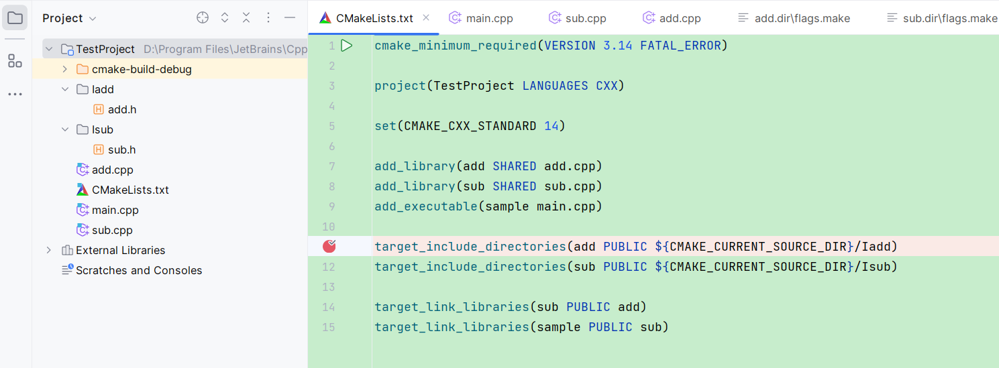

## [CMake的变量定义]([CMake 两种变量原理 - 小北师兄 - 博客园 (cnblogs.com)](https://www.cnblogs.com/ncuneugcj/p/9756324.html))

### 1、**两种变量的定义[参考](https://cmake.org/cmake/help/v3.11/command/set.html)**

- Normal Variables

  通过 `set(<variable> <value>... [PARENT_SCOPE])`这个命令来设置的变量就是 Normal Variables。例如 set(MY_VAL "666") ，此时 MY_VAL 变量的值就是 666。

- Cache Variables

  通过 `set(<variable> <value>... CACHE <type> <docstring> [FORCE])`这个命令来设置的变量就是 Cache Variables。例如 `set(MY_CACHE_VAL "666" CACHE STRING INTERNAL)`，此时 MY_CACHE_VAL 就是一个 CACHE 变量。

### 2、**两种变量的作用域原理及使用**

#### **1、Normal Variables**

 作用域属于整个 CMakeLists.txt 文件，当该文件包含了 `add_subdirectory()、include()、macro()、function()`语句时，会出现两种不同的效果。

##### （1）、**包含 add_subdirectory()、function()**。（本质是值拷贝）

假设，我们在工程根目录 CMakeLists.txt 文件中使用 add_subdirectory(src) 包含另一个 src 目录，在 src 目录中有另一个 CMakeLists.txt 文件。在终端运行的目录结构如下：

```shell
$ tree
.
├── CMakeLists.txt
└── src
    └── CMakeLists.txt

1 directory, 2 files
```

以根目录 CMake 文件为父目录，src 目录为子目录，此时子目录 CMake 文件会拷贝一份父目录文件的 Normal 变量。需要说明的是，我们在子目录中如果想要修改父目录 CMake 文件包含的 Normal 变量。必须通过 set(... PARENT_SCOPE) 的方式。下面通过例子来说明。

在父/根目录的 CMakeLists.txt 文件内容如下:

```cmake
cmake_minimum_required(VERSION 3.10)
message("父目录 CMakeLists.txt 文件")
set(MY_VAL "666")

message("第一次在父目录 MY_VAL=${MY_VAL}")
add_subdirectory(src) 
message("第二次在父目录，MY_VAL=${MY_VAL}")
```

在子目录 src/CMakeLists.txt 文件内容如下：

```cmake
cmake_minimum_required(VERSION 3.10)
message("进入子目录 src/CMakeLists.txt 文件")
message("在子目录，MY_VAL=${MY_VAL}")
message("退出子目录")
```

运行结果：

```shell
$ cmake .
父目录 CMakeLists.txt 文件
第一次在父目录 MY_VAL=666
进入子目录 src/CMakeLists.txt 文件
在子目录，MY_VAL=666
退出子目录
第二次在父目录，MY_VAL=666
```

从结果可以看出，在子目录 CMake 文件中可以直接使用父目录定义的 MY_VAL 变量的值 666。当在子目录 CMake 文件中修改 MY_VAL 变量值，看看在父目录中 MY_VAL 的值如何变化。下面仅仅在子目录 CMake 文件中加入一行代码 `set(MY_VAL "777")`,最后的子目录 CMake 文件代码如下：

```cmake
cmake_minimum_required(VERSION 3.10)
message("进入子目录 src/CMakeLists.txt 文件")
set(MY_VAL "777") # 刚刚加入的

message("在子目录，MY_VAL=${MY_VAL}")
message("退出子目录")
```

运行结果：

```shell
$ cmake .
父目录 CMakeLists.txt 文件
第一次在父目录 MY_VAL=666
进入子目录 src/CMakeLists.txt 文件
在子目录，MY_VAL=777
退出子目录
第二次在父目录，MY_VAL=666
```

我们发现在 src/CMakeLists.txt 中打印的 MY_VAL 的值是 777，然后退出子目录回到根目录后，打印 MY_VAL 的值仍然是 666。这就说明了：子目录的 CMakeLists.txt 文件仅仅是拷贝了一份父目录的 Normal 变量，即使在子目录 CMake 文件中修改了 MY_VAL 变量，那也只是子目录自己的变量，不是父目录的变量。因为 Normal 变量的作用域就是以 CMakeLists.txt 文件为基本单元。那么我们如何在子目录 CMake 文件中修改父目录 CMake 文件的 Normal 变量呢? 我们需要在子目录 CMakeLists.txt 文件中设置 MY_VAL 时，加上 PARENT_SCOPE 属性。即用如下代码: `set(MY_VAL "777" PARENT_SCOPE)`，子目录 CMakeLists.txt 文件如下：

```cmake
cmake_minimum_required(VERSION 3.10)
message("进入子目录 src/CMakeLists.txt 文件")
set(MY_VAL "777" PARENT_SCOPE) # 修改处

message("在子目录，MY_VAL=${MY_VAL}")
message("退出子目录")
```

运行结果:

```shell
$ cmake .
父目录 CMakeLists.txt 文件
第一次在父目录 MY_VAL=666
进入子目录 src/CMakeLists.txt 文件
在子目录，MY_VAL=666
退出子目录
第二次在父目录，MY_VAL=777
```

可以看出在第二次回到父目录时，MY_VAL 的值已经变成了 777。**同理**，对于 function() 最开始的结论也适用。代码如下：

```cmake
cmake_minimum_required(VERSION 3.10)
message("父目录 CMakeLists.txt 文件")
set(MY_VAL "666")

message("第一次在父目录 MY_VAL=${MY_VAL}")

# 函数定义
function(xyz test_VAL) # 函数定义处！
 set(MY_VAL "888" PARENT_SCOPE)
 message("functions is MY_VAL=${MY_VAL}")
endfunction(xyz)

xyz(${MY_VAL}) # 调用函数
message("第二次在父目录，MY_VAL=${MY_VAL}")
```

运行结果:

```shell
父目录 CMakeLists.txt 文件
第一次在父目录 MY_VAL=666
functions is MY_VAL=666
第二次在父目录，MY_VAL=888
```

可以看出在该函数中使用 MY_VAL 这个变量值，其实就是一份父目录变量的值拷贝，此时打印值为 666。在 函数中修改值，那么也是用 set(${MY_VAL} 888 PARENT_SCOPE)。此时，退出函数第二次打印变量值时。该值就是在函数中修改好的值 888。 **本质讲**，对于 function() 而言，刚刚说到的父目录其实不是严格正确的。因为函数定义可以是在其他 .cmake 模块文件中定义的。也可以在其他 CMakeLists.txt 文件中调用，因此准确的说，这里的父目录应该改为『调用函数的地方所属的 CMakeLists.txt 』，我们做的这个实验是在根目录 CMakeLists.txt 文件中定义了函数，又在本文件中使用了。因此之前的说法理解其意思即可。对于 add_subdirectory() 而言，其实也是说调用的地方。下面的 include()、macro() 例子会涉及到，将 function() 放在一个外部的 .cmake 文件中。那里也会说明 function() 与 macro() 的不同。

##### （2）、**包含 include()、macro() **（本质有点类似 c 中的 #include 预处理含义）

现在在上面的根目录中加入了一个 cmake_modules 目录。目录中有一个 Findtest.cmake 文件。新的目录结构如下:

```shell
$ tree
.
├── CMakeLists.txt
├── cmake_modules
│   └── Findtest.cmake
└── src
    └── CMakeLists.txt

2 directories, 3 files
```

在根目录中的 CMakeLists.txt 文件包含的代码如下:

```cmake
cmake_minimum_required(VERSION 3.10)
message("父目录 CMakeLists.txt 文件")
set(MY_VAL "666")
message("第一次在父目录 MY_VAL=${MY_VAL}")

# 使用 include() 文件的宏
list(APPEND CMAKE_MODULE_PATH ${PROJECT_SOURCE_DIR}/cmake_modules) 
include(Findtest) # 从 CMAKE_MODULE_PATH 包含的路径中搜索 Findtest.cmake 文件
#test(${MY_VAL}) # 调用宏
#xyz(${MY_VAL}) # 调用函数

#find_package(test REQUIRED) # 从 CMAKE_MODULE_PATH 包含的路径中搜索 Findtest.cmake 文件 与 include () 两者的效果是一样的！

message("第二次在父目录，MY_VAL=${MY_VAL}")

message("include test=${test_VAL}") 
#message("macro_val=${macro_val}")
```

cmake_modules/Findtest.cmake 文件内容如下:

```cmake
# 该文件定义了一个函数以及一个宏
message("进入 Findtest.cmake 文件")

set(test_VAL "222") # 验证根目录 CMake 文件能够访问这个变量
set(MY_VAL "000") # 测试 include() 效果

# 宏定义
macro(test MY_VA) # 定义一个宏！
 set(macro_val "1") # 宏内部定义变量
 message("macro is MY_VAL=${MY_VA}")
 set(MY_VAL "999") # 直接修改的就是调用该宏所处的文件中的 Normal 变量
endmacro(test)

# 函数定义
function(xyz test_VAL)
 set(MY_VAL "888" PARENT_SCOPE)  # 修改 调用者的 变量
 message("function is MY_VAL=${MY_VAL}")
endfunction(xyz)
```

运行结果：

```shell
$ cmake .
父目录 CMakeLists.txt 文件
第一次在父目录 MY_VAL=666
进入 Findtest.cmake 文件
第二次在父目录，MY_VAL=000
include test=222
```

从结果可以看出，include() 内部是可以修改调用者 MY_VAL 变量。include() 包含的文件内定义的变量 test_VAL，也可以在调用 include() 的 CMakeLists.txt 文件中直接访问，同样的对于 macro() 也适用，在根目录 CMake 文件中调用宏，即取消 test(MYVAL)以及message("macroval=MYVAL)以及message("macroval={macro_val}") 部分的注释，此时最后输出结果 ：

```shell
$ cmake .
父目录 CMakeLists.txt 文件
第一次在父目录 MY_VAL=666
进入 Findtest.cmake 文件
macro is MY_VAL=000
第二次在父目录，MY_VAL=999
include test=222
macro_val=1
```

可以看出，这次输出的结果在第二次进入父目录后，MY_VAL 变量的值就是 999 了。注意到在根目录中 CMakeLists.txt 中 注释语句中有一个 find_package() ，这个和 include() 其实都是一样的结果。

**总结**:

结合 include() 、macro() 最后结果，能够得出一个结论：通过 include() 和 macro() 相当于把这两部分包含的代码直接加入根目录 CMakeLists.txt 文件中去执行，相当于他们是一个整体。因此变量直接都是互通的。这就有点像 C/C++ 中的 #include 包含头文件的预处理过程了。这一点其实与刚开始讲的 function() 、add_subdirectory() 完全不同，在函数以及 add_subdirectory() 中，他们本身就是一个不同的作用域范围，仅仅通过拷贝调用者的 Normal 值(仅仅在调用 add_subdirectory() / function() 之前的 Normal 变量)，如果要修改调用者包含的 Normal 变量，那么只能通过 `set(MY_VAL "某个值" PARENT_SCOPE)`注明我们修改的是调用者 Normal 值。虽然在 C/C++ 中，可以通过指针的方式，通过函数可以修改外部变量值，但是在 CMake 脚本语言中 function() 虽然能够传入形式参数，但是者本质上就是 C/C++ 中的值拷贝。而不是引用。上面所说的 Normal 变量其实就是一个局部变量。

#### 2、**Cache Variables**

相当于一个全局变量，我们在同一个 cmake 工程中都可以使用。Cache 变量有以下几点说明:

- Cache 变量 CMAKE_INSTALL_PREFIX 默认值是 /usr/local (可以在生成的 CMakeCache.txt 文件中查看)，这时候如果我们 在某个 CMakeLists.txt 中，仍然使用 set(CMAKE_INSTALL_PREFIX "/usr")，那么此时我们 install 的时候，CMake 以后面的 /usr 作为 CMAKE_INSTALL_PREFIX 的值，这是因为 CMake 规定，有一个与 Cache 变量同名的 Normal 变量出现时，后面使用这个变量的值都是以 Normal 为准，如果没有同名的 Normal 变量，CMake 才会自动使用 Cache 变量。
- 所有的 Cache 变量都会出现在 CMakeCache.txt 文件中。这个文件是我们键入 `cmake .`命令后自动出现的文件。打开这个文件发现，CMake 本身会有一些默认的全局 Cache 变量。例如：CMAKE_INSTALL_PREFIX、CMAKE_BUILD_TYPE、CMAKE_CXX_FLAGSS 等等。可以自行查看。当然，我们自己定义的 Cache 变量也会出现在这个文件中。Cache 变量定义格式为 `set(<variable> <value> CACHE STRING INTERNAL)`。这里的 `STRING`可以替换为 `BOOL` `FILEPATH` `PATH` ，但是要根据前面 value 类型来确定。[参考](https://cmake.org/cmake/help/v3.11/command/set.html#set-cache-entry)。
- 修改 Cache 变量。可以通过 `set(<variable> <value> CACHE INSTERNAL FORCE)`，另一种方式是直接在终端中使用 `cmake -D var=value ..`来设定默认存在的CMake Cache 变量。

下面通过一个例子来说明以上三点:

首先看一下目录树结构:

```shell
$ tree
.
├── CMakeLists.txt
└── src
    └── CMakeLists.txt

1 directory, 2 files
```

根目录 CMakeLists.txt 文件内容如下:

```cmake
cmake_minimum_required(VERSION 3.10)
set(MY_GLOBAL_VAR "666" CACHE STRING INTERNAL )
message("第一次在父目录 CMAKE_INSTALL_PREFIX=${CMAKE_INSTALL_PREFIX}")
message("第一次在父目录 MY_GLOBAL_VAR=${MY_GLOBAL_VAR}")
add_subdirectory(src)
message("第二次在父目录 CMAKE_INSTALL_PREFIX=${CMAKE_INSTALL_PREFIX}")
message("第二次在父目录 MY_GLOBAL_VAR=${MY_GLOBAL_VAR}")
set(CMAKE_INSTALL_PREFIX "-->usr" )
message("第三次在父目录 CMAKE_INSTALL_PREFIX=${CMAKE_INSTALL_PREFIX}")
```

src/CMakeLists.txt 文件内容如下:

```cmake
cmake_minimum_required(VERSION 3.10)
message("子目录,CMAKE_INSTALL_PREFIX=${CMAKE_INSTALL_PREFIX}")
message("子目录,MY_GLOBAL_VAR=${MY_GLOBAL_VAR}")
set(CMAKE_INSTALL_PREFIX "/usr" CACHE STRING INTERNAL FORCE)
set(MY_GLOBAL_VAR "777" CACHE STRING INTERNAL FORCE )
 复制 全屏
```

运行结果:

```shell
$ cmake .
第一次在父目录 CMAKE_INSTALL_PREFIX=/usr/local
第一次在父目录 MY_GLOBAL_VAR=666
子目录,CMAKE_INSTALL_PREFIX=/usr/local
子目录,MY_GLOBAL_VAR=666
第二次在父目录 CMAKE_INSTALL_PREFIX=/usr
第二次在父目录 MY_GLOBAL_VAR=777
第三次在父目录 CMAKE_INSTALL_PREFIX=-->usr
```

*程序说明*：首先在根目录中打印一下当前的 Cache 变量 CMAKE_INSTALL_PREFIX 值，主要看看默认值是什么，然后在子目录 src/CMakeLists.txt 中再次打印和修改该 Cache 值，目的是熟悉修改全局 Cache 变量，当返回根目录 CMakeLists.txt 文件中再次执行第二次打印该 Cache 值时，主要看一看在子目录中修改后的效果。接着在根目录中设定一个 CMAKE_INSTALL_PREFIX 的 Normal 同名变量，此时第三次打印 CMAKE_INSTALL_PREFIX 的值，此时是为了证明，当有与 Cache 同名的 Normal 变量出现时，CMake 会优先使用 Normal 属性的值。通过设定 MY_GLOBAL_VAR 主要是为了说明可以自己设定全局 Cache 变量。最后的结果如上面显示，当我们再次执行 `cmake .` 的时候，程序结果如下:

```shell
$ cmake .
第一次在父目录 CMAKE_INSTALL_PREFIX=/usr
第一次在父目录 MY_GLOBAL_VAR=777
子目录,CMAKE_INSTALL_PREFIX=/usr
子目录,MY_GLOBAL_VAR=777
第二次在父目录 CMAKE_INSTALL_PREFIX=/usr
第二次在父目录 MY_GLOBAL_VAR=777
第三次在父目录 CMAKE_INSTALL_PREFIX=-->usr
```

可以发现第一次在父目录打印 CMAKE_INSTALL_PREFIX 和 MY_GOLBAL_VAR 时，他们的结果是上次`cmake .`后生成的值，存储在 CMakeCache.txt 中，自己可以找到，解决方案就是可以把 CMakeCache.txt 文件删除，然后在 `cmake .`我们以后在实际使用时要注意这个坑。对于修改 Cache 变量的另一种方式就是`cmake -D CMAKE_INSTALL_PREFIX=/usr`。可以自己验证。这里说一个**重要的点**，就是在终端中输入的 `cmake -D var=value .` 如果 CMake 中默认有这个 var Cache 变量，那么此时就是赋值，没有的话，CMake 就会默认创建了一个全局 Cache 变量然后赋值。(tips: `$CACHE{VAR}`表示获取 CACHE 缓存变量的值)。例子如下:(目录结构同上)

根目录 CMakeLists.txt :

```cmake
cmake_minimum_required(VERSION 3.10)
set(MY_GLOBAL_VAR "666")
message("第一次在父目录 MY_GLOBAL_VAR=$CACHE{MY_GLOBAL_VAR}")
add_subdirectory(src)
message("第二次在父目录局部 MY_GLOBAL_VAR=${MY_GLOBAL_VAR}")
message("第二次在父目录全局 MY_GLOBAL_VAR=$CACHE{MY_GLOBAL_VAR}")
```

src/CMakeLists.txt :

```cmake
cmake_minimum_required(VERSION 3.10)
message("子目录,MY_GLOBAL_VAR=${MY_GLOBAL_VAR}")
set(MY_GLOBAL_VAR "777" CACHE STRING INTERNAL FORCE )
```

运行结果：

```shell
第一次在父目录 MY_GLOBAL_VAR=8
子目录,MY_GLOBAL_VAR=666
第二次在父目录局部 MY_GLOBAL_VAR=666
第二次在父目录全局 MY_GLOBAL_VAR=777
```

有了上面的基础，相信这个例子很快能看明白。


## [cmake命令用法整理list命令](https://blog.csdn.net/gubenpeiyuan/article/details/51201871)

用途：提供一些列表操作

list(LENGTH <list><output variable>)
list(GET <list> <elementindex> [<element index> ...] <output variable>)
list(APPEND <list><element> [<element> ...])
list(FIND <list> <value><output variable>)
list(INSERT <list><element_index> <element> [<element> ...])
list(REMOVE_ITEM <list> <value>[<value> ...])
list(REMOVE_AT <list><index> [<index> ...])
list(REMOVE_DUPLICATES <list>)
list(REVERSE <list>)
list(SORT <list>)

LENGTH返回列表的长度

GET返回列表中指定下标的元素

APPEND添加新元素到列表中

INSERT 将新元素插入到列表中指定的位置

REMOVE_ITEM从列表中删除某个元素

REMOVE_AT从列表中删除指定下标的元素

REMOVE_DUPLICATES从列表中删除重复的元素

REVERSE 将列表的内容实地反转，改变的是列表本身，而不是其副本

SORT 将列表按字母顺序实地排序，改变的是列表本身，而不是其副本

列表的子命令APPEND, INSERT, REMOVE_AT, REMOVE_ITEM,REMOVE_DUPLICATES, REVERSE以及SORT在当前的CMake变量域创建一些新值。与SET命令类似，即使列表本身是在父域中定义的，LIST命令也只会在当前域创建新的变量值，为了将这些操作的结果向上传递，需要通过SET PARENT_SCOPE， SET CACHE INTERNAL或其他值域扩展的方法。

注意：cmake中的列表是以分号隔开的一组字符串。可以使用set命令创建一个列表。例如：set(var a b c d e)创建了一个这样的列表：a;b;c;d;e。 set(var “a b c d e”)创建了一个字符串或只有一个元素的列表。

当指定索引值时，<element index>为大于或等于0的值。它从列表的开始处索引，0代表列表的第一个元素。如果<element index>为小于或等于-1的值，它从列表的结尾处索引，-1代表列表的最后一个元素。


当使用aux_source_directory获取文件列表时，如果需要只需要特定的部分文件，有两个方案：

1. Use file (GLOB ... instead of aux_source_directory with a globbing expression that does not match that one file but includes all the others, e.g.:

file(GLOB _srcFiles "src/f[1-3].cpp")
This will match match files f1.cpp, f2.cpp, f3.cpp, but not f4.cpp.

2. Or use aux_source_directory and then remove the file to be excluded explicitly with a list(REMOVE_ITEM command, e.g.:

aux_source_directory(src _srcFiles)
list(REMOVE_ITEM _srcFiles "src/f4.cpp")

备注：　在　list remove 的时候，字符串一定要保持一致，使用　MESSAGE(STATUS xxx) 打印出来，是个不错的选择。

## [CMAKE 里PRIVATE、PUBLIC、INTERFACE属性](https://blog.csdn.net/weixin_43862847/article/details/119762230)

工程结构：



add.h/add.cpp：

```cpp
//add.h
#ifndef TESTPROJECT_ADD_H
#define TESTPROJECT_ADD_H

int add(int a, int b);

#endif //TESTPROJECT_ADD_H

//add.cpp
#include "add.h"

int add(int a, int b) {
    return a + b;
}

```

sub.h/sub.cpp：

```cpp
//sub.h
#ifndef TESTPROJECT_SUB_H
#define TESTPROJECT_SUB_H

int sub(int a, int b);

#endif //TESTPROJECT_SUB_H

//sub.cpp
#include "sub.h"

int sub(int a, int b) {
    return a - b;
}
```

main.cpp：

```cpp
#include <iostream>
#include <memory>
#include "add.h"
#include "sub.h"

int main() {
    auto s = std::make_unique<int>(10);
    std::cout << "hello, world" << std::endl;
    return EXIT_SUCCESS;
}
```

CMakeLists.txt：

```cmake
cmake_minimum_required(VERSION 3.14 FATAL_ERROR)

project(TestProject LANGUAGES CXX)

set(CMAKE_CXX_STANDARD 14)

add_library(add SHARED add.cpp)
add_library(sub SHARED sub.cpp)
add_executable(sample main.cpp)

target_include_directories(add PUBLIC ${CMAKE_CURRENT_SOURCE_DIR}/Iadd)
target_include_directories(sub PUBLIC ${CMAKE_CURRENT_SOURCE_DIR}/Isub)

target_link_libraries(sub PUBLIC add)
target_link_libraries(sample PUBLIC sub)
```

### PUBLIC传播

这里我们sample（main） 只link sub库，不做另外的include_directories操作，sub在另外link add库做链接库和头文件库传递给sample。

```cmake
//Iadd里面的头文件可以传递给连接add的target，头文件传播 
target_include_directories(add PUBLIC ${CMAKE_CURRENT_SOURCE_DIR}/Iadd)
//Isub的头文件传递给连接sub库的target，头文件传播 
target_include_directories(sub PUBLIC ${CMAKE_CURRENT_SOURCE_DIR}/Isub)
//sub连接add库，连接sub的库也将连接add，连接库传播（含头文件） 
target_link_libraries(sub PUBLIC add)
// sample 连接sub
target_link_libraries(sample PUBLIC sub)  //无视，因为属于最尾子节点，没有下一级来传播
```

通过这样的定义，可以看下cmake-build-debug/CMakeFiles/xxx.dir里生成的语句。（每个xxx是CMake文件里定义的目标）

add.dir里的flags.make：

```makefile
# CMAKE generated file: DO NOT EDIT!
# Generated by "Unix Makefiles" Generator, CMake Version 3.26

# compile CXX with /usr/bin/c++.exe
CXX_DEFINES = -Dadd_EXPORTS

CXX_INCLUDES = -I"/cygdrive/d/Program Files/JetBrains/CppProject/TestProject/Iadd"

CXX_FLAGS = -g -std=gnu++14 -fdiagnostics-color=always
```

add.dir里的build.make：

```makefile
/usr/bin/c++.exe $(CXX_DEFINES) $(CXX_INCLUDES) $(CXX_FLAGS) -MD -MT CMakeFiles/add.dir/add.cpp.o -MF CMakeFiles/add.dir/add.cpp.o.d -o CMakeFiles/add.dir/add.cpp.o -c "/cygdrive/d/Program Files/JetBrains/CppProject/TestProject/add.cpp"
```

sub.dir里的flags.make：

```makefile
# CMAKE generated file: DO NOT EDIT!
# Generated by "Unix Makefiles" Generator, CMake Version 3.26

# compile CXX with /usr/bin/c++.exe
CXX_DEFINES = -Dsub_EXPORTS

CXX_INCLUDES = -I"/cygdrive/d/Program Files/JetBrains/CppProject/TestProject/Isub" -I"/cygdrive/d/Program Files/JetBrains/CppProject/TestProject/Iadd"

CXX_FLAGS = -g -std=gnu++14 -fdiagnostics-color=always
```

sub.dir里的build.make：

```makefile
/usr/bin/c++.exe $(CXX_DEFINES) $(CXX_INCLUDES) $(CXX_FLAGS) -MD -MT CMakeFiles/sub.dir/sub.cpp.o -MF CMakeFiles/sub.dir/sub.cpp.o.d -o CMakeFiles/sub.dir/sub.cpp.o -c "/cygdrive/d/Program Files/JetBrains/CppProject/TestProject/sub.cpp"
```

sample.dir里的flags.make：

```makefile
# CMAKE generated file: DO NOT EDIT!
# Generated by "Unix Makefiles" Generator, CMake Version 3.26

# compile CXX with /usr/bin/c++.exe
CXX_DEFINES = 

CXX_INCLUDES = -I"/cygdrive/d/Program Files/JetBrains/CppProject/TestProject/Isub" -I"/cygdrive/d/Program Files/JetBrains/CppProject/TestProject/Iadd"

CXX_FLAGS = -g -std=gnu++14 -fdiagnostics-color=always
```

sample.dir里的build.make：

```makefile
/usr/bin/c++.exe $(CXX_DEFINES) $(CXX_INCLUDES) $(CXX_FLAGS) -MD -MT CMakeFiles/sample.dir/main.cpp.o -MF CMakeFiles/sample.dir/main.cpp.o.d -o CMakeFiles/sample.dir/main.cpp.o -c "/cygdrive/d/Program Files/JetBrains/CppProject/TestProject/main.cpp"
```

可以看到定义了PUBLIC传播后，头文件搜索路径里就会对外传播出去，在-I中包含进来。

### PRIVATE传播

将所有PUBLIC，改为PRIVATE，再次构建，查看对应的生成语句。

```cmake
cmake_minimum_required(VERSION 3.14 FATAL_ERROR)

project(TestProject LANGUAGES CXX)

set(CMAKE_CXX_STANDARD 14)

add_library(add SHARED add.cpp)
add_library(sub SHARED sub.cpp)
add_executable(sample main.cpp)

target_include_directories(add PRIVATE ${CMAKE_CURRENT_SOURCE_DIR}/Iadd)
target_include_directories(sub PRIVATE ${CMAKE_CURRENT_SOURCE_DIR}/Isub)

target_link_libraries(sub PRIVATE add)
target_link_libraries(sample PRIVATE sub)
```

add.dir里的flags.make：

```makefile
# CMAKE generated file: DO NOT EDIT!
# Generated by "Unix Makefiles" Generator, CMake Version 3.26

# compile CXX with /usr/bin/c++.exe
CXX_DEFINES = -Dadd_EXPORTS

CXX_INCLUDES = -I"/cygdrive/d/Program Files/JetBrains/CppProject/TestProject/Iadd"

CXX_FLAGS = -g -std=gnu++14 -fdiagnostics-color=always
```

sub.dir里的flags.make，**这里只有sub自己定义的包含目录**：

```makefile
# CMAKE generated file: DO NOT EDIT!
# Generated by "Unix Makefiles" Generator, CMake Version 3.26

# compile CXX with /usr/bin/c++.exe
CXX_DEFINES = -Dsub_EXPORTS

CXX_INCLUDES = -I"/cygdrive/d/Program Files/JetBrains/CppProject/TestProject/Isub"

CXX_FLAGS = -g -std=gnu++14 -fdiagnostics-color=always
```

sample.dir里的flags.make，**这里没有任何包含目录**：

```cmake
# CMAKE generated file: DO NOT EDIT!
# Generated by "Unix Makefiles" Generator, CMake Version 3.26

# compile CXX with /usr/bin/c++.exe
CXX_DEFINES = 

CXX_INCLUDES = 

CXX_FLAGS = -g -std=gnu++14 -fdiagnostics-color=always
```

再修改CMakeLists.txt，如下：

```cmake
target_include_directories(add PRIVATE ${CMAKE_CURRENT_SOURCE_DIR}/Iadd)  #这里已经是PRIVATE了，无法向外传播
target_include_directories(sub PRIVATE ${CMAKE_CURRENT_SOURCE_DIR}/Isub)

target_link_libraries(sub PUBLIC add)  # 这里定义了PUBLIC也没用，sub.dir里flags.make只有Isub目录
target_link_libraries(sample PUBLIC sub)  # 这里定义了PUBLIC也没用
```

再修改CMakeLists.txt，如下：

```cmake
target_include_directories(add PUBLIC ${CMAKE_CURRENT_SOURCE_DIR}/Iadd)
target_include_directories(sub PUBLIC ${CMAKE_CURRENT_SOURCE_DIR}/Isub)

target_link_libraries(sub PRIVATE add)  # sub.dir里flags.make有Isub和Iadd
target_link_libraries(sample PRIVATE sub)  # sample.dir里的flags.make只有Isub目录
```

**所以PUBLIC和PRIVATE不影响当前目标，影响的是当前目标给下一个目标的传播范围。**

### INTERFACE传播

INTERFACE比较特殊，它是指给链接者提供**接口**，而被链接者不对该**接口**做调用。

```cmake
target_include_directories(add INTERFACE ${CMAKE_CURRENT_SOURCE_DIR}/Iadd)
target_include_directories(sub INTERFACE ${CMAKE_CURRENT_SOURCE_DIR}/Isub)

target_link_libraries(sub INTERFACE add)
target_link_libraries(sample PUBLIC sub)  # PRIVATE也可以，这里影响的SAMPLE给后续对象的传播
```

add.dir里的flags.make：

```makefile
CXX_INCLUDES = 
```

sub.dir里的flags.make：

```makefile
CXX_INCLUDES = 
```

sample.dir里的flags.make，PUBLIC链接sub：

```makefile
CXX_INCLUDES = -I"/cygdrive/d/Program Files/JetBrains/CppProject/TestProject/Isub" -I"/cygdrive/d/Program Files/JetBrains/CppProject/TestProject/Iadd"
```

再看下面的CMakeLists.txt：

```cmake
target_include_directories(add INTERFACE ${CMAKE_CURRENT_SOURCE_DIR}/Iadd)
target_include_directories(sub INTERFACE ${CMAKE_CURRENT_SOURCE_DIR}/Isub)

target_link_libraries(sub PUBLIC add)
target_link_libraries(sample PUBLIC sub)
```

add.dir里的flags.make：

```makefile
CXX_INCLUDES = 
```

sub.dir里的flags.make，这里没有Isub（因为Isub是INTERFACE，无法给sub调用），只有Iadd，因为add是链接者sub提供接口：

```makefile
CXX_INCLUDES = -I"/cygdrive/d/Program Files/JetBrains/CppProject/TestProject/Iadd"
```

sample.dir里的flags.make，Isub是链接sub的INTERFACE引入的，Iadd是sub对add的PUBLIC传播引入的：

```makefile
CXX_INCLUDES = -I"/cygdrive/d/Program Files/JetBrains/CppProject/TestProject/Isub" -I"/cygdrive/d/Program Files/JetBrains/CppProject/TestProject/Iadd"
```

再看下面的CMakeLists.txt：

```cmake
target_include_directories(add INTERFACE ${CMAKE_CURRENT_SOURCE_DIR}/Iadd)
target_include_directories(sub INTERFACE ${CMAKE_CURRENT_SOURCE_DIR}/Isub)

target_link_libraries(sub PRIVATE add)
target_link_libraries(sample PUBLIC sub)
```

add.dir里的flags.make和sub.dir里的flags.make都和上例一样。

sample.dir里的flags.make，Isub是链接sub的INTERFACE引入的，sub对add是PRIVATE传播，无法带给sample：

```makefile
CXX_INCLUDES = -I"/cygdrive/d/Program Files/JetBrains/CppProject/TestProject/Isub"
```

### 总结

target_include_directories里面的关键字控制头文件目录传递。

target_link_libraries里的关键字控制头文件目录以及链接库传递。

* PUBLIC：对内对外都公开，可将头文件目录以及链接库传递给连接者。
* PRIVATE：对内公开，对外不公开，不可传递头文件目录以及链接库。
* INTERFACE：对外公开，对内不公开，可传递头文件目录以及链接库，但内部不可使用头文件及链接库，只能接口传递。


## [编译选项compile_options的设置](https://www.cnblogs.com/zwlwf/p/17433233.html)

首先有个小示例

```cmake
project(test_compile_option)
cmake_minimum_required(VERSION 3.14)
set(CMAKE_EXPORT_COMPILE_COMMANDS on)
add_compile_options(-Wall)
add_executable(app a.c)
target_compile_options(app PRIVATE "-g")
set(CMAKE_C_FLAGS "-g2")
```

可以看到compile_commands.json中的命令为，

```json
  "command": "/usr/bin/cc   -g2 -Wall -g -o CMakeFiles/app.dir/a.c.o -c /home/zwl/work/daily/2023-05-25/a.c",
```

这里通过三种方法引入了三个编译参数：

### 1. add_compile_options

-- 这是方式是给这条命令后出现的target( add_executable/add_library ), 统一添加编译参数，
使用时需要注意，**一定要在target的申明的前面，放在后面不生效**。
-- 这个命令的参数添加效果为叠加式，如下会引入编译参数`-Wall -Wall2`.

```cmake
add_compile_options(-Wall)
add_compile_options(-Wall2)
```

### 2. target_compile_options

-- 相比前面`add_compile_options`, 这个命令不同点主要有两个。一是，在target**申明后用**，二是，这个命令作用于特定的target，而不是对所有的target生效
-- 这个命令的参数添加效果同上，为叠加式

### 3. 设置CMAKE_C_FLAGS和CMAKE_CXX_FLAGS

-- 本质是操作全局变量，通过set命令完成，是否为叠加取决于使用方式，`set(CMAKE_C_FLAGS "-g")` 为非叠加方式， `set(CMAKE_C_FLAGS "${CMAKE_C_FLAGS} -g")`为叠加式，
-- 这个全局变量在拼接最后的编译命令时最先使用。
-- 这个变量仅限于C语言，C++对应`CMAKE_CXX_FLAGS`, 两者分离。


## [常用警告选项](https://blog.csdn.net/jjjstephen/article/details/130773977)

警告选项:-Wall、-Wextra和-Wpedantic

* -Wall：表示开启所有警告信息。具体来说，编译器会生成所有可能的警告信息，包括一些可能会被忽略的警告信息。开启-Wall选项可以帮助开发者发现潜在的问题，提高代码的质量和可靠性。但是，由于-Wall会生成大量的警告信息，有时候会影响开发效率，因此需要根据具体情况来决定是否开启该选项。

* -Wextra：表示开启额外的警告信息。具体来说，编译器会生成一些不属于-Wall选项的警告信息，例如一些不符合标准的代码风格、一些未使用的变量等。同理，开启-Wextra选项可以帮助开发者发现更多的潜在问题，提高代码的质量和可靠性。但是，由于-Wextra会生成更多的警告信息，有时候会影响开发效率，因此需要根据具体情况来决定是否开启该选项。

* -Wpedantic：表示开启严格的警告信息。具体来说，编译器会生成一些不符合C或C++标准的代码警告信息，例如使用了不推荐的语法、未定义的行为等。开启-Wpedantic选项可以帮助开发者编写符合标准的代码，提高代码的可移植性和可靠性。同理，由于-Wpedantic会生成更多的警告信息，有时候会影响开发效率，因此需要根据具体情况来决定是否开启该选项。

* -Werror：警告都当成error。

## [生成compile_commands.json](https://www.cnblogs.com/zwlwf/p/17398769.html)

在CMakeLists.txt中加`set(CMAKE_EXPORT_COMPILE_COMMANDS on)`，或者在cmake的命令中加`-DCMAKE_EXPORT_COMPILE_COMMANDS`即可产生compile_commands.json。


# [Quickstart: Building with CMake | GoogleTest](http://google.github.io/googletest/quickstart-cmake.html)

## Cmake下载googletest

样例1：

```cpp
// hello_test.cpp
#include <gtest/gtest.h>

// Demonstrate some basic assertions.
TEST(HelloTest, BasicAssertions) {
// Expect two strings not to be equal.
    EXPECT_STRNE("hello", "world");
// Expect equality.
    EXPECT_EQ(7 * 6, 42);
}

// main.cpp
#include "gtest/gtest.h"

int main(int argc, char *argv[]) {
    testing::InitGoogleTest(&argc, argv);
    return RUN_ALL_TESTS();
}


// CMakeLists.txt
cmake_minimum_required(VERSION 3.26)
project(googletest_project)

set(CMAKE_CXX_STANDARD 17)

#add_executable(googletest_project main_test.cpp)

# GoogleTest requires at least C++14
set(CMAKE_CXX_STANDARD_REQUIRED ON)

include(FetchContent)
FetchContent_Declare(
        googletest
        URL https://github.com/google/googletest/archive/refs/tags/v1.14.0.zip
)
# For Windows: Prevent overriding the parent project's compiler/linker settings
set(gtest_force_shared_crt ON CACHE BOOL "" FORCE)
FetchContent_MakeAvailable(googletest)

enable_testing()

add_executable(
        hello_test
        main_test.cpp
        hello_test.cpp
)
target_link_libraries(
        hello_test
        GTest::gtest_main
)

include(GoogleTest)
gtest_discover_tests(hello_test)
```

运行：

```shell
my_project$ cmake -S . -B build
-- The C compiler identification is GNU 10.2.1
-- The CXX compiler identification is GNU 10.2.1
...
-- Build files have been written to: .../my_project/build

my_project$ cmake --build build
Scanning dependencies of target gtest
...
[100%] Built target gmock_main

my_project$ cd build && ctest
Test project .../my_project/build
    Start 1: HelloTest.BasicAssertions
1/1 Test #1: HelloTest.BasicAssertions ........   Passed    0.00 sec

100% tests passed, 0 tests failed out of 1
```

样例2：

```cmake
// CMakeLists.txt
cmake_minimum_required(VERSION 3.16)
project(gtest_project)

set(CMAKE_CXX_STANDARD 17)

enable_testing()
add_subdirectory(src)
add_subdirectory(test)

// src/CMakeLists.txt
aux_source_directory(. src_files)
list(REMOVE_ITEM src_files "./main.cpp")

set(src_lib src_lib CACHE STRING INTERNAL)
add_library(${src_lib} OBJECT ${src_files})
target_include_directories(${src_lib} PUBLIC ${PROJECT_SOURCE_DIR}/header)

set(src_exe_name main_${PROJECT_NAME})
add_executable(${src_exe_name} main.cpp)
target_link_libraries(${src_exe_name} ${src_lib} pthread)

// test/CMakeLists.txt
option(ENABLE_UNIT_TESTS "Enable unit tests" ON)
message(STATUS "Enable testing: ${ENABLE_UNIT_TESTS}")

if (ENABLE_UNIT_TESTS)
    # the following code to fetch googletest
    # is inspired by and adapted after:
    #   - https://cmake.org/cmake/help/v3.11/module/FetchContent.html
    include(FetchContent)

    FetchContent_Declare(
            googletest
            GIT_REPOSITORY https://gitee.com/antmoc/googletest.git
            GIT_TAG v1.14.0
    )

    FetchContent_GetProperties(googletest)

    if (NOT googletest_POPULATED)
        FetchContent_Populate(googletest)

        # Prevent GoogleTest from overriding our compiler/linker options
        # when building with Visual Studio
        set(gtest_force_shared_crt ON CACHE BOOL "" FORCE)
        # Prevent GoogleTest from using PThreads
        set(gtest_disable_pthreads ON CACHE BOOL "" FORCE)

        # adds the targers: gtest, gtest_main, gmock, gmock_main
        add_subdirectory(${googletest_SOURCE_DIR} ${googletest_BINARY_DIR} EXCLUDE_FROM_ALL)
    endif ()

    aux_source_directory(. test_files)
    #list(REMOVE_ITEM test_files "./test_my_add.cpp")
    #set(test_files test_main.cpp test_my_add.cpp)
    set(test_name test_${PROJECT_NAME})
    add_executable(${test_name} "")
    target_sources(${test_name} PRIVATE ${test_files})
    target_link_libraries(${test_name} PRIVATE ${src_lib} gtest_main gmock_main)

    enable_testing()

    add_test(NAME ${test_name} COMMAND $<TARGET_FILE:${test_name}>)
endif ()
```

目录文件：

```cpp
// test/test_main.cpp
#include "gtest/gtest.h"

int main(int argc, char *argv[]) {
    testing::InitGoogleTest(&argc, argv);
    return RUN_ALL_TESTS();
}

// test/test_solution.cpp
#include "gtest/gtest.h"

using namespace std;

class Solution {
public:
};

class SolutionTest : public testing::Test {
protected:
    Solution solution;
};

TEST_F(SolutionTest, Test1) {
    EXPECT_EQ(1, 1);
}
```


