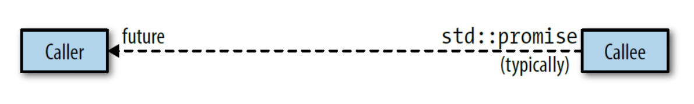
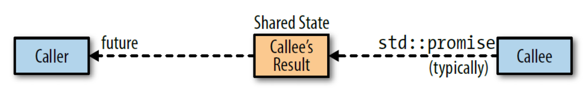

# [《Effective Modern C++》](https://www.kancloud.cn/kangdandan/book/169968)

# 简介

```c++
void someFunc(Widget w);        // someFunc的参数w是以值传送

Widget wid;                     // wid是个Widget的对象

someFunc(wid);                  // 在这个someFunc调用里面，w是通过
                                // 拷贝构造函数生成wid的一个拷贝

someFunc(std::move(wid));       // 在这个someFunc调用里面，w是通过
                                // 移动构造函数生成wid的一个拷贝
```

在一个函数调用里面，在函数的调用方的表达式是函数的实参。这些表达式被用来初始化函数的形参。在上面的代码中的第一次调用`someFunc`，实参是`wid`。在第二次调用的地方，实参是 `std::move(wid)`。两次调用的形参都是`w`。实参和形参的区别是很重要的，**因为形参只能是左值**，但是给他们初始化的实参即有可能是右值也有可能是左值。这和完美转发的过程是密切相关的，在完美转发中一个传递给一个函数的实参再传递给第二个函数，以此来保证原始的参数的右值特性或者左值特性被保留。（完美转发的细节在条款30中）。

本地试验看下例：

```c++
void f2(int&& i) {
    cout << i << endl;
}

int main() {
    int i = 10;
    i = 20;
    f2(i);  // 编译错误，error: cannot bind rvalue reference of type 'int&&' to lvalue of type 'int'

    int&& i2 = 10;  // 右值引用对象在声明后就是一个正常的左值类型对象
    i2 = 20;  // 可以对左值类型对象正常赋值，就像i = 20;一样
    f2(i2);  // 编译错误，error: cannot bind rvalue reference of type 'int&&' to lvalue of type 'int'

    f2(10);
    return 0;
}
```

**通过lambda表达式创造的函数对象通常称之为闭包（closure）**。通常很少区分lambda表达式和它产生的闭包，我通常用lambdas来代指它们。类似的，我很少区分函数模板（生成函数的模板）和模板函数（利用函数模板生成的函数）。对于类模板和模板类也是如此。

```c++
extern int x;                   // 对象声明

class Widgets;                  // class声明

bool func(const Widget& w);     // 函数声明

enum class Color;               // 被作用域包裹的enum声明（参考条款10）
```

我指一个**函数的签名是由函数的参数和返回值确定的**。函数和参数的名字并不是函数签名的一部分。在上述代码中，`func`的签名是`bool(const Widget&)`。函数声明的组成部分除了他的参数和返回值（比如如果有`noexcept`或者`constexpr`）都被排除在外。（`noexcept`和`constexpr`在条款14和条款15中被讨论）。正式的“签名”的定义和我的略有出入。但对于这本书来说，我的定义会非常有用。（正式的定义会排除返回值类型）。

我把**直接从new返回的原始指针叫做内建指针**。**一个原始指针的反义词就是智能指针**。智能指针通常重载了指针取值运算符（`operator->`和`operator*`），在条款20里面会解释`std::weak_ptr`是个特殊情况。

在源码注释里面，我通常把“构造函数”简称为ctor，“析构函数”简称为dtor。

# 第一章 类型推导

C++98只有一种类型推导规则：函数模板。C++11修改了一点规则样本，并且添加额外的两条规则，一条是`auto`，另一个是`decltype`。C++14继续扩展了`auto`和`decltype`的使用情况。

在类型推导过程中有太多的上下文判断，在大多数情况，`auto`出现在调用函数模板时，在`decltype`表达式里面，和在C++14中，神秘的`decltype(auto)`构造。

## 条款1：理解模板类型推导

一段函数模板看起来会是这样：

```c++
template<typename T>
void f(ParamType param);
```

`T`的类型不仅和`expr`的类型独立，而且还和`ParamType`的形式独立。下面是三个例子：

- `ParamType`是一个指针或者是一个引用类型，但并不是一个通用的引用类型（通用的引用类型的内容在条款24。此时，你要知道例外情况会出现的，他们的类型并不和左值应用或者右值引用）。
- `ParamType`是一个通用的引用
- `ParamType`既不是指针也不是引用

这样的话，我们就有了三种类型需要检查的类型推导场景。每一种都是基于我们队模板的通用的调用封装：

```c++
template<typename T>
void f(ParamType param);

f(expr);					// 从expr推导出T和ParamType的类型
```

### **第一种情况**：`ParamType`是个非通用的引用或者是一个指针

最简单的情况是**当`ParamType`是一个引用类型或者是一个指针**，但并非是通用的引用。在这种情况下，类型推导的过程如下：

1. **如果`expr`的类型是个引用，忽略引用的部分**。（或如果expr的类型是个指针，忽略指针的部分。）
2. 然后利用`expr`的类型和`ParamType`对比去判断`T`的类型。

举一个例子，如果这个是我们的模板，

```c++
template<typename T>
void f(T& param);           // param是一个引用类型
```

我们有这样的代码变量声明：

```c++
int x = 27;                 // x是一个int
const int cx = x;           // cx是一个const int
const int& rx = x;          // rx是const int的引用
```

`param`和`T`在不同的调用下面的类型推导如下：

```c++
f(x);                       // T是int，param的类型时int&
f(cx);                      // T是const int，
                            // param的类型是const int&
f(rx);                      // T是const int
                            // param的类型时const int&
```

本地试验，和期望不太一致：

```c++
#include <iostream>

using namespace std;

template<typename T>
void f(T& param) {
    cout << "is const: " << is_const<decltype(param)>::value << endl;
    cout << "is_reference: " << is_reference<decltype(param)>::value << endl;
}

int main() {
    cout << boolalpha;

    int x = 27;
    const int cx = x;
    const int& rx = x;
    f(x);
    f(cx);
    f(rx);

    // cout << is_const<decltype(cx)>::value << endl;  // true
    // cout << is_const<decltype(rx)>::value << endl;  // false
    return 0;
}
// 输出：
is const: false
is_reference: true
is const: false
is_reference: true
is const: false
is_reference: true
```

在第二和第三部分的调用，注意`cx`和`rx`由于被指定为`const`类型变量，`T`被推导成`const int`，这也就导致了参数的类型被推导为`const int&`。这对调用者非常重要。当传递一个`const`对象给一个引用参数，他们期望对象会保留常量特性，也就是说，参数变成了`const`的引用。这也就是为什么给一个以`T&`为参数的模板传递一个`const`对象是安全的：**对象的`const`特性是`T`类型推导的一部分**。

在第三个例子中，注意尽管`rx`的类型是一个引用，`T`仍然被推导成了一个非引用的。这是因为`rx`的引用特性会被类型推导所忽略。

这些例子展示了左值引用参数的处理方式，但是类型推导在右值引用上也是如此。当然，**右值参数只可能传递给右值引用参数**，但是这个限制和类型推导没有关系。

`f(10); // 编译错误，error: cannot bind non-const lvalue reference of type 'int&' to an rvalue of type 'int'`

如果我们把`f`的参数类型从`T&`变成`const T&`，情况就会发生变化，但是并不会令人惊讶。由于`param`的声明是`const`引用的，`cx`和`rx`的`const`特性会被保留，这样的话`T`的`const`特性就没有必要了。

```c++
template<typename T>
void f(const T& param);     // param现在是const的引用

int x = 27;                 // 和之前一样
const int cx = x;           // 和之前一样
const int& rx = x;          // 和之前一样

f(x);                       // T是int，param的类型是const int&
f(cx);                      // T是int，param的类型是const int&
f(rx);                      // T是int，param的类型是const int&
```

和之前一样，`rx`的引用特性在类型推导的过程中会被忽略。

```c++
template<typename T>
void f(T* param);           // param是一个指针

int x = 27;                 // 和之前一样
const int *px = &x;         // px是一个指向const int x的指针
const int* const cpx = &x;  // cpx是一个指向const int x的指针，且cpx不能修改

f(&x);                      // T是int，param的类型是int*

f(px);                      // T是const int
                            // param的类型是const int*
f(cpx);						// param的类型还是const int*，原cpx的常量性不会带到类型推导里
```

本地试验：

```c++
int main() {
    int x = 27;
    const int* px = &x;  // 指针所指内容不能修改，指针地址可以修改
    *px = 28;  // 编译错误，指针所指内容不能修改，error: assignment of read-only location '* px'

    int y = 30;
    px = &y;

    const int* const p = &x;  // 指针所指内容不能修改，指针地址也不能修改
    p = &y;  // 编译错误，指针地址不能修改，error: assignment of read-only variable 'p'
    return 0;
}
```

再试验：

```c++
#include <iostream>

using namespace std;

template<typename T>
void f(T* param) {
    *param = 28;
    int i = 10;
    param = &i;
}

int main() {
    int x = 27;
    const int* px = &x;
    f(&x);
    f(px);  // 编译错误，*param = 28; error: assignment of read-only location '* param'

    int* const cpx = &x;
    f(cpx);  // 可以正常编译，可以在f中对param内存内容重新赋值，也可以对param重新赋值，说明param是int*
    return 0;
}
```

C++在引用和指针上的类型推导法则是如此的自然。

### **第二种情况**：`ParamType`是个通用的引用（Universal Reference）

对于通用的引用参数，情况就变得不是那么明显了。这些参数被声明成右值引用（也就是函数模板使用一个类型参数`T`，一个通用的引用参数的申明类型是`T&&`），但是当传递进去右值参数情况变得不一样。完整的讨论请参考条款24，这里是先行版本。

- **如果`expr`是一个左值**，**`T`和`ParamType`都会被推导成左值引用**。这有些不同寻常。第一，这是模板类型`T`被推导成一个引用的唯一情况。第二，尽管`ParamType`利用右值引用的语法来进行推导，但是他最终推导出来的类型是左值引用。
- 如果`expr`是一个右值，那么就执行“普通”的法则（第一种情况）

举个例子：

```c++
template<typename T>
void f(T&& param);			// param现在是一个通用的引用

int x = 27;                 // 和之前一样
const int cx = x;           // 和之前一样
const int& rx = x;          // 和之前一样

f(x);						// x是左值，所以T是int&
							// param的类型也是int&

f(cx);						// cx是左值，所以T是const int&
							// param的类型也是const int&

f(rx);						// rx是左值，所以T是const int&
							// param的类型也是const int&

f(27);						// 27是右值，所以T是int
							// 所以param的类型是int&&

// 与模板通用引用&&类型推导不同的是非模板函数的右值引用形参类型：
void f2(int&& num);
f2(27);  // 可以编译通过，27是右值
f2(x);  // 编译失败，x是左值，无法绑定到右值引用入参
```

条款23解释了这个例子推导的原因。关键的地方在于通用引用的类型推导法则和左值引用或者右值引用的法则大不相同。特殊的情况下，当使用了通用的引用，左值参数和右值参数的类型推导大不相同。这在非通用的类型推到上面绝对不会发生。

### 第三种情况：`ParamType`既不是指针也不是引用

当`ParamType`既不是指针也不是引用，我们把它处理成pass-by-value：

```c++
template<typename T>
void f(T param);			// param现在是pass-by-value
```

这就意味着`param`就是完全传给他的参数的一份拷贝——一个完全新的对象。基于这个事实可以从`expr`给出推导的法则：

1. 和之前一样，如果`expr`的类型是个引用，将会忽略引用的部分。
2. 如果在忽略`expr`的引用特性，`expr`是个`const`的，也要忽略掉`const`。如果是`volatile`，照样也要忽略掉（`volatile`对象并不常见。它们常常被用在实现设备驱动上面。查看更多的细节，请参考条款40。）

这样的话：

```c++
int x = 27;                 // 和之前一样
const int cx = x;           // 和之前一样
const int& rx = x;          // 和之前一样

f(x);                       // T和param的类型都是int
f(cx);                      // T和param的类型也都是int
f(rx);                      // T和param的类型还都是int
```

注意尽管`cx`和`rx`都是`const`类型，`param`却不是`const`的。这是有道理的。`param`是一个和`cx`和`rx`独立的对象——一个`cx`和`rx`的拷贝。`cx`和`rx`不能被修改和`param`能不能被修改是没有关系的。这就是为什么`expr`的常量特性（或者是易变性）（在很多的C++书籍上面`const`特性和`volatile`特性被称之为CV特性——译者注）在推导`param`的类型的时候被忽略掉了：`expr`不能被修改并不意味着它的一份拷贝不能被修改。

认识到`const`（和`volatile`）在按值传递参数的时候会被忽略掉。正如我们所见，引用的`const`或者是指针指向`const`，`expr`的`const`特性在类型推导的过程中会被保留。但是考虑到`expr`是一个`const`的指针指向一个`const`对象，而且`expr`被通过按值传递传递给`param`：

```c++
template<typename T>
void f(T param);            // param仍然是按值传递的（pass by value）

const char* const ptr =     // ptr是一个const指针，指向一个const对象
  "Fun with pointers";

f(ptr);                     // 给参数传递的是一个const char * const类型
```

这里，位于星号右边的`const`是表明指针是常量`const`的：`ptr`不能被修改指向另外一个不同的地址，并且也不能置成`null`。（星号左边的`const`表明`ptr`指向的——字符串——是`const`的，也就是说字符串不能被修改。）当这个`ptr`传递给`f`，组成这个指针的内存bit被拷贝给`param`。这样的话，指针自己（`ptr`）本身是被按值传递的。按照按值传递的类型推导法则，`ptr`的`const`特性会被忽略，这样`param`的推导出来的类型就是`const char*`，也就是一个可以被修改的指针，指向一个`const`的字符串。**`ptr`指向的东西的`const`特性被加以保留，但是`ptr`自己本身的`const`特性会被忽略**，因为它要被重新复制一份而创建了一个新的指针`param`。

数组参数

这主要出现在mainstream的模板类型推导里面，但是有一种情况需要特别加以注意。就是数组类型和指针类型是不一样的，尽管它们通常看起来是可以替换的。一个最基本的幻觉就是在很多的情况下，一个数组会被退化成一个指向其第一个元素的指针。这个退化的代码常常如此：

```
const char name[] = "J. P. Briggs";     // name的类型是const char[13]

const char * ptrToName = name;          // 数组被退化成指针
```

在这里，`const char*`指针`ptrToName`使用`name`初始化，实际的`name`的类型是`const char[13]`。这些类型（`const char*`和`const char[13]`）是不一样的，但是因为数组到指针的退化规则，代码会被正常编译。

但是如果一个数组传递给一个安置传递的模板参数里面情况会如何？会发生什么呢？

```
template<typename T>
void f(T param);            // 模板拥有一个按值传递的参数

f(name);                    // T和param的类型会被推到成什么呢？
```

我们从一个没有模板参数的函数开始。是的，是的，语法是合法的，

```
void myFunc(int param[]);       // 和上面的函数相同
```

但是以数组声明，但是还是把它当成一个指针声明，也就是说`myFunc`可以和下面的声明等价：

```
void myFunc(int* param);        // 和上面的函数是一样的
```

这样的数组和指针等价的声明经常会在以C语言为基础的C++里面出现，这也就导致了数组和指针是等价的错觉。

因为数组参数声明会被当做指针参数，传递给模板函数的按值传递的数组参数会被退化成指针类型。这就意味着在模板`f`的调用中，模板参数`T`被推导成`const char*`：

```
f(name);                    // name是个数组，但是T被推导成const char*
```

但是来一个特例。尽管函数不能被真正的定义成参数为数组，但是可以声明参数是数组的引用！所以如果我们修改模板`f`的参数成引用，

```
template<typename T>
void f(T& param);           // 引用参数的模板
```

然后传一个数组给他

```
f(name);                    // 传递数组给f
```

`T`最后推导出来的实际的类型就是数组！类型推导包括了数组的长度，所以在这个例子里面，`T`被推导成了`const char [13]`，函数`f`的参数（数组的引用）被推导成了`const char (&)[13]`。是的，语法看起来怪怪的，但是理解了这些可以升华你的精神（原文knowing it will score you mondo points with those few souls who care涉及到了几个宗教词汇——译者注）。

本地试验：

```c++
#include <iostream>

using namespace std;

template<typename T>
void f1(T param) {
    cout << sizeof(param) << endl;
}

template<typename T>
void f2(T& param) {
    cout << sizeof(param) << endl;
}

int main() {
    const char name[] = "Hello, J. P. Briggs";
    f1(name);  // T推导为const char*
    f2(name);  // T推导为const char (&)[20]

    const char* p1 = "abc";
    cout << sizeof(p1) << endl;  // 指针大小：8

    const char p2[] = "abc";  // 字符总字节数：4
    cout << sizeof(p2) << endl;
    return 0;
}
// 输出：
8
20
8
4
```

有趣的是，声明数组的引用可以使的创造出一个推导出一个数组包含的元素长度的模板：

```c++
// 在编译的时候返回数组的长度（数组参数没有名字，
// 因为只关心数组包含的元素的个数）
template<typename T, std::size_t N>
constexpr std::size_t arraySize(T (&)[N]) noexcept
{
    return N;                   // constexpr和noexcept在随后的条款中介绍
}

int main() {
    int nums[10] = {1, 2, 3};
    int num2[arraySize(nums)] = {};  // 数据长度需要为编译期常量，声明长度为10的数组
    cout << sizeof(num2) << endl;  // 40
    return 0;
}
```

（`constexpr`是一种比`const`更加严格的常量定义，`noexcept`是说明函数永远都不会抛出异常——译者注）

正如条款15所述，定义为`constexpr`说明函数可以在编译的时候得到其返回值。这就使得创建一个和一个数组长度相同的一个数组，其长度可以从括号初始化：

```c++
int keyVals[] = { 1, 3, 7, 9, 11, 22, 35 };     // keyVals有7个元素
int mappedVals[arraySize(keyVals)];             // mappedVals长度也是7
```

当然，作为一个现代的C++开发者，应该优先选择内建的`std::array`：

```c++
std::array<int, arraySize(keyVals)> mappedVals; // mappedVals长度是7
```

由于`arraySize`被声明称`noexcept`，这会帮助编译器生成更加优化的代码。可以从条款14查看更多详情。

本地试验array：<https://blog.csdn.net/fengbingchun/article/details/72809699>

```c++
#include <iostream>
#include <array>
#include <iterator>
#include <algorithm>

int main() {
    constexpr int i = 10;
    // 必须常量值初始化
    array<int, i> intArray;  // 元素值未定义
    array<int, i> intArray2{intArray};  // 使用另一个array对象初始化，则必须类型和大小都相等

    array<string, 10> strArray;  // 默认构造生成元素对象
    strArray.fill("hello");  // 填充值
    
    array<string, 10> strArray1{"hello", "world", "nice", "day"};
    copy(strArray1.begin(), strArray1.end(), ostream_iterator<string>(cout, " "));  // hello world nice day       
    cout << endl;
    reverse_copy(strArray1.begin(), strArray1.end(), ostream_iterator<string>(cout, " "));  //       day nice world hello 
    return 0;
}
```

数组并不是C++唯一可以退化成指针的东西。函数类型可以被退化成函数指针，和我们之前讨论的数组的推导类似，函数可以被推导成函数指针：

```c++
void someFunc(int， double);    // someFunc是一个函数
                                // 类型是void(int, double)

template<typename T>
void f1(T param);               // 在f1中 参数直接按值传递

template<typename T>
void f2(T& param);              // 在f2中 参数是按照引用传递

f1(someFunc);                   // param被推导成函数指针
                                // 类型是void(*)(int, double)

f2(someFunc);                   // param被推导成函数指针
                                // 类型时void(&)(int, double)
```

这在实践中极少有不同，如果你知道数组到指针的退化，或许你也就会就知道函数到函数指针的退化。

所以你现在知道如下：`auto`相关的模板推导法则。我把最重要的部分单独在下面列出来。在通用引用中对待左值的处理有一点混乱，但是数组退化成指针和函数退化成函数指针的做法更加混乱呢。有时候你要对你的编译器和需求大吼一声，“告诉我到底类型推导成啥了啊！”当这种情况发生的时候，去参考条款4，因为它致力于让编译器告诉你是如何处理的。

| 要记住的东西                                                 |
| :----------------------------------------------------------- |
| 在模板类型推导的时候，有引用特性的参数的引用特性会被忽略     |
| 在推导通用引用参数的时候，左值会被特殊处理                   |
| 在推导按值传递的参数时候，`const`和/或`volatile`参数会被视为非`const`和非`volatile` |
| 在模板类型推导的时候，参数如果是数组或者函数名称，他们会被退化成指针，除非是用在初始化引用类型 |

## 条款2：理解`auto`类型推导

如果你已经阅读了条款1关于模板相关的类型推导，你就已经知道了机会所有关于`auto`的类型推导，因为除了一个例外，`auto`类型推导就是模板类型推导。

模板类型推导和`auto`类型推导是有一个直接的映射。有一个书面上的从一种情况转换成另外一种情况的算法。

在条款1，模板类型推导是使用下面的通用模板函数来解释的：

```
template<typename T>
void f(ParamType param);
```

在这里通常调用：

```c++
f(expr);                    // 使用一些表达式来当做调用f的参数
```

在调用`f`的地方，编译器使用`expr`来推导`T`和`ParamType`的类型。

当一个变量被声明为`auto`，`auto`相当于模板中的`T`，而对变量做的相关的类型限定就像`ParamType`。这用代码说明比直接解释更加容易理解，所以看下面的这个例子：

```
auto x = 27;
```

这里，对`x`的类型定义就仅仅是`auto`本身。从另一方面，在这个声明中：

```
const auto cx = x;
```

类型被声明成`const auto`，在这儿：

```
const auto& rx = x;
```

类型被声明称`const auto&`。在这些例子中推导`x`，`cx`，`rx`的类型的时候，编译器处理每个声明的时候就和处理对应的表达式初始化的模板：

```c++
template<typename T>                // 推导x的类型的
void func_for_x(T param);           // 概念上的模板

func_for_x(27);                     // 概念上的调用：
                                    // param的类型就是x的类型

template<typename T>
void func_for_cx(const T param);    // 推导cx的概念上的模板

func_for_cx(x);                     // 概念调用：param的推导类型就是cx的类型

template<typename T>
void func_for_rx(const T& param);   // 推导rx概念上的模板

func_for_rx(x);                     // 概念调用：param的推导类型就是rx的类型
```

正如我所说，对`auto`的类型推导只存在一种情况的例外（这个后面就会讨论），其他的就和模板类型推导完全一样了。

正如我所说，对`auto`的类型推导只存在一种情况的例外（这个后面就会讨论），其他的就和模板类型推导完全一样了。

条款1把模板类型推导划分成三部分，基于在通用的函数模板的`ParamType`的特性和`param`的类型声明。在一个用`auto`声明的变量上，类型声明代替了`ParamType`的作用，所以也有三种情况：

- 情况1：类型声明是一个指针或者是一个引用，但不是一个通用的引用
- 情况2：类型声明是一个通用引用
- 情况3：类型声明既不是一个指针也不是一个引用

我们已经看了情况1和情况3的例子：

```c++
auto x = 27;                        // 情况3（x既不是指针也不是引用）
const auto cx = x;                  // 情况3（cx二者都不是）
const auto& rx = x;                 // 情况1（rx是一个非通用的引用）
```

情况2正如你期待的那样：

```c++
auto&& uref1 = x;                   // x是int并且是左值
                                    // 所以uref1的类型是int&
auto&& uref2 = cx;                  // cx是int并且是左值
                                    // 所以uref2的类型是const int&
auto&& uref3 = 27;                  // 27是int并且是右值
                                    // 所以uref3的类型是int&&
```

条款1讲解了在非引用类型声明里，数组和函数名称如何退化成指针。这在`auto`类型推导上面也是一样：

```c++
const char name[] =                 // name的类型是const char[13] 
    "R. N. Briggs";

auto arr1 = name;                   // arr1的类型是const char*

auto& arr2 = name;                  // arr2的类型是const char (&)[13]

void someFunc(int, double);         // someFunc是一个函数，类型是
                                    // void (*)(int, double)

auto& func2 = someFunc;             // func1的类型是
                                    // void (&)(int, double)
```

正如你所见，`auto`类型推导和模板类型推导工作很类似。它们就像一枚硬币的两面。

除了有一种情况是不一样的。我们从如果你想声明一个用27初始化的`int`， C++98你有两种语法选择：

```c++
int x1 = 27;
int x2(27);
```

C++11，通过标准支持的统一初始化（使用花括号初始化——译者注），可以添加下面的代码：

```c++
int x3 = { 27 };
int x4{ 27 };
```

综上四种语法，都会生成一种结果：一个拥有27数值的`int`。

但是正如条款5所解释的，使用`auto`来声明变量比使用固定的类型更好，所以在上述的声明中把`int`换成`auto`更好。最直白的写法就如下面的代码：

```c++
auto x1 = 27;
auto x2(27);
auto x3 = {27};
auto x4{ 27 };
```

上面的所有声明都可以编译，但是他们和被替换的相对应的语句的意义并不一样。头两个的确是一样的，声明一个初始化值为27的`int`。然而后面两个，声明了一个类型为`std::intializer_list`的变量，这个变量包含了一个单一的元素27！

```c++
auto x1 = 27;                       // 类型时int，值是27

auto x2(27);                        // 同上

auto x3 = { 27 };                   // 类型是std::intializer_list<int>
                                    // 值是{ 27 }

auto x4{ 27 };                      // 同上
```

这和`auto`的一种特殊类型推导有关系。当使用一对花括号来初始化一个`auto`类型的变量的时候，推导的类型是`std::intializer_list`。如果这种类型无法被推导（比如在花括号中的变量拥有不同的类型），代码会编译错误。

```c++
auto x5 = { 1, 2, 3.0 };            // 错误！ 不能将T推导成
                                    // std::intializer_list<T>
```

正如注释中所说的，在这种情况，类型推导会失败，但是认识到这里实际上是有两种类型推导是非常重要的。一种是`auto: x5`的类型被推导。因为`x5`的初始化是在花括号里面，`x5`必须被推导成`std::intializer_list`。但是`std::intializer_list`是一个模板。实例是对一些`T`实例化成`std::intializer_list`，这就意味着`T`的类型必须被推导出来。类型推导就在第二种的推导的范围上失败了。在这个例子中，类型推导失败是因为在花括号里面的数值并不是单一类型的。

**对待花括号初始化的行为是`auto`唯一和模板类型推导不一样的地方**。当`auto`声明变量被使用一对花括号初始化，推导的类型是`std::intializer_list`的一个实例。但是如果相同的初始化递给相同的模板，类型推导会失败，代码不能编译。

```c++
auto x = { 11, 23, 9 };             // x的类型是
                                    // std::initializer_list<int>

template<typename T>                // 和x的声明等价的
void f(T param);                    // 模板

f({ 11, 23, 9 });                   // 错误的！没办法推导T的类型
```

但是，如果你明确模板的`param`的类型是一个不知道`T`类型的`std::initializer_list`：

```c++
template<typename T>
void f(std::initializer_list<T> initList);

f({ 11, 23, 9 });                   // T被推导成int，initList的
                                    // 类型是std::initializer_list<int>
```

所以`auto`和模板类型推导的本质区别就是`auto`假设花括号初始化代表的是std::initializer_list，但是模板类型推导却不是。

你可能对为什么`auto`类型推导有一个对花括号初始化有一个特殊的规则而模板的类型推导却没有感兴趣。我自己也非常奇怪。可是我一直没有能够找到一个有力的解释。但是法则就是法则，这就意味着你必须记住如果使用`auto`声明一个变量并且使用花括号来初始化它，类型推导的就是`std::initializer_list`。你必须习惯这种花括号的初始化哲学——使用花括号里面的数值来初始化是理所当然的。在C++11编程里面的一个经典的错误就是误被声明成`std::initializer_list`，而其实你是想声明另外的一种类型。这个陷阱使得一些开发者仅仅在必要的时候才会在初始化数值周围加上花括号。（什么时候是必要的会在条款7里面讨论。）

对于C++11，这是一个完整的故事，但是对于C++14来说，故事还要继续。C++14允许`auto`表示推导的函数返回值（参看条款3），而且C++14的lambda可能会在参数声明里面使用`auto`。但是，这里面的使用是复用了模板的类型推导，而不是`auto`的类型推导。所以一个使用`auto`声明的返回值的函数，返回一个花括号初始化就无法编译。

```c++
auto createInitList()
{
    return { 1, 2, 3 };             // 编译错误：不能推导出{ 1, 2, 3 }的类型
}
```

在C++14的lambda里面，当`auto`用在参数类型声明的时候也是如此：

```c++
std::vector<int> v;
auto resetV = [&v](const auto& newValue) { v = newValue; }    // C++14
resetV({ 1, 2, 3 });                // 编译错误，不能推导出{ 1, 2, 3 }的类型
```

| 要记住的东西                                                 |
| :----------------------------------------------------------- |
| `auto`类型推导通常和模板类型推导类似，但是`auto`类型推导假定花括号初始化代表的类型是`std::initializer_list`，但是模板类型推导却不是这样 |
| `auto`在函数返回值或者lambda参数里面执行模板的类型推导，而不是通常意义的`auto`类型推导 |

## 条款3：理解`decltype`

`decltype`是一个怪异的发明。给定一个变量名或者表达式，`decltype`会告诉你这个变量名或表达式的类型。`decltype`的返回的类型往往也是你期望的。然而有时候，它提供的结果会使开发者极度抓狂而不得参考其他文献或者在线的Q&A网站。

我们从在典型的情况开始讨论，这种情况下`decltype`不会有令人惊讶的行为。与`templates`和`auto`在类型推导中行为相比（请见条款一和条款二），`decltype`一般只是复述一遍你所给他的变量名或者表达式的类型，如下：

```c++
   const int i = 0;            // decltype(i) is const int

   bool f(const Widget& w);    // decltype(w) is const Widget&
                               // decltype(f) is bool(const Widget&)
   struct Point{
     int x, y;                 // decltype(Point::x) is int，没见过这种用法：decltype(Point::x) i = 10;
   };

   Widget w;                   // decltype(w) is Widget

   if (f(w)) ...               // decltype(f(w)) is bool

   template<typename T>        // simplified version of std::vector
   class vector {
   public:
     ...
     T& operator[](std::size_t index);
     ...
   };

   vector<int> v;              // decltype(v) is vector<int>
   ...
   if(v[0] == 0)               // decltype(v[0]) is int&
```

毫无令人惊讶的地方。

在C++11中，`decltype`最主要的用处可能就是用来声明一个函数模板，在这个函数模板中返回值的类型取决于参数的类型。举个例子，假设我们想写一个函数，这个函数中接受一个支持方括号索引（也就是"[]"）的容器作为参数，验证用户的合法性后返回索引结果。这个函数的返回值类型应该和索引操作的返回值类型是一样的。

操作子`[]`作用在一个对象类型为`T`的容器上得到的返回值类型为`T&`。对`std::deque`一般是成立的，例如，对`std::vector`，这个几乎是处处成立的。然而，**对`std::vector`，`[]`操作子不是返回`bool&`，而是返回一个全新的对象**。发生这种情况的原理将在条款六中讨论，对于**此处重要的是容器的`[]`操作返回的类型是取决于容器的**。

`decltype`使得这种情况很容易来表达。下面是一个模板程序的部分，展示了如何使用`decltype`来求返回值类型。这个模板需要改进一下，但是我们先推迟一下：

```c++
#include <iostream>
#include <vector>
#include <cassert>

using namespace std;

// works, but requires refinements（改进）
template<typename Container, typename Index>
auto authAndAccess(Container& c, Index i) -> decltype(c[i]) {
    assert(i < c.size());
    return c[i];
}

int main() {
    vector<int> ints = {1, 2, 3};
    // 这里返回的类型是int&，如果定义int&&，则编译报错：error: cannot bind rvalue reference of type 'int&&' to lvalue of type '__gnu_cxx::__alloc_traits<std::allocator<int>, int>::value_type' {aka 'int'}
    int& i = authAndAccess(ints, 2);  // 3
    cout << i << endl;

    vector<bool> bools = {true, false, true};
    // 这里返回类型是bool，可以定义类型为bool或bool&&或const bool&，如果定义bool&，则编译报错：error: cannot bind non-const lvalue reference of type 'bool&' to an rvalue of type 'bool'
    bool b = authAndAccess(bools, 2);
    cout << boolalpha << b << endl;  // true
    return 0;
}

```

将`auto`用在函数名之前和类型推导是没有关系的。更精确地讲，此处使用了`C++11`的尾随返回类型技术，即函数的返回值类型在函数参数之后声明(“->”后边)。尾随返回类型的一个优势是在定义返回值类型的时候使用函数参数。例如在函数`authAndAccess`中，我们使用了`c`和`i`定义返回值类型。在传统的方式下，我们在函数名前面声明返回值类型，`c`和`i`是得不到的，因为此时`c`和`i`还没被声明。

使用这种类型的声明，`authAndAccess`的返回值就是`[]`操作子的返回值，这正是我们所期望的。

`C++11`允许单语句的`lambda`表达式的返回类型被推导，在`C++14`中之中行为被拓展到包括多语句的所有的`lambda`表达式和函数。在上面`authAndAccess`中，意味着在`C++14`中我们可以忽略尾随返回类型，仅仅保留开头的`auto`。使用这种形式的声明，
意味着将会使用类型推导。特别注意的是，编译器将从函数的实现来推导这个函数的返回类型：

```c++
template<typename Container, typename Index>         // C++14;
auto authAndAccess(Container &c, Index i)            // not quite
{                                                    // correct
    authenticateUser();
    return c[i];
}                                 // return type deduced from c[i]

int& i = authAndAccess(ints, 2);  // 上例编译失败：error: cannot bind non-const lvalue reference of type 'int&' to an rvalue of type 'int'。相当于把int&类型对象赋给template<typename T> void f(T param);的模板函数，则T推导出的类型为int。
```

条款二解释说，对使用`auto`来表明函数返回类型的情况，编译器使用模板类型推导。但是这样是回产生问题的。正如我们所讨论的，对绝大部分对象类型为`T`的容器，`[]`操作子返回的类型是`T&`, 然而条款一提到，在模板类型推导的过程中,初始表达式的引用会被忽略。思考这对下面代码意味着什么：

```c++
std::deque<int> d;
...
authAndAccess(d, 5) = 10;       // authenticate user, return d[5],
                                // then assign 10 to it;
                                // this won't compile! error: lvalue required as left operand of assignment
```

此处，`d[5]`返回的是`int&`，但是`authAndAccess`的`auto`返回类型声明将会剥离这个引用，从而得到的返回类型是`int`。`int`作为一个右值成为真正的函数返回类型。上面的代码尝试给一个右值`int`赋值为10。这种行为是在`C++`中被禁止的，所以代码无法编译通过。

为了让`authAndAccess`按照我们的预期工作，我们需要为它的返回值使用`decltype`类型推导，即指定`authAndAccess`要返回的类型正是表达式`c[i]`的返回类型。`C++`的拥护者们预期到在某种情况下有使用`decltype`类型推导规则的需求，并将这个功能在`C++14`中通过`decltype(auto)`实现。这使这对原本的冤家（`decltype`和`auto`）在一起完美地发挥作用：`auto`指定需要推导的类型，`decltype`表明在推导的过程中使用`decltype`推导规则。因此，我们可以重写`authAndAccess`如下：

```c++
template<typename Container, typename Index>  // C++14; works,
decltype(auto)                                // but still
authAndAccess(Container &c, Index i)          // requires
{                                             // refinement
	authenticateUser();
	return c[i];
}
```

现在`authAndAccess`的返回类型就是`c[i]`的返回类型。在一般情况下，`c[i]`返回`T&`，`authAndAccess`就返回`T&`，在不常见的情况下，`c[i]`返回一个对象，`authAndAccess`也返回一个对象。

`decltype(auto)`并不仅限使用在函数返回值类型上。当时想对一个表达式使用`decltype`的推导规则时，它也可以很方便的来声明一个变量：

**注**：**我这里的理解decltype(auto)就是对表达式的原始类型做推导**，如上述函数返回值使用decltype(auto)表示decltype(c[i])，下例对赋值对象myWidget2使用decltype(auto)表示decltype(cw)。

```c++
class Widget {};

int main() {
    Widget w;
    const Widget& cw = w;
    auto myWidget1 = cw;  // auto type deduction, myWidget1's type is Widget
    decltype(auto) myWidget2 = cw;  // decltype type deduction: myWidget2's type is const Widget&
    decltype(myWidget1) myWidget3 = cw;  // 这里是对myWidget1类型做推导，还是Widget
    return 0;
}
```

我知道，到目前为止会有两个问题困扰着你。一个是我们前面提到的，对`authAndAccess`的改进。我们在这里讨论。

再次看一下`C++14`版本的`authAndAccess`的声明：

```c++
template<typename Container, typename Index>
decltype(auto) anthAndAccess(Container &c, Index i);
```

这个容器是通过非`const`左值引用传入的，因为通过返回一个容器元素的引用是来修改容器是被允许的。但是这也意味着不可能将右值（如临时变量）传入这个函数。右值不能和一个左值引用绑定（除非是`const`的左值引用，这不是这里的情况）。

诚然，传递一个右值容器给`authAndAccess`是一种极端情况。一个右值容器作为一个临时对象，在 `anthAndAccess` 所在语句的最后被销毁，意味着对容器中一个元素的引用（这个引用通常是`authAndAccess`返回的）在创建它的语句结束的地方将被悬空。然而，这对于传给`authAndAccess`一个临时对象是有意义的。一个用户可能仅仅想拷贝一个临时容器中的一个元素，例如：

```c++
std::deque<std::string> makeStringDeque(); // factory function
// make copy of 5th element of deque returned
// from makeStringDeque
auto s = authAndAccess(makeStringDeque(), 5);  // 通过工厂函数获得一个临时deque，获取其第5个元素值返回
```

支持这样的应用意味着我们需要修改`authAndAccess`的声明来可以接受左值和右值。重载可以解决这个问题（一个重载负责左值引用参数，另外一个负责右值引用参数），但是我们将有两个函数需要维护。避免这种情况的一个方法是使`authAndAccess`有一个既可以绑定左值又可以绑定右值的引用参数，条款24将说明这正是统一引用（`universal reference`）所做的。因此`authAndAccess`可以像如下声明：

```c++
template<typename Container, typename Index>  // c is now a
decltype(auto) authAndAccess(Container&& c,   // universal
                             Index i);        // reference

#include <iostream>
#include <vector>
#include <cassert>

using namespace std;

template<typename Container, typename Index>
decltype(auto) authAndAccess(Container&& c, Index i) {  // 如果CMakeLists.txt里改成C++11版本，则这里decltype(auto)编译错误：error: expected primary-expression before 'auto'
    assert(i < c.size());
    return c[i];  // 这里没有使用forward，也是可以正常工作
}

int main() {
    vector<int> ints1 = {1, 2, 3};
    cout << authAndAccess(ints1, 2) << endl;  // 3

    auto val = authAndAccess(vector<int>({1, 2, 3}), 2);
    cout << val << endl;  // 3
    return 0;
}
```

在这个模板中，我们不知道我们在操作什么类型的容器，这也意味着我们等同地忽略了它用到的索引对象的类型。对于一个不清楚其类型的对象使用传值传递通常会冒一些风险，比如因为不必要的复制而造成的性能降低，对象切片的行为问题，被同事嘲笑，但是对容器索引的情况，正如一些标准库的索引（`std::string, std::vector, std::deque`的`[]`操作）按值传递看上去是合理的，因此对它们我们仍坚持按值传递。

然而，我们需要更新这个模板的实现，将`std::forward`应用给统一引用，使得它和条款25中的建议是一致的。

```c++
template<typename Container, typename Index>     // final
decltype(auto)                                   // C++14
authAndAccess(Container&& c, Index i)            // version
{
    authenticateUser();
    return std::forward<Container>(c)[i];
}
```

这个实现可以做我们期望的任何事情，但是它要求使用支持`C++14`的编译器。如果你没有一个这样的编译器，你可以使用这个模板的`C++11`版本。它除了要你自己必须指定返回类型以外，和对应的`C++14`版本是完全一样的，

```C++
template<typename Container, typename Index>    // final
auto                                            // C++11
authAndAccess(Container&& c, Index i)           // version
-> decltype(std::forward<Container>(c)[i])
{
    authenticateUser();
    return std::forward<Container>(c)[i];
}
```

另外一个容易被你挑刺的地方是我在本条款开头的那句话：`decltype`几乎所有时候都会输出你所期望的类型，但是有时候它的输出也会令你吃惊。诚实的讲，你不太可能遇到这种以外，除非你是一个重型库的实现人员。

为了彻底的理解`decltype`的行为，你必须使你自己对一些特殊情况比较熟悉。这些特殊情况太晦涩难懂，以至于很少有书会像本书一样讨论，但是同时也可以增加我们对`decltype`的认识。

对一个变量名使用`decltype`得到这个变量名的声明类型。变量名属于左值表达式，但这并不影响`decltype`的行为。然而，对于一个比变量名更复杂的左值表达式，`decltype`保证返回的类型是左值引用。因此说，如果**一个非变量名的类型为`T`的左值表达式，`decltype`报告的类型是`T&`**。这很少产生什么影响，因为绝大部分左值表达式的类型有内在的左值引用修饰符。例如，需要返回左值的函数返回的总是左值引用。

这种行为的意义是值得我们注意的。但是在下面这个语句中

```c++
    int x = 0;
```

`x`是一个变量名，因此`decltyper(x)`是`int`。但是如果给`x`加上括号"(x)"就得到一个比变量名复杂的表达式。作为变量名，`x`是一个左值，同时`C++`定义表达式`(x)`也是左值。因此`decltype((x))`是`int&`。给一个变量名加上括号会改变`decltype`返回的类型。

在`C++11`中，这仅仅是个好奇的探索，但是和`C++14`中对`decltype(auto)`支持相结合，函数中返回语句的一个细小改变会影响对这个函数的推导类型。

```c++
decltype(auto) f1()
{
    int x = 0;
    // ...
    return x;        // decltype(x) is int, so f1 returns int
}

decltype(auto) f2()
{
    int x = 0;
    return (x);     // decltype((x)) is int&, so f2 return int&
}
```

`f2`不仅返回值类型与`f1`不同，它返回的是对一个局部变量的引用。这种类型的代码将把你带上一个为定义行为的快速列车-你完全不想登上的列车。

本地试验：

```c++
#include <iostream>

using namespace std;

int main() {
    int x = 0;
    decltype(x) y = x;
    decltype((x)) z = x;

    x = 10;
    cout << y << endl;  // 0
    cout << z << endl;  // 10

    cout << boolalpha;
    cout << is_reference<decltype(x)>::value << endl;  // false
    cout << is_reference<decltype((x))>::value << endl;  // true
    return 0;
}
```

最主要的经验教训就是当使用`decltype(auto)`时要多留心一些。被推导的表达式中看上去无关紧要的细节都可能影响`decltype`返回的类型。为了保证推导出的类型是你所期望的，请使用条款4中的技术。

同时不能更大视角上的认识。当然，`decltype`（无论只有`decltype`或者还是和`auto`联合使用）有可能偶尔会产生类型推导的惊奇行为，但是这不是常见的情况。一般情况下，`decltype`会产生你期望的类型。将`decltype`应用于变量名无非是正确的，因为在这种情况下，`decltype`做的就是报告这个变量名的声明类型。

| 要记住的东西                                                 |
| :----------------------------------------------------------- |
| `decltype`几乎总是得到一个变量或表达式的类型而不需要任何修改 |
| 对于非变量名的类型为`T`的左值表达式，`decltype`总是返回`T&`  |
| `C++14`支持`decltype(auto)`，它的行为就像`auto`,从初始化操作来推导类型，但是它推导类型时使用`decltype`的规则 |

## 条款4：知道如何查看类型推导

对类型推导结果的查看的工具的选择和你在软件开发过程中的相关信息有关系。我们要探讨三种可能：在你编写代码的时候，在编译的时候和在运行的时候得到类型推导的信息。

### IDE编辑器

在IDE里面的代码编辑器里面当你使用光标悬停在实体之上，常常可以显示出程序实体（例如变量，参数，函数等等）的类型。举一个例子，下面的代码：

```c++
const int theAnswer = 42;
auto x = theAnswer;
auto y = &theAnswer;
```

一个IDE的编辑器很可能会展示出`x`的推导的类型是`int`，`y`的类型是`const int*`。

对于这样的情况，你的代码必须处在一个差不多可以编译的状态，因为这样可以使得IDE接受这种在IDE内部运行这的一个C++编译器（或者至少是一个前端）的信息。如果那个编译器无法能够有足够的能力去感知你的代码并且parse你的代码然后去执行类型推导，他就无法展示对应推导的类型了。

对于简单的类型例如`int`，IDE里面的信息是正常的。但是我们随后会发现，涉及到更加复杂的类型的时候，从IDE里面得到的信息并不一定是有帮助性的。

### 编译器诊断

一个有效的让编译器展示类型的办法就是故意制造编译问题。编译的错误输出会报告会和捕捉到的类型相关错误。

假设，举个例子，我们希望看在上面例子中的`x`和`y`被推导的类型。我们首先声明一个类模板，但是并不定义这个模板。就像下面优雅的做法：

```c++
template<typename T>                    // 声明TD
class TD;                               // TD == "Type Displayer"
```

尝试实例化这个模板会导致错误信息，因为没有模板的定义实现。想看`x`和`y`被推导的类型，只要尝试去使用这些类型去实例化`TD`：

```c++
TD<decltype(x)> xType;                  // 引起的错误
TD<decltype(y)> yType;                  // 包含了x和y的类型
```

我使用的变量名字的形式`variableNameType`是因为这样有利于输出的错误信息可以帮助我定位我要寻找的信息。对上面的代码，我的一个编译器输出了诊断信息，其中的一部分如下：（我把我们关注的类型信息高亮了（原文中高亮了模板中的`int`和`const int*`，但是Markdown在代码block中操作粗体比较麻烦，译文中没有加粗——译者注））：

```
error: aggregate 'TD<int> xType' has incomplete type and cannot be defined
error: aggregate 'TD<const int *> yType' has incomplete type and cannot be defined
```

另一个编译器提供相同的信息，但是格式不太一样：

```c++
error: 'xType' uses undefined class 'TD<int>'
error: 'yType' uses undefined class 'TD<const int *>'
```

排除格式的区别，我测试了所有的编译器都会在这种代码的技术中输出有用的错误信息。

本地试验：

```c++
#include <iostream>

using namespace std;

template<typename T>
class TD;

int main() {
    const int theAnswer = 42;
    auto x = theAnswer;
    auto y = &theAnswer;
    TD<decltype(x)> xType;  // error: aggregate 'TD<int> xType' has incomplete type and cannot be defined
    TD<decltype(y)> yType;  // error: aggregate 'TD<const int*> yType' has incomplete type and cannot be defined
    return 0;
}
```

### 运行时输出

`printf`到运行的时候可以用来显示类型信息（这并不是我推荐你使用`printf`的原因），但是它提供了对输出格式的完全掌控。挑战就在于你要创造一个你关心的对象的输出的格式控制展示的textual。“这还不容易，”你会这样想，“就是用`typeid`和`std::type_info::name`来救场啊。”在后续的对`x`和`y`的类型推导中，你可以发现你可以这样写：

```c++
std::cout << typeid(x).name() << '\n'; // display types for
std::cout << typeid(y).name() << '\n'; // x and y
// 输出：
i
PKi
```

这是基于对类似于`x`或者`y`运算`typeid`可以得到一个`std::type_info`对象，`std::type_info`有一个成员函数，`name`可以提供一个C-style的字符串（也就是`const char*`）代表了类型的名字。

调用`std::type_info::name`并不会确定返回有意义的东西，但是实现上是有帮助性质的。帮助是多种多样的。举一个例子，GNU和Clang编译器返回`x`的类型是“`i`”，`y`的类型是“`PKi`”。这些编译器的输出结果你一旦学会就可以理解他们，“`i`”意味着“`int`”，“`PK`”意味着“pointer to konst const”（所有的编译器都支持一个工具，`C++filt`，它可以解析这样的“乱七八糟”的类型。）微软的编译器提供更加直白的输出：“`int`”对`x`，“`int const*`”对`y`。

因为这些结果对`x`和`y`而言都是正确的，你可能认为类型输出的问题就此解决了，但是这并不能轻率。考虑一个更加复杂的例子：

```c++
template<typename T>                // template function to
void f(const T& param);             // be called

std::vector<Widget> createVec();    // 工厂方法

const auto vw = createVec();        // init vw w/factory return

if (!vw.empty()) {
    f(&vw[0]);                      // 调用f
    …
}
```

在代码中，涉及了一个用户定义的类型（`Widget`），一个STL容器（`std::vector`），一个`auto`变量（`vw`），这对你的编译器的类型推导的可视化是非常具有表现性的。举个例子，想看到模板类型参数`T`和`f`的函数模板参数`param`。

在问题中没有`typeid`是很直接的。在`f`中添加一些代码去展示你想要的类型：

```c++
template<typename T>
void f(const T& param)
{
    using std::cout;
    cout << "T = " << typeid(T).name() << '\n';         // 展示T
    cout << "param = " << typeid(param).name() << '\n'; // 展示param的类型
    …
}
```

使用GNU和Clang编译器编译会输出如下结果：

```
T = PK6Widget
param = PK6Widget
```

我们已经知道对于这些编译器，`PK`意味着“pointer to `const`”，所以比较奇怪的就是数字6，这是在后面跟着的类的名字(`Widget`)的字母字符的长度。所以这些编译器就告我我们`T`和`param`的类型都是`const Widget*`。

微软的编译器输出：

```
T = class Widget const *
param = class Widget const *
```

本地试验：

```c++
#include <iostream>
#include <vector>

using namespace std;

template<typename T>
void f(const T& param) {  // 断点调试时可以看到para类型为：const Widget* const&
    cout << param << endl;
    cout << "T = " << typeid(T).name() << "\n";  // 展示T
    cout << "param = " << typeid(param).name() << "\n";  // 展示param的类型
}

class Widget {
public:
    Widget(const string& name) : name_(name) {}

private:
    string name_;
};

std::vector<Widget> createVec() {  // 工厂方法
    vector<Widget> widgets = {Widget("widget1"), Widget("widget2"), Widget("widget3")};
    return std::move(widgets);
}

int main() {
    const auto vw = createVec();        // init vw w/factory return
    if (!vw.empty()) {
        f(&vw[0]);                      // 调用f
    }
    return 0;
}
// 输出：
0x80004afb0
T = PK6Widget
param = PK6Widget
```

三种不同的编译器都产出了相同的建议性信息，这表明信息是准确的。但是更加仔细的分析，在模板`f`中，`param`的类型是`const T&`。`T`和`param`的类型是一样的难道不会感到奇怪吗？举个例子，如果`T`是`int`，`param`的类型应该是`const int&`——根本不是相同的类型。

悲剧的是，`std::type_info::name`的结果并不可靠。在这种情况下，举个例子，所有的三种编译器报告的`param`的类型都是不正确的。更深入的话，它们本来就是不正确的，因为**`std::type_info::name`的特化指定了类型会被当做它们被传给模板函数的时候的按值传递的参数**。正如条款1所述，这就意味着**如果类型是一个引用，它的引用特性会被忽略，如果在忽略引用之后存在`const`（或者`volatile`），它的`const`特性（或者`volatile`特性）会被忽略**。这就是为什么`param`的类型——`const Widget * const &`——被报告成了`const Widget*`。首先类型的引用特性被去掉了，然后结果参数指针的`const`特性也被消除了。

同样的悲剧，由IDE编辑器显示的类型信息也并不准确——或者说至少并不可信。对之前的相同的例子，一个我知道的IDE的编辑器报告出`T`的类型（我不打算说）：

```
const
std::_Simple_types<std::_Wrap_alloc<std::_Vec_base_types<Widget,
std::allocator<Widget> >::_Alloc>::value_type>::value_type *
```

还是这个相同的IDE编辑器，`param`的类型是：

```
const std::_Simple_types<...>::value_type *const &
```

这个没有`T`的类型那么吓人，但是中间的“...”会让你感到困惑，直到你发现这是IDE编辑器的一种说辞“我们省略所有`T`类型的部分”。带上一点运气，你的开发环境也许会对这样的代码有着更好的表现。

如果你更加倾向于库而不是运气，你就应该知道`std::type_info::name`可能在IDE中会显示类型失败，但是Boost TypeIndex库（经常写做Boost.TypeIndex）是被设计成可以成功显示的。这个库并不是C++标准的一部分，也不是IDE和模板的一部分。更深层的是，事实上Boost库（在[boost.com](http://boost.com/)）是一个跨平台的，开源的，并且基于一个偏执的团队都比较喜欢的协议。这就意味着基于标准库之上使用Boost库的代码接近于一个跨平台的体验。

这里展示了一段我们使用Boost.TypeIndex的函数`f`精准的输出类型信息：

```
#include <boost/type_index.hpp>
template<typename T>
void f(const T& param)
{
    using std::cout;
    using boost::typeindex::type_id_with_cvr;

    // show T
    cout << "T = "
         << type_id_with_cvr<T>().pretty_name()
         << '\n';

    // show param's type
    cout << "param = "
         << type_id_with_cvr<decltype(param)>().pretty_name()
         << '\n';
    …
}
```

这个模板函数`boost::typeindex::type_id_with_cvr`接受一个类型参数（我们想知道的类型信息）来正常工作，它不会去除`const`，`volatile`或者引用特性（这也就是模板中的“`cvr`”的意思）。返回的结果是个`boost::typeindex::type_index`对象，其中的`pretty_name`成员函数产出一个`std::string`包含一个对人比较友好的类型展示的字符串。

通过这个`f`的实现，再次考虑之前使用`typeid`导致推导出现错误的`param`类型信息：

```c++
std::vector<Widget> createVec();    // 工厂方法

const auto vw = createVec();        // init vw w/factory return

if (!vw.empty()) {
    f(&vw[0]);                      // 调用f
    …
}
```

在GNU和Clang的编译器下面，Boost.TypeIndex输出（准确）的结果：

```
T = Widget const*
param = Widget const* const&
```

微软的编译器实际上输出的结果是一样的：

```
T = class Widget const *
param = class Widget const * const &
```

这种接近相同的结果很漂亮，但是需要注意IDE编辑器，编译器错误信息，和类似于Boost.TypeIndex的库仅仅是一个对你编译类型推导的一种工具而已。所有的都是有帮助意义的，但是到目前为止，没有什么关于类型推导法则1-3的替代品。

| 要记住的东西                                                 |
| :----------------------------------------------------------- |
| 类型推导的结果常常可以通过IDE的编辑器，编译器错误输出信息和Boost TypeIndex库的结果中得到 |
| 一些工具的结果不一定有帮助性也不一定准确，所以对C++标准的类型推导法则加以理解是很有必要的 |

# 第二章 auto关键字

知道如何引导`auto`得到正确的结果是很重要的，因为回到手动声明类型虽然是一个变通方案，但是应该尽量避免。

## 条款5：优先使用`auto`而非显式类型声明

使用下面语句是简单快乐的

```c++
    int x;
```

等等。见鬼，我忘记初始化`x`了，因此它的值是无法确定的。也许，它会被初始化为0。但是这根据上下文语境决定。这真令人叹息。

不要介意。我们来看看一个要通过迭代器解引用初始化的局部变量声明的简单与快乐。

```c++
    template<typename It>
    void dwim(It b, It e)
    {
      while(b != e){
      typename std::iterator_traits<It>::value_type
        currValue = *b;
      ...
      }
    }
```

额。`typename std::iterator_traits::value_type`来表示被迭代器指向的值的类型？真的是这样吗？我必须努力不去想这是多么有趣的一件事。见鬼。等等，难道我已经说出来了。

------

关于typename作为依赖类型声明可以参考：<https://blog.csdn.net/vanturman/article/details/80269081>

------

好吧，有三个令人愉悦的地方：声明一个封装好的局部变量的类型带来的快乐。是的，这是没有问题的。一个封装体的类型只有编译器知道，因此不能被显示的写出来。哎，见鬼。

见鬼，见鬼，见鬼！使用`C++`编程并不是它本该有的愉悦体验。

是的，过去的确不是。但是由于`C++11`，得益于`auto`，这些问题都消失了。`auto`变量从他们的初始化推导出其类型，所以它们必须被初始化。这就意味着你可以在现代的`C++`高速公路上对没有初始化的变量的问题说再见了。

```c++
    int x1;                   // potentially uninitialized
    auto x2;                  // error! initializer required
    auto x3 = 0;              // fine, x's value is well-defined
```

如上所述，高速公路上不再有由于解引用迭代器的声明局部变量而引起的坑坑洼洼。

```c++
    template<typename It>
    void dwim(It b, It e)
    {
      while(b != e){
        auto currValue = *b;
      ...
      }
    }
```

由于`auto`使用类型推导（参见条款2），它可以表示那些仅仅被编译器知晓的类型：

```c++
    auto dereUPLess =                         // comparison func.
      [](const std::unique_ptr<Widget>& p1,   // for Widgets
         const std::unique_ptr<Widget>& p2)   // pointed to by
      { return *p1 < *p2};                     // std::unique_ptrs
```

非常酷。在`C++14`中，模板（原文为temperature）被进一步丢弃，因为使用`lambda`表达式的参数可以包含`auto`：

```c++
  auto derefLess =                            // C++14 comparison
  [](const auto& p1,                          // function for
     const auto& p2)                          // values pointed
  { return *p1 < *p2; };
```

尽管非常酷，也许你在想，我们不需要使用`auto`去声明一个持有封装体的变量，因为我们可以使用一个`std::function`对象。这是千真万确的，我们可以这样干，但是也许那不是你正在思考的东西。也许你在思考“`std::function`是什么东东？”。因此让我们解释清楚。

`std::function`是`C++11`标准库的一个模板，它可以使函数指针普通化。鉴于函数指针只能指向一个函数，然而，`std::function`对象可以应用任何可以被调用的对象，就像函数。就像你声明一个函数指针的时候，必须指明这个函数指针指向的函数的类型，你产生一个`std::function`对象时，你也指明它要引用的函数的类型。你可以通过`std::function`的模板参数来完成这个工作。例如，有声明一个名为`func`的`std::function`对象，它可以引用有如下特点的可调用对象：

```c++
    bool(const std::unique_ptr<Widget> &,    // C++11 signature for
         const std::unique_ptr<Widget> &)    // std::unique_ptr<Widget>
                                             // comparison funtion
```

你可以这么写：

```c++
    std::function<bool(const std::unique_ptr<Widget> &,
                       const std::unique_ptr<Widget> &)> func; 
```

因为`lambda`表达式得到一个可调用对象，封装体可以存储在`std::function`对象里面。这意味着，我们可以声明不适用`auto`的`C++11`版本的`dereUPLess`如下：

```c++
    std::function<bool(const std::unique_ptr<Widget>&,
                       const std::unique_ptr<Widget>&)>
      derefUPLess = [](const std::unique_ptr<Widget>& p1,
                       const std::unique_ptr<Widget>& p2)
                      {return *p1 < *p2; };
```

意识到需要重复参数的类型这种冗余的语法是重要的，使用`std::function`和使用`auto`并不一样。一个使用`auto`声明持有一个封装的变量和封装体有同样的类型，也仅使用和封装体同样大小的内存。持有一个封装体的被`std::function`声明的变量的类型是`std::function`模板的一个实例，并且对任何类型只有一个固定的大小。这个内存大小可能不能满足封装体的需求。出现这种情况时，`std::function`将会开辟堆空间来存储这个封装体。导致的结果就是`std::function`对象一般会比`auto`声明的对象使用更多的内存。由于实现细节中，约束内嵌的使用和提供间接函数的调用，通过`std::function`对象来调用一个封装体比通过`auto`对象要慢。**换言之，`std::function`方法通常体积比`auto`大，并且慢，还有可能导致内存不足的异常**。就像你在上面一个例子中看到的，使用`auto`的工作量明显小于使用`std::function`。持有一个封装体时，`auto`和`std::function`之间的竞争，对`auto`简直就是游戏。（一个相似的论点也成立对于持有`std::blind`调用结果的`auto`和`std::function`，但是在条款34中，我将竭尽所能的说服你尽可能使用`lambda`表达式，而不是`std::blind`）。

本地试验代码：

```c++
#include <iostream>
#include <memory>

using namespace std;

class Widget {
public:
    explicit Widget(string&& name) : name_(move(std::forward<string>(name))) {}

    bool operator<(const Widget& rhs) const {
        return name_ < rhs.name_;
    }

private:
    string name_;
};

int main() {
    auto dereUPLess = [](const std::unique_ptr<Widget>& p1, const std::unique_ptr<Widget>& p2) { return *p1 < *p2; };
    // auto dereUPLess = [](const auto& p1, const auto& p2) { return *p1 < *p2; };
    // std::function<bool(const std::unique_ptr<Widget>&, const std::unique_ptr<Widget>&)> dereUPLess = [](const std::unique_ptr<Widget>& p1, const std::unique_ptr<Widget>& p2) { return *p1 < *p2; };
    cout << boolalpha << dereUPLess(make_unique<Widget>("abc"), make_unique<Widget>("abd")) << endl;  // true
    return 0;
}
```

`auto`的优点除了可以避免未初始化的变量，变量声明引起的歧义，直接持有封装体的能力。还有一个就是可以避免“类型截断”问题。下面有个例子，你可能见过或者写过：

```c++
   std::vector<int> v;
   // ...
   unsigned sz = v.size();
```

`v.size()`定义的返回类型是`std::vector::size_type`，但是很少有开发者对此十分清楚。`std::vector::size_type`被指定为一个非符号的整数类型，因此很多程序员认为`unsigned`类型是足够的，然后写出了上面的代码。这将导致一些有趣的后果。比如说在32位`Windows`系统上，`unsigned`和`std::vector::size_type`有同样的大小，但是在64位的`Windows`上，`unsigned`是32bit的，而`std::vector::size_type`是64bit的。这意味着上面的代码在32位`Windows`系统上工作良好，但是在64位`Windows`系统上时有可能不正确，当应用程序从32位移植到64位上时，谁又想在这种问题上浪费时间呢？
使用`auto`可以保证你不必被上面的东西所困扰：

```c++
    auto sz = v.size()    // sz's type is std::vector<int>::size_type
```

仍然不太确定使用`auto`的高明之处？看看下面的代码：

```
   std::unordered_map<std::string, int> m;
   ...

   for (const std::pair<std::string, int>& p : m)
   {
   ...                  // do something with p
   }
```

这看上去完美合理。但是有一个问题，你看出来了吗？
意识到`std::unorder_map`的`key`部分是`const`类型的，在哈希表中的`std::pair`的类型不是`std::pair<std::string, int>`，而是`std::pair<const std::string, int>`。但是这不是循环体外变量`p`的声明类型。后果就是，编译器竭尽全力去找到一种方式，把`std::pair<const std::string, int>`对象（正是哈希表中的内容）转化为`std::pair<std::string, int>`对象（`p`的声明类型）。这个过程将通过复制`m`的一个元素到一个临时对象，然后将这个临时对象和`p`绑定完成。在每个循环结束的时候这个临时对象将被销毁。如果是你写了这个循环，你将会感觉代码的行为令人吃惊，因为你本来想简单地将引用`p`和`m`的每个元素绑定的。

本地试验，将const去掉后，使用非常量左值引用，则编译错误，说明确实每次p值都是由`pair<const string, int>`对象构造而来：

```c++
#include <iostream>
#include <unordered_map>

using namespace std;

int main() {
    unordered_map<string, int> m = {make_pair("a", 1), make_pair("b", 2)};
    // 改成for (pair<const string, int>& p : m)后，无编译错误
    for (pair<string, int>& p : m) {  // 编译错误：error: invalid initialization of reference of type 'std::pair<std::basic_string<char>, int>&' from expression of type 'std::pair<const std::basic_string<char>, int>'
        cout << "p.first: " << p.first << ", p.second: " << p.second << endl;
    }
    return 0;
}
```

这种无意的类型不匹配可以通过`auto`解决

```c++
for (const auto& p : m)
{
    ...                     // as before
}
```

这不仅仅更高效，也更容易敲击代码。更近一步，这个代码还有一些吸引人的特性，比如如果你要取`p`的地址，你的确得到一个指向`m`的元素的指针。如果不使用`auto`，你将得到一个指向临时对象的指针——这个临时对象在每次循环结束时将被销毁。

上面两个例子中——在应该使用`std::vector<int>::size_type`的时候使用`unsigned`和在该使用`std::pair<const std::sting, int>`的地方使用`std::pair<std::sting, int>`——说明显式指定的类型是如何导致你万万没想到的隐式的转换的。如果你使用`auto`作为目标变量的类型，你不必为你声明类型和用来初始化它的表达式类型之间的不匹配而担心。

有好几个使用`auto`而不是显式类型声明的原因。然而，`auto`不是完美的。`auto`变量的类型都是从初始化它的表达式推导出来的，一些初始化表达式并不是我们期望的类型。发生这种情况时，你可以参考条款2和条款6来决定怎么办，我不在此处展开了。相反，我将我的精力集中在你将传统的类型声明替代为`auto`时带来的代码可读性问题。

首先，深呼吸放松一下。`auto`是一个可选项，不是必须项。如果根据你的专业判断，使用显式的类型声明比使用`auto`会使你的代码更加清晰或者更好维护，或者在其他方面更有优势，你可以继续使用显式的类型声明。牢记一点，`C++`并没有在这个方面有什么大的突破，这种技术在其他语言中被熟知，叫做类型推断(`type inference`)。其他的静态类型过程式语言（像`C#`，`D`，`Scala`，`Visual Basic`）也有或多或少等价的特点，对静态类型的函数编程语言（像`ML`，`Haskell`，`OCaml`，`F#`等）另当别论。一定程度上说，这是受到动态类型语言的成功所启发，比如`Perl`，`Python`，`Ruby`，在这些语言中很少显式指定变量的类型。软件开发社区对于类型推断有很丰富的经验，这些经验表明这些技术和创建及维护巨大的工业级代码库没有矛盾。

一些开发者被这样的事实困扰，使用`auto`会消除看一眼源代码就能确定对象的类型的能力。然而，IDE提示对象类型的功能经常能缓解这个问题（甚至考虑到在条款4中提到的IDE的类型显示问题），在很多情况下，一个对象类型的摘要视图和显示完全的类型一样有用。比如，摘要视图足以让开发者知道这个对象是容器还是计数器或者一个智能指针，而不需要知道这个容器，计数器或者智能指针的确切特性。假设比较好的选择变量名字，这样的摘要类型信息几乎总是唾手可得的。

事实是显式地写出类型可能会引入一些难以察觉的错误，导致正确性或者效率问题，或者两者兼而有之。除此之外，`auto`类型会自动的改变如果初始化它的表达式改变后，这意味着通过使用`auto`可以使代码重构变得更简单。举个例子，如果一个函数被声明为返回`int`，但是你稍后决定返回`long`可能更好一些，如果你把这个函数的返回结果存储在一个`auto`变量中，在下次编译的时候，调用代码将会自动的更新。结果如果存储在一个显式声明为`int`的变量中，你需要找到所有调用这个函数的地方然后改写他们。

| 要记住的东西                                                 |
| :----------------------------------------------------------- |
| `auto`变量一定要被初始化，并且对由于类型不匹配引起的兼容和效率问题有免疫力，可以简单化代码重构，一般会比显式的声明类型敲击更少的键盘 |
| `auto`类型的变量也受限于[条款2](https://www.kancloud.cn/kangdandan/DeducingTypes/2-Understand-auto-type-deduction.html)和条款6中描述的陷阱 |

## 条款6：当auto推导出非预期类型时应当使用显式的类型初始化

条款5解释了使用`auto`关键字去声明变量，这样就比直接显示声明类型提供了一系列的技术优势，但是有时候`auto`的类型推导会和你想的南辕北辙。举一个例子，假设我有一个函数接受一个`Widget`返回一个`std::vector`，其中每个`bool`表征`Widget`是否接受一个特定的特性：

```c++
std::vector<bool> features(const Widget& w);
```

进一步的，假设第五个bit表示`Widget`是否有高优先级。我们可以这样写代码：

```c++
#include <vector>

using namespace std;

class Widget {};

std::vector<bool> features(const Widget& w) {
    return std::move(std::vector<bool>());
}

void processWidget(const Widget& w, bool) {
}

int main() {
    Widget w;
    bool highPriority = features(w)[5];  // w是不是个高优先级的？
    processWidget(w, highPriority);  // 配合优先级处理w
    return 0;
}
```

这份代码没有任何问题。它工作正常。但是如果我们做一个看起来无伤大雅的修改，把`highPriority`的显式的类型换成`auto`：

```c++
auto highPriority = features(w)[5];         // w是不是个高优先级的？
```

情况变了。所有的代码还是可以编译，但是它的行为变得不可预测：

```c++
processWidget(w, highPriority);             // 未定义行为
```

正如注释中所提到的，调用`processWidget`现在会导致未定义的行为。但是为什么呢？答案是非常的令人惊讶的。在使用`auto`的代码中，`highPriority`的类型已经不是`bool`了。尽管`std::vector`从概念上说是`bool`的容器，对`std::vector`的`operator[]`运算符并不一定是返回容器中的元素的引用（`std::vector::operator[]`对所有的类型都返回引用，就是除了`bool`）。事实上，他返回的是一个`std::vector::reference`对象（是一个在`std::vector`中内嵌的class）。

`std::vector::reference`存在是因为`std::vector`是对`bool`数据封装的模板特化，一个bit对应一个`bool`。这就给`std::vector::operator[]`带来了问题，因为`std::vector`的`operator[]`应该返回一个`T&`，但是C++禁止bits的引用。没办法返回一个`bool&`，`std::vector`的`operator[]`于是就返回了一个行为上和`bool&`相似的对象。想要这种行为成功，`std::vector::reference`对象必须能在`bool&`的能处的语境中使用。在`std::vector::reference`对象的特性中，是他隐式的转换成`bool`才使得这种操作得以成功。（不是转换成`bool&`，而是`bool`。去解释详细的`std::vector::reference`对象如何模拟一个`bool&`的行为有有些偏离主题，所以我们就只是简单的提一下这种隐式转换只是这种技术中的一部。）

在大脑中带上这种信息，再次阅读原先的代码：

```
bool highPriority = features(w)[5];         // 直接显示highPriority的类型
```

这里，`features`返回了一个`std::vector`对象，在这里`operator[]`被调用。`operator[]`返回一个`std::vector::reference`对象，这个然后隐式的转换成`highPriority`需要用来初始化的`bool`类型。于是就以`features`返回的`std::vector`的第五个bit的数值来结束`highPriority`的数值，这也是我们所预期的。

和使用`auto`的`highPriority`声明进行对比：

```c++
auto highPriority = features(w)[5];         // 推导highPriority的类型
```

这次，`features`返回一个`std::vector`对象，而且，`operator[]`再次被调用。`operator[]`继续返回一个`std::vector::reference`对象，但是现在有一个变化，因为`auto`推导`highPriority`的类型。`highPriority`根本并没有`features`返回的`std::vector`的第五个bit的数值。

数值和`std::vector::reference`是如何实现的是有关系的。一种实现是这样的对象包含一个指向包含bit引用的机器word的指针，在word上面加上偏移。考虑这个对`highPriority`的初始化的意义，假设`std::vector::reference`的实现是恰当的。

调用`features`会返回一个临时的`std::vector`对象。这个对象是没有名字的，但是对于这个讨论的目的，我会把它叫做`temp`，`operator[]`是在`temp`上调用的，`std::vector::reference`返回一个由`temp`管理的包含一个指向一个包含bits的数据结构的指针，在word上面加上偏移定位到第五个bit。`highPriority`也是一个`std::vector::reference`对象的一份拷贝，所以`highPriority`也在`temp`中包含一个指向word的指针，加上偏移定位到第五个bit。在这个声明的结尾，`temp`被销毁，因为它是个临时对象。因此，`highPriority`包含一个野指针，这也就是调用`processWidget`会造成未定义的行为的原因：

```c++
processWidget(w, highPriority);         // 未定义的行为，highPriority包含野指针
```

`std::vector::reference`是代理类的一个例子：一个类的存在是为了模拟和对外行为和另外一个类保持一致。代理类在各种各样的目的上被使用。`std::vector::reference`的存在是为了提供一个对`std::vector`的`operator[]`的错觉，让它返回一个对bit的引用，而且标准库的智能指针类型（参考第4章）也是一些对托管的资源的代理类，使得他们的资源管理类似于原始指针。代理类的功能是良好确定的。事实上，“代理”模式是软件设计模式中的最坚挺的成员之一。

一些代理类被设计用来隔离用户。这就是`std::shared_ptr`和`std::unique_ptr`的情况。另外一些代理类是为了一些或多或少的不可见性。`std::vector::reference`就是这样一个“不可见”的代理，和他类似的是`std::bitset`，对应的是`std::bitset::reference`。

同时在一些C++库里面的类存在一种被称作表达式模板的技术。这些库最开始是为了提高数值运算的效率。提供一个`Matrix`类和`Matrix`对象`m1, m2, m3 and m4`，举一个例子，下面的表达式：

```c++
Matrix sum = m1 + m2 + m3 + m4;
```

可以计算的更快如果`Matrix`的`operator+`返回一个结果的代理而不是结果本身。这是因为，对于两个`Matrix`，`operator+`可能返回一个类似于`Sum`的代理类而不是一个`Matrix`对象。和`std::vector::reference`一样，这里会有一个隐式的从代理类到`Matrix`的转换，这个可能允许`sum`从由`=`右边的表达式产生的代理对象进行初始化。（其中的对象可能会编码整个初始化表达式，也就是，变成一种类似于`Sum, Matrix>, Matrix>`的类型。这是一个客户端需要屏蔽的类型。）

作为一个通用的法则，“不可见”的代理类不能和`auto`愉快的玩耍。这种类常常它的生命周期不会被设计成超过一个单个的语句，所以创造这样的类型的变量是会违反库的设计假定。这就是`std::vector::reference`的情况，而且我们可以看到这种违背约定的做法会导致未定义的行为。

因此你要避免使用下面的代码的形式：

```c++
auto someVar = expression of "invisible" proxy class type;
```

但是你怎么能知道代理类被使用呢？软件使用它们的时候并不可能会告知它们的存在。它们是不可见的，至少在概念上！一旦你发现了他们，难道你就必须放弃使用`auto`加之条款5所声明的`auto`的各种好处吗？

我们先看看怎么解决如何发现它们的问题。尽管“不可见”的代理类被设计用来fly beneath programmer radar in day-to-day use，库使用它们的时候常常会撰写关于它们的文档来解释为什么这样做。你对你所使用的库的基础设计理念越熟悉，你就越不可能在这些库中被代理的使用搞得狼狈不堪。

当文档不够用的时候，头文件可以弥补空缺。很少有源码封装一个完全的代理类。它们常常从一些客户调用者期望调用的函数返回，所有函数签名常常可以表征它们的存在。这里是`std::vector::operator[]`的例子：

```c++
namespace std {                     // from C++ Standards
    template <class Allocator>
    class vector<bool, Allocator> {
        public:
        …
        class reference { … };
        reference operator[](size_type n);
        …
    };
}
```

假设你知道对`std::vector`的`operator[]`常常返回一个`T&`，在这个例子中的这种非常规的`operator[]`的返回类型一般就表征了代理类的使用。在你正在使用的这些接口之上加以关注常常可以发现代理类的存在。

在实践上，很多的开发者只会在尝试修复一些奇怪的编译问题或者是调试一些错误的单元测试结果中发现代理类的使用。不管你是如何发现它们，一旦`auto`被决定作为推导代理类的类型而不是它被代理的类型，它就不需要涉及到关于`auto`，`auto`自己本身没有问题。问题在于`auto`推导的类型不是所想让它推导出来的类型。解决方案就是强制一个不同的类型推导。我把这种方法叫做显式的类型初始化原则。

显式的类型初始化原则涉及到使用`auto`声明一个变量，但是转换初始化表达式到`auto`想要的类型。下面就是一个强制`highPriority`类型是`bool`的例子：

```c++
auto highPriority = static_cast<bool>(features(w)[5]);
```

这里，`features(w)[5]`还是返回一个`std::vector::reference`的对象，就和它经常的表现一样，但是强制类型转换改变了表达式的类型成为`bool`，然后`auto`才推导其作为`highPriority`的类型。在运行的时候，从`std::vector::operator[]`返回的`std::vector::reference`对象支持执行转换到`bool`的行为，作为转换的一部分，从`features`返回的任然存活的指向`std::vector`的指针被间接引用。这样就在运行的开始避免了未定义行为。索引5然后放置在bits指针的偏移上，然后暴露的`bool`就作为`highPriority`的初始化数值。

针对于`Matrix`的例子，显示的类型初始化原则可能会看起来是这样的：

```c++
auto sum = static_cast<Matrix>(m1 + m2 + m3 + m4);
```

关于这个原则下面的程序并不禁止初始化但是要排除代理类类型。强调你要谨慎地创建一个类型的变量，它和从初始化表达式生成的类型是不同的也是有帮助意义的。举一个例子，假设你有一个函数去计算一些方差：

```c++
double calcEpsilon();               // 返回方差
```

`calcEpsilon`明确的返回一个`double`，但是假设你知道你的程序，`float`的精度就够了的时候，而且你要关注`double`和`float`的长度的区别。你可以声明一个`float`变量去存储`calcEpsilon`的结果：

```c++
float ep = calcEpsilon();           // 隐式转换double到float
```

但是这个会很难表明“我故意减小函数返回值的精度”，一个使用显式的类型初始化原则是这样做的：

```c++
auto ep = static_cast<float>(calcEpsilon());
```

# 第三章 使用现代C++

## [条款7 创建对象时区分()和{}](https://blog.csdn.net/big_yellow_duck/article/details/52202001)

基于你的看法，C++11的对象初始化的语法选择是不堪和混乱的。总的来说，初始值可以借助大括号”{}”，等号”=”，圆括号”()”：

```c++
int x(0);   // 初始值在圆括号内

int y = 0;   // 初始值跟在等号后面

int z{0};  // 初始值在大括号内
```

在很多例子中，我们可以同时使用大括号和等号：
`int z = {0};`
在本条款剩余的内容中，我会忽略这种语法，因为C++通常会把这种语法当作**只用大括号**语法对待。

使用等号初始化经常会让C++初学者认为会进行一次赋值，但不是那样的。对于内置类型，例如**int**，初始化和赋值操作的差别是模糊的，但是对于用户定义的类，区分初始化和赋值操作是很重要的，，因为这会导致不同的函数调用：

```c++
Widget w1;  // 调用默认构造函数

Widget w2 = w1;  // 不是赋值操作，调用拷贝构造函数

w1 = w2;   // 赋值操作，调用operator=函数
```

就算C++98有多种初始化语法，但是有些情况也无法得到想要的初始值，例如，STL容器无法直接用一组数来初始化。

因为初始化的语法很混乱，而且有些情况无法实现，所以C++11提出了统一初始化(uniform initailization)语法：一种至少在概念上可以用于表达任何值的语法。它的实现基于大括号，所以我称之为大括号初始化(braced initialization)。统一初始化是一个想法，大括号初始化是句法表现。

大括号初始化可以让你描述以前无法描述的初始值。使用大括号可以更容易的初始化容器：
`std::vector v{1, 3, 5};`

大括号也可以用于类内成员的默认初始值，在C++11中，等号”=”也可以实现，但是圆括号”()”则不可以：

```cpp
class Widget {
  ...
private:
  int x{ 0 };   // x的默认初始值为0
  int y = 0;  // 同上
  int z( 0 ); // 报错
}
```

另一方面，不可拷贝对象(例如，`std::atomic`)可以用大括号和圆括号初始化，但不能用等号：

```cpp
std::atomic<int> ai1{ 0 };  // 可以

std::atomic<int> ai2( 0 );  // 可以

std::atomic<int> ai3 = 0;  // 报错
```

大括号初始化有一个奇怪的特性，就是它会禁止内值类型间的隐式的范围窄化转换(narrowing conversions，也就是精度降低，范围变窄)。如果被初始化的变量的类型无法保证能被大括号内的值的类型所表述(本人理解是发生了类型截断，溢出等情况)，那么代码无法通过编译(本人测试代码可以编译运行…)：

```cpp
double x, y, z;
...
int sum1{x + y + z};  // 报错，double值的和可能在int中无法表述。本地测试有编译警告：warning: narrowing conversion of '((x + y) + z)' from 'double' to 'int' inside { } [-Wnarrowing]
int i2{10.0};  // 上面是警告，这里会有编译报错，还不知道为啥有差异。error: narrowing conversion of '1.0e+1' from 'double' to 'int' inside { } [-Wnarrowing]
```

使用圆括号和等号初始化不会检测隐式的窄化转换，这是为了与旧代码兼容：

```cpp
int sum2(x + y + z);  //通过，值被截断为int

int sum3 = x + y + z;  // 同上
```

大括号初始化的另一个值得注意的特性是它会免疫C++中的**most vexing parse**(最让人头痛的歧义？)。当开发者想要一个默认构造的对象时，经常受到**most vexing parse**的折磨，因为程序会不经意地声明个函数代替构造对象。这根本原因是当你你想要调用一个带参数的构造函数时，你可以这样：

```cpp
Widget w1(10);  // 调用Widget的带参构造函数
```

但当你尝试用类似的语法调用无参构造时，你声明了个函数，而不是创建对象：

```c++
#include <iostream>

using namespace std;

class Widget {
public:
    Widget() {}

    Widget(int x) : x(x) {}

    void show() {}

private:
    int x{0};   // x的默认初始值为0
};

int main() {
    Widget w1(10);
    w1.show();
    Widget w2();  // most vexing parse，声明了一个返回Widget的函数。error: request for member 'show' in 'w2', which is of non-class type 'Widget()'
    w2.show();
    return 0;
}

```

使用大括号包含参数是无法声明为函数的，所以使用大括号默认构造对象不会出现这个问题：

```cpp
Widget w3{};
```

我们讲了很多大括号初始化的内容，这种语法可以用于多种场景，还可以避免隐式范围窄化转换，又免疫C++的**most vexing parse**问题。一举多得，那么为什么这条款不起名为”用大括号初始化语法替代其他“呢?

大括号初始化的缺点是它有时会显现令人惊讶的的行为。这些行为的出现是因为与**std::initializer_list**混淆了。它们交互时会让代码不像表面上那样运行。例如，在条款2中讲述**auto**推断带大括号初始值时，会把类型推断为**std::initializer_list**。

在构造函数中，只要形参不带有**std::initializer_list**，圆括号和大括号行为一致：

```c++
class Widget {
public:
    Widget(int i, bool b) {
        cout << "int, bool" << endl;
    }

    Widget(int i, double d) {
        cout << "int, double" << endl;
    }
};

Widget w1(10, true);  // 调用第一个构造函数

Widget w2{10, true}; // 调用第一个构造函数

Widget w3(10, 5.0); // 调用第二个构造函数

Widget w4{10, 5.0};  // 调用第二个构造函数

// 输出：
int, bool
int, bool
int, double
int, double
```

但是，如果构造函数的形参带有**std::initializer_list**，调用构造函数时大括号初始化语法会强制使用带**std::initializer_list**参数的重载构造函数。例如，Widget类的构造函数带有参数类型是`std::initializer_list`：

```cpp
class Widget {
public:
    Widget(int i, bool b) {
        cout << "int, bool" << endl;
    }

    Widget(int i, double d) {
        cout << "int, double" << endl;
    }

    Widget(std::initializer_list<long double> il) {
        cout << "std::initializer_list<long double>" << endl;
    }
};
```

那么w2和w4会使用新的构造构造函数，尽管**std::initializer_list**的元素是**long double**，比起另外两个构造函数的参数来说是更差的匹配：

```c++
Widget w1(10, true);   // 使用圆括号，调用第一个构造函数

Widget w2{10, true};  // 使用大括号，调用第三个构造函数
// 10 和 true被转换为long double

Widget w3(10, 5.0);  // 使用圆括号，调用第一个构造函数

Widget w4{10, 5.0};  // 使用大括号，调用第三个构造函数
// 10 和 true被转换为long double

// 输出：
int, bool
std::initializer_list<long double>
int, double
std::initializer_list<long double>
```

就算是正常的拷贝构造和赋值构造也可以被带有**std::initializer_list**的构造函数劫持：

```cpp
class Widget {
public:
    Widget(int i, bool b) {
        cout << "int, bool" << endl;
    }

    Widget(int i, double d) {
        cout << "int, double" << endl;
    }

    Widget(std::initializer_list<long double> il) {
        cout << "std::initializer_list<long double>" << endl;
    }

    operator float() const {  // 支持隐式转换为float类型
        return 1.0;
    }
};

Widget w4{10, 5.0};  // 使用大括号，调用第三个构造函数
// 10 和 true被转换为long double

Widget w5(w4);    // 使用圆括号，调用拷贝构造函数

Widget w6{w4};   // 使用大括号，调用第三个构造函数
// 原因是先把w4转换为float，再把float转换为long dobule

Widget w7(std::move(w4));  // 使用圆括号，调用移动构造函数

Widget w8{std::move(w4)};  // 使用大括号，调用第三个构造函数，理由同w6

// 输出：
std::initializer_list<long double>  // w4
std::initializer_list<long double>  // Widget w6{w4};
std::initializer_list<long double>  // Widget w8{std::move(w4)};
```

编译器用带有**std::initializer_list**构造函数匹配大括号初始值的决心是
如此的坚定，就算带有**std::initializer_list**的构造函数是无法调用的：

```cpp
class Widget {
public:
    Widget(int i, bool b) {
        cout << "int, bool" << endl;
    }

    Widget(int i, double d) {
        cout << "int, double" << endl;
    }

    Widget(std::initializer_list<bool> il) {
        cout << "std::initializer_list<bool>" << endl;
    }
};

Widget w{10, 5.0};  // 报错，因为发生范围窄化转换。error: narrowing conversion of '10' from 'int' to 'bool' inside { } [-Wnarrowing]
```

就算是这样，编译器也会忽略另外两个构造函数(第二个还是参数精确匹配的)，并且尝试调用带有`std::initializer_list`的构造函数。而调用第三个构造函数会让一个**int**(10)值和一个**double**(5.0)值转换为**bool**类型。这两个转换都是范围窄化转换(**bool**的大小不能准确描述它们的值)，然而窄化转换在大括号初始化语法中是被禁止的，所以这个函数调用无效，代码无法编译通过。

只有当大括号内的值无法转换为**std::initializer_list**元素的类型时，编译器才会使用正常的重载选择方法，例如把上面的`std::initializer_list`改为`std::initializer_list`，那么那些非**std::initializer_list**构造函数会重新成为候选函数，因为没有办法从数值转换为**std::string**：

```c++
class Widget {
public:
    Widget(int i, bool b) {
        cout << "int, bool" << endl;
    }

    Widget(int i, double d) {
        cout << "int, double" << endl;
    }

    Widget(std::initializer_list<string> il) {  // bool 改为 std::string
        cout << "std::initializer_list<string>" << endl;
    }
};

Widget w1(10, true);  // 使用圆括号，调用第一个构造函数

Widget w2{10, true};  // 使用大括号，不过调用第一个构造函数

Widget w3(10, 5.0);   // 使用圆括号，调用第二个构造函数

Widget w4{10, 5.0};  // 使用大括号， 不过调用第二个构造函数

// 输出：
int, bool
int, bool
int, double
int, double
```

这就会让编译器检查大括号内的初始值然后选择重载函数，不过这里有一个有趣的边缘情况。一个大括号内无参的构造函数，不仅可以表示默认构造，还可以表示带**std::initializer_list**的构造函数。你的空括号是表示哪一种情况呢？如果它表示不带参数，那么就是默认构造；如果它表示一个空的**std::initializer_list**，那么就是从一个不带元素的**std::initializer_list**进行构造。

正确答案是你将使用默认构造，**一个空的大括号表示的是没有参数**，而不是一个空的**std::initializer_list**：

```c++
class Widget {
public:
    Widget() {
        cout << "Widget()" << endl;
    }

    Widget(std::initializer_list<int> il) {
        cout << "Widget(std::initializer_list<int> il)" << endl;
    }
};

Widget w1;   // 调用默认构造函数

Widget w2{};   // 调用默认构造函数

Widget w3();   // 出现most vexing parse，声明了一个函数

// 输出：
Widget()
Widget()
```

如果你想要用一个空的**std::initializer_list**参数来调用带**std::initializer_list**构造函数，那么你需要把大括号作为参数，即把空的大括号放在圆括号内或者大括号内：

```c++
Widget w4({});   // 用了一个空的list来调用带std::initializer_list构造函数

Widget w5{{}};   // 同上

// 输出：
Widget(std::initializer_list<int> il)
Widget(std::initializer_list<int> il)
```

此时此刻，大括号初始化，**std::initializer_list**，构造函数重载之间的复杂关系在你的大脑中冒泡，你可能想要知道这些信息会在多大程度上关系到你的日常编程。可能比你想象中要多，因为**std::vector**就是一个被它们直接影响的类。**std::vector**中有一个可以指定容器的大小和容器内元素的初始值的不带**std::initializer_list**构造函数，但它也有一个可以指定容器中元素值的带**std::initializer_list**函数。如果你想要创建一个数值类型的**std::vector**(例如**std::vector**)，然后你要传递两个值作为构造函数的参数，那么使用大括号与圆括号的行为是不同的：

```c++
#include <iostream>
#include <vector>
#include <algorithm>

using namespace std;

int main() {
    std::vector<int> v1(10, 20);   // 使用不带std::initializer_list的构造函数
    // 创建10个元素的vector，每个元素的值为20
    auto p = [](const auto& i) { cout << i << " "; };
    for_each(v1.begin(), v1.end(), p);

    cout << "\n";
    std::vector<int> v2{10, 20};   // 使用带std::initializer_list的构造函数
    // 创建2个元素的vector，元素值为10和20
    for_each(v2.begin(), v2.end(), p);

    return 0;
}
// 输出：
20 20 20 20 20 20 20 20 20 20 
10 20 
```

我们先忽视**std::vector**和圆括号，大括号，构造函数重载规则。这次讨论不涉及两个要素。首先，作为一个类的作者，你需要知道如果你的构造函数集中包含一个带**std::initializer**构造函数，客户代码中使用了大括号初始化的话看起来好像只有带**std::initializer**构造函数。因此，你最好把构造函数设计得重载调用不受大括号和圆括号影响。换句话说，**把上面std::vector出现的情况中当作错误，自己写代码时应该避免这样**。

一种纠纷，比如说，你的类一开始不含有带**std::initializer_list**构造函数，后来你加了一个，那么用户会发现，原先使用大括号初始化时选择的是不带**std::initializer_list**构造函数，而现在全部都选择带**std::initializer_list**构造函数。当然，这种事情在你为重载函数再添加一个实现时也有可能发生：本来是调用旧的重载函数可能会选择新加入的函数。不过**std::initializer_list**构造函数的不同之处是，带**std::initializer_list**构造函数不用与其它构造函数竞争，它直接遮蔽了其它的构造函数。所以加入带**std::initializer_list**需要深思熟虑。

第二个要讲的是作为类的使用者(用户)，你创建对象时必须在使用大括号还是圆括号上仔细考虑。大多数开发者最后会选择一种符号作为默认使用，而使用另一种符号当它无可避免的时候。使用大括号作为默认符号的人喜欢大括号的广泛适用性，禁止窄化转换，避免C++的**most vexing parse**。这些人知道在某种情况下(例如，上面的vector)，圆括号是必须的。另一方便，使用圆括号作为默认符合的人们，沿袭着C++98的语法传统，又可以避免**auto-deduced-a-std::initializer_list**问题，还知道重载构造函数的选择不受**std::initializer_list**构造函数的拦截，他们也会让步当只有大括号才能实现时(例如用特殊的值来初始化容器)。这里没有哪个更好的说法，所以我的建议是选择一种符号并且大部分情况下使用它。

上面说的**auto-deduced-a-std::initializer_list**问题是如条款2所说的auto类型推导的特别之处，本意是想使用auto替换使用初始化列表构造的vector类型声明，但是auto将类型推导成initializer_list了，而非vector：

```c++
#include <iostream>
#include <vector>

using namespace std;

template<typename T>
class TD;

int main() {
    auto t1 = {1, 2, 3};
    TD<decltype(t1)> t1Type;  // error: aggregate 'TD<std::initializer_list<int> > t1Type' has incomplete type and cannot be defined

    vector<int> t2 = {1, 2, 3};
    TD<decltype(t2)> t2Type;  // error: aggregate 'TD<std::vector<int> > t2Type' has incomplete type and cannot be defined
    return 0;
}
```

如果你是模板的作者，那么大括号和圆括号的关系会变得很难搞，因为你不可能知道模板函数调用时使用哪一种。例如，你想通过随意的数值参数来创建一个数值类型对象。一个可变参数模板在概念上可以很直接的实现：

```cpp
template <typename T, typename... Ts>
void doSomeWork(Ts&&... params)
{
  create local T object from params...  //伪代码
  ...
}
```

在伪代码中有两种选择：

```cpp
T localObject(std::forward<Ts>(params)...);    // 使用圆括号

T localObject{std::forward<Ts>(params)...};    // 使用大括号
```

然后考虑以下代码：

```cpp
std::vector<int> v;
...
doSomeWork<std::vector<int>>(10,20);
```

如果`doSomeWork`使用的是圆括号的方式创建对象，那么局部对象**std::vector**有10个元素。如果`doSomeWork`使用的是大括号的方式创建对象，那么局部对象**std::vector**只有2个元素。是要使用哪一种方式呢，模板的作者是不知道的，只有用户知道他想使用哪一种方式。

这正是标准库函数`std::make_unique`和`std::make_shared`所面临的一个问题(条款21)。这些函数的解决办法是强制要求把参数写在圆括号内，然后在接口中说明这个决策。

本地试验模板中分别圆括号和大括号，可以看到括号使用方式不同，对于同样的可变参数调用，得到的vector元素也不同：

```c++
#include <iostream>
#include <vector>
#include <algorithm>

using namespace std;

template<typename T, typename... Ts>
decltype(auto) getVar1(Ts&& ... params) {
    return T(forward<Ts>(params)...);
}

template<typename T, typename... Ts>
decltype(auto) getVar2(Ts&& ... params) {
    return T{forward<Ts>(params)...};
}

int main() {
    auto p = [](const auto& i) { cout << i << " "; };

    auto&& v1 = getVar1<vector<int>>(10, 20);  // 20 20 20 20 20 20 20 20 20 20 
    for_each(v1.begin(), v1.end(), p);

    cout << "\n";
    auto&& v2 = getVar2<vector<int>>(10, 20);  // 10 20 
    for_each(v2.begin(), v2.end(), p);

    return 0;
}
```

**总结**

需要记住的3点：

- 大括号初始化是适用范围最广泛的初始化语法，它可以防止范围窄化转换和免疫C++的**most vexing parse**问题。
- 在选择重载构造函数期间，大括号初始化会尽可能的匹配带**std::initializer_list**构造函数，尽管看起来匹配其它的构造函数刚好。
- 使用大括号和圆括号初始化导致巨大差异的一个例子是用两个参数创建`std::vector`对象。
- 在模板中选择用大括号还是圆括号创建对象是具有挑战性的。

## 条款8：优先使用`nullptr`而不是`0`或者`NULL`

`0`字面上是一个`int`类型，而不是指针，这是显而易见的。`C++`扫描到一个`0`，但是发现在上下文中仅有一个指针用到了它，编译器将勉强将`0`解释为空指针，但是这仅仅是一个应变之策。`C++`最初始的原则是`0`是`int`而非指针。

经验上讲，同样的情况对`NULL`也是存在的。对`NULL`而言，仍有一些细节上的不确定性，因为赋予`NULL`一个除了`int`（即`long`）以外的整数类型是被允许的。这不常见，但是这真的是没有问题的，因为此处的焦点不是`NULL`的确切类型，而是`0`和`NULL`都不属于指针类型。

在`C++98`中，这意味着重载指针和整数类型的函数的行为会令人吃惊。传递`0`或者`NULL`作为参数给重载函数永远不会调用指针重载的那个函数：

```c++
#include <iostream>

using namespace std;

void f(int);       // 函数f的三个重载
void f(bool);
void f(void*);

int main() {
    f(0);          // 调用 f(int)，而非f(void*)
    f(NULL);       // 可能无法编译，但是调用f(int)，不可能调用 f(void*)。如果只有void f(void*)，则可以调用编译。
    return 0;
}
// 当前编译错误为：
/cygdrive/d/Program Files/JetBrains/CppProject/TestProject/main.cpp:14:11: error: call of overloaded 'f(NULL)' is ambiguous
     f(NULL);                                             // 可能无法编译，但是调用f(int)
           ^
/cygdrive/d/Program Files/JetBrains/CppProject/TestProject/main.cpp:7:6: note: candidate: 'void f(int)'
 void f(int);                                          // 函数f的三个重载
      ^
/cygdrive/d/Program Files/JetBrains/CppProject/TestProject/main.cpp:8:6: note: candidate: 'void f(bool)'
 void f(bool);
      ^
/cygdrive/d/Program Files/JetBrains/CppProject/TestProject/main.cpp:9:6: note: candidate: 'void f(void*)'
 void f(void*);
      ^
```

`f(NULL)`行为的不确定性的确反映了在实现`NULL`的类型上存在的自由发挥空间。如果`NULL`被定为`0L`（即`0`作为一个`long`整形），函数的调用是有歧义的，因为`long`转化为`int`，`long`转化为`bool`，`0L`转换为`void*`都被认为是同样可行的。关于这个函数调用有意思的事情是在源代码的字面意思（使用`NULL`调用`f`，`NULL`应该是个空指针）和它的真实意义（一个整数在调用`f`，`NULL`不是空指针）存在着冲突。这种违背直觉的行为正是`C++98`程序员不被允许重载指针和整数类型的原因。这个原则对于`C++11`依然有效，因为尽管有本条款的力荐，仍然还有一些开发者继续使用`0`和`NULL`，虽然`nullptr`是一个更好的选择。

`nullptr`的优势是它不再是一个整数类型。诚实的讲，它也不是一个指针类型，但是你可以把它想象成一个可以指向任意类型的指针。`nullptr`的类型实际上是`std::nullptr_t`，`std::nullptr_t`定义为`nullptr`的类型，这是一个完美的循环定义。`std::nullptr_t`可以隐式的转换为所有的原始的指针类型，这使得`nullptr`表现的像可以指向任意类型的指针。

使用`nullptr`作为参数去调用重载函数`f`将会调用`f(void*)`重载体，因为`nullptr`不能被视为整数类型的：

```c++
	f(nullptr);                                          //调用f(void*)重载体
```

使用`nullptr`而不是`0`或者`NULL`，可以避免重载解析上的令人吃惊行为，但是它的优势不仅限于此。它可以提高代码的清晰度，尤其是牵扯到`auto`类型变量的时候。例如，你在一个代码库中遇到下面代码：

```c++
	auto result = findRecord( /* arguments */);

	if(result == 0){
		...
	}
```

如果你不能轻松地的看出`findRecord`返回的是什么，要知道`result`是一个指针还是整数类型并不是很简单的。毕竟，`0`（被用来测试`result`的）即可以当做指针也可以当做整数类型。另一方面，你如果看到下面的代码：

```c++
	auto result = findRecord( /* arguments */);

	if(reuslt == nullptr){
		...
	}
```

明显就没有歧义了：`result`一定是个指针类型。

当模板进入我们考虑的范围，`nullptr`的光芒则显得更加耀眼了。假想你有一些函数，只有当对应的互斥量被锁定的时候，这些函数才可以被调用。每个函数的参数是不同类型的指针：

```c++
	int    f1(std::shared_ptr<Widget> spw);             // 只有对应的
	double f2(std::unique_ptr<Widget> upw);             // 互斥量被锁定
	bool   f3(Widget* pw);                              // 才会调用这些函数
```

想传递空指针给这些函数的调用看上去像这样：

```c++
	std::mutex f1m, f2m, f3m;                           // 对应于f1, f2和f3的互斥量 

	using MuxGuard =                                    // C++11 版typedef；参加条款9
      std::lock_guard<std::mutex>;
    ...
    {
      MuxGuard g(f1m);                                 // 为f1锁定互斥量
      auto result = f1(0);                             // 将0当做空指针作为参数传给f1
    }                                                  // 解锁互斥量

    ...

    {
      MuxGuard g(f2m);                                // 为f2锁定互斥量
      auto result = f2(NULL);                         // 将NULL当做空指针作为参数传给f2
    }                                                 // 解锁互斥量

    ...

    {
      MuxGuard g(f3m);                               // 为f3锁定互斥量
      auto result = f3(nullptr);                     // 将nullptr当做空指针作为参数传给f3
    }                                                // 解锁互斥量
```

在前两个函数调用中没有使用`nullptr`是令人沮丧的，但是上面的代码是可以工作的，这才是最重要的。然而，代码中的重复模式——锁定互斥量，调用函数，解锁互斥量——才是更令人沮丧和反感的。避免这种重复风格的代码正是模板的设计初衷，因此，让我们使用模板化上面的模式：

```c++
	template<typename FuncType,
	         typename MuxType,
	         typename PtrType>
	auto lockAndCall(FuncType func,
	                 MuxType& mutex,
	                 PtrType ptr) -> decltype(func(ptr))
	{
      MuxGuard g(mutex);
      return func(ptr);
    }
```

如果这个函数的返回值类型（`auto ...->decltype(func(ptr))`）让你挠头不已，你应该到条款3寻求一下帮助，在那里我们已经做过详细的介绍。在`C++14`中，你可以看到，返回值可以通过简单的`decltype(auto)`推导得出：

```c++
	template<typename FuncType,
	         typename MuxType,
	         typename PtrType>
	decltype(auto) lockAndCall(FuncType func,                       // C++14
	                 MuxType& mutex,
	                 PtrType ptr) 
	{
      MuxGuard g(mutex);
      return func(ptr);
    }
```

给定`lockAndCall`模板（上边的任意版本），调用者可以写像下面的代码：

```c++
#include <iostream>
#include <mutex>
#include <memory>

using namespace std;

using MuxGuard = std::lock_guard<std::mutex>;

template<typename FuncType, typename MuxType, typename PtrType>
decltype(auto) lockAndCall(FuncType func, MuxType& mutex, PtrType ptr) {
    MuxGuard g(mutex);
    return func(ptr);
}

class Widget {};

int f1(std::shared_ptr<Widget> spw) {
    return 0;
}

double f2(std::unique_ptr<Widget> upw) {
    return 0;
}

bool f3(Widget* pw) {
    return true;
}

int main() {
    std::mutex f1m, f2m, f3m;
    auto result1 = lockAndCall(f1, f1m,0);  // 错误，error: could not convert 'ptr' from 'int' to 'std::shared_ptr<Widget>'
    auto result2 = lockAndCall(f2, f2m, NULL);  // 错误，本地编译，NULL被推导为long int类型，error: could not convert 'ptr' from 'long int' to 'std::unique_ptr<Widget>'
    auto result3 = lockAndCall(f3, f2m, nullptr);  // 正确
    return 0;
}
```

他们可以这样写，但是就如注释中指明的，三种情况里面的两种是无法编译通过。在第一个调用中，当把`0`作为参数传给`lockAndCall`,模板通过类型推导得知它的类型。`0`的类型总是`int`，这就是对`lockAndCall`的调用实例化的时候的类型。不幸的是，这意味着在`lockAndCall`中调用`func`，被传入的是`int`，这个`f1`期望接受的参数`std::share_ptr`是不不兼容的。传入到`lockAndCall`的`0`尝试来表示一个空指针，但是正真不传入的是一个普通的`int`类型。尝试将`int`作为`std::share_ptr`传给`f1`会导致一个类型冲突错误。使用`0`调用`lockAndCall`会失败，因为在模板中，一个`int`类型传给一个要求参数是`std::share_ptr`的函数。

对调用`NULL`的情况的分析基本上是一样的。当`NULL`传递给`lockAndCall`时，从参数`ptr`推导出的类型是整数类型，当`ptr`——一个`int`或者类`int`的类型——传给`f2`，一个类型错误将会发生，因为这个函数期待的是得到一个`std::unique_ptr`类型的参数。

相反，使用`nullptr`是没有问题的。当`nullptr`传递给`lockAndCall`，`ptr`的类型被推导为`std::nullptr_t`。当`ptr`被传递给`f3`，有一个由`std::nullptr_t`到`Widget*`的隐形转换，因为`std::nullptr_t`可以隐式转换为任何类型的指针。

真正的原因是，对于`0`和`NULL`，模板类型推导出了错误的类型（他们的真正类型，而不是它们作为空指针而体现出的退化的内涵），这是在需要用到空指针时使用`nullptr`而非`0`或者`NULL`最引人注目的原因。使用`nullptr`，模板不会造成额外的困扰。另外结合`nullptr`在重载中不会导致像`0`和`NULL`那样的诡异行为的事实，胜负已定。当你需要用到空指针时，使用`nullptr`而不是`0`或者`NULL`。

| 要记住的东西                         |
| :----------------------------------- |
| 相较于`0`和`NULL`，优先使用`nullptr` |
| 避免整数类型和指针类型之间的重载     |

## 条款9：优先使用声明别名而不是`typedef`

我有信心说，大家都同意使用`STL`容器是个好的想法，并且我希望，条款18可以说服你使用`std::unique_ptr`也是个好想法，但是我想绝对我们中间没有人喜欢写像这样`std::unique_ptr>`的代码多于一次。这仅仅是考虑到这样的代码会增加得上“键盘手”的风险。

为了避免这样的医疗悲剧，推荐使用一个`typedef`:

```c++
	typedef
	  std::unique_ptr<std::unordered_map<std::string, std::string>>
	  UPtrMapSS;
```

但是`typedef`家族是有如此浓厚的`C++98`气息。他们的确可以在`C++11`下工作，但是`C++11`也提供了声明别名（`alias declarations`）：

```c++
	using UptrMapSS = 
	  std::unique_ptr<std::unordered_map<std::string, std::string>>;
```

考虑到`typedef`和声明别名具有完全一样的意义，推荐其中一个而排斥另外一个的坚实技术原因是容易令人质疑的。这样的质疑是合理的。

技术原因当然存在，但是在我提到之前。我想说的是，很多人发现使用声明别名可以使涉及到函数指针的类型的声明变得容易理解：

```c++
	// FP等价于一个函数指针，这个函数的参数是一个int类型和
	// std::string常量类型，没有返回值
	typedef void (*FP)(int, const std::string&);      // typedef

	// 同上
	using FP = void (*)(int, const std::string&);     // 声明别名
```

当然，上面任何形式都不是特别让人容易下咽，并且很少有人会花费大量的时间在一个函数指针类型的标识符上，所以这很难当做选择声明别名而不是`typedef`的不可抗拒的原因。

但是，一个不可抗拒的原因是真实存在的：模板。尤其是声明别名有可能是模板化的（这种情况下，它们被称为模板别名（`alias template`）），然而`typedef`这时只能说句“臣妾做不到”。模板别名给`C++11`程序员提供了一个明确的机制来表达在`C++98`中需要黑客式的将`typedef`嵌入在模板化的`struct`中才能完成的东西。举个栗子，给一个使用个性化的分配器`MyAlloc`的链接表定义一个标识符。使用别名模板，这就是小菜一碟：

```c++
	template<typname T>                             // MyAllocList<T>
	using MyAllocList = std::list<T, MyAlloc<T>>;   // 等同于
                                                    // std::list<T,
                                                    //   MyAlloc<T>>

	MyAllocList<Widget> lw;                         // 终端代码 
```

本地试验：

```c++
#include <list>
using namespace std;

class Widget {};

// 使用using
template<typename T>
using MyAlloc = std::allocator<T>;

template<typename T>
using MyAllocList = std::list<T, MyAlloc<T>>;

MyAllocList<Widget> lw;

// 使用typedef 
template<typename T>
using MyAlloc = std::allocator<T>;

template<typename T>
struct MyAllocList {
    typedef std::list<T, MyAlloc<T>> type;
};

MyAllocList<Widget>::type lw;
```

如果你想在一个模板中使用`typedef`来完成创建一个节点类型可以被模板参数指定的链接表的任务，你必须在`typedef`名称之前使用`typename`：

```c++
	template<typename T>                            // Widget<T> 包含
	class Widget{                                   // 一个 MyAloocList<T>
	private:                                        // 作为一个数据成员
	  typename MyAllocList<T>::type list;
	  // ...
    };
```

此处，`MyAllocList::type`表示一个依赖于模板类型参数`T`的类型，因此`MyAllocList::type`是一个依赖类型（`dependent type`），`C++`中许多令人喜爱的原则中的一个就是在依赖类型的名称之前必须冠以`typename`。

如果`MyAllocList`被定义为一个声明别名，就不需要使用`typename`（就像笨重的`::type`后缀）：

```c++
template<typename T>
using MyAlloc = std::allocator<T>;

template<typename T>
using MyAllocList = std::list<T, MyAlloc<T>>;   // 和以前一样

template<typename T>
class Widget {
private:
    MyAllocList<T> list;                         // 没有typename
    // ...                                          // 没有::type
};
```

对你来说，`MyAllocList`（使用模板别名）看上去依赖于模板参数`T`，正如`MyAllocList::type`（使用内嵌的`typdef`）一样，但是你不是编译器。当编译器处理`Widget`遇到`MyAllocList`（使用模板别名），编译器知道`MyAllocList`是一个类型名称，因为`MyAllocList`是一个模板别名：它必须是一个类型。`MyAllocList`因此是一个非依赖类型（`non-dependent type`），指定符`typename`是不需要和不允许的。

另一方面，当编译器在`Widget`模板中遇到`MyAllocList`（使用内嵌的`typename`）时，编译器并不知道它是一个类型名，因为有可能存在一个特殊化的`MyAllocList`，只是编译器还没有扫描到，在这个特殊化的`MyAllocList`中`MyAllocList::type`表示的并不是一个类型。这听上去挺疯狂的，但是不要因为这种可能性而怪罪于编译器。是人类有可能会写出这样的代码。

例如，一些误入歧途的灵魂可能在图谋着一些这样的事情：

```c++
	class Wine {...};

	template<>                                 // 当T时Wine时
	class MyAllocList<Wine>{                   // MyAllocList 是特殊化的
	private:
	  enum class WineType                      // 关于枚举类参考条款10
	  { White, Red, Rose };

	  WineType type;                           // 在这个类中，type是个数据成员
	  ...
	};
```

正如你看到的，`MyAllocList::type`并不是指一个类型。如果`Widget`被使用`Wine`初始化，`Widget`模板中的`MyAllocList::type`指的是一个数据成员，而不是一个类型。在`Widget`模板中，`MyAllocList::type`是否指的是一个类型忠实地依赖于传入的`T`是什么，这也是编译器坚持要求你在类型前面冠以`typename`的原因。

如果你曾经做过模板元编程（`TMP`），你会强烈地额反对使用模板类型参数并在此基础上修改为其他类型的必要性。例如，给定一个类型`T`，你有可能想剥夺`T`所包含的所有的`const`或引用的修饰符，即你想将`const std::string&`变成`std::string`。你也有可能想给一个类型加上`const`或者将它变成一个左值引用，也就是将`Widget`变成`const Widget`或者`Widget&`。（如果你没有做过`TMP`,这太糟糕了，因为如果你想成为一个真正牛叉的`C++`程序员，你至少需要对`C++`这方面的基本概念足够熟悉。你可以同时看一些TMP的例子，包括我上面提到的类型转换，还有条款23和条款27。）

C++11提供了实行这样转换的工具，他们叫做**type traits**，是一种变形的模板类，包含在头文件`<type_traits>`中。这个头文件中有一系列这样的**type traits**，但并不是所有的都与处理类型转换相关，其中的一些提供了望文而知意的接口。假设你要转换的源类型为`T`，你需要的转换结果就是`std::transformation::type`。例如：

```c++
    std::remove_const<T>::type                 // 从 const T 得到 T
    std::remove_reference<T>::type             // 从 T& 或 T&& 得到 T
    std::add_lvalue_reference<T>::type         // 从 T 得到 T&
```

注释仅仅总结了这些转换干了什么，因此不需要太咬文嚼字。在一个项目中使用它们之前，我知道你会参考准确的技术规范。

无论如何，我在这里不是只想给你大致介绍一下类型特征。反而是因为注意到，类型转换总是以`::type`作为每次使用的结尾。当你对一个模板中的类型参数（你在实际代码中会经常用到）使用它们时，你必须在每次使用前冠以`typename`。这其中的原因是`C++11`的类型特征是通过内嵌`typedef`到一个模板化的`struct`来实现的。就是这样的，他们就是通过使用类型同义技术来实现的，就是我一直在说服你远不如模板别名的那个技术。

这是一个历史遗留问题，但是我们略过不表（我打赌，这个原因真的很枯燥）。因为标准委员会姗姗来迟地意识到模板别名是一个更好的方式，对于`C++11`的类型转换，委员会使这些模板也成为`C++14`的一部分。别名有一个统一的形式：对于`C++11`中的每个类型转换`std::transformation::type`，有一个对应的`C++14`的模板别名`std::transformation_t`。用例子来说明我的意思：

```c++
	std::remove_const<T>::type                  // C++11: const T -> T
	std::remove_const_t<T>                      // 等价的C++14

	std::remove_reference<T>::type              // C++11: T&/T&& -> T
	std::remove_reference_t<T>                  // 等价的C++14

	std::add_lvalue_reference<T>::type          // C++11: T -> T&
	std::add_lvalue_reference_t<T>              // 等价的C++14
```

`C++11`的结构在`C++14`中依然有效，但是我不知道你还有什么理由再用他们。即便你不熟悉`C++14`，自己写一个模板别名也是小儿科。仅仅`C++11`的语言特性被要求，孩子们甚至都可以模拟一个模式，对吗？如果你碰巧有一份`C++14`标准的电子拷贝，这依然很简单，因为需要做的即使一些复制和粘贴操作。在这里，我给你开个头：

```c++
	template<class T>
	using remove_const_t = typename remove_const<T>::type;

	template<class T>
	using remove_reference_t = typename remove_reference<T>::type;

	template<class T>
	using add_lvalue_reference_t = 
	  typename add_lvalue_reference<T>::type;
```

本地试验：

```c++
const Widget<int> cw;
remove_const<decltype(cw)>::type w1;  // Widget<int>类型
remove_const_t<const Widget<int>> w2;  // Widget<int>类型，type_traits.h标准库中已定义
```

| 要记住的东西                                                 |
| :----------------------------------------------------------- |
| `typedef`不支持模板化，但是别名声明支持                      |
| 模板别名避免了`::type`后缀，在模板中，`typedef`还经常要求使用`typename`前缀 |
| `C++14`为`C++11`中的类型特征转换提供了模板别名               |

## 条款10：优先使用作用域限制的`enums`而不是无作用域的`enum`

一般而言，在花括号里面声明的变量名会限制在括号外的可见性。但是这对于`C++98`风格的`enums`中的枚举元素并不成立。枚举元素和包含它的枚举类型同属一个作用域空间，这意味着在这个作用域中不能再有同样名字的定义：

```c++
	enum Color { black, white, red};                 // black, white, red 和
	                                                 // Color  同属一个定义域


	auto white = false;                              // 错误！因为 white
	                                                 // 在这个定义域已经被声明过
```

事实就是枚举元素泄露到包含它的枚举类型所在的作用域中，对于这种类型的`enum`官方称作无作用域的（`unscoped`）。在`C++11`中对应的使用作用域的enums（`scoped enums`）不会造成这种泄露：

```c++
	enum class Color { black, white, red};            // black, white, red
	                                                  // 作用域为 Color

	auto white = false;                               // fine, 在这个作用域内
	                                                  // 没有其他的 "white"

	Color c = white;                                  // 错误！在这个定义域中
	                                                  // 没有叫"white"的枚举元素

	Color c = Color::white;                           // fine

	auto c = Color::white;                            // 同样没有问题（和条款5
	                                                  // 的建议项吻合）
```

因为限制作用域的`enum`是通过"enum class"来声明的，它们有时被称作枚举类（`enum class`）。

限制作用域的`enum`可以减少命名空间的污染，这足以是我们更偏爱它们而不是不带限制作用域的表亲们。除此之外，限制作用域的`enums`还有一个令人不可抗拒的优势：它们的枚举元素可以是更丰富的类型。无作用域的`enum`会将枚举元素隐式的转换为整数类型（从整数出发，还可以转换为浮点类型）。因此像下面这种语义上荒诞的情况是完全合法的：

```c++
	enum Color { black, white, red };                  // 无限制作用域的enum

	std::vector<std::size_t>                           // 返回x的质因子的函数
	  primeFactors(std::size_t x);

	Color c = red;
	...

	if (c < 14.5 ){                                   // 将Color和double类型比较！

		auto  factors =                               // 计算一个Color变量的质因子
		  primeFactors(c); 
	}
```

在`enum`后增加一个`class`，就可以将一个无作用域的`enum`转换为一个有作用域的`enum`，变成一个有作用域的`enum`之后，事情就变得不一样了。在有作用域的`enum`中不存在从枚举元素到其他类型的隐式转换：

```c++
	enum class Color { black, white, red };           // 有作用域的enum

	Color c = Color::red;                             // 和前面一样，但是
	...                                               // 加上一个作用域限定符

	if (c < 14.5){                                    // 出错！不能将Color类型
                                                      // 和double类型比较
      auto factors =                                  // 出错！不能将Color类型传递给
        primeFactors(c);                              // 参数类型为std::size_t的函数
    ...
 	}
```

如果你就是想将`Color`类型转换为一个其他类型，使用类型强制转换（`cast`）可以满足你这种变态的需求:

```c++
	if(static_cast<double>(c) < 14.5) {              // 怪异但是有效的代码

	auto factors =                                   // 感觉不可靠
	  primeFactors(static_cast<std::size_t(c));      // 但是可以编译
	...
}
```

相较于无定义域的`enum`，有定义域的`enum`也许还有第三个优势，因为有定义域的`enum`可以被提前声明的，即可以不指定枚举元素而进行声明:

```c++
	enum Color;                                      // 出错！c++，可以使用enum Color : std::uint8_t;方式来指定枚举类型大小，后面会讲

	enum class Color;                                // 没有问题
```

这是一个误导。在`C++11`之前，没有定义域的`enum`也有可能被提前声明，但是需要一点额外的工作。这个工作时基于这样的事实：`C++`中的枚举类型都有一个被编译器决定的潜在的类型。对于一个无定义域的枚举类型像`Color`,

```c++
    enum Color {black, white, red };
```

编译器有可能选择`char`作为潜在的类型，因为仅仅有三个值需要表达。

然而一些枚举类型有很大的取值的跨度，如下：

```c++
	enum Status { good = 0,
                  failed = 1,
                  incomplete = 100,
                  corrupt = 200,
                  indeterminate = 0xFFFFFFFF
                };
```

这里需要表达的值范围从`0`到`0xFFFFFFFF`。除非是在一个不寻常的机器上（在这台机器上，`char`类型至少有`32`个`bit`），编译器一定会选择一个取值范围比`char`大的整数类型来表示`Status`的类型。

为了更高效的利用内存，编译器通常想为枚举类型选择可以充分表示枚举元素的取值范围但又占用内存最小的潜在类型。在某些情况下，为了代码速度的优化，可以回牺牲内存大小，在那种情况下，编译器可能不会选择占用内存最小的可允许的潜在类型，但是编译器依然希望能过优化内存存储的大小。为了使这种功能可以实现，`C++98`仅仅支持枚举类型的定义（所有枚举元素被列出来），而枚举类型的声明是不被允许的。这样可以保证在枚举类型被用到之前，编译器已经给每个枚举类型选择了潜在类型。

不能事先声明枚举类型有几个不足。最引人注意的就是会增加编译依赖性。再次看看`Status`这个枚举类型：

```c++
	enum Status { good = 0,
                  failed = 1,
                  incomplete = 100,
                  corrupt = 200,
                  indeterminate = 0xFFFFFFFF
                };
```

这个枚举体可能会在整个系统中都会被使用到，因此被包含在系统每部分都依赖的一个头文件当中。如果一个新的状态需要被引入：

```c++
	enum Status { good = 0,
                  failed = 1,
                  incomplete = 100,
                  corrupt = 200,
                  audited = 500,
                  indeterminate = 0xFFFFFFFF
                };
```

就算一个子系统——甚至只有一个函数！——用到这个新的枚举元素，有可能导致整个系统的代码需要被重新编译。这种事情是人们憎恨的。在`C++11`中，这种情况被消除了。例如，这里有一个完美的有效的有作用域的`enum`的声明，还有一个函数将它作为参数：

```c++
	enum class Status;                  // 前置声明

	void continueProcessing(Status s);  // 使用前置声明的枚举体
```

如果`Status`的定义被修改，包含这个声明的头文件不需要重新编译。更进一步，如果`Status`被修改（即，增加`audited`枚举元素），但是`continueProcessing`的行为不受影响（因为`continueProcessing`没有使用`audited`），`continueProcessing`的实现也不需要重新编译。

但是如果编译器需要在枚举体之前知道它的大小，`C++11`的枚举体怎么做到可以前置声明，而`C++98`的枚举体无法实现？原因是简单的，对于有作用域的枚举体的潜在类型是已知的，对于没有作用域的枚举体，你可以指定它。

对有作用域的枚举体，默认的潜在的类型是`int`:

```c++
	enum class Status;                  // 潜在类型是int
```

如果默认的类型不适用于你，你可重载它：

```c++
	enum class Status: std::uint32_t;   // Status潜在类型是
	                                    // std::uint32_t
	                                    // （来自<cstdint>）
```

无论哪种形式，编译器都知道有作用域的枚举体中的枚举元素的大小。

为了给没有作用域的枚举体指定潜在类型，你需要做相同的事情，结果可能是前置声明：

```c++
	enum Color: std::uint8_t;          // 没有定义域的枚举体
	                                   // 的前置声明，潜在类型是
	                                   // std::uint8_t
```

潜在类型的指定也可以放在枚举体的定义处：

```c++
	enum class Status: std::uint32_t{ good = 0,
	                                  failed = 1,
	                                  incomplete = 100,
	                                  corrupt = 200,
	                                  audited = 500,
	                                  indeterminate = 0xFFFFFFFF
	                                };
```

从有定义域的枚举体可以避免命名空间污染和不易受无意义的隐式类型转换影响的角度看，你听到至少在一种情形下没有定义域的枚举体是有用的可能会感到惊讶。这种情况发生在引用`C++11`的`std::tuples`中的某个域时。例如，假设我们有一个元组，元组中保存着姓名，电子邮件地址，和用户在社交网站的影响力数值：

```c++
	using UserInfo =                 // 别名，参见条款9
	  std::tuple<std::string,        // 姓名
	  	         std::string,        // 电子邮件
	  	         std::size_t> ;      // 影响力
```

尽管注释已经说明元组的每部分代表什么意思，但是当你遇到像下面这样的源代码时，可能注释没有什么用：

```c++
    UserInfo uInfo("Ben", "ben@163.com", 100);  // 元组类型的一个对象
    auto val = std::get<1>(uInfo);  // 得到第一个域的值：ben@163.com
```

作为一个程序员，你有很多事要做。你真的想去记住元组的第一个域对应的是用户的电子邮件地址？我不这么认为。使用一个没有定义域的枚举体来把名字和域的编号联系在一起来避免去死记这些东西：

```c++
	enum UserInfoFields {uiName, uiEmail, uiReputation };
    UserInfo uInfo("Ben", "ben@163.com", 100);  // 和前面一样
	auto val = std::get<uiEmail>(uInfo);    // 得到电子邮件域的值，将枚举值隐式转换为数字以获取对应位置对象值
```

上面代码正常工作的原因是`UserInfoFields`到`std::get()`要求的`std::size_t`的隐式类型转换。

如果使用有作用域的枚举体的代码就显得十分冗余：

```c++
	enum class UserInfoFields { uiName, uiEmail, uiReputaion };

	UserInfo uInfo;                        // 和前面一样
	...

	auto val = std::get<static_cast<std::size_t>(UserInfoFields::uiEmail)>(uInfo); 
```

写一个以枚举元素为参数返回对应的`std::size_t`的类型的值可以减少这种冗余性。`std::get`是一个模板，你提供的值是一个模板参数（注意用的是尖括号，不是圆括号），因此负责将枚举元素转化为`std::size_t`的这个函数必须在编译阶段就确定它的结果。就像条款15解释的，这意味着它必须是一个`constexpr`函数。

实际上，它必须是一个`constexpr`函数模板，因为它应该对任何类型的枚举体有效。如果我们打算实现这种一般化，我们需要一般化返回值类型。不是返回`std::size_t`，我们需要返回枚举体的潜在类型。通过`std::underlying_type`类型转换来实现（关于类型转换的信息，参见条款9）。最后需要将这个函数声明为`noexcept`（参见条款14），因为我们知道它永远不会触发异常。结果就是这个函数模板可以接受任何的枚举元素，返回这个元素的在编译阶段的常数值：

```c++
	template<typename E>
	constexpr typename std::underlying_type<E>::type
	  toUType(E enumerator) noexcept
	{
	  return
	    static_cast<typename 
	                std::underlying_type<E>::type>(enumerator);
    }
```

在`C++14`中，`toUType`可以通过将`std::underlying_type::type`替代为`std::underlying_type_t`（参见条款9）:

```c++
	template<typename E>                           // C++14
	constexpr std::underlying_type_t<E>
	  toUType(E enumerator) noexcept
	{
	  return static_cast<std::underlying_type_t<E>>(enumerator);
    }
```

更加优雅的`auto`返回值类型（参见条款3）在`C++14`中也是有效的：

```c++
	template<typename E>
	constexpr auto
	  toUType(E enumerator) noexcept
	{
	  return static_cast<std::underlying_type_t<E>>(enumerator);
	}
```

无论写哪种形式，`toUType`允许我们想下面一样访问一个元组的某个域：

```c++
	auto val = std::get<toUType(UserInfoFields::uiEmail)>(uInfo);
```

这样依然比使用没有定义域的枚举体要复杂，但是它**可以避免命名空间污染和不易引起注意的枚举元素的的类型转换**。很多时候，你可能会决定多敲击一些额外的键盘来避免陷入一个上古时代的枚举体的技术陷阱中。

本地试验：

```c++
#include <iostream>
#include <tuple>

using namespace std;

using UserInfo = std::tuple<std::string, std::string, std::size_t>;
enum class UserInfoFields { uiName, uiEmail, uiReputation };

template<typename E>
constexpr auto toUType(E enumerator) noexcept {
    return static_cast<std::underlying_type_t<E>>(enumerator);
}

int main() {
    UserInfo uInfo("Ben", "ben@163.com", 100);
    // auto val = std::get<static_cast<std::size_t>(UserInfoFields::uiEmail)>(uInfo);  // ben@163.com 写起来过于麻烦
    auto val = std::get<toUType(UserInfoFields::uiEmail)>(uInfo);  // 如果要给get指定类型：std::get<toUType<UserInfoFields>(UserInfoFields::uiEmail)>(uInfo)
    cout << val << endl;  // ben@163.com
    return 0;
}
```

| 要记住的东西                                                 |
| :----------------------------------------------------------- |
| `C++98`风格的`enum`是没有作用域的`enum`                      |
| 有作用域的枚举体的枚举元素仅仅对枚举体内部可见。只能通过类型转换（`cast`）转换为其他类型 |
| 有作用域和没有作用域的`enum`都支持指定潜在类型。有作用域的`enum`的默认潜在类型是`int`。没有作用域的`enum`没有默认的潜在类型。 |
| 有作用域的`enum`总是可以前置声明的。没有作用域的`enum`只有当指定潜在类型时才可以前置声明。 |

[underlying_type的type类型返回枚举值的潜在类型](https://bobjin.com/blog/c_cpp_docs/reference/en/cpp/types/underlying_type.html)：

```c++
#include <iostream>
#include <type_traits>
 
enum e1 {};
enum class e2: int {};
 
int main() {
    bool e1_type = std::is_same<
        unsigned
       ,typename std::underlying_type<e1>::type
    >::value; 
 
    bool e2_type = std::is_same<
        int
       ,typename std::underlying_type<e2>::type
    >::value;
 
    std::cout
    << "underlying type for 'e1' is " << (e1_type?"unsigned":"non-unsigned") << '\n'
    << "underlying type for 'e2' is " << (e2_type?"int":"non-int") << '\n';
}
// 输出：
underlying type for 'e1' is unsigned
underlying type for 'e2' is int
```

## 条款11：优先使用delete关键字删除函数而不是private却又不实现的函数

果你要给其他开发者提供代码，并且还不想让他们调用特定的函数，你只需要不声明这个函数就可以了。没有函数声明，没有就没有函数可以调用。这是没有问题的。但是有时候`C++`为你声明了一些函数，如果你想阻止客户调用这些函数，就不是那么容易的事了。

这种情况只有对“特殊的成员函数”才会出现，即这个成员函数是需要的时候`C++`自动生成的。条款17详细地讨论了这种函数，但是在这里，我们仅仅考虑复制构造函数和复制赋值操作子。这一节致力于`C++98`中的一般情况，这些情况可能在`C++11`中已经不复存在。在`C++98`中，如果你想压制一个成员函数的使用，这个成员函数通常是复制构造函数，赋值操作子，或者它们两者都包括。

在`C++98`中阻止这类函数被使用的方法是将这些函数声明为`private`，并且不定义它们。例如，在`C++`标准库中，`IO`流的基础是类模板`basic_ios`。所有的输入流和输出流都继承（有可能间接地）与这个类。拷贝输入和输出流是不被期望的，因为不知道应该采取何种行为。比如，一个`istream`对象，表示一系列输入数值的流，一些已经被读入内存，有些可能后续被读入。如果一个输入流被复制，是不是应该将已经读入的数据和将来要读入的数据都复制一下呢？处理这类问题最简单的方法是定义这类问题不存在，`IO`流的复制就是这么做的。

为了使`istream`和`ostream`类不能被复制，`basic_ios`在`C++98`中是如下定义的（包括注释）：

```c++
	template <class charT, class traits = char_traits<charT> >
	class basic_ios :public ios_base {
	public:
	  ...

	  private:
	    basic_ios(const basic_ios& );                  // 没有定义
	    basic_ios& operator(const basic_ios&);         // 没有定义
    };
```

将这些函数声明为私有来阻止客户调用他们。故意不定义它们是因为，如果有函数访问这些函数（通过成员函数或者友好类）在链接的时候会导致没有定义而触发的错误。

在`C++11`中，有一个更好的方法可以基本上实现同样的功能：用`= delete`标识拷贝复制函数和拷贝赋值函数为删除的函数`deleted functions`。在`C++11`中`basic_ios`被定义为：

```c++
	template <class charT, class traits = char_traits<charT> >
	class basic_ios : public ios_base {
	public:
	  ...
	  basic_ios(const basic_ios& ) = delete;
	  basic_ios& operator=(const basic_ios&) = delete;
	  ...
    };
```

删除的函数和声明为私有函数的区别看上去只是时尚一些，但是区别比你想象的要多。删除的函数不能通过任何方式被使用，即便是其他成员函数或者友好函数试图复制`basic_ios`对象的时候也会导致编译失败。这是对`C++98`中的行为的升级，因为在`C++98`中直到链接的时候才会诊断出这个错误。

方便起见，删除函数被声明为公有的，而不是私有的。这样设计的原因是，当客户端程序尝试使用一个成员函数的时候，`C++`会在检查删除状态之前检查可访问权限。当客户端代码尝试访问一个删除的私有函数时，一些编译器仅仅会警报该函数为私有，尽管这里函数的可访问性并不本质上影响它是否可以被使用。当把私有未定义的函数改为对应的删除函数时，牢记这一点是很有意义的，因为使这个函数为公有的可以产生更易读的错误信息。

本地试验，无论公有还是私有，删除函数在编译时都提示使用了删除的函数：

```c++
#include <iostream>

using namespace std;

class Test {
public:
    void show() = delete;

private:
    void print() = delete;
};

int main() {
    Test test;
    test.show();  // error: use of deleted function 'void Test::show()'
    test.print();  // error: use of deleted function 'void Test::print()'
    return 0;
}
```

删除函数一个重要的优势是任何函数都可以是删除的，然而仅有成员函数才可以是私有的。举个例子，假如我们有个非成员函数，以一个整数为参数，然后返回这个参数是不是幸运数字：

```
	bool isLucky(int number);
```

`C++`继承于`C`意味着，很多其他类型被隐式的转换为`int`类型，但是有些调用可以编译但是没有任何意义，以下都可以编译通过：

```c++
	if(isLucky('a')) ...                  // a 是否是幸运数字？

	if(isLucky(ture)) ...                 // 返回true?

	if(isLucky(3.5)) ...                  // 我们是否应该在检查它是否幸运之前裁剪为3？
```

如果幸运数字一定要是一个整数，我们希望能到阻止上面那种形式的调用。

完成这个任务的一个方法是为想被排除出去的类型的重载函数声明为删除的：

```c++
	bool isLucky(int number);           // 原本的函数

	bool isLucky(char) = delete;        // 拒绝char类型

	bool isLucky(bool) = delete;        // 拒绝bool类型

	bool isLucky(double) = delete;      // 拒绝double和float类型
```

（对`double`的重载的注释写到：`double`和`float`类型都讲被拒绝可能会令你感到吃惊，当时当你回想起来，如果给`float`一个转换为`int`或者`double`的可能性，`C++`总是倾向于转化为`double`的，就不会感到奇怪了。以`float`类型调用`isLucky`总是调用对应的`double`重载，而不是`int`类型的那个重载。结果就是将`double`类型的重载删除将会阻止`float`类型的调用编译。）

尽管删除函数不能被使用，但是它们仍然是你程序的一部分。因此，在重载解析的时候仍会将它们考虑进去。这也就是为什么有了上面的那些声明，对`isLucky`不被期望的调用会被拒绝：

```c++
	if (isLucky('a')) ...               // 错误！调用删除函数

	if (isLucky(true)) ...              // 错误！

	if (isLucky(3.5f)) ...              // 错误！
```

还有一个删除函数可以完成技巧（而私有成员函数无法完成）是可以阻止那些应该被禁用的模板实现。举个例子，假设你需要使用一个内嵌指针的模板（虽然第4章建议使用智能指针而不是原始的指针）：

```c++
	template<typename T>
	void processPointer(T* ptr);
```

在指针的家族中，有两个特殊的指针。一个是`void*`指针，因为没有办法对它们解引用，递增或者递减它们等操作。另一个是`char*`指针，因为它们往往表示指向`C`类型的字符串，而不是指向独立字符的指针。这些特殊情况经常需要特殊处理，在`processPointer`模板中，假设对这些特殊的指针合适的处理方式拒绝调用。也就是说，不可能以`void*`或者`char*`为参数调用`processPointer`。

这是很容易强迫实现的。仅仅需要删除这些实现：

```c++
	template<>
	void processPointer<void>(void*) = delete;

	template<>
	void processPointer<char>(char*) = delete;
```

现在，使用`void*`或者`char*`调用`processPointer`是无效的，使用`const void*`或者`const char*`调用也需要是无效的，因此这些实现也需要被删除：

```c++
	template<>
	void processPointer<const void>(const void*) = delete;

	template<>
	void processPointer<const char>(const char*) = delete;
```

如果你想更彻底一点，你还要删除对`const volatile void*`和`const volatile char*`的重载，你就可以在其他标准的字符类型的指针`std::wchar_t, std::char16_t`和`std::char32_t`上愉快的工作了。

有趣的是，如果你在一个类内部有一个函数模板，你想通过声明它们为私有来禁止某些实现，但是你通过这种方式做不到，因为赋予一个成员函数模板的某种特殊情况下拥有不同于模板主体的访问权限是不可能。举个例子，如果`processPointer`是`Widget`内部的一个成员函数模板，你想禁止使用`void*`指针的调用，下面是一个`C++98`风格的方法，下面代码依然无法通过编译：

```c++
	class Widget{
	public:
	  ...
	  template<typename T>
	  void processPointer(T* ptr)
	  { ... }

	private:
	  template<>                                       // 错误！error: explicit specialization in non-namespace scope 'class Widget'
	  void processPointer<void>(void*);                //  error: template-id 'processPointer<void>' in declaration of primary template

    };
```

这里的问题是，模板的特殊情况必须要写在命名空间的作用域内，而不是类的作用域内。这个问题对于删除函数是不存在的，因为它们不再需要一个不同的访问权限。它们可以再类的外面被声明为是被删除的（也就是在命名空间的作用域内）：

```c++
	class Widget{
	public:
	  ...
	  template<typename T>
	  void processPointer(T* ptr)
	  { ... }
	  ...

    };

    template<>                                              // 仍然是公用的，但是已被删除
    void Widget::processPointer<void>(void*) = delete;
```

真相是，`C++98`中声明私有函数是不定义而想达到`C++11`中删除函数同样效果的尝试。作为一个模仿品，`C++98`的方式并不如它要模仿的东西那么好。它在类的外边和内部都是是无法工作的，当它工作时，知道链接的时候可能又不工作了。所以还是坚持使用删除函数吧。

| 要记住的东西                                         |
| :--------------------------------------------------- |
| 优先使用删除函数而不是私有而不定义的函数             |
| 任何函数都可以被声明为删除，包括非成员函数和模板实现 |

## 条款12：使用override关键字声明覆盖的函数

`C++`中的面向对象的变成都是围绕类，继承和虚函数进行的。其中最基础的一部分就是，派生类中的虚函数会覆盖掉基类中对应的虚函数。但是令人心痛的意识到虚函数重载是如此容易搞错。这部分的语言特性甚至看上去是按照墨菲准则设计的，它不需要被遵从，但是要被膜拜。

因为覆盖“`overriding`”听上去像重载“`overloading`”，但是它们完全没有关系，我们要有一个清晰地认识，虚函数（覆盖的函数）可以通过基类的接口来调用一个派生类的函数：

```c++
	class Base{
	public:
	  virtual void doWork();                          // 基类的虚函数
	  ...
	};

	class Derived: public Base{
	public:
	  virtual void doWork();                         // 覆盖 Base::doWork
	                                                 // ("virtual" 是可选的)
	  ...
	};

	std::unique_ptr<Base> upb =                      // 产生一个指向派生类的基类指针
	                                                 // 关于 std::make_unique 的信息参考条款21
	  std::make_unique<Derived>();

	...

	upb->doWork();                                   // 通过基类指针调用 doWork()，
	                                                 // 派生类的对应函数别调用
```

如果要使用覆盖的函数，几个条件必须满足：

- 基类中的函数被声明为虚的。
- 基类中和派生出的函数必须是完全一样的（出了虚析构函数）。
- 基类中和派生出的函数的参数类型必须完全一样。
- 基类中和派生出的函数的常量特性必须完全一样。
- 基类中和派生出的函数的返回值类型和异常声明必须使兼容的。

以上的约束仅仅是`C++98`中要求的部分，`C++11`有增加了一条：

- 函数的引用修饰符必须完全一样。成员函数的引用修饰符是很少被提及的`C++11`的特性，所以你之前没有听说过也不要惊奇。这些修饰符使得将这些函数只能被左值或者右值使用成为可能。成员函数不需要声明为虚就可以使用它们：

```c++
#include <iostream>

using namespace std;

class Widget {
public:
    // 只有当 *this 为左值时
    // 这个版本的 doWorkd()
    // 函数被调用
    void doWork()& {
        cout << "doWork()&" << endl;
    }
    
	// 只有当 *this 为右值
    // 这个版本的 doWork()
    // 函数被调用
    void doWork()&& {
        cout << "doWork()&&" << endl;
    }
};

Widget makeWidget() {  // 工厂函数，返回右值
    return Widget();
}                             

int main() {
	Widget w;                                        // 正常的对象（左值）

	w.doWork();                                      // 为左值调用 Widget::doWork() 
	                                                 //（即 Widget::doWork &）
	makeWidget().doWork();                           // 为右值调用 Widget::doWork() 
	                                                 //（即 Widget::doWork &&）
    return 0;
}
// 输出：
doWork()&
doWork()&&
```

稍后我们会更多介绍带有引用修饰符的成员函数的情况，但是现在，我们只是简单的提到：如果一个虚函数在基类中有一个引用修饰符，派生类中对应的那个也必须要有完全一样的引用修饰符。如果不完全一样，派生类中的声明的那个函数也会存在，但是它不会覆盖基类中的任何东西。

对覆盖函数的这些要求意味着，一个小的错误会产生一个很大不同的结果。在覆盖函数中出现的错误通常还是合法的，但是它导致的结果并不是你想要的。所以当你犯了某些错误的时候，你并不能依赖于编译器对你的通知。例如，下面的代码是完全合法的，乍一看，看上去也是合理的，但是它不包含任何虚覆盖函数——没有一个派生类的函数绑定到基类的对应函数上。你能找到每种情况里面的问题所在吗？即为什么派生类中的函数没有覆盖基类中同名的函数。

```c++
	class Base {
	public:
	  virtual void mf1() const;
	  virtual void mf2(int x);
	  virtual void mf3() &;
	  void mf4() const;
	};

	class Derived: public Base {
	 public:
	   virtual void mf1();
	   virtual void mf2(unsigned int x);
	   virtual void mf3() &&;
	   void mf4() const;
	};
```

需要什么帮助吗？

- `mf1`在`Base`中声明常成员函数，但是在`Derived`中没有
- `mf2`在`Base`中以`int`为参数，但是在`Derived`中以`unsigned int`为参数
- `mf3`在`Base`中有左值修饰符，但是在`Derived`中是右值修饰符
- `mf4`没有继承`Base`中的虚函数

你可能会想，“在实际中，这些代码都会触发编译警告，因此我不需要过度忧虑。”也许的确是这样，但是也有可能不是这样。经过我的检查，发现在两个编译器上，上边的代码被全然接受而没有发出任何警告，在这两个编译器上所有警告是都会被输出的。（其他的编译器输出了这些问题的警告信息，但是输出的信息也不全。）

因为声明派生类的覆盖函数是如此重要，有如此容易出错，所以`C++11`给你提供了一种可以显式的声明一个派生类的函数是要覆盖对应的基类的函数的：声明它为`override`。把这个规则应用到上面的代码得到下面样子的派生类：

```c++
	class Derived: public Base {
	public:
	  virtual void mf1() override;
	  virtual void mf2(unsigned int x) override;
	  virtual void mf3() && override;
	  virtual void mf4() const override;
	};
```

这当然是无法通过编译的，因为当你用这种方式写代码的时候，编译器会把覆盖函数所有的问题揭露出来。这正是你想要的，所以你应该把所有覆盖函数声明为`override`。

使用`override`，同时又能通过编译的代码如下（假设目的就是`Derived`类中的所有函数都要覆盖`Base`对应的虚函数）：

```c++
	class Base {
	public:
	  virtual void mf1() const;
	  virtual void mf2(int x);
	  virtual void mf3() &;
	  virtual void mf4() const;
	};

	class Derived: public Base {
	public:
	  virtual void mf1() const override;
	  virtual void mf2(int x) override;
	  virtual void mf3() & override;
	  void mf4() const override;                 // 加上"virtual"也可以
	                                             // 但是不是必须的
	};
```

注意在这个例子中，代码能正常工作的一个基础就是声明`mf4`为`Base`类中的虚函数。绝大部分关于覆盖函数的错误发生在派生类中，但是也有可能在基类中有不正确的代码。

对于派生类中覆盖体都声明为`override`不仅仅可以让编译器在应该要去覆盖基类中函数而没有去覆盖的时候可以警告你。它还可以帮助你预估一下更改基类里的虚函数的标识符可能会引起的后果。如果在派生类中到处使用了`override`，你可以改一下基类中的虚函数的名字，看看这个举动会造成多少损害（即，有多少派生类无法通过编译），然后决定是否可以为了这个改动而承受它带来的问题。如果没有`override`，你会希望此处有一个无所不包的测试单元，因为，正如我们看到的，派生类中那些原本被认为要覆盖基类函数的部分，不会也不需要引发编译器的诊断信息。

## 条款13：优先使用const_iterator而不是iterator

`const_iterator`在STL中等价于指向`const`的指针。被指向的数值是不能被修改的。标准的做法是应该使用`const`的迭代器的地方，也就是尽可能的在没有必要修改指针所指向的内容的地方使用`const_iterator`。

这对于C++98和C++11是正确，但是在C++98中，`const_iterator`只有部分的支持。一旦有一个这样的迭代器，创建它们并非易事，使用也会受限。举一个例子，假如你希望从`vector`搜索第一次出现的1983(这一年"C++"替换"C + 类"而作为一个语言的名字)，然iterator后在搜到的位置插入数值1998(这一年第一个ISO C++标准被接受)。如果在vector中并不存在1983，插入操作的位置应该是vector的末尾。在C++98中使用`iterator`，这会非常容易：

```c++
std::vector<int> values;
…
std::vector<int>::iterator it =
std::find(values.begin(),values.end(), 1983);
values.insert(it, 1998);
```

在这里`iterator`并不是合适的选择，因为这段代码永远都不会修改`iterator`指向的内容。重新修改代码，改成`const_iterator`是不重要的，但是在C++98中，有一个改动看起来是合理的，但是仍然是不正确的：

```c++
#include <iostream>
#include <algorithm>
#include <vector>

using namespace std;

int main() {
    typedef std::vector<int>::iterator IterT;    // typetypedef
    typedef std::vector<int>::const_iterator ConstIterT; // defs
    std::vector<int> values;
    ConstIterT ci =
        std::find(static_cast<ConstIterT>(values.begin()), // cast
                  static_cast<ConstIterT>(values.end()), 1983);      // cast
    values.insert(static_cast<IterT>(ci), 1998);       // 可能无法编译
                                                        // 参考后续解释，error: no matching function for call to '__gnu_cxx::__normal_iterator<int*, std::vector<int> >::__normal_iterator(ConstIterT&)'
    return 0;
}
```

`typedef`并不是必须的，当然，这会使得代码更加容易编写。（如果你想知道为什么使用`typedef`而不是使用规则9中建议使用的别名声明，这是因为这个例子是C++98的代码，别名声明的特性是C++11的。）

在`std::find`中的强制类型转换是因为`values`是在C++98中是非`const`的容器，但是并没有比较好的办法可以从一个非`const`容器中得到一个`const_iterator`。强制类型转换并非必要的，因为可以从其他的办法中得到`const_iterator`（比如，可以绑定`values`到一个`const`的引用变量，然后使用这个变量代替代码中的`values`），但是不管使用哪种方式，从一个非`const`容器中得到一个`const_iterator`牵涉到太多。

一旦使用了`const_iterator`，麻烦的事情会更多，因为在C++98中，插入或者删除元素的定位只能使用`iterator`，`const_iterator`是不行的。这就是为什么在上面的代码中，我把`const_iterator`（从`std::find`中小心翼翼的拿到的）有转换成了`iterator`：`insert`给一个`const_iterator`会编译不过。

老实说，我上面展示的代码可能就编译不过，这是因为并没有合适的从`const_iterator`到`interator`的转换，甚至是使用`static_cast`也不行。甚至最暴力的`reinterpret_cast`也不成。（这不是C++98的限制，同时C++11也同样如此。`const_iterator`转换不成`iterator`，不管看似有多么合理。）还有一些方法可以生成类似`const_iterator`行为的`iterator`，但是它们都不是很明显，也不通用，本书中就不讨论了。除此之外，我希望我所表达的观点已经明确：`const_iterator`在C++98中非常麻烦事，是万恶之源。那时候，开发者在必要的地方并不使用`const_iterator`，在C++98中`const_iterator`是非常不实用的。

所有的一切在C++11中发生了变化。现在`const_iterator`既容易获得也容易使用。容器中成员函数`cbegin`和`cend`可以产生`const_iterator`，甚至非`const`的容器也可以这样做，STL成员函数通常使用`const_iterator`来进行定位（也就是说，插入和删除insert and erase）。修订原来的C++98的代码使用C++11的`const_iterator`替换原来的`iterator`是非常的简单的事情：

```c++
#include <iostream>
#include <algorithm>
#include <vector>

using namespace std;

template<typename T>
class Type;

int main() {
    std::vector<int> values; // 和之前一样
    auto it = // use cbegin
        std::find(values.cbegin(), values.cend(), 1983); // and cend
    values.insert(it, 1998);
    // Type<decltype(it)> type;  // Type<__gnu_cxx::__normal_iterator<const int*, std::vector<int> > >
    // 如果上面使用begin(),end()，则type为Type<__gnu_cxx::__normal_iterator<int*, std::vector<int> > >
    return 0;
}
```

在代码使用`const_iterator`非常的实用！

在C++11中只有一种使用`const_iterator`的短处就是在编写最大化泛型库的代码的时候。代码需要考虑一些容器或者类似于容器的数据结构提供`begin`和`end`（加上cbegin, cend, rbegin等等）作为非成员函数而不是成员函数。例如这种情况针对于内建的数组，和一些第三方库中提供一些接口给自由无约束的函数来使用。最大化泛型代码使用非成员函数而不是使用成员函数的版本。

## [条款14: 如果函数不会抛出异常就把它们声明为noexcept](https://www.cnblogs.com/boydfd/p/5035940.html)

在C++98中，异常规范（exception specifications）是一个不稳定因素。你必须总结出一个函数可能会抛出的异常类型，所以如果函数的实现被修改了，异常规范可能也需要被修正。改变异常规范则又可能影响到客户代码，因为调用者可能依赖于原先的异常规范。编译器通常不会提供帮助来维护“函数实现，异常规范以及客户代码”之间的一致性。最终，大多数程序员觉得C++98的异常规范不值得去使用。

C++11中，对于函数的异常抛出行为来说，出现了一种真正有意义的信息，它能说明函数是否有可能抛出异常。是或不是，一个函数可能抛出一个异常或它保证它不会抛出异常。这种“可能或绝不”二分的情况是C++11异常规范的基础，这种异常规范从本质上替换了C++98的异常规范。（C++98风格的异常规范仍然是有效的，但是它们是被弃用了的。）在C++11中，无条件的noexcept就说明这个函数保证不会抛出异常。

在设计接口的时候，一个函数是不是应该这么声明（noexcept）是一个需要考虑的问题。函数的异常抛出行为是客户最感兴趣的部分。调用者能询问一个函数的noexcept状态，并且这个询问的结果能影响异常安全（exception safety）或着调用代码的性能。因此，一个函数是否是noexcept和一个成员函数是否是cosnt，这两个信息使同样重要。当你知道一个函数不会抛出异常的时候却不声明它为noexcept，就属于一个不好的接口设计。

但是，这里还有一个额外的动机让我们把noexcept应用到不会产生异常的函数上：它允许编译器产生更好的目标代码。为了理解为什么会这样，让我们检查一下C++98和C++11中，对于一个函数不会抛出异常的不同解释。考虑一个函数f，它保证调用者永远不会收到异常。两种不同的表示方法：

```c++
int f(int x) throw();           //C++98风格

int f(int x) noexcept;          //C++11风格
```

如果，运行时期，一个异常逃离了f，这违反了f的异常规范。在C++98的异常规范下，f的调用者的调用栈被解开了，然后经过一些不相关的动作，程序终止执行。在C++11的异常规范下，运行期行为稍微有些不同：调用栈只有在程序终止前才有可能被解开。

解开调用栈的时机，以及解开的可能性的不同，对于代码的产生有很大的影响。在一个noexcept函数中，如果一个异常能传到函数外面去，优化器不需要保持运行期栈为解开的状态，也不需要确保noexcept函数中的对象销毁的顺序和构造的顺序相反（译注：因为noexcept已经假设了不会抛出异常，所以就算异常被抛出，大不了就是程序终止，而不可能处理异常）。使用“throw()”异常规范的函数，以及没有异常规范的函数，没有这样的优化灵活性。三种情况能这样总结：

```c++
RetType function(params) noexcept;          //优化最好

RetType function(params) throw();           //没有优化

RetType function(params);                   //没有优化
```

这种情况就能作为一个充足的理由，让你在知道函数不会抛出异常的时候，把它声明为noexcept。

对于一些函数，情况变得更加强烈（更多的优化）。move操作就是一个很好的例子。假设你有一份C++98代码，它使用了std::vector。Widget通过一次次push_back来加到std::vector中:

```c++
std::vector<Widget> vw;

...

Widget w;

...                     //使用w

vw.push_back(w);        //把w加到vw中

...
```

假设这个代码工作得很好，然后你也没有兴趣把它改成C++11的版本。但是，基于C++11的move语法能提升原来代码的性能（当涉及move-enabled类型时）的事实，你想做一些优化，因此你要保证Widget有一个move operation，你要么自己写一个，要么用函数生成器来实现（看Item 17）。

当一个新的元素被添加到std::vector时，可能std::vector剩下的空间不足了，也就是std::vector的size等于它的capacity(容量)。当发生这种事时，std::vector申请一个新的，更大的内存块来保存它的元素，然后把原来的内存块中的元素，转移到新块中去。在C++98中，转移是通过拷贝来完成的，它先把旧内存块中的所有元素拷贝到新内存块中，再销毁旧内存块中的对象（译注：再delete旧内存）。这种方法确保push_back能提供强异常安全的保证：如果一个异常在拷贝元素的时候被抛出，std::vector的状态没有改变，因为在所有的元素都成功地被拷贝到新内存块前，旧内存块中的元素都不会被销毁。

在C++11中，会进行一个很自然的优化：用move来替换std::vector元素的拷贝。不幸的是，这样做会违反push_back的强异常安全保证。如果n个元素已经从旧内存块中move出去了，在move第n+1个元素时，有一个异常抛出，push_back操作不能执行完。但是原来的std::vector已经被修改了：n个元素已经被move出去了。想要恢复到原来的状态是不太可能的，因为尝试”把新内存块中的元素move回旧内存块中“的操作也可能产生异常。

这是一个严重的问题，因为一些历史遗留代码的行为可能依赖于push_back的强异常安全的保证。因此，除非知道它不会抛出异常，否则C++11中的push_back的实现不能默默地用move操作替换拷贝操作。在这种情况（不会抛出异常）下，用move替换拷贝操作是安全的，并且唯一的效果就是能提升代码的性能。

std::vector::push_back采取”如果可以就move，不能就copy“的策略，并且在标准库中，不只是这个函数这么做。在C++98中，其他提供强异常安全的函数（比如，std::vector::reserve，std::deque::insert等等）也采取这样的策略。如果知道move操作不会产生异常，所有这些函数都在C++11中使用move操作来替换原先C++98中的拷贝操作。但是一个函数怎么才能知道move操作会不会产生异常呢？回答很明显：它会检查这个操作是否被声明为noexcept。

swap函数特别需要noexcept，swap是实现很多STL算法的关键部分，并且它也常常被拷贝赋值操作调用。它的广泛使用使得noexcept提供的优化特别有价值。有趣的是，标准库的swap是否是noexcept常常取决于用户自定义的swap是否是noexcept。举个例子，标准库中，array和std::pair的swap这么声明：

```c++
template<class T, size_t N>
void swap(T (&a)[N],
          T (&b)[N])    noexcept(noexcept(swap(*a, *b)));

template<class T1, class T2>
sturct pair{
    ...
    void swap(pair& p) noexcept(noexcept(swap(first, p.first)) && 
                                noexcept(swap(second, p.second)));
    ...
};

// 本地试验
#include <iostream>
#include <array>

using namespace std;

class Widget {
public:
    Widget() {}

    Widget(int i) : i_(i) {}

private:
    int i_;
};

// 如果去掉这个特化的swap<Widget>版本，则main函数输出为true
namespace std {
    template<>
    void swap<Widget>(Widget& lhs, Widget& rhs) noexcept(false) {
    }
}

int main() {
    array<Widget, 10> widgets1;
    widgets1.fill(Widget(10));

    array<Widget, 10> widgets2;
    widgets2.fill(Widget(20));

    swap(widgets1, widgets2);

    cout << boolalpha << noexcept(swap(widgets1, widgets2)) << endl;  // false
    return 0;
}
```

这些函数是条件noexcept（conditionally noexcept）：它们是否是noexcept取决于noexcept中的表达式是否是noexcept。举个例子，给出两个Widget的数组，只有用数组中的元素来调用的swap是noexcept时（也就是用Widget来调用的swap是noexcept时），用数组调用的swap才是noexcept。反过来，这也决定了Widget的二维数组是否是noexcept。相似地，std::pair<Widget, Widget>对象的swap成员函数是否是noexcept取决于用Widget调用的swap是否是noexcept。事实上，只有低层次数据结构的swap调用是noexcept，才能使得高层次数据结构的swap调用是noexcept。这鼓励你尽量提供noexcept swap函数。

现在我希望你已经对noexcept提供的优化机会感到兴奋了。哎，可是我必须浇灭你的热情。优化很重要，但是正确性更重要。我记得在这个Item的开始说过，noexcept是函数接口的一部分，所以只有当你愿意长期致力于noexcept的实现时，你才应该声明函数为noexcept。如果你声明一个函数为noexcept，并且之后对于这个决定后悔了，你的选择是将是绝望的。1：你能把noexcept从函数声明中移除（也就是改变函数接口），则客户代码会遭受运行期风险。2：你也能改变函数的实现，让异常能够逃离函数，但是保持着原来的异常规范（现在，原来的规范声明是错误的）。如果你这么做，当一个异常尝试逃离函数时，你的程序将会终止。3：或者你可以抛弃一开始想要改变实现的想法，回归到你现存的实现中去。这些选择没有一个是好的选择。

事实上，很多函数都是异常中立的（exception-neutral）。这些函数自己不抛出异常，但是他们调用的函数可能抛出异常。当发生这样的事时，异常中立的函数允许异常通过调用链传给处理程序。异常中立的函数永远不是noexcept，因为他们可能抛出“我只经过一下”（异常产生的地方在别的函数中，但是需要经过我们来传递出去）的异常。因此，很大部分函数都不适合设计为noexcept。

然而，一些函数天生就不抛出异常，并且对于一些函数（特别是move操作和swap函数）成为noexcept能有很大的回报，只要有任何可能，它们都值得实现为noexcept。当你能很明确地说一个函数永远不应该抛出异常的时候，你应该明确地把这个函数声明为noexcept。

请记住，我说过一些函数天生就适合实现为noexcept。但是如果扭曲一个函数的实现来允许noexcept声明，这样是本末倒置的。假设一个简单的函数实现可能会产生异常（比如，它调用的函数可能抛出异常），如果你想隐藏这样的调用（比如，在函数内部捕捉所有的异常并且把它们替换成相应的状态值或者特殊的返回值）不仅将使你的函数实现更加复杂，它还将使你的函数调用变得更加复杂。举个例子，调用者必须要检查状态值或特殊的返回值。同时增加的运行期的费用（比如，额外的分支，以及更大的函数在指令缓存上会增加更大的压力。等等）会超过你希望通过noexcept来实现的加速，同时，你还要承担源代码更加难以理解和维护的负担。这真是一个糟糕的软件工程。

对于一些函数来说，声明为noexcept不是如此重要，它们在默认情况下就是noexcept了。在C++98中，允许内存释放函数（比如operator delete和operator delete[]）和析构函数抛出异常是很糟糕的设计风格，在C++11中，这种设计风格已经在语言规则的层次上得到了改进。默认情况下，所有的内存释放函数和所有的析构函数（包括用户自定义的和编译器自动生成的）都隐式成为noexcept。因此我们不需要把它们声明成noexcept的（这么做不会造成任何问题，但是不寻常。）只有一种情况析构函数不是隐式noexcept，就是当类中的一个成员变量（包括继承来和被包含在成员变量中的成员变量）的析构函数声明表示了它可能会抛出异常（比如，声明这个析构函数为“noexcept(false)”）。这样的声明是不寻常的，标准库中就没有。如果把一个带有能抛出异常的析构函数的对象用在标准库中（比如，这个对象在一个容器中或者这个对象被传给一个算法），那么程序的行为是未定义的。

我们值得去注意一些库的接口设计区分了宽接口（wide contract）和窄接口（narrow contract）。一个带宽接口的函数没有前提条件。这样的函数被调用时不需要注意程序的状态，它在传入的参数方面没有限制。带宽接口的函数永远不会展现未定义行为。

不带宽接口条件的函数就是窄接口函数。对这些函数来说，如果传入的参数违反了前提条件，结果将是未定义的。

如果你在写一个宽接口的函数，并且你知道你不会抛出一个异常，那就遵循本Item的建议，把它声明为noexcept。对于那些窄接口的函数，情况将变得很棘手。举个例子，假设你正在写一个函数f，这个函数接受一个std::string参数，并且它假设f的实现永远不会产生一个异常。这个假设建议我们把f声明为noexcept。

现在假设f有一个前提条件：std::string参数的数据长度不会超过32个字节。如果用一个超过32字节的std::string来调用f，f的行为将是未定义的，因为一个不符合前提条件的参数会导致未定义行为。f没有义务去检查前提条件，因为函数假设它们的前提条件是被满足的（调用者有责任确保这些假设是有效的）。由于前提条件的存在，把f声明为noexcept看起来是合理的。

```c++
void f(const std::string& s) noexcept;      //前提条件：s.length() <= 32
```

但是假设f的实现选择检查前提条件是否被违反了。检查本不是必须的，但是它也不是被禁止的，并且检查一下前提条件是有用的（比如，在进行系统测试的时候）。调试时，捕捉一个抛出的异常总是比尝试找出未定义行为的原因要简单很多。但是要怎么报道出前提条件被违反了呢？只有报道了才能让测试工具或客户端的错误处理机制来捕捉到它。一个直接的方法就是抛出一个“前提条件被违反”的异常，但是如果f被声明为noexcept，那么这个方法就不可行了，抛出一个异常就会导致程序终止。因此，区分宽接口和窄接口的库设计者通常只为宽接口函数提供noexcept声明。

最后还有一点，让我完善一下我之前的观点（编译器常常无法对“找出函数实现和它们的异常规范之间的矛盾”提供帮助）。考虑一下下面的代码，这段代码是完全合法的：

```c++
void setup();           //在别处定义的函数
void cleanup();         

void doWork() noexcept
{
    setup();            //做设置工作

    ...                 //做实际的工作

    cleanup();          //做清理工作
}
```

在这里，尽管doWork调用了non-noexcept函数（setup和cleanup），doWork还是被声明为noexcept。这看起来很矛盾，但是有可能setup和cleanup在说明文档中说了它们永远不会抛出异常。就算它们没有在说明文档中说明，我们 还是有多理由来解释他们的声明式为什么是non-noexcept。举个例子，它们可能是用C写的。（也可能是从C标准库移动到std命名空间但缺少异常规范的函数，比如，std::strlen没有声明为noexcept）或者它们可能是C++98标准库的一部分，没有使用C++98的异常规范，并且到目前为止还没有被修改成C++11的版本。

因为这里有很多合适的理由来解释为什么noexcept函数可以调用缺乏noexcept保证的函数，所以C++允许这样的代码，并且编译器通常不会对此发出警告。

**你要记住的事**

- noexcept是函数接口的一部分，并且调用者可能会依赖这个接口。
- 比起non-noexcept函数，noexcept函数可以更好地被优化。
- noexcept对于move操作，swap，内存释放函数和析构函数是特别有价值的，
- 大部分函数是异常中立的而不是noexcept。

## [条款15: 只要有可能，就使用constexpr](https://www.cnblogs.com/boydfd/p/5041316.html)

如果说C++11中有什么新东西能拿“最佳困惑奖”的话，那肯定是constexpr了。当把它用在对象上时，它本质上是const的加强版，但是把它用在函数上时，它将拥有不同的意义。切开“迷雾”（解开困惑）是值得的，因为当constexpr符合你想表达的情况时，你肯定会想要使用它的。

从概念上来说，constexpr表明的一个值不只是不变的，它还能在编译期被知道。但是这个概念只是故事的一部分，因为当constexpr应用在函数上时，事情变得比看上去还要微妙。为了避免毁掉后面的惊喜，现在，我只能说你不能假设constexpr函数的返回值是const的，同时你也不能假设这些值能在编译期被知道。也许最有趣的是，这些东西都是特性（是有用的）。对于constexpr函数来说，不需要产生const或能在编译期知道的返回结果是一件好事。

但是，让我们从constexpr对象开始。这些对象确实是常量，也确实能在编译期被知道。（技术上来讲，它们的值是在翻译阶段被决定的，翻译阶段包含了编译期和链接期。除非你要写一个C++的编译器或连接器，不然这都影响不到你，所以你能在编程的时候，开心地假设为constexpr对象的值是在编译期被决定的）

值能在编译器知道是很有用的。它们能代替只读内存，举个例子，尤其是对一些嵌入式系统来说，这是一个相当重要的特性。更广泛的应用就是，当C++要求一个不变的，并且在编译期能知道的整形常量表达式的时候，我们可以使用它（constexpr对象或函数）来替代。这样的场景包括了数组大小的说明，整形模板参数（包括std::array对象的长度），枚举成员的值，alignment说明符，等等。如果你想使用变量来做这些事，你肯定想要把它声明为constexpr，因为编译器会确保它是一个编译期的值：

```c++
int sz;                             //non-constexpr变量

...

constexpr auto arraySize1 = sz;     //错误！sz的值不是在编译期被知道的

std::array<int, sz> data1;          //错误！同样的问题

constexpr auto arraySize2 = 10;     //对的，10是一个编译期的常量

std::array<int, arraySize2> data2;  //对的，arraySize2是一个constexpr
```

记住，const不能提供和constexpr一样的保证，因为const对象不需要用“在编译期就知道的”值初始化：

```c++
int sz;

...

const auto arraySize = sz;          //对的，arraySize是拷贝自sz的const变量

std::array<int, arraySize> data;    //错误！arraySize的值不能在编译期知道
```

简单来说，所有的constexpr对象都是const对象，但是不是所有的const对象都是constexpr对象。如果你想让编译器保证变量拥有的值能被用在那些，需要编译期常量的上下文中，那么你就应该使用constexpr而不是const。

当涉及constexpr函数时，constexpr对象的使用范围变得更加有趣。当使用编译期常量来调用这样的函数时，它们产生编译期常量。当用来调用函数的值不能在运行期前得知时，它们产生运行期的值。这听起来好像你知道它们会做什么，但是这么想是错误的。正确的观点是这样的：

- constexpr函数能被用在要求编译期常量的上下文中，如果所有传入constexpr函数的参数都能在编译期知道，那么结果将在编译期计算出来。如果有任何一个参数的值不能在编译期知道，你的代码就被拒绝（不能在编译期执行）了。
- 当使用一个或多个不能在编译期知道的值来调用一个constexpr函数时，它表现得就像一个正常的函数，在运行期计算它的值。这意味着你不需要两个函数来表示相同的操作，一个为编译期常量服务，一个为所有的值服务。constexpr函数把这些事都做了。

假设你需要一个数据结构来存放一个运算方式不会改变的实验结果。举个例子，在实验过程中，灯的亮度等级（有高，低，关三种状态），风扇的速度，以及温度也是这样，等等。如果这里有n种环境条件和实验有关，每种条件有三种状态，那么结果的组合数量就是3^n。因此对于实验结果的所有的组合进行保存，就需要一个起码有3^n的空间的数据结构。假设每个结果都是一个int，那么n就是在编译期已知的（或者说可以计算出来），std::array是一个合理的选择。但是我们需要一个方法来在编译期计算3^n。C++标准库提供了std::pow，这个函数是我们需要的数学函数，但是对于我们的目的来说，它有两点问题。第一，std::pow在浮点类型下工作，但是我们需要一个整形的结果。第二，std::pow不是constexpr（也就是，用编译期的值调用它时，它不能返回一个编译期的结果），所以我们不能用它来明确std::array的大小。

幸运的是，我们能自己写一个我们所需要的pow，我马上就会告诉你怎么实现，但是现在先让我们看一下它是怎么声明以及怎么使用的：

```c++
constexpr                                   //pow是一个constexpr函数
int pow(int base, int exp) noexcept         //永远不会抛出异常
{
    ...                                     //实现在下面
}

constexpr auto numConds = 5;                //条件的数量

std::array<int, pow(3, numConds)> results;  //结果有3^numConds个函数
```

回忆一下，pow前面的constexpr不是说pow返回一个const值，它意味着如果base和exp是编译期常量，pow的返回结果能被视为编译期常量。如果base和/或exp不是编译期常量，pow的结果将在运行期计算。这意味着pow不只能在编译阶段计算std::array的大小，它也可以在运行期的时候这么调用:

```c++
auto base = readFromDB("base");     //运行期得到这些值
auto exp = readFromDB("exponent");  

auto baseToExp = pow(base, exp);    //在运行期调用pow
```

因为当用编译期的值调用constexpr函数时，必须能返回一个编译期的结果，所以有些限制被强加在constexpr函数的实现上。C++11和C++14有不同的限制。

在c++11中，constexpr函数只能包含一条简单的语句：一个return语句。实际上，限制没听起来这么大，因为两个技巧可以用来扩张constexpr函数的表达式，并且这将超过你的想象。第一，条件表达式 “?:”能用来替换if-else语句，然后第二，递归能用来替换循环。因此pow被实现成这样：

```c++
constexpr int pow(int base, int exp) noexcept
{
    return (exp == 0 ? 1 : base * pow(base, exp - 1));
}
```

这确实可以工作，但是很难想象，除了写函数的人，还有谁会觉得这个函数写得很优雅。在C++14中，constexpr函数的限制大幅度变小了，所以这让下面的实现成为了可能：

```c++
constexpr int pow(int base, int exp) noexcept           //C++14
{
    auto result = 1;
    for(int i = 0; i < exp; ++i) result *= base;

    return result;
}
```

本地试验：

```c++
#include <iostream>
#include <array>

using namespace std;

constexpr int pow(int base, int exp) noexcept {
    // C++14可以在constexpr函数中写多条语句，C++11会编译报错： error: body of 'constexpr' function 'constexpr int pow(int, int)' not a return-statement
    auto result = 1;
    for (int i = 0; i < exp; ++i) {
        result *= base;
    }
    return result;
//    return (exp == 0 ? 1 : base * pow(base, exp - 1));  // C++11只能写一句return语句
}

int main() {
    constexpr auto numConds = 5;
    std::array<int, pow(3, numConds)> results;
    return 0;
}
```

constexpr函数由于限制，只能接受和返回literal类型（本质上来说就是，这个类型的值能在编译期决定）。在C++11中，除了void的所有built-in类型都是literal类型，user-defined类型也可能是literal类型。因为构造函数和其他函数也可能是constexpr：

```c++
class Point{
public:
    constexpr Point(double xVal = 0, double yVal = 0) noexcept
        : x(xVal), y(yVal)
    {}

    constexpr double xValue() const noexcept { return x;}
    constexpr double yValue() const noexcept { return y;}

    void setX(double newX) noexcept { x = newX; }
    void setY(double newY) noexcept { y = newY; }

private:
    double x, y;
};
```

这里，Point的构造函数被声明为constexpr，因为如果传入的参数能在编译期知道，则被构造的Point的成员变量的值也能在编译期知道。因此，Point也能被初始化为constexpr：

```c++
constexpr Point p1(9.4, 27.7);          //对的，在编译期“执行”constexpr构造函数
constexpr Point p2(28.8, 5.3);          //也是对的
constexpr Point p3;
constexpr double x = 10.0;  // 如果double为non-constexpr，则下一句p4构造编译报错
constexpr Point p4(x);

constexpr Point p(28.8, 5.3);
p.setX(10.0);  // 所有的constexpr对象都是const对象，所以编译错误： error: passing 'const Point' as 'this' argument discards qualifiers [-fpermissive]
constexpr double x = p.xValue();
```

同样地，getter（xValue和yValue）也能是constexpr，因为如果用一个在编译期就知道的Point对象调用它们（比如，一个constexpr Point对象），则成员变量x和y的值都能在编译期知道。这使得一个constexpr函数能调用Point的getter，然后用这个函数的返回值来初始化一个constexpr对象。

```c++
constexpr
Point midpoint(const Point& p1, const Point& p2) noexcept
{
    return { (p1.xValue() + p2.xValue()) / 2,   //调用constexpr成员函数
             (p1.yValue() + p2.yValue()) / 2};  //并通过初始化列表产生一个
                                                //新的临时Point对象
}

constexpr auto mid = midpoint(p1, p2);          //用constexpr函数的返回值
                                                //来初始化一个constexpr对象
```

这是很激动人心的，它意味着，虽然mid对象的初始化需要调用构造函数，getter函数和一个non-member(指midpoint)函数，但是它还是能在read-only内存中创建！这意味着，你能使用一个表达式（比如mid.xValue() * 10）来明确模板的参数，或者明确enum成员的值。它意味着以前运行期能做的工作和编译期能做的工作之间的界限变得模糊了，一些以前只能在运行期执行的运算现在可以移到编译期来执行了。移动的代码越多，软件跑得越快。（当然编译时间也会增加。）

在C++11中，有两个限制阻止Point的成员函数setX和setY被声明为constexpr。第一，它们改动了它们操作的对象，但是在C++11中，constexpr成员函数被隐式声明为const。第二，它们的返回值类型是void，void类型在C++11中不是literal类型。在C++14中，两个限制都被移除了，所以C++14的Point，能把它的setter也声明为constexpr：

```c++
class Point{
public:
    ...

    constexpr void setX(double newX) noexcept       //C++14
    { x = newX; }

    constexpr void setY(double newY) noexcept       
    { y = newY;} 

    ...
};
```

这使得我们能写出这样的函数：

```c++
constexpr Point reflection(const Point& p) noexcept {
    Point result;  //创建一个non-constPoint。这里不能写成constexpr，还是之前说的constexpr对象都是const，则无法调用setX和setY
    
    result.setX(-p.xValue());  // 如果setX函数不设置为constexpr，则编译报错：In function 'constexpr Point reflection(const Point&)': error: call to non-'constexpr' function 'void Point::setX(double)'
    result.setY(-p.yValue());
    
    return result;  // 返回一个result的拷贝
}
```

客户代码看起来像这样：

```c++
constexpr Point p1(9.4, 27.7);      
constexpr Point p2(28.8, 5.3);
constexpr auto mid = midpoint(p1, p2);

constexpr auto reflectedMid =           //reflectedMid的值是（-19.1 -16.5）
    reflection(mid);                    //并且是在编译期知道的
```

本Item的建议是，只要有可能就使用constexpr，并且现在我希望你能知道这是为什么：比起non-constexpr对象和non-constexpr函数，constexpr对象和constexpr函数都能被用在更广泛的上下文中（一些只能使用常量表达式的地方）。通过“只要有可能就使用constexpr”，你能让你的对象和函数的使用范围最大化。

记住，constexpr是对象接口或函数接口的一部分，constexpr宣称“我能被用在任何需要常量表达式的地方”。如果你声明一个对象或函数为constexpr，客户就有可能使用在这些上下文中（要求常量表达式的地方）。如果你之后觉得对于constexpr的使用是错误的，然后移除了constexpr，这会造成很大范围的客户代码无法编译。（由于调试的原因，增加一个I/O操作到我们的constexpr函数中也会导致同样的问题，因为I/O语句一般不允许在constexpr中使用）“只要有可能就使用constexpr”中的“只要有可能”是说：需要你保证你愿意长时间保持这些对象和函数是constexpr。

**你要记住的事**

- constexpr对象是const，对它进行初始化的值需要在编译期知道。
- 如果使用在编译期就知道的参数来调用constexpr函数，它就能产生编译期的结果。
- 比起non-constexpr对象和函数，constexpr对象很函数能被用在更广泛的上下文中。
- constexpr是对象接口或函数接口的一部分。

## [条款16: 让const成员函数做到线程安全](https://www.cnblogs.com/boydfd/p/5042876.html)

如果我们在数学领域里工作，我们可能会发现用一个类来表示多项式会很方便。在这个类中，如果有一个函数能计算多选式的根（也就是，多项式等于0时，各个未知量的值）将变得很方便。这个函数不会改变多项式，所以很自然就想到把它声明为const：

```c++
class Polynomial{
public:
    using RootsType =               //一个存放多项式的根的数据结构
        std::vector<double>;        //（using的信息请看Item 9）
    ...

    RootsType roots() const;

    ...

};
```

计算多项式的根代价可能很高，所以如果不必计算的话，我们就不想计算。如果我们必须要计算，那么我们肯定不想多次计算。因此，当我们必须要计算的时候，我们将计算后的多项式的根缓存起来，并且让roots函数返回缓存的根。这里给出最基本的方法：

```c++
class Polynomial{
public:
    using RootsType = std::vector<double>;

    RottsType roots() const
    {
        if(!rootsAreValid){         //如果缓存不可用

            ...                     //计算根，把它们存在rootVals中

            rootsAreValid = true;
        }

        return rootVals;
    }

private:
    mutable bool rootsAreValid{ false };    //初始化的信息看Item 7
    mutable RootsType rootVals{};
};
```

概念上来说，roots的操作不会改变Polynomial对象，但是，对于它的缓存行为来说，它可能需要修改rootVals和rootsAreValid。这就是mutable很经典的使用情景，这也就是为什么这些成员变量的声明带有mutable。

现在想象一下有两个线程同时调用同一个Polynomial对象的roots：

```c++
Polynomuial p;

...


/*-------- 线程1 -------- */      /*-------- 线程2 -------- */

auto rootsOfP = p.roots();          auto valsGivingZero = p.roots();
```

客户代码是完全合理的，roots是const成员函数，这就意味着，它表示一个读操作。在多线程中非同步地执行一个读操作是安全的。至少客户是这么假设的。但是在这种情况下，却不是这样，因为在roots中，这两个线程中的一个或两个都可能尝试去修改成员变量rootsAreValid和rootVals。这意味着这段代码在没有同步的情况下，两个不同的线程读写同一段内存，这其实就是data race的定义。所以这段代码会有未定义的行为。

现在的问题是roots被声明为const，但是它却不是线程安全的。这样的const声明在C++11和C++98中都是正确的（取多项式的根不会改变多项式的值），所以我们需要更正的地方是线程安全的缺失。

解决这个问题最简单的方式就是最常用的办法：使用一个mutex：

```c++
class Polynomial{
public:
    using RootsType = std::vector<double>;

    RottsType roots() const
    {
        std::lock_guard<std::mutex> g(m);       //锁上互斥锁，如果std::mutex m未定义mutable标识符，则编译错误：error: binding reference of type 'std::lock_guard<std::mutex>::mutex_type&' {aka 'std::mutex&'} to 'const std::mutex' discards qualifiers

        if(!rootsAreValid){                     //如果缓存不可用

            ...                                 

            rootsAreValid = true;
        }

        return rootVals;
    }                                           //解开互斥锁

private:
    mutable std::mutex m;
    mutable bool rootsAreValid{ false };    
    mutable RootsType rootVals{};
};
```

std::mutex m被声明为mutable，因为对它加锁和解锁调用的都不是const成员函数，在roots（一个const成员函数）中，如果不这么声明，m将被视为const对象。

值得注意的是，因为std::mutex是一个move-only类型（也就是，这个类型的对象只能move不能copy），所以把m添加到Polynomial中，会让Polynomial失去copy的能力，但是它还是能被move的。

在一些情况下，一个mutex是负担过重的。举个例子，如果你想做的事情只是计算一个成员函数被调用了多少次，一个std::atomic计数器（也就是，其它的线程保证看着它的（counter的）操作不中断地做完，看Item 40）常常是达到这个目的的更廉价的方式。（事实上是不是更廉价，依赖于你跑代码的硬件和标准库中mutex的实现）这里给出怎么使用std::atomic来计算调用次数的例子：

```c++
class Point {
public:
    ...

    double distanceFromOrigin() const noexcept      //noexcept的信息请看Item 14
    {
        ++callCount;                                //原子操作的自增

        return std::sqrt((x * x) + (y * y));
    }

private:
    mutable std::atomic<unsigned> callCount{ 0 };
};
```

和std::mutex相似，std::atomic也是move-only类型，所以由于callCount的存在，Point也是move-only的。

因为比起mutex的加锁和解锁，对std::atomic变量的操作常常更廉价，所以你可能会过度倾向于std::atomic。举个例子，在一个类中，缓存一个“计算昂贵”的int，你可能会尝试使用一对std::atomic变量来代替一个mutex：

```c++
class Widget {
public:
    ...

    int magicValue() const
    {
        if (cacheValid) return cachedValue;
        else{
            auto val1 = expensiveComputation1();
            auto val2 = expensiveComputation2();
            cachedValue = val1 + val2;              //恩，第一部分
            cacheValid = true;                      //恩，第二部分
            return cachedValue;
        }
    }

private:
    mutable std::atomic<bool> cacheValid { false };
    mutable std::atomic<int> cachedValue;
};
```

这能工作，但是有时候它会工作得很辛苦，考虑一下：

- 一个线程调用Widget::magicValue,看到cacheValid是false的，执行了两个昂贵的计算，并且把它们的和赋给cachedValue。
- 在这个时间点，第二个线程调用Widget::magicValue，也看到cacheValid是false的，因此同样进行了昂贵的计算（这个计算第一个线程已经完成了）。（这个“第二个线程”事实上可能是一系列线程，也就会不断地进行这昂贵的计算）

这样的行为和我们使用缓存的目的是相违背的。换一下cachedValue和CacheValid赋值的顺序可以消除这个问题（不断进行重复计算），但是错的更加离谱了：

```c++
class Widget {
public:
    ...

    int magicValue() const
    {
        if (cacheValid) return cachedValue;
        else{
            auto val1 = expensiveComputation1();
            auto val2 = expensiveComputation2();
            cacheValid = true;                      //恩，第一部分                
            return cachedValue = val1 + val2;       //恩，第二部分    
        }
    }
    ...
};
```

想象一下cacheValid是false的情况：

- 一个线程调用Widget::magicValue，并且刚执行完：把cacheValid设置为true。
- 同时，第二个线程调用Widget::magicValue，然后检查cacheValid，发现它是true，然后，即使第一个线程还没有把计算结果缓存下来，它还是直接返回cachedValue。因此，返回的值是不正确的。

让我们吸取教训。对于单一的变量或者内存单元，它们需要同步时，使用std::atomic就足够了，但是一旦你需要处理两个或更多的变量或内存单元，并把它们视为一个整体，那么你就应该使用mutex。对于Widget::magicValue，看起来应该是这样的：

```c++
class Widget {
public:
    ...

    int magicValue() const
    {
        std::lock_guard<std::mutex> guard(m);       //锁住m
        if (cacheValid) return cachedValue;
        else{
            auto val1 = expensiveComputation1();
            auto val2 = expensiveComputation2();
            cachedValue = val1 + val2;              
            cacheValid = true;                      
            return cachedValue;
        }
    }                                               //解锁m
    ...

private:
    mutable std::mutex m;
    mutable int cachedValue;                    //不再是atomic了
    mutable bool cacheValid { false };
    
};
```

现在，这个Item是基于“多线程可能同时执行一个对象的const成员函数”的假设。如果你要写一个const成员函数，并且你能保证这里没有多于一个的线程会执行这个对象的cosnt成员函数，那么函数的线程安全就不重要了。举个例子，如果一个类的成员函数只是设计给单线程使用的，那么这个成员函数是不是线程安全就不重要了。在这种情况下，你能避免mutex和std::atomic造成的负担。以及免受“包含它们的容器将变成move-only”的影响。然而，这样的自由线程（threading-free）变得越来越不常见了，它们还将变得更加稀有。以后，const成员函数的多线程执行一定会成为主题，这就是为什么你需要确保你的const成员函数是线程安全的。

**你要记住的事**

- 让const成员函数做到线程安全，除非你确保它们永远不会用在多线程的环境下。
- 比起mutex，使用std::atomic变量能提供更好的性能，但是它只适合处理单一的变量或内存单元

## [条款17: 理解特殊成员函数的生成规则](https://www.cnblogs.com/boydfd/p/5050742.html)

C++的官方说法中，特殊成员函数是C++愿意去主动生成的。C++98有4个这样的函数：默认构造函数，析构函数，拷贝构造函数，拷贝operator=。当然，这里有些细则。这些函数只在需要的时候产生，也就是，在类中如果一些代码没有清楚地声明它们就使用了它们。一个默认构造函数只有在类中没有声明任何构造函数的情况下才会被生成出来（当你的目的是要求这个类的构造函数必须提供参数时，这防止编译器为你的类生成一个默认构造函数。）。特殊成员函数被隐式生成为public和inline，并且它们是nonvirtual，除非是在派生类中的析构函数，并且这个派生类继承自带virtual析构函数的基类。在这种情况下，派生类中，编译器生成的析构函数也是virtual。

本地试验，Base默认生成的析构函数为非虚的，导致多态调用时未调用Derived的析构函数，所以对于基类，必须显式声明析构函数为vritual：

```c++
class Base {
public:
//    virtual ~Base() {
//        cout << "~Base()" << endl;
//    }
};

class Derived : public Base {
public:
    virtual ~Derived() {
        cout << "~Derived()" << endl;
    }
};

int main() {
    Base* b = new Derived();
    delete b;  // 无任何输出
    return 0;
}
```

但是你已经知道这些事情了。是的，是的，这些都是古老的历史了：两河流域，商朝，FORTRAN，C++98。但是时间变了，同时C++中特殊成员函数的生成规则也改变了。意识到新规则的产生是很重要的，因为没有什么事和“知道什么时候编译器会悄悄地把成员函数插入到你的类中”一样能作为高效C++编程的核心了。

在C++11中，特殊成员函数“俱乐部”有两个新成员：move构造函数和move operator=。这里给出它们的函数签名：

```c++
class Widget{
public:
    ...
    Widget(Widget&& rhs);               //move构造函数

    Widget& operator=(Widget&& rhs);    //move assignment operator
    ...
};
```

控制它们的生成和行为的规则和它们的“copying兄弟”很像。move操作只有在被需要的时候生成，并且如果它们被生成出来，它们对类中的non-static成员变量执行“memberwise move”（“以成员为单位逐个move”）。这意味着：move构造函数，用参数rhs中的相应成员“移动构造”（move-construct）每个non-static成员变量；move operator=，用参数rhs中的相应成员“移动赋值”（move-assign）每个non-static成员变量。move构造函数同样“移动构造”基类的部分（如果存在的话），并且move operator=也“移动赋值”它的基类部分。

现在，当我提及move操作（移动构造或移动赋值）一个成员变量或基类时，不能保证move会真正发生。“memberwise move”事实上更像一个请求，因为那些不是move-enabled（能移动的）类型（也就是，不提供move操作的类型，比如，大多数C++98遗留下来的类）将通过copy操作来“move”。每个memberwise “move”的关键都是std::move的应用，首先move来自一个对象（std::move的参数），然后通过函数重载解析来决定执行move或copy，最后产生一个结果（move来的或copy来的）。（The heart of each memberwise “move” is application of std::move to the object to be moved from, and the result is used during function overload resolution to determine whether a move or a copy should be performed. ）Item 23包含了这个过程的细节。在这个Item中，只需要简单地记住“memberwise move”是这么运作的：当成员函数和基类支持move操作时，就使用move，如果不支持move操作，就使用copy。

与copy操作一样，如果你自己声明了move操作，编译器就不会帮你生成了。但是，它们被生成的具体条件和copy操作有一点不一样。

两个copy操作是独立的：声明一个不会阻止编译器生成另外一个。所以如果你声明了一个拷贝构造函数，但是没有声明拷贝operator=，然后你写的代码中要用到拷贝赋值，编译器将帮你生成一个拷贝operator=。相似的，如果你声明了一个拷贝operator=，但是没有声明拷贝构造函数，然后你的代码需要copy构造，编译器将帮你生成一个拷贝构造函数。这在C++98中是正确的，在C++11还是正确的。

```c++
#include <iostream>

using namespace std;

class Widget {
public:
    Widget() {}

    Widget(const Widget& rhs) : s_(rhs.s_) {  // 声明了拷贝构造函数会阻止默认构造函数自动生成
        cout << "Widget(const Widget& rhs)" << endl;
    }

public:
    std::string s_{"hello"};
};

int main() {
    Widget w1;
    Widget w2(w1);
    w2 = w1;  // 会自动生成拷贝operator=

    Widget w3(move(w1));  // 也会调用拷贝构造函数，最后w1.s_为"hello"，w3.s_也为"hello"。声明了一个copy操作，move操作就不会被自动生成
    return 0;
}

// 再看下例：
class Widget {
public:
    std::string s_{"hello"};
};

int main() {
    Widget w1;
    Widget w3(move(w1));  // 调用默认生成的移动构造函数，最后w1.s_为""，w3.s_为"hello"
    return 0;
}
```

两个move操作不是独立的：如果你声明了任何一个，那就阻止了编译器生成另外一个。也就是说，基本原理就是，如果你为你的类声明了一个move构造函数，那么你就表明你的move构造函数和编译器生成的不同，它不是通过默认的memberwise move来实现的。并且如果memberwise move构造函数不对的话，那么memberwise move赋值函数也应该不对。所以声明一个move构造函数会阻止一个move operator=被自动生成，声明一个move operator=函数会阻止一个move构造函数被自动生成。

```c++
class Widget {
public:
    Widget() {}

    Widget(Widget&& rhs) : s_(move(rhs.s_)) {  // 声明了移动构造函数也会阻止默认构造函数自动生成
        cout << "Widget(Widget&& rhs)" << endl;
    }

public:
    std::string s_{"hello"};
};

int main() {
    Widget w1;
    Widget w2(w1);  // 编译错误：error: use of deleted function 'Widget::Widget(const Widget&)'
    Widget w3(move(w1));
    w3 = move(w1);  // 编译错误：error: use of deleted function 'Widget& Widget::operator=(const Widget&)'
    return 0;
}
```

另外，如果任何类显式地声明了一个copy操作，move操作就不会被自动生成。理由是，声明一个copy操作（构造函数或assignment函数）表明了用正常的方法（memberwise copy）来拷贝对象对于这个类来说是不合适的，然后编译器认为，如果对于copy操作来说memberwise copy不合适，那么对于move操作来说memberwise move很有可能也是不合适的。

反过来也是这样。声明一个move操作会使得编译器让copy操作不可用（通过delete（看Item 11）可以使得copy操作不可用。）总之，如果memberwise move不是move一个对象最合适的方法，就没有理由期望memberwise copy是copy这个对象的合适方法。这听起来可能会破坏C++98的代码，因为比起C++98，在C++11中让copy操作有效的限制条件要更多，但是情况不是这样的。C++98的代码没有move操作，因为在C++98中没有和“moving”一个对象一样的事情。遗留的类唯一能拥有一个user-declared（用户自己声明的）move操作的方式是它们被添加到C++11中，并且利用move语义来修改这个类，这样这个类才必须按照C++11的规则来生成特殊成员函数（也就是抑制copy操作的生成）。

也许你已经听过被称为“三法则”（“the Rule of Three”）的准则了。**三法则说明了如果你声明了任何一个拷贝构造函数，拷贝operator=或析构函数，那么你应该声明所有的这三个函数**。它产生于一个观察（自定义copy操作的需求几乎都来自一种类，这种类需要对一些资源进行管理），并且大部分暗示着：（1）在一个copy操作中做的任何资源管理，在另一个copy操作中很可能也需要做同样的管理。（2）类的析构函数也需要参与资源管理（通常是释放资源）。需要被管理的经典资源就是内存了，并且这也是为什么所有管理内存的标准库类（比如，执行动态内存管理的STL容器）都被称作“the big three”：两个copy操作和一个析构函数。

三法则的一个结论是：类中出现一个user-declared析构函数表示简单的memberwise copy可能不太适合copy操作。这反过来就建议：如果一个类声明了一个析构函数，copy操作可能不应该被自动生成，因为它们可能将作出一些不正确的事。在C++98被采用的时候，这个原因的重要性没有被发现，所以在C++98中，user-declared析构函数的存在不会影响编译器生成copy操作的意愿。这种情况在C++11中还是存在的，但是这只是因为条件的限制（如果阻止copy操作的生成会破坏太多的遗留代码）。

但是，三法则背后的原因还是有效的，并且，结合之前的观察（copy操作的声明阻止隐式move操作的生成），这促使**C++11在一个类中有一个user-declared的析构函数时，不去生成move操作**。

本地试验，声明了析构函数后，则不会自动生成移动构造函数，所以使用移动构造时会调用自动生成的拷贝构造函数：

同时还注意到，**声明构造函数，并不会影响编译器生成拷贝构造函数，同样的，声明构造函数，也不会影响编译器生成移动构造函数**：

```c++
class Widget {
public:
    Widget() {}
    
    ~Widget() {}

public:
    std::string s_{"hello"};
};

int main() {
    Widget w1;
    Widget w2(w1);
    Widget w3(move(w1));  // 单步调试，可以看到w1.s_为"hello"，w3.s_也为"hello"
    return 0;
}
```

所以只在下面这三个事情为真的时候才为类生成move操作（当需要的时候）：

- 没有copy操作在类中被声明。
- 没有move操作在类中被声明。
- 没有析构函数在类中被声明。

在某些情况下，相似的规则可能延伸到copy操作中去，因为当一个类中声明了copy操作或者一个析构函数时，C++11不赞成自动生成copy操作。这意味着如果你的类中，已经声明了析构函数或者其中一个copy操作，但是你依赖于编译器帮你生成另外的copy操作，那么你应该“升级”一下这些类来消除依赖。如果编译器生成的函数提供的行为是正确的（也就是，如果memberwise copy就是你想要的），你的工作就很简单了，因为C++11的“=default”让你能明确地声明：

```c++
class Widget {
public:
    ...
    ~Widget();                  //user-declared析构函数

    ...
    Widget(const Widget&) = default;    //默认的拷贝构造函数的行为OK的话

    Widget&
        operator=(const Widegt&) = default; //默认的行为OK的话
    ...
};
```

这种方法在多态基类（也就是，定义“派生类对象需要被调用的”接口的类）中常常是有用的。多态基类通常拥有virtual析构函数，因为如果它们没有，一些操作（比如，通过指向派生类对象的基类指针进行delete操作或基类引用进行typeid操作（译注：typeid操作只要基类有虚函数就不会错，最主要的原因还是析构函数的delete））会产生未定义或错误的结果。除非这个类继承了一个已经是virtual的析构函数，而唯一让析构函数成为virtual的办法就是显示声明它。常常，默认实现是对的，“=default”就是很好的方法来表达它。但是，一个user-declared析构函数抑制了move操作的产生，所以如果move的能力是被支持的，“=default”就找到第二个应用的地方了。声明一个move操作会让copy操作失效，所以如果copy的能力也是需要的，新一轮的“=deafult”能做这样的工作:

```c++
class Base{
public:
    virtual ~Base() = default;              //让析构函数成为virtual

    Base(Base&&) = default;                 //支持move
    Base& operator=(Base&) = default;   

    Base(const Base&) = default;            //支持copy
    Base& operator=(const Base*) = default;
    
    ...
};
```

事实上，即使你有一个类，编译器愿意为这个类生成copy和move操作，并且生成的函数的行为是你想要的，你可能还是要接受上面的策略（自己声明它们并且使用“= default”作为定义）。这样需要做更多的工作，但是它使得你的意图看起来更清晰，并且它能帮你
避开一些很微妙的错误。举个例子，假设你有一个类代表一个string表格，也就是一个数据结构，它允许用一个整形ID来快速查阅string：

```c++
class StringTable{
public:
    StringTable() {}
    ...                     //插入，删除，查找函数等等，但是没有
                            //copy/move/析构函数

private:
    std::map<int, std::string> values;
};
```

假设这个类没有声明copy操作，move操作，以及析构函数，这样编译器就会自动生成这些函数如果它们被使用了。这样非常方便。

但是假设过了一段时间后，我们觉得记录默认构造函数以及析构函数会很有用，并且添加这样的功能也很简单：

```c++
class StringTable{
public:
    StringTable() 
    { makeLogEntry("Creating StringTable object");}     //后加的

    ~StringTable()
    { makeLogEntry("Destroying StringTable object");}   //也是后加的

    ...                                                 //其他的函数

private:
    std::map<int, std::string> values;
};
```

这看起来很合理，但是**声明一个析构函数有一个重大的潜在副作用：它阻止move操作被生成**。但是copy操作的生成不受影响。因此代码很可能会编译通过，并且通过功能测试。这包括了move功能的测试，因为即使这个类中不再有move的能力，但是请求move它是能通过编译并且执行的。这样的请求在本Item的前面已经说明过了，它会导致copy的调用。这意味着代码中“move” StringTable对象实际上是copy它们，也就是，copy std::map<int, std::string>对象。然后呢，copy一个std::map<int, std::string>对象很可能比move它会慢好几个数量级。因此，**简单地为类增加一个析构函数就会引进一个重大的性能问题**！**如果之前把copy和move操作用“=default”显式地定义**了，那么问题就不会出现了。

现在，已经忍受了我无止境的啰嗦（在C++11中copy操作和move操作生成的控制规则）之后，你可能会想知道什么时候我才会把注意力放在另外两个特殊成员函数上（默认构造函数和析构函数）。现在就是时候了，但是只有一句话，因为这些成员函数几乎没有改变：C++11中的规则几乎和C++98中的规则一样。

因此C++11对特殊成员函数的控制规则是这样的：

- **默认构造函数**：
  1. 和C++98中的规则一样，只在类中没有user-declared的构造函数时生成。
- **析构函数**：
  1. 本质上和C++98的规则一样;
  2. 唯一的不同就是析构函数默认声明为noexcept（看Item 14）。
  3. 和C++98一样，只有基类的析构函数是virtual时，析构函数才会是virtual。
- **拷贝构造函数**：
  1. 和C++98一样的运行期行为：memberwise拷贝构造non-static成员变量。
  2. 只在类中没有user-declared拷贝构造函数时被生成。
  3. 如果类中声明了一个move操作，它就会被删除（声明为delete）。
  4. 在有user-declared拷贝operator=或析构函数时，这个函数能被生成，但是这种生成方法是被弃用的。
- **拷贝operator=**：
  1. 和C++98一样的运行期行为：memberwise拷贝赋值non-static成员变量。
  2. 只在类中没有user-declared拷贝operator=时被生成。
  3. 如果类中声明了一个move操作，它就会被删除（声明为delete）。
  4. 在有user-declared拷贝构造函数或析构函数时，这个函数能被生成，但是这种生成方法是被弃用的。
- **move构造函数和move operator=**：
  1. 每个都对non-static成员变量执行memberwise move。
  2. 只有类中没有user-declared拷贝操作、move操作或析构函数时被生成。

注意关于成员函数模板的存在，这里没有规则规定它会阻止编译器生成特殊成员函数。这意味着如果Widget看起来像这样：

```c++
class Widget{
public:
    ...
    template<typename T>
    Widget(const T& rhs);               //构造自任何类型

    template<typename T>
    Widget& operator=(const T& rhs);    //赋值自任何类型

    ...
};
```

即使这些template能实例化出拷贝构造函数和拷贝operator=的函数签名（就是T是Widget的情况），编译器仍然会为Widget生成copy和move操作（假设以前抑制它们生成的条件满足了）。在所有的可能性中，这将作为一个勉强值得承认的边缘情况让你感到困惑，但是这是有原因的，我之后会提及它的。Item 26说明了这是有很重要的原因的。

**你要记住的事**

- 特殊成员函数是那些编译器可能自己帮我们生成的函数：默认构造函数，析构函数，copy操作，move操作。
- 只有在类中没有显式声明的move操作，copy操作和析构函数时，move操作才被自动生成。
- 只有在类中没有显式声明的拷贝构造函数的时候，拷贝构造函数才被自动生成。只要存在move操作的声明，拷贝构造函数就会被删除（delete）。拷贝operator=和拷贝构造函数的情况类似。在有显式声明的copy操作或析构函数时，另一个copy操作能被生成，但是这种生成方法是被弃用的
- 成员函数模板永远不会抑制特殊成员函数的生成。

# 第四章 智能指针

## 条款18：使用std::unique_ptr管理独占资源

当你要使用一个智能指针时，首先要想到的应该是`std::unique_ptr`.下面是一个很合理的假设:默认情况下，`std::unique_ptr`和原生指针同等大小，对于大多数操作(包括反引用)，它们执行的底层指令也一样。这就意味着，尽管在内存回收直来直往的情况下，`std::unique_ptr`也足以胜任原生指针轻巧快速的使用要求。

`std::unique_ptr`具现了独占(exclusive ownership)语义,一个非空的`std::unique_ptr`永远拥有它指向的对象，move一个`std::unique_ptr`会将所有权从源指针转向目的指针(源指针指向为null)。拷贝一个`std::unique_ptr`是不允许的，假如说真的可以允许拷贝`std::unique_ptr`,那么将会有两个`std::unique_ptr`指向同一块资源区域，每一个都认为它自己拥有且可以摧毁那块资源。因此，`std::unique_ptr`是一个move-only类型。当它面临析构时，一个非空的`std::unique_ptr`会摧毁它所拥有的资源。默认情况下，`std::unique_ptr`会使用delete来释放它所包裹的原生指针指向的空间。

`std::unique_ptr`的一个常见用法是作为一个工厂函数返回一个继承层级中的一个特定类型的对象。假设我们有一个投资类型的继承链。

```c++
class Investment { ... };    
class Stock:public Investment { ... };
class Bond:public Investment { ... };
class RealEstate:public Investment { ... };
```

生产这种层级对象的工厂函数通常在堆上面分配一个对象并且返回一个指向它的指针。当不再需要使用时，调用者来决定是否删除这个对象。这是一个绝佳的`std::unique_ptr`的使用场景。因为调用者获得了由工厂函数分配的对象的所有权(并且是独占性的)，而且`std::unique_ptr`在自己即将被销毁时，自动销毁它所指向的空间。一个为Investment层级对象设计的工厂函数可以声明如下：

```c++
template<typename... Ts> 
std::unique_ptr<Investment> makeInvestment(Ts&&... params);// return std::unique_ptr
    // to an object created
    // from the given args
```

调用者可以在一处代码块中使用返回的`std::unique_ptr`:

```c++
{
	...
	auto pInvestment = makeInvestment( arguments ); 
	//pInvestment is of type std::unique_ptr<Investment>
	...
}//destroy *pInvestment
```

他们也可以使用在拥有权转移的场景中，例如当工厂函数返回的`std::unique_ptr`可以移动到一个容器中，这个容器随即被移动到一个对象的数据成员上，该对象随后即被销毁。当该对象被销毁后，该对象的`std::unique_ptr`数据成员也随即被销毁，它的析构会引发工厂返回的资源被销毁。如果拥有链因为异常或者其他的异常控制流(如，函数过早返回或者for循环中的break语句)中断，最终拥有资源的`std::unique_ptr`仍会调用它的析构函数(注解：这条规则仍有例外：大多数源自于程序的非正常中断。一个从一个线程主函数(如程序的初始线程的main函数)传递出来的异常，或者一个违背了noexpect规范(请看Item 14)的异常,本地对象不会得到析构，如果`std::abort`或者其他的exit函数(如`std::_Exit`, `std::exit`,或者`std::quick_exit`)被调用，那么它们肯定不会被析构)，`std::unique_ptr`管理的资源也因此得到释放。

默认情况下，析构函数会使用delete。但是，我们也可以在它的构造过程中指定特定的析构方法(custom deleters):当资源被回收时，传入的特定的析构方法(函数对象，或者是特定的lambda表达式)会被调用。对于我们的例子来说，如果被makeInvestment创建的对象不应该直接被deleted，而是首先要有一条log记录下来，我们就可以这样实现makeInvestment（当你看到意图不是很明显的代码时，请注意看注释）

```c++
auto delInvmt = [](Investment* pInvestment){
	makeLogEntry(pInvestment);
	delete pInvestment;
};//custom deleter(a lambda expression)
template<typename... Ts>
std::unique_ptr<Investment, decltype(delInvmt)>//revised return type
makeInvestment(Ts&&... params)
{
	std::unique_ptr<Investment, decltype(delInvmt)> pInv(nullptr, delInvmt);//ptr to be returned
	if ( /* a Stock object should be created */ )
	{
       pInv.reset(new Stock(std::forward<Ts>(params)...));
    }
    else if ( /* a Bond object should be created */ )
    {
       pInv.reset(new Bond(std::forward<Ts>(params)...));
    }
    else if ( /* a RealEstate object should be created */ )
    {
       pInv.reset(new RealEstate(std::forward<Ts>(params)...));
    }
    return pInv;
}
```

本地试验，这里有几个：

* 如果Bond构造函数定义两个参数，则makeInvestment函数传入1个参数时，会导致new Bond编译不过，不太知道这里如何使用可变模板参数？；

* makeInvestment的return行，可以不用move，是因为标准允许编译器：

  1.如果支持move构造，那么调用move构造。

  2.如果不支持move，那就调用copy构造。

  3.如果不支持copy，那就报错吧。

* auto stock = makeInvestment; 不用move是因为函数返回的是个右值对象，会调用移动构造函数

```c++
#include <iostream>
#include <memory>

using namespace std;

class Investment {
public:
    virtual string name() = 0;
};

class Stock : public Investment {
public:
    Stock(int param1) {}

    virtual string name() override {
        return "Stock";
    }
};

class Bond : public Investment {
public:
    Bond(int param1) {}

    virtual string name() override {
        return "Bond";
    }
};

class RealEstate : public Investment {
public:
    RealEstate(int param1) {}

    virtual string name() override {
        return "RealState";
    }
};

auto delInvmt = [](Investment* pInvestment) {
    cout << "Destroy investment. Name: " << pInvestment->name() << endl;
    delete pInvestment;
};

template<typename... Ts>
std::unique_ptr<Investment, decltype(delInvmt)> makeInvestment(const string& name, Ts&& ... params) {
    std::unique_ptr<Investment, decltype(delInvmt)> pInv(nullptr, delInvmt);
    if (name == "Stock") {
        pInv.reset(new Stock(std::forward<Ts>(params)...));
    } else if (name == "Bond") {
        pInv.reset(new Bond(std::forward<Ts>(params)...));
    } else if (name == "RealState") {
        pInv.reset(new RealEstate(std::forward<Ts>(params)...));
    }
    return pInv;
}

int main() {
    auto stock = makeInvestment("Stock", 1);  // 函数返回的是个右值对象，所以可以调用移动构造函数
    auto bond = makeInvestment("Bond", 1);
    auto realEstate = makeInvestment("RealState", 1);
    return 0;
}
// 输出：
Destroy investment. Name: Stock
Destroy investment. Name: RealState
Destroy investment. Name: Bond
    
// 另外试验
unique_ptr<int> pInt = make_unique<int>(10);
unique_ptr<int> pInt2 = move(pInt);  // pInt是个左值，unique_ptr没有拷贝构造函数，所以这里不用move则会编译报错：使用deleted的拷贝构造函数
```

为上解决上面工厂函数变长模板无法创建构造函数参数个数不一样的问题，可以用下面的修改方案来支持：<https://oomake.com/question/2320243>

```c++
#include <iostream>
#include <memory>

using namespace std;

class Investment {
public:
    virtual string name() = 0;
};

class Stock : public Investment {
public:
    Stock(int param1) {}

    virtual string name() override {
        return "Stock";
    }
};

class Bond : public Investment {
public:
    Bond(int param1, int param2) {}

    virtual string name() override {
        return "Bond";
    }
};

class RealEstate : public Investment {
public:
    RealEstate(int param1, int param2, int param3) {}

    virtual string name() override {
        return "RealState";
    }
};

auto delInvmt = [](Investment* pInvestment) {
    cout << "Destroy investment. Name: " << pInvestment->name() << endl;
    delete pInvestment;
};

template<typename T, typename... Ts>
decltype(auto) makeInvestment(Ts&& ... params) {
    return unique_ptr<Investment, decltype(delInvmt)>(new T(std::forward<Ts>(params)...), delInvmt);
}

int main() {
    auto stock = makeInvestment<Stock>(1);
    auto bond = makeInvestment<Bond>(1, 2);
    auto realEstate = makeInvestment<RealEstate>(1, 2, 3);
    return 0;
}
```

函数返回值优先优先使用移动构造函数，再使用拷贝构造函数，见下例试验：<https://blog.csdn.net/yongqingjiao/article/details/78764963>

```c++
#include <iostream>

using namespace std;

class Widget {
public:
    Widget() {
        cout << "Widget()" << endl;
    }

    Widget(const Widget& widget) = delete;

    Widget(Widget&& widget) {
        cout << "Widget(Widget&& widget)" << endl;
    }

    void show() {
        cout << "hello" << endl;
    }
};

Widget getWidget() {
    Widget widget;
    return widget;
}

int main() {
    auto widget = getWidget();
    widget.show();
    // auto widget1(widget); 编译报错，只有返回值有优化，可以优先调用移动构造函数
    return 0;
}

```

上例可以看到，Widget的拷贝构造函数显式定义为delete，在函数getWidget中返回widget对象时，仍没有编译报错，这是因为函数返回值可以优先调用移动构造函数。如果把移动构造函数也删除掉，则编译报错： error: use of deleted function 'Widget::Widget(const Widget&)'

------

我之前说过，当使用默认的析构方法时(即，delete)，你可以假设`std::unique_ptr`对象的大小和原生指针一样。当`std::unique_ptr`用到了自定义的deleter时，情况可就不一样了。函数指针类型的deleter会使得`std::unique_ptr`的大小增长到一个字节到两个字节。对于deleters是函数对象的`std::unique_ptr`,大小的改变依赖于函数对象内部要存储多少状态。无状态的函数对象(如，没有captures的lambda expressions) 不会导致额外的大小开销。这就意味着当一个自定义的deleter既可以实现为一个函数对象或者一个无捕获状态的lambda表达式时，lambda是第一优先选择:

```c++
auto delInvmt1 = [](Investment* pInvestment)
				{	
					makeLogEntry(pInvestment);
					delete pInvestment;
				}

//custom deleter as stateless lambda
template<typename... Ts>
std::unique_ptr<Investment, decltype(delInvmt1)>
makeInvestment(Ts&&.. args);//return type has size of Investment*

void delInvmt2(Investment* pInvestment)
{
	makeLogEntry(pInvestment);
	delete pInvestment;
}

//custom deleter as function pointer
template<typename... Ts>
std::unique_ptr<Investment,(void *)(Investment*)>
makeInvestment(Ts&&... params);//return type has size of Investment* plus at least size of function pointer!
```

带有过多状态的函数对象的deleters是使得`std::unique_ptr`的大小得到显著的增加。如果你发现一个自定义的deleter使得你的`std::unique_ptr`大到无法接受，请考虑重新改变你的设计。

`std::unique_ptr`会产生两种格式，一种是独立的对象(std::unique_ptr)，另外一种是数组(`std::unique_ptr`).因此，std::unique_ptr指向的内容从来不会产生任何歧义性。它的API是专门为了你使用的格式来设计的.例如，单对象格式中没有过索引操作符(操作符[]),数组格式则没有解引用操作符(操作符*和操作符->)

`std::unique_ptr`的数组格式对你来说可能是华而不实的东东，因为和原生的array相比，`std::array`,`std::vector`以及`std::string`几乎是更好的数据结构选择。我所想到的唯一的std::unique_ptr<T[]>有意义的使用场景是，你使用了C-like API来返回一个指向堆内分配的数组的原生指针，而且你像对之接管拥有权。

本地试验，使用unique_ptr来管理数组版本：<https://blog.csdn.net/DumpDoctorWang/article/details/88600780>

```c++
#include <iostream>
#include <memory>

using namespace std;

int main() {
    // 第1种方式
    unique_ptr<int[]> ints(new int[10]{1, 2});
//    unique_ptr<int[]> ints = make_unique<int[]>(10);
    ints[2] = 3;
    cout << ints[0] << endl;  // 1
    cout << ints[1] << endl;  // 2
    cout << ints[2] << endl;  // 3
    cout << ints[3] << endl;  // 0
    
    // 第2种方式，自定义删除器来删除数组
    auto deleter = [](int* pInt) { delete[] pInt; };
    int* pInt = new int[10]{1, 2};
    unique_ptr<int, decltype(deleter)> up(pInt, deleter);
    cout << *up << endl;  // 1，不能用up[0]的方式
    cout << *(up.get() + 1) << endl;  // 2
    return 0;
}
```

C++11使用`std::unique_ptr`来表述独占所有权。但是它的一项最引人注目的特性就是它可以轻易且有效的转化为`std::shared_ptr`:

```
std::shared_ptr<Investment> sp = makeInvestment(arguments);//converts std::unique_ptr to std::shared_ptr
```

这就是`std::unique_ptr`很适合作为工厂函数返回值类型的原因。工厂函数不知道调用者想使用独占性的拥有语义还是共享式的拥有语义(即`std::share_ptr`).通过返回`std::unique_ptr`,工厂函数将选择权移交给了调用者,调用者在需要的时候可以将`std::unique_ptr`转化为它最富有灵活性的兄弟(如果想了解更多关于`std::shared_ptr`,请移步Item 19)

本地试验：

```c++
#include <memory>

using namespace std;

unique_ptr<int> getUp(int num) {
    return make_unique<int>(num);
}

int main() {
    shared_ptr<int> sp(make_unique<int>(10));  // shared_ptr有个使用unique_ptr&&为入参的移动构造函数
    shared_ptr<int> sp1 = getUp(10);
    return 0;
}
```

| 要记住的东西                                                 |
| :----------------------------------------------------------- |
| `std::unique_ptr`是一个具有开销小，速度快，`move-only`特定的智能指针，使用独占拥有方式来管理资源。 |
| 默认情况下，释放资源由delete来完成，也可以指定自定义的析构函数来替代。但是具有丰富状态的deleters和以函数指针作为deleters增大了`std::unique_ptr`的存储开销 |
| 很容易将一个`std::unique_ptr`转化为`std::shared_ptr`         |

## 条款19：使用std::shared_ptr管理共享资源

使用垃圾回收机制的程序员指责并且嘲笑C++程序员阻止内存泄露的做法。“你们tmd是原始人!”他们嘲笑道。“你们有没有看过1960年Lisp语言的备忘录？应该用机器来管理资源的生命周期，而不是人类。”C++程序员开始翻白眼了:"你们懂个屁，如果备忘录的内容意味着唯一的资源是内存而且回收资源的时机是不确定性的，那么我们宁可喜欢具有普适性和可预测性的析构函数."但是我们的回应部分是虚张声势。垃圾回收确实非常方便，手动来控制内存管理周期听起来像是用原始工具来做一个记忆性的内存回路。为什么我们不两者兼得呢？做出一个既可以想垃圾回收那样自动，且可以运用到所有资源，具有可预测的回收时机(像析构函数那样)的系统。

`std::shared_ptr`就是C++11为了达到上述目标推出的方式。一个通过`std::shared_ptr`访问的对象被指向它的指针通过共享所有权(shared ownership)方式来管理.没有一个特定的`std::shared_ptr`拥有这个对象。相反，这些指向同一个对象的`std::shared_ptr`相互协作来确保该对象在不需要的时候被析构。当最后一个`std::shared_ptr`不再指向该对象时(例如，因为`std::shared_ptr`被销毁或者指向了其他对象)，`std::shared_ptr`会在此之前摧毁这个对象。就像GC一样，使用者不用担心他们如何管理指向对象的生命周期，而且因为有了析构函数，对象析构的时机是可确定的。

一个`std::shared_ptr`可以通过查询资源的引用计数(reference count)来确定它是不是最后一个指向该资源的指针，引用计数是一个伴随在资源旁的一个值，它记录着有多少个`std::shared_ptr`指向了该资源。`std::shared_ptr`的构造函数会自动递增这个计数，析构函数会自动递减这个计数，而拷贝构造函数可能两者都做(比如，赋值操作`sp1=sp2`,sp1和sp2都是`std::shared_ptr`类型，它们指向了不同的对象，赋值操作使得sp1指向了原来sp2指向的对象。赋值带来的连锁效应使得原来sp1指向的对象的引用计数减1，原来sp2指向的对象的引用计数加1.)如果`std::shared_ptr`在执行减1操作后发现引用计数变成了0，这就说明了已经没有其他的`std::shared_ptr`在指向这个资源了，所以`std::shared_ptr`直接析构了它指向的空间。

引用计数的存在对性能会产生部分影响：

- `std::shared_ptrs`是原生指针的两倍大小，因为它们内部除了包含了一个指向资源的原生指针之外，同时还包含了指向资源的引用计数
- 引用计数的内存必须被动态分配.概念上来说，引用计数会伴随着被指向的对象，但是被指向的对象对此一无所知。因此，他们没有为引用计数准备存储空间。(一个好消息是任何对象，即使是内置类型，都可以被`std::shared_ptr`管理。)Item21解释了用`std::make_shared`来创建`std::shared_ptr`的时候可以避免动态分配的开销，但是有些情况下`std::make_shared`也是不能被使用的。不管如何，引用计数都是存储为动态分配的数据
- 引用计数的递增或者递减必须是原子的，因为在多线程环境下，会同时存在多个写者和读者。例如，在一个线程中，一个`std::shared_ptr`指向的资源即将被析构(因此递减它所指向资源的引用计数)，同时，在另外一个线程中，一个`std::shared_ptr`指向了同一个对象，它此时正进行拷贝操作(因此要递增同一个引用计数)。原子操作通常要比非原子操作执行的慢，所以尽管引用计数通常只有一个word大小，但是你可假设对它的读写相对来说比较耗时。

当我写到:`std::shared_ptr`构造函数在构造时"通常"会增加它指向的对象的引用计数时，你是不是很好奇？创建一个新的指向某对象的`std::sharedptr`会使得指向该对象的`std::sharedptr`多出一个，为什么我们不说构造一个`std::sharedptr`总是会增加引用计数？

Move构造函数是我为什么那么说的原因。从另外一个`std::shared_ptr` move构造(Move-constructing)一个`std::shared_ptr`会使得源`std::shared_ptr`指向为null,这就意味着新的`std::shared_ptr`取代了老的`std::shared_ptr`来指向原来的资源，所以就不需要再修改引用计数了。Move构造`std::shared_ptr`要比拷贝构造`std::shared_ptr`快：copy拷贝需要修改引用计数，然而move拷贝却不需要。对于赋值构造也是一样的。最后得出结论，move构造要比拷贝构造快，move赋值要比copy赋值快。

像`std::unique_ptr`(Item 18)那样,`std::shared_ptr`也把delete作为它默认的资源析构机制。但是它也支持自定义的deleter.然后，它支持这种机制的方式不同于`std::unique_ptr`.对于`std::unique_ptr`,自定义的deleter是智能指针类型的一部分，对于`std::shared_ptr`,情况可就不一样了:

```c++
auto loggingDel = [](widget *pw)
					{	
						makeLogEntry(pw);
						delete pw;
					}//自定义的deleter(如Item 18所说)
std::unique_ptr<Widget, decltype(loggingDel)>upw(new Widget, loggingDel);//deleter类型是智能指针类型的一部分

std::shared_ptr<Widget> spw(new Widget, loggingDel);//deleter类型不是智能指针类型的一部分
```

std::shared_prt的设计更加的弹性一些，考虑到两个std::shared_ptr,每一个都支持不同类型的自定义deleter(例如，两个不同的lambda表达式):

```c++
auto customDeleter1 = [](Widget *pw) {...};
auto customDeleter2 = [](Widget *pw) {...};//自定义的deleter,属于不同的类型

std::shared_prt<Widget> pw1(new Widget, customDeleter1);
std::shared_prt<Widget> pw2(new Widget, customDeleter2);
```

因为pw1和pw2属于相同类型，所以它们可以放置到属于同一个类型的容器中去:

```c++
std::vector<std::shared_ptr<Widget>> vpw{ pw1, pw2 };
```

它们之间可以相互赋值，也都可以作为一个参数类型为`std::shared_ptr`类型的函数的参数。所有的这些特性，具有不同类型的自定义deleter的`std::unique_ptr`全都办不到，因为自定义的deleter类型会影响到`std::unique_ptr`的类型。

与`std::unique_ptr`不同的其他的一点是，为`std::shared_ptr`指定自定义的deleter不会改变`std::shared_ptr`的大小。不管deleter如何，一个`std::shared_ptr`始终是两个pointer的大小。这可是个好消息，但是会让我们一头雾水。自定义的deleter可以是函数对象，函数对象可以包含任意数量的data.这就意味着它可以是任意大小。涉及到任意大小的自定义deleter的`std::shared_ptr`如何保证它不使用额外的内存呢？

它肯定是办不到的，它必须使用额外的空间来完成上述目标。然而，这些额外的空间不属于`std::shared_ptr`的一部分。额外的空间被分配在堆上，或者在`std::shared_ptr`的创建者使用了自定义的allocator之后，位于该allocator管理的内存中。我之前说过，一个`std::shared_ptr`对象包含了一个指针，指向了它所指对象的引用计数。此话不假，但是却有一些误导性，因为引用计数是一个叫做控制块(control block)的很大的数据结构。每一个由`std::shared_ptr`管理的对象都对应了一个控制块。改控制块不仅包含了引用计数，还包含了一份自定义deleter的拷贝(在指定好的情况下).如果指定了一个自定义的allocator,也会被包含在其中。控制块也可能包含其他的额外数据，比如Item 21条所说，一个次级(secondary)的被称作是weak count的引用计数，在本Item中我们先略过它。我们可以想象出`std::shared_ptr`的内存布局如下所示:


一个对象的控制块被第一个创建指向它的`std::shared_ptr`的函数来设立.至少这也是理所当然的。一般情况下，函数在创建一个`std::shared_ptr`时，它不可能知道这时是否有其他的`std::shared_ptr`已经指向了这个对象，所以在创建控制块时，它会遵循以下规则：

- `std::make_shared`(请看Item 21)总是会创建一个控制块。它制造了一个新的可以指向的对象，所以可以确定这个新的对象在`std::make_shared`被调用时肯定没有相关的控制块。
- 当一个`std::shared_ptr`被一个独占性的指针(例如，一个`std::unique_ptr`或者`std::auto_ptr`)构建时，控制块被相应的被创建。独占性的指针并不使用控制块，所以被指向的对象此时还没有控制块相关联。(构造的一个过程是，由`std::shared_ptr`来接管了被指向对象的所有权，所以原来的独占性指针被设置为null).
- 当一个`std::shared_ptr`被一个原生指针构造时，它也会创建一个控制块。如果你想要基于一个已经有控制块的对象来创建一个`std::shared_ptr`，你可能传递了一个`std::shared_ptr`或者`std::weak_ptr`作为`std::shared_ptr`的构造参数，而不是传递了一个原生指针。`std::shared_ptr`构造函数接受`std::shared_ptr`或者`std::weak_ptr`时，不会创建新的控制块，因为它们(指构造函数)会依赖传递给它们的智能指针是否已经指向了带有控制块的对象的情况。

当使用了一个原生的指针构造多个`std::shared_ptr`时，这些规则的存在会使得被指向的对象包含多个控制块，带来许多负面的未定义行为。多个控制块意味着多个引用计数，多个引用计数意味着对象会被摧毁多次(每次引用计数一次)。这就意味着下面的代码着实糟糕透顶：

```c++
auto pw = new Widget;			//pw是一个原生指针
...
std::shared_ptr<Widget> spw1(pw, loggingDel);//为*pw创建了一个控制块
...
std::shared_ptr<Widget> spw2(pw, loggingDel);//为pw创建了第二个控制块!
```

创建原生指针pw的行为确实不太好，这样违背了我们一整章背后的建议(请看开章那几段话来复习)。但是先不管这么多，创建pw的那行代码确实不太建议，但是至少它没有产生程序的未定义行为.

现在的情况是，因为spw1的构造函数的参数是一个原生指针，所以它为指向的对象(就是pw指向的对象:`*pw`)创造了一个控制块(伴随着一个引用计数)。到目前为止，代码还没有啥问题。但是随后，spw2也被同一个原生指针作为参数构造,它也为`*pw`创造了一个控制块(还有引用计数).`*pw`因此拥有了两个引用计数。每一个最终都会变成0，最终会引起两次对`*pw`的析构行为。第二次析构就要对未定义的行为负责了。

对于`std::shared_ptr`在这里总结两点.首先，避免给std::shared_ptr构造函数传递原生指针。通常的取代做法是使用std::make_shared(请看Item 21).但是在上面的例子中，我们**使用了自定义的deleter,这对于std::make_shared是不可能的**。第二，如果你必须要给std::shared_ptr构造函数传递一个原生指针，那么请直接传递new语句，上面代码的第一部分如果被写成下面这样：

```c++
std::shared_ptr<Widget> spw1(new Widget,loggingDel);//direct use of new
```

这样就不大可能从同一个原生指针来构造第二个`std::shared_ptr`了。而且，创建spw2的代码作者会用spw1作为初始化(spw2)的参数(即，这样会调用std::shared_ptr的拷贝构造函数)。这样无论如何都不有问题:

```c++
std::shared_ptr<Widget> spw2(spw1);//spw2 uses same control block as spw1
```

使用this指针时，有时也会产生因为使用原生指针作为`std::shared_ptr`构造参数而导致的产生多个控制块的问题。假设我们的程序使用`std::shared_ptr`来管理Widget对象，并且我们使用了一个数据结构来管理跟踪已经处理过的Widget对象：

```c++
std::vector<std::shared_ptr<Widget>> processedWidgets;
```

进一步假设Widget有一个成员函数来处理:

```c++
class Widget{
public:
	...
	void process();
	...
};
```

这有一个看起来很合理的Widget::process实现

```c++
void Widget::process()
{
	...						//process the Widget
	processedWidgets.emplace_back(this);//add it to list
										//processed Widgets;
										//this is wrong!	   
}
```

注释里面说这样做错了，指的是传递this指针，并不是因为使用了`emplace_back`(如果你对`emplace_back`不熟悉，请看Item 42.)这样的代码会通过编译，但是给一个`std::shared_ptr`传递this就相当于传递了一个原生指针。所以`std::shared_ptr`会给指向的Widget(*this)创建了一个新的控制块。当你意识到成员函数之外也有`std::shared_ptr`早已指向了Widget，这就粗大事了，同样的道理，会导致发生未定义的行为。

本地试验，单步调试，可以看到在最后一行时，processedWidgets中第0和第3个对象的内存地址一样，并且name都是"widget1"，但widget1的引用计数只有2（一个是widget1对象计数，另一个是processedWidgets[0]的计数），最后会有第3个shared_ptr\<Widget\>对象（即processedWidgets[3]）来释放指针，会导致未定义行为：

```c++
#include <iostream>
#include <memory>
#include <vector>

using namespace std;

class Widget;

vector<shared_ptr<Widget>> processedWidgets;

class Widget {
public:
    Widget(const std::string& name) : name_(move(name)) {}

    void process() {
        processedWidgets.emplace_back(this);
    }

private:
    string name_;
};

int main() {
    shared_ptr<Widget> widget1 = make_shared<Widget>("widget1");
    shared_ptr<Widget> widget2 = make_shared<Widget>("widget2");
    shared_ptr<Widget> widget3 = make_shared<Widget>("widget3");
    processedWidgets.push_back(widget1);
    processedWidgets.push_back(widget2);
    processedWidgets.push_back(widget3);
    cout << "widget1 count: " << widget1.use_count() << endl;  // 2
    widget1->process();
    cout << "widget1 count: " << widget1.use_count() << endl;  // 2
    return 0;
}
```

`std::shared_ptr`的API包含了修复这一问题的机制。这可能是C++标准库里面最诡异的方法名字了：`std::enabled_from_this`.它是一个基类的模板，如果你想要使得被std::shared_ptr管理的类安全的以this指针为参数创建一个`std::shared_ptr`,就必须要继承它。在我们的例子中，Widget会以如下方式继承`std::enable_shared_from_this`：

```c++
class Widget: public std::enable_shared_from_this<Widget>{
	public:
		...
		void process();
		...
};
```

正如我之前所说的，`std::enable_shared_from_this`是一个基类模板。它的类型参数永远是它要派生的子类类型，所以widget继承自`std::enable_shared_from_this`。如果这个子类继承自以子类类型为模板参数的基类的想法让你觉得不可思议，先放一边吧，不要纠结。以上代码是合法的，并且还有相关的设计模式，它有一个非常名字，虽然像`std::enable_shared_from_this`一样古怪,名字叫**The Curiously Recurring Template Pattern(CRTP)**。欲知详情请使用你的搜索引擎。我们下面继续讲`std::enable_shared_from_this`.

`std::enable_shared_from_this`定义了一个成员函数来创建指向当前对象的`std::shared_ptr`,但是它并不重复创建控制块。这个成员函数的名字是`shared_from_this`,当你实现一个成员函数，用来创建一个`std::shared_ptr`来指向this指针指向的对象,可以在其中使用`shared_from_this`。下面是Widget::process的一个安全实现:

```c++
void Widget::process()
{
	//as before, process the Widget
	...
	//add std::shared_ptr to current object to processedWidgets
	processedWidgets.emplace_back(shared_from_this());
}
```

`shared_from_this`内部实现是，它首先寻找当前对象的控制块，然后创建一个新的`std::shared_ptr`来引用那个控制块。**这样的设计依赖一个前提，就是当前的对象必须有一个与之相关的控制块**。为了让这种情况成真，**事先必须有一个`std::shared_ptr`指向了当前的对象**(比如说，在这个调用`shared_from_this`的成员函数的外面)，如果这样的`std::shared_ptr`不存在(即，当前的对象没有相关的控制块)，虽然shared_from_this通常会抛出异常，产生的行为仍是未定义的。

为了阻止用户在没有一个`std::shared_ptr`指向该对象之前，使用一个里面调用`shared_from_this`的成员函数，继承自`std::enable_shared_from_this`的子类通常会把它们的构造函数声明为private,并且让它们的使用者利用返回`std::shared_ptr`的工厂函数来创建对象。举个栗子，对于Widget来说，可以像下面这样写：

```c++
class Widget: public std::enable_shared_from_this<Widget>{
public:
	//工厂函数转发参数到一个私有的构造函数
	template<typename... Ts>
	static std::shared_ptr<Widget> create(Ts&&... params);
	...
	void process();			//as before
	...
private:
	...							//构造函数
}
```

参考上述讲解，本地试验，可以看到widget1->process();调用之后，widget1的引用计数变为3，一个是widget1，另两个是processedWidgets[0]和processedWidgets[3]：

```c++
#include <iostream>
#include <memory>
#include <vector>

using namespace std;

class Widget;

vector<shared_ptr<Widget>> processedWidgets;

class Widget : public std::enable_shared_from_this<Widget> {
public:
    template<typename... Ts>
    static shared_ptr<Widget> create(Ts&& ... params) {
        return shared_ptr<Widget>(new Widget(std::forward<Ts>(params)...));
        // return make_shared<Widget>(std::forward<Ts>(params)...);  // 这里无法使用make_shared方法，因为在make_shared方法里会new Widget，但Widget构造函数被定义为private，导致无法访问
    }

    void process() {
        processedWidgets.emplace_back(shared_from_this());
    }

private:
    Widget(const std::string& name) : name_(move(name)) {}

private:
    string name_;
};

int main() {
    shared_ptr<Widget> widget1 = Widget::create("widget1");
    shared_ptr<Widget> widget2 = Widget::create("widget2");
    shared_ptr<Widget> widget3 = Widget::create("widget3");
    processedWidgets.push_back(widget1);
    processedWidgets.push_back(widget2);
    processedWidgets.push_back(widget3);
    cout << "widget1 count: " << widget1.use_count() << endl;  // 2
    widget1->process();
    cout << "widget1 count: " << widget1.use_count() << endl;  // 3
    return 0;
}
```

直到现在，你可能只能模糊的记得我们关于控制块的讨论源自于想要理解`std::shared_ptr`性能开销的欲望。既然我们已经理解如何避免创造多余的控制块，下面我们回归正题吧。

一个控制块可能只有几个字节大小，尽管自定义的deleters和allocators可能会使得它更大。通常控制块的实现会比你想象中的更复杂。它利用了继承，甚至还用到虚函数(确保指向的对象能正确销毁。)这就意味着使用`std::shared_ptr`会因为控制块使用虚函数而导致一定的机器开销。

当我们读到了动态分配的控制块，任意大小的deleters和allocators,虚函数机制，以及引用计数的原子操纵，你对`std::shared_ptr`的热情可能被泼了一盆冷水，没关系.它做不到对每一种资源管理的问题都是最好的方案。但是相对于它提供的功能，`std::shared_ptr`性能的耗费还是很合理。通常情况下，`std::shared_ptr`被`std::make_shared`所创建，使用默认的deleter和默认的allocator,控制块也只有大概三个字节大小。它的分配基本上是不耗费空间的(它并入了所指向对象的内存分配，欲知详情，请看Item 21.)解引用一个`std::shared_ptr`花费的代价不会比解引用一个原生指针更多。执行一个需要操纵引用计数的过程(例如拷贝构造和拷贝赋值，或者析构)需要一至两个原子操作，但是这些操作通常只会映射到个别的机器指令，尽管相对于普通的非原子指令他们可能更耗时，但它们终究仍是单个的指令。控制块中虚函数的机制在被`std::shared_ptr`管理的对象的生命周期中一般只会被调用一次：当该对象被销毁时。

花费了相对很少的代价，你就获得了对动态分配资源生命周期的自动管理。大多数时间，想要以共享式的方式来管理对象，使用`std::shared_ptr`是一个大多数情况下都比较好的选择。如果你发现自己开始怀疑是否承受得起使用`std::shared_ptr`的代价时，首先请重新考虑是否真的需要使用共享式的管理方法。如果独占式的管理方式可以或者可能实用，`std::unique_ptr`或者是更好的选择。它的性能开销与原生指针大致相同，并且从`std::unique_ptr`“升级”到s`td::shared_ptr`是很简单的，因为`std::shared_ptr`可以从一个`std::unique_ptr`里创建。

反过来可就不一定好用了。如果你把一个资源的生命周期管理交给了`std::shared_ptr`，后面没有办法在变化了。即使引用计数的值是1，为了让`std::unique_ptr`来管理它，你也不能重新声明资源的所有权。资源和指向它的`std::shared_ptr`之间的契约至死方休。不许离婚，取消或者变卦。

另外std::shared_ptr不能和数组一起工作。到目前为止这是另外一个和std::unique_ptr不同的地方，std::shared_ptr的API被设计为只能作为单一对象的指针。这里没有std::shared_ptr<T[]>。有时候，“聪明的”程序员会这么想：使用一个std::shared_ptr来指向一个数组，确定一个自定义deleter来执行数组的销毁（也就是delete[]）。这能编译通过，但是它是一个可怕的想法。首先，std::shared_ptr没有提供operator[]，所以数组的索引操作就要求基于指针运算来实现，这很尴尬。另外，对于单个对象来说，std::shared_ptr支持从“派生类到基类的”转换，但是当应用到数组中时，这将开启一扇未知的大门（就是这个原因，std::unique_ptr<T[]>API禁止这样的转换）。最重要的是，既然C++11已经给出了多种built-in数组的替代品（比如，std::array,std::vector,std::string），声明一个指向原始数组的智能指针总是标识着，这是一个糟糕的设计。<https://www.cnblogs.com/boydfd/p/5127309.html>

| 要记住的东西                                                 |
| :----------------------------------------------------------- |
| `std::shared_ptr`为了管理任意资源的共享式内存管理提供了自动垃圾回收的便利 |
| `std::shared_ptr`是`std::unique_ptr`的两倍大，除了控制块，还有需要原子引用计数操作引起的开销 |
| 资源的默认析构一般通过delete来进行，但是自定义的deleter也是支持的。deleter的类型对于`std::shared_ptr`的类型不会产生影响 |
| 避免从原生指针类型变量创建`std::shared_ptr`                  |

本地试验，std::shared_ptr从“派生类到基类的”转换：<https://blog.csdn.net/adream307/article/details/81607414>

```c++
#include <iostream>
#include <memory>

using namespace std;

class Base {
public:
    Base() { std::cout << "Base" << std::endl; }

    virtual ~Base() { std::cout << "~Base" << std::endl; }

    virtual void print() { std::cout << "Base::print" << std::endl; }
};

class Derived : public Base {
public:
    Derived() { std::cout << "Derived" << std::endl; }

    virtual ~Derived() { std::cout << "~Derived" << std::endl; }

    virtual void print() { std::cout << "Derived::print" << std::endl; }

    void printDerived() {
        cout << "Derived::printDerived" << endl;
    }
};

int main() {
    shared_ptr<Base> basePtr = make_shared<Derived>();
    basePtr->print();  // Base无printDerived函数，无法调用basePtr->printDerived()
    shared_ptr<Derived> derivedPtr = dynamic_pointer_cast<Derived>(basePtr);  // Base类至少有一个虚函数，否则这里的动态转换失败
    derivedPtr->printDerived();
    return 0;
}
// 输出：
Base
Derived
Derived::print
Derived::printDerived
~Derived
~Base
```

## [条款20: 使用std::weak_ptr替换会造成指针悬挂的类std::shared_ptr指针](https://www.cnblogs.com/boydfd/p/5130548.html)

说起来有些矛盾，可以很方便的创建一个表现起来想`std::shared_ptr`的智能指针，但是它却不会参于被指向资源的共享式管理。换句话说，一个类似于`std::shared_ptr`的指针不影响它所指对象的引用计数。这种类型的智能指针必须面临一个`std::shared_ptr`未曾面对过的问题:它所指向的对象可能已经被析构。一个真正的智能指针通过持续跟踪判断它是否已经悬挂(dangle)来处理这种问题，悬挂意味着它指向的对象已经不复存在。这就是`std::weak_ptr`的功能所在。

你可能怀疑`std::weak_ptr`怎么会有用，当你检查了下`std::weak_ptr`的API之后，你会觉得更奇怪。它的API看起来一点都不智能。`std::weak_ptr`不能被解引用，也不能检测判空。这是因为`std::weak_ptr`不能被单独使用，它是`std::shared_ptr`作为参数的产物。

种关系与生俱来，`std::weak_ptr`通常由一个`std::shared_ptr`来创建，它们指向相同的地方，`std::shared_ptr`来初始化它们，但是`std::weak_ptr`不会影响到它所指向对象的引用计数:

```c++
auto spw = std::make_shared<Widget>();//spw 被构造之后
							//被指向的Widget对象的引用计数为1
							//(欲了解std::make_shared详情，请看Item21)
...
std::weak_ptr<Widget> wpw(spw);//wpw和spw指向了同一个Widget,但是RC(这里指引用计数，下同)仍旧是1
...
spw = nullptr;//RC变成了0，Widget也被析构，wpw现在处于悬挂状态
```

悬挂的std::weak_ptr可以称作是过期了(expired),可以直接检查是否过期：

```c++
if(wpw.expired())...		//如果wpw悬挂...
```

但是我们最经常的想法是：查看`std::weak_ptr`是否已经过期，如果没有过期的话，访问它所指向的对象。想的容易做起来难啊。因为`std::weak_ptr`缺少解引用操作，也就没办法写完成这样操作的代码。即使又没法做到，将检查和解引用分开的写法也会引入一个竞态存在：在调用expired以及解引用操作之间，另外一个线程可能对被指向的对象重新赋值或者摧毁了最后一个指向对象的`std::shared_ptr`,这样就导致了被指向的对象的析构。这种情况下，你的解引用操作会产生未定义行为。

我们需要的是将检查`std::weak_ptr`是否过期，以及如果未过期的话获得访问所指对象的权限这两种操作合成一个原子操作。这是通过由`std::weak_ptr`创建出一个`std::shared_ptr`来完成的。根据当`std::weak_ptr`已经过期，仍以它为参数创建`std::shared_ptr`会发生的情况的不同，这种创建有两种方式。一种方式是通过`std::weak_ptr::lock`,它会返回一个`std::shared_ptr`,当`std::weak_ptr`已经过期时，`std::shared_ptr`会是null：

```c++
std::shared_ptr<Widget> spw1 = wpw.lock();//如果wpw已经过期
//spw1的值是null
auto spw2 = wpw.lock();//结果同上，这里使用了auto
```

另外一种方式是以`std::weak_ptr`为参数，使用`std::shared_ptr`构造函数。这种情况下，如果`std::weak_ptr`过期的话，会有异常抛出：

```c++
std::shared_ptr<Widget> spw3(wpw);//如果wpw过期的话
//抛出std::bad_weak_ptr异常
```

本地试验：

```c++
#include <iostream>
#include <memory>

using namespace std;

class Widget {};

int main() {
    auto spw = make_shared<Widget>();
    weak_ptr<Widget> wpw(spw);
    shared_ptr<Widget> spw1(wpw);
    cout << spw.use_count() << endl;  // 2，一个是spw，一个是spw1
    spw.reset();
    spw1.reset();
    
    try {
        shared_ptr<Widget> spw2(wpw);  // 使用auto则构造的是weak_ptr<Widget>
    } catch (exception& e) {
        cout << e.what() << endl;  // bad_weak_ptr
    }

    return 0;
}
```

你可能会产生疑问，`std::weak_ptr`到底有啥用。下面我们举个例子，假如说现在有一个工厂函数，根据一个唯一的ID，返回一个指向只读对象的智能指针。根据Item 18关于工厂函数返回类型的建议，它应该返回一个`std::unique_ptr`:

```c++
std::unique_ptr<const Widget> loadWidget(WidgetID id);
```

如果loadWidget是一个昂贵的调用（比如，它执行文件操作或者I/O操作）并且对ID的反复使用是允许的，我们可以做一个合理的优化：写一个函数，这个函数做loadWidget做的事，但是它也缓存下它返回的结果。但是把所有请求的Widget都缓存下来会造成效率问题，所以另一个合理的优化是：当Widget不再使用时，销毁它的缓存。

对于这个缓存工厂函数，一个std::unique_ptr的返回类型是不够合适的。调用者应该收到一个指向缓存对象的智能指针，但是缓存也需要一个指针来指向对象。缓存的指针需要在他悬挂的时候能够察觉到，因为当工厂的客户把工厂返回的指针用完之后，对象将会被销毁，然后在缓存中相应的指针将会悬挂。因此缓存指针应该是一个std::weak_ptr（当指针悬挂的之后能够有所察觉）。这意味着工厂的返回值类型应该是一个std::shared_ptr，因为std::weak_ptr只有在对象的生命周期被std::shared_ptr管理的时候，才能检查自己是否悬挂。

这里给出一个缓存版本的loadWidget的快速实现：

```c++
std::shared_ptr<const Widget> fastLoadWidget(WidgetID id)
{
    static std::unordered_map<WidgetID, std::weak_ptr<const Widget> cache;
    auto objPtr = cache[id].lock();     //objPtr是一个std::shared_ptr 
                                        /它指向缓存的对象（或者，当
                                        //对象不在缓存中时为null）

    if(!objPtr){                        //吐过不在缓存中
        objPtr = loadWidget(id);        //加载它
        cache[id] = objPtr;             //缓存它
    }
    return objPtr;
}
```

这个实现使用了C++11的一种哈希容器（std::unordered_map），尽管它没有显示WidgetID的哈希函数以及比较函数，但他们还是会被实现出来的。

参考上述代码写的本地试验代码：

```c++
#include <iostream>
#include <memory>
#include <unordered_map>

using namespace std;

using WidgetId = int;

class Widget {
public:
    Widget(WidgetId widgetId) : widgetId_(widgetId) {}

private:
    WidgetId widgetId_;
};

shared_ptr<Widget> loadWidget(WidgetId widgetId) {
    return make_shared<Widget>(widgetId);
}

shared_ptr<Widget> fastLoadWidget(WidgetId widgetId) {
    static unordered_map<WidgetId, weak_ptr<Widget>> cache;
    auto objPtr = cache[widgetId].lock();  // weak_ptr的默认构造函数，其内部指向的就是空指针，所以调用.lock()返回也是nullptr
    if (objPtr == nullptr) {
        objPtr = loadWidget(widgetId);
        cache[widgetId] = objPtr;
    }
    return objPtr;
}

int main() {
    shared_ptr<Widget> widget1 = fastLoadWidget(1);
    shared_ptr<Widget> widget2 = fastLoadWidget(1);
    cout << widget1.use_count() << endl;  // 2
    widget1.reset();
    widget2.reset();

    shared_ptr<Widget> widget3 = fastLoadWidget(1);
    return 0;
}
```

fastLoadWidget的实现忽略了一个事实，那就是缓存可能积累一些失效了的std::weak_ptr（对应的Widget已经不再被使用（因此这些Widget已经销毁了））。实现能被进一步优化，但是比起花费时间在这个问题（对std::weak_ptr的理解没有额外的提升）上，让我们考虑第二个使用场景：**观察者设计模式**。这个设计模式最重要的组件就是目标（subject，目标的状态可能会发生改变）和观察者（observer，当目标的状态发生改变时，观察者会被通知）。大多数实现中，每个目标包含一个数据成员，这个成员持有指向观察者的指针。这使得目标在状态发生改变的时候，通知起来更容易。目标对于控制他们的观察者的生命周期没有兴趣（也就是，当他们销毁时），但是它们对它们的观察者是否已经销毁了很有兴趣，这样它们就不会尝试去访问观察者了。一个合理的设计是：让每个目标持有一个容器，这个容器中装了指向它观察者的std::weak_ptr，因此，这让目标在使用一个指针前能确定它是否悬挂的。

最后一个std::weak_ptr的使用例子是：考虑一个关于A，B，C的数据结构，A和C共享B的所有权，因此都持有std::shared_ptr指向B：

.png)

假设从B指向A的指针同样有用，这个指针应该是什么类型的呢？

.png)

这里有三种选择：

- 一个原始指针。用这种方法，如果A销毁了，但是C仍然指向B，B将持有指向A的悬挂指针。B不会发现，所以B可能无意识地解引用这个悬挂指针。这将产生未定义的行为。
- 一个std::shared_ptr。在这种设计下，A和B互相持有指向对方的std::shared_ptr。这产生了std::shared_ptr的循环引用（A指向B，B指向A），这会阻止A和B被销毁。即使A和B无法从其他数据结构获得（比如，C不再指向B），A和B的引用计数都还是1.如果这发生了，A和B将被泄露，实际上：程序将不再能访问它们，这些资源也将不能被回收。
- 一个std::weak_ptr。这避免了上面的两个问题。如果A被销毁了，B中，指向A的指针将悬挂，但是B能察觉到。此外，尽管A和B会互相指向对方，B的指针也不会影响A的引用计数，因此A不再被指向时，B也不会阻止A被销毁。

使用std::weak_ptr是三个选择中最好的一个。但是，使用std::weak_ptr来预防std::shared_ptr的不常见的循环引用是不值得的。在**严格分层的数据结构中，比如树，子节点通常只被它们的父节点拥有**。当一个**父节点被销毁**时，它的**子节点也应该被销毁**。因此**从父节点到子节点的连接通常被表示为std::unique_ptr**。从**子节点到父节点的链接能被安全地实现为原始指针**，因为一个子节点的生命周期不应该比它们的父节点长。因此这里没有子节点对悬挂的父指针进行解引用的风险。

当然，不是所有基于指针的数据结构都是严格分层的，当这种情况发生时，就像上面的缓存和观察者链表的实现一样，我们知道std::weak_ptr已经跃跃欲试了。

从效率的观点来看，std::weak_ptr和std::shared_ptr在本质上是相同的。**std::weak_ptr对象和std::shared_ptr一样大**，**它们和std::shared_ptr使用相同的控制块**（看Item 19），并且构造，析构，赋值等操作也涉及到引用计数的原子操作。这可能会让你感到奇怪，因为我在这个Item的一开始就写了std::weak_ptr不参与引用计数的计算。我写的其实不是那个意思，我写的是，**std::weak_ptr不参与共享对象的所有权，因此不会影响被指向对象的引用计数**。控制块中其实还有第二个引用计数，这**第二个引用计数是std::weak_ptr所维护的**。细节部分，请继续看Item 21。

**你要记住的事**

- 使用std::weak_ptr替换那些会造成悬挂的类std::shared_ptr指针。
- 使用std::weak_ptr的潜在情况包括缓存，观察者链表，以及防止std::shared_ptr的循环引用。

## 条款21：优先使用std::make_unique和std::make_shared而不是直接使用new

我们先给`std::make_unique`以及`std::make_shared`提供一个公平的竞争环境，以此开始。`std::make_shared`是C++ 11标准的一部分，但是，遗憾的是，`std::make_unique`不是的。它刚成为C++ 14的一部分。如果你在使用C++11.不要怕，因为你可以很容易自己写一个基本版的`std::make_unique`，我们瞧：

```c++
template<typename T, typename... Ts>
std::unique_ptr<T> make_unique<Ts&&... params>
{
	return std::unique_ptr<T>(new T(std::forward<Ts>(params)...));
}
```

如你所见，`make_unique`只是完美转发了它的参数到它要创建的对象的构造函数中去，由new出来的原生指针构造一个`std::unique_ptr`，并且将之返回。这中格式的构造不支持数组以及自定义deleter(请看 Item18),但是它说明只需稍加努力，便可自己创造出所需要的`make_unique`(备注：为了尽可能花最小大家创造出一个功能齐全的`make_unique`，搜索产生它的标准文档，并且拷贝一份文档中的实现。这里所需要的文档是日期为2013-04-18，Stephan T.Lavavej所写的N3656).请记住不要把你自己实现的版本放在命名空间std下面，因为假如说日后你升级到C++ 14的标准库市县，你可不想自己实现的版本和标准库提供的版本产生冲突。

`std::make_unique`以及`std::make_shared`是3个make函数的其中2个：make函数接受任意数量的参数，然后将他们完美转发给动态创建的对象的构造函数，并且返回指向那个对象的智能指针。第三个make函数是`std::allocate_shared`,除了第一个参数是一个用来动态分配内存的allocator对象，它表现起来就像`std::make_shared`.

即使是最普通的是否使用make函数来创建智能指针之间的比较，也表明了为什么使用make函数是比较可行的做法。考虑一下代码:

```c++
auto upw1(std::make_unique<Widget>());//使用make函数
std::unique_ptr<Widget> upw2(new Widget);//不使用make函数

auto spw1(std::make_shared<Widget>());//使用make函数
std::shared_ptr<Widget> spw2(new Widget);//不使用make函数
```

我已经高亮显示了必要的差别(不好意思，它这里高亮的是Widget,在代码里高亮暂时俺还做不到--译者注)：使用new需要重复写一遍type，而使用make函数不需要。重复敲type违背了软件工程中的一项基本原则：代码重复应当避免。源代码里面的重复会使得编译次数增加,导致对象的代码变得臃肿，由此产生出的code base(code base的含义请至http://en.wikipedia.org/wiki/Codebase--译者注)变得难以改动以及维护。它经常会导致产生不一致的代码。一个code base中的不一致代码会导致bug.并且，敲某段代码两遍会比敲一遍更费事，谁不想写程序时敲比较少的代码呢。

第二个偏向make函数的原因是为了保证产生异常后程序的安全。设想我们有一个函数根据某个优先级来处理Widget：

```c++
void processWidget(std::shared_ptr<Widget> spw,int priority);
```

按值传递`std::shared_ptr`可能看起来很可疑，但是Item41解释了如果processWidget总是要创建一个`std::shared_ptr`的拷贝(例如，存储在一个数据结构中，来跟踪已经被处理过的Widget)，这也是一个合理的设计.

现在我们假设有一个函数来计算相关的优先级

```c++
int computePriority()
```

如果我们调用processWidget时，使用new而不是`std::make_shared`:

```c++
processWidget(std::shared_ptr<Widget>(new Widget),computePriority())
//可能会导致内存泄露！
```

就像注释里面所说的，这样的代码会产生因new引发的Widget对象的内存泄露。但是怎么会这样？函数的声明和调用函数的代码都使用了`std::shared_ptr`,设计`std::shared_ptr`的目的就是防止内存泄露。当指向资源的最后一个`std::shared_ptr`即将离去时，资源会自动得到析构。不管是什么地方，每个人都在用`std::shared_ptr`，为什么还会发生内存泄露？

这个问题的答案和编译器将源代码翻译为object code(目标代码，想要知道object code是什么,请看这个问题http://stackoverflow.com/questions/466790/assembly-code-vs-machine-code-vs-object-code)有关系。在运行时(runtime:In computer science, run time, runtime or execution time is the time during which a program is running (executing), in contrast to other phases of a program's lifecycle such as compile time, link time and load time.)。在函数被调用前，函数的参数必须被推算出来，所以在调用processWidget的过程中，processWidget开始执行之前，下面的事情必须要发生：

- "new Widget"表达式必须被执行，即，一个Widget必须在堆上被创建
- 负责管理new所创建的指针的`std::shared_ptr`的构造函数必须被执行
- computePriority必须被执行

并没有要求编译器产生出对这些操作做到按顺序执行的代码。"new Widget"必须要在std::shared_ptr的构造函数被调用之前执行，因为new的结果作为该构造函数的一个参数,因为computePriority可能在这些调用之前执行，或者之后，更关键的是，或者在它们之间。这样的话，编译器可能按如下操作的顺序产生出代码:

1. 执行"new Widget".
2. 执行computePriority.
3. 执行std::shared_ptr的构造函数.

如果这样的代码在runtime被产生出来,computePriority产生出了一个异常，那么在Step 1中动态分配的Widget可能会产生泄漏.因为它永远不会存储在Step 3中产生的本应负责管理它的`std::shared_ptr`中。

使用`std::make_shared`可以避免这个问题。调用的代码看起来如下所示：

```c++
processWidget(std::make_shared<Widget>(),computePriority);//不会有内存泄漏的危险
```

在runtime的时候，`std::make_shared`或者computePriority都有可能被第一次调用。如果是`std::make_shared`先被调用,被动态分配的Widget安全的存储在返回的`std::shared_ptr`中(在computePriority被调用之前)。如果computePriority产生了异常，`std::shared_ptr`的析构函数会负责把它所拥有的Widget回收。如果computePriority首先被调用并且产生出一个异常，`std::make_shared`不会被调用，因此也不必担心动态分配的Widget会产生泄漏的问题。

如果我们将std::shared_ptr和std::make_shared替换为std::unique_ptr和对应的std::make_unique,同样的分析也会适用。适用std::make_unique而不使用new的原因和使用std::make_shared的目的相同，都是出于写出异常安全(exception-safe)代码的考虑。

这里讲的这个安全因素是和之前哪步书里讲的智能指针不要使用默认参数是一样的道理：

```c++
#include <iostream>
#include <memory>

using namespace std;

int computePriority() noexcept(false) {
    return 10;
}

// 这里无法保证先后顺序，所以new出的对象可能会未被构造成unique_ptr从而导致内存泄漏
void test(int priority, unique_ptr<int> pInt = unique_ptr<int>(new int(10))) {
    cout << priority << ", " << *pInt << endl;
}

int main() {
    test(computePriority());
    return 0;
}
```

一个使用`std::make_shared`（和直接使用new相比）的显著特性就是提升了效率。使用std::make_shared允许编译器利用简洁的数据结构产生出更简洁，更快的代码。考虑下面直接使用new的效果

```c++
std::shared_ptr<Widget> spw(new Widget);
```

很明显的情况是代码只需一次内存分配，但实际上它执行了两次。Item 19解释了每一个std::shared_ptr都指向了一个包含被指向对象的引用计数的控制块，控制块的分配工作在std::shared_ptr的构造函数内部完成。直接使用new，就需要**一次为Widget分配内存**，**第二次需要为控制块分配内存**。

如果使用的是std::make_shared,

```
auto spw = std::make_shared<Widget>();
```

一次分配足够了。这是因为std::make_shared分配了一整块空间，包含了Widget对象和控制块。这个优化减少了程序的静态大小，因为代码中只包含了一次分配调用，并且加快了代码的执行速度，因为内存只被分配一次。此外，使用std::make_shared避免了在控制块中额外添加的一些记录信息的需要，潜在的减少了程序所需的总内存消耗。

上文的`std::make_shared`效率分析同样使用于std::allocate_shared，所以std::make_shared的性能优点也可以延伸到std::allocate_shared函数。

上面说了这么多偏爱make函数，而不是直接用new的理由，每一个都理直气壮。但是，抛开什么软件工程，异常安全和性能的优点，这个Item教程的目的是偏向make函数，并不是要我们完全依赖它们。这是因为有一些情况下，make函数不能或者不应该被使用。

例如，make函数都不支持指定自定义的deleter(请看Item18和Item19).但是std::unique_ptr以及std::shared_ptr都有构造函数来支持这样做。比如，给定一个Widget的自定义deleter

```c++
auto  widgetDeleter = [](Widget* pw){...};
```

直接使用new创建一个智能指针来直接使用它

```c++
std::unique_ptr<Widget, decltype(widgetDeleter)> upw(new Widget, widgetDeleter);
std::shared_ptr<Widget> spw(new Widget, widgetDeleter);
```

用make函数可做不了这种事情。

make函数的第二个限制来自于它们实现的句法细节。Item 7解释了当创建了一个对象，该对象的类型重载了是否以std::initializer_list为参数的两种构造函数，使用大括号的方式来构造对象偏向于使用以std::initializer_list为参数的构造函数。而使用括号来构造对象偏向于调用非std::initializer_list的构造函数。make函数完美转发它的参数给对象的构造函数，但是，它使用的是括号还是大括号方式呢？对于某些类型，这个问题的答案产生的结果大有不同。举个例子，在下面的调用中：

```
auto upv = std::make_unique<std::vector<int>>(10,20)
auto spv = std::make_shared<std::vector<int>>(10,20);
```

产生的智能指针所指向的std::vector是拥有10个元素，每个元素的值都是20，还是拥有两个值，分别是10和20？或者说结果是不确定性的？

好消息是结果是确定性的：两个调用都产生了同样的std::vector:拥有10个元素，每个元素的值被设置成了20。这就意味着**在make函数中，完美转发使用的是括号**而非大括号格式。

坏消息是如果你想要使用大括号格式来构造指向的对象，你必须直接使用new。使用make函数需要完美转发大括号initializer的能力，但是，正如Item 30所说的那样，大括号initializer是没有办法完美转发的。但是，Item 30同时描述了一个变通方案：使用auto类型推导从大括号initializer(请看Item 2)中来创建一个std::initializer_list对象，然后将auto创建出来的对象传递给make函数：

```c++
//使用std::initializer_list创建
auto initList = {10, 20};
//使用std::initializer_list为参数的构造函数来创建std::vector
auto spv = std::make_shared<std::vector<int>>(initList);
```

本地试验上面所讲的三种构造方式：

```c++
#include <iostream>
#include <memory>
#include <vector>
#include <algorithm>

using namespace std;

int main() {
    auto printFunction = [](const auto& i) { cout << i << " "; };

    auto spv1 = make_shared<vector<int>>(10, 20);  // 20 20 20 20 20 20 20 20 20 20 
    for_each(spv1->begin(), spv1->end(), printFunction);

    cout << "\n===============================\n";

    auto spv2 = shared_ptr<vector<int>>(new vector<int>{10, 20});  // 10 20 
    for_each(spv2->begin(), spv2->end(), printFunction);

    cout << "\n===============================\n";

    auto initList = {10, 20};
    auto spv3 = make_shared<vector<int>>(initList);  // 10 20 
    for_each(spv3->begin(), spv3->end(), printFunction);

    return 0;
}
```

对于std::unique_ptr,这里只是存在两个场景(自定义的deleter以及大括号initializer)make函数不适用。但对于std::shared_ptr来说，问题可不止两个了。还有另外两个，但是都可称之为边缘情况，但确实有些程序员会处于这种边缘情况，你也有可能会碰到。

一些对象定义它们自己的new和deleter操作符。这些函数的存在暗示了为这种类型的对象准备的全局的内存分配和回收方法不再适用。通常情况下，这种自定义的new和delete都被设计为只分配或销毁恰好是一个属于该类的对象大小的内存，例如，Widget的new和deleter操作符经常被设计为：只是处理大小就是sizeof(Widget)的内存块的分配和回收。而std::shared_ptr支持的自定义的分配(通过std::allocate_shared)以及回收(通过自定义的deleter)的特性，上文描述的过程就支持的不好了，因为std::allocate_shared所分配的内存大小不仅仅是动态分配对象的大小，它所分配的大小等于对象的大小加上一个控制块的大小。所以，使用make函数创建的对象类型如果包含了此类版本的new以及delete操作符，此时(使用make)确实是个坏主意。

使用std::make_shared相对于直接使用new的大小及性能优点源自于：std::shared_ptr的控制块是和被管理的对象放在同一个内存区块中。当该对象的引用计数变成了0，该对象被销毁（析构函数被调用）。但是，它所占用的内存直到控制块被销毁才能被释放，因为被动态分配的内存块同时包含了两者。

我之前提到过，控制块除了它自己的引用计数，还记录了一些其它的信息。引用计数记录了多少个std::shared_ptr引用了当前的控制块，但控制块还包含了第二个引用计数，记录了多少个std::weak_ptr引用了当前的控制块。第二个引用计数被称之为weak count（备注：**在实际情况中，weak count不总是和引用控制块的std::weak_ptr的个数相等，库的实现往weak count添加了额外的信息来生成更好的代码(facilitate better code generation)。但为了本Item的目的，我们忽略这个事实，假设它们是相等的**）。当std::weak_ptr检查它是否过期(请看Item 19)时,它看看它所引用的控制块中的引用计数(不是weak count)是否是0(即是否还有std::shared_ptr指向被引用的对象，该对象是否因为引用为0被析构)，如果是0，std::weak_ptr就过期了，否则反之。

**只要有一个std::weak_ptr还引用者控制块(即，weak count大于0)，控制块就会继续存在，包含控制块的内存就不会被回收**。被std::shared_ptr的make函数分配的内存，直至指向它的最后一个std::shared_ptr和最后一个std::weak_ptr都被销毁时，才会得到回收。

当类型的对象很大，而且最后一个std::shared_ptr的析构于最后一个std::weak_ptr析构之间的间隔时间很大时，该对象被析构与它所占用的内存被回收之间也会产生间隔：

```c++
class ReallyBigType{...};
auto pBigObj = std::make_shared<ReallyBigType>();
//使用std::make_shared来创建了一个很大的对象

... //创建了一些std::shared_ptr和std::weak_ptr来指向那个大对象

... //最后一个指向对象的std::shared_ptr被销毁了
//但是仍有指向它的std::weak_ptr存在

...//在这段时间内，之前为大对象分配的内存仍未被回收

...//最后一个指向该对象的std::weak_ptr在次被析构了；控制块和对象的内存也在此释放
```

如果直接使用了new，一旦指向ReallyBigType的最后一个std::shared_ptr被销毁，对象所占的内存马上得到回收.（本质上使用了new,控制块和动态分配的对象所处的内存不在一起，可以单独回收）

```c++
class ReallyBigType{...}; //as before
std::shared_ptr<ReallyBigType> pBigObj(new ReallyBigType);//使用new创建了一个大对象

... //就像之前那样，创建一些std::shared_ptr和std::weak_ptr指向该对象。

... //最后一个指向对象的std::shared_ptr被销毁了
//但是仍有指向它的std::weak_ptr存在
//但是该对象的内存在此也会被回收

...//在这段时间内，只有为控制块分配的内存未被回收

...//最后一个指向该对象的std::weak_ptr在次被析构了；控制块的内存也在此释放
```

你发现自己处于一个使用std::make_shared不是很可行甚至是不可能的境地，你想到了之前我们提到的异常安全的问题。实际上直接使用new时，只要保证你在一句代码中，只做了将new的结果传递给一个智能指针的构造函数，没有做其它事情。这也会阻止编译器在new的使用和调用用来管理new的对象的智能指针的构造函数之间，插入可能会抛出异常的代码（**即这种使用方式是异常安全的**）。

举个栗子，对于我们之间检查的那个异常不安全的processWidget函数，我们在之上做个微小的修订。这次，我们指定一个自定的deleter:

```c++
void processWidget(std::shared_ptr<Widget> spw, int priority); //as before
void cusDel(Widget *ptr);//自定义的deleter						
```

这里有一个异常不安全的调用方式：

```c++
processWidget(std::shared_ptr<Widget>(new Widget,cusDel), computePriority())//as before,可能会造成内存泄露
```

回想：如果computerPriority在"new Widget"之后调用，但是在std::shared_ptr构造函数执行之前，并且如果computePriority抛出了一个异常，那么动态分配的Widget会被泄露。

在此我们使用了自定义的deleter,所以就不能使用std::make_shared了，想要避免这个问题，我们就得把Widget的动态分配以及std::shared_ptr的构造单独放到一句代码中，然后以该句代码得到的std::shared_ptr来调用std::shared_ptr.这就是技术的本质，尽管过会儿你会看到我们对此稍加改进来提升性能。

```c++
std::shared_ptr<Widget> spw(new Widget, cusDel);
processWidget(spw, computePriority());//正确的，但不是最优的：看下面
```

确实可行，因为即使构造函数抛出异常，std::shared_ptr也已经接收了传给它的构造函数的原生指针的所有权.在本例中，如果spw的构造函数抛出异常(例如，假如因为无力去给控制块动态分配内存)，它依然可以保证cusDel可以在“new Widget”产生的指针上面调用。

在异常非安全的调用中，我们传递了一个右值给processWidget，

```c++
processWidget(std::shared_ptr<Widget>(new Widget, cusDel),	//arg是一个右值 
computePriority());
```

而在异常安全的调用中，我们传递了一个左值：

```c++
processWidget(spw, computePriority());//arg是一个左值
```

这就是造成性能问题的原因。

因为processWidget的std::shared_ptr参数按值传递，从右值构造只需要一个move，然而从左值构造却需要一个copy操作。对于std::shared_ptr来说，区别是显著的，因为copy一个std::shared_ptr需要对它的引用计数进行原子加1，然后move一个std::shared_ptr不需要对引用计数做任何操作。**对于异常安全的代码来说，若想获得和非异常安全代码一样的性能表现，我们需要对spw用std::move,把它转化成一个右值**(看Item 23)：

```c++
processWidget(std::move(spw), computePriority());
//即异常安全又获得了效率
```

是不是很有趣，值得一看。但是这种情况不是很常见。因为你也很少有原因不使用make函数。如果不是非要用其他的方式不可，我还是推荐你尽量使用make函数。

| 要记住的东西                                                 |
| :----------------------------------------------------------- |
| 和直接使用new相比，使用make函数减少了代码的重复量，提升了异常安全度，并且，对于std::make_shared以及std::allocate_shared来说，产生的代码更加简洁快速 |
| 也会存在使用make函数不合适的场景：包含指定自定义的deleter,以及传递大括号initializer的需要 |
| 对于std::shared_ptr来说，使用make函数的额外的不使用场景还包含(1)带有自定义内存管理的class(2)内存非常紧俏的系统，非常大的对象以及比对应的std::shared_ptr活的还要长的std::weak_ptr |

## [条款22: 当使用Pimpl机制时，在实现文件中给出特殊成员函数的实现](https://www.cnblogs.com/boydfd/p/5161128.html)

如果你曾经同过久的编译时间斗争过，那么你肯定对Pimpl（"point to implementation",指向实现）机制很熟悉了。这种技术让你把类的数据成员替换成指向一个实现类（或结构）的指针，把曾经放在主类中的数据成员放到实现类中去，然后通过指针间接地访问那些数据成员。举个例子，假设Widget看起来像这个样子：

```c++
// Widget.h
#ifndef TESTPROJECT_WIDGET_H
#define TESTPROJECT_WIDGET_H

#include <string>
#include <vector>
#include "Gadget.h"

class Widget {
public:
    Widget();

    std::string getName();

private:
    std::string name;
    std::vector<double> data;
    Gadget g1, g2, g3;  // Gadget是用户自定义的类型  
};

#endif //TESTPROJECT_WIDGET_H

// Widget.cpp
#include "Widget.h"

Widget::Widget() {}

std::string Widget::getName() {
    return name;
}

// Gadget.h
#ifndef TESTPROJECT_GADGET_H
#define TESTPROJECT_GADGET_H

#include <string>

class Gadget {
private:
    std::string name;
};

#endif //TESTPROJECT_GADGET_H


// main.cpp
#include <iostream>
#include "Widget.h"

using namespace std;

int main() {
    Widget widget;

    return 0;
}

// 当修改了Gadget.h后，编译链接信息如下：
[ 25%] Building CXX object CMakeFiles/TestProject.dir/main.cpp.o
[ 50%] [ 75%] [ 75%] Building CXX object CMakeFiles/TestProject.dir/Widget.cpp.o
Building CXX object CMakeFiles/TestProject.dir/Gadget.cpp.o
[100%] Linking CXX executable TestProject.exe
[100%] Built target TestProject
```

因为Widget的数据成员包含std::string，std::vector和Gadget类型，这些类型的头文件必须出现在Widget的编译中，这就意味着Widget的客户必须`#include`,和`gadget.h`。这些头文件增加了Widget客户的编译时间，加上它们使得这些客户依赖于头文件的内容。如果头文件的内容改变了，Widget的客户必须重编译。标准头文件``和``不会经常改变，但是`gadget.h`有频繁更替版本的倾向。

在C++98中应用Pimpl机制需要在Widget中把它的数据成员替换成一个原始指针，指向一个已经被声明却还没有定义的结构：

```c++
// Widget.h
#ifndef TESTPROJECT_WIDGET_H
#define TESTPROJECT_WIDGET_H

#include <string>
#include <vector>

class Widget {                       // 还是在头文件"widget.h"中
public:
    Widget();

    ~Widget();                      // 看下面的内容可以得知析构函数是需要的

    std::string getName();

private:
    struct Impl;                    // 声明一个要实现的结构
    Impl* pImpl;                    // 并用指针指向它
};

#endif //TESTPROJECT_WIDGET_H
```

因为Widget不在涉及类型std::string, std::vector和Gadget，所以Widget的客户不再需要`#include`这些类型的头文件了。这加快了编译速度，并且这也意味着如果头文件有了一些变化，Widget的客户是不受影响的。

一个被声明却还没有定义的类型被称为一个不完整类型（incomplete type）。Widget::Impl就是这样的类型。对于一个不完整类型，你能做的事情很少，但是定义一个指针指向它们是可以的。Pimpl机制就是利用了这一点。

Pimpl机制的第一步就是声明一个数据成员指向一个不完整类型。第二步是动态分配和归还这个类型的对象，这个对象持有曾经在源类（没使用Pimpl机制时的类）中的数据成员。分配和归还代码写在实现文件中，比如，对于Widget来说，就在widget.cpp中:

```c++
// Widget.cpp
#include "Widget.h"             //在实现文件"widget.cpp"中
#include "Gadget.h"

struct Widget::Impl {            // 带有之前在Widget中的数据成员的Widget::Impl的定义
    std::string name;
    std::vector<double> data;
    Gadget g1, g2, g3;
};

Widget::Widget() : pImpl(new Impl) {}                // 分配Widget对象的数据成员

std::string Widget::getName() {               // 归还这个对象的数据成员
    return pImpl->name;
}

Widget::~Widget() {
    delete pImpl;
}

// 当修改了Gadget.h后，编译链接信息如下，与Widget.h无关的文件都没有编译（如main.cpp未编译）：
[ 25%] [ 50%] [ 50%] Building CXX object CMakeFiles/TestProject.dir/Widget.cpp.o
Building CXX object CMakeFiles/TestProject.dir/Gadget.cpp.o
[ 75%] Linking CXX executable TestProject.exe
[100%] Built target TestProject
```

这里我显示的`#include`指令表明了，总的来说，对std::string, std::vector, 和Gadget的头文件的依赖性还是存在的，但是，这些依赖性已经从widget.h（这是对Widget客户可见以及被他使用的）转移到了widget.cpp（这是只对Widget的实现者可见以及只被实现者所使用的）。我已经高亮了代码中动态分配和归还Impl对象的地方（译注：就是new Impl和 delete pImpl）。为了当Widget销毁的时候归还这个对象，我们就需要使用Widget的析构函数。

但是我显示给你的是C++98的代码，并且这散发着浓浓的旧时代的气息。它使用原始指针和原始的new，delete，怎么说呢，就是太原始了。这一章的主题是智能指针优于原始指针，所以如果我们想在Widget构造函数中动态分配一个Widget::Impl对象，并且让它的销毁时间和Widget一样，std::unique_ptr(看Item 18)这个工具完全符合我们的需要。把原始pImpl指针替换成std::unique_ptr在头文件中产生出这样的代码：

```c++
#ifndef TESTPROJECT_WIDGET_H
#define TESTPROJECT_WIDGET_H

#include <string>
#include <vector>
#include <memory>

class Widget {
public:
    Widget();

    std::string getName();

private:
    struct Impl;
    std::unique_ptr<Impl> pImpl;  // 使用智能指针来替换原始指针，可以编译通过，但如果声明了Widget类对象，则编译错误：error: invalid application of 'sizeof' to incomplete type 'Widget::Impl'
};

#endif //TESTPROJECT_WIDGET_H
```

然后在实现文件中是这样的:

```c++
#include "Widget.h"
#include "Gadget.h"

struct Widget::Impl {
    std::string name;
    std::vector<double> data;
    Gadget g1, g2, g3;
};

Widget::Widget() : pImpl(std::make_unique<Impl>()) {}

std::string Widget::getName() {
    return pImpl->name;
}
```

你应该已经注意到Widget的析构函数不存在了。这是因为我们没有任何代码要放到它里面。当std::unique_ptr销毁时，它自动销毁它指向的对象，所以我们自己没必要再delete任何东西。这是智能指针吸引人的一个地方：它们消除了手动释放资源的需求。

这段代码能编译通过，但是，可悲的是，客户无法使用：

```c++
#include "widget.h"
Widget w;                   // 错误
```

你收到的错误信息取决于你使用的编译器，但是它通常涉及到把sizeof或delete用到一个不完整类型上。这些操作都不是你使用这种类型（不完整类型）能做的操作。

使用std::unique_ptr造成的这种表面上的错误是很令人困扰的，因为（1)std::unique_ptr声称自己是支持不完整类型的，并且（2）Pimpl机制是std::unique_ptr最常见的用法。幸运的是，让代码工作起来是很容易的。所有需要做的事就是理解什么东西造成了这个问题。

问题发生在w销毁的时候产生的代码（比如，离开了作用域）。在这个时候，它的析构函数被调用。在类定义中使用std::unique_ptr，我们没有声明一个析构函数，因为我们不需要放任何代码进去。同通常的规则（看Item 17）相符合，编译器为我们产生出析构函数。在析构函数中，编译器插入代码调用Widget的数据成员pImpl的析构函数。pImpl是一个std::unique_ptr，也就是一个使用了默认deleter的std::unique_ptr。默认deleter是一个函数，这个函数在std::unqieu_ptr中把delete用在原始指针上，但是，实现中，常常让**默认deleter调用C++11的static_assert来确保原始指针没有指向一个不完整类型**。然后，当编译器为Widget w产生析构函数的代码时，它就碰到一个失败的static_assert，这也就是导致错误消息的原因了。这个错误消息应该指向w销毁的地方，但是因为**Widget的析构函数和所有的“编译器产生的”特殊成员函数一样，是隐式内联的**。所以错误消息常常指向w创建的那一行，因为它的源代码显式创建的对象之后会导致隐式的销毁调用。

调整起来很简单，在widget.h中声明Widget的的析构函数，但是不在这定义它：

```c++
#ifndef TESTPROJECT_WIDGET_H
#define TESTPROJECT_WIDGET_H

#include <string>
#include <vector>
#include <memory>

class Widget {
public:
    Widget();

    ~Widget();                             // 只声明

    std::string getName();

private:
    struct Impl;
    std::unique_ptr<Impl> pImpl;
};

#endif //TESTPROJECT_WIDGET_H
```

然后在widget.cpp中于Widget::Impl之后进行定义:

```c++
#include "Widget.h"
#include "Gadget.h"

struct Widget::Impl {
    std::string name;
    std::vector<double> data;
    Gadget g1, g2, g3;
};

Widget::Widget() : pImpl(std::make_unique<Impl>()) {}

Widget::~Widget() {                       // ~Widget的定义
}

std::string Widget::getName() {
    return pImpl->name;
}
```

这工作得很好，并且它要码的字最少，但是如果你想要强调“编译器产生的”析构函数可以做到正确的事情（也就是你声明它的唯一原因就是让它的定义在Widget的实现文件中产生），那么你就能在定义析构函数的时候使用“=default”：

```c++
Widget::~Widget() = default;            //和之前的效果是一样的
```

使用Pimpl机制的类是可以支持move操作的，因为“编译器产生的”move操作是我们需要的：执行一个move操作在std::unique_ptr上。就像Item 17解释的那样，在Widget中声明一个析构函数会阻止编译器产生move操作，所以如果你想支持move操作，你必须自己声明这些函数。如果“编译器产生的”版本是正确的行为，你可能会尝试像下面这样实现：

```c++
#ifndef TESTPROJECT_WIDGET_H
#define TESTPROJECT_WIDGET_H

#include <string>
#include <vector>
#include <memory>

class Widget {
public:
    Widget();

    ~Widget();

    Widget(Widget&& rhs) = default;  // 想法是对的，代码却是错误的
    Widget& operator=(Widget&& rhs) = default;

    std::string getName();

private:
    struct Impl;
    std::unique_ptr<Impl> pImpl;
};

#endif //TESTPROJECT_WIDGET_H

// 上述代码编译可以通过，但在main.cpp中调用移动构造函数编译失败， error: invalid application of 'sizeof' to incomplete type 'Widget::Impl'
#include <iostream>
#include "Widget.h"

using namespace std;

int main() {
    Widget widget;
    Widget widget1(move(widget));
    return 0;
}
```

这个方法将导致和不声明析构函数同样的问题，并且是出于同样的根本性的原因。“编译器产生的”move赋值函数在重新赋值前，需要销毁原Widget对象中被pImpl指向的对象，但是在Widget的头文件中，pImpl指向一个不完整类型。move构造函数的情况和move赋值函数是不同的，move构造函数的问题是，万一一个异常在move构造函数中产生，编译器通常要产生出代码来销毁pImpl，然后销毁pImpl需要Impl是完整的。

因为问题和之前一样，所以修复方法也一样：把move操作的定义移动到实现文件中去：

```c++
// Widget.h
#ifndef TESTPROJECT_WIDGET_H
#define TESTPROJECT_WIDGET_H

#include <string>
#include <vector>
#include <memory>

class Widget {
public:
    Widget();

    ~Widget();

    Widget(Widget&& rhs);  // 只定义，不实现

    Widget& operator=(Widget&& rhs);  // 同上

    std::string getName();

private:
    struct Impl;
    std::unique_ptr<Impl> pImpl;  // 使用智能指针来替换原始指针。编译错误：error: invalid application of 'sizeof' to incomplete type 'Widget::Impl'
};

#endif //TESTPROJECT_WIDGET_H


// Widget.cpp
#include "Widget.h"
#include "Gadget.h"

struct Widget::Impl {
    std::string name;
    std::vector<double> data;
    Gadget g1, g2, g3;
};

Widget::Widget() : pImpl(std::make_unique<Impl>()) {}

Widget::~Widget() = default;  // 定义

Widget::Widget(Widget&& rhs) = default;  // 定义

Widget& Widget::operator=(Widget&& rhs) = default;

std::string Widget::getName() {
    return pImpl->name;
}
```

Pimpl机制是减少类的实现和类的客户之间的编译依赖性的方法，但是从概念上来说，使用这个机制不会改变类所代表的东西。源Widget类包含std::string，std::vector和Gadet数据成员，并且，假设Gadget和std::string以及std::vector一样，是能拷贝的，那么让Widget支持拷贝操作是有意义的。我们必须自己写这些函数，因为（1）编译器不会为“只能移动的类型”（比如std::unique_ptr）产生出拷贝操作，（2）即使他们会这么做，产生的函数也只会拷贝std::unique_ptr（也就是执行浅拷贝），但是我们想要拷贝指针指向的东西（也就是执行深拷贝）。（但如果像前面代码定义了move构造函数或move赋值函数，则编译器不会自动生成默认拷贝构造函数和默认拷贝赋值函数，见Item 17，使用Widget widget2(widget1);则会编译报错。）

本地试验，在删除掉move两个函数后，直接使用拷贝构造会编译错误：

```c++
// main.cpp
#include <iostream>
#include "Widget.h"

using namespace std;

int main() {
    Widget widget;
    Widget widget2(widget);
    return 0;
}

// 可以看到，由于成员变量有unique_ptr对象，而对象的unique_ptr的拷贝构造函数为delete，所以Widget对象的拷贝构造函数同样为delete
/cygdrive/d/Program Files/JetBrains/CppProject/TestProject/main.cpp:8:26: error: use of deleted function 'Widget::Widget(const Widget&)'
     Widget widget2(widget);
                          ^
In file included from /cygdrive/d/Program Files/JetBrains/CppProject/TestProject/main.cpp:2:
/cygdrive/d/Program Files/JetBrains/CppProject/TestProject/Widget.h:8:7: note: 'Widget::Widget(const Widget&)' is implicitly deleted because the default definition would be ill-formed:
 class Widget {
       ^~~~~~
/cygdrive/d/Program Files/JetBrains/CppProject/TestProject/Widget.h:8:7: error: use of deleted function 'std::unique_ptr<_Tp, _Dp>::unique_ptr(const std::unique_ptr<_Tp, _Dp>&) [with _Tp = Widget::Impl; _Dp = std::default_delete<Widget::Impl>]'
In file included from /usr/lib/gcc/x86_64-pc-cygwin/8.3.0/include/c++/memory:80,
                 from /cygdrive/d/Program Files/JetBrains/CppProject/TestProject/Widget.h:6,
                 from /cygdrive/d/Program Files/JetBrains/CppProject/TestProject/main.cpp:2:
/usr/lib/gcc/x86_64-pc-cygwin/8.3.0/include/c++/bits/unique_ptr.h:394:7: note: declared here
       unique_ptr(const unique_ptr&) = delete;
       ^~~~~~~~~~
```

按照我们已经熟悉的惯例，我们在头文件中声明函数，并且在实现文件中实现它：

```c++
// Widget.h
#ifndef TESTPROJECT_WIDGET_H
#define TESTPROJECT_WIDGET_H

#include <string>
#include <vector>
#include <memory>

class Widget {
public:
    Widget();

    ~Widget();

    Widget(const Widget& rhs);  // 声明

    Widget& operator=(const Widget& rhs);  // 声明

    std::string getName();

private:
    struct Impl;
    std::unique_ptr<Impl> pImpl;
};

#endif //TESTPROJECT_WIDGET_H


// Widget.cpp
#include "Widget.h"
#include "Gadget.h"

struct Widget::Impl {
    std::string name;
    std::vector<double> data;
    Gadget g1, g2, g3;
};

Widget::Widget() : pImpl(std::make_unique<Impl>()) {}

Widget::~Widget() = default;

// 这里解引用*rhs.pImpl，相当于调用Widget类的拷贝构造函数来新生成Widget对象并使用make_unique方法
Widget::Widget(const Widget& rhs) : pImpl(std::make_unique<Impl>(*rhs.pImpl)) {  // 拷贝构造函数
}

Widget& Widget::operator=(const Widget& rhs) {  // 拷贝operator=
    *pImpl = *rhs.pImpl;
    return *this;
}

std::string Widget::getName() {
    return pImpl->name;
}
```

两个函数的实现都很方便。每种情况，我们都只是简单地从源对象（rhs）中把Impl结构拷贝到目标对象（*this）。比起一个个地拷贝成员，我们利用了一个事实，也就是编译器会为Impl创造出拷贝操作，然后这些操作会自动地拷贝每一个成员。因此我们是通过调用Widget::Impl的“编译器产生的”拷贝操作来实现Widget的拷贝操作的，记住，我们还是要遵循Item 21的建议，比起直接使用new，优先使用std::make_unique。

为了实现Pimpl机制，std::unique_ptr是被使用的智能指针，因为对象（也就是Widget）内部的pImpl指针对相应的实现对象（比如，Widget::Impl对象）有独占所有权的语义。这很有趣，所以记住，如果我们使用std::shared_ptr来代替std::unique_ptr用在pImpl身上，我们将发现对于本Item的建议不再使用了。我们不需要声明Widget的析构函数，并且如果没有自定义的析构函数，编译器将很高兴地为我们产生出move操作，这些都是我们想要的。给出widget.h中的代码：

```c++
#ifndef TESTPROJECT_WIDGET_H
#define TESTPROJECT_WIDGET_H

// Widget.h
#include <string>
#include <vector>
#include <memory>

class Widget {
public:
    Widget();                            //不需要声明析构函数和move操作

    std::string getName();

private:
    struct Impl;
    std::shared_ptr<Impl> pImpl;         //用std::shared_ptr代替std::unique_ptr
};

#endif //TESTPROJECT_WIDGET_H
```

然后`#include widget.h`的客户代码，

```c++
Widget w1;
auto w2(std::move(w1));         //move构造w2
w1 = std::move(w2);             //move赋值w1
```

所有的东西都能编译并执行得和我们希望的一样：w1将被默认构造，它的值将移动到w2中去，这个值之后将移动回w1，并且最后w1和w2都将销毁（因此造成指向的Widget::Impl对象被销毁）。

std::unique_ptr和std::shared_ptr对于pImpl指针行为的不同源于这两个智能指针对于自定义deleter的不同的支持方式。对于std::unique_ptr来说，deleter的类型是智能指针类型的一部分，并且这让编译器产生出更小的运行期数据结构和更快的运行期代码成为可能。这样的高效带来的结果就是，当“编译器产生的”特殊函数（也就是，析构函数和move操作）被使用的时候，指向的类型必须是完整的。对于std::shared_ptr，deleter的类型不是智能指针的一部分。这就需要更大的运行期数据结构和更慢的代码，但是当“编译器产生的”特殊函数被使用时，指向的类型不需要是完整的。

对于Pimpl机制来说，std::unique_ptr和std::shared_ptr之间没有明确的抉择，因为Widget和Widget::Impl之间的关系是独占所有权的关系，所以这使得std::unique_ptr成为更合适的工具。但是，值得我们注意的是另外一种情况，这种情况下如果共享所有权是存在的，那么std::shared_ptr是更合适的设计选择，我们就不需要做那么多的函数定义了（如果使用std::unique_ptr的话是要做的）。

**你要记住的事**

- Pimpl机制通过降低类客户和类实现之间的编译依赖性来降低编译时间。
- 对于std::unique_ptr的pImpl指针，在头文件中声明特殊成员函数，但是实现他们的时候要放在实现文件中实现。即使编译器提供的默认函数实现是满足设计需要，我们还是要这么做。
- 上面的建议能用在std::unique_ptr上面，但是不能用在std::shared_ptr上面。

# 第五章 右值引用、移动语义和完美转发

## [条款23: 理解std::move和std::forward](https://www.cnblogs.com/boydfd/p/5182743.html)

根据std::move和std::forward不能做什么来熟悉它们是一个好办法。std::move没有move任何东西，std::forward没有转发任何东西。在运行期，它们没有做任何事情。它们没有产生需要执行的代码，一byte都没有。

std::move和std::forward只不过就是执行cast的两个函数（实际上是函数模板）。std::move无条件地把它的参数转换成一个右值，而std::forward只在特定条件满足的情况下执行这个转换。就是这样了，我的解释又引申出一系列的新问题，但是，基本上来说，上面说的就是全部内容了。

为了让内容更加形象，这里给出C++11中std::move实现的一个例子。它没有完全遵循标准的细节，但是很接近了。

```c++
template<typename T>                                //在命名空间std中
typename remove_reference<T>::type&&
move(T&& param)
{
    using ReturnType =                              //别名声明
        typename remove_reference<T>::type&&;       //看Item 9

    return static_cast<ReturnType>(param);
}
```

我已经帮你把代码的两个部分高亮（move和static_cast）显示了。一个是函数的名字，因为返回值类型挺复杂的，我不想让你在这复杂的地方浪费时间。另一个地方是包括了这个函数的本质（cast）。就像你看到的那样，std::move需要一个对象的引用（准确地说是一个universal引用，看Item 24），并且返回同一个对象的引用。

函数返回值类型的“&&”部分暗示了std::move返回一个右值引用，但是，就像Item 28解释的那样，如果类型T恰好是左值引用，T&&将成为一个左值引用。为了防止这样的事情发生，type trait（看Item 9）std::remove_reference被用在T上了，因此能保证把“&&”加在不是引用的类型上。这样能保证让std::move确切地返回一个右值引用，并且这是很重要的，因为由函数返回的右值引用是一个右值。因此，std::move所做的所有事情就是转换它的参数为一个右值。

说句题外话，在C++14中std::move能被实现得更简便一些。多亏了函数返回值类型推导（看Item 3）以及标准库的别名模板std::remove_reference_t（看Item 9），std::move能被写成这样：

```c++
template<typename T>
decltype(auto) move(T&& param)
{
    using ReturnType = remove_reference_t<T>&&;
    return static_cast<ReturnType>(param);
}
```

看上去更简单了，不是吗？

因为std::move值只转换它的参数为右值，这里有一些更好的名字，比如说rvalue_cast。尽管如此，我们仍然使用std::move作为它的名字，所以记住std::move做了什么和没做什么很重要。它做的是转换，没有做move。

当然了，右值是move的候选人，所以把std::move应用在对象上能告诉编译器，这个对象是有资格被move的。这也就是为什么std::move有这样的名字：能让指定的对象更容易被move。

事实上，右值是move的唯一候选人。假设你写了一个代表注释的类。这个类的构造函数有一个std::string的参数，并且它拷贝参数到一个数据成员中。根据Item 41中的信息，你声明一个传值的参数：

```c++
class Annotation {
public:
    explicit Annotation(std::string text);      // 要被拷贝的参数
                                                // 根据Item 41，声明为传值的
    ...
};
```

但是Annotation的构造函数只需要读取text的值。它不需要修改它。为了符合历史传统（把const用在任何可以使用的地方），你修改了你的声明，因此text成为了const的：

```c++
class Annotation {
public:
    explicit Annotation(const std::string text)
    ...
};
```

为了在拷贝text到数据成员的时候不把时间浪费在拷贝操作上，你保持Item 41的建议并且把std::move用在text上，因此产生了一个右值：

```c++
class Annotation {
public:
    explicit Annotation(const std::string text)
    ：value(std::move(text))     // “move” text到value中去；这段代码
    {...}                           //做的事情不像看上去那样

    ...

private：
    std::string value;
};
```

代码能够编译。代码能够链接。代码能够执行。代码把数据成员value的值设为text的内容。这段代码同完美的代码（你所要的版本）之间的唯一不同之处就是text不是被move到value中去的，它是拷贝过去的。当热，text通过std::move转换成了一个右值，但是text被声明为一个const std::string，所以在**转换之前，text是一个左值const std::string，然后转换的结果就是一个右值const std::string**，但是一直到最后，const属性保留下来了。

考虑一下const对于编译器决定调用哪个std::string构造函数有什么影响。这里有两种可能：

```c++
class string {                      // std::string实际上是
public:                             // std::basic_string<char>的一个typedef
    ...
    string(const string& rhs);      // 拷贝构造函数
    string(string& rhs);            // move构造函数
    ...
};
```

在Annotation的构造函数的成员初始化列表中，std::move(text)的结果是一个const std::string的右值。这个右值不能传给std::string的move构造函数，**因为move构造函数只接受非const std::string的右值引用**。但是，这个右值能被传给拷贝构造函数，因为一个lvalue-reference-to-const（引用const的左值）能被绑定到一个const右值上去。因此即使text已经被转化成了一个右值，成员初始化列表还是调用了std::string中的拷贝构造函数。这样的行为本质上是为了维持const的正确性。一般把一个值move出去就相当于改动了这个对象，所以C++不允许const对象被传给一个能改变其自身的函数（比如move构造函数）。

我们从这个例子中得到两个教训。第一，**如果你想要让一个对象能被move，就不要把这个对象声明为const**。在const对象上的move请求会被默认地转换成拷贝操作。第二，**std::move事实上没有move任何东西，它甚至不能保证它转换出来的对象能有资格被move**。你唯一能知道的事情就是，把std::move用在一个对象之后，它变成了一个右值。

本地试验，如果Widget没有拷贝构造函数，则move const Widget会编译错误：

```c++
class Widget {
public:
    Widget() {}

    Widget(Widget&& widget) {}
};

int main() {
    const Widget w1;
    Widget w2(move(w1));  // 编译错误：error: use of deleted function 'constexpr Widget::Widget(const Widget&)'
    return 0;
}
```

std::forward的情况和std::move相类似，但是**std::move是无条件地把它的参数转换成右值的，而std::forward只在确定条件下才这么做**。std::forward是一个有条件的转换。为了理解它什么时候转换，什么时候不转换，回忆一下std::forward是怎么使用的。最常见的情况就是，一个带universal引用的参数被传给另外一个参数：

```c++
void process(const Widget& lvalArg);            // 参数为左值
void process(Widget&& rvalArg);                 // 参数为右值

template<typename T>                            // 把参数传给process
void logAndProcess(T&& param)                   // 的模板
{
    auto now =
        std::chrono::system_clock::now();       // 取得正确的时间

    makeLogEntry("Calling 'process'", now);
    process(std::forward<T>(param));
}
```

考虑一下两个logAndProcess调用，一个使用左值，另外一个使用右值：

```c++
Widget w;

logAndProcess(w);               // 用左值调用
logAndProcess(std::move(w));    // 用右值调用
```

在logAndProcess内部，参数param被传给process函数。process重载了左值和右值两个版本。当我们用左值调用logAndProcess的时候，我们自然是希望这个左值作为一个左值被转发给process，然后当我们使用右值调用logAndProcess时，我们希望右值版本的process被调用。

但是param就和所有的函数参数一样，是一个左值。因此在logAndProcess内部总是调用左值版本的process。为了防止这样的事情发生，我们**需要一种机制来让param在它被一个右值初始化（传给logAndProcess的参数）的时候转换成右值**。这正好就是std::forward做的事情。这也就是为什么**std::forward是一个条件转换：它只把用右值初始化的参数转换成右值**。

你可能会奇怪std::forward怎么知道他的参数是不是用右值初始化的。举个例子吧，在上面的代码中，std::forward怎么会知道param是被左值还是右值初始化的呢？简单来说就是这个信息被包含在logAndProcess的模板参数T中了。这个参数被传给了std::forward，这样就让std::forward得知了这个信息。它具体怎么工作的细节请参考Item 28。

考虑到std::move和std::forward都被归结为转换，不同之处就是std::move总是执行转换，但是std::forward只在有些情况下执行转换，你可能会问我们是不是可以去掉std::move并且在所有的地方都只使用std::forward。从技术的角度来看，回答是可以：std::forward能做到所有的事情。std::move不是必须的。当然，这两个函数函数都不是“必须的”，因为我们能在使用的地方写cast，但是我希望我们能同意它们是必须的函数，好吧，真是令人心烦的事。

std::move的优点是方便，减少相似的错误，并且更加清晰。考虑一个类，对于这个类我们想要记录它的move构造函数被调用了多少次。一个能在move构造的时候自增的static计数器就是我们需要的东西了。假设这个类中唯一的非static数据是一个std::string，这里给出通常的办法（也就是使用std::move）来实现move构造函数：

```c++
class Widget {
public:
    Widget(Widget&& rhs)
    : s(std::move(rhs.s))
    { ++moveCtorCalls;}
}

...

private:

 static std::size_t moveCtorCalls;
 std::string s;
};
```

为了用std::forward来实现相同的行为，代码看起来像是这样的：

```c++
class Widget {
public:
    Widget(Wdiget&& rhs)                    //不常见，以及不受欢迎的实现
    : s(std::forward<std::string>(rhs.s))
    //译注：为什么是std::string请看Item 1，用右值传入std::string&& str的话
    //推导的结果T就是std::string，用左值传入，则推导的结果T会是std::string&
    //然后这个T就需要拿来用作forward的模板类型参数了。
    //详细的解释可以参考Item28
    //我的理解：这里的入参只会是右值类型，而在universal引用接收右值类型时，T就是个非引用类型，所以这里forward的模板类型要写std::string
    { ++moveCtorCalls; }
};
```

首先注意std::move只需要一个函数参数（rhs.s），而std::forward却需要一个函数参数（rhs.s）以及一个模板类型参数（std::string）。然后注意一下我们传给std::forward的类型应该是一个非引用类型，因为我们约定好传入右值的时候要这么编码（传入一个非引用类型，看Item 28）。也就是说，这意味着std::move需要输入的东西比std::forward更少，还有，它去掉了我们传入的参数是右值时的麻烦（记住类型参数的编码）。它也消除了我们传入错误类型（比如，std::string&，这会导致数据成员用拷贝构造函数来替换move构造函数）的可能。

更加重要的是，使用std::move表示无条件转换到一个右值，然后使用std::forward表示只有引用的是右值时才转换到右值。这是两种非常不同的行为。第一个常常执行move操作，但是第二个只是传递（转发）一个对象给另外一个函数并且保留它原始的左值属性或右值属性。因为这些行为如此地不同，所以我们使用两个函数（以及函数名）来区分它们是很好的主意。

**你要记住的事**

- std::move执行到右值的无条件转换。就其本身而言，它没有move任何东西。
- std::forward只有在它的参数绑定到一个右值上的时候，它才转换它的参数到一个右值。
- std::move和std::forward在运行期都没有做任何事情。

------

模板类型std::remove_reference的实现分析：<https://www.cnblogs.com/creativityroom/p/6891772.html>

查看std::remove_reference源码：

```c++
template<typename _Tp>
    struct remove_reference
    { typedef _Tp   type; };

  template<typename _Tp>
    struct remove_reference<_Tp&>
    { typedef _Tp   type; };

  template<typename _Tp>
    struct remove_reference<_Tp&&>
    { typedef _Tp   type; };
```

当传给remove_reference类模板的类型为左值类型T&，则调用特化模板struct remove_reference<_Tp&>，因此调用::type得到得到T类型；

当传给remove_reference类模板的类型为右值类型T&&，则调用特化模板struct remove_reference<_Tp&&>，因此调用::type同样得到T类型。

再看std::move函数源码：

```c++
template<typename _Tp>
    constexpr typename std::remove_reference<_Tp>::type&&
    move(_Tp&& __t) noexcept
    { return static_cast<typename std::remove_reference<_Tp>::type&&>(__t); }
```

所以无论\_\_t参数为何类型，std::remove_reference<_Tp>::type&&都将得到T&&类型，再static_cast将入参转换为T&&类型。

再看下std::forward的实现：

```c++
  /**
   *  @brief  Forward an lvalue.
   *  @return The parameter cast to the specified type.
   *
   *  This function is used to implement "perfect forwarding".
   */
  template<typename _Tp>
    constexpr _Tp&&
    forward(typename std::remove_reference<_Tp>::type& __t) noexcept
    { return static_cast<_Tp&&>(__t); }

  /**
   *  @brief  Forward an rvalue.
   *  @return The parameter cast to the specified type.
   *
   *  This function is used to implement "perfect forwarding".
   */
  template<typename _Tp>
    constexpr _Tp&&
    forward(typename std::remove_reference<_Tp>::type&& __t) noexcept
    {
      static_assert(!std::is_lvalue_reference<_Tp>::value, "template argument"
		    " substituting _Tp is an lvalue reference type");
      return static_cast<_Tp&&>(__t);
    }
```

如果\_\_t是个左值，则入参为\_Tp&类型，此时调用第一个forward函数模板，此时\_Tp为T&类型，\_Tp& &&引用折叠为\_Tp&类型，所以依旧返回\_Tp&左值引用类型；

如果\_\_t是个右值，则入参为\_Tp&&类型，此时调用第二个forward函数模板，此时\_Tp为T类型，则static_cast为\_Tp&&类型，所以返回\_Tp&&右值引用类型。

## [条款24: 区分右值引用和universal引用](https://www.cnblogs.com/boydfd/p/5251797.html)

古人曾说事情的真相会让你觉得很自在，但是在适当的情况下，一个良好的谎言同样能解放你。这个Item就是这样一个谎言。但是，因为我们在和软件打交道，所以让我们避开“谎言”这个词，换句话来说：本Item是由“抽象”组成的。

为了声明一个指向T类型的右值引用，你会写T&&。因此我们可以“合理”地假设：如果你在源代码中看到“T&&”，你就看到了一个右值引用。可惜地是，它没有这么简单：

```c++
void f(Widget&& param);         // 右值引用

Widget&& var1 = Widget();       // 右值引用

auto&& var2 = var1;             // 不是右值引用

template<typename T>
void f(std::vector<T>&& param); // 右值引用

template<typename T>
void f(T&& param);              // 不是右值引用
```

事实上，“T&&”有两个不同的意思。当然，其中一个是右值引用。这样引用行为就是你所期望的：它们只绑定到右值上去，并且它们的主要职责就是去明确一个对象是可以被move的。

“T&&”的另外一个意思不是左值引用也不是右值引用。这样的引用看起来像是在源文件中的右值引用（也就是，“T&&”），但是它能表现得像是一个左值引用（也就是“T&”）一样。它这样的两重意义让它能绑定到左值（就像左值引用）上去，也能绑定到右值（就像右值引用）上去。另外，它能绑定到const或非const对象上去，也能绑定到volatile或非volatile对象上去，甚至能绑定到const加volatile的对象上去。它能绑定到几乎任何东西上去。这样空前灵活的引用理应拥有它们自己的名字，我叫它们universal引用（万能引用）。

universal引用出现在两种上下文中。最通用的情况是在函数模板参数中，就像来自于上面示例代码的这个例子一样：

```c++
template<typename T>
void f(T&& param);              // param是一个universal引用
```

第二个情况是auto声明，包括上面示例代码中的这一行代码，这里的auto推导和上一个模板一样，见Item 2：

```c++
auto&& var2 = var1;             // var2是一个universal引用
```

这两个情况的共同点就是它们都存在类型推导。在模板f中，param的类型正在被推导，并且在var2的声明式中，var2的类型正在被推导。把它们和下面的例子（它们不存在类型推导，同样来自上面的示例代码）比较一下，可以发现，如果你看到不存在类型推导的“T&&”时，你能把它视为右值引用：

```c++
void f(Widget&& param);         // 没有类型推导
                                // param是右值引用

Widget&& var1 = Widget();       // 没有类型推导
                                // param是右值引用
```

因为universal引用是引用，它们必须被初始化。universal引用的初始化决定了它代表一个右值还是一个左值。如果初始化为一个右值，universal引用对应右值引用。如果初始化为一个左值，universal引用对应一个左值引用。对于那些属于函数参数的universal引用，它在调用的地方被初始化：

```c++
template<typename T>
void f(T&& param);              // param是一个universal引用

Widget w;
f(w);                           // 左值被传给f，param的类型是
                                // Widget&（也就是一个左值引用）

f(std::move(w));                // 右值被传给f，param的类型是
                                // Widget&&（也就是一个右值引用）
```

要让一个引用成为universal引用，类型推导是其必要不补充条件。引用声明的格式必须同时正确才行，而且格式很严格。它必须正好是“T&&”。再看一次这个我们之前在示例代码中看过的例子：

```c++
template<typename T>
void f(std::vector<T>&& param); // param是一个右值引用
```

当f被调用时，类型T将被推导（除非调用者显式地指定它，这种边缘情况我们不关心）。但是param类型推导的格式不是“T&&”，而是“std::vector&&”。按照上面的规则，排除了param成为一个universal引用的可能性。因此param是一个右值引用，有时候你的编译器会很高兴地为你确认你是否传入了一个左值给f：

```c++
std::vector<int> v;
f(v);                           // 错误！不能绑定一个左值到右值
                                // 引用上去
```

甚至一个简单的const属性的出场就足以取消引用成为universal的资格：

```c++
template<typename T>
void f(const T&& param);        // param是一个右值引用
```

如果你在一个模板中，并且你看到一个“T&&”类型的函数参数，你可能觉得你能假设它是一个universal引用。但是你不能，因为在模板中不能保证类型推导的存在。考虑一下std::vector中的这个push_back成员函数：

```c++
template<class T, class Allocator = allocator<T>>       //来自c++标准库
class vector {
public:
    void push_back(T&& x);
    ...
};
```

push_back的参数完全符合universal引用的格式，但是在这个情况中没有类型推导发生。因为push_back不能存在于vector的特定实例之外，并且实例的类型就完全能决定push_back的声明类型了。也就是说

```c++
    std::vector<Widget> v;
```

使得std::vector模板被实例化为下面这样：

```c++
class vector<Widget, allocator<Widget>> {
public:
    void push_back(Widget&& x);     //右值引用
    ...
};
```

现在你能清楚地发现push_back没有用到类型推导。vector的这个push_back（vector中有两个push_back函数）总是声明一个类型是rvalue-reference-to-T（指向T的右值引用）的参数。

不同的是，std::vector中和push_back概念上相似的emplace_back成员函数用到了类型推导：

```c++
template<class T, class Allocator = allocator<T>>
class vector {
public:
    template <class... Args>
    void emplace_back(Args&&... args);
    ...
};
```

在这里，类型参数Args独立于vector的类型参数T，所以每次emplace_back被调用的时候，Args必须被推导。（好吧，Args事实上是一个参数包，不是一个类型参数，但是为了讨论的目的，我们能把它视为一个类型参数。）

事实上emplace_back的类型参数被命名为Args（不是T），但是它仍然是一个universal引用，之前我说universal引用的格式必须是“T&&”。在这里重申一下，我没要求你必须使用名字T。举个例子。下面的模板使用一个universal引用，因为格式（“type&&”）是正确的，并且param的类型将被推导（再说一次，除了调用者显式指定类型的边缘情况）：

```c++
    template<typename MyTemplateType>       // param是一个
    void someFunc(MyTemplateType&& param);  // universal引用
```

本地试验，如果显式指定类型，则无法进行universal引用类型推导：

```c++
template<typename T>
void f(T&& param) {
}

int main() {
    vector<int> ints;
    f<vector<int>>(ints);  // 编译错误：error: no matching function for call to 'f<std::vector<int, std::allocator<int> > >(std::vector<int>&)'
    return 0;
}
```

我之前说过auto变量也能是universal引用。更加精确一些，用auto&&的格式被推导的变量是universal引用，因为类型推导有发生，并且它有正确的格式（“T&&”）。auto universal引用不像用于函数模板参数的universal引用那么常见，但是他们有时候会在C++11中突然出现。他们在C++14中出现的频率更高，因为C++14的lambda表达式可以声明auto&&参数。举个例子，如果你想要写一个C++14的lambda来记录任意函数调用花费的时间，你能这么做：

```c++
auto timeFuncInvocation =
    [](auto&& func, auto&&... param)
    {
        start timer;
        std::forward<decltype(func)>(func){             // 用params
            std::forward<decltype(params)>(params)...   // 调用func
        };
        停止timer并记录逝去的时间。
    };
```

本地试验：

```c++
#include <iostream>
#include <chrono>
#include <thread>

using namespace std;

class Timer {
public:
    ~Timer() {
        chrono::steady_clock::time_point end = chrono::steady_clock::now();
        chrono::duration<double> timeUsed = chrono::duration_cast<chrono::duration<double>>(end - start_);
        cout << "Elapse time : " << timeUsed.count() << "s" << endl;
    }

private:
    chrono::steady_clock::time_point start_ = chrono::steady_clock::now();;
};

void funcTest(double seconds) {
    std::this_thread::sleep_for(std::chrono::milliseconds(static_cast<long>(1000 * seconds)));
}

int main() {
    // func可绑定任何可调用对象，如函数或lambda表达式
    auto timeFuncInvocation = [](auto&& func, auto&& ... param) {
        Timer timer;
        forward<decltype(func)>(func)(forward<decltype(param)>(param)...);
    };

    timeFuncInvocation(funcTest, 1.5);

    auto funcTest2 = [](double seconds) {
        std::this_thread::sleep_for(std::chrono::milliseconds(static_cast<long>(1000 * seconds)));
    };
    timeFuncInvocation(funcTest2, 1.5);

    return 0;
}
// 输出：
Elapse time : 1.50041s
Elapse time : 1.50033s
```

如果你对lambda中“std::forward<decltype(blah blah blah)>”（译注：blah blah blah发音为：布拉布拉布拉）的代码感到困惑，这可能只是意味着你还没读过Item 33.不要担心这件事。在本Item中，重要的事情是lambda表达式中声明的auto&&参数。func是一个universal引用，它能被绑定到任何调用的对象上去，不管是左值还是右值。params（译注：原文为args，应该是笔误）是0个或多个universal引用（也就是一个universal引用包），它能被绑定到任何数量的任意类型的对象上去。结果就是，由于auto universal引用的存在，timeFuncInvocation能给绝大多数函数的执行进行计时。（对于为什么是绝大多数而不是任意，请看Item 30。）

把这件事记在心里：我们这整个Item(universal引用的基础)都是一个谎言...额，一个“抽象”！潜在的事实被称为引用折叠，这个话题会在Item 28中专门讨论。但是事实并不会让抽象失效。区分右值引用和universal引用将帮助你更精确地阅读源代码（“我看到的T&&只能绑定到右值上，还是能绑定到所有东西上呢？”），并且在你和同事讨论的时候，它能让你避免歧义。（“我在这里使用一个universal引用，不是一个右值引用...”）。它也能让你搞懂Item 25和Item 26的意思，这两个Item都依赖于这两个引用的区别。所以，拥抱抽象并陶醉于此吧。就像牛顿的运动定律（学术上来说是错误的）一样，比起爱因斯坦的相对论（“事实”）来说它通常一样好用并且更简单，universal引用的概念也是这样，比起工作在引用折叠的细节来说，它是更好的选择。

**你要记住的事**

- 如果一个函数模板参数有T&&的格式，并且会被推导，或者一个对象使用auto&&来声明，那么参数或对象就是一个universal引用。
- 如果类型推导的格式不是准确的type&&，或者如果类型推导没有发生，type&&就是一个右值引用。
- 如果用右值来初始化，universal引用相当于右值引用。如果用左值来初始化，则相当于左值引用。

## [条款25 对右值引用使用std::move，对通用引用使用std::forward](https://blog.csdn.net/big_yellow_duck/article/details/52388820)

右值引用只能绑定有移动机会的对象。如果你有个右值引用参数，那么你要知道它绑定的对象可能要被移动：

```cpp
class Widget {
    Widget(Widget&& rhs);  // rhs要绑定一个有移动机会的对象
    ...
};
```

情况既然是这样，你将想要把这样的对象，传递给那些以对象右值性质为优势的其它函数。因此，我们需要把绑定到右值对象的参数转化为右值。就如条款23所说，**std::move**不仅是这样做的，它就是以这个为目的创建出来的：

```cpp
class Widget {
public:
    Widget(Widget&& rhs)    // rhs是个右值引用
    : name(std::move(rhs.name)),
      p(std::move(p))
      { ... }
    ...

private:
    std::string name;
    std::shared_ptr<SomeDataStructure> p;
};
```

另一方便（条款24），通用引用有可能绑定一个有移动机会的对象，当初始值为右值时，通用引用应该被转换为右值。条款23说明这完全是**std::forward**做的事情：

```cpp
class Widget {
public:
    template<typename T>
    void setName(T&& newName)    // newName是个通用引用
    { name = std::forward<T>(newName); }

    ...
};
```

简而言之，当把右值引用转发给其他函数时，右值引用应该无条件转换为右值（借助**std::move**），因为右值引用总是绑定右值。而当把通用引用转发给其他函数时，通用引用应该有条件地转换为右值（借助**std::forward**)，因为通用引用只是有时候会绑定右值。

本地试验：

```c++
#include <iostream>

using namespace std;

class Test {
public:
    Test() {}

    Test& operator=(const Test& test) {
        cout << "Test& operator=(const Test& test)" << endl;
        return *this;
    }

    Test& operator=(Test&& test) {
        cout << "Test& operator=(Test&& test)" << endl;
        return *this;
    }
};

class Widget {
public:
    template<typename T>
    void setTest(T&& newTest) {
        test_ = forward<T>(newTest);
    }

private:
    Test test_;
};

int main() {
    Widget widget;
    Test test;
    widget.setTest(test);  // 传入左值，调用拷贝赋值函数：Test& operator=(const Test& test)
    widget.setTest(Test());  // 传入右值，调用移动赋值函数：Test& operator=(Test&& test)
    return 0;
}
```

条款23说明对右值引用使用**std::forward**会表现出正确的行为，但是源代码会是冗长的、易错的、不符合语言习惯的，因此你应该避免对右值引用使用**std::forward**。更糟的想法是对通用引用使用**std::move**，因为它可以对不希望被改变的左值使用（例如，局部变量）：

```c++
class Widget {
public:
    template<typename T>
    void setName(T&& newName)  // newName是个通用引用
    { name = std::move(newName); }  // 可以编译，不过太糟了！太糟了！
    ...

private:
    std::string name;
    std::shared_ptr<SomeDataStructure> p;
};

std::string getWidgetName();    // 工厂函数

Widget w;

auto n = getWidgetName();   // n 是个局部变量

w.setName(n);    // 把n移动到w

...             // 到了这里n的值是未知的
```

在这里，局部变量n被传递给setName，调用者的行为是可以被原谅的，毕竟这里是个只读操作。但是因为在setName里面使用了**std::move**，它无条件地把引用参数转换为右值，那么**n的值将会被移动到w.name，当n从setName返回时，它的值是未知的**。这种行为会让调用者绝望——很可能暴怒。

你可能觉得setName的参数不应该声明为通用引用，这样的引用不能是**const**的（看条款24），而setName是肯定不会修改参数的。你可能会指出如果setName简单地对**const**左值和右值重载，所有的问题都可以避免。就像这样：

```cpp
class Widget {
public:
    void setName(const std::string& newName)  // 由const左值设置
    { name = newName; }

    void setName(std::string&& newName)  // 由右值设置
    { name = std::move(newName); } 

    ...
};
```

这是可以工作的，不过它有缺点。第一，它有更多的源代码要写和维护（用了两个函数代替一个模板函数），第二，它效率更低。例如，这样使用setName：

```cpp
w.setName("Adela Novak");
```

在接受通用引用的setName版本中，字符串“Adela Novak”将会传递给setName，然后在w里面表达为**std::string**的赋值操作。因此w里的name成员变量直接被字符串赋值，没有产生**std::string**临时对象（即此时T&&的类型为右值常量数组const char[n]&&，并没有构造成临时入参 string对象，而是直接由常量数组在setName函数内部拷贝构造name）。

本地试验：

```c++
template<typename T>
class Type;

int main() {
    auto&& s = "abcdef";  // error: aggregate 'Type<const char (&)[7]> type' has incomplete type and cannot be defined
    Type<decltype(s)> type;
    return 0;
}
```

而在重载的setName版本中，会创建一个临时对象（用const char*创建string），然后setName的参数绑定到这个临时对象，再把这个临时对象移动到w的成员变量中。因此，调用一次setName需要执行一次**std::string**的构造函数（为了创建临时对象），和一次**std::string**的移到赋值操作符（为了把newName移到到w.name），还有一次**std::string**的析构函数（为了销毁临时string对象）。这种执行顺序几乎肯定会比单独使用接受const char*指针的**std::string**移动构造函数昂贵。额外的开销可能会根据实现的不同而不同，而这笔开销是否值得又要根据应用和库的不同而不同，但事实是，使用一个接受通用引用的模板代替这两个重载函数可能会在某些情况下减少运行时开销。如果我们的例子中的Widget的成员变量可以任意类型（而不是被人熟知的**std::string**），那么性能的差距可能会进一步拉大，因为**不是所有类型的移动操作都像std::string那么便宜**（看条款29）。

但是，使用两个重载函数的最严重的问题，不是冗长易错的源代码，也不是代码的运行时效率，而是这种设计的可扩展性差。Widget::setName只接受一个参数，所以只需重载两个函数，但如果函数有更多的参数，每个参数都可以是左值或右值，那么重载函数的数量会成几何增加：n个参数需要2^n个重载。然而这根本不值得，一些函数——实际上是模板函数——可以接受无限个参数，每个都可以是左值和右值。典型的代表是**std::make_shared**，还有在C++14中的**std::make_unique**。它们的声明如下：

```cpp
template<class T, class... Args>
shared_ptr<T> make_shared(Args&&... args);   // C++11标准库

template<class T, class... Args>
unique_ptr<T> make_unique(Args&&... args);  // C++14标准库
```

对于这种函数，用左值和右值重载根本不可能：只有通用引用才是正确的方式。而在这些函数里面，我向你保证，当把通用引用转发给其他函数时，都使用了**std::forward**，这也是你应该做的。

最后呢，在某些情况中，你想要在单独的函数中多次使用被通用引用或者右值引用绑定的对象，那么你应该确保这个对象不会被移动，除非你完成了工作。在那种情况，你只应在最后一次使用那个引用时，才用**std::move**（对右值引用）或**std::forward**（对通用引用）。例如：

```cpp
template<typename T>
void setSignText(T&& text)   // text是个通用引用
{ 
    sign.setText(text);      // 使用text，但不修改它，因为右值引用类型是个左值类型，所以这里setText只会调用const T&版本

    auto now = std::chrono::system_clock::now();  // 获取当前时间

    signHistory.add(now, std::forward<T>(text));  // 有条件地把text转换为右值
}
```

在这里，我们要确保text的值不会被`sign.setText`改变，因为我们在调用`signHistory.add`时还想要用这个值。因此，在最后一次使用这个通用引用时才对它使用**std::forward**。

对于**std::move**，想法是一样的（即最后一次使用右值引用时才对它使用**std::move**），但在你要注意再极少数情况下，你需要用**std::move_if_noexcept**来代替**std::move**。想知道什么时候和为什么的话，去看条款14。

如果你有个函数是通过值返回，然后你函数内返回的是被右值引用或通用引用绑定的对象，那么你应该对你返回的对象使用**std::move**或**std::forward**。想知道为什么，考虑一个把两个矩阵相加的**operator+**函数，而左边的矩阵参数被指定为右值（因此可以用这个参数来存储相加的结果）：

```cpp
Matrix     // 通过值返回
operator+(Matrix&& lhs, const Matrix& rhs)
{
    lhs += rhs;
    return std::move(lhs);      // 把lhs移动到返回值
}
```

在返回语句中，通过把lhs转换为一个右值（借助**std::move**），lhs会被移动到函数的返回区。如果省略了**std::move**的调用，

```cpp
Matrix
operator+(Matrix&& lhs, const Matrix& rhs)
{
    lhs += rhs;
    return lhs;            // 把lhs拷贝到返回值
}
```

事实上，lhs是个左值 ，它会强迫编译器把它的值拷贝到返回区。假如Matrix类型支持移动构造，它比拷贝构造效率更高，那么在返回语句中使用**std::move**会产生更高效的代码。

如果Matrix类型不支持移动构造，把它转换为右值也是无伤害的，因为此时右值会简单地作为参数来调用拷贝构造函数（看条款23）。如果Matrix后来被修改为支持移动，那么在下次编译**operator+**会自动地提高效率。这种情况下，返回值为右值引用，对该右值引用使用**std::move**不会损失任何东西（而且可能得到一些好处）。

这种情况，对于通用引用和**std::forward**是相似的。考虑一个模板函数reduceAndCopy，它的参数是一个可能没减少过的Fraction对象，然后函数的行为是把它减少，然后返回减少后的Fraction对象。如果最开始的对象是个右值，它的值应该被移到到返回值中（因此避免进行拷贝的开销），但如果最开始的对象是个左值，那么应该进行拷贝。因此：

```cpp
template<typename T>
Fraction       // 通过值返回
reduceAndCopy(T&& frac)     // 通用引用参数
{
    frac.reduce();
    return std::forward<T>(frac);  // 把右值移动到返回值，而拷贝左值
}
```

如果省略了**std::forward**的调用，那么frac会无条件地被拷贝到reduceAndCopy的返回值中。

一些开发者得知了上面的信息后，尝试在一些原本不该使用的场合进行拓展使用。“如果对放回值为右值引用的参数使用**std::move**，执行的拷贝构造会变成移动构造”，他们振振有词，“我也可以对返回的局部变量做通用的优化。”换句话说，他们认为假如一个函数通过值语义返回一个局部变量，就像这样，

```cpp
Widget makeWidget()          // “拷贝”版本的makeWidget
{
    Widget w;      // 局部变量

    ...           // 配置w

    return w;     //  把w“拷贝”到返回值
}
```

开发者可以“优化”这份代码，把“拷贝”变成移动：

```cpp
Widget makeWidget()     // 移动版本的makeWidget
{
    Widget w;
    ...
    return std::move(w);  // 把w移动到返回值中（实际上没有这样做）
}
```

我的注释已经提示你这样的想法是错误的，但为什么是错误的呢？

这想法是错误的，因为标准委员会早就想到想到这种优化了。长期被公认的是：在“拷贝”版本的makeWidget中，通过在分配给函数返回值的内存中直接构造w，从而避免拷贝局部变量w（意思是**直接在返回区创建w，这样返回时就不用把局部变量w拷贝到返回区**了）。这称为**return value optimization（RVO）**，这被标准库明文规定了。

制定这样的规定是件很麻烦的事情，因为你只有在不影响程序行为的情况下才想要允许这样的拷贝省略（copy elision）。把标准库那墨守成规（可以说是有毒的）的规则进行意译，这个特殊的规则讲的是在通过值返回的函数中，如果**（1）一个局部变量的类型和返回值的类型相同**，而且**（2）这个局部变量是被返回的对象**，那么编译器可能会省略局部变量的拷贝（或移动）。记住这点，再看一次“拷贝”版本的makeWidget：

```cpp
Widget makeWidget()      // “拷贝”版本的makeWidget
{
    Widget w;
    ...
    return w;      // 把w“拷贝”到返回值
}
```

两个条件都满足，你要相信我，这份代码在每个正规的C++编译器面前，都会进行RVO优化来避免拷贝w。这意味着“拷贝”版本的makeWidget实际上没有拷贝任何东西。

移动版本的makeWidget只是做了它名字意义上的事情（假定Widget提供移动构造）：把w的内容移动到makeWidget的返回区。但为什么编译器不使用RVO来消除移动，直接在分配给函数返回值的内存中构造w呢？答案很简单：它们不行。条件（2）明确规定返回的是个局部对象，但移动版本的makeWidget的行为与此不同。再看一次返回语句：

```cpp
return std::move(w);
```

这里返回的不是局部变量w，而是个对w的引用——`std::move(w)`的结果。返回一个对局部变量的引用不满足RVO的条件，所以编译器必须把w移动到函数的返回区。**开发者想要对返回的局部变量使用std::move来帮助编译器优化，实际上却是限制了编译器可选的优化选项**！

不过RVO只是一种优化方式，编译器有时候不会省略拷贝和移动操作，尽管优化被允许。你可能会过分猜疑，然后你担心你的编译器会严厉对待拷贝操作，因为它们可以这样。或者你有足够的洞察力来辨认那些情况RVO难以实现，例如，当一个函数中有不同的控制流返回不同的局部变量时。（编译器会在分配给返回值的内存中构建合适的局部变量，但是编译器怎么知道返回哪个局部变量合适呢？）如果是这样的话，比起拷贝的开销，你可能更乐意使用移动。那样的话，你依然觉得对返回的局部变量使用**std::move**是合情理的，因为你知道这样绝对不用拷贝。

遗憾的是，在那种情况下，对局部变量使用**std::move**依然是个糟糕的想法。一部分标准RVO的规则讲述：**如果RVO条件满足，但编译器没有省略拷贝操作，那么返回的对象一定会被视为右值**。实际上，**标准库要求当RVO被许可时，要么发生拷贝省略，要么对返回的局部变量隐式使用std::move**。因此“拷贝”版本的makeWidget：

```cpp
Widget makeWidget()   // 如前
{
    Widget w;
    ...
    return w;
}
```

编译器必须是要么把拷贝省略，要么把这个函数看作是这样写的：

```cpp
Widget makeWidget()
{
    Widget w;
    ...
    return std::move(w);    // 把w视为右值，因为没有省略拷贝.
}
```

这种情况和**以值传递的函数参数**很像，关于**函数返回值，它们没有资格省略拷贝，但是当它们返回时，编译器一定会把它看作右值**。结果是，如果你的源代码是这样的，

```cpp
Widget makeWidget(Widget w)  // 以值传递的参数，类型和返回值一样
{
    ...
    return w;
}
```

而编译器会把代码视为这样写的：

```cpp
Widget makeWidget(Widget w) 
{
    ...
    return std::move(w);      // 把w视为右值
}
```

这意味着，如果你对返回的局部变量（局部变量的类型和返回值类型相同，函数是通过值返回）使用**std::move**，你并不能帮助你的编译器（如果编译器不能省略拷贝，就会把局部变量视为右值），不过你可以阻碍它们（通过阻碍RVO）。

存在对局部变量使用**std::move**的合适的场合（即当你把变量传递给一个函数，而且你知道不会再使用这个局部变量了，也没有返回该变量）。

但在有资格进行RVO的return语句，或者返回以值传递的参数时，**std::move**不适用。

**总结**

需要记住的3点：

- 在最后一次使用右值引用或者通用引用时，对右值引用使用**std::move**，对通用引用使用**std::forward**。
- 在一个通过值返回的函数中，如果返回的是右值引用或通用引用，那么对它们做同样的事情（对右值引用使用**std::move**，对通用引用使用**std::forward**）。
- 如果局部变量有资格进行返回值优化（RVO），不要对它们使用**std::move**或**std::forward**。

## [条款26 避免对通用引用进行重载](https://blog.csdn.net/big_yellow_duck/article/details/52413057)

假如你要写一个函数，参数是name，它先记录当前日期和时间，然后把name添加到全局数据结构中。你可能会想出这样的一个函数：

```cpp
std::multiset<std::string> names;    // 全局数据结构

void logAndAdd(const string& name)
{
    auto now = std::chrono::system_clock::now();  // 获取当前时间

    log(now, "logAndAdd");    // 记录日记

    names.emplace(name);      // 把name添加到全局数据结构中
}
```

这代码不是不合理，不过它不够效率。思考这三个可能的调用：

```cpp
std::string petName("Darla");

logAndAdd(petName);    // 传递左值std::string

logAndAdd(std::string("Persephone"));   // 传递右值std::string

logAndAdd("Patty Dog");    // 传递字符串
```

在第一个调用中，`logAndAdd`的参数`name`绑定到变量`petName`上，而在`logAndAdd`内，`name`最终被传递给`names.emplace`。因为`name`是个左值，所以它被拷贝到`names`中。这个拷贝是无法避免的，因为传给`logAndAdd`的就是个左值（`petName`）。

在第二个调用中，参数`name`绑定的是一个右值（由字符串Persephone显示创建的临时**std::string**对象）。不过`name`本身是个左值，所以它还是会被拷贝到`names`，但是我们注意到，原则上，它的值可以被移到到`names`。在这个调用中，我们用的是拷贝，不过我们应该能够得到一次移动。

在第三个调用中，参数`name`又再一次绑定右值，不过这个临时**std::string**对象是由字符串隐式创建而来。和第二个调用一样，`name`是被拷贝到`names`，但在这个例子中，一开始传递给`logAndAdd`的参数是字符串。如果将字符串直接传递给`emplace`，是不需要创建临时的**std::string**对象的。取而代之的是，`emplace`会直接在**std::multiset**中用字符串构建**std::string**对象。在第三个调用中，我们还是要拷贝一个**std::string**对象的，不过我们真的没必要承担移动的开销，更何况移动。

通过重新写`logAndAdd`，让其接受一个通用引用，然后服从条款25对通用引用使用**std::forward**，我们可以消除第二个调用和第三个调用的低效率。代码是这样的：

```cpp
template<typename T>
void logAndAdd(T&& name)
{
    auto now = std::chrono::system_clock::now();
    log(now, "logAndAdd");
    names.emplace(std::forward<T>(name));
}

std::string petName("Darla");    // 如前

logAndAdd(petName);      // 如前，将左值拷贝到multiset

logAndAdd(std::string("Persephone"));   // 移动右值来代替拷贝它

logAndAdd("Patty Dog");  // 在multisest内创建std::string，来代替创建临时std::string对象
```

yoooohu！最佳工作效率！

这就是故事的结尾了吗，我们可以功成身退了，不过，我没有告诉你，用户并不总是直接持有`logAndAdd`需要的`name`。一些用户只有名字表的索引，为了支持这些用户，我们重载了`logAndAdd`：

```cpp
std::string nameFromIdx(int idx);    // 根据idx返回name

void logAndAdd(int idx)      // 新的重载
{
    auto now = std::chrono::system_clock::now();
    log(now, "logAndAdd");
    names.emplace(nameFromIdx(idx));
}
```

这两个函数的重载决策的工作满足我们期望：

```cpp
std::string petName("Darla");   // 如前

logAndAdd(petName);                // 如前，这三个都是使用T&&的重载
logAndAdd(std::string("Persephone"));
logAndAdd("PattyDog");

logAndAdd(22);    // 使用int重载
```

实际上，决策工作正常是因为你想的太少了。假如用户有个**short**类型持有索引，然后把它传递给`logAndAdd`：

```cpp
short nameIdx;
...               // 给nameIdx赋值
logAndAdd(nameIdx);   // 错误
```

最后一行的注释讲得不清楚，让我来解释这里发生了什么。

`logAndAdd`有两个重载，其中的接受通用引用的重载可以将T推断为**short**，因此产生了精确匹配。而接受**int**的重载需要提升才能匹配**short**参数。任何一个正常的重载决策规则，精确匹配都会打败需要提升的匹配，所以会调用接受通用引用的重载。

在那个重载中，参数`name`被绑定到传进来的**short**，然后`name`被完美转发到`names`（std::multiset<std::string>）的成员函数`emplace`中，在那里，相应地，`emplace`尽职地把**short**转发到**std::string**的构造函数。**std::string**不存在接收**short**的构造函数，因此`multiset.emplace`内的**std::string**构造调用会失败。这所有的所有都是因为对于**short**类型，通用引用的重载比**int**的重载更好。

本地试验：

```c++
#include <set>
#include <map>

using namespace std;
multiset<string> names;

template<typename T>
void logAndAdd(T&& name) {
    names.emplace(forward<T>(name));
}

string nameFromIdx(int idx) {
    return "hello";
}

void logAndAdd(int idx) {
    names.emplace(nameFromIdx(idx));
}

int main() {
    logAndAdd(10);
    short idx = 10;
    logAndAdd(idx);  // 编译错误：error: no matching function for call to 'std::basic_string<char>::basic_string(short int&)'

    return 0;
}
```

接受通用引用作为参数的函数是C++最贪婪的函数，它们可以为几乎所有类型的参数实例化，从而创建的精确匹配。这就是为什么结合重载和通用引用几乎总是个糟糕的想法：通用引用重载吸收的参数类型远多于开发者的期望。

一种容易掉进这个坑的方法是写完美转发的构造函数。对`logAndAdd`这个例子进行小小的改动就可以展示这个问题，相比于写一个接受**std::string**或索引的函数，试着想象一个类Person，它的构造函数就是做那个函数的事情：

```c++
#include <iostream>

using namespace std;

class Person {
public:
    template<typename T>
    explicit Person(T&& name): name(forward<T>(name)) {
    }

    Person(int idx) : name(nameFromIdx(idx)) {}

private:
    string nameFromIdx(int idx) {
        return string();
    }

private:
    string name;
};

int main() {
    Person person("hello");
    Person person1(10);
    Person person2(static_cast<short>(10));  // 编译错误：error: no matching function for call to 'std::basic_string<char>::basic_string(short int)'

    Person p("Nancy");
    auto cloneOfP(p);  // 编译错误：error: no matching function for call to 'std::basic_string<char>::basic_string(Person&)'
    return 0;
}
```

和`logAndAdd`的情况一样，传递一个不是**int**的整型数会调用通用引用构造函数，然后那会导致编译失败。但是，这里问题更糟，因为比起看见的，Person会出现更多重载。条款17解释过在合适的条件下，C++会生成拷贝和移动构造，就算这个类有模板化的构造函数，它在实例化时也会生成拷贝和移动构造的签名。如果Person类生成移动和拷贝构造，Person看起来是这样的：

```cpp
class Person {
public:
    template<typename T>
    explicit Person(T&& n)
    : name(std::forward<T>(n)) {}

    explicit Person(int idx);

    Person(const Person & rhs);   // 编译器生成的拷贝构造

    Person(Person&& rhs);   // 编译器生成的移动构造

    ...
};
```

当你花大量时间在编译器和写编译器的人上时，才能忘记常人的想法，知道这会导致个直观的问题：：

```cpp
Person p("Nancy");

auto cloneOfP(p);   // 从p创建一个新Person，这不能通过编译
```

在这里我们尝试用一个Person创建一个Person，看起来明显是用拷贝构造的情况。（p是个左值，所以我们消除将“拷贝”换成移动的想法。）但这个代码不会调用拷贝构造函数，它会调用完美转发的构造函数，这个函数尝试用一个Person对象（p）来初始化另一个Person对象的**std::string**，而**std::string**没有接受Person为参数的构造函数，你的编译器很生气，后果很严重，发出一长串错误信息。

“为什么啊？”你可能很奇怪，“完美转发构造函数还能代替拷贝构造函数被调用?我是用一个Person对象初始化另一个Person对象啊！”事实上我们是这样做的，但是编译器是宣誓效忠于C++的规则的，而在这里使用的规则是重载决策规则。

编译器的理由是这样的：`cloneOfP`被一个非**const**左值（p）初始化，那意味着模板构造函数可以被实例化来接受一个非**const**左值Person，这样实例化之后，Person的代码变成这样：

```cpp
class Person {
public:
    explicit Person(Person& n)      // 从完美转发模板构造实例化而来
    : name(std::forward<Person&>(n)) {} 

    explicit Person(int idx);

    Person(const Person& rhs); 

    ...
};
```

在这条语句中，

```cpp
auto cloneOfP(p);
```

p既可以传递给拷贝构造，又可以传递给实例化模板。调用拷贝构造的话需要对p添加**const**才能匹配拷贝构造的参数类型，但是调用实例化模板不用添加什么。因此生成的模板是更加匹配的函数，所以编译器做了它们应该做的事情：调用更加匹配的函数。因此，“拷贝”一个非**const**的左值Person，会被完美转发构造函数处理，而不是拷贝构造函数。

如果我们稍稍改一下代码，让对象拷贝**const**对象，我们就会得到完全不一样结果：

```cpp
const Person cp("Nancy");  // 对象是**const**的

auto cloneOfP(cp);      // 调用拷贝构造！
```

因为对象拷贝的对象是**const**的，它会精确匹配拷贝构造函数。模板化构造函数可以实例化出一样的签名，

```cpp
class Person {
public:
    explicit Person(const Person& n);    // 实例化的模板构造

    Person(const Person& rhs);   // 编译器生成的拷贝构造

    ...
};
```

不过这没关系，因为C++重载决策的一个规则是：当一个模板实例化函数和一个非模板函数（即，一个普通函数）匹配度一样时，优先使用普通函数。因此，在相同的签名下，拷贝构造（普通函数）胜过实例化模板函数。

（如果你想知道为什么在实例化模板构造函数可以得到拷贝构造的签名的情况下，编译器还能生成拷贝构造函数，请去复习条例17。）

完美转发构造函数与编译器生成的拷贝和移动构造函数之间的纠纷在继承介入后变得更加杂乱。特别是，派生类的拷贝和移动构造的常规实现的行为让你大出所料。看这里：

```cpp
class SpecialPerson :  public Person {
public:
    SpecialPerson(const SpecialPerson& rhs)  // 拷贝构造函数
    : Person(rhs)              // 调用基类的完美转发构造
    { ... }

    SpecialPerson(SpecialPerson&& rhs)    // 移动构造函数
    ： Person(std::move(rhs))   // 调用基类的完美构造函数
    { ... }
};
```

就像注释表明那样，派生类的拷贝和移动构造并没有调用基类的拷贝和移动构造，而是调用了基类的完美转发构造！要理解为什么，你要注意到派生类的函数把类型SpecialPerson传递给基类，然后实例化模板，重载决策，对Person使用完美构造函数。最终，代码不能通过编译，因为**std::string**没有以SpecialPerson为参数的构造函数。

我希望我现在可以说服你应该尽可能地避免以通用引用重载函数。不过，如果对通用引用进行重载是个糟糕的想法，而你需要转发参数，或者特殊处理一些参数，该怎么做呢？方法有很多种，因为太多了，所以我决定把它放进一个条款中，它就是条款27，也就是下一条款，继续看吧，你会和它撞个满怀的。

**总结**

需要记住的2点：

- 对通用引用进行重载几乎总是会导致这个重载函数频繁被调用，超出预期。
- 完美转发构造函数是特别有问题的，因为在接受非**const**左值作为参数时，它们通常比拷贝构造匹配度高，然后它们还能劫持派生类调用的基类的拷贝和移动构造。

## [条款27 熟悉替代重载通用引用的方法](https://blog.csdn.net/big_yellow_duck/article/details/52421038?depth_1-utm_source=distribute.pc_relevant.none-task&utm_source=distribute.pc_relevant.none-task)

条款26解释了对通用引用进行重载会导致很多问题，包括是独立函数和成员函数（尤其是构造函数）。不过条款26也展示了这种重载有用的地方，如果它的行为能像我们想象那样的话！本条款是探索如何获得我们期望的行为，既包括通过设计避免对通用引用进行重载，又包括使用通用引用重载时，约束它们能匹配的参数类型。

接下来的讨论是以条款26提出的例子开展的，如果你最近没有读条款26，你最好先去复习一下。

### **放弃重载**

条款26的第一个例子，`logAndAdd`，完全可以避免重载通用引用的缺点——只需把本来重载的函数改个不同的名字。例如，`logAndAdd`两个重载，可以改成`logAndAddName`和`logAndAddNameIdx`。额，这种方法不适用于第二个例子，即Person构造函数，因为构造函数的名字是固定的。另外，谁希望放弃重载了?

### 通过const T&传递参数

一种替代方法是回归C++98，用pass-by-lvalue-to-const（即const T&）代替pass-by-universal-reference（即通用引用，T&&），这种方法的劣势是没有通用引用高效。不过我们知道通用引用和重载带来的纠纷，放弃一些效率来保持代码的简单性也是很吸引人的。

### 通过值语义传递参数

一种经常让你走向高性能却不用增加复杂性的方法是，用值参数把引用参数替换掉。这种设计遵顼条款41的建议，当你知道要拷贝参数的时候，考虑直接以值传递对象，这里不讨论细节了。在这里，我会向你展示该技术如何在Person的例子中使用：

```cpp
class Person {
public:
    explicit Person(std::string n)  // 替换 T&& 构造函数
    : name(std::move(n)) {}    // 使用std::move

    explicit Person(int idx)        // 和以前一样
    : name(nameFromIdx(idx)) {}

    ...

private:
    std::string name;
};
```

因为**std::string**没有只接受一个整型数的构造函数，所以所有的**int**或者类似**int**的参数（例如，std::size_t，short，long）都会调用**int**重载的构造函数。同样地，所有的**std::string**类型参数（包含std::string可以构造的参数，例如字符串“Ruth”）都会调用接受**std::string**的构造函数。因此不会让调用者出乎意料，我在想，你可能会说一些人会传递NULL和0来表示空指针，然后就出问题了（调用了int重载构造）。我想说这些人应该去参考条款8，然后反复研读，直到他们意识到使用NULL和0表示空指针会让他们遭到报应。

### 使用Tag dispatch

以lvalue-reference-to-const传递和值传递都不支持完美转发，如果我们使用通用引用的动机就是为了完美转发，那么我们一定要用通用引用，这没有其他办法，然后我们又不想放弃重载。那么，如果不想放弃重载，又不想放弃通用引用，那我们该如何避免重载通用引用呢？

实际上不是很难啦，重载函数的调用是对比重载函数的形参和调用端使用的实参，然后选择最佳匹配函数——考虑所有的形参和实参的结合情况。一个通用引用形参通常会精确匹配所有传进来的参数，不过，如果参数列表中除了通用引用还有其它的参数（该参数不是通用引用）。不是通用引用的参数不能匹配的话，就会在决策是淘汰带有通用引用参数的函数。这想法基于**tag dispatch**，然后用之前的例子来讲解比较容易理解。

对于这个函数来说，它工作得很好，但是当我们提出一个接受**int**的构造函数时，就会引出条款26的一堆问题。本条款的目的就是为了避免那些问题，比起添加重载函数，我们打算重新实现`logAndAdd`，让它代表两个函数，一个接受整型数，一个接受另外的参数，`logAndAdd`接受所有类型的参数，包括整型数和非整型数。

这两个函数真正所做的工作在命名为`logAndAddImpl`函数中，即，我们重载`logAndAddImpl`。其中一个函数接受通用引用，所以我们既有重载，又用通用引用，不过每一个函数都会有第二个形参，用来表示该参数是否为整型数，这就是条款26所讲的防止我们掉进坑的方法，因为我们安排第二个形参来决定选择哪个重载函数。

我知道，“Show me the code!”你会这样讲。没问题啊，这是一个几乎正确的版本：

```cpp
template<typename T>
void logAndAdd(T&& name)
{
    logAndAddImpl(std::forward<T>(name),
                               std::is_integral<T>());     // 不是完全正确
}
```

这个函数把它的参数转发给`logAndAddImpl`，但它还传递了个参数用来表示参数类型T是否为整型数。至少，我们假定它是这样的。就算传给该函数的是右值整型数，也能工作。但是，就如条款28所说，如果传给通用引用`name`的是左值参数，那么T会被推断为左值引用，所以如果一个左值**int**传递给`logAndAdd`，T会被推断为**int&**。这不是整型数类型，因为引用不是整型数类型。这意味着`std::is_intergral`在函数接受左值参数时会是false，尽管那参数真的是表示一个整型值。

意识到这个问题就相当于解决掉它了，因为C++标准库有个**type trait**，**std::remove_reference**，它所做的事情跟名字一样，也跟我们需要的那样：删除类型的引用语义。因此，`logAndAdd`这样写比较合适：

```cpp
template<typename T>
void logAndAdd(T&& name)
{
    logAndAddImpl(
      std::forward<T>(name),
      std::is_integral<typename std::remove_reference<T>::type>()
    );
}
```

这有瑕疵。（在C++14，`typename std::remove_reference::type`可以用`std::remove_reference_t`代替。）

搞定了那里之后，我们可以把注意力放到被调用的函数上了（`logAndAddImpl`）。它有两个重载函数，第一个是只应用于非整型数上的（即`std::is_integral::type`的类型是false）：

```c++
template<typename T>    // 把非整型的参数添加到全局数据结构
void logAndAddImpl(T&& name, std::false_type)
{
    auto now = std::chrono::system_clock::now();
    log(now, "logAndAdd");
    names.emplace(std::forward<T>(name));
}
```

只要你理解了第二个参数使用的技术，这代码就很直截了当了。概念上，`logAndAdd`传递一个布尔值给`logAndAddImpl`，它表示传递到`logAndAdd`的实参是否为整形数类型。不过**true**或者**false**都是运行时的值，我们需要进行重载决策——编译期间的现象——来选择正确的`logAndAddImpl`。那意味着我们需要一个相当于**true**的类型，和另一个相当于**false**的类型。这对于C++标准库提供的**std::true_type**和**std::false_type**来说再平常不过了。如果T是整型数，那么`logAndAdd`传递给`logAndAddImpl`的参数是一个继承了**std::true_type**的对象，如果不是整型数就是继承**std::false_type**的对象。所以当`logAndAdd`传递过来的T不是整型数类型时，上面的重载函数是`logAndImpl`调用的可行的候选函数。

第二个重载覆盖相反的情况：T为整型类型。在那种情况下，`logAndAddImpl`只是简单地通过索引找到名字，然后把找到的名字还给`logAndAdd`：

```cpp
std::string nameFromIndx(int idx);     // 和条款26一样

// 整型参数，找到name，并以它调用logAndAdd
void logAndAddImpl(int idx, std::true_type)
{
    logAndAdd(nameFromIdx(idx);
}
```

通过让`logAndAddImpl`用索引查找名字从而传递给`logAndAdd`（在那里名字会被转发到另一个重载的`logAndAddImpl`），我们可以避免在两个重载函数都加上记录日志的代码。

在这个设计中，类型**std::false_type**和**std::true_type**是“tags”（标签），使用它们的目的是为了强迫重载决策往我们想要的方向发展。注意一下，我们没有为这些类型参数命名，因为它们在运行期间没有任何作用，实际上，我们希望编译器可以辨别出标签参数是不同寻常的，然后优化它们在运行期间的开销。（一些编译器可以这样做，至少在某些时候。）在`logAndAdd`里调用重载实现函数，是通过创建合适的标签对象把工作“dispatch”（调度）到正确重载函数，因此这种设计的名字是：**tag dispatch**。它是模板元编程的基本构件，现代C++库你看得越多，你遇到它就越多。

对于我们的目的，**tag dispatch**重要的不是它如何工作，而是它让我们结合通用引用和重载，却不会引起条款26描述的问题。dispatching函数——`logAndAdd`——接受一个不受限制的通用引用参数，但这个函数并没有进行重载。实现的函数——`logAndAddImpl`——被重载，一个接受通用引用参数，但决策调用哪个函数并不只是取决于通用引用参数，还要取决于标签，而标签的值被设计来保证不超过一个函数能切实可行的匹配。这样的结果是，标签的值决定了调用哪个重载函数，那么通用引用形参总能精确匹配它的实得变得无关紧要。

本地试验：

```c++
#include <iostream>
#include <set>
#include <chrono>
#include <ctime>

using namespace std;

multiset<string> names;

template<typename T>
void logAndAddImpl(T&& name, false_type);

void logAndAddImpl(int idx, true_type);

template<typename T>
void logAndAdd(T&& name) {
    logAndAddImpl(forward<T>(name), is_integral<remove_reference_t<T>>());
}

void log(const string& msg, const chrono::system_clock::time_point& time) {
    auto nowTime = chrono::system_clock::to_time_t(time);
    cout << msg << ": " << ctime(&nowTime) << endl;
}

template<typename T>
void logAndAddImpl(T&& name, false_type) {
    auto now = chrono::system_clock::now();
    log("logAndAdd", now);
    names.emplace(forward<T>(name));
}

string nameFromIdx(int idx) {
    return "hello";
}

void logAndAddImpl(int idx, true_type) {
    logAndAdd(nameFromIdx(idx));
}

int main() {
    short idx = 10;
    logAndAdd(idx);
    return 0;
}
// 输出：
logAndAdd: Sat Feb 22 17:43:14 2020   
```

### 约束接受通用引用的模板

**tag dispatch**的重点是存在一个（不被重载的）函数作为用户的API，这个函数把工作调度到实现的函数。创建一个不被重载的调度函数很容易，但思考条款26的第二个问题，Person类中的完美转发构造函数，是个例外。编译器可能会生成拷贝和移动构造函数，所以如果你只写一个构造函数然后在函数体中使用**tag dispatch**，一些构造调用绕过了**tag dispatch**系统，被编译器生成的构造函数处理了。

事实上，真正的问题是：编译器生成的函数不是有时候绕过**tag dispatch**设计，而是从来没绕过（即从来不会调用编译器生成的函数，因为tag dispatch也是通用引用参数，回顾条款26）。当你用一个左值对象去初始化同类型的对象时，你总是想要进行拷贝构造的，不过，就像条款26展示那样，提供一个接受通用引用的构造函数后，会导致拷贝非**const**左值时一直调用通用引用构造。那条款也解释了当基类声明了完美转发构造后，派生类以传统方式实现它们拷贝和移动构造时，总会调用完美构造函数，尽管正确的行为是调用基类拷贝和移动构造。

对于这种情况，对通用引用重载的函数比你想象中要贪婪，**tag dispatch**不贪婪，但是却不是你想要的技术。你需要另外一种技术，这种技术可以让你控制调用通用引用重载函数的条件。你需要的东西，是我朋友，叫**std::enable_if**。

**std::enable_if**可以让你强迫编译器当作模板不存在。这样的目标被称为是**disable**的。默认地，所有模板都是**enable**（使能）的，不过模板使用**std::enable_if**后，只会在满足**std::enable_if**指定的条件才会被使能。在我们的例子中，我们想要在传递给构造函数的参数类型不是Person时才使能完美转发构造函数，如果传递的参数类型是Person，我们打算**disable**完美转发构造函数（即让编译器忽略它），因为这样，当我们想要用一个Person来初始化另一个Person时，就会由类的拷贝或移动构造来处理这次调用了。

表示这种想法的方式不是很难，不过语法比较恶心，尤其是你以前没见过它，所以我们慢慢来。除了条件部分，**std::enable_if**有公式可以代，所以我们从那里开始。这里是Person类的完美转发构造的声明，只是展示了使用**std::enable_if**的最简单的方式。我只是展示了声明，因为**std::enable_if**不会影响到定义，所以这个函数的实现和条款26的实现相同。

```cpp
class Person {
public:
    template<typename T,
             typename = typename std::enable_if<condition>::type>
    explicit Person(T&& n);

    ...
};
```

想要知道第4行的代码做了什么，我只能抱歉地表明你去看源码吧，因为很复杂。在这里，我想着重讲一下condition（条件）表达式，它会控制该构造函数是否被使能。

我们想指定的条件是，T不可以是Person类型，即当T的类型和Person不同时，该模板构造才能使能。幸好有一个**type trait**可以决定两个类型是否相同（**std::is_same**），看来我们的想要的条件是`!std::is_same::value`。（注意有个“！”）。这已经很接近我们想要的了，但并不是完全正确，因为，就像条款28解释那样，当用左值初始化通用引用时，类型推断总会把T推断为左值引用。这意味着当代码是这样时，

```cpp
Person p("Nancy");

auto cloneOfP(p);           // 以左值进行初始化123
```

通用引用构造会把T推断为`Person&`。类型`Person`和`Person&`是不相同的，这样的结果是`std::is_same::value`为**false**。

如果我们仔细想想——我们所说的只有当T不是Person类型时才使能模板构造意味着什么，我们会意识到在审视T时，我们应该忽略：

- 它是否是个引用。为了决定通用引用构造函数是否应该被使能，类型`Person&`、`Person&&`都应该像`Person`那样处理。
- 它是否是**const**和**volatile**。对我们来说，`const Person`和`volatile const Person`和`volatile Person`都应该像`Person`那样处理。

这意味着我们在检查T的类型和Person是否相同之前，需要一种方式来去除T类型的引用，**const&&**、**volatile**。再一次，标准库以**type trait**的形式给予我们需要的东西，它就是**std::decay**。`std::decay::type`和T相同，除了删掉了引用和cv描述符（即const和volatile）。（我在这里捏造了事实，因为**std::decay**就像它的名字表示那样，也可以把数组和函数类型转换成指针类型（看条款1），不过对于这里的讨论，**std::decay**的行为和我描述的一样。）那么。我们想要的控制使能构造函数的条件是这样的：

```cpp
!std::is_same<Person, typename std::decay<T>::type>::value1
```

即，Person类型和T类型不一样，其中忽略了T的引用、cv描述符。（就如条款9解释那样，**std::decay**之前的“typename”是必须的，因为`std::decay::type`取决于模板参数T。）

把这个条件插入到上面的公式中，再把代码格式化，使人更容易看出是怎样组合起来的，从而产生了下面这个Person完美转发构造的声明：

```cpp
class Person {
public:
    template<
        typename T,
        typename = typename std::enable_if<
            !std::is_same<Person,
                typename std::decay<T>::type
            >::value
        >::type
    >
    explicit Person(T&& n);

    ...
};
```

如果之前你没看过这样的东西，知足吧！我把这个设计放到最后是有原因的。当你可以使用其他技术来避免混合通用引用和重载（你几乎总是可以避免），你应该使用它。然后，当你习惯了这种函数语法，这种方法也不算差。而且，它的行为是通过你的努力而来的。给定上面的构造函数，当我们用一个Person（左值或右值，const或非const，volatile或非volatile）构造另一个Person时，将永远不会调用接受通用引用的构造函数。

是不是很成功？我们做到啦！

额，等等。为了确保最终的庆典，我们还要搞定来自条款26的某个问题。

假如一个继承Person的类用传统的方式实现拷贝和移动构造：

```cpp
class SpecialPerson : public Person {
public: 
    SpecialPerson(const SpecialPerson& rhs)    // 拷贝构造函数
    : Person(rhs)       // 调用了基类的完美转发构造
    { ... }

    SpecialPerson(SpecialPerson&& rhs)    // 移动构造函数
    : Person(std::move(rhs))    // 调用了基类的完美转发构造
    { ... }

    ...
};
```

这代码和我在条款26展示的一样，包括注释，在这里呢，依然是正确的。当我们拷贝或者移动一个SpecialPerson对象时，我们期望通过基类的拷贝或移动构造函数来拷贝或移动该对象的基类部分，不过在这些函数中，我们传递给基类构造函数的是SpecialPerson对象，然后因为SpecialPerson和Person不同（就算经过std::decay处理也是不同的），所以类型的通用引用构造函数被使能，然后它为了精确匹配Special对象很开心地实例化。这个精确匹配比起拷贝和移动构造所需的派生类到基类转换（即SpecialPerson对象转换为Person对象）要好，所以我们现在的代码，拷贝和移动SpecialPerson对象会使用完美转发构造函数来拷贝和移动它们的基类部分。这似曾相似，在条款26。

派生类只是遵循实现拷贝和移动构造正常规则，所以我们把问题定位在基类中，而且，定位在控制Person通用引用构造函数是否被使能的条件中。我们现在意识到，我们不是想要在参数类型与Person不同时使能模板构造，而是想在参数类型与Person以及由Person派生的类型不同时使能模板构造。坑爹的继承！

当你听到标准库**type trait**中有一个是判断一个类型是否由另一个类型派生而来时，你应该不会感到惊讶，它是**std::is_base_of**。当T2是由T1派生而来时，`std::is_base_of::value`是**true**。因为类型被认为是从它自身派生而来，所以`std::is_base_of::value`是**true**。这个很方便，因为我们想要修改我们的控制使能Personw完美转发构造的条件，而条件是：类型T，去除引用和cv描述符后，既不是Person类型，也不是Person派生的类型。使用**std::is_base_of**代替**std::is_same**可以给予我们想要的东西：

```c++
class Person {
public:
    template<
      typename T,
      typename = typename std::enable_if<
                      !std::is_base_of<Person,
                                       typename std::decay<T>::type
                                       >::value
                  >::type
    >
    explicit Person(T&& n);

    ...
};
```

现在我们终于完成了。那是我们用C++11写的代码，如果我们用的是C++14，这份代码仍然可以工作，不过我们可以为**std::enable_if**和**std::decay**使用别名模板来消除讨厌的“typename”和“::type”。因此产生了这份更易接受的代码：

```cpp
class Person {
public:
    template<
      typename T,
      typename std::enable_if_t<
                    !std::is_base_of<Person,
                                     std::decay_t<T>
                                    >::value
               >
    >
    explicit Person(T&& n);

    ...
};1234567891011121314
```

好吧，我承认我说谎了，我们仍然没有完全解决问题，但我们接近了，接近到令人着急的程度，讲真！

我们已经看到当我们想要用类型拷贝和移动构造时，如何使用**std::enable_if**来让接受通用引用的构造函数有选择性地失去资格，但我们还没看到如何应用它来区分整型数和非整型数实参。总的来说，这是我们最原始的目的，构造函数含糊不清的问题是我们在前进的道路上一直牵扯的东西。

我们所要做的所有事情是（1）添加一个处理整型参数的Person构造重载，然后（2）进一步约束模板构造，即**disable**掉整型参数。把这些原料加到我们之前讨论的东西的锅中，用慢火炖 ，然后欣赏成功的味道：

```cpp
class Person {
public:
    template<
      typename T,
      typename = std::enable_if_t<
        !std::is_base_of<Person, std::decay_t<T>>::value
        &&
        !std::is_integral<std::remove_reference_t<T>>::value
      >
    >
    explicit Person(T&& n)       // 接受std::string类型
    : name(std::forward<T>(n))   // 和 可以转换为string的参数的构造函数
    { ... }

    explicit Person(int idx)     // 接受整型参数的构造函数
    : name(nameFromIdx(idx))
    { ... }

    ...    // 拷贝和移动构造， 等等

private:
    std::string name;
};
```

瞧！多么美丽的东西！好吧，好吧，这声美丽可能是从那些迷恋模板元编程的人口中发出的，不过事实上，这方法不仅能完成工作，它还能以独特的沉着来完成工作。因为它使用完美转发，提供了最高的效率，又因为它控制了通用引用和重载的结合，而不是禁用它。这项技术可以用于无法避免重载的场合（例如构造函数）。

本地试验：

```c++
#include <iostream>

using namespace std;

class Person {
public:
    template<
        typename T,
        typename = enable_if_t<
            !is_base_of<Person, decay_t<T>>::value
            && !is_integral<remove_reference_t<T>>::value
        >
    >
    explicit Person(T&& name) : name(forward<T>(name)) {
    }

    Person(int idx) : name(nameFromIdx(idx)) {}

private:
    string nameFromIdx(int idx) {
        return string();
    }

private:
    string name;
};

class SpecialPerson : public Person {
public:
    SpecialPerson(const SpecialPerson& rhs) : Person(rhs) {}

    SpecialPerson(SpecialPerson&& rhs) : Person(move(rhs)) {}
};

int main() {
    Person p("Nancy");
    auto cloneOfP(p);

    Person p2(static_cast<short>(10));
    return 0;
}
```

### 权衡

本条款讲解的前三种技术——放弃重载、通过**const T&**传递参数、通过值语义传递参数——指定了函数的参数类型，而后两种技术——**tag dispatch**和限制模板资格——使用了完美转发，因此不用指定参数的类型。这个基本的决定——是否指定类型——有不一样的结果。

一般来说，完美转发更具效率，因为它为了保持声明参数时的类型，它避免创建临时对象。在Person构造的例子中，完美转发允许一个把类似“Nancy”的字符串转发到接受**std::string**的构造函数中，但是没有使用完美转发的技术一定要先从字符串中创建一个临时**std::string**对象，来满足Person构造函数指定的参数类型。

但是完美转发有缺点，一个是某些类型不能被完美转发，尽管它们可以被传递到函数，条款30会探索这些完美转发失败的例子。

第二个问题是是当用户传递无效参数时，错误信息的可理解性。例如，假设在创建Person对象的时候传递了个**char16_t**（C++11引进的一种以16位表示一个字符的类型）字符组成的字符串，而不是**char**：

```cpp
Person p(u"Konrad Zusz");    // "Konrad Zusz"是由char16_t类型字符组成1
```

当使用本条款的前三种技术时，编译器看到可执行的构造函数只接受**int**和**std::string**，然后编译器或多或少会产生一些直观的错误信息表明：无法将**const char16_t[12]**转换到**int**或**std::string**。

而使用基于完美转发的技术时，构造函数的通用引用绑定**char16_t**类型的数组不会发出任何抱怨。构造函数再把数组转发到Person的**std::string**成员变量的构造中，而只有在那个时刻，调用者传递的参数（一个const char16_t数组）和需要的参数（**std::string**构造函数可接受的参数类型）的不匹配才被发现。这样的结果是，错误信息很可能，额，令人十分深刻。在我使用的某个编译器中，错误信息有160行。

在这个例子中，通用引用只需完美转发一次（从Person构造函数到std::string构造函数），但在更复杂的系统中，很有可能一个通用引用要通过函数进行几层转发才能到达决定实参类型是否能接受的地方。通用引用转发的时间越长，出错时的错误信息就越迷惑。许多开发者发现，在性能是首先关心的场合中，接口也不会使用通用引用参数，就是因为这个原因。

在Person的那个例子中，我们知道完美转发构造函数的通用引用参数应该是**std::string**类型第一个初始值，所以我们的可以使用**static_assert**来证明通用引用参数就是扮演这个角色。**std::is_constructible**这个**type trait**可以在编译期间测试一个类型的对象是否能被另一个不同类型（或一些不同类型）的对象（或者另一些对象）构造，所以这个断言很容易写：

```cpp
class Person {
public:
    template<
      typename T,
      typename = std::enable_if_t<
        !std::is_base_of<Person, std::decay_t<T>>::value
        &&
        !std::is_integral<std::remove_reference_t<T>>::value
      >
    >
    explicit Person(T&& n)
    : name(std::forward<T>(n))
    {
        // 断言可以从T对象构造一个std::string
        static_assert(
          std::is_constructible<std::string, T>::value,
          "Parameter n can't be used to construct a std::string"
        );
        ...        // 构造函数的常规工作
    };

    ...
};
```

这样之后，如果用户代码尝试使用一个不能构造**std::string**的类型创建Person对象时，就会产生上面指定的错误信息。不幸的是，在这个例子中，**static_assert**是在构造函数体内，但完美转发的代码是成员初始化列表的一部分，在**static_assert**之前。在我使用的编译器，来自**static_assert**的漂亮、易读的错误信息会跟在常规错误信息（即，那160行错误信息）之后出现。

本地试验：

```c++
#include <iostream>

using namespace std;

class Person {
public:
    template<
        typename T,
        typename = enable_if_t<
            !is_base_of<Person, decay_t<T>>::value && !is_integral<remove_reference_t<T>>::value
        >
    >
    explicit Person(T&& name) : name(forward<T>(name)) {  // 编译错误：error: no matching function for call to 'std::basic_string<char>::basic_string(const char16_t [6])'
        static_assert(is_constructible<string, T>::value, "Parameter n can't be used to construct a std::string");  // 编译错误：error: static assertion failed: Parameter n can't be used to construct a std::string
    }

    Person(int idx) : name(nameFromIdx(idx)) {}

private:
    string nameFromIdx(int idx) {
        return string();
    }

private:
    string name;
};

int main() {
    Person p(u"Nancy");
    return 0;
}
```

**总结**

需要记住的3点：

- 替代结合通用引用和重载的方法包括使用有区别的函数名、以**lvalue-reference-to-const**形式传递参数、以值语义传递参数和使用**tag dispatch**。
- 借助**std::enable_if**限制模板容许一起使用通用引用和重载，不过它控制着编译器可以使用通用引用重载的条件。
- 通用引用参数一般具有性能优势，但它们通常有适用性劣势。

## [条款28 理解引用折叠](https://blog.csdn.net/big_yellow_duck/article/details/52433305)

条款23提起过把一个实参传递给模板函数时，无论实参是左值还是右值，推断出来的模板参数都会含有编码信息。那条款没有提起，只有模板形参是通用引用时，这件事才会发生，不过对于这疏忽，理由很充分：条款24才介绍通用引用。把这些关于通用引用和左值/右值编码信息综合，意味着这个模板，

```cpp
template<typename T>
void func(T&& param);12
```

无论`param`是个左值还是右值，需要推断的模板参数T都会被编码。

编码技术是很简单的，当传递的实参是个左值时，T就被推断为一个左值引用，当传递的实参是个右值时，T就被推断为一个非引用类型。（注意这是不对称的：左值会编码为左值引用，但右值编码为非引用。）因此：

```c++
Widget widgetFactory();      // 返回右值的函数

Widget w;       // 一个变量，左值

func(w);      // 用左值调用函数，T被推断为Widget&

func(widgetFactory());     // 用右值调用函数，T被推断为Widget
```

两个func调用都是用Widget参数，不过一个Widget是左值，另一个是右值，从而导致了模板参数T被推断出不同的类型。这，正如我们将很快看到，是什么决定通用引用变成左值引用或右值引用的，而这也是**std::forward**完成工作所使用的内部技术。

在我们紧密关注**std::forward**和通用引用之前，我们必须注意到，在C++中对引用进行引用是不合法的。你可以尝试声明一个，你的编译器会严厉谴责加抗议：

```cpp
int x;
...
auto& & rx = x;    // 报错！不可以声明对引用的引用。auto&& rx = x;是通用引用，没有问题。
```

但想一想当一个左值被传递给接受通用引用的模板函数时：

```cpp
template<typename T>
void func(T&& param);      // 如前

func(w);     // 用左值调用func，T被推断为Widget&1234
```

如果使用推断出来的T类型（即Widget&）实例化模板，我们得到这个：

```cpp
void func(Widget& && param);
```

一个对引用的引用！然而你的编译器没有深刻谴责加抗议。我们从条款24知道，通用引用`param`用一个左值进行初始化，`param`的类型应该出一个左值引用，但编译器是如何推断T的类型的，还有是怎样把它替代成下面这个样子，哪一个才是最终的签名呢？

```cpp
void func(Widget& param);
```

答案是引用折叠。是的，你是禁止声明对引用的引用，但编译器在特殊的上下文中可以产生它们，模板实例化就是其中之一。当编译器生成对引用的引用时，引用折叠指令就会随后执行。

有两种类型的引用（左值和右值），所以有4种可能的对引用引用的组合（左值对左值，左值对右值，右值对左值，右值对右值）。如果对引用的引用出现在被允许的上下文（例如，在模板实例化时），这个引用（即引用的引用，两个引用）会折叠成一个引用，根据的是下面的规则：

> 如果两个引用中有一个是左值引用，那么折叠的结果是一个左值引用。否则（即两个都是右值引用），折叠的结果是一个右值引用。

在我们上面的例子中，在函数func中把推断出来的类型Widget&替代T后，产生了一个对右值的左值引用，然后引用折叠规则告诉我们结果是个左值引用。

引用折叠是使**std::forward**工作的关键部分。就如条款25解释那样，对通用引用使用**std::forward**，是一种常见的情况，像这样：

```cpp
template<typename T>
void f(T&& fParam)
{
    ...        // do some works

    someFunc(std::forward<T>(fParam));   // 把fParam转发到someFunc
}
```

因为`fParam`是一个通用引用，我们知道无论传递给函数f的实参（即用来初始化fParam的表达式）是左值还是右值，参数类型T都会被编码。**std::forward**的工作是，当且仅当传递给函数f的实参是个右值时，把`fParam`（左值）转换成一个右值。

这里是如何实现**std::forward**来完成工作：

```cpp
template<typename T>          // 在命名空间std中
T&& forward(typename remove_reference<T>::type& param)
{
    return static_cast<T&&>(param);
}
```

这没有完全顺应标准库（我省略了一些接口细节），不过不同的部分是与理解**std::forward**如何工作无关。

假如传递给函数f的是个左值的Widget，T会被推断为Widget&，然后调用**std::forward**会让它实例化为`std::forward`。把Widget&加到**std::forward**的实现中，变成这样：

```cpp
Widget& && forward(typename remove_reference<Widget&>::type& param)
{
    return static_cast<Widget& &&>(param);
}
```

`remove_reference::type`产生的是Widget，所以**std::forward**边冲这样：

```cpp
Widget& && forward(Widget& param)
{    return static_cast<Widget& &&>(param);    }
```

在返回类型和**cast**中都会发生引用折叠，导致被调用的最终版本的**std::forward**：

```cpp
Widget& forward(Widget& param)
{    return static_cast<Widget&>(param);    }
```

就如你所见，当一个左值被传递给模板函数f时，**std::forward**被实例化为接受一个左值引用和返回一个左值引用。**std::forward**内部的显式转换没有做任何东西，因为`param`的类型已经是Widget&了，所以这次转换没造成任何影响。一个左值实参被传递给**std::forward**，将会返回一个左值引用。根据定义，左值引用是左值，所以传递一个左值给**std::forward**，会导致**std::forward**返回一个左值，就跟它应该做的那样。

现在假设传递给函数f的是个右值的Widget。在这种情况下，函数f的类型参数T会被推断为Widget。因此f里面的**std::forward**会变成`std::forward`。在**std::forward**的实现中用Widget代替T，像这样：

```cpp
Widget&& forward(typename remove_reference<Widget>::type& param)
{
    return static_cast<Widget&&>(param);
}1234
```

对非引用Widget使用**std::remove_reference**会产生原来的类型（Widget），所以**std::forward**变成这样：

```cpp
Widget&& forward(Widget& param)
{    return static_cast<Widget&&>(param);    }12
```

这里没有对引用的引用，所以没有进行引用折叠，这也就这次**std::forward**调用的最终实例化版本。

由函数返回的右值引用被定义为右值，所以在这种情况下，**std::forward**会把f的参数`fParam`（一个左值）转换成一个右值。最终结果是传递给函数f的右值实参作为右值被转发到someFunc函数，这是顺理成章的事情。

在C++14中，**std::remove_reference_t**的存在可以让**std::forward**的实现变得更简洁：

```cpp
template<typename T>      // C++14，在命名空间std中
T&& forward(remove_reference_t<T>& param)
{
    return static_cast<T&&>(param);
}
```

引用折叠出现在四种上下文。第一种是最常见的，就是模板实例化。第二种是**auto**变量的类型生成。它的细节本质上和模板实例化相同，因为**auto**变量的类型推断和模板类型推断本质上相同（看条款2）。再次看回之前的一个例子：

```cpp
template<typename T>
void func(T&& param);

Widget widgetFactory();      // 返回右值的函数

Widget w;       // 一个变量，左值

func(w);      // 用左值调用函数，T被推断为Widget&

func(widgetFactory());     // 用右值调用函数，T被推断为Widget
```

这可以用**auto**形式模仿。这声明

```cpp
auto&& w1 = w;
```

用个左值初始化w1，因此**auto**被推断为Widget&。在声明中用Widget&代替**auto**声明w1，产生这个对引用进行引用的代码，

```cpp
Widget& && w1 = w;
```

这在引用折叠之后，变成

```cpp
Widget& w1 = w;
```

结果是，w1是个左值引用。

另一方面，这个声明

```cpp
auto&& w2 = widgetFactory();
```

用个右值初始化w2，导致**auto**被推断为无引用类型Widget，然后用Widget替代**auto**变成这样：

```cpp
Widget&& w2 = widgetFactory();
```

这里没有对引用的引用，所以我们已经完成了，w2是个右值引用。

我们现在处于真正能理解条款24介绍通用引用的位置了。通用引用不是一种新的引用类型，实际上它是右值引用——在满足了下面两个条件的上下文中：

- 根据左值和右值来进行类型推断。T类型的左值使T被推断为T&，T类型的右值使T被推断为T。
- 发生引用折叠

通用引用的概念是很有用的，因为它让你免受：识别出存在引用折叠的上下文，弱智地根据左值和右值推断上下文，然后弱智地把推断出的类型代进上下文，最后使用引用折叠规则。

我说过有4中这样的上下文，不过我们只讨论了两种：模板实例化和**auto**类型生成。第三种上下文就是使用**typedef**和类型别名声明（看条款9）。如果，在**typedef**创建或者评估期间，出现了对引用的引用，引用折叠会出面消除它们。例如，假如我们有个类模板Widget，内部嵌有一个右值引用类型的**typedef**，

```cpp
template<typename T>
class Widget {
public:
    typedef T&& RvalueRefToT;
    ...
};
```

然后假如我们用一个左值引用来实例化Widget：

```cpp
Widget<int&> w;
```

在Widget中用int&代替T，**typedef**变成这样：

```cpp
typedef int& && RvalueRefToT;
```

引用折叠把代码弄出这样：

```cpp
type int& RvalueRefToT;
```

这很明显的告诉我们，我们**typedef**选择的名字跟我们期望得到的不一样：当用左值引用实例化Widget时，RvalueRefToT是个左值引用的**typedef**。

最后的一种会发生引用折叠的上下文是使用**decltype**中。如果，在分析一个使用**decltype**的类型期间，出现了对引用的引用，引用折叠会出面消除它。（关于**decltype**的详细信息，请看条款3。）

**总结**

需要记住的3点：

- 引用折叠会出现在4中上下文：模板实例化，**auto**类型生成，**typedef**和类型别名声明的创建和使用，**decltype**。
- 当编译器在一个引用折叠上下文中生成了对引用的引用时，结果会变成一个引用。如果原来的引用中有一个是左值引用，结果就是个左值引用。否则，结果是个右值引用。
- 通用引用是——出现在类型推断区分左值和右值和出现引用折叠的上下文中的——右值引用。

## [条款29 假设移动操作是不存在的、不廉价的、不能用的](https://blog.csdn.net/big_yellow_duck/article/details/52438532)

有人争论，移动语义是C++11最重要的特性。“现在移动容器就像拷贝几个指针一样廉价！”你可能会听到过这个，“拷贝临时对象现在很高效，避免拷贝临时对象的代码相当于过早优化（premature optimization）！”这样的观点很容易理解。移动语义的确是个很重要的特性。它不只是允许编译器用相对廉价的移动来代替昂贵的拷贝操作，它实际上是要求编译器这样做（当满足条件时）。在你C++98的旧代码基础上，用适应C++11的编译器和C++11标准库重新编译，然后——释放洪荒之力——你的程序就变快了。

移动语义真的可以办到那事情，而那授予了这特性传奇般的光环。但是呢，传奇，一般都是被夸出来的。本条款的目的就是为了让你认清现实。

让我们从观察那些不支持移动的类型开始吧。因为C++11支持移动操作，而移动比拷贝快，所以C++98标准库被大改过，这些标准库的实现利用了移动操作的优势，但是你的旧代码没有为C++11而改过啊。对于在你应用里（或在你使用的库里）的一些类型，并没有为C++11进行过改动，所以编译器支持的移动操作对你这些类型可能一点帮助都没有。是的，C++11愿意为缺乏它们的类生成移动操作，但那只会发生在没有声明拷贝操作、移动操作、析构函数的类中（看条款17）。如果成员变量或基类禁止移动（例如，删除移动操作——看条款11），也会抑制编译器生成移动操作。对于不是显式支持移动操作和没有资格让编译器生成移动操作的类型，没有理由期望C++11的性能比C++98好。

就算一些类型显式支持移动操作，它们也没有你想象中那样有益。例如，C++所有的容器都支持移动操作，但认为移动所有容器都是廉价的观点是错误的。这是因为，对于一些容器，移动它们的内容真心不廉价；而对于另外的容器，它们提供的廉价移动操作在元素不满足条件时会发出警告。

看下**std::array**，C++11的一个新容器。**std::array**本质上是个拥有STL接口的内置数组，它与其它标准容器不同，**其它容器都把它的内容存储在堆上**。这种容器类型（不同于**std::array**的容器）的对象，在概念上，只持有一个指针（作为成员变量），指向存储容器内容的堆内存。（实际情况更复杂，但为了这里的分析，区别不是很重要。）这个指针的存在使得用常量时间移动一个容器的内容成为可能：把指向容器内容的指针从源容器拷贝到目的容器，然后把源指针设置为空：

```cpp
std::vector<Widget> vw1;

// 把数据放到vw1
...
// 把vw1移动到vw2，只需常量时间
//  只有vw1和vw2的指针被修改
auto vw2 = std::move(vw1);
```


**std::array**缺少这样的指针，因为**std::array**存储的数据直接存储在**std::array**对象中：

```cpp
std::array<Widget, 10000> aw1;

// 把数据放到aw1
...
//把aw1移到到aw2。需要线性时间。
// aw1中所有的元素都被移动到aw2
auto aw2 = std::move(aw1);
```


请注意，aw1中所有的元素都被移动到aw2。假设Widget类型的移动操作比拷贝操作快，那么移动一个元素为Widget类型的**std::array**将比拷贝它要快，所以**std::array**肯定支持移动操作。移动和拷贝一个**std::array**都需要线性时间的计算复杂度，因为容器中的每个元素都需要被移动或拷贝，这和我们听到的“现在移动一个容器就像拷贝几个指针一样廉价”的宣言相差很远啊。

另一方面，**std::string**提供常量时间的移动和线性时间的拷贝。听起来，移动比拷贝快，但实际上不是这样的。许多string的实现都使用了**small string optimization(SSO)**，通过SSO，“small”string（例如，那些容量不超过15字符的string）会被存储到**std::string**对象内的一个缓冲区中；不需要使用堆分配的策略。移动一个基于SSO实现的small string不比拷贝它快，因为一般的移动操作拷贝单个指针的把戏在这里不适用。

SSO存在的动机是：有大量证据表明在大多数应用中普遍使用短字符串。使用内部缓冲区存储string的内容可以消除动态分配内存的需求，而这通常赢得效率。但是，这个实现移动不比拷贝快，也可以反过来说，对于这种string，拷贝不比移动慢。

尽管一些类型支持快速的移动操作，但是一些看似一定会使用移动的场合最终使用了拷贝。条款14解释过标准库一些容器操作提供异常安全保证，然后为了确保C++98旧代码依赖的保证不会因程序提升到C++11而被打破，只有当移动操作不抛异常时，才会把内部的拷贝当作替换成移动操作。结果就是：即使一个类提供移动操作，这个移动操作相对拷贝操作高效很多，即使在代码的某个位置，移动操作是合适的（例如，源对象是个右值），编译器可能仍然会使用拷贝操作，因为它对应的移动操作没有声明为**noexcept**。

因此在下面几种情况下，C++11的移动语义对你没好处：

- 没有移动操作。需要被移动的对象拒绝提供移动操作，结果是移动请求会变成拷贝请求。
- 移动的速度不快。需要被移动的对象有移动操作，但是不比拷贝操作快。
- 不能使用移动操作。在一些进行移动操作的上下文中，要求移动操作不能发出异常，但移动操作没有被声明为**noexcept**。

还有一种情况，移动语义不会提升性能，在这里也值得被提起：

- 源对象是个左值。只有右值才有可能作为移动操作的源对象，除去极少数例外。

不过，本条款的标题是假设移动操作是不存在的、不廉价的、不能用的。这指的是在通用代码的通常情况下，例如，当写模板的时候，因为你不知道该模板为哪些类型工作。在这种情况下，你必须像C++98那样（在移动语义出现之前）保守地拷贝对象。这也适用于“不稳固”的代码中，即被使用的类的特性会相对频繁改动的代码。

但是，你经常会知道代码使用的类型，然后你可以依赖它们不会改动的特性（例如，它们是否会支持不昂贵的移动操作）。当在这种情况下，你不需要做这个假设，你可以简单地查询你使用的类的移动细节。如果那些类提供廉价的移动操作，然后你使用的对象又在可以调用移动操作的语境，你可以安全地依赖移动语义，用开销更小的移动操作替换掉拷贝操作。

**总结**

需要记住的2点：

- 假设移动操作是不存在的、不廉价的、不能用的。
- 在知道类型或支持移动语义的代码中，不需要这个假设。

## [条款30 熟悉完美转发失败的情况](https://blog.csdn.net/big_yellow_duck/article/details/52448421)

完美转发是C++11箱子里最令人注目的特性之一，完美转发，它是完美的！额，打开箱子后，然后你会发现理想中的“完美”和现实中的“完美”有点出入。C++11的完美转发非常棒，但当且仅当你愿意忽略一两个特殊情况，才能真正得到完美。该条款就是为了让你熟悉那些特殊情况。

在着手探索我们的特殊情况之前，值得回顾一下“完美转发”的意思。“转发”的意思是一个函数传递——转发——它的参数到另一个函数，目的是为了让第二个函数（被转发参数的函数）收到第一个函数（进行转发的函数）接受到的对象。这个规则排除值语义的形参，因为它们只是拷贝原始调用者传递的参数，我们想要的是，接受转发参数的函数能够处理最开始传递进来的对象。指针形参也排除在外，因为我们不想强迫调用者传递指针。通常，当发生有目的的转发时，我们都是处理形参为引用的参数。

完美转发意思是：我们不单单转发对象，我们还转发它们重要的特性：它们的类型，它们是右值还是左值，它们是否是**const**或者**volation**修饰的。配合我们观察到的我们一般处理引用参数，这暗示着我们会把完美转发用到通用引用（看条款24）上，因为只有通用引用形参才会把传递给它们的实参的左值或右值信息进行编码。

假设我们有一些函数f，然后我们写了个函数（事实上是模板函数），这个函数把参数转发到函数f。我们需要的关键代码是这样的：

```c++
template<typename T>
void fwd(T&& param)          // 接受参数
{
    f(std::forward<T>(param));      // 转发到f
}
```

按照本性，进行转发的函数是通用的。例如，fwd模板，应该可以接受一些类型不同的参数，然后转发它所得到的。对于这种通用性的一种有逻辑的扩展是，fwd不应该只是个模板，而是个可变参数模板，因此可以接受任意数目的参数，可变参数模板fwd看起来应该是这样的：

```cpp
template<typename ... T>
void fwd(T&& ... params)   //  接受一些参数
{
    f(std::forward<T>(params)...);    // 把它们转发到f
}
```

这种形式的模板你能在其它地方见到，例如标准库容器的**emplace**函数（看条款42），和智能指针工厂函数——**std::make_shared**和**std::make_unique**（看条款21）。

给定我们的目标函数f和进行转发的函数fwd，如果用某个实参调用f会做某件事，然后用同样的实参调用fwd，但fwd里的f行为和前面那种情况不一样，那么完美转发是失败的：

```
f( expression );       // 如果f做某件事
fwd(expression);       // 而fwd里的f做的是不同的事，那么fwd完美转发expression失败12
```

几种类型的实参会导致这种失败，知道它们是什么和如何工作是很重要的，让我们来观察这几种不能完美转发的类型吧。

### 大括号初始值

假如f的声明是这样的：

```cpp
void f(const std::vector<int>& v);
```

这种情况，用大括号初始值调用f是可以通过编译的：

```cpp
f({1, 2, 3});   // 正确，“{1，2，3}”被隐式转换为std::vector<int>
```

但如果把大括号初始值传递给fwd就不能通过编译：

```
fwd({1,2,3})；   // 错误，不能编译
```

那是因为使用大括号初始值会让完美转发失败。

这种失败的原因都是相同的。在直接调用f时（例如`f({1,2,3})`），编译器观察调用端的实参，又观察f函数声明的参数类型，然后编译器对比这两个类型，如果是相互兼容的，然后，如果是必要的话，编译器会把类型进行隐式转发，使得调用成功。在上面的例子中，编译器从`{1,2,3}`生成一个临时的`std::vector`对象，因此f的参数v可绑定到一个`std::vector`对象。

这种失败的原因都是相同的。在直接调用f时（例如`f({1,2,3})`），编译器观察调用端的实参，又观察f函数声明的参数类型，然后编译器对比这两个类型，如果是相互兼容的，然后，如果是必要的话，编译器会把类型进行隐式转发，使得调用成功。在上面的例子中，编译器从`{1,2,3}`生成一个临时的`std::vector`对象，因此f的参数v可绑定到一个`std::vector`对象。

当使用转发模板fwd间接调用f时，编译器不会比较调用端传递给fwd的实参和f声明的形参，取而代之的是，编译器推断传递给fwd实参的类型，然后比较推断的类型和f声明的形参类型。当下面某种情况发生时，完美转发会失败：

- 编译器不能推断出传递给fwd参数的类型，在这种情况下，代码编译失败。
- 编译器为传递给fwd参数推断出“错误的”类型。这里的“错误的”，可以表示实例化的fwd不能编译推断出来的类型，还可以表示使用fwd推断的类型调用f的行为与直接使用传递给fwd的参数调用f的行为不一致。这种不一致行为的一种源头是f是个重载函数的名字，然后，根据“不正确的”推断类型，fwd里的f重载调用与直接调用f的行为不一样。

在上面“`fwd({1,2,3})`”的例子中，问题在于，给没有声明为**std::initialist_list**类型的模板参数传递大括号初始值，正如标准库所说，这是“non-deduced context”。通俗易懂的说，那意味着在fwd的调用中，编译器禁止从表达式`{1,2,3}`推断出一个类型，因为fwd的形参不是声明为**std::initializer_list**。因为那是被禁止推断，所以编译器拒绝这样调用。

有趣的是，条款2解释过**auto**变量在用大括号初始值初始化时会进行类型推断。这些变量被视为是**std::initializer_list**对象，然后对于进行转发的函数的形参应该被推断为**std::initializer_list**的场合，提供了一个简单的应对办法——用**auto**声明一个局部变量，然后把局部变量传递给进行转发的函数：

```cpp
auto il = {1, 2, 3};               // il的类型被推断为std::initializer_list<int>

fwd(il);           // 正确，把il转发给f
```

### 0和NULL作为空指针

条款8解释过，当你尝试把0和NULL作为空指针传递给一个模板，类型推断就会出错，编译器会把你传入的参数推断为整型数类型（通常是**int**），而不是指针类型。这就导致了0和NULL都不可以作为空指针被完美转发，不过，解决办法也很容易：用**nullptr**代替0或NULL。关于细节，请看条款8。

### 只声明的static const成员变量

作为一个通用的规则：不需要在类中定义**static const**成员变量；声明它就行了。那是因为编译器会为这些成员变量的值进行**const propagation**（常数传播），因此不需要为这些变量提供内存。例如，思考这份代码：

```cpp
class Widget {
public:
    static const std::size_t MinVals = 28;         // MinVals的声明
    ...
};
...                 // 没有定义MinVals

std::vector<int> weightData;
widgetData.reserve(Widget::MinVals);    // 使用MinVals
```

在这里，我们使用`Widget::MinVals`（下面简称为Minvals）来指定widgetData的初始容量，尽管MinVals缺乏定义。编译器忽视MinVals没有定义（就像它们被要求这样）然后把28放到出现MinVals的地方。事实上没有为MinVals的值留出存储空间是不成问题的，如果取MinVals的地址（例如，某人创建一个指向MinVals的指针），然后MinVals才会去请求存储空间的值（因此指针就有东西可指），然后对于上面的代码，虽然它可以编译，但它会链接失败，除非为MinVals提供定义。

本地试验，编译链接运行都没有报错：

```c++
class Widget {
public:
    static const std::size_t MinVals = 28;         // MinVals的声明
};

int main() {
    std::vector<int> weightData;
    weightData.reserve(Widget::MinVals);    // 使用MinVals
    weightData.emplace_back(10);
    return 0;
}
```

把那些记住心里，然后想象f（fwd把参数转发的目的函数）是这样声明的：

```cpp
void f(std::size_t val);1
```

用MinVals直接调用f是没问题的，因为编译器会用28代替MinVals：

```cpp
f(Widget::MinVals);      // 正确，被视为"f(28)"1
```

但是，当我们通过fwd调用f时，事情就没有那么一帆风顺了：

```cpp
fwd(Widget::MinVals);           // 错误！不应该链接1
```

代码可以编译，但是它不能链接。如果你能想起我们取MinVals地址会发生什么，你就很聪明啦，那是因为表面下的问题是相同的。

本地试验，链接失败：

```c++
#include <vector>

using namespace std;

void f(std::size_t val) {}

template<typename ... T>
void fwd(T&& ... params)   //  接受一些参数
{
    f(std::forward<T>(params)...);    // 把它们转发到f
}

class Widget {
public:
    static const std::size_t MinVals = 28;         // MinVals的声明
};

// const std::size_t Widget::MinVals;  // 加上这行就可以链接通过

int main() {
    f(Widget::MinVals);
    fwd(Widget::MinVals);
    return 0;
}

// 链接报错：
/usr/lib/gcc/x86_64-pc-cygwin/8.3.0/../../../../x86_64-pc-cygwin/bin/ld: CMakeFiles/TestProject.dir/main.cpp.o:main.cpp:(.rdata$.refptr._ZN6Widget7MinValsE[.refptr._ZN6Widget7MinValsE]+0x0): undefined reference to `Widget::MinVals'
```

尽管源代码没有取MinVals的地址，但fwd的参数是个通用引用，然后引用呢，在编译器生成的代码中，通常被视为指针。对于程序的二进制代码中（或对于硬件），指针和引用在本质上是同一个东西。在这个层次上，有一句反应事实的格言：引用只是会自动解引用的指针。情况既然是这样了，MinVals被引用传递和被指针传递是相同的，而这样的话，必须要有指针可以指向的内存。以引用传递**static const**成员变量通常要求它们被定义过，而这个要求可以导致代码完美转发失败。

在之前的讨论中，你可能会注意到我的一些含糊用词。代码“不应该”链接，引用“通常”被视为指针，以引用传递**static const**成员变量“通常”要求它们被定义过。这就好像是我知道一些东西，但是没有告诉你。

那是因为，我现在告诉你。根据标准库，以引用传递MinVals要求MinVals被定义，但不是所有实现都强迫服从这个要求。因此，取决于你的编译器和链接器，你可能会发现你可以完美转发没有定义过的**static const**成员变量。如果真的可以，恭喜你，不过没有理由期望这样的代码能够移植。为了让代码可移植，就像我们谈及那样，简简单单地为**static const**成员变量提供一份定义。对于MinVals，代码是这样的：

```cpp
const std::size_t Widget::MinVals;              // 在存放Widget的 ".cpp"文件中1
```

留意到定义没有重复初始值（对于MinVals这个例子，是28），不过，不用在意这个细节。如果你在声明和定义两个地方都忘记提供初始值，你的编译器会发出抱怨，然后就能让你记起你需要在其中一个地方指定初始值。

### 重载函数名字和模板名字

假如我们的函数f（我们想要借助fwd转发参数到该函数）想通过接受一个函数作为参数来定制它的行为，假定该函数接受和返回**int**，那么f应该被声明为这样：

```cpp
void f(int (*pf)(int));        // pf = "进行处理的函数"
```

值得注意的是f也可以被声明为使用简单的非指针函数。这样的声明看起来是下面这样的，尽管它和上面的声明具有相同的意思：

```cpp
void f(int pf(int));    // 声明和上面一样
```

无所谓，现在假如我们有个重载函数，processVal：

```cpp
int processVal(int value);
int processVal(int value, int priority);
```

我们可以把processVal传给f，

```cpp
f(processVal);         // 正确
```

不过有一些让我们惊讶的东西。f需要的是一个指向函数的指针作为它的参数，但是processVal既不是个函数指针，也不是一个函数，它是两个不同函数的名字。不过，编译器知道它们需要哪个processVal：匹配f形参类型的那一个。因此，编译器会选择接受一个**int**的processVal，然后把那个函数地址传给f。

使得代码可以工作的原因是f的声明让编译器知道需求那个版本的processVal。但是，fwd，是个模板函数，没有任何关于需求类型的信息，这让编译器不能决定——应该传递哪个重载函数：

```cpp
fwd(processVal);      //  错误！哪个processVal。 error: too many arguments to function 'void fwd(T&& ...) [with T = {}]'
```

单独的processVal没有类型。 没有类型，就不能进行类型推断；没有类型推断，就留给我们另一种完美转发失败的情况。

当我们尝试用一个模板函数名字来代替重载函数名字，会出现相同的问题。一个模板函数不是代表成函数，它代表很多函数：

```cpp
template<typename T>
T workOnVal(T param)        // 一个处理值的模板
{
    return param;
}

fwd(workOnVal);        // 错误！哪个workOnVal实例化？error: too many arguments to function 'void fwd(T&& ...) [with T = {}]'
```

像fwd这种进行完美转发的函数，想要接受一个重载函数名字或者模板名字的方法是：手动指定你想要转发的那个重载或者实例化。例如，你可以创建一个函数指针，它的类型与f的形参类型相同，然后用processVal和workOnVal初始化那个指针（所以能够选择合适的processVal版本或生成合适的workOnValue实例化），然后把指针传递给fwd：

```cpp
using ProcessFuncType = int (*)(int);

ProcessFuncType processValPtr = processVal;    // 指定了processVal的签名

fwd(processValue);          // 正确

fwd(static_cast<ProcessFuncType>(workOnVal));   // 也是正确的
```

当然，这需要你知道fwd转发的目的函数需要的函数指针类型，我们可以合理假设完美转发函数的文档或注释会说明转发的目的函数需要的函数指针类型。最后，进行完美转发的函数被设计来能够接受任何东西，所以如果没有文档告诉你要传递的类型，那你怎么知道呢？

### 位域（Bitfields）

最后一种完美转发失败的情况是，当位域被用作函数实参。为了在实际中知道这是什么意思，观察一个模型化的IPV4头部：

```cpp
struct IPv4Header {
    std::uint32_t version : 4,
                         IHL : 4,
                         DSCP : 6,
                         ECN : 2,
                         totalLength : 16;
    ...
};
```

如果我们可怜的函数f（我们的转发函数fwd永恒的目标）被声明为接受一个**std::size_t**参数，然后用IPv4Header对象的totalLength域来调用f，编译器不会发出怨言：

```cpp
void f(std::size_t sz);   // 被调用的函数

IPv4Header h;
...
f(h.totalLength);         // 正确
```

但是，想要借助fwd把h.totalLength转发f，就是另外的结果了：

```cpp
fwd(h.totalLength);      // 错误。error: cannot bind bitfield 'h.IPv4Header::totalLength' to 'unsigned int&'
```

问题在于，fwd的形参是个引用，而h.totalLength是个非**const**的位域。这听起来可能不是很糟糕，但是C++标准对于这种结合，平淡无趣地讲：“A non-const reference shall not be bound to a bit-field.”（不是常量引用不能绑定位域。）对于这个禁令，原因很充分：位域可能是包括机器字（world）的任意部分（例如，32位**int**的3-5个位。），但是没有方法直接获取它们的地址。我之前提起过在硬件层面上引用和指针是相同的东西，然后，就像没有办法创建指向任意位的指针（C++表明可指向的最小的东西是一个**char**），也没有办法对任意位进行绑定引用。

绕过不能完美转发转发位域很简单，只要你意识到接受位域作为参数的函数只是接收它的值的拷贝。毕竟，没有函数可以对位域绑定引用，也没有函数可以接受一个指向位域的指针，因为指向位域的指针不可能存在。可以传递位域的参数种类只有传值参数，和，有趣的常量引用（reference-to-const），在传值参数的情况里，被调用的函数明显接收位域的值的拷贝，而在常量引用参数的情况里，标准规定引用实际上绑定的是位域的值的拷贝（这份拷贝存储在某些标准整型类型中，例如int）。常量引用不会绑定位域，它们绑定的是“正常的”对象，这个对象拷贝了位域的值。

那么，把位域传递给进行完美转发函数的关键是，利用转发目的函数总是接收位域的值拷贝这个优势。所以你可以自己进行拷贝，然后用这个拷贝调用转发函数。例如，在IPv4Header这个例子，可以用这个把戏：

```cpp
//  拷贝位域的值，初始化形式看条款6
auto length = static_cast<std::uint16_t>(h.totalLength);

fwd(length);   // 转发拷贝
```

本地试验：

```c++
#include <iostream>

using namespace std;

void f(std::size_t sz) {
}

template<typename ... T>
void fwd(T&& ... params)   //  接受一些参数
{
    f(std::forward<T>(params)...);    // 把它们转发到f
}

struct IPv4Header {
    std::uint32_t version : 4,
        IHL : 4,
        DSCP : 6,
        ECN : 2,
        totalLength : 16;
};

int main() {
    IPv4Header h;
    f(h.totalLength);
    auto length = static_cast<uint16_t>(h.totalLength);  // 本地试验这样也可以：auto length = h.totalLength;
    fwd(length);
    return 0;
}
```

**总结**

在大多数情况下，完美转发工作得像它宣称那样，你很少需要仔细考虑它。但有时它不能工作——当一些看起来合理的代码编译失败，或者可以编译，行为却和你预料的不一样——知道完美转发有瑕疵是重要的，同样重要的是知道如何绕过它们。在大多数情况下，完美转发是直截了当的。

需要记住的2点：

- 当模板类型推断失败或推断出错误的类型时，完美转发会失败。
- 导致完美转发失败的几种实参有：大括号初始值，0和NULL代表的空指针，只声明的**static const**成员变量，模板函数名字和重载函数名字，位域。

# 第6章 lambda表达式

## [条款31 对于lambda表达式，避免使用默认捕获模式](https://blog.csdn.net/big_yellow_duck/article/details/52468051)

C++11中有两种默认捕获模式：引用捕获或值捕获。默认的引用捕获模式可能会导致悬挂引用，默认的值捕获模式诱骗你——让你认为你可以免疫刚说的问题（事实上没有免疫），然后它又骗你——让你认为你的闭包是独立的（事实上它们可能不是独立的）。

那就是本条款的总纲。如果你是工程师，你会想要更具体的内容，所以让我们从默认捕获模式的危害开始说起吧。

引用捕获会导致闭包包含一个局部变量的引用或者一个形参的引用（在定义lamda的作用域）。如果一个由lambda创建的闭包的生命期超过了局部变量或者形参的生命期，那么闭包的引用将会空悬。例如，我们有一个容器，它的元素是过滤函数，这种过滤函数接受一个**int**，返回**bool**表示传入的值是否可以满足过滤条件：

```cpp
using FilterContainer =                       // 关于using，看条款9
    std::vector<std::function<bool(int)>>;    // 关于std::function，看条款2

FilterContainer filters;               // 含有过滤函数的容器 
```

我们可以通过添加一个过滤器，过滤掉5的倍数，像这样：

```cpp
filters.emplace_back(         // 关于emplace_back, 看条款42
  [](int value) { return value % 5 == 0; }
);
```

但是，我们可能需要在运行期间计算被除数，而不是直接把硬编码5写到lambda中，所以添加过滤器的代码可能是这样的：

```cpp
void addDivisorFilter()
{
    auto calc1 = computeSomeValue1();
    auto calc2 = computeSomeValue2();

    auto divisor = computeDivisor(calc1, calc2);

    filters.emplace_back(
      [&](int value) { return value % divisor == 0; }   // 危险！对divisor的引用会空悬
    );
}
```

这代码有个定时炸弹。lambda引用了局部变量`divisor`， 但是局部变量的生命期在`addDivisorFilter`返回时终止，也就是在`filters.emplace_back`返回之后，所有添加到容器的函数本质上就像是一到达容器就死亡了。使用那个过滤器会产生未定义行为，这实际上是在创建过滤器的时候就决定好的了。

现在呢，如果显式引用捕获`divisor`，会存在着同样的问题：

```cpp
filters.emplace(
  [&divisor](int value)          // 危险！对divisor的引用依然会空悬
  { return value % divisor == 0; }
);
```

不过使用显示捕获，很容易就可以看出lambda的活性依赖于`divisor`的生命期。而且，写出名字“divisor”会提醒我们，要确保`divisor`的生命期至少和lambda闭包一样长。比起用“[&]”表达“确保不会空悬”，显式捕获更容易让你想起这个告诫。

如果你知道一个闭包创建后马上被使用（例如，传递给STL算法）而且不会被拷贝，那么引用的局部变量或参数就没有风险。在这种情况下，你可能会争论，没有空悬引用的风险，因此没有理由避免使用默认的引用捕获模式，例如，我们的过滤lambda只是作为C++11的**std::all_of**的参数（**std::all_of**返回范围内元素是否都满足某个条件）：

```cpp
template<typename C>
void workWithContainer(const C& container)
{
    auto calc1 = computeSomeValue1();   // 如前
    auto calc2 = computeSomeValue2();   // 如前

    auto divisor = computeDivisor(calc1, calc2);    // 如前

    using ContElemT = typename C::value_type;   // 容器的类型

    using std::begin;    // 关于通用性，看条款13
    using std::end;      // 条款13

    if (std::all_of(                    // 如果容器中的元素都是divisor的倍数...
         begin(container), end(container),
         [&](const ContElemT& value)
         { return value % divisor == 0; }
        )  {
        ...         
    } else {
        ...
    }
} 
```

当然，这是安全的，但是它的安全有点不稳定，如果发现lambda在其他上下文很有用（例如，作为函数加入到过滤器容器），然后拷贝及粘贴到其他上下文，在那里`divisor`已经死亡，而闭包还健全，你又回到了空悬的境地，同时，在捕获语句中，也没有特别提醒你对`divisor`进行生命期分析（即没有显式捕获）。

从长期来看，显式列出lambda依赖的局部变量或形参是更好的软件工程。

顺便说下，C++14的lambda形参可以使用**auto**声明，意味着上面的代码可以用C++14简化，`ContElemT`的那个typedef可以删去，然后把if语句的条件改成这样：

```cpp
if (std::all_of(begin(container), end(container),
                [&](const auto& value)         // C++14
                { return value % divisor == 0; })
```

解决这个问题的一种办法是对`divisor`使用默认的值捕获模式。即，我们这样向容器添加lambda：

```cpp
filters.emplace_back(            // 现在divisor就不会空悬
  [=](int value)  { return value % divisor == 0; }
```

这满足这个例子的需要，但是，总的来说，默认以值捕获不是对抗空悬的长生不老药。问题在于，如果你用值捕获了个指针，你在lambda创建的闭包中持有这个指针的拷贝，但你不能阻止lambda外面的代码删除指针指向的内容，从而导致你拷贝的指针空悬。

“这不可能发生”你在抗议，“自从看了第四章，我十分热爱智能指针。只有智障的C++98程序员才会使用原生指针和**delete**。”你说的可能是正确的，但这是不相关的，因为实际上你真的会使用原生指针，而它们实际上也会在你眼皮底下被删除，只不过在你的现代C++编程风格中，它们（原生指针）在源代码中不露迹象。。

假如Widget类可以做的其中一件事是，向过滤器容器添加条目：

```cpp
class Widget {
public:
    ...          // 构造函数等
    void addFilter() const;  // 添加一个条目

private:
    int divisor;         // 用于Widget的过滤器中
};
```

`Widget::addFilter`可能定义成这样：

```cpp
void Widget::addFilter() const
{
    filters.emplace_back(
      [=](int value) { return value % divisor == 0; }  // [=],[&],[this]皆可
    );
}
```

对于外行人，这看起来像是安全的代码。lambda依赖`divisor`，但默认的以值捕获模式确保了`divisor`被拷贝到lambda创建的闭包里，对吗？

错了，完全错了。

捕获只能用于可见（在创建lambda的作用域可见）的非**static**局部变量（包含形参）。在`Widget::addFilter`内部，`divisor`不是局部变量，它是Widget类的成员变量，它是不能被捕获的，如果默认捕获模式被删除，代码就不能编译了：

```cpp
void Widget::addFilter() const
{
    filters.emplace_back(              
      [](int value) { return value % divisor == 0; }   // 错误，不能得到divisor
    );
}
```

而且，如果试图显式捕获`divisor`（无论是值捕获还是引用捕获，这都没有关系），捕获不会通过编译，因为`divisor`不是局部变量或形参：

```cpp
void Widget::addFilter() const
{
    filters.emplace_back(
      [divisor](int value)   // 错误！
      { return value % divisor == 0; }
    );
}
```

所以如果在默认值捕获语句中（即“[=]”），捕获的不是`divisor`，而不是默认值捕获语句就不能编译，那么前者发生了什么？

问题解释取决于原生指针的隐式使用：**this**。每一个非**static**成员函数都有一个**this**指针，然后每当你使用类的成员变量时都用到这个指针。例如，在Widget的一些成员函数中，编译器内部会把`divisor`替换成`this->divisor`。在`Widget::addFiliter`的默认值捕获版本中，

```cpp
void Widget::addFilter() const
{
    filters.emplace_back(
      [=](int value) { return value % divisor == 0; }
    );
}
```

被捕获的是Widget的**this**指针，而不是`divisor`，编译器把上面的代码视为这样写的：

```cpp
void Widget::addFilter() const 
{
    auto currentObjectPtr = this;

    filters.emplace_back(
      [currentObjectPtr](int value)
      { return value % currentObject->divisor == 0; }
    );
}
```

理解了这个就相当于理解了lambda闭包的活性与Widget对象的生命期有紧密关系，闭包内含有Widget的**this**指针的拷贝。特别是，思考下面的代码，它根据第4章，只是用智能指针：

```cpp
using FilterContainer = std::vector<std::function<bool(int)>>;   // 如前

FilterContainer filters;         // 如前

void doSomeWork()
{
    auto pw = std::make_unique<Widget>();  // 创建Widge
                                           // 关于std::make_unique，看条款21
    pw->addFilter();     // 添加使用Widget::divisor的过滤函数

    ...
}             // 销毁Widget，filters现在持有空悬指针！
```

当调用`doSomeWork`时，创建了一个过滤函数，它依赖**std::make_unique**创建的Widget对象，即，那个过滤函数内含有指向Widget指针——即，Widget的**this**指针——的拷贝。这个函数被添加到`filters`中，不过当`doSomeWork`执行结束之后，Widget对象被销毁，因为它的生命期由**std::unique_ptr**管理（看条款18）。从那一刻起，`filters`中含有一个带空悬指针的条目。

通过将你想捕获的成员变量拷贝到局部变量中，然后捕获这个局部拷贝，就可以解决这个特殊的问题了：

```cpp
void Widget::addFilter() const 
{
    auto divisorCopy = divisor;          // 拷贝成员变量
    
    filters.emplace_back(
      [divisorCopy](int value)            // 捕获拷贝
      { return value % divisorCopy == 0; }   // 使用拷贝
    );
}
```

实话说，如果你用这种方法，那么默认值捕获也是可以工作的：

```cpp
void Widget::addFilter() const
{
    auto divisorCopy = divisor;          // 拷贝成员变量

    filters.emplace_back(
      [=](int value)                // 捕获拷贝
      { return value % divisorCopy == 0; } //使用拷贝
    );
};
```

但是，我们为什么要冒险呢？在一开始的代码，默认值捕获就意外地捕获了**this**指针，而不是你以为的`divisor`。

在C++14中，捕获成员变量一种更好的方法是使用广义lambda捕获（generalized lambda capture，即，捕获语句可以是表达式，看条款32）：

```cpp
void Widget::addFilter() const 
{
    filters.emplace_back(               // C++14
      [divisor = divisor](int value)    // 在闭包中拷贝divisor
      { return value % divisor == 0; }  // 使用拷贝
    );
}
```

广义lambda捕获没有默认捕获模式，但是，就算在C++14，本条款的建议——避免使用默认捕获模式——依然成立。

使用默认值捕获模式的一个另外的缺点是：它们表明闭包是独立的，不受闭包外数据变化的影响。总的来说，这是不对的，因为lambda可能不会依赖于局部变量和形参，但它们**会依赖于静态存储周期的对象**（static storage duration）。这样的对象定义在全局作用域或者命名空间作用域，又或者在类中、函数中、文件中声明为**static**。这样的对象可以在lambda内使用，但是它们不能被捕获。如果你使用了默认值捕获模式，这些对象会给你错觉，让你认为它们可以捕获。思考下面这个修改版本的`addDivisorFilter`函数：

```cpp
void addDivisorFilter()
{
    static auto calc1 = computeSomeValue1(); // static
    static auto calc2 = computeSomeValue2(); // static

    static auto divisor = computeDivisor(calc1, calc2);   // static

    filters.emplace_back(
      [=](int value)                    // 没有捕获任何东西
      { return value % divisor == 0; }  // 引用了上面的divisor
    );  // 如果这里写[divisor]会编译告警：warning: capture of variable 'divisor' with non-automatic storage duration

    ++divisor;          // 修改divisor
};
```

这份代码，对于随便的读者，他们看到“[=]”然后想，“很好，lambda拷贝了它内部使用的对象，因此lambda是独立的。”，这可以被谅解。但这lambda不是独立的，它没有使用任何的非**static**局部变量和形参，所以它没有捕获任何东西。更糟的是，lambda的代码引用了**static**变量`divisor`。在每次调用`addDivisorFilter`的最后，`divisor`都会被递增，通过这个函数，会把好多个lambda添加到`filiters`，每一个lambda的行为都是新的（对应新的`divisor`值）。从实践上讲，这个lambda是通过引用捕获`divisor`，和默认值捕获语句表示的含义有直接的矛盾。如果你一开始就远离默认的值捕获模式，你就能消除理解错代码的风险。

**总结**

需要记住的2点：

- 默认引用捕获会导致空悬引用。
- 默认值捕获对空悬指针（尤其是**this**）很敏感，而且它会误导地表明lambda是独立的。

## [条款32 使用初始化捕获将对象移入闭包](https://blog.csdn.net/big_yellow_duck/article/details/52473055)

有时候，你想要的既不是值捕获，也不是引用捕获。如果你想要把一个只可移动对象（例如，**std::unique_ptr**或**std::future**类型对象）放入闭包中，C++11没有办法做这事。如果你有个对象的拷贝操作昂贵，但移动操作廉价（例如，大部分的标准容器），然后你需要把这个对象放入闭包中，那么比起拷贝这个对象你更愿意移动它。但是，C++11还是没有办法完成这事。

本地试验，对于unique_ptr对象只能使用&值捕获，无法使用=值捕获：

```c++
#include <iostream>
#include <memory>

using namespace std;

int main() {
    auto pInt = make_unique<int>(10);
    auto pFunction = [&]{ cout << *pInt; };  // 如果使用=捕获，编译错误：error: use of deleted function 'std::unique_ptr<_Tp, _Dp>::unique_ptr(const std::unique_ptr<_Tp, _Dp>&) [with _Tp = int; _Dp = std::default_delete<int>]'
    pFunction();  // 10
    return 0;
}    
```

但那是C++11，C++14就不一样啦，它直接支持将对象移动到闭包。如果你的编译器支持C++14，欢呼吧，然后继续读下去。如果你依然使用C++11的编译器，你还是应该欢呼和继续读下去，因为C++11有接近移动捕获行为的办法。

缺少移动捕获被认为是C++11的一个缺陷，最直接的补救方法是在C++14中加上它，但标准委员会采用了另外一种方法。它们提出了一种新的、十分灵活的捕获技术，引用捕获只是属于这种技术的其中一种把戏。这种新能力被称为初始化捕获（init capture），实际上，它可以做C++11捕获格式能做的所有事情，而且更多。初始化捕获不能表示的是默认捕获模式，不过条款31解释过无论如何你都应该远离默认捕获模式。（对于将C++11捕获转换为初始化捕获的情况，初始化捕获的语法会比较啰嗦，所以如果C++11捕获能解决问题的情况下，最好使用C++11捕获。）

使用初始化捕获让你有可能指定

1. 成员变量的名字（留意，这是闭包类的成员变量，这个闭包类由lambda生成）和
2. （初始化那成员变量的）表达式 。

这里是如何使用初始化捕获来把**std::unique_ptr**移动到闭包内：

```cpp
class Widget {
public:
    ...
    bool isValidated() const;
    bool isProcessed() const;
    bool isArchived() const;
private:
    ...
};

auto pw = std::make_unique<Widget>();  //创建Widget

...              // 配置*pw

auto func = [pw = std::move(pw)]  // 以std::move(pw)来初始化闭包中成员变量pw，C++14支持
            { return pw->isValidated() && pw->isArchived(); }  
```

初始化捕获的代码部分是`pw = std::move(pw)`，“=”左边的是你指定的闭包类的成员变量名，右边的是进行初始化表达式。有趣的是，“=”左边的作用域和右边的作用域不同，左边的作用域是在闭包类内，而右边的作用域和lambda被定义的地方的作用域相同。在上面的例子中，“=”左边的名字`pw`指的是闭包类的成员变量，而右边的名字`pw`指的是在lambda之前声明的对象，即由**make_unique**创建的对象。所以`pw = std::move(pw)`的意思是：在闭包中创建一个成员变量pw，然后用——对局部变量pw使用**std::move**的——结果初始化那个成员变量。

通常，lambda体内代码的作用域在闭包类内，所以代码中的`pw`指的是闭包类的成员变量。

在上面例子中，注释“配置*pw”表明了在**std::make_unique**创建Widget之后，在lambda捕获指向Widget的**std::unique_ptr**之前，Widget在某些方面会被修改。如果这个配置不是必需的，即，如果**std::make_unique**创建的Widget对象的状态已经适合被lambda捕获，那么局部变量`pw`是不必要的，因为闭包类的成员变量可以直接被**std::make_unique**初始化：

```cpp
auto func = [pw = std::make_unique<Widget>()]        // 以调用make_unique的结果
            { return pw->isValidated() && pw->isArchived(); }; // 来初始化闭包的局部变量pw
```

这应该清楚地表明在C++14中，C++11的“捕获”概念得到显著推广，因为在C++11，不可能捕获一个表达式的结果。因此，初始化捕获的另一个名字是**generalized lambda capture**（广义lambda捕获）。

但如果你使用的编译器不支持C++14的初始化捕获，那该怎么办呢？在不支持引用捕获的语言中，你该怎样完成引用捕获呢？

你要记得，一个lambda表达式会生成一个类，而且会创建那个类的对象。lambda做不了的事情，你自己手写的类可以做。例如，就像上面展示的C++14的lambda代码，在C++11中可被写成这样：

```cpp
class IsValAndArch {           // "is validated and archived
public:
    using DataType = std::unique_ptr<Widget>;

    explicit IsValAndArch(DataType&& ptr)
    : pw(std::move(ptr)) {}

    bool operator()() const
    { return pw->isValidated() && pw->isArchived; }
private:
    DataType pw;
};

auto func = IsValAndArch(std::make_unique<Widget>());
```

这比起写lambda多做了很多工作，事实上没有改变：在C++11中，如果你想要一个支持成员变量移动初始化的类，那么你和你的需求之间相隔的唯一东西，就是花费一点时间在你的键盘上。

如果你想要坚持使用lambda，C++11可以模仿移动捕获，通过

1. 把需要捕获的对象移动到**std::bind**产生的函数中，
2. 给lambda一个要“捕获”对象的引用（作为参数）。

如果你熟悉**std::bind**，代码是很直截了当的；如果你不熟悉**std::bind**，代码会有一些需要习惯的、但值得的问题。

假如你创建了一个局部的**std::vector**，把一系列合适的值放进去，然后想要把它移动到闭包中。在C++14，这很容易：

```cpp
std::vector<double> data;     // 要移动到闭包的对象

...       // 添加数据

auto func = [data = std::move(data)]    // C++14初始化捕获
            {  /* uses of data */ };
```

本地试验：

```c++
#include <iostream>
#include <vector>
#include <functional>

using namespace std;

int main() {
    vector<double> data = {1, 3, 5};
    function<void()> func = [data = move(data)] { cout << data.size() << endl; };
    cout << data.size() << endl;  // 0，因为data数据被移走，即使上面的func从未调用过；如果上面改成[data = data]，则拷贝构造，这里仍为3
    return 0;
}

// 默认地，lambda生成的闭包类里的operator()成员函数是const的，所以初始化捕获的闭包变量默认为const的，所以如果想在闭包内修改该变量，必须增加mutable
#include <iostream>
#include <memory>
#include <vector>
#include <functional>

using namespace std;

int main() {
    vector<double> data = {1, 3, 5};
    function<void()> func = [data = move(data)]() mutable {
        cout << data.size() << endl;  // 3
        data.emplace_back(10);
        cout << data.size() << endl;  // 4
    };
    func();
    return 0;
}
```

这代码的关键部分是：你想要移动的对象的类型（`std::vector`）和名字（`data`），还有初始化捕获中的初始化表达式（`std::move(data)`）。C++11的对等物也是一样：

```cpp
std::vector<double> data;        // 如前

...           // 添加数据

auto func =               // 引用捕获的C++11模仿物
    std::bind(
      [](const std::vector<double>& data)     // 代码关键部分！上面说C++14的初始化捕获的变量为const，所以这里对等C++11的写成const&
      { /* uses of data */ },
      std::move(data);              // 代码关键部分！
   );
```

类似于lambda表达式，**std::bind**产生一个函数对象。我把**std::bind**返回的函数对象称为**bind object**（绑定对象）。**std::bind**的第一个参数是一个可执行对象，后面的参数代表传给可执行对象的值。

一个绑定对象含有传递给**std::bind**的所有实参的拷贝。对于每一个左值实参，在绑定对象内的对应的对象被拷贝构造，对于每一个右值实参，对应的对象被移动构造。在这个例子中，第二个实参是右值（**std::move**的结果——看条款23），所以`data`在绑定对象中被移动构造（**注意，此时该构造对象（无论是拷贝构造还是拷贝构造）还未传递给待绑定的函数**）。这个移动构造是移动捕获模仿物的关键，因为把一个右值移动到绑定对象，我们就绕过C++11的无能——无法移动一个右值到C++11闭包。

当一个**绑定对象被“调用”**（即，它的函数调用操作符被调用），**它存储的参数会传递给最开始的可执行对象**（**std::bind**的第一个参数）。在这个例子中，那意味着当`func`（绑定对象）被调用时，`func`里的移动构造出的`data`拷贝作为参数传递给lambda（即，一开始传递给**std::bind**的lambda）。

这个lambda和C++14版本的lambda一样，除了形参，`data`，它相当于我们的虚假移动捕获对象。这个参数是一个——对绑定对象内的`data`拷贝的——左值引用。（它不是一个右值引用，因为，即使初始化`data`拷贝的表达式是`std::move(data)`，但`data`拷贝本身是一个左值。）因此，在lambda里使用的`data`，是在操作绑定对象内移动构造出的`data`的拷贝。

默认地，lambda生成的闭包类里的**operator()**成员函数是**const**的，这会导致闭包里的所有成员变量在lambda体内都是**const**。但是，绑定对象里移动构造出来的`data`拷贝不是**const**的，所以为了防止`data`拷贝在lambda内被修改，lambda的形参声明为常量引用。如果lambda被声明为**mutable**，闭包里的**operator()**函数就不会被声明为**const**，所以此时在lambda声明中省略**const**比较合适：

```cpp
auto func = 
    std::bind(                             // 可变lambda，初始化捕获的C++11模仿物
      [](std::vector<double>& data) mutable
      { /* uses of data */ },
      std::move(data);
  );
```

因为一个绑定对象会存储传给**std::bind**的所有实参的拷贝，在我们的例子中，绑定对象持有一份由lambda产生的闭包的拷贝，它是**std::bind**的第一个实参。因此闭包的生命期和绑定对象的生命期相同，那是很重要的，因为这意味着只要闭包存在，绑定对象内的虚假移动捕获对象也存在。

本地试验，查看绑定对象是如何存储参数的：

```c++
#include <iostream>
#include <memory>
#include <functional>

using namespace std;

int main() {
    auto pInt = make_shared<int>(10);
    auto func1 = bind([](const auto& pInt) {  // 但这里尝试使用[](shared_ptr<int> pInt)，运行结果和const&一样，我理解应该为3？
        cout << *pInt << endl;
    }, pInt);
    cout << pInt.use_count() << endl;  // 2，一个是首次声明的pInt，另一个是绑定对象里存储的拷贝构造临时对象pInt
    func1();  // 这里绑定对象的第1个参数是const&，所以这里没有再次构造pInt
    cout << pInt.use_count() << endl;  // 2
    return 0;
}
```

如果这是你第一次接触**std::bind**，那么在深陷之前讨论的细节之前，你可能需要咨询你最喜欢的C++11参考书了。即使是这种情况，这些关键点你应该要清楚：

- 在一个C++11闭包中移动构造一个对象是不可能的，但在绑定对象中移动构造一个对象是有可能的。
- 在C++11中模仿移动捕获需要在一个绑定对象内移动构造出一个对象，然后把该移动构造对象以引用传递给lambda。
- 因为绑定对象的生命期和闭包的生命期相同，可以把绑定对象中的对象（即除可执行对象外的实参的拷贝）看作是闭包里的对象。

作为使用**std::bind**模仿移动捕获的第二个例子，这里是我们之前看到的在C++14，闭包内创建**std::unique_ptr**的代码：

```cpp
auto func = [pw = std::make_unique<Widget>()]   // 如前，在闭包内创建pw
            { return pw->isValidated() && pw->isArchived(); };12
```

这是C++11的模仿物：

```cpp
auto func = std::bind(
              [](const std::unique_ptr<Widget>& pw)
              { return pw->isValidated() && pw->isArchived(); },
              std::make_unique<Widget>()
           );
```

我展示了如何使用**std::bind**来绕开C++11的lambda的限制，这是很讽刺的，因为在条款34中，我提倡尽量使用lambda来代替**std::bind**。但是，那条款解释了，在C++11的某些情况**std::bind**是有用的，这里就是其中一个例子。（在C++14，初始化捕获和**auto**形参这两个特性可以消除那些情况。）

**总结**

需要记住的2点：

- 使用C++14的初始化捕获来把对象移到到闭包。
- 在C++11，借助手写类或**std::bind**模仿初始化捕获。

## [条款33 对需要std::forward的auto&&参数使用decltype](https://blog.csdn.net/big_yellow_duck/article/details/52461662)

泛型lambda(generic lambda)是C++14最令人兴奋的特性之一——lambda可以在参数说明中使用**auto**。这个特性的实现很直截了当：闭包类中的**operator()**函数是一个模板。例如，给定这个lambda，

```cpp
auto f = [](auto x) { return func(normalize(x)); };1
```

闭包类的函数调用操作符看起来是这样的：

```cpp
class SomeCompilerGeneratedClassName {
public:
    template<typename T>         
    auto operator()(T x) const          // 关于auto返回类型看条款3
    { return func(normalize(x)); }

    ...              // 闭包类的其他功能
};12345678
```

在这个例子中，lambda对`x`做的唯一的一件事就是把它转发给`normalized`。如果`normalized`区别对待左值和右值，这个lambda这样写是不合适的，因为即使传递给lambda的实参是个右值，lambda总是传一个左值（形参`x`）给`normalized`。

写这个lambda的正确方式是把`x`完美转发给`normalized`，这样做需要在代码中修改两个地方。第一，x要改成通用引用（看条款24），第二，借助**std::forward**（看条款25）把`x`转发到`normalized`。在概念上，修改成这样：

```cpp
auto f = [](auto&& x)
         { return func(normalized(std::forward<???>(x))); };12
```

但是，在概念和实现之间，有一个问题，就是你传递给**std::forward**的参数是什么类型，这决定了我上面写的???的地方会变成怎样。

一般来说，当你使用完美转发时，你是在一个接受类型形参T的模板函数中，所以你只是写`std::forward`。而在泛型模板中，没有你可以拿到的类型参数T。在lambda生成的闭包内，模板化**operator()**函数有一个T，但是在lambda中无法指定它，所以它对你没有任何帮助。

条款28解释过如果把一个左值传递给通用引用，通用引用的类型会变为左值引用；如果把一个右值传递给通用引用，通用引用会变为一个右值引用。那意味着在我们的lambda中，我们可以通过检查`x`的类型来判断传递进来的实参是左值还是右值，**decltype**就可以让我们这样做。如果传递给lambda的是个左值，`decltype(x)`将会产生一个左值引用；如果传递给lambda的是个右值，`decltype(x)`将会产生一个右值引用。

条款28也解释了当使用**std::forward**时，**有一个规则：传给它的类型参数是个左值引用时，表明返回的是个左值，传递给它的类型参数是个非引用类型时，表明返回的是个右值**。在我们的lambda中，如果`x`绑定的是一个左值引用，`decltype(x)`将产生一个左值引用，这符合规则。不过，如果`x`绑定的是个右值，`decltype(x)`将会产生一个右值引用，而不是常规的非引用。（要注意的是，条款28中传递给std::forward的类型参数是T，而在lambda中无法使用T，也无法使用auto，所以只能将decltype(x)作为std::forward的类型参数。）

但看回在条款28中，**std::forward**的C++14实现：

```cpp
template<typename T>     // 在命名空间std
T&& forward(remove_reference_t<T>& param)
{
    return static_cast<T&&>(param);
}
```

如果一个用户想要完美转发一个Widegt类型的右值，它正常地用Widget类型（即非引用类型）实例化**std::forward**，然后**std::forward**产生这个函数：

```cpp
Widget&& forward(Widget& param)   // 当T为Widegt时，std::forward的实例化
{
    return static_cast<Widget&&>(param);
}
```

不过，请思考如果用户代码想要完美转发一个Widget类型的右值，但是这次它没有服从规则将T指定为非引用类型，而是将T指定为右值引用，这会发生什么？那是，思考把T替换成Widget&&将会发生什么。在**std::forward**实例化、应用了**std::remove_reference_t**之后，引用折叠（再次看条款28，看懂！）之前，**std::forward**看起来是这样的：

```cpp
Widget&& && forward(Widget& param)   // 当T为Widget&&，std::forward的实例化
{                                    // 还没发生引用折叠
    return static_cast<Widget&& &&>(param);
}
```

如果你用这个实例化和把T设置为Widget的**std::forward**那个实例化进行比较，你会发现它们是相同的。那意味着用一个右值引用实例化**std::forward**，和用一个非引用类型实例化**std::forward**产生的结果相同。

那是个很棒的消息，因为当一个右值实参传递给lambda形参x时，`decltype(x)`会产生一个右值引用。我们在上面已经确认了把一个左值传给lambda时，`decltype(x)`会产生一个可以传给**std::forward**的常规类型，而现在我们认识到对于右值，把`decltype(x)`产生的类型传递给**std::forward**的类型参数是不传统的，不过，它产生的结果与传统类型产生的结果相同。所以无论是左值还是右值，把`decltype(x)`传递给**std::forward**都能得到我们想要的结果，因此我们的完美转发lambda可以这样写：

```c++
auto f = 
    [](auto&& param)
    {
        return 
          func(normalize(std::forward<decltype(pram)>(param)));
    };
```

在这份代码加上6个点，就可以让我们的完美转发lambda接受多个参数了，因为C++14的lambda的参数是可变的：

```cpp
auto f = 
    [](auto&&... params)
    {
        return 
          func(normalized(std::forward<decltype(params)>(params)...));
    };
```

**总结**

需要记住的1点：

- 对需要**std::forward**的**auto&&**参数使用**decltype**（Use decltype on auto&& parameters to std::forward them.）。

## [条款34 优先选用lambda式，而非std::bind](https://blog.csdn.net/big_yellow_duck/article/details/52493888)

C++11的**std::bind**是C++98的**std::bind1st**和**std::bind2nd**的继承人，但是，通俗的说，**std::bind**在2005年的时候已经是标准库的一部分了，那个时候标准委员会采用了名为TR1的文档，里面就包含**std::bind**的说明。（在TR1中，bind在不同的命名空间，所以它是std::tr1::bind，而不是std::bind，接口和现在有点不同。）这个历史意味着一些开发者对**std::bind**已经有了十年的或者更多的开发经验了，如果你是他们中的一员，你可能不愿意放弃这个工作得好好的工具。这是可以理解的，但是在如今的情况下，作出改变是好的，因为在C++11，比起使用**std::bind**，lambda几乎总是更好的选择。到了C++14，lambda在这种情况中不只是变强了，它还披上了装甲。

该条款假设你熟悉**std::bind**，如果你不熟悉，那么在继续看下去之前，你要对它有基本的认识。这种的认识在某些情况下是值得的，因为你不会知道，在哪一个时间点，看代码或者维护代码时遇到**std::bind**。

就像条款32所说，我**std::bind**返回的函数对象称为绑定对象（bind object）。

比起**std::bind**更偏爱lambda的最主要原因是lambda的具有更好的可读性。举个例子，假设我们有个函数用来设置警报：

```c++
#include <chrono>

// 声明一个时间点的类型别名
using Time = std::chrono::steady_clock::time_point;

// 关于"enum class"看条款10
enum class Sound { Beep, Siren, Whistle };

// 声明一个时间长度的类型别名
using Duration = std::chrono::steady_clock::duration;

// 在时间点t，发出警报声s，持续时间为d
void setAlarm(Time t, Sound s, Duration d) {}
```

进一步假设，在程序的某些地方，我们想要设置在一个小时之后发出警报，持续30秒。但是呢，警报的类型，依然是未决定的。我们可以写一个修改了`setAlarm`接口的lambda，从而只需要指定警报类型：

```c++
// setSoundL("L"指lambda)是一个允许指定警报类型的函数对象
// 警报在一个小时后触发，持续30秒
auto setSoundL = 
    [](Sound s)
    {
        using namespace std::chrono;

        setAlarm(steady_clock::now() + hours(1),
                 s,
                 seconds(30));
    };
```

注意看lambda里的`setAlarm`，这是一个正常的函数调用，就算只有一点lambda经验的读者都可以看出传递给lambda的参数会作为`setAlarm`的一个实参。

我们可以使用C++14对于秒(s)，毫秒(ms)，时(h)等标准后缀来简化代码，那是基于C++11的支持而照字面意思定义的。这些后缀在**std::literals**命名空间里实现，所以上面的代码可以写成这样：

```c++
auto setSoundL =
    [](Sound s) {
    using namespace std::chrono;
    using namespace std::literals;     // 为了得到C++14的后缀

    setAlarm(steady_clock::now() + 1h,   // C++14, 不过意思和上面相同
             s,
             30s);
};
```

我们第一次尝试写出对应的**std::bind**调用，代码在下面。我们在注释中说明它有个错误，但是正确的代码复杂得多，而这个简化的版本可以让我们看到重要的问题：

```cpp
#include <functional>

using namespace std::chrono;
using namespace std::literals;

using namespace std::placeholders;   // "_1"需要这个命名空间

auto setSoundB =                  // "B"对应"bind"
    std::bind(setAlarm,
              steady_clock::now() + 1h,    // 错误！看下面
              _1,
              30s);
```

这份代码的读者简单地知道在`setSoundB`里，**std::bind**会用指定时间点和持续时间来调用`setAlarm`。对于缺少经验的读者，占位符“_1”简直是个魔术，为了理解`setSoundB`的第一个实参会传递给`setAlarm`的第二个参数，读者需要聪明地把**std::bind**参数列表上占位符的数字和它的位置进行映射。这个实参的类型在**std::bind**没有说明，所以读者还需要去咨询`setAlarm`的声明，来决定传递给`setSoundB`的参数类型。

但是，如我所说，这代码不完全正确。在lambda中，很明显表达式“steady_clock::now() + 1h”是`setAlarm`的一个实参，当`setAlarm`调用时，表达式会被求值。那是行得通的：我们想要在调用了`setAlarm`后的一个小时触发警报。但在**std::bind**的调用中，“steady_clock::now() + 1h”作为实参传递给**std::bind**，而不是`setAlarm`，那意味着表达式在调用**std::bind**的时候已经被求值，那么表达式的结果时间会被存储在产生的绑定对象中。最终，警报会在调用了**std::bind**后的一个小时触发，而不是调用`setAlarm`后的一个小时！

解决这个问题需要告知**std::bind**推迟表达式的求值，直到`setAlarm`被调用，而这种办法需要在原来的**std::bind**内嵌入一个新的**std::bind**：

```cpp
auto setSoundB = 
    std::bind(setAlarm,
              std::bind(std::plus<>(), steady_clock::now(), 1h),
              _1,
              30s);
```

如果你熟悉来自C++98的**std::plus**，你可能会对这份代码感到惊奇，因为在两个方括号之间没有指定类型，即代码含有`std::plus<>`，而不是`std::plus`。在C++14，标准操作符模板的模板类型参数可以被省略，所以这里未提供类型给它。C++11没有提供这种特性，所以在C++11中对于lambda的**std::bind**等同物是这样的：

```c++
using namespace std::chrono;
using namespace std::placeholders;

auto setSoundB = 
    set::bind(setAlarm,
              std::bind(std::plus<steady_clock::time_point>(),  // 本地试验，这里编译错误：time_point与duration不是同一种类型
                        steady_clock::now(),
                        hours(1)),
              _1,
              seconds(30));
```

如果，在现在这个时刻，lambda的实现看起来没有吸引力的话，你可能需要去检查一下视力了。

当`setAlarm`被重载，会出现一个新的问题。假如有个重载接受第四个参数来指定警报的音量：

```cpp
enum class Volume { Normal, Loud, LoudPlusPlus };

void setAlarm(Time t, Sound s, Duration d, Volume v) {}
```

之前那个lambda还会工作得很好，因为重载决策会选择带有三个参数的`setAlarm`版本：

```c++
auto setSoundL =                  // 和以前
    [](Sound s) {
    using namespace std::chrono;
    using namespace std::literals;

    setAlarm(steady_clock::now() + 1h,    // 正确，调用
             s,                         // 3参数版本的
             30s);                      // setAlarm
};
```

另一方面，**std::bind**的调用，现在会编译失败：

```cpp
auto setSoundB = 
    std::bind(setAlarm,
              std::bind(std::plus<>(), 
                        steady_clock::now(), 
                        1h),
              _1,
              30s);
```

问题在于编译器没有办法决定哪个`setAlarm`应该被传递给**std::bind**，它拥有的只是一个函数名，而这单独的函数名是有歧义的。

为了让**std::bind**可以通过编译，`setAlarm`必须转换为合适的函数指针类型：

```cpp
using SetAlarm3ParamType = void (*)(Time t, Sound s, Duration d);

auto setSoundB =   // 现在就ok了
    std::bind(static_cast<SetAlarm3ParamType>(setAlarm),
              std::bind(std::plus<>(), steady_clock::now(), 1h),
              _1,
              30s);
```

但这又引出了lambda和**std::bind**的另一个不同之处。在`setSoundL`的函数调用操作符内（即，lambda的闭包类的函数调用操作符），是以普通函数调用的方式调用`setAlarm`，这可以被编译器以通用的方式内联：

```cpp
setSoundL(Sound::Siren);   // setAlarm的函数体可能在这里内联
```

不过，在**std::bind**的调用中，传递了一个指向`setAlarm`的函数指针，而那意味着在`setSoundB`的函数调用操作符内（即，绑定对象的函数调用操作符），是以函数指针的方式调用`setAlarm`，而那意味着通过`setSoundB`调用的`setAlarm`，比通过`setSoundL`调用的`setAlarm`进行内联的可能性更低：

```cpp
setSoundB(Sound::Siren);   // setAlarm的函数体在这里内联的可能性较低
```

因此，使用lambda生成的代码可能会比使用**std::bind**的快。

`setAlarm`那个例子只是简单地调用了一个函数，如果你想做一些更复杂的事情，使用lambda的好处会更加明显。例如，思考这个C++14的lambda，返回它的实参是否在最小值（lowVal）和最大值（highVal）之间，`lowVal`和`highVal`都是局部变量：

```cpp
auto betweenL = 
    [lowVal, highVal]
    (const auto& val)         // C++14
    { return lowVal <= val && val <= highVal; };
```

**std::bind**也可以表达同样的东西，不过它为了保证工作正常运行而让代码变得晦涩：

```cpp
using namespace std::placeholders;

auto betweenB = 
    std::bind(std::logical_and<>(),           // C++14
              std::bind(std::less_equal<>(), lowVal, _1),
              std::bind(std::less_equal<>(), _1, highVal));
```

在C++11，你还必须指定要比较的类型，所以**std::bind**的调用看起来是这样的：

```cpp
auto betweenB =               // c++11版本
    std::bind(std::logical_and<bool>(),
              std::bind(std::less_equal<int>(), lowVal, _1),
              std::bind(std::less_equal<int>(), _1, highVal));
```

当然，在C++11中，lambda不能使用**auto**形参，所以它也必须指定类型：

```cpp
auto betweenL =           C++11版本
    [lowVal, highVal]
    (int val)
    { return lowVal <= val && val <= highVal; };
```

不管怎样，我希望我们能认同lambda的版本不仅代码更短，还具有更好的可读性和可维护性。

------

在早些时候，我提起过对于那些对**std::bind**没有经验的程序员，占位符（例如，_1，_2等）跟是魔术一样。不过，占位符的行为不是完全密封的。假设我们有一个用来精简拷贝Widget的函数，

```cpp
enum class CompLevel { low, Normal, High };  // 精简等级

Widget compress(const Widget& w, CompLevel lev); // 对w进行精简拷贝
```

然后我们想要创建一个函数对象，它允许我们指定`Widget w`的精简级别，这是用**std::bind**创建的函数对象：

```cpp
Widget w;

using namespace std::placeholders;

auto compressRateB = std::bind(compress, w, _1);
```

当我们把`w`传递给**std::bind**时，为了以后的`compress`调用，`w`会被存储起来，它存储在对象`compressRateB`中，但它是如何存储的呢——通过值还是引用呢？这是会导致不一样的结果，因为如果`w`在调用**std::bind**和调用`compressRateB`之间被修改，通过引用存储的`w`也会随之改变，而通过值存储就不会改变。

答案是**通过值存储**，你想知道答案的唯一办法就是知道**std::bind**是如何工作的；但在**std::bind**中没有任何迹象。对比使用lambda方法，`w`通过值捕获或通过引用捕获都是显式的：

```c++
auto compressRateL =            
    [w](CompLevel lev)     // w以值捕获,lev以值传递
    { return compress(w, lev); };
```

参数以何种方式传递也是显示的。在这里，很清楚地知道参数`lev`是以值传递的。因此：

```cpp
CompressRateL(CompLevel::High);   // 参数以值传递
```

但在绑定对象里，参数是以什么方式传递的呢？

```cpp
compressRateB(ConpLevel::High);    // 参数传递方式？
```

再次说明，想知答案的唯一办法是记住**std::bind**是怎样工作的。（答案是**传递给绑定对象的所有参数都是通过引用的方式**，因为绑定对象的函数调用操作符使用了完美转发。）

那么，对比lambda，使用**std::bind**的代码可读性不足、表达能力不足，还可能效率低。在C++14，没有理由使用**std::bind**。而在C++11，**std::bind**可以使用在受限的两个场合：

- **移动捕获**。C++11的lambda没有提供移动捕获，但可以结合**std::bind**和**lambda**来效仿移动捕获。具体细节看条款32，那里也解释了C++11效仿C++14的lambda提供的初始化捕获的情况。
- **多态函数对象**。因为绑定对象的函数调用操作符会使用完美转发，它可以接受任何类型的实参（条款30讲述了完美转发的限制）。这在你想要绑定一个函数调用操作符模板时有用。例如，给定这个类：

```cpp
class PolyWidget {
public:
    template<typename T>
    void operator()(const T& param) const {
        cout << typeid(param).name() << endl;
    }
};
```

**std::bind**可以绑定`polyWidget`对象：

```cpp
PolyWidget pw;

auto boundPW = std::bind(pw, _1);
```

然后`boundPW`可以绑定任何类型的实参：

```cpp
boundPW(1930);      // 传递int到PolyWidget::operator()

boundPW(nullptr);   // 传递nullptr到PolyWidget::operator()

boundPW("Rosebud");   // 传递字符串到PolyWidget::operator()
```

这在C++11的lambda里无法做到，但是在C++14，使用**auto**形参就很容易做到了：

```cpp
// [pw]这里调用拷贝构造函数，如果声明PolyWidget(const PolyWidget&) = delete;，则构造失败
auto boundPW = [pw](const auto& param)
               { pw(param); }
```

当然，这些都是边缘情况，而且这种边缘情况会转瞬即逝，因为支持C++14的编译器已经越来越普遍。

2005年，**bind**非官方地加入了C++，比起它的前身有了很多的进步。而在C++11，lambda几乎要淘汰**std::bind**，而在C++14，**std::bind**已经没有需要使用的场合了。

**总结**

需要记住的2点：

- 比起使用**std::bind**，lambda有更好的可读性，更强的表达能力，可能还有更高的效率。
- 在C++11，只有在实现**移动捕获**或者**绑定函数调用操作符模板**时，**std::bind**可能是有用的。

# 第7章 并发API

## [条款35：优先选用基于任务而非基于线程的程序设计](https://blog.csdn.net/big_yellow_duck/article/details/52502869)

如果你想异步地运行函数`doAsyncWork`，你有两个基本的选择。你可以创建一个**std::thread**，用它来运行`doAsyncWork`，因此这是基于线程（thread-based）的方法：

```cpp
int doAsyncWork();

std::thread t(doAsyncWork);
```

或者你把`doAsynWork`传递给**std::async**，一个叫做基于任务（task-based）的策略：

```
auto fut = std::async(doAsyncWork);    // "fut"的意思是"future"1
```

在这种调用中，传递给**std::async**的函数对象被认为是一个任务（task）。

基于任务的方法通常比基于线程实现的相对要好，我们看到基于任务的方法代码量更少，这已经是展示了一些原因了。在这里，`doAsyncWork`会返回一个值，我们有理由假定调用`doAsyncWork`的代码对这个返回值有兴趣。在基于线程的调用中，没有直接的办法获取到它；而在基于任务的调用中，这很容易，因为**std::asyn**返回的`future`提供了一个函数**get**来获取返回值。如果`doAsyncWork`函数发出了一个异常，**get**函数是很重要的，它能取到这个异常。在基于线程的方法中，如果`doAsyncWork`抛出了异常，程序就死亡了（借助**std::terminate**）。

基于线程编程和基于任务编程的一个更基础的区别是，基于任务编程表现出更高级别的抽象。它让你免受线程管理的细节，这让我想起了我需要总结“线程”在C++并发软件里的三个意思：

- **硬件线程**是一种负责计算的线程。现代机器体系结构为每个CPU核心提供一个或多个硬件线程。
- **软件线程**（又称为操作系统线程或系统线程）是由操作系统管理和为硬件线程进行调度的线程。软件线程创建的数量通常会比硬件线程多，因为当一个软件线程阻塞了（例如，I/O操作，等待锁或者条件变量），运行另一个非阻塞的线程能提供吞吐率。
- **std::thread**是C++进程里的对象，它在自身内部操作软件线程。一些**std::thread**对象表示为“null”句柄，相当于不持有软件线程，因为它们处于默认构造状态（因此没有需要执行的函数），它要么被移动过了（那么，移动操作的目的**std::thread**对象会操作软件线程），要么被**join**了（**std::thread**对象要执行的函数运行结束），要么被**detach**了（**std::thread**对象和它内部软件线程的连接被切断了，即thread对象和软件线程分离了）。

软件线程是一种受限的资源，如果你想创建的线程数量多于系统提供的数量，会抛出**std::system_error**异常。就算你规定函数不能抛出异常，这个异常也会抛出。例如，就算你把`doAsyncWork`声明为**noexcept**，

```cpp
int doAsyncWork noexcept;   // 关于noexcept，请看条款14
```

这语句还是可能会抛出异常：

```cpp
std::thread t(doAsyncWork);  // 如果没有可获取的系统线程，就抛出异常
```

写得好的软件必须想个办法解决这个可能性，但如何解决呢？一个办法是在当前线程运行`doAsyncWork`，但这会导致负载不均衡的问题，而且，如果当前线程是个GUI线程，会导致响应时间变长。另一个方法是等待某些已存在的软件线程完成工作，然后再尝试创建一个新的**std::thread**对象，但是有可能发生这种事情：已存在的线程在等待`doAsyncWork`的处理（例如，`doAsyncWorkd`的返回值，或者通知条件变量）。

即使你没有用完线程，你还是会有**oversubscription**（过载）的问题——当就绪状态（即非阻塞）的软件线程多于硬件线程的时候。如果发生了那种事，调度线程（通常是操作系统的一部分）会为软件线程分配CPU时间片，一个线程的时间片用完，就运行另一个线程，这其中发生了上下文切换。这种上下文切换会增加系统的线程管理开销。这种情况下，（1）CPU缓存会持有那个软件线程（即，它们会含有对于那软件线程有用的一些数据和一些指令），而（2）CPU核心上“新”运行的软件线程“污染”了CPU缓存上“旧的”线程数据（它曾经在该CPU核心运行过，且可能再次调度到该CPU核心运行）。

避免**oversubscription**是很困难的，因为软件系统和硬件线程的最佳比例是取决于软件线程多久需要执行一次，而这是会动态改变的，例如，当一个线程从IO消耗型转换为CPU消耗型时。这最佳比例也取决于上下文切换的开销和软件线程使用CPU缓存的效率。再进一步说，硬件线程的数量和CPU缓存的细节（例如，缓存多大和多快）是取决于机器的体系结构，所以即使你在一个平台上让你的应用避免了**oversubscription**（保持硬件繁忙工作），也不能保证在另一种机器上你的方案能工作得好。

如果你把这些问题扔给某个人去做，你的生活就很惬意啦，然后使用**std::async**就能显式地做这件事：

```cpp
auto fut = std::async(doAsyncWork);  // 线程管理的责任交给标准库的实现者
```

这个调用把线程管理的责任转交给C++标准库的实现者。例如，得到线程超标的异常的可能性绝大幅度减少，因为这个调用可能从不产生这个异常。“它是怎样做到的呢？”你可能好奇，“如果我申请多于系统提供的线程，使用**std::thread**和使用**std::async**有区别吗？”答案是有区别，因为当用默认发射策略（看条款36）调用**std::async**时，不能保证它会创建一个新的软件线程。而且，它允许调度器把指定函数（例如，`doAsyncWork`）运行在——请求`doAsyncWork`结果的线程中（例如，那个线程调用了**get**或者对**fut**使用**wait** ），如果系统**oversubsrcibed**或线程耗尽时，合理的调度器可以利用这个优势。

如果你想用“在需求函数结果的线程上运行该函数”来欺骗自己，我提起过这会导致负载均衡的问题，这问题不会消失，只是由**std::async**和调度器来面对它们，而不是你。但是，当涉及到负载均衡问题时，调度器比你更加了解当前机器发生了什么，因为它管理所有进程的线程，而不是只是你的代码。

使用**std::async**，GUI线程的响应性也是有问题的，因为调度器没有办法知道哪个线程需求紧凑的响应性。在这种情况下，你可以把**std::lanuch::async**发射策略传递给**std::async**，它那可以保证你想要运行的函数马上会在另一个线程中执行（看条款36）。

最新技术水平的线程调度器使用了系统范围的线程池来避免**oversubscription**，而且调度器通过工作窃取算法来提高了硬件核心的负载均衡能力。C++标准库没有要求线程池或者工作窃取算法，而且，实话说，C++11并发技术的一些实现细节让我们很难利用到它们。但是，一些供应商会在它们的标准库实现中利用这种技术，所以我们有理由期待C++并发库会继续进步。如果你使用基于任务的方法进行编程，当它以后变智能了，你会自动获取到好处。另一方面，如果你直接使用**std::thread**进行编程，你要承担着处理线程耗尽、oversubscription、负载均衡的压力，更不用提你在程序中对这些问题的处理方案能否应用在同一台机器的另一个进程上。

比起基于线程编程，基于任务的设计能分担你的线程管理之痛，而且它提供了一种很自然的方式，让你检查异步执行函数的结果（即，返回值或异常）。但是，有几种情况直接使用**std::thread**更适合，它们包括

- 你需要使用内部的特定平台线程的API。C++并发API通常是以特定平台的低级API实现的，通常使用pthread或Window’s Thread。它们提供的API比C++提供的要多（例如，C++没有线程优先级的概念）。为了获取内部线程实现的API，**std::thread**对象有一个**native_handle**成员函数，而**std::future**（即**std::async**返回的类型）没有类似的东西。
- 你需要且能够在你的应用中优化线程的用法。例如，你要在一个固定的机器平台上部署一个单进程的服务器软件。
- 你需要在C++并发API之上实现线程技术。例如，实现一个C++不提供的线程池。

不过，这些都是不常见的情况。大多数时候，你应该选择基于任务的设计，来代替线程。

**总结**

需要记住的3点：

- **std::thread**的API没有提供直接获取异步运行函数返回值的方法，而且，如果这些函数抛出异常，程序会被终止。
- 基于线程编程需要手动地管理：线程耗尽、**oversubscription**、负载均衡、适配新平台。
- 借助默认发射策略的**std::async**，进行基于任务编程可以解决上面提到的大部分问题。

------

### [C++11 使用异步编程std::async和std::future](https://www.cnblogs.com/moodlxs/p/10111601.html)

先说明一点：std::asyanc是std::future的高级封装， 一般我们不会直接使用std::futrue，而是使用对std::future的高级封装std::async。 下面分别说一下。

#### 一、std::async基本用法

std::future可以从异步任务中获取结果，一般与std::async配合使用，std::async用于创建异步任务，实际上就是创建一个线程执行相应任务。

std::async就是异步编程的高级封装，封装了std::future的操作，基本上可以代替std::thread 的所有事情。

std::async的操作，其实相当于封装了std::promise、std::packaged_task加上std::thread。

```c++
#include <iostream>
#include <future>
#include <chrono>

using namespace std;

void sleep(double seconds) {
    std::this_thread::sleep_for(std::chrono::milliseconds(static_cast<long>(1000 * seconds)));
}

bool is_prime(int x) {
    for (int i = 0; i < x; ++i) {
        sleep(1);
    }
    return true;
}

int main() {
    future<bool> fut = async(is_prime, 4);
    cout << "please wait";
    chrono::milliseconds span(1000);
    while (fut.wait_for(span) != future_status::ready) {
        cout << ".";
    }
    cout << endl;

    bool ret = fut.get();
    cout << boolalpha << "final result: " << ret << endl;
    return 0;
}
// 输出：
please wait....
final result: true
```

std::async会首先创建线程执行is_prime(700020007)， 任务创建之后，std::async立即返回一个std::future对象。

主线程既可使用std::future::get获取结果，如果调用过程中，任务尚未完成，则主线程阻塞至任务完成。

主线程也可使用std::future::wait_for等待结果返回，wait_for可设置超时时间，如果在超时时间之内任务完成，则返回std::future_status::ready状态；如果在超时时间之内任务尚未完成，则返回std::future_status::timeout状态。

#### 二、std::future说明

future对象是std::async、std::promise、std::packaged_task的底层对象，用来传递其他线程中操作的数据结果。

#### 三、std::promise用法 

std::promise的作用就是提供一个不同线程之间的数据同步机制，它可以存储一个某种类型的值，并将其传递给对应的future， 即使这个future不在同一个线程中也可以安全的访问到这个值。

```c++
// promise example
#include <iostream>       // std::cout
#include <functional>     // std::ref
#include <thread>         // std::thread
#include <future>         // std::promise, std::future

void print_int(std::future<int>& fut) {
    int x = fut.get();
    std::cout << "value: " << x << '\n';
}

int main() {
    std::promise<int> prom;                      // create promise

    std::future<int> fut = prom.get_future();    // engagement with future

    std::thread th1(print_int, std::ref(fut));  // send future to new thread，这里不使用ref，是编译报错：error: static assertion failed: std::thread arguments must be invocable after conversion to rvalues

    prom.set_value(10);                         // fulfill promise
    // (synchronizes with getting the future)
    th1.join();
    return 0;
}
// 输出：
value: 10
```

#### 四、std::packaged_task用法

std::packaged_task的作用就是提供一个不同线程之间的数据同步机制，它可以存储一个函数操作，并将其返回值传递给对应的future， 而这个future在另外一个线程中也可以安全的访问到这个值。

示例代码：

```c++
#include <iostream>     // std::cout
#include <future>       // std::packaged_task, std::future
#include <chrono>       // std::chrono::seconds
#include <thread>       // std::thread, std::this_thread::sleep_for

// count down taking a second for each value:
int countdown(int from, int to) {
    for (int i = from; i != to; --i) {
        std::cout << i << '\n';
        std::this_thread::sleep_for(std::chrono::seconds(1));
    }
    std::cout << "Lift off!\n";
    return from - to;
}

int main() {
    std::packaged_task<int(int, int)> tsk(countdown);   // set up packaged_task
    std::future<int> ret = tsk.get_future();            // get future

    std::thread th(std::move(tsk), 10, 0);   // spawn thread to count down from 10 to 0

    // ...

    int value = ret.get();                  // wait for the task to finish and get result

    std::cout << "The countdown lasted for " << value << " seconds.\n";

    th.join();

    return 0;
}
// 输出：
10
9
8
7
6
5
4
3
2
1
Lift off!
The countdown lasted for 10 seconds.
```

## [条款36：如果异步是必要的，则指定std::launch::async](https://blog.csdn.net/big_yellow_duck/article/details/52512445)

当你调用**std::async**来执行一个函数（或一个可执行对象）时，你通常希望函数是异步执行的。但你没有要求**std::async**必须这样做，函数是根据**std::async**的发射策略（launch policy）来执行的。有两个标准策略，每个都是通过**std::launch**局部枚举（scoped enum， 看条款10）来表示。假设一个函数`f`要传递给**std::launch**执行，

- **std::launch::async**发射策略意味着函数`f`必须异步执行，即在另一线程执行。
- **std::launch::deferred**发射策略意味着函数`f`可能只会在——**std::async**返回的future对象调用**get**或**wait**时——执行。那就是，执行会推迟到其中一个调用发生。当调用**get**或**wait**时，`f`会同步执行，即，调用者会阻塞直到`f`运行结束。如果**get**或**wait**没有被调用，`f`就绝对不会执行。

可能很奇怪，**std::async**的默认发射策略——它的默认策略是你不能显式指定的——不是两者其中的一种，相反，是两者进行或运算。下面两个函数完全是相同的意思：

```cpp
auto fut1 = std::async(f);       // 使用默认发射策略执行f

auto fut2 = std::async(std::launch::async |     // 使用async或deferred执行f
                       std::launch::deferred
                       f);
```

默认的发射策略允许异步或同步执行函数`f`，就如条款35指出，这个灵活性让**std::async**与标准库的线程管理组件一起承担线程创建和销毁、避免过载、负责均衡的责任。这让用**std::async**进行并发编程变得很方便。

但用**std::async**的默认发射策略会有一些有趣的含义。这语句给定一个线程t执行`f`，

```cpp
auto fut = std::async(f);        // 使用默认发射模式执行f
```

- 没有办法预知函数`f`是否会和线程t并发执行，因为`f`可能会被调度为推迟执行。
- 没有办法预知函数`f`是否运行在——与调用**get**或**wait**函数的线程不同的——线程。如果那个线程是t，这句话的含义是没有办法预知`f`是否会运行在与t不同的线程。
- 可能没有办法预知函数`f`是否执行完全，因为没有办法保证`fut`会调用**get**或**wait**。

默认发射策略的调度灵活性经常会混淆使用**thread_local**变量，这意味着如果`f`写或读这种线程本地存储(Thread Local Storage，TLS)，预知取到哪个线程的本地变量是不可能的：

```cpp
auto fut = std::async(f);         // f使用的线程本地存储变量可能是独立的线程的，
                                  // 也可能是fut调用get或wait的线程的
```

它也影响了基于**wait**循环中的超时情况，因为对一个推迟（策略为deferred）的任务（看条款35）调用**wait_for**或者**wait_until**会返回值**std::launch::deferred**。这意味着下面的循环，看起来最终会停止，但是，实际上可能会一直运行：

```cpp
using namespace std::literals;         // 对于C++14的持续时间后缀，请看条款34

void f()           // f睡眠1秒后返回
{
    std::this_thread::sleep_for(1s);
}

auto fut = std::async(f);          // （概念上）异步执行f

while(fut.wait_for(100ms) !=         // 循环直到f执行结束
      std::future_status::ready)     // 但这可能永远不会发生
{
    ...
}
```

如果`f`与调用**std::async**的线程并发执行（即，使用**std::launch::async**发射策略），这里就没有问题（假设`f`能结束执行，不会一直死循环）。但如果`f`被推迟（deferred），`fut.wait_for`将总是返回**std::future_status::deferred**。那永远也不会等于**std::future_status::ready**，所以循环永远不会终止。

这种bug在开发或单元测试中很容易被忽略，因为它只会在机器负载很重时才会显现。在机器过载（oversubscription）或线程消耗完的状况下，任务很可能会被推迟（如果使用的是默认发射策略）。总之，如果不是过载或者线程耗尽，运行系统没有理由不调度任务并发执行。

解决办法很简单：检查**std::async**返回的future，看它是否把任务推迟，然后呢，如果真的是那样，就避免进入基于超时的循环。不幸的是，没有办法直接询问future的任务是否被推迟。取而代之的是，你必须调用一个基于超时的函数——例如**wait_for**函数。在这种情况下，你不用等待任何事情，你只是要看看返回值是否为**std::future_status::deferred**，所以请相信这迂回的话语和用0来调用**wait_for**：

```cpp
auto fut = std::async(f);       // 如前

if (fut.wait_for(0) == std::future_status::deferred)  // 如果任务被推迟，这里应该要写0ms
{
    ...     // fut使用get或wait来同步调用f
} else {            // 任务没有被推迟
    while(fut.wait_for(100ms) != 
         std::future_status::ready) {       // 不可能无限循环（假定f会结束）

      ...    // 任务没有被推迟也没有就绪，所以做一些并发的事情直到任务就绪
    }

    ...        // fut就绪
}
```

本地试验：

```c++
#include <iostream>
#include <future>
#include <thread>

using namespace std;

void f() {
    this_thread::sleep_for(2s);
}

int main() {
    auto fut = async(f);
    if (fut.wait_for(0ms) == future_status::deferred) {
        cout << "sync" << endl;
        fut.get();
    } else {
        cout << "async" << endl;
        while (fut.wait_for(100ms) != future_status::ready) {
        }
    }
    cout << "finish" << endl;
    return 0;
}
// 输出：
async
finish
```

考虑多种因素的结论是，只要满足了下面的条件，以默认发射策略对任务使用**std::async**能正常工作：

- 任务不需要与调用**get**或**wait**的线程并发执行。
- 修改哪个线程的**thread_local**变量都没关系。
- 要么保证**std::async**返回的future会调用**get**或**wait**，要么你能接受任务可能永远都不执行。
- 使用**wait_for**或**wait_unitil**的代码要考虑到任务推迟的可能性。

如果其中一个条件没有满足，你很可能是想要确保任务能异步执行。而那样做的方法是，当你调用**std::async**时，把**std::launch::async**作为第一个参数传递给它：

```c++
auto fut = std::async(std::launch::async, f);    // 异步发射f
```

事实上， 如果有一个函数的行为像**std::async**那样，但它会自动使用**std::launch::async**作为发射策略，那样就是一个方便的工作啦！它很容易写出来，棒极了。这是C++11的版本：

```cpp
template<typename F, typename... Ts>
inline std::future<typename std::result_of<F(Ts...)>::type> reallyAsync(F&& f, Ts&&... params)     // 返回异步调用f(param...)的future
{
    return std::async(std::launch::async,
                      std::forward<F>(f),
                      std::forward<Ts>(params)...);
}
```

这个函数接收一个可调用对象`f`和零个或多个参数`params`，并且把它们完美转发（看条款25）给**std::async**，传递**std::launch::async**作为发射策略。就像**std::async**那样，它返回一个类型为`f`调用`params`的结果的**std::future**，决定这个结果很容易，因为**std::result_of**这个**type trait**可以把结果给你。

`reallyAsync`用起来就像**std::async**那样：

```cpp
auto fut = reallyAsync(f);    // 异步执行f，如果std::async抛异常reallyAsync也会抛异常
```

在C++14中，推断`reallyAsync`返回值类型的能力简化了函数声明：

```cpp
template<typename F, typename... Ts>
inline auto reallyAsync(F&& f, Ts&&... params)          // C++14
{
    return std::async(std::launch::async,
                      std::forward<F>(f),
                      std::forward<Ts>(params)...);
}
```

这个版本很清楚地让你知道`reallyAsync`除了使用**std::launch::async**发射策略调用**std::async**外，没做任何东西。

**总结**

需要记住的3点：

- **std::async**的默认发射策略既允许任务异步执行，又允许任务同步执行。
- 这个灵活性（上一点）导致了使用**thread_local**变量时的不确定性，它隐含着任务可能不会执行，它还影响了基于超时的**wait**调用的程序逻辑。
- 如果异步执行是必需的，指定**std::launch::async**发射策略。

## [条款37：使std::thread型别对象在所有路径皆不可联结](https://blog.csdn.net/big_yellow_duck/article/details/52522944)

每个**std::thread**对象的状态都是这两种中的一种：joinable（可连接的）或unjoinable（不可连接的）。一个**可连接的std::thread**对应一个底层异步执行线程，例如，一个**std::thread**对应的一个底层线程，它会被阻塞或等待被调度，那么这个**std::thread**就是可连接的。**std::thread**对象对应的底层线程可以将代码运行至结束，也可将其视为可连接的。

不可连接的**std::thread**的意思就如你想象那样：**std::thread**不是可连接的。不可连接的**std::thread**对象包括：

- 默认构造的**std::thread**。这种**std::thread**没有函数可以执行，因此没有对应的底层执行线程。
- 被移动过的**std::thread**。移动的结果是，一个**std::thread**对应的底层执行线程被对应到另一个**std::thread**。
- 被连接过（调用了join）的**std::thread**。在调用了**join**之后，**std::thread**对应的底层执行线程结束运行，就没有对应的底层线程了。
- 被分离（detach）的**std::thread**。**detach**把**std::thread**对象与它对应的底层执行线程分离开。

**std::thread**的连接性是很重要的，其中一个原因是：如果一个可连接的线程对象执行了析构操作，那么程序会被终止。例如，假设我们有一个函数`doWork`，它的参数包含过滤器函数`filter`、一个最大值`maxVal`。`doWork`把0到`maxVal`之间值传给过滤器，然后满足特定条件就对满足过滤器的值进行计算。如果执行过滤器函数是费时的，而检查条件也是费时的，那么并发做这两件事是合理的。

我们其实会更偏向于使用基于任务的设计（看条款35），但是让我们假定我们想要设置执行过滤器线程的优先级。条款35解释过请求使用线程的本机句柄（native handle）时，只能通过**std::thread**的API；基于任务的API没有提供这个功能。因此我们的方法是基于线程，而不是基于任务。

我们可以提出这样的代码：

```c++
constexpr auto tenMillion = 10000000;     // 关于constexpr，看条款15

bool doWork(std::function<bool(int)> filter,     // 返回是否会进行计算
                      int maxVal = tenMillion)        // 关于std::function，看条款2
{
    std::vector<int> goodVals;           // 满足过滤器的值

    std::thread t([&filter, maxVal, &goodVals] {
        for (int i = 0; i <= maxVal; ++i) {
            if (filter(i)) {
                goodVals.push_back(i);
            }
        }
    });

    auto nh = t.native_handle();        // 获取t的本机句柄
    ...                              // 使用t的本机句柄设置t的优先级

    if (conditionsAreSatisfied()) {
        t.join();                 // 等待t结束
        performComputation(goodVals);       
        return true;        // 会进行计算
    }

    return false;    // 不会进行计算
}
```

在我解释这个代码为什么有问题之前，我想提一下`tenMillion`的初始值在C++14可以变得更有可读性，利用C++14的能力，把单引号作为数字的分隔符：

```cpp
constexpr auto tenMillion = 10'000'000;   // C++14
```

我还想提一下在线程`t`开始执行之后才去设置它的优先级，这有点像众所周知的马脱缰跑了后你才关上门。一个更好设计是以暂停状态启动线程`t`（因此可以在执行之前修改它的优先级），但我不想那部分的代码使你分心。如果你已经严重分心了，那么请去看条款39，因为那里展示了如何启动暂停的线程。

回到`doWork`，如果`conditionsAreSatisfied()`返回**true**，那么没问题，但如果返回**false**或者抛出异常，那么在`doWork`的末尾，调用**std::thread**的析构函数时，它状态是可连接的，那会导致执行中的程序被终止。

你可能想知道**std::thread**的析构函数为什么会表现出这种行为，那是因为另外两种明显的选项会更糟。它们是：

- **隐式连接（join）**。在这种情况下，**std::thread**的析构函数会等待底层异步执行线程完成工作。这听起来合情合理，但是这会导致难以追踪的性能异常。例如，如果`conditionAreSatisfied()`已经返回**false**了，`doWork`函数还要等待过滤器函数的那个循环，这是违反直觉的。
- **隐式分离（detach)**。在这种情况下，**std::thread**的析构函数会分离**std::thread**对象与底层执行线程之间的连接，而那个底层执行线程会继续执行。这听起来和**join**那个方法一样合理，但它导致更难调试的问题。例如，在`doWork`中，`goodVals`是个通过引用捕获的局部变量，它可以在lambda内被修改（通过**push_back**），然后，假如当lambda异步执行时，`conditionsAreSatisfied()`返回**false**。那种情况下，`doWork`会直接返回，它的局部变量（包括`goodVals`）会被销毁，`doWork`的栈帧会被弹出，但是线程仍然执行。
  在接着`doWork`调用端之后的代码中，某个时刻，会调用其它函数，而至少一个函数可能会使用一部分或者全部`doWork`栈帧占据过的内存，我们先把这个函数称为`f`。当`f`运行时，`doWork`发起的lambda依然会异步执行。lambda在栈上对`goodVals`调用**push_back**，不过如今是在`f`的栈帧中。这样的调用会修改过去属于`goodVals`的内存，而那意味着从`f`的角度看，栈帧上的内存内容会自己改变！想想看你调试这个问题时会有多滑稽。

标准委员会任务销毁一个可连接的线程实在太恐怖了，所以从根源上禁止它（通过指定可连接的线程的析构函数会终止程序）。

这就把责任交给了你，如果你使用了一个**std::thread**对象，你要确保在它定义的作用域外的任何路径，使它变为不可连接。但是覆盖任何路径是很复杂的，它包括关闭流出范围然后借助**return**、**continue**、**break**、**goto**或异常来跳出，这有很多条路径。

任何时候你想要在每一条路径都执行一些动作，那么最常用的方法是在局部对象的析构函数中执行动作。这些对象被称为了RAII对象，而产生它们的类被称为RAII类（RAII（Resource Acquisition Is Initialization）表示“资源获取就是初始化”，即使技术的关键是销毁，而不是初始化）。RAII类在标准库很常见，例子包括STL容器（每个容器的析构函数都会销毁容器的内容并释放内存）、标准智能指针（条款18-20解释了**std::unique_ptr**析构函数会对它指向的对象调用删除器，而**std::shared_ptr**和**std::weak_ptr**的析构函数会减少引用计数）、**std::fstream**对象（它们的析构函数会关闭对应的文件），而且还有很多。然而，没有关于**std::thread**的标准RAII类，可能是因为标准委员会拒绝把**join**或**detach**作为默认选项，这仅仅是不知道如何实现这样类。

幸运的是，你自己写一个不会很难。例如，下面这个类，允许调用者指定`ThreadRAII`对象（一个**std::thread**的RAII对象）销毁时调用**join**或者**detach**：

```cpp
class ThreadRAII {
public:
    enum class DtorAction { join, detach };    // 关于enum class，请看条款10

    ThreadRAII（std::thread&& t, DtorAction a)  // 在析构函数，对t采取动作a
    : action(a), t(std::move(t)) {}

    ~ThreadRAII()
    {
        if (t.joinable()) {          // 关于连接性测试，看下面
            if (action == DtorAction::join) {
                t.join();
            } else {
                t.detach();
            }
        }

    std::thread& get() { return t; }

private:
    DtorAction action;
    std::thread t;
};
```

我希望这份代码是一目了然的，但下面的几点可能对你有帮助：

- 构造函数只接受右值的**std::thread**，因为我们想要把传进来的**std::thread**对象移动到`ThreadRAII`对象里。（**std::thread**是不能被拷贝的类型。）
- 对于调用者，构造函数的形参顺序的设计十分直观（指定**std::thread**作为第一个参数，而销毁动作作为第二个参数，比起反过来直观很多），但是，成员初始化列表被设计来匹配成员变量声明的顺序，成员变量的顺序是把**std::thread**放到最后。在这个类中，这顺序不会导致什么不同，不过一般来说，一个成员变量的初始化有可能依赖另一个成员变量，而因为**std::thread**对象初始化之后可能会马上运行函数，所以把它们声明在一个类的最后是一个很好的习惯。那保证了当**std::thread**构造的时候，所有在它之前的成员变量都已经被初始化，因此**std::thread**成员变量对应的底层异步执行线程可以安全地取得它们。
- `ThreadRAII`提供了一个`get`函数，它是一个取得内部**std::thread**对象的入口，这类似于标准智能指针提供了`get`函数（它提供了取得内部原生指针的入口）。提供`get`可以避免`ThreadRAII`复制**std::thread**的所有接口，而这也意味着`ThreadRAII`可以用于请求**std::thread**对象的上下文。
- `ThreadRAII`的析构函数在调用**std::thread**对象`t`的成员函数之前，它先检查确保`t`是可连接的。这是必需的，因为对一个不可连接的线程调用**join**或**detach**会产生未定义行为。某个用户构建了一个**std::thread**，然后用它创建`ThreadRAII`对象，再使用`get`请求获得`t`，接着移动`t`或者对`t`调用**join**或**detach**，这是有可能发生的，而这样的行为会导致`t`变得不可连接。
  如果你担心这代码，
  `if (t.joinable()) {`
   `  if (action == DtorAction::join) {`
   `    t.join();`
   `  } else {`
   `    t.detach();`
   `  }`
  `}`
  存在竞争，因为在`t.joinable()`和调用**join**或**detach**之间，另一个线程可能让`t`变得不可连接。你的直觉是值得赞扬的，但是你的害怕是没有根据的。一个**std::thread**对象只能通过调用成员函数来从可连接状态转换为不可连接状态，例如，**join**、**detach**或移动操作。当`ThreadRAII`对象的析构函数被调用时，不应该有其他线程调用该对象的成员函数。如果这两个函数同时发生，那的确是竞争，但竞争没有发生在析构函数内，它是发生在试图同时调用两个成员函数（析构函数和其他）的用户代码内。一般来说，对于一个对象同时调用两个成员函数，也只有是**const**成员函数（看条款16）才能确保线程安全。

在我们`doWork`的例子中使用`ThreadRAII`，代码是这样的：

```cpp
bool doWork(std::function<bool(int) filter, int maxVal = tenMillion)  // 如前
{
    std::vector<int> goodVals;         // 如前

    ThreadRAII t(
        std::thread([&filter, maxVal, &goodVals)       // 使用RAII对象
                          {
                              for (auto i = 0; i <= maxVal; ++i)
                                  { if (filter)  goodVals.push_back(i); }
                          }),
                          ThreadRAII::DtorAction::join         // RAII动作
    );

    auto nh = t.get().native_handle(); 
    ...

    if (conditionsAreStatisfied()) {
        t.get().join();
        performConputation(goodVals);
        return true;
    }

    return false;
}
```

在这个例子中，我们选择在`ThreadRAII`析构函数中，对异步执行线程调用**join**函数，因为我们之前看到，调用**detach**函数会导致一些恶梦般的调试。我们之前也看到过**join**会导致性能异常（实话说，那调试起来也很不爽），但在未定义行为（**detach**给的）、程序终止（使用原始**std::thread**会产生）、性能异常之前做出选择，性能异常就像是瘸子里面挑出的将军 。

额，条款39展示了使用`ThreadRAII`在**std::thread**销毁中进行**join**不会导致性能异常，而是导致挂起程序。这种问题的“合适的”解决方案是：和异步执行的lambda进行交流，当我们不需要它时候，它可以早早的返回；但C++11不支持这种可中断的线程。我们可以手动实现它们，但那个话题已经超越了这本书的范围了（在《C++并发编程实战》的章节9.2可以找到）。

条款17解释过，因为`ThreadRAII`声明了析构函数，所以不会有编译器生成的移动操作，但这里`ThreadRAII`对象没有理由不能移动。如果编译器生成的这些函数，这些函数的可以行为是正确的，所以显示请求创建它们是适合的：

```cpp
class ThreadRAII {
public:
    enum class DtorAction { join, detach };    // 如前

    ThreadRAII（std::thread&& t, DtorAction a)  // 如前
     : action(a), t(std::move(t)) {}

    ~ThreadRAII()
    {
        ...            // 如前
    }


    ThreadRAII(ThreadRAII&&) = default;       // 支持移动
    ThreadRAA& operator=(ThreadRAII&) = default;

    std::thread& get() { return t; }

private:
    DtorAction action;
    std::thread t;
};
```

**总结**

需要记住的4点：
\- 在所有路径上，让**std::thread**变得不可连接。
\- 在销毁时用**join**会导致难以调试的性能异常。
\- 在销毁时用**detach**会导致难以调试的未定义行为。
\- 在成员变量列表最后声明**std::thread**。

## [条款38：对变化多端的线程句柄析构函数行为保持关注](https://blog.csdn.net/big_yellow_duck/article/details/52541788)

条款37解释过一个可连接的（joinable）线程对应着一个底层的系统执行线程，一个非推迟任务（看条款36）的future和系统线程也有类似的关系。这样的话，可以认为**std::thread**对象和future对象都可以操纵系统系统。

从这个角度看，**std::thread**对象和future对象的析构函数表现出不同的行为是很有趣的。就如条款37提到，销毁一个可连接的**std::thread**对象会终止你的程序，因为另外两个选择——隐式**join**和隐式**detach**——被认为是更糟的选择。而销毁一个future，有时候会表现为隐式**join**，有时候会表现为隐式**detach**，有时候表现的行为既不是**join**也不是**detach**。它决不会导致程序终止，这种线程管理行为的方法值得我们仔细检查。

我们从观察一个future开始吧，它是一个交流管道的一端，在这个交流管道中被叫方要把结果传给主叫方。被叫方（通常异步运行）把计算的结果写进交流管道（通常借助一个**std::promise**对象），而主叫方使用一个future来读取结果。你可以用下图来思考，虚线箭头展示了信息被叫这流向主叫：



但被叫方的结果存储在哪里呢？在主叫方future执行**get**之前，被叫方可能已经执行完了，因此结果不能存储在被叫的**std::promise**里。那个对象，会是被叫方的局部变量，在被叫执行结束后会被销毁。

然而，结果也不能存储在主叫方的future中，因为（还有其他原因）一个**std::future**对象可能被用来创建一个**std::shared_future**（因此把被叫方结果的所有权从**std::future**转移到**std::shared_future**），而在最原始的**std::future**销毁之后，这个**std::shared_future**可能会被拷贝很多次。倘若被叫方的结果类型是不可被拷贝的（即只可移动类型），而那结果是只要有一个future引用它，它就会存在，那么，多个future中哪一个含有被叫方的结果呢？

因为被叫方对象和主叫方对象都不适合存储结构，所以这个结果存在两者之外的地方。这个地方叫做**shared state**，**shared state**通常表现为一个基于堆实现的对象，但标准没有指定它的类型、接口和实现，所以标准库的作者可以用他们喜欢的方法来实现**shared state**。

如下，我们可以把主叫、被叫、**shared state**之间的关系视图化，虚线箭头再次表现信息的流向：



**shared state**的存在很重要，因为future的析构函数的行为——该条款的话题——是由与它关联的**shared state**决定的。特别是：

- **最后一个引用shared state（它借助std::aysnc创建了一个非推迟任务时产生）的future的析构函数会阻塞直到任务完成**。本质上，这种future的析构函数对底层异步执行任务的线程进行隐式的**join**。
- **其他的future对象的析构函数只是简单地销毁future对象**。对于底层异步运行的任务，与对线程进行**detach**操作相似。对于最后一个future是推迟的任务的情况，这意味着推迟的任务将不会运行。

这些规则听起来很复杂，但我们真正需要处理的是一个简单“正常的”行为和一个单独的例外而已。这正常的行为是：future的析构函数会销毁future对象。那意思是，它不会**join**任何东西，也不会**detach**任何东西，它也没有运行任何东西，它只是销毁 future的成员变量。（好吧。实际上，它还多做了些东西。它减少了**shared state**里的引用计数，这个**shared state**由future和被叫的**std::promise**共同操控。引用计数可以让库知道什么时候销毁**shared state**，关于引用计数的通用知识，请看条款19.）

对于正常行为的那个例外，只有在future满足下面全部条件才会出现：

- **future引用的shared state是在调用了std::async时被创建**。
- **任务的发射策略是std::launch::async**（看条款36），要么是运行时系统选择的，要么是调用**std::async**时指定的。
- **这个future是最后一个引用shared state的future**。对于**std::future**，它总是最后一个，而对于**std::shared_future**，当它们被销毁的时候，如果它们不是最后一个引用**shared state**的future，那么它们会表现出正常的行为（即，销毁成员变量）。

只有当这些条件都被满足时，future的析构函数才会表现出特殊的行为，而这行为是：阻塞直到异步运行的任务结束。特别说明一下，这相当于对运行着**std::async**创建的任务的线程执行隐式**join**。

这个例外对于正常的future析构函数行为来说，可以总结为“来自**std::async**的future在它们的析构函数里阻塞了。”对于初步近似，它是正确的，但有时候你需要的比初步近似要多，现在你已经知道了它所有的真相了。

你可能又有另一种疑问，可能是“我好奇为什么会有这么奇怪的规则？”。这是个合理的问题，关于这个我只能告诉你，标准委员会想要避免隐式**detach**引发的问题（看条款37），但是他们又不想用原来的策略让程序终止（针对可连接的线程，看条款37），所以他们对隐式**join**妥协了。这个决定不是没有争议的，他们也有讨论过要在C++14中禁止这种行为。但最后，没有改变，所以future析构函数的行为在C++11和C++14相同。

future的API没有提供方法判断future引用的**shared state**是否产生于**std::async**调用，所以给定任意的future对象，不可能知道它的析构函数是否会阻塞到异步执行任务的结束。这有一些有趣的含义：

```cpp
// 这个容器的析构函数可能会阻塞
// 因为包含的future有可能引用了借助std::async发射的推迟任务的而产生的shared state
std::vector<std::future<void>> futs;           // 关于std::future<void>，请看条款39

class Widget {                // Widget对象的析构函数可能会阻塞
public:
    ...
private:
    std::shared_future<double> fut;
};
```

当然，如果你有办法知道给定的future不满足触发特殊析构行为的条件（例如，通过程序逻辑），你就可以断定future不会阻塞在它的析构函数。例如，只有在**std::async**调用时出现的**shared state**才具有特殊行为的资格，但是有其他方法可以创建**shared state**。一个是**std::packaged_task**的使用，一个**std::packaged_task**对象包装一个可调用的对象，并且允许异步执行并获取该可调用对象产生的结果，这个结果就被放在**shared state**里。引用**shared state**的future可以借助**std::packaged_task**的**get_future**函数获取：

```c++
int calcValue();         // 需要运行的函数

std::packaged_task<int()> pt(calcValue);   // 包装calcValue，因此它可以异步允许

auto fut = pt.get_future();     // 得到pt的future
```

在这时，我们知道future对象`fut`没有引用由**std::async**调用的产生的**shared state**，所以它的析构函数将会表现出正常的行为。

一旦**std::packaged_task**对象`pt`被创建，它就会被运行在线程中。（它也可以借助**std::async**调用，但是如果你想要用**std::async**运行一个任务，没有理由创建一个**std::packaged_task**对象，因为**std::async**能做**std::packaged_task**能做的任何事情。）

**std::packaged_task**不能被拷贝，所以当把`pt`传递给一个**std::thread**构造函数时，它一定要被转换成一个右值（借助**std::move**——看条款23）：

```
std::thread t(std::move(pt));             // 在t上运行pt
```

这个例子让我们看到了一些future正常析构行为，但如果把这些语句放在同一个块中，就更容易看出来：

```cpp
{           // 块开始
    std::packaged_task<int()> pt(calcValue);

    auto fut = pt.get_future();

    std::thread t(std::move(pt));

   ...    // 看下面
}         // 块结束
```

这里最有趣的代码是“…”，它在块结束之前，`t`创建之后。这里有趣的地方是在“…”中，`t`会发生什么。有3个基本的可能：

- `t`什么都没做。在这种情况下，`t`在作用域结束时是可连接的（joinable），这将会导致程序终止（看条款37）。
- `t`进行了**join**操作。在这种情况下，`fut`就不需要在析构时阻塞了，因为代码已经**join**了。
- `t`进行了**detach**操作。在这种情况下，`fut`就不需要在析构时**detach**了，因为代码已经做了这件事了。

换句话说，当你**shared state**对应的future是由**std::packaged_task**产生的，通常不需要采用特殊析构策略，因为操纵运行**std::packaged_task**的**std::thread**的代码会在终止、**join**、**detach**之间做出决定。

本地试验，当t什么都没有做时，packaged_task线程的代码会直接终止：

```c++
#include <iostream>     // std::cout
#include <future>       // std::packaged_task, std::future
#include <chrono>       // std::chrono::seconds
#include <thread>       // std::thread, std::this_thread::sleep_for

using namespace std;
using namespace literals;

// count down taking a second for each value:
int countdown(int from, int to) {
    for (int i = from; i != to; --i) {
        std::cout << i << '\n';
        std::this_thread::sleep_for(500ms);
    }
    std::cout << "Lift off!\n";
    return from - to;
}

int main() {
    std::packaged_task<int(int, int)> tsk(countdown);   // set up packaged_task
    std::future<int> ret = tsk.get_future();            // get future
    std::thread th(std::move(tsk), 10, 0);   // spawn thread to count down from 10 to 0
    std::this_thread::sleep_for(2s);
    return 0;
}
// 输出：
10
9
8
7
6
terminate called without an active exception
```

本地试验，增加th.join()则与条款35中的packaged_task样例用法生成结果一样。

如果把th.join()换成th.detach()，则没有线程终止的输出，如下：

```c++
int main() {
    std::packaged_task<int(int, int)> tsk(countdown);   // set up packaged_task
    std::future<int> ret = tsk.get_future();            // get future
    std::thread th(std::move(tsk), 10, 0);   // spawn thread to count down from 10 to 0
    std::this_thread::sleep_for(2s);
    th.detach();
    return 0;
}
// 输出：
10
9
8
7
```

**总结**

需要记住的2点：

- future的析构函数通常只是销毁future的成员变量。
- 最后一个引用**shared state**（它是在借助std::aysnc创建了一个非推迟任务时产生）的future会阻塞到任务完本地试验：

## 条款39：考虑针对一次性事件通信使用以void为模板型别实参的期值


 


条款40：对并发使用std::atomic，对特种内存使用volatile

# 第8章 微调

条款41：针对可复制的形参，在移动成本低并且一定会被复制的前提下，考虑将其按值传递

条款42：考虑置入而非插入

