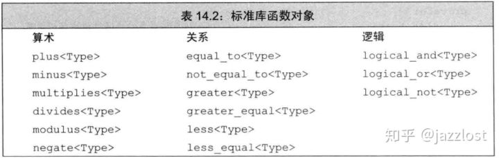

# [C++中的可调用对象学习](https://zhuanlan.zhihu.com/p/110591071)

## 可调用对象

- 可调用对象:
- 函数
- [函数指针](https://zhuanlan.zhihu.com/write#函数指针)
- [函数对象](https://zhuanlan.zhihu.com/write#函数对象)
- [lambda表达式](https://zhuanlan.zhihu.com/write#lambda表达式)
- 组件:
- [std::tr1::bind](https://zhuanlan.zhihu.com/write#stdbind)
- [std::tr1::function](https://zhuanlan.zhihu.com/write#stdfunction)

## 函数指针

- 函数指针的出现是因为想要把`函数当作变量来处理`。抽离出参数类型和返回值后便可以确认函数类型，并用指针来表示，C时代的产物，兼容性好但是扩展性差。
- 注意区分函数类型和函数指针类型:

```cpp
using Foo = void(int, int)  //Foo是函数
using pFoo = void(*)(int, int)  //pFoo是函数指针类型
```

- 函数指针的赋值，取地址符是可选的

```cpp
void Foo(int i);
//下面两种赋值方式是等价的
void (*pFoo)(int) = Foo;
void (*pFoo)(int) = &Foo;
```

- 函数指针可以做行参，声明时*符号可选

```cpp
//下面两种声明是等价的
void Foo(int i, void(*pFoo)(int));
void Foo(int i, void pFoo(int));
```

- 函数指针也可以做返回值

```cpp
typedef void (*pFoo)(int);
pFoo bar(int i);
```

- 函数指针常和typedef一同使用，让代码更简洁

```cpp
void bar(int i);
typedef void (*pFoo)(int);
pFoo foo = bar;
```

- 函数指针和decltype的使用

```cpp
#include <iostream>

using namespace std;

void bar(int i) {
    cout << "bar: " << i << endl;
}

void baz(int i) {
    cout << "baz: " << i << endl;
}

//pFoo函数返回指向bar返回类型函数的指针。这里需要加上*，因decltype返回的是函数类型不是指针。这种情况适用于不知道函数表式具体返回值时。
decltype(bar)* pFoo(int i) {
    if (i < 10) {
        return bar;
    } else {
        return baz;
    }
}

int main() {
    pFoo(1)(1);
    pFoo(11)(11);
    return 0;
}
```

## 函数对象

- 如果在类中重载了`调用运算符`，则该类的对象称作`函数对象`。

```cpp
class AddNumber
{
public:
      //重载调用运算符
      int operator() (int firstNum, int secondNum) const
      {
          return firstNum + secondNum;
      }  
      int operator() (int firstNum, int secondNum, intthirdNum)
      {
          return firstNum + secondNum + thirdNum;
      }  
};  
int main()
{
    //实例化函数对象
    AddNumber add;
    //结果是3
    add(1,2);
    //结果是6
    add(1,2,3);  
    return 0;
}
```

- 函数对象和函数指针相比，因为是类所以可以`储存和提取状态`，而且因为函数对象的实现可以在类内修改和重载，还可以做inline函数调用，所以设计灵活性上优于函数指针。在泛型算法中大量用到了函数对象作为实参。头文件functional中定义了一组算数运算符，关系运算符，逻辑运算符的模板类作为函数对象来调用。



```cpp
//可以看下greater<Type>的源码
template <class T>
struct greater
{
    bool operator()(const T& x, const T& y) const{return x > y;}
};
```

## lambda表达式

## std::bind

- bind常和标准库函数对象进行适配调用

```cpp
int main()
{
    //可以正常声明函数对象
    int a = 5;
    std::plus<int> addWithFive;
    //5 + 5
    addWithFive(a,5);    
    //bind可以将函数对象和特定的调用参数绑定并在函数调用时传参数
    //placeholders是参数占位符
    auto addWithFive = std::bind(std::plus<int>,std::placeholders::_1, 5);
    //5 + 5 
    addWithFive(5);  
    //在STL算法中也可以用标准库函数对象
    vector<int> foo {3,1,4,6,4,8,9,6};
    //这里会将sort默认的less变为greater来排序
    sort(foo.begin(), foo.end(), greater<int>());
}
```

## std::function

- function作为模板库中用来对可调用对象包装的包装器，可以`统一`上述四种可调用对象的`外部调用方式`，并且与可调用对象自身类型`解耦`，只依赖于call signature.
- 包装普通函数和模板函数

```cpp
int add(int i, int j)
{
    return i + j;
}
//普通函数
function<int(int, int)> f_add = add;
f_add(1,1);
//函数指针
int (*p_add)(int, int) = add;
function<int(int, int)> f_add = add;
f_add(1,1);
template<typename T>
T add(T i, T j)
{
    return i + j;
}
//模板函数
function<int<int, int>> f_add = add<int>;
f_add(1,1);
```

- 包装函数对象

```cpp
struct add
{
    int operator()(int i, int j)
    {
        return i + j;
    }
};
//非模板函数对象
function<int(int, int)> f_add = add();
f_add(1,1);
template<typename T>
struct add
{
    T operator()(T i, T j)
    {
        return i + j;
    }
};
function<int(int,int)> f_add = add<int>();
f_add(1,1);
```

- 包装lambda表达式

```cpp
auto add = [](int i, int j){return i+ j;};
//lambda表达式
function<int(int,int)> f_add = add;
f_add(1,1);
```

- 包装类成员函数

```cpp
class Math
{
public:
    int add(int i, int j)
    {
        return i + j;
    }
};

//类成员函数
Math m;
function<int(int,int)> f_add = bind(&Math::add, &m, placeholders::_1, placeholders::_2);
f_add(1,2);


class Math
{
public:
    template<typename T>
    T add(T i, T j)
    {
        return i + j;
    }
};

//模板类成员函数
Math m;
function<int(int,int)> f_add = bind(&Math::add<int>, &m, placeholders::_1, placeholders::_2);
cout << f_add(1,2) << endl;
```

# [result_of学习使用](https://blog.csdn.net/anzhsoft/article/details/17507085)

我们想得到一系列的multimap，可以按照city，age进行分组。

通过传入key type，和获取相应值的函数（可以使用lambda），就可以获取这个multimap。但是，实际上key type就是Fn的返回值，可以不用传入：通过keySlector(person)进行判断。这里就要说说如何获取闭包的返回值类型了。获取闭包的返回值类型的方法有三种：

1. 通过decltype
2. 通过declval
3. 通过result_of

## **第一种方式，通过decltype：**

multimap<decltype(keySlector((Person&)nulltype)), Person>或者multimap<decltype(keySlector(*((Person*)0))), Person>
这种方式可以解决问题，但不够好，因为它有两个magic number：nulltype和0。

## **通过declval：**

multimap<decltype(declval(Fn)(declval(Person))), Person>
这种方式用到了declval,declval的强大之处在于它能获取任何类型的右值引用，而不管它是不是有默认构造函数，因此我们通过declval(Fn)获得了function的右值引用，然后再调用形参declval(Person)的右值引用，需要注意的是declval获取的右值引用不能用于求值，因此我们需要用decltype来推断出最终的返回值。这种方式比刚才那种方式要好一点，因为消除了魔法数，但是感觉稍微有点麻烦，写的代码有点繁琐，有更好的方式吗？看第三种方式吧：

## **通过result_of**

multimap<typename std::result_of<Fn(Person)>::type, Person>
std::result_of<Fn(Arg)>::type可以获取function的返回值，没有魔法数，也没有declval繁琐的写法，很优雅。其实，查看源码就知道result_of内部就是通过declval实现的，作法和方式二一样，只是简化了写法。

最终版本：

```cpp
#include <iostream>
#include <map>
#include <vector>

using namespace std;

struct Person {
    string name;
    int age;
    string city;
};

// 返回类型可以定义为multimap<typename result_of<Fn(value_type)>::type, value_type>
template<typename Container, typename Fn>
decltype(auto) groupby(const Container& v, const Fn& f) {
    typedef typename Container::value_type value_type;
    typedef typename result_of<Fn(value_type)>::type keyType;  // typedef decltype(declval<Fn>()(declval<value_type>())) keyType;

    multimap<keyType, value_type> mymap;
    std::for_each(begin(v), end(v), [&mymap, &f](value_type item) {
        mymap.insert(make_pair(f(item), item));
    });
    return mymap;
}

int main() {
    vector<Person> v = {{"aa", 20, "shanghai"}, {"bb", 25, "beijing"}, {"cc", 25, "nanjing"}, {"dd", 20, "nanjing"}};
    // group by age
    auto r1 = groupby(v, [](const Person& person) { return person.age; });
    // group by name
    auto r2 = groupby(v, [](const Person& person) { return person.name; });
    // group by city
    auto r3 = groupby(v, [](const Person& person) { return person.city; });
    return 0;
}
```

result_of 其实就是通过decltype来推导函数的返回类型。result_of的一种可能的实现如下：

```cpp
template<class F, class... ArgTypes>
struct result_of<F(ArgTypes...)>
{
  typedef decltype(
                  declval<F>()(declval<ArgTypes>()...)
                  ) type;
}
```

总结：

auto适用于任何人，除非需要类型转换，否则你应该使用它

decltype适合推导表达式，因此在库中大量使用，当然它也可以推导函数的返回值，但是函数的返回值的推导，还是交给result_of吧！