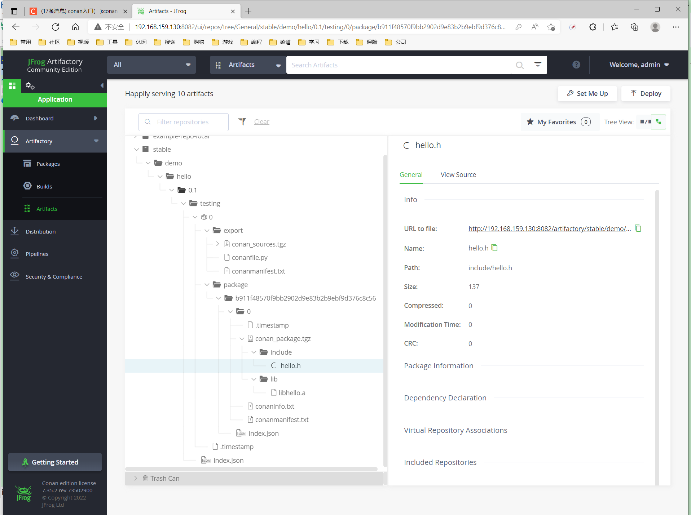

# [介绍](https://docs.conan.io/en/latest/introduction.html)

# [安装]([Install — conan 1.46.0 documentation](https://docs.conan.io/en/latest/installation.html))

安装：

```
$ pip install conan

# 建议使用虚拟化安装
python -m venv <venv_dir>
source <venv_dir>/bin/activate
pip3 install conan
```

升级：

```
$ pip install conan --upgrade  # Might need sudo or --user
```

# 开始

## 使用 Poco 库的 MD5 哈希计算器

1. 在文件夹中创建以下源文件。这将是我们应用程序的源文件：

   > **md5.cpp**[¶](https://docs.conan.io/en/latest/getting_started.html#id2)
   >
   > ```cpp
   >  #include "Poco/MD5Engine.h"
   >  #include "Poco/DigestStream.h"
   > 
   >  #include <iostream>
   > 
   >  int main(int argc, char** argv){
   >      Poco::MD5Engine md5;
   >      Poco::DigestOutputStream ds(md5);
   >      ds << "abcdefghijklmnopqrstuvwxyz";
   >      ds.close();
   >      std::cout << Poco::DigestEngine::digestToHex(md5.digest()) << std::endl;
   >      return 0;
   >  }
   > ```

2. 我们知道我们的应用程序依赖于 Poco 库。让我们在 ConanCenter 遥控器中查找它，[转到 https://conan.io/center](https://conan.io/center)，然后在搜索框中键入"poco"。我们将看到有一些不同的版本可用：

   > ```
   > poco/1.8.1
   > poco/1.9.3
   > poco/1.9.4
   > ...
   > ```

   注意

   Conan 客户端包含一个在远程存储库中搜索的命令，我们可以尝试 **$ conan search poco --remote=conancenter**。您可以完全使用此命令在您自己的存储库中进行搜索，但请注意，目前这可能会在 ConanCenter 中超时。基础结构正在改进，以支持此命令，但同时建议使用 [ConanCenter UI](https://conan.io/center/)。

3. 我们得到了一些关于Poco的有趣参考。让我们检查一下 1.9.4 版本的元数据：

   > ```
   > $ conan inspect poco/1.9.4
   > name: poco
   > version: 1.9.4
   > url: https://github.com/conan-io/conan-center-index
   > homepage: https://pocoproject.org
   > license: BSL-1.0
   > author: None
   > description: Modern, powerful open source C++ class libraries for building network- and internet-based applications that run on desktop, server, mobile and embedded systems.
   > topics: ('conan', 'poco', 'building', 'networking', 'server', 'mobile', 'embedded')
   > generators: cmake
   > exports: None
   > exports_sources: CMakeLists.txt
   > short_paths: False
   > apply_env: True
   > build_policy: None
   > revision_mode: hash
   > settings: ('os', 'arch', 'compiler', 'build_type')
   > options:
   >     cxx_14: [True, False]
   >     enable_apacheconnector: [True, False]
   >     enable_cppparser: [True, False]
   >     enable_crypto: [True, False]
   >     [...]
   > default_options:
   >     cxx_14: False
   >     enable_apacheconnector: False
   >     enable_cppparser: False
   >     enable_crypto: True
   >     [...]
   > ```

4. 让我们将此版本用于我们的MD5计算器应用程序，创建一个*conanfile.txt*在我们项目的文件夹中，其中包含以下内容：`poco/1.9.4`

   > **conanfile.txt**[¶](https://docs.conan.io/en/latest/getting_started.html#id3)
   >
   > ```
   >  [requires]
   >  poco/1.9.4
   > 
   >  [generators]
   >  cmake
   > ```
   >
   > 在此示例中，我们使用 CMake 生成项目，这就是指定生成器的原因。此生成器创建一个 *conanbuildinfo.cmake* 文件，该文件定义 CMake 变量，包括可在我们的生成中使用的路径和库名称。阅读有关[发生器](https://docs.conan.io/en/latest/reference/generators.html#generators-reference)的更多信息。`cmake`

5. 下一步：我们将安装所需的依赖项并生成构建系统的信息：

   > 重要
   >
   > 如果您使用的是 **GCC 编译器 >= 5.1**，Conan 会将 设置为旧的 ABI 以实现向后兼容性。在此入门示例的上下文中，这是一个糟糕的选择：最近的 gcc 版本将默认使用新的 ABI 编译该示例，并且链接将失败，而无需进一步自定义 cmake 配置。您可以使用以下命令避免这种情况：`compiler.libcxx`
   >
   > ```
   > $ conan profile new default --detect  # Generates default profile detecting GCC and sets old ABI
   > $ conan profile update settings.compiler.libcxx=libstdc++11 default  # Sets libcxx to C++11 ABI
   > ```
   >
   > 您可以在[如何管理 GCC >= 5 ABI 中找到更多信息](https://docs.conan.io/en/latest/howtos/manage_gcc_abi.html#manage-gcc-abi)。
   >
   > ```
   > $ mkdir build && cd build
   > $ conan install ..
   > ...
   > Requirements
   >     bzip2/1.0.8 from 'conancenter' - Downloaded
   >     expat/2.2.9 from 'conancenter' - Downloaded
   >     openssl/1.1.1g from 'conancenter' - Downloaded
   >     pcre/8.41 from 'conancenter' - Downloaded
   >     poco/1.9.4 from 'conancenter' - Cache
   >     sqlite3/3.31.1 from 'conancenter' - Downloaded
   >     zlib/1.2.11 from 'conancenter' - Downloaded
   > Packages
   >     bzip2/1.0.8:5be2b7a2110ec8acdbf9a1cea9de5d60747edb34 - Download
   >     expat/2.2.9:6cc50b139b9c3d27b3e9042d5f5372d327b3a9f7 - Download
   >     openssl/1.1.1g:6cc50b139b9c3d27b3e9042d5f5372d327b3a9f7 - Download
   >     pcre/8.41:20fc3dfce989c458ac2372442673140ea8028c06 - Download
   >     poco/1.9.4:73e83a21ea6817fa9ef0f7d1a86ea923190b0205 - Download
   >     sqlite3/3.31.1:4559c5d4f09161e1edf374b033b1d6464826db16 - Download
   >     zlib/1.2.11:6cc50b139b9c3d27b3e9042d5f5372d327b3a9f7 - Download
   > 
   > zlib/1.2.11: Retrieving package f74366f76f700cc6e991285892ad7a23c30e6d47 from remote 'conancenter'
   > Downloading conanmanifest.txt completed [0.25k]
   > Downloading conaninfo.txt completed [0.44k]
   > Downloading conan_package.tgz completed [83.15k]
   > Decompressing conan_package.tgz completed [0.00k]
   > zlib/1.2.11: Package installed f74366f76f700cc6e991285892ad7a23c30e6d47
   > zlib/1.2.11: Downloaded package revision 0
   > ...
   > poco/1.9.4: Retrieving package 645aaff0a79e6036c77803601e44677556109dd9 from remote 'conancenter'
   > Downloading conanmanifest.txt completed [48.75k]
   > Downloading conaninfo.txt completed [2.44k]
   > Downloading conan_package.tgz completed [5128.39k]
   > Decompressing conan_package.tgz completed [0.00k]
   > poco/1.9.4: Package installed 645aaff0a79e6036c77803601e44677556109dd9
   > poco/1.9.4: Downloaded package revision 0
   > conanfile.txt: Generator cmake created conanbuildinfo.cmake
   > conanfile.txt: Generator txt created conanbuildinfo.txt
   > conanfile.txt: Generated conaninfo.txt
   > conanfile.txt: Generated graphinfo
   > ```

   柯南安装了我们的Poco依赖项，但也安装了它的**可传递依赖项**：OpenSSL，zlib，sqlite等。它还为我们的构建系统生成了一个 *conanbuildinfo.cmake* 文件。

   警告

   Conan Center存储库中提供了适用于几个主流编译器和版本的预构建二进制文件，例如Visual Studio 14，15，Linux GCC 4.9和Apple Clang 3.5。ConanCenter 中最多可提供 130 个不同配置的不同二进制文件>。但是，如果您当前的配置不是在 ConanCenter 中预先构建的，Conan 将引发"BinaryMissing"错误。请仔细阅读错误消息。您可以使用 **conan install .. --build=missing** 从源代码构建二进制包，如果您的配置受配方支持，它将成功（某些 ConanCenter 配方可能无法为某些平台构建）。有关详细信息，请参阅[使用其他配置](https://docs.conan.io/en/latest/getting_started.html#getting-started-other-configurations)构建的建筑物部分。

6. 现在，让我们创建构建文件。要注入 Conan 信息，请包含生成的 *conanbuildinfo.cmake* 文件，如下所示：

   > **CMakeLists.txt**[¶](https://docs.conan.io/en/latest/getting_started.html#id4)
   >
   > ```
   > cmake_minimum_required(VERSION 3.16)
   > project(MD5Encrypter)
   > 
   > add_definitions("-std=c++11")
   > 
   > include(${CMAKE_BINARY_DIR}/conanbuildinfo.cmake)
   > conan_basic_setup()
   > 
   > add_executable(md5 src/md5.cpp)
   > target_link_libraries(md5 ${CONAN_LIBS})
   > ```

7. 现在，我们已准备好构建和运行 MD5 应用程序：

   > ```
   > (win)
   > $ cmake .. -G "Visual Studio 16"
   > $ cmake --build . --config Release
   > 
   > (linux, mac)
   > $ cmake .. -G "Unix Makefiles" -DCMAKE_BUILD_TYPE=Release
   > $ cmake --build .
   > ...
   > [100%] Built target md5
   > $ ./bin/md5
   > c3fcd3d76192e4007dfb496cca67e13b
   > ```

本地验证：

下载的包路径：

```java
/home/ben/.conan/data/
```

其中每个包会根据环境和配置信息生成hash值的目录，如poco包：

```java
/home/ben/.conan/data/poco/1.9.4/_/_/package/555d8adbf2a567fd0973097195096c0f2b2c71b5
```

## 安装依赖项

**conan install** 命令会下载配置所需的二进制包（首次运行该命令时检测到），**以及其他（Poco 需要的传递）库，如 OpenSSL 和 Zlib**。它还将在当前目录中创建 *conanbuildinfo.cmake* 文件，您可以在其中查看 CMake 变量，以及保存设置、要求和可选信息*的 conaninfo.txt*。

注意

Conan 使用检测到的设置（操作系统、编译器、体系结构等）生成[一个默认配置文件](https://docs.conan.io/en/latest/reference/config_files/default_profile.html#default-profile)，该配置打印在每个 **conan 安装**命令的顶部。但是，强烈建议您查看它并调整设置以准确描述您的系统，如[使用其他配置构建](https://docs.conan.io/en/latest/getting_started.html#getting-started-other-configurations)部分中所示。

了解安装过程非常重要。当 **conan install** 命令运行时，将应用在命令行上指定的设置或从 *<userhome>/.conan/profiles/default 文件中的默认值*中获取的设置。


例如，命令 **conan install .. --settings os="Linux" --settings compiler="gcc"**，执行以下步骤：

- 检查本地缓存中是否存在包配方（对于包）。如果我们刚刚开始，缓存是空的。`poco/1.9.4`
- 在定义的遥控器中查找包配方。柯南默认带有远程，但可以更改。`conancenter`
- 如果配方存在，Conan 客户端会获取该配方并将其存储在本地 Conan 缓存中。
- 使用软件包配方和输入设置（Linux，GCC），Conan在本地缓存中查找相应的二进制文件。
- 由于在缓存中找不到二进制文件，Conan 在远程数据库中查找它并获取它。
- 最后，它为本节中指定的生成系统生成适当的文件。`[generators]`

## 检查依赖关系

检索到的包将安装到本地用户缓存（通常为 *.conan/data*）中，并且可以从此位置重用于其他项目。这允许清理当前项目，即使没有网络连接，也可以继续工作。要在本地缓存中搜索包，请运行：

```
$ conan search "*"
Existing package recipes:

bzip2/1.0.8
expat/2.4.1
openssl/1.1.1l
pcre/8.45
poco/1.9.4
sqlite3/3.36.0
zlib/1.2.11
```

检查引用运行的不同二进制包：

```
$ conan search poco/1.9.4@
Existing packages for recipe poco/1.9.4:

    Package_ID: 555d8adbf2a567fd0973097195096c0f2b2c71b5
        [options]
            enable_apacheconnector: False
            enable_cppparser: False
            enable_crypto: True
            enable_data: True
            enable_data_odbc: False
            enable_data_sqlite: True
            enable_encodings: True
            enable_fork: True
            enable_json: True
            enable_mongodb: True
            enable_net: True
            enable_netssl: True
            enable_pagecompiler: False
            enable_pagecompiler_file2page: False
            enable_pdf: False
            enable_pocodoc: False
            enable_redis: True
            enable_sevenzip: False
            enable_util: True
            enable_xml: True
            enable_zip: True
            fPIC: True
            shared: False
        [settings]
            arch: x86_64
            build_type: Release
            compiler: gcc
            compiler.libcxx: libstdc++11
            compiler.version: 9
            os: Linux
        [requires]
            bzip2/1.0.8:da606cf731e334010b0bf6e85a2a6f891b9f36b0
            expat/2.4.1:c215f67ac7fc6a34d9d0fb90b0450016be569d86
            openssl/1.1.1l:6af9cc7cb931c5ad942174fd7838eb655717c709
            pcre/8.45:87087120c448298530c012e627c1a0b8f062586d
            sqlite3/3.36.0:c0cc1a2703aaeb2777d683089def26db57cf15e6
            zlib/1.2.11:6af9cc7cb931c5ad942174fd7838eb655717c709
        Outdated from recipe: False
```

包名称末尾的符号对于搜索特定包非常重要。如果不添加@ ，Conan 会将参数解释为模式搜索，并返回与模式匹配且可能具有不同[用户和通道](https://docs.conan.io/en/latest/reference/conanfile/attributes.html#user-channel)的所有包。

```
$ conan search poco/1.9.4
Existing package recipes:

poco/1.9.4
```

要检查当前项目的所有依赖项，请使用 **conan info** 命令，方法是将其指向 *conanfile.txt*文件夹的位置：

```
$ conan info ..
conanfile.txt
    ID: fdfd8cd3a1e1be41911b62ff437dfafea2006cfe
    BuildID: None
    Context: host
    Requires:
        poco/1.9.4
bzip2/1.0.8
    ID: da606cf731e334010b0bf6e85a2a6f891b9f36b0
    BuildID: None
    Context: host
    Remote: conancenter=https://center.conan.io
    URL: https://github.com/conan-io/conan-center-index
    Homepage: http://www.bzip.org
    License: bzip2-1.0.8
    Description: bzip2 is a free and open-source file compression program that uses the Burrows Wheeler algorithm.
    Topics: bzip2, data-compressor, file-compression
    Provides: bzip2
    Recipe: Cache
    Binary: Cache
    Binary remote: conancenter
    Creation date: 2022-01-24 21:45:30 UTC
    Required by:
        pcre/8.45
expat/2.4.1
    ID: c215f67ac7fc6a34d9d0fb90b0450016be569d86
    BuildID: None
    Context: host
    Remote: conancenter=https://center.conan.io
    URL: https://github.com/conan-io/conan-center-index
    Homepage: https://github.com/libexpat/libexpat
    License: MIT
    Description: Fast streaming XML parser written in C.
    Topics: expat, xml, parsing
    Provides: expat
    Recipe: Cache
    Binary: Cache
    Binary remote: conancenter
    Creation date: 2022-01-27 20:45:46 UTC
    Required by:
        poco/1.9.4
openssl/1.1.1l
    ID: 6af9cc7cb931c5ad942174fd7838eb655717c709
    BuildID: None
    Context: host
    Remote: conancenter=https://center.conan.io
    URL: https://github.com/conan-io/conan-center-index
    Homepage: https://github.com/openssl/openssl
    License: OpenSSL
    Description: A toolkit for the Transport Layer Security (TLS) and Secure Sockets Layer (SSL) protocols
    Topics: openssl, ssl, tls, encryption, security
    Provides: openssl
    Recipe: Cache
    Binary: Cache
    Binary remote: conancenter
    Creation date: 2022-02-25 21:47:49 UTC
    Required by:
        poco/1.9.4
pcre/8.45
    ID: 87087120c448298530c012e627c1a0b8f062586d
    BuildID: None
    Context: host
    Remote: conancenter=https://center.conan.io
    URL: https://github.com/conan-io/conan-center-index
    Homepage: https://www.pcre.org
    License: BSD-3-Clause
    Description: Perl Compatible Regular Expressions
    Topics: regex, regexp, PCRE
    Provides: pcre
    Recipe: Cache
    Binary: Cache
    Binary remote: conancenter
    Creation date: 2022-02-28 20:57:09 UTC
    Required by:
        poco/1.9.4
    Requires:
        bzip2/1.0.8
        zlib/1.2.11
poco/1.9.4
    ID: 555d8adbf2a567fd0973097195096c0f2b2c71b5
    BuildID: None
    Context: host
    Remote: conancenter=https://center.conan.io
    URL: https://github.com/conan-io/conan-center-index
    Homepage: https://pocoproject.org
    License: BSL-1.0
    Description: Modern, powerful open source C++ class libraries for building network- and internet-based applications that run on desktop, server, mobile and embedded systems.
    Topics: building, networking, server, mobile, embedded
    Provides: poco
    Recipe: Cache
    Binary: Cache
    Binary remote: conancenter
    Creation date: 2021-12-14 23:59:31 UTC
    Required by:
        conanfile.txt
    Requires:
        pcre/8.45
        zlib/1.2.11
        expat/2.4.1
        sqlite3/3.36.0
        openssl/1.1.1l
sqlite3/3.36.0
    ID: c0cc1a2703aaeb2777d683089def26db57cf15e6
    BuildID: None
    Context: host
    Remote: conancenter=https://center.conan.io
    URL: https://github.com/conan-io/conan-center-index
    Homepage: https://www.sqlite.org
    License: Unlicense
    Description: Self-contained, serverless, in-process SQL database engine.
    Topics: sqlite, database, sql, serverless
    Provides: sqlite3
    Recipe: Cache
    Binary: Cache
    Binary remote: conancenter
    Creation date: 2022-02-21 15:21:16 UTC
    Required by:
        poco/1.9.4
zlib/1.2.11
    ID: 6af9cc7cb931c5ad942174fd7838eb655717c709
    BuildID: None
    Context: host
    Remote: conancenter=https://center.conan.io
    URL: https://github.com/conan-io/conan-center-index
    Homepage: https://zlib.net
    License: Zlib
    Description: A Massively Spiffy Yet Delicately Unobtrusive Compression Library (Also Free, Not to Mention Unencumbered by Patents)
    Topics: zlib, compression
    Provides: zlib
    Recipe: Cache
    Binary: Cache
    Binary remote: conancenter
    Creation date: 2022-01-25 09:24:47 UTC
    Required by:
        pcre/8.45
        poco/1.9.4
```

或者使用点或 HTML 格式生成依赖项的图形：

```shell
$ conan info .. --graph=file.html
$ file.html # or open the file, double-click
```

[包依赖关系html图](E:\My Documents\编程\C++\各知识点\conan\pictures\file.html)

## 搜索包

安装软件包的远程存储库默认在 Conan 中配置。它被称为柯南中心（配置为柯南中心远程）。

如果我们在 [ConanCenter](https://conan.io/center/) 中搜索类似的东西，我们可以找到不同的软件包，例如：`open`

```
openal/1.18.2@bincrafters/stable
openal/1.19.1
opencv/2.4.13.5@conan/stable
opencv/3.4.3@conan/stable
opencv/4.1.1@conan/stable
openexr/2.3.0
openexr/2.3.0@conan/stable
openexr/2.4.0
openjpeg/2.3.0@bincrafters/stable
openjpeg/2.3.1
openjpeg/2.3.1@bincrafters/stable
openssl/1.0.2s
...
```

如您所见，某些库以符号结尾，后跟两个字符串，中间用斜杠分隔。这些字段是 Conan 软件包[的用户和通道](https://docs.conan.io/en/latest/reference/conanfile/attributes.html#user-channel)，如果要进行特定更改并将修改后的配方与 Conan 中心或任何其他远程文件中的配方消除歧义，则这些字段非常有用。这些是旧版软件包，强烈建议从 ConanCenter 使用没有用户和频道的软件包。

ConanCenter 是 Conan 软件包的中央公共存储库。您可以在 [conan-center-index Github 存储库](https://github.com/conan-io/conan-center-index)中向它贡献包。如果你想存储自己的私有软件包，你可以直接从[柯南下载页面](https://conan.io/downloads.html)下载免费的Artifactory Community Edition（CE）。

## 使用其他配置进行构建

在这个例子中，我们使用柯南检测到的默认配置构建了我们的项目。此配置称为[默认配置文件](https://docs.conan.io/en/latest/reference/config_files/default_profile.html#default-profile)。

在运行命令（如 **conan 安装**）之前，配置文件需要可用。运行该命令时，将自动检测您的设置（编译器、体系结构等）并将其存储为默认配置文件。您可以编辑这些设置 *~/.conan/profiles/default* 或使用所需的配置创建新的配置文件。

例如，如果我们在名为 *gcc_x86* 的文件中具有 32 位 GCC 配置的配置文件，则可以运行以下内容：

```
$ conan install .. --profile=gcc_x86
```

提示

我们强烈建议使用[配置文件，](https://docs.conan.io/en/latest/reference/profiles.html#profiles)并使用 [conan 配置安装](https://docs.conan.io/en/latest/reference/commands/consumer/config.html#conan-config-install)来管理它们。

但是，用户始终可以使用 **--settings** 参数覆盖 **conan install** 命令中的配置文件设置。作为练习，尝试构建 32 位版本的哈希计算器项目，如下所示：

```
$ conan install .. --settings arch=x86
```

上面的命令使用 **--settings arch=x86** 而不是之前使用的默认配置文件安装不同的软件包。请注意，您可能需要在某些平台中安装额外的编译器或工具链，例如，Linux 发行版默认情况下不再安装 32 位工具链。

若要使用 32 位二进制文件，还必须更改项目生成：

- 在 Windows 中，将 CMake 调用更改为 。`Visual Studio 14`
- 在 Linux 中，您必须通过运行 来将标志添加到您的 ，这同样适用于 。这也可以通过使用柯南自动完成，正如我们稍后将展示的那样。`-m32``CMakeLists.txt``SET(CMAKE_CXX_FLAGS "${CMAKE_CXX_FLAGS} -m32")``CMAKE_C_FLAGS, CMAKE_SHARED_LINK_FLAGS and CMAKE_EXE_LINKER_FLAGS`
- 在macOS中，您需要添加 定义 。`-DCMAKE_OSX_ARCHITECTURES=i386`


# [JFrog Artifactory安装](https://blog.csdn.net/10km/article/details/122987204)

## tar.gz包安装

解压：

```shell
tar -xzf jfrog-artifactory-cpp-ce-7.35.2-linux.tar.gz
```

以后台方式启动Artifactory 服务：

```
cd artifactory-cpp-ce-7.35.2/app/bin/
./artifactoryctl start
```

停止Artifactory 服务：

```
cd artifactory-cpp-ce-7.35.2/app/bin/
./artifactoryctl stop
```

查看Artifactory 服务状态：

```
cd artifactory-cpp-ce-7.35.2/app/bin/
./artifactoryctl status
```

## 第一次登录

输入web服务地址http://192.168.159.130:8081：

初始的管理帐户和密码为: admim/password

设置新密码：admin/AdminConan123

设置基础URL地址：跳过

设置代理：跳过

创建制品仓库：Create a Repository

创建本地制品仓库：Create Local Repository

选择包类型：Conan

指定创建仓库的名字（Repository Key）：stable

创建用户（Add Users）：

> User Name: ben
>
> Email Address: bigben0204@163.com
>
> 勾选Administer Platform
>
> Password: AdminConan123

## conan连接JFrog Artifactory

### **添加私有仓库**

执行conan remote list看一下都有那些远程仓库(制品库),显示conan默认的制品库列表只有一个conan自己维护的中央仓库conancenter：

```shell
$ conan remote list
conancenter: https://center.conan.io [Verify SSL: True]
```

> conancenter(https://center.conan.io)保存了大部分知名的，常用的开源库，般的linux,windows开发都可以直接引用，这个后续再展开讲

将私有制品库添加到conan远程仓库列表中,命名为ben_repo：

```shell
# add a remote repository as 'ben_repo'
# ${repo}为前面创建的制品仓库的名字-'stable'
# conan remote add ben_repo http://192.168.159.130:8082/artifactory/api/conan/${repo}
$ conan remote add ben_repo http://192.168.159.130:8082/artifactory/api/conan/stable
```

如果添加错了，可以删除之后再重新添加：

```shell
conan remote remove ben_repo
# remove remote repository named 'ben_repo'
```

### **设置登录用户和密码**

为私有制品库privrepo指定访问的用户名和密码,以支持后续免密上传操作：

```shell
# conan user -p $your_password -r privrepo $your_username
# set connect username/password for remote repository named 'ben_repo'
$ conan user -p AdminConan123 -r ben_repo ben
Changed user of remote 'ben_repo' from 'None' (anonymous) to 'ben'
# 如果密码错了，则会有界面提示：
$ conan user -p xxx -r ben_repo ben
ERROR: Wrong user or password. [Remote: ben_repo]
```

执行`conan user`不加任何参数显示所有仓库对应的登录用户名：

```
$ conan user
Current user of remote 'conancenter' set to: 'None' (anonymous)
Current user of remote 'ben_repo' set to: 'ben' [Authenticated]
```

## 第一次上传

以下是根据conan官方文档[《Getting started》](https://docs.conan.io/en/latest/creating_packages/getting_started.html)整理的上传示例

### conan new

首先使用`conan new` 命令创建一个 `Hello World` C++ 库示例工程：

```shell
$ mkdir hello_pkg && cd hello_pkg
$ conan new hello/0.1 --template=cmake_lib
File saved: CMakeLists.txt
File saved: conanfile.py
File saved: include/hello.h
File saved: src/hello.cpp
File saved: test_package/CMakeLists.txt
File saved: test_package/conanfile.py
File saved: test_package/src/example.cpp
```

hello/0.1是 conan的一个官方示例项目，执行上面的conan new命令后会生成如下文件：

* conanfile.py：在根文件夹中有一个conanfile.py，它是主要的配置文件，负责定义包的构建和使用方式。

* CMakeLists.txt：一个简单的通用CMakeLists.txt，其中没有关于conan的任何具体内容。

* src文件夹：包含简单 C++ “hello”库的src文件夹。

* （可选）test_package文件夹：包含一个示例应用程序，该应用程序将需要并与创建的包链接。这不是强制性的，但检查我们的包是否正确创建很有用。
  文件夹的内容test_package现在对于理解包是如何创建的并不重要，重要的是：

* test_package文件夹不同于单元测试或集成测试。这些测试是“包”测试，并验证包是否正确创建，以及包使用者将能够链接它并重用它。
  * 它本身是一个小型的柯南项目，它包含自己的conanfile.py，以及它的源代码，包括构建脚本，这取决于正在创建的包，并构建和执行一个需要包中的库的小应用程序。
  * 它不属于包。它仅存在于源存储库中，而不存在于包中。

### conan create

接下来我们使用当前默认配置(默认配置文件)从源构建包，然后让`test_package`文件夹测试包：

```shell
$ conan create . demo/testing
Exporting package recipe
hello/0.1@demo/testing exports_sources: Copied 1 '.txt' file: CMakeLists.txt
hello/0.1@demo/testing exports_sources: Copied 1 '.cpp' file: hello.cpp
hello/0.1@demo/testing exports_sources: Copied 1 '.h' file: hello.h
hello/0.1@demo/testing: A new conanfile.py version was exported
hello/0.1@demo/testing: Folder: /home/ben/.conan/data/hello/0.1/demo/testing/export
hello/0.1@demo/testing: Exported revision: 4fc80e430f8244be40256fab755f8c43
Configuration:
[settings]
arch=x86_64
arch_build=x86_64
build_type=Release
compiler=gcc
compiler.libcxx=libstdc++11
compiler.version=9
os=Linux
os_build=Linux
[options]
[build_requires]
[env]

hello/0.1@demo/testing: Forced build from source
hello/0.1@demo/testing (test package): Installing package
Requirements
    hello/0.1@demo/testing from local cache - Cache
Packages
    hello/0.1@demo/testing:b911f48570f9bb2902d9e83b2b9ebf9d376c8c56 - Build

Installing (downloading, building) binaries...
hello/0.1@demo/testing: Configuring sources in /home/ben/.conan/data/hello/0.1/demo/testing/source/.
hello/0.1@demo/testing: Copying sources to build folder
hello/0.1@demo/testing: Building your package in /home/ben/.conan/data/hello/0.1/demo/testing/build/b911f48570f9bb2902d9e83b2b9ebf9d376c8c56
hello/0.1@demo/testing: Generator txt created conanbuildinfo.txt
hello/0.1@demo/testing: Calling generate()
hello/0.1@demo/testing: WARN: Using the new toolchains and generators without specifying a build profile (e.g: -pr:b=default) is discouraged and might cause failures and unexpected behavior
hello/0.1@demo/testing: Aggregating env generators
hello/0.1@demo/testing: Calling build()
hello/0.1@demo/testing: CMake command: cmake -G "Unix Makefiles" -DCMAKE_TOOLCHAIN_FILE="/home/ben/.conan/data/hello/0.1/demo/testing/build/b911f48570f9bb2902d9e83b2b9ebf9d376c8c56/cmake-build-release/conan/conan_toolchain.cmake" -DCMAKE_INSTALL_PREFIX="/home/ben/.conan/data/hello/0.1/demo/testing/package/b911f48570f9bb2902d9e83b2b9ebf9d376c8c56" "/home/ben/.conan/data/hello/0.1/demo/testing/build/b911f48570f9bb2902d9e83b2b9ebf9d376c8c56/."
-- Using Conan toolchain: /home/ben/.conan/data/hello/0.1/demo/testing/build/b911f48570f9bb2902d9e83b2b9ebf9d376c8c56/cmake-build-release/conan/conan_toolchain.cmake
-- Conan toolchain: Setting CMAKE_POSITION_INDEPENDENT_CODE=ON (options.fPIC)
-- Conan toolchain: Setting BUILD_SHARED_LIBS = OFF
-- The CXX compiler identification is GNU 9.4.0
-- Check for working CXX compiler: /usr/bin/c++
-- Check for working CXX compiler: /usr/bin/c++ -- works
-- Detecting CXX compiler ABI info
-- Detecting CXX compiler ABI info - done
-- Detecting CXX compile features
-- Detecting CXX compile features - done
-- Configuring done
-- Generating done
-- Build files have been written to: /home/ben/.conan/data/hello/0.1/demo/testing/build/b911f48570f9bb2902d9e83b2b9ebf9d376c8c56/cmake-build-release
hello/0.1@demo/testing: CMake command: cmake --build '/home/ben/.conan/data/hello/0.1/demo/testing/build/b911f48570f9bb2902d9e83b2b9ebf9d376c8c56/cmake-build-release' '--' '-j4'
Scanning dependencies of target hello
[ 50%] Building CXX object CMakeFiles/hello.dir/src/hello.cpp.o
[100%] Linking CXX static library libhello.a
[100%] Built target hello
hello/0.1@demo/testing: Package 'b911f48570f9bb2902d9e83b2b9ebf9d376c8c56' built
hello/0.1@demo/testing: Build folder /home/ben/.conan/data/hello/0.1/demo/testing/build/b911f48570f9bb2902d9e83b2b9ebf9d376c8c56/cmake-build-release
hello/0.1@demo/testing: Generated conaninfo.txt
hello/0.1@demo/testing: Generated conanbuildinfo.txt
hello/0.1@demo/testing: Generating the package
hello/0.1@demo/testing: Package folder /home/ben/.conan/data/hello/0.1/demo/testing/package/b911f48570f9bb2902d9e83b2b9ebf9d376c8c56
hello/0.1@demo/testing: Calling package()
hello/0.1@demo/testing: CMake command: cmake --install '/home/ben/.conan/data/hello/0.1/demo/testing/build/b911f48570f9bb2902d9e83b2b9ebf9d376c8c56/cmake-build-release' --prefix '/home/ben/.conan/data/hello/0.1/demo/testing/package/b911f48570f9bb2902d9e83b2b9ebf9d376c8c56'
-- Install configuration: "Release"
-- Installing: /home/ben/.conan/data/hello/0.1/demo/testing/package/b911f48570f9bb2902d9e83b2b9ebf9d376c8c56/lib/libhello.a
-- Installing: /home/ben/.conan/data/hello/0.1/demo/testing/package/b911f48570f9bb2902d9e83b2b9ebf9d376c8c56/include/hello.h
hello/0.1@demo/testing package(): Packaged 1 '.h' file: hello.h
hello/0.1@demo/testing package(): Packaged 1 '.a' file: libhello.a
hello/0.1@demo/testing: Package 'b911f48570f9bb2902d9e83b2b9ebf9d376c8c56' created
hello/0.1@demo/testing: Created package revision 1f07224d79158e164df41de55789787e
hello/0.1@demo/testing (test package): WARN: Using the new toolchains and generators without specifying a build profile (e.g: -pr:b=default) is discouraged and might cause failures and unexpected behavior
hello/0.1@demo/testing (test package): Generator 'CMakeToolchain' calling 'generate()'
hello/0.1@demo/testing (test package): WARN: Using the new toolchains and generators without specifying a build profile (e.g: -pr:b=default) is discouraged and might cause failures and unexpected behavior
hello/0.1@demo/testing (test package): Generator 'CMakeDeps' calling 'generate()'
hello/0.1@demo/testing (test package): Generator 'VirtualBuildEnv' calling 'generate()'
hello/0.1@demo/testing (test package): Generator 'VirtualRunEnv' calling 'generate()'
hello/0.1@demo/testing (test package): Generator txt created conanbuildinfo.txt
hello/0.1@demo/testing (test package): Aggregating env generators
hello/0.1@demo/testing (test package): Generated conaninfo.txt
hello/0.1@demo/testing (test package): Generated graphinfo
Using lockfile: '/home/ben/Softwares/JetBrains/CppProjects/hello_pkg/test_package/conan.lock'
Using cached profile from lockfile
hello/0.1@demo/testing (test package): Calling build()
hello/0.1@demo/testing (test package): CMake command: cmake -G "Unix Makefiles" -DCMAKE_TOOLCHAIN_FILE="/home/ben/Softwares/JetBrains/CppProjects/hello_pkg/test_package/cmake-build-release/conan/conan_toolchain.cmake" "/home/ben/Softwares/JetBrains/CppProjects/hello_pkg/test_package/."
-- Using Conan toolchain: /home/ben/Softwares/JetBrains/CppProjects/hello_pkg/test_package/cmake-build-release/conan/conan_toolchain.cmake
-- The CXX compiler identification is GNU 9.4.0
-- Check for working CXX compiler: /usr/bin/c++
-- Check for working CXX compiler: /usr/bin/c++ -- works
-- Detecting CXX compiler ABI info
-- Detecting CXX compiler ABI info - done
-- Detecting CXX compile features
-- Detecting CXX compile features - done
-- Conan: Target declared 'hello::hello'
-- Configuring done
-- Generating done
-- Build files have been written to: /home/ben/Softwares/JetBrains/CppProjects/hello_pkg/test_package/cmake-build-release
hello/0.1@demo/testing (test package): CMake command: cmake --build '/home/ben/Softwares/JetBrains/CppProjects/hello_pkg/test_package/cmake-build-release' '--' '-j4'
Scanning dependencies of target example
[ 50%] Building CXX object CMakeFiles/example.dir/src/example.cpp.o
[100%] Linking CXX executable example
[100%] Built target example
hello/0.1@demo/testing (test package): Running test()
Capturing current environment in /home/ben/Softwares/JetBrains/CppProjects/hello_pkg/test_package/cmake-build-release/conan/deactivate_conanrunenv-release-x86_64.sh
Configuring environment variables
hello/0.1: Hello World Release!
  hello/0.1: __x86_64__ defined
  hello/0.1: _GLIBCXX_USE_CXX11_ABI 1
  hello/0.1: __cplusplus201402
  hello/0.1: __GNUC__9
  hello/0.1: __GNUC_MINOR__4
```

### conan search

我们现在可以执行`conan search`验证二进制包文件是否在conan本地仓库中：

```shell
$ conan search
Existing package recipes:

bzip2/1.0.8
expat/2.4.1
hello/0.1@demo/testing
openssl/1.1.1l
pcre/8.45
poco/1.9.4
sqlite3/3.36.0
zlib/1.2.11
```

conan本地仓库保存在`~/.conan/data`下,资源管理器器打开文件夹也能看到`conan create`生成的数据：

```shell
$ ll ~/.conan/data/hello/0.1/demo/testing
total 36
drwxrwxr-x 8 ben ben 4096 Mar 17 00:19 ./
drwxrwxr-x 3 ben ben 4096 Mar 17 00:19 ../
drwxrwxr-x 3 ben ben 4096 Mar 17 00:19 build/
drwxrwxr-x 2 ben ben 4096 Mar 17 00:19 export/
drwxrwxr-x 4 ben ben 4096 Mar 17 00:19 export_source/
drwxrwxr-x 2 ben ben 4096 Mar 17 00:19 locks/
-rw-rw-r-- 1 ben ben  325 Mar 17 00:19 metadata.json
-rw-rw-r-- 1 ben ben    0 Mar 17 00:19 metadata.json.lock
drwxrwxr-x 3 ben ben 4096 Mar 17 00:19 package/
drwxrwxr-x 4 ben ben 4096 Mar 17 00:19 source/
```

### conan upload

如下执行`conan upload` 命令上传`hello/0.1`到远程私有制品仓库`ben_repo`：

```shell
$ conan upload hello/0.1@demo/testing --all -r=ben_repo
Uploading to remote 'ben_repo':
Uploading hello/0.1@demo/testing to remote 'ben_repo'
Compressing conan_sources.tgz completed [3 files]
Uploaded conan_sources.tgz -> hello/0.1@demo/testing [0.83k]
Uploaded conanfile.py -> hello/0.1@demo/testing [1.28k]
Uploaded conanmanifest.txt -> hello/0.1@demo/testing [0.24k]
Uploaded conan recipe 'hello/0.1@demo/testing' to 'ben_repo': http://192.168.159.130:8082/artifactory/api/conan/stable
Uploading package 1/1: b911f48570f9bb2902d9e83b2b9ebf9d376c8c56 to 'ben_repo'
Compressing conan_package.tgz completed [2 files]
Uploaded conan_package.tgz -> hello/0.1@demo/testing:b911 [1.42k]
Uploaded conaninfo.txt -> hello/0.1@demo/testing:b911 [0.45k]
Uploaded conanmanifest.txt -> hello/0.1@demo/testing:b911 [0.15k]
```

上传成功在JFrog Artifactory后台制品仓库(stable)就可以上传的包：




