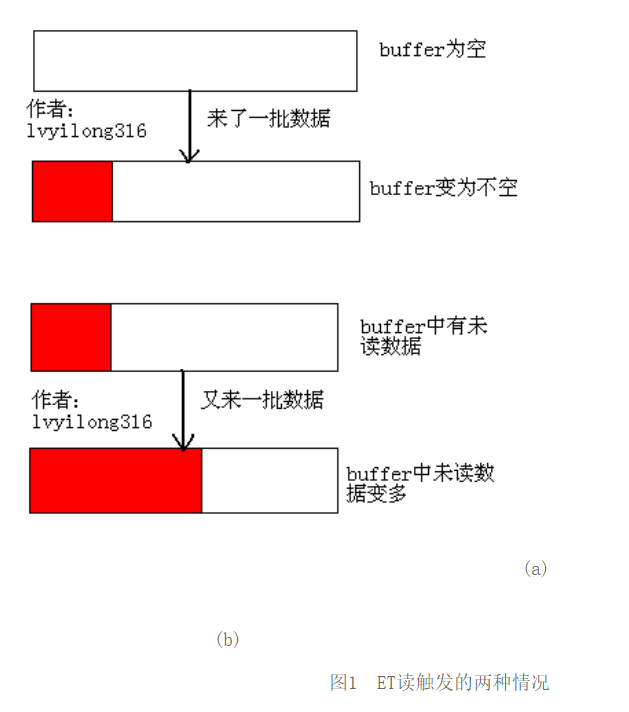
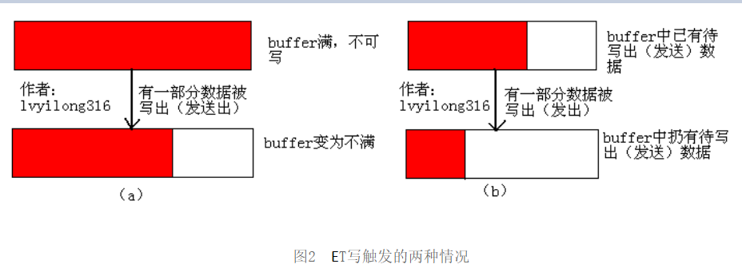
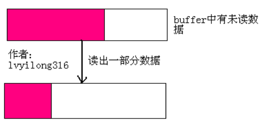
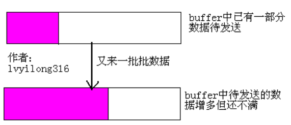

## [彻底学会使用epoll（二）——ET和LT的触发方式](http://blog.chinaunix.net/uid-28541347-id-4285054.html)

分析了ET和LT的实现方式，那么分析他们的触发方式就容易多了。我们通过实现分析知道LT模式下epoll_wait被唤醒可以通过两种方式（图中红线和蓝线），而ET模式只能通过一种方式（图中红线）。所以ET模式下能被唤醒的情况,LT模式下一定也能被唤醒。我们先来讨论特殊情况（ET模式）,再来讨论一般情况（LT模式）。

### 2.1 ET

根据上一节对两种加入rdlist途径的分析，可以得出ET模式下被唤醒（返回就绪）的条件为：

* 对于读取操作：

(1)**当buffer由不可读状态变为可读的时候，即由空变为不空的时候。**

(2)**当有新数据到达时，即buffer中的待读内容变多的时候。**

另外补充一点：

(3) **当buffer中有数据可读（即buffer不空）且用户对相应fd进行epoll_mod IN事件时**（具体见下节内容）。

对于情况(1)(2)分别对应图1(a),图1(b)。



* 对于写操作：

(1) **当buffer由不可写变为可写的时候，即由满状态变为不满状态的时候。**

(2)**当有旧数据被发送走时，即buffer中待写的内容变少得时候。**

另外补充一点：

(3)**当buffer中有可写空间（即buffer不满）且用户对相应fd进行epoll_mod OUT**事件时（具体见下节内容）。

对于情况(1)(2)分别对应图2(a),图2(b)。




### 2.2 LT

LT模式下进程被唤醒（描述符就绪）的条件就简单多了，它包含ET模式的所有条件，也就是上述列出的六中读写被唤醒的条件都是用于LT模式。此外，还有更普通的情况LT可以被唤醒，而ET则不理会，这也是我们需要注意的情况。

* 对于读操作

当buffer中有数据，且数据被读出一部分后buffer还不空的时候，即buffer中的内容减少的时候，LT模式返回读就绪。如下图所示。 



* 对于写操作

当buffer不满，又写了一部分数据后扔然不满的的时候，即由于写操作的速度大于发送速度造成buffer中的内容增多的时候，LT模式会返回就绪。如下图所示。



注：poll和select都是LT模式。


## [彻底学会使用epoll（三）——ET的读操作实例分析](http://blog.chinaunix.net/uid-28541347-id-4288802.html)

首先看程序一，这个程序想要实现的功能是当用户从控制台有任何输入操作时，输出”hello world！”。

程序一

```c++
#include <iostream>
#include <sys/epoll.h>
#include <unistd.h>

using namespace std;

int main()
{
    int epfd, nfds;
    int maxEvents = 5;
    struct epoll_event ev, events[maxEvents];
    epfd = epoll_create(1);
    ev.data.fd = STDIN_FILENO;
//    ev.events = EPOLLIN;
    ev.events = EPOLLIN | EPOLLET;
    epoll_ctl(epfd, EPOLL_CTL_ADD, STDIN_FILENO, &ev);
    while (true) {
        nfds = epoll_wait(epfd, events, maxEvents, -1);
        for (int i = 0; i < nfds; ++i) {
            if (events[i].data.fd == STDIN_FILENO) {
                cout << "hello, world!" << endl;
            }
        }
    }

    return 0;
}
// 输出：
f
hello, world!
s
hello, world!
d
hello, world!
e
hello, world!
```

程序一中对标准输入的监听使用ET模式，结果实现了我们想要的功能。那么实际原理是如何呢，我们将过程分析一下：

(1) 当用户输入一组字符，这组字符被送入buffer，字符停留在buffer中，又因为buffer由空变为不空，所以ET返回读就绪，输出”hello world！”。

(2) 之后程序再次执行epoll_wait，此时虽然buffer中有内容可读，但是根据我们上节的分析，ET并不返回就绪，导致epoll_wait阻塞。（底层原因是ET下就绪fd的epitem只被放入rdlist一次）。

(3) 用户再次输入一组字符，导致buffer中的内容增多，根据我们上节的分析这将导致fd状态的改变，是对应的epitem再次加入rdlist，从而使epoll_wait返回读就绪，再次输出“hello world！”。

 我们在看看LT的情况如何，将程序一以下修改：

`ev.events=EPOLLIN; //默认使用LT模式`

```c++
// 输出：
a
hello, world!
hello, world!
hello, world!
hello, world!
hello, world!
```

结果正如我们所料，程序出现死循环，因为用户输入任意数据后，数据被送入buffer且没有被读出，所以LT模式下每次epoll_wait都认为buffer可读返回读就绪。导致每次都会输出”hello world！”。下面在看程序二。

程序一

```c++
#include <iostream>
#include <sys/epoll.h>
#include <unistd.h>

using namespace std;

int main()
{
    int epfd, nfds;
    char buf[256];
    int maxEvents = 5;
    struct epoll_event ev, events[maxEvents];
    epfd = epoll_create(1);
    ev.data.fd = STDIN_FILENO;
    ev.events = EPOLLIN;
    epoll_ctl(epfd, EPOLL_CTL_ADD, STDIN_FILENO, &ev);
    while (true) {
        nfds = epoll_wait(epfd, events, maxEvents, -1);
        for (int i = 0; i < nfds; ++i) {
            if (events[i].data.fd == STDIN_FILENO) {
                read(STDIN_FILENO, buf, sizeof(buf));
                cout << "hello, world!" << ", buf: " << buf << endl;
            }
        }
    }

    return 0;
}
// 输出：
abcd
hello, world!, buf: abcd

fdsa
hello, world!, buf: fdsa

```

本地验证，每次只读2个字符，则会多次触发LT模式的唤醒操作，直到buffer读空：

```c++
char buf[2];
// 输出：
abcd
hello, world!, buf: ab
hello, world!, buf: cd
hello, world!, buf:    // 这里读到\n放入第1个字符，则buffer为\nd，所以第3次打印出\nd
d

```

程序二依然使用LT模式，但是每次epoll_wait返回读就绪的时候我们都将buffer（缓冲）中的内容read出来，所以导致buffer再次清空，下次调用epoll_wait就会阻塞。所以能够实现我们所想要的功能——当用户从控制台有任何输入操作时，输出”hello world！”。我们再来看看程序三。

程序三

```c++
#include <iostream>
#include <sys/epoll.h>
#include <unistd.h>

using namespace std;

int main()
{
    int epfd, nfds;
    int maxEvents = 5;
    struct epoll_event ev, events[maxEvents];
    epfd = epoll_create(1);
    ev.data.fd = STDIN_FILENO;
    ev.events = EPOLLIN | EPOLLET;
    epoll_ctl(epfd, EPOLL_CTL_ADD, STDIN_FILENO, &ev);
    while (true) {
        nfds = epoll_wait(epfd, events, maxEvents, -1);
        for (int i = 0; i < nfds; ++i) {
            if (events[i].data.fd == STDIN_FILENO) {
                cout << "hello, world!" << endl;
                ev.data.fd = STDIN_FILENO;
                ev.events = EPOLLIN | EPOLLET;
                epoll_ctl(epfd, EPOLL_CTL_MOD, STDIN_FILENO, &ev);
            }
        }
    }

    return 0;
}
// 输出：
ab
hello, world!
hello, world!
hello, world!
hello, world!
hello, world!
```

程序三依然使用ET，但是每次读就绪后都主动的再次MOD IN事件，我们发现程序再次出现死循环，也就是每次返回读就绪。这就验证了上一节讨论ET读就绪的第三种情况。但是注意，如果我们将MOD改为ADD，将不会产生任何影响。别忘了每次ADD一个描述符都会在epitem组成的红黑树中添加一个项，我们之前已经ADD过一次，再次ADD将阻止添加，所以在次调用ADD IN事件不会有任何影响。

本地验证，将buffer内容全部读出，再对相应fd进行epoll_mod IN事件时，无法触发ET模式下的唤醒：

```c++
#include <iostream>
#include <sys/epoll.h>
#include <unistd.h>

using namespace std;

int main()
{
    int epfd, nfds;
    char buf[256];
    int maxEvents = 5;
    struct epoll_event ev, events[maxEvents];
    epfd = epoll_create(1);
    ev.data.fd = STDIN_FILENO;
    ev.events = EPOLLIN | EPOLLET;
    epoll_ctl(epfd, EPOLL_CTL_ADD, STDIN_FILENO, &ev);
    while (true) {
        nfds = epoll_wait(epfd, events, maxEvents, -1);
        for (int i = 0; i < nfds; ++i) {
            if (events[i].data.fd == STDIN_FILENO) {
                cout << "hello, world!" << endl;
                read(STDIN_FILENO, buf, sizeof(buf));
                ev.data.fd = STDIN_FILENO;
                ev.events = EPOLLIN | EPOLLET;
                epoll_ctl(epfd, EPOLL_CTL_MOD, STDIN_FILENO, &ev);
            }
        }
    }

    return 0;
}
// 输出：
fas
hello, world!
```


