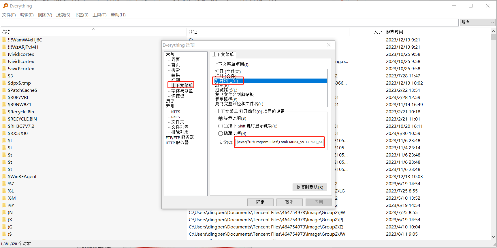
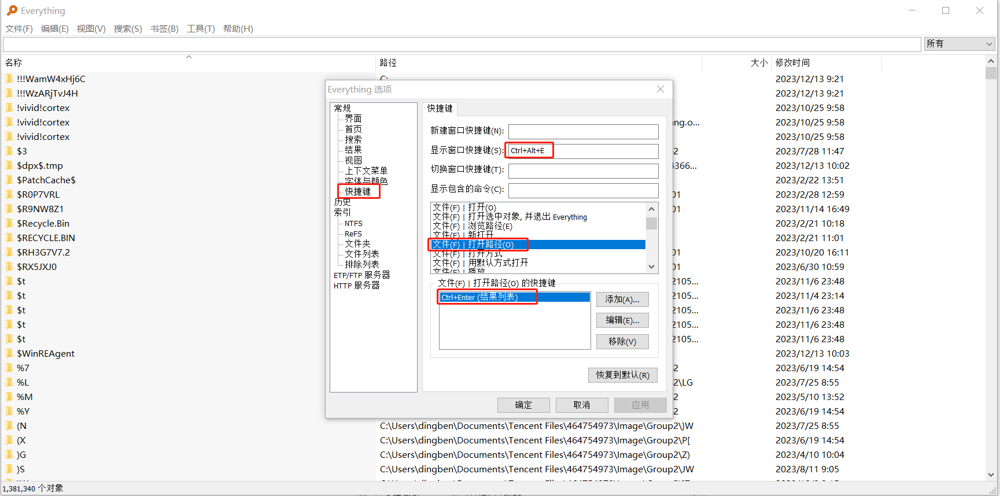
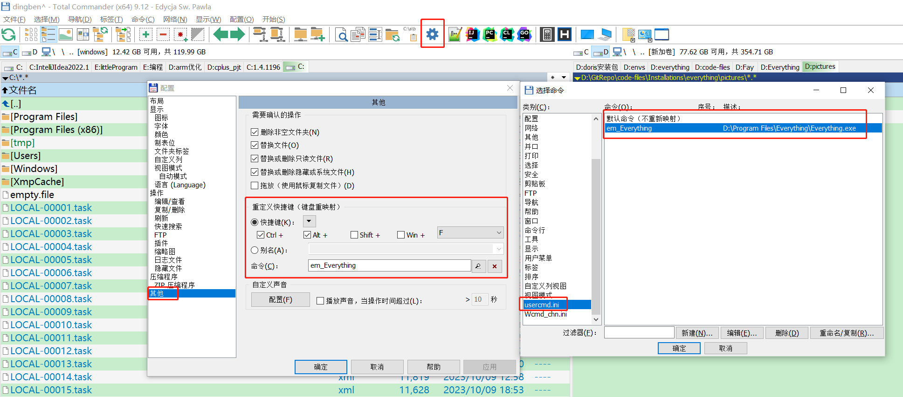

# [Total commander+Everything关联互相调用](https://www.jianshu.com/p/d3cf5414e99e)

## 1. Everything搜索，在TC中打开

在Everything中配置：

工具-选项-常规-上下文菜单-打开路径-命令

 `$exec("D:\Program Files\TotalCMD64_v9.12.590_64bit\Totalcmd64.exe" "/O" "/T" "$parent(%1)")`

其中`"D:\Program Files\TotalCMD64_v9.12.590_64bit\Totalcmd64.exe"`为TC安装路径。



用Everything搜索到想要的文件，想在TC中打开相关路径时，用鼠标或上下键，选种想打开其目录的文件，按Ctrl+Enter，调用TC打开：



## 2. 在TC中调用Everything搜索当前文件夹

在TC的主目录下找到usercmd.ini（如果没有的话，手工新建一个），在其中输入下面的设置代码：
```
[em_Everything]
cmd=D:\Program Files\Everything\Everything.exe
param="-search "%P ""
```

在上面的设置代码中，第二行是Everything的可执行文件路径（你的和我的可能不一样），第三行是参数。这个命令的目的是在当前目录(%P)下进行搜索。如果希望是全局搜索，则可以将param中后面的"%P "去掉。这里需要注意的是，在"%P "中包含有空格，这样做的好处是在搜索的时候将会包含有子目录。如果只是希望在当前目录下搜索而不需要包含子目录，可以将此空格去掉。

接下来在设置选项中的其他设置中找到自定义快捷键的地方，进行快捷键设置。这里使用Windows资源管理器中常用的Ctrl+F作为搜索的快捷键。在自定义快捷键的地方选中Ctrl和F后，在命令后面的放大镜弹出窗口中可以找到前面设置好的em_Everything命令，并按后面的确定按钮使其生效。如下图所示。

打开TC→配置→选项→其他→快捷键→重新定义快捷键→选择Ctrl+F（或者看你自己习惯）→命令→放大镜→em_Everything，确定保存。




