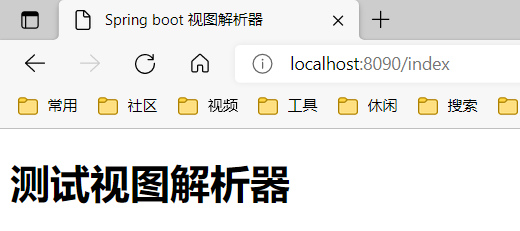

# 深入浅出SpringBoot2.x

## 第2章 聊聊开发环境搭建和基本开发

### 2.3 使用自定义配置

事实上， Spring Boot 的参数配置除了使用 properties 文件之外，还可以使用 yml 文件等，它会以
下列的优先级顺序进行加载 ：

* 命令行参数；
* 来自 java:comp/env 的丹IDI 属性；
* Java 系统属性（System.getProperties()）；
* 操作系统环境变量；
* RandomValuePropertySource 配置的 random.*属性值；
* jar 包外部的 application-{profile}.properties 或 application.yml （带spring.profile ）配置文件；
* jar 包内部的 application-{profile}.properties 或 application.yml （带 spring.profile）配置文件；
* jar 包外部的 application.properties 或 application.yml （不带 spring.profile ）配置文件；
* jar 包内部的 application.properties 或 application.yml （不带 spring.profile ）配置文件；
* @Configuration 注解类上的＠PropertySource；
* 通过 SpringApplication.setDefaultProperties 指定的默认属性。  

实际上 ，yml 文件的配置与 properties 文件只是简写和缩进的差别，因此差异并不大，所以本书统一使用 properties 文件进行配置 。 对于需要使用 yml 文件的读者，只是需要稍加改动即可 。 

### 2.4 开发自己的 Spring Boot 项目  

上面我们修改了服务器的启动端口，有时候还需要修改SpringMVC的视图解析器(ViewResolver）。SpringMVC的视图解析器的作用主要是定位视图，也就是当控制器只是返回一个逻辑名称的时候，是没有办法直接对应找到视图的，这就需要视图解析器进行解析了。在实际的开发中最常用的视图之一就是JSP，例如，现在控制器中返回一个字符串“index”，那么我们希望它对应的是开发项目的／WEB－副刊sp/index.jsp文件。如果你还对SpringMVC不熟悉，那也没有关系，未来我们还会谈到它，这里的代码很简单，你只需要依葫芦画瓢就可以体验运行SpringBoot项目了。下面的主要任务就是如果通过SpringBoot完成这个功能。首先我们需要在Maven的pom.xml中加入JSP和JSTL的依赖包，如代码清单2-4所示。

**代码清单2-4 新增JSP和JSTL的Maven依赖配置**

```xml
        <dependency>
            <groupId>org.apache.tomcat.embed</groupId>
            <artifactId>tomcat-embed-jasper</artifactId>
            <scope>provided</scope>
        </dependency>
        <dependency>
            <groupId>javax.servlet</groupId>
            <artifactId>jstl</artifactId>
            <scope>provided</scope>
        </dependency>
```

为了配置视图解析器（ViewResolver），将application.properties文件修改为如代码清单2-5所示。
**代码清单2-5定义视图前后缀**

```properties
server.port=8090
spring.mvc.view.prefix=/WEB-INF/jsp/
spring.mvc.view.suffix=.jsp
```

这里的spring.mvc.view.prefix和spring.mvc.view.suffix是SpringBoot与我们约定的视图前缀和后缀配置，意思是找到文件夹/WEB-INF/jsp/下以.jsp为后缀的JSP文件，那么前缀和后缀之间显然又缺了一个文件名称，在SpringMVC机制中，这个名称则是由控制器（Controller）给出的，为此新建一个控制器lndexController，其代码如代码清单2-6所示。

**代码清单2-6 开发控制器**

```javascript
package com.springboot.controller;

import org.springframework.stereotype.Controller;
import org.springframework.web.bind.annotation.RequestMapping;

@Controller
public class IndexController {
    @RequestMapping("/index")
    public String index() {
        return "index";
    }
}
```

​        这里定义了一个映射为index的路径，然后方法返回了“index”，这样它就与之前配置的前缀和后缀结合起来找对应的jsp文件，为此我们还需要开发一个对应的jsp文件，为此我们先再建一个/webapp/WEB-INF/jsp/index.jsp文件，如代码清单2-7所示。

**代码清单2-7开发视图(/webapp./WEB-lNF/sp/index.jsp)**

```jsp
<%@ page language="java" contentType="text/html; charset=UTF-8"
    pageEncoding="UTF-8"%>
<!DOCTYPE html PUBLIC "-//W3C//DTD HTML 4.01 Transitional//EN" 
"http://www.w3.org/TR/html4/loose.dtd">
<html>
<head>
<meta http-equiv="Content-Type" content="text/html; charset=UTF-8">
<title>Spring boot 视图解析器</title>
</head>
<body>
    <h1>测试视图解析器</h1>
</body>
</html>
```

这样我们就完成了一个简单的控制器，并且让视图解析器找到视图的功能。从上面来看定义视图解析器，在Spring Boot中只需要通过配置文件定义视图解析器的前后缀即可，而无须任何代码，这是因为Spring Boot给了我们自定义配置项，它会读入这些自定义的配置项，为我们生成Spring MVC中的视图解析器。正如它所承诺的尽可能地配置Spring开发环境，然后再看到即将运行Chapter2Application.java文件，如代码清单2-8所示。
**代码清单2-8 Spring Boot 运行文件Chapter2Application**

```java
package com.springboot;

import org.springframework.boot.SpringApplication;
import org.springframework.boot.autoconfigure.SpringBootApplication;

@SpringBootApplication
public class SpringBoot2xApplication {

    public static void main(String[] args) {
        SpringApplication.run(SpringBootApplication.class, args);
    }
}
```

这里的注解@SpringBootApplication 标志着这是一个Spring Boot入门文件。加粗的代码则是以Chapter2Application 类作为配置类来运行Spring Boot项目，于是Spring Boot 就会根据你在Maven加载的依赖来完成运行了。接下来我们以Java Application的形式运行类Chapter2Application，就可以看到Tomcat的运行日志。由于已经把端口修改为了8090，因此打开浏览器后输入http:/localhost:8090/index，就可以看到运行的结果如图2-13所示。



这样我们就搭建完成Spring Boot的开发环境了。因为Spring Boot 是基于Spring原理基础之上的，所以在讨论Spring Boot时，也十分有必要介绍Spring的技术原理，这样才能知其然，亦知其所以然。这些是后续章节的任务了。

## 第3章 全注解下的 Spring loC


