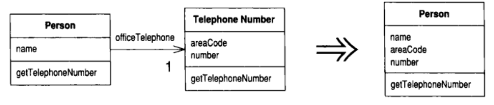
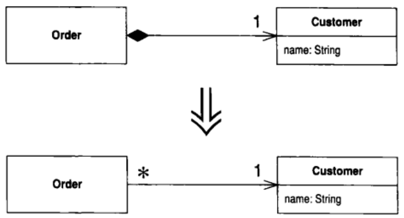
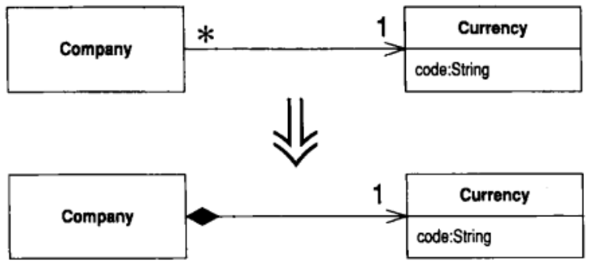

# 重构改善既有代码的设计

什么是重构

所谓重构(refactoring)是这样一个过程：在不改变代码外在行为的前提下，对代码做出修改，以改进程序的内部结构。重构是一种经千锤百炼形成的有条不紊的程序整理方法，可以最大限度地减少整理过程中引入错误的几率。本质上说，重构就是在代码写好之后改进它的设计。          

“在代码写好之后改进它的设计”？这种说法有点奇怪。按照目前对软件开发的理解，我们相信应该先设计而后编码：首先得有一个良好的设计，然后才能开始编码。但是，随着时间流逝，人们不断修改代码，于是根据原先设计所得的系统，整体结构逐渐衰弱。代码质量慢慢沉沦，编码工作从严谨的工程堕落为胡砍乱劈的随性行为。

“重构”正好与此相反。哪怕你手上有一个糟糕的设计，甚至是一堆混乱的代码，你也可以借由重构将它加工成设计良好的代码。重构的每个步骤都很简单，甚至显得有些过于简单：你只需要把某个字段从一个类移到另一个类，把某些代码从一个函数拉出来构成另一个函数，或是在继承体系中把某些代码推上推下就行了。但是，聚沙成塔，这些小小的修改累积起来就可以根本改善设计质量。这和一般常见的“软件会慢慢腐烂”的观点恰恰相反。

通过重构，你可以找出改变的平衡点。你会发现所谓设计不再是一切动作的前提，而是在整个开发过程中逐渐浮现出来。在系统构筑过程中，你可以学习如何强化设计，其间带来的互动可以让一个程序在开发过程中持续保有良好的设计。                                                        

# 第1章 重构，第1个案例

## 1.1 起点

Movie（影片）


```java
package demo;

public class Movie {
    public static final int CHILDRENS = 2;
    public static final int REGULAR = 0;
    public static final int NEW_RELEASE = 1;

    private String title;
    private int priceCode;

    public Movie(String title, int priceCode) {
        this.title = title;
        this.priceCode = priceCode;
    }

    public int getPriceCode() {
        return priceCode;
    }

    public void setPriceCode(int priceCode) {
        this.priceCode = priceCode;
    }

    public String getTitle() {
        return title;
    }
}
```

Rental（租赁）

Rental表示某个顾客租了一部影片。

```java
package demo;

public class Rental {
    private Movie movie;
    private int daysRented;

    public Rental(Movie movie, int daysRented) {
        this.movie = movie;
        this.daysRented = daysRented;
    }

    public Movie getMovie() {
        return movie;
    }

    public int getDaysRented() {
        return daysRented;
    }
}
```

Customer（顾客）

Customer类用来表示顾客。就像其它类一样，它也拥有数据和相应的访问函数：

```java
package demo;

import java.util.Enumeration;
import java.util.Vector;

public class Customer {
    private String name;
    private Vector<Rental> rentals = new Vector();

    public Customer(String name) {
        this.name = name;
    }

    public void addRental(Rental arg) {
        rentals.addElement(arg);
    }

    public String getName() {
        return name;
    }

    public String statement() {
        double totalAmount = 0;
        int frequentRenterPoints = 0;
        Enumeration<Rental> rentals = this.rentals.elements();
        String result = String.format("Rental Record for %s\n", getName());
        while (rentals.hasMoreElements()) {
            double thisAmount = 0;
            Rental each = rentals.nextElement();

            // determine amounts for each line
            switch (each.getMovie().getPriceCode()) {
                case Movie.REGULAR:
                    thisAmount += 2;
                    if (each.getDaysRented() > 2) {
                        thisAmount += (each.getDaysRented() - 2) * 1.5;
                    }
                    break;
                case Movie.NEW_RELEASE:
                    thisAmount += each.getDaysRented() * 3;
                    break;
                case Movie.CHILDRENS:
                    thisAmount += 1.5;
                    if (each.getDaysRented() > 3) {
                        thisAmount += (each.getDaysRented() - 3) * 1.5;
                        break;
                    }
            }

            // add frequent renter points
            ++frequentRenterPoints;
            // add bonus for a two day new release rental
            if ((each.getMovie().getPriceCode() == Movie.NEW_RELEASE) && each.getDaysRented() > 1) {
                ++frequentRenterPoints;
            }

            // show figures for this rental
            result += "\t" + each.getMovie().getTitle() + "\t" + String.valueOf(thisAmount) + "\n";
            totalAmount += thisAmount;
        }

        // add footer lines
        result += "Amount owed is " + String.valueOf(totalAmount) + "\n";
        result += "You earned " + String.valueOf(frequentRenterPoints) + " frequent renter points";
        return result;
    }
}

```

Customer还提供了一个用于生成详单的函数，如上`statement()`。

注：**如果你发现自己需要为程序添加一个特性，而代码结构使你无法很方便地达成目的，那就先重构那个程序，使特性的添加比较容易进行，然后再添加特性。**

## 1.2 重构的第一步

注：重构之前，首先检查自己是否有一套可靠的测试机制。这些测试必须有自我检验能力。

## 1.3 分解并重组statement()

重构switch语句：

```java
public String statement() {
        double totalAmount = 0;
        int frequentRenterPoints = 0;
        Enumeration<Rental> rentals = this.rentals.elements();
        String result = String.format("Rental Record for %s\n", getName());
        while (rentals.hasMoreElements()) {
            double thisAmount = 0;
            Rental each = rentals.nextElement();

            thisAmount = amountFor(each);

            // add frequent renter points
            ++frequentRenterPoints;
            // add bonus for a two day new release rental
            if ((each.getMovie().getPriceCode() == Movie.NEW_RELEASE) && each.getDaysRented() > 1) {
                ++frequentRenterPoints;
            }

            // show figures for this rental
            result += "\t" + each.getMovie().getTitle() + "\t" + String.valueOf(thisAmount) + "\n";
            totalAmount += thisAmount;
        }

        // add footer lines
        result += "Amount owed is " + String.valueOf(totalAmount) + "\n";
        result += "You earned " + String.valueOf(frequentRenterPoints) + " frequent renter points";
        return result;
    }

    private double amountFor(Rental each) {
        double thisAmount = 0;
        // determine amounts for each line
        switch (each.getMovie().getPriceCode()) {
            case Movie.REGULAR:
                thisAmount += 2;
                if (each.getDaysRented() > 2) {
                    thisAmount += (each.getDaysRented() - 2) * 1.5;
                }
                break;
            case Movie.NEW_RELEASE:
                thisAmount += each.getDaysRented() * 3;
                break;
            case Movie.CHILDRENS:
                thisAmount += 1.5;
                if (each.getDaysRented() > 3) {
                    thisAmount += (each.getDaysRented() - 3) * 1.5;
                    break;
                }
        }
        return thisAmount;
    }
```

注：**重构技术就是以微小的步伐修改程序。如果你犯下错误，很容易便可发现它。**

现在，已经把原来的函数分为两块，可以分别处理它们。我不喜欢amountFor()内的某些变量名称，现在正是修改它们的时候。

下面是修改后的代码：

```java
private double amountFor(Rental aRental) {
    double result = 0;
    // determine amounts for aRental line
    switch (aRental.getMovie().getPriceCode()) {
        case Movie.REGULAR:
            result += 2;
            if (aRental.getDaysRented() > 2) {
                result += (aRental.getDaysRented() - 2) * 1.5;
            }
            break;
        case Movie.NEW_RELEASE:
            result += aRental.getDaysRented() * 3;
            break;
        case Movie.CHILDRENS:
            result += 1.5;
            if (aRental.getDaysRented() > 3) {
                result += (aRental.getDaysRented() - 3) * 1.5;
                break;
            }
    }
    return result;
}
```

改名之后，我需要重新编译并测试，确保没有破坏任何东西。
更改变量名称是值得的行为吗？绝对值得。好的代码应该清楚表达出自己的功能，变量名称是代码清晰的关键。如果为了提高代码的清晰度，需要修改某些东西的名字，那么就大胆去做吧。只要有良好的查找/替换工具，更改名称并不困难。语言所提供的强类型检查以及你自己的测试机制会指出任何你遗漏的东西。记住：
**任何一个傻瓜都能写出计算机可以理解的代码。唯有写出人类容易理解的代码，才是优秀的程序员。**

代码应该表现自己的目的,这一点非常重要。阅读代码的时候,我经常进行重构。这样,随着对程序的理解逐渐加深,我也就不断地把这些理解嵌入代码中,这么一来才不会遗忘我曾经理解的东西。

**搬移“金额计算”代码**

观察amountFor()时，我发现这个函数使用了来自Rental类的信息，却没有使用来自Customer类的信息。

这立刻使我怀疑它是否被放错了位置。绝大多数情况下,函数应该放在它所使用的数据的所属对象内,所以 amount For()应该移到 Renta1类去。为了这么做,    我要运用 Move Method(142)。首先把代码复制到 Renta1类,调整代码使之适应新家,    然后重新编译。像下面这样:

```java
package demo;

public class Rental {
    // ...
    double getCharge() {
        double result = 0;
        // determine amounts for aRental line
        switch (getMovie().getPriceCode()) {
            case Movie.REGULAR:
                result += 2;
                if (getDaysRented() > 2) {
                    result += (getDaysRented() - 2) * 1.5;
                }
                break;
            case Movie.NEW_RELEASE:
                result += getDaysRented() * 3;
                break;
            case Movie.CHILDRENS:
                result += 1.5;
                if (getDaysRented() > 3) {
                    result += (getDaysRented() - 3) * 1.5;
                    break;
                }
        }
        return result;
    }
}

```

在这个例子里，“适应新家”意味着要去掉参数。此外，我还要在搬移的同时变更函数名称。

现在我可以测试新函数是否正常工作。只要改变customer.amountFor()函数内容，使它委托调用新函数即可：

```java
package demo;

public class Customer {
    // ...
    private double amountFor(Rental aRental) {
        return aRental.getCharge();
    }
}

```

现在可以编译并测试，看看有没有破坏什么东西。

做完这些修改之后，下一件事就是去掉旧函数。编译器会告诉我是否我漏掉了什么。然后我进行测试，看看有没有破坏什么东西。

有时候我会保留旧函数，让它调用新函数。如果旧函数是一个public函数，而我又不想修改其他类的接口，这便是一种有用的手法。

当然我还想对Rental.getcharge()做些修改，不过暂时到此为止，让我们回到Customer.statement()函数。

下一件引我注意的事是：thisAmount如今变得多余了。它接受each.getCharge()的执行结果，然后就不再有任何改变。所以我可以运用Replace Temp with Query(120)把thisAmount除去：

```java
public String statement() {
    double totalAmount = 0;
    int frequentRenterPoints = 0;
    Enumeration<Rental> rentals = this.rentals.elements();
    String result = String.format("Rental Record for %s\n", getName());
    while (rentals.hasMoreElements()) {
        Rental each = rentals.nextElement();

        // add frequent renter points
        ++frequentRenterPoints;
        // add bonus for a two day new release rental
        if ((each.getMovie().getPriceCode() == Movie.NEW_RELEASE) && each.getDaysRented() > 1) {
            ++frequentRenterPoints;
        }

        // show figures for this rental
        result += "\t" + each.getMovie().getTitle() + "\t" + String.valueOf(each.getCharge()) + "\n";
        totalAmount += each.getCharge();
    }

    // add footer lines
    result += "Amount owed is " + String.valueOf(totalAmount) + "\n";
    result += "You earned " + String.valueOf(frequentRenterPoints) + " frequent renter points";
    return result;
}
```

做完这份修改，我立刻编译并测试，保证自己没有破坏任何东西。

我喜欢尽量除去这一类临时变量。临时变量往往引发问题，它们会导致大量参数被传来传去，而其实完全没有这种必要。你很容易跟丢它们，尤其在长长的函数之中更是如此。当然我这么做也需付出性能上的代价，例如本例的费用就被计算了两次。但是这很容易在Rental类中被优化。而且如果代码有合理的组织和管理，优化就会有很好的效果。我将在第69页的“重构与性能”一节详谈这个问题。

**提炼“常客积分计算”代码**

我们再来看局部变量。这里再一次用到了each，而它可以被当作参数传入新函数中。另一个临时变量是frequentRenterPoints。本例中的它在被使用之前已经先有初值，但提炼出来的函数并没有读取该值，所以我们不需要将它当作参数传进去，只需把新函数的返回值累加上去就行了。

我完成了函数的提炼，重新编译并测试，然后做一次搬移，再编译、再测试。重构时最好小步前进，如此一来犯错的几率最小。

```java
package demo;

import java.util.Enumeration;
import java.util.Vector;

public class Customer {
    // ...

    public String statement() {
        double totalAmount = 0;
        int frequentRenterPoints = 0;
        Enumeration<Rental> rentals = this.rentals.elements();
        String result = String.format("Rental Record for %s\n", getName());
        while (rentals.hasMoreElements()) {
            Rental each = rentals.nextElement();
            frequentRenterPoints += each.getFrequentRenterPoints();

            // show figures for this rental
            result += "\t" + each.getMovie().getTitle() + "\t" + String.valueOf(each.getCharge()) + "\n";
            totalAmount += each.getCharge();
        }

        // add footer lines
        result += "Amount owed is " + String.valueOf(totalAmount) + "\n";
        result += "You earned " + String.valueOf(frequentRenterPoints) + " frequent renter points";
        return result;
    }
}

package demo;

public class Rental {
    // ...

    int getFrequentRenterPoints() {
        // add bonus for a two day new release rental
        if ((getMovie().getPriceCode() == Movie.NEW_RELEASE) && getDaysRented() > 1) {
            return 2;
        } else {
            // add frequent renter points
            return 1;
        }
    }
}
```

**去除临时变量**

正如我在前面提过的，临时变量可能是个问题。它们只在自己所属的函数中有效，所以它们会助长冗长而复杂的函数。这里有两个临时变量，两者都是用来从customer对象相关的Renta1对象中获得某个总量。不论ASCI版或HTML版都需要这些总量。我打算运用Replace Temp with Query（120），并利用查询函数（query method)来取代totalAmount和frequentRentalPoints这两个临时变量。由于类中的任何函数都可以调用上述查询函数，所以它能够促成较干净的设计，而减少冗长复杂的函数：

首先我用Customer类的getTotoalCharge()取代totalMount：

```java
package demo;

import java.util.Enumeration;
import java.util.Vector;

public class Customer {
    // ...

    public String statement() {
        int frequentRenterPoints = 0;
        Enumeration<Rental> rentals = this.rentals.elements();
        String result = String.format("Rental Record for %s\n", getName());
        while (rentals.hasMoreElements()) {
            Rental each = rentals.nextElement();
            frequentRenterPoints += each.getFrequentRenterPoints();

            // show figures for this rental
            result += "\t" + each.getMovie().getTitle() + "\t" + String.valueOf(each.getCharge()) + "\n";
        }

        // add footer lines
        result += "Amount owed is " + String.valueOf(getTotalCharge()) + "\n";
        result += "You earned " + String.valueOf(frequentRenterPoints) + " frequent renter points";
        return result;
    }

    private double getTotalCharge() {
        double result = 0;
        Enumeration<Rental> rentalsEnum = rentals.elements();
        while (rentalsEnum.hasMoreElements()) {
            Rental each = rentalsEnum.nextElement();
            result += each.getCharge();
        }
        return result;
    }

}

```

这并不是Replace Temp with Query(12O)的最简单情况。由于totalAmount在循环内部被赋值，我不得不把循环复制到查询函数中。        

重构之后，重新编译并测试，然后以同样手法处理frequentRenterPoints:

```java
package demo;

import java.util.Enumeration;
import java.util.Vector;

public class Customer {
	// ...

    public String statement() {
        Enumeration<Rental> rentals = this.rentals.elements();
        String result = String.format("Rental Record for %s\n", getName());
        while (rentals.hasMoreElements()) {
            Rental each = rentals.nextElement();

            // show figures for this rental
            result += "\t" + each.getMovie().getTitle() + "\t" + String.valueOf(each.getCharge()) + "\n";
        }

        // add footer lines
        result += "Amount owed is " + String.valueOf(getTotalCharge()) + "\n";
        result += "You earned " + String.valueOf(getFrequentRenterPoints()) + " frequent renter points";
        return result;
    }
    
    private int getFrequentRenterPoints() {
        int result = 0;
        Enumeration<Rental> rentalsEnum = rentals.elements();
        while (rentalsEnum.hasMoreElements()) {
            Rental each = rentalsEnum.nextElement();
            result += each.getFrequentRenterPoints();
        }
        return result;
    }
}

```

通过计算逻辑的提炼，我可以完成一个htmlstatement(),并复用原本state-ment()内的所有计算。我不必剪剪贴贴，所以如果计算规则发生改变，我只需在程    序中做一处修改。完成其他任何类型的详单也都很快而且很容易。这次重构并没    有花很多时间，其中大半时间我用来弄清楚代码所做的事，而这是我无论如何都得做的。 

前面有些代码是从ASCII版本中复制过来的——主要是循环设置部分。更深入的重构动作可以清除这些重复代码。我可以把处理表头(header)、表尾(footer)  和详单细目的代码都分别提炼出来。在*Form emplate Method*(345)实例中，你可以看到如何做这些动作。但是，现在用户又开始嘀咕了，他们准备修改影片分类规则。我们尚未清楚他们想怎么做，但似乎新分类法很快就要引入，现有的分类法马上就要变更。与之相应的费用计算方式和常客积分计算方式都还有待决定，现在就对程序做修改，肯定是愚蠢的。我必须进入费用计算和常客积分计算中，把因条件而异的代码替换掉，这样才能为将来的改变镀上一层保护膜。现在，请重新戴回“重构”这顶帽子。

## 1.4 运用多态取代与价格相关的条件逻辑

这个问题的第一部分是 :switch语句。最好不要在另一个对象的属性基础上运用switch语句。如果不得不使用,也应该在对象自己数据上使用,而不是在别人的数据上使用。

这暗示getCharge()应该移到Movie类里去：

```java
package demo;

public class Movie {
	// ...

    double getCharge(int daysRented) {
        double result = 0;
        // determine amounts for aRental line
        switch (getPriceCode()) {
            case REGULAR:
                result += 2;
                if (daysRented > 2) {
                    result += (daysRented - 2) * 1.5;
                }
                break;
            case NEW_RELEASE:
                result += daysRented * 3;
                break;
            case CHILDRENS:
                result += 1.5;
                if (daysRented > 3) {
                    result += (daysRented - 3) * 1.5;
                    break;
                }
        }
        return result;
    }
}

```

为了让它得以运作，我必须把租期长度作为参数传递进去。当然，租期长度来自Rental对象。计算费用时需要两项数据：租期长度和影片类型。为什么我选择将租期长度传给Movie对象，而不是将影片类型传给Renta1对象呢？因为本系统可能发生的变化是加入新影片类型，这种变化带有不稳定倾向。如果影片类型有所变化，我希望尽量控制它造成的影响，所以选择在Movie对象内计算费用。
我把上述计费方法放进Movie类，然后修改Rental的getcharge（），让它使用这个新函数：

```java
package demo;

public class Rental {
    // ...
    double getCharge() {
        return movie.getCharge(daysRented);
    }
}
```

搬移getCharge()之后，我以相同手法处理常客积分计算。这样我就把根据影片类型而变化的所有东西，都放到了影片类型所属的类中。重构后的代码如下：

```java
package demo;

public class Rental {
    // ...
    
    public int getFrequentRenterPoints() {
        return movie.getFrequentRenterPoints(daysRented);
    }
}


package demo;

public class Movie {
    // ...

    int getFrequentRenterPoints(int daysRented) {
        // add bonus for a two day new release rental
        if ((getPriceCode() == NEW_RELEASE) && daysRented > 1) {
            return 2;
        } else {
            // add frequent renter points
            return 1;
        }
    }
}

```

**终于……我们来到继承**

我们有数种影片类型,它们以不同的方式回答相同的问题。这听起来很像子类的工作。我们可以建立 Movie的三个子类,每个都有自己的计费法。

这么一来，我就可以用多态来取代switch语句了。很遗憾的是这里有个小问题，不能这么干。一部影片可以在生命周期内修改自己的分类，一个对象却不能在生命周期内修改自己所属的类。不过还是有一个解决方法：State模式[Gang of Four]。运用它之后，我们的类看起来像图1-15。

加入这一层间接性，我们就可以在Price对象内进行子类化动作①，于是便可在任何必要时刻修改价格。

如果你很熟悉GoF(Gang of Four,四巨头)②所列的各种模式，可能会问：“这是一个State,还是一个Strategy?”答案取决于Price类究竟代表计费方式（此时我    喜欢把它叫做Pricer还PricingStrategy.),还是代表影片的某个状态（例如“Star Trek X    是一部新片”)。在这个阶段，对于模式（和其名称）的选择反映出你对结构的想法。此刻我把它视为影片的某种状态。如果未来我觉得Strategyt能更好地说明我的意图，我会再重构它，修改名字，以形成Strategy。

为了引入State模式，我使用三个重构手法。首先运用Replace Type Code with State/Strategy (227),将与类型相关的行为搬移至State模式内。然后运用Move Method (l42)将switch语句移到Price类。最后运用Replace Conditional with Polymorphism (255)去掉switch语句。                                      

首先我要使用Replace Type Code with State/Strategy (227)。第一步骤是针对类型代码使用Self Encapsulate Field (17l),确保任何时候都通过取值函数和设值函数来访问类型代码。多数访问操作来自其他类，它们已经在使用取值函数。但构造函数仍然直接访问价格代码①：

可以用一个设值函数来代替：

```java
package demo;

public class Movie {
    public Movie(String title, int priceCode) {
        this.title = title;
        setPriceCode(priceCode);
    }
}
```

然后编译并测试，确保没有破坏任何东西。现在我新建一个Price类，并在其中提供类型相关的行为。为了实现这一点，我在Price类内加入一个抽象函数，并在所有子类中加上对应的具体函数：

```java
package demo;

abstract class Price {
    abstract int getPriceCode();
}

class ChildrensPrice extends Price {
    @Override
    int getPriceCode() {
        return Movie.CHILDRENS;
    }
}

class NewReleasePrice extends Price {
    @Override
    int getPriceCode() {
        return Movie.NEW_RELEASE;
    }
}

class RegularPrice extends Price {
    @Override
    int getPriceCode() {
        return Movie.REGULAR;
    }
}
```

现在，需要修改Movie类内的“价格代号”访问函数（取值函数/设值函数，如下），让它们使用新类。

这意味着必须在Movie类内保存一个Price对象，而不再是保存一个priceCode变量。此外还需要修改访问函数：

```java
package demo;

public class Movie {
    public static final int CHILDRENS = 2;
    public static final int REGULAR = 0;
    public static final int NEW_RELEASE = 1;

    private String title;
    private Price price;

    public Movie(String title, int priceCode) {
        this.title = title;
        setPriceCode(priceCode);
    }

    public int getPriceCode() {
        return price.getPriceCode();
    }

    public void setPriceCode(int priceCode) {
        switch (priceCode) {
            case REGULAR:
                price = new RegularPrice();
                break;
            case CHILDRENS:
                price = new ChildrensPrice();
                break;
            case NEW_RELEASE:
                price = new NewReleasePrice();
                break;
            default:
                throw new IllegalArgumentException("Incorrect Price Code");
        }
    }
    // ...
}

```

现在要对getCharge()实施Move Method (142)。搬移动作很简单，下面是重构后的代码：

```java
package demo;

public class Movie {
    // ...

    double getCharge(int daysRented) {
        return price.getCharge(daysRented);
    }
}

package demo;

abstract class Price {
    // ...

    double getCharge(int daysRented) {
        double result = 0;
        // determine amounts for aRental line
        switch (getPriceCode()) {
            case Movie.REGULAR:
                result += 2;
                if (daysRented > 2) {
                    result += (daysRented - 2) * 1.5;
                }
                break;
            case Movie.NEW_RELEASE:
                result += daysRented * 3;
                break;
            case Movie.CHILDRENS:
                result += 1.5;
                if (daysRented > 3) {
                    result += (daysRented - 3) * 1.5;
                    break;
                }
        }
        return result;
    }
}
```

搬移之后，就可以开始运用*Replace Conditional with Polymorphism* (255)了。

做法是一次取出一个case分支，在相应的类建立一个覆盖函数。先从RegularPrice开始：

```java
class RegularPrice extends Price {
    @Override
    int getPriceCode() {
        return Movie.REGULAR;
    }

    @Override
    double getCharge(int daysRented) {
        double result = 2;
        if (daysRented > 2) {
            result += (daysRented - 2) * 1.5;
        }
        return result;
    }
}
```

再取出下一个case分支，再编译并测试：

```java
class ChildrensPrice extends Price {
    @Override
    int getPriceCode() {
        return Movie.CHILDRENS;
    }

    @Override
    double getCharge(int daysRented) {
        double result = 1.5;
        if (daysRented > 3) {
            result += (daysRented - 3) * 1.5;
        }
        return result;
    }
}

class NewReleasePrice extends Price {
    @Override
    int getPriceCode() {
        return Movie.NEW_RELEASE;
    }

    @Override
    double getCharge(int daysRented) {
        return daysRented * 3;
    }
}
```

处理完所有case分支之后，就把Price.getCharge()声明为abstract：

```java
abstract class Price {
    abstract int getPriceCode();

    abstract double getCharge(int daysRented);
}
```

现在可以运用同样手法处理getFrequentRenterPoints()。

首先把这个函数移到Price类：

```java
package demo;

public class Movie {
    // ...

    int getFrequentRenterPoints(int daysRented) {
        return price.getFrequentRenterPoints(daysRented);
    }
}

abstract class Price {
	// ...
    int getFrequentRenterPoints(int daysRented) {
        // add bonus for a two day new release rental
        if ((getPriceCode() == Movie.NEW_RELEASE) && daysRented > 1) {
            return 2;
        } else {
            // add frequent renter points
            return 1;
        }
    }
}
```

但是这一次不把超类函数声明为abstract。只是为新片类型增加一个覆写函数，并在超类内留下一个已定义的函数，使它成为一种默认行为。

```java
abstract class Price {
	// ...
    int getFrequentRenterPoints(int daysRented) {
        return 1;
    }
}

class NewReleasePrice extends Price {
    // ...
    
    @Override
    int getFrequentRenterPoints(int daysRented) {
        return daysRented > 1 ? 2 : 1;
    }
}
```

引入 State模式花了我不少力气,值得吗?这么做的收获是:如果我要修改任何与价格有关的行为,或是添加新的定价标准,或是入其他取决于价格的行为,程序的修改会容易得多。这个程序的其余部分并不知道我运用了 State模式。对于我目前拥有的这么几个小量行为来说,任何功能或性上的修改也许都不合算,但如果在一个更复杂的系统中,有十多个与价格相关的函数,程序的修改难易度就会有很大的区别。以上所有修改都是小步骤进行,进度似乎太过缓慢,但是我一次都没有打开过调试器,所以整个过程实际上很快就过去了。我写本章文字所用的时间,远比修改那些代码的时间多得多。

现在我已经完成了第二个重要的重构行为。从此,修改影片分类结构,或是改变费用计算规则、改变常客积分计算规则,都容易多了。图1-16和图1-17描述State模式对于价格信息所起的作用。


## 1.5 结语

这是一个简单的例子，但我希望它能让你对于“重构怎么做”有一点感觉。例中我已经示范了数个重构手法，包括Extract Method(110)、Move Method(142)、Replace Conditional with Polymorphism(255)、Self Encapsulate Field(17l)、Replace Type Code with State/Strategy(227)。所有这些重构行为都使责任的分配更合理，代码的维护更轻松。重构后的程序风格，将迥异于过程化风格—一后者也许是某些人习惯的风格。不过一旦你习惯了这种重构后的风格，就很难再满足于结构化风格了。

这个例子给我们最大的启发是重构的节奏：测试、小修改、测试、小修改、测试、小修改……正是这种节奏让重构得以快速而安全地前进。

如果你看懂了前面的例子，就应该已经理解重构是怎么回事了。现在，让我们了解一些背景、原理和理论（好在不太多）。                                     

# 第2章 重构原则

## 2.1 何谓重构

第一个定义是名词形式。

**重构（名词）：对软件内部结构的一种调整，目的是在不改变软件可观察行为的前提下，提高其可理解性，降低其修改成本。**

你可以在后续章节中找到许多重构范例，诸如Extract Method(1l0)和Pull Up Field(320),等等。一般而言，重构都是对软件的小改动，但重构之中还可以包含另一个重构。例如Extract Class(149)通常包含Move Method(142)和Move Field (146)。

“重构”的另一个用法是动词形式。

**重构（动词）：使用一系列重构手法，在不改变软件可观察行为的前提下，调整其结构。**

曾经有人这样问我:“重构就只是整理代码吗?”从某种角度来说,是的。但我认为重构不止于此,因为它提供了一种更高效且受控的代码整理技术。自从运用重构技术后,我发现自己对代码的整理比以前更有效率。这是因为我知道该使用哪些重构手法,也知道以怎样的方式使用它们才能够将错误减到最少,而且在每一个可能出错的地方我都加以测试。

我的定义还需要往两方面扩展。首先，重构的目的是使软件更容易被理解和修改。你可以在软件内部做很多修改，但必须对软件可观察的外部行为只造成很小变化，或甚至不造成变化。与之形成对比的是性能优化。和重构一样，性能优化通常不会改变组件的行为（除了执行速度），只会改变其内部结构。但是两者出发点不同：性能优化往往使代码较难理解，但为了得到所需的性能你不得不那么做。

我要强调的第二点是：重构不会改变软件可观察的行为一一重构之后软件功能一如以往。任何用户，不论最终用户或其他程序员，都不知道已经有东西发生了变化。

**两顶帽子**

 上述第二点引出了Kent Beck的“两顶帽子”比喻。使用重构技术开发软件时，你把自己的时间分配给两种截然不同的行为：添加新功能，以及重构。添加新功能时，你不应该修改既有代码，只管添加新功能。通过测试（并让测试正常运行），你可以衡量自己的工作进度。重构时你就不能再添加功能，只管改进程序结构。此时你不应该添加任何测试（除非发现有先前遗漏的东西），只在绝对必要（用以处理接口变化）时才修改测试。

软件开发过程中，你可能会发现自己经常变换帽子。首先你会尝试添加新功能，然后会意识到：如果把程序结构改一下，功能的添加会容易得多。于是你换一顶帽子，做一会儿重构工作。程序结构调整好后，你又换上原先的帽子，继续添加新功能。新功能正常工作后，你又发现自己的编码造成程序难以理解，于是又换上重构帽子……整个过程或许只花十分钟，但无论何时你都应该清楚自己戴的是哪一顶帽子。

## 2.2 为何重构

重构可以帮助你始终良好地控制自己的代码。重构是个工具，可以（并且应该）用于以下几个目的。

**重构改进软件设计**

**重构使软件更容易理解**

**重构帮助找到bug**

**重构提高编程速度**

我绝对相信：良好的设计是快速开发的根本——事实上，拥有良好设计才可能做到快速开发。如果没有良好设计，或许某一段时间内你的进展迅速，但恶劣的设计很快就让你的速度慢下来。你会把时间花在调试上面，无法添加新功能。修改时间愈来愈长，因为你必须花愈来愈多的时间去理解系统、寻找重复代码。随着你给最初程序打上一个又一个的补丁，新特性需要更多代码才能实现。真是个恶性循环。

良好设计是维持软件开发速度的根本。重构可以帮助你更快速地开发软件，因为它阻止系统腐败变质，它甚至还可以提高设计质量。

## 2.3 何时重构

几乎任何情况下我都反对专门拨出时间进行重。在我看来,重构本来就不是一件应该特别拨出时间做的事情,重构应该随时随地进行。你不应该为重构而重构,    你之所以重构,是因为你想做别的什么事,而重构可以帮助你把那些事做好。

**三次法则**

 Don Roberts给了我一条准则:第一次做某件事时只管去做;第二次做类似的事会产生反感,但无论如何还是可以去做;第三次再做类似的事,你就应该重构。

**注：事不过三，三则重构**

**添加功能时重构**

最常见的重构时机就是我想给软件添加新特性的时候。此时，重构的直接原因往往是为了帮助我理解需要修改的代码——这些代码可能是别人写的，也可能是我自己写的。无论何时，只要我想理解代码所做的事，我就会问自己：是否能对这段代码进行重构，使我能更快地理解它。然后我就会重构。之所以这么做，部分原因是为了让我下次再看这段代码时容易理解，但最主要的原因是：如果在前进过程中把代码结构理清，我就可以从中理解更多东西。
在这里，重构的另一个原动力是：代码的设计无法帮助我轻松添加我所需要的特性。我看着设计，然后对自己说：“如果用某种方式来设计，添加特性会简单得多。”这种情况下我不会因为自己过去的错误而懊恼——我用重构来弥补它。之所以这么做，部分原因是为了让未来增加新特性时能够更轻松一些，但最主要的原因还是：我发现这是最快捷的途径。重构是一个快速流畅的过程，一旦完成重构，新特性的添加就会更快速、更流畅。

**修改错误时重构**

调试过程中运用重构，多半是为了让代码更具可读性。当我看着代码并努力理解它的时候，我用重构帮助加深自己的理解。我发现以这种程序来处理代码，常常能够帮助我找出bug。你可以这么想：如果收到一份错误报告，这就是需要重构的信号，因为显然代码还不够清晰——没有清晰到让你能一眼看出bug。

**复审代码时重构**

我发现，重构可以帮助我复审别人的代码。开始重构前我可以先阅读代码，得到一定程度的理解，并提出一些建议。一旦想到一些点子，我就会考虑是否可以通过重构立即轻松地实现它们。如果可以，我就会动手。这样做了几次以后，我可以把代码看得更清楚，提出更多恰当的建议。我不必想象代码应该是什么样，我可以“看见”它是什么样。于是我可以获得更高层次的认识。如果不进行重构，我永远无法得到这样的认识。

重构还可以帮助代码复审工作得到更具体的结果。不仅获得建议，而且其中许多建议能够立刻实现。最终你将从实践中得到比以往多得多的成就感。

为了让过程正常运转，你的复审团队必须保持精练。就我的经验，最好是一个复审者搭配一个原作者，共同处理这些代码。复审者提出修改建议，然后两人共同    判断这些修改是否能够通过重构轻松实现。果真能够如此，就一起着手修改。

 如果是比较大的设计复审工作，那么在一个较大团队内保留多种观点通常会更好一些。此时直接展示代码往往不是最佳办法。我喜欢运用ML示意图展现设计，并以CRC卡展示软件情节。换句话说，我会和某个团队进行设计复审，而和单个复审者进行代码复审。

极限编程[Beck,xP]中的“结对编程”形式,把代码复审的积极性发挥到了极致。一旦采用这种形式,所有正式开发任务都由两名开发者在同一台机器上进行。这样便在开发过程中形成随时进行的代码复审工作,而重构也就被包含在开发过程内了。

**为什么重构有用**

程序有两面价值:“今天可以为你做什么”和“明天可以为你做什么”。大多数时候,我们都只关注自己今天想要程序做什。不论是修复错误或是添加特性    我们都是为了让程序能力更强,让它在今天更有价值。

但是系统当下的行为,只是整个故事的一部分,如果没有认清这一点,你无法长期从事编程工作。如果你为求完成今天的任务而不择手段,导致不可能在明    天完成明天的任务,那么最终还是会失败。但是,你知道自己今天需要什么,却    不一定知道自己明天需要什么。也许你可以猜到明天的需求,也许吧,但肯定还有些事情出乎你的意料。       

对于今天的工作,我了解得很充分;对于明天的作,我了解得不够充分但如果我纯粹只是为今天工作,明天我将完全无法工作。        

重构是一条摆脱困境的道路。如果你发现昨天的决定已经不适合今天的情况,放心改变这个决定就是,然后你就可以完成今天的工作了。明天,喔,明天  回头看今天的理解也许觉得很幼稚,那时你还可以改变你的理解。

是什么让程序如此难以相与?眼下我能想起下述四个原因,它们是:

* 难以阅读的程序,难以修改;

* 逻辑重复的程序,难以修改;

* 添加新行为时需要修改已有代码的程序,难以修改;

* 带复杂条件逻辑的程序,难以修改。

因此,我们希望程序:(1)容易阅读;(2)所有逻辑都只在唯一地点指定;(3)新的改动不会危及现有行为;(4)尽可能简单表达条件逻辑        

重构是这样一个过程:它在一个目前可运行的程序上进行,在不改变程序行为的前提下使其具备上述美好性质,使我们能够继续保持高速开发,从而增加程    序的价值。

## 2.4 怎么对经理说

大量研究结果显示，技术复审是减少错误、提高开发速度的一条重要途径。随便找一本关于复审、审查或软件开发程序的书看看，从中找些最新引证，应该可以让大多数经理认识复审的价值。然后你就可以把重构当作“将复审意见引入代码内”的方法来使用，这很容易。

当然，很多经理嘴巴上说自己“质量驱动”，其实更多是“进度驱动”。这种情况下我会给他们一个较有争议的建议：不要告诉经理！

这是在搞破坏吗?我不这样想。软件开发者都是专业人士。我们的工作就是尽可能快速创造出高效软件。我的经验告诉我，对于快速创造软件，重构可带来巨大帮助。如果需要添加新功能，而原本设计却又使我无法方便地修改，我发现先重构再添加新功能会更快些。如果要修补错误，就得先理解软件的工作方式，而我发现重构是理解软件的最快方式。受进度驱动的经理要我尽可能快速完事，至于怎么完成，那就是我的事了。我认为最快的方式就是重构，所以我就重构。

**间接层和重构**

“计算机科学是这样一门科学：它相信所有问题都可以通过增加一个间接层来解决。”

由于软件工程师对间接层如此醉心,你应该不会惊讶大多数重构都为程序引入了更多间接层。重构往往把大型对象拆成多个小型对象,把大型函数拆成多个    小型函数。        

但是,间接层是一柄双刃剑。每次把一个东西分成两份,你就需要多管理一个东两。如果某个对象委托另一对象,后者又委托另一对象,程序会愈加难以阅读。

基于这个观点,你会希望尽量减少间接层。

别急,伙计!间接层有它的价值。

下面就是间接层的某些价值。

* 允许逻辑共享。比如说一个子函数在两个不同的地点被调用,或超类中的某个函数被所有子类共享。
* 分开解释意图和实现。你可以选择每个类和函数的名字,这给了你一个解       释自己意图的机会。类或函数内部则解释实现这个意图的做法。如果类和    函数内部又以更小单元的意图来编写,你所写的代码就可以描述其结构中的大部分重要信息。
* 隔离变化。很可能我在两个不同地点使用同一对象，其中一个地点我想改变对象行为，但如果修改了它，我就要冒同时影响两处的风险。为此我做出一个子类，并在需要修改处引用这个子类。现在，我可以修改这个子类而不必承担无意中影响另一处的风险。
* 封装条件逻辑。对象有一种奇妙的机制：多态消息，可以灵活而清晰地表达条件逻辑。将条件逻辑转化为消息形式，往往能降低代码的重复、增加清晰度并提高弹性。

这就是重构游戏：在保持系统现有行为的前提下，如何才能提高系统的质量或降低其成本，从而使它更有价值？

这个游戏中最常见的变量就是：你如何看待你自己的程序。找出一个缺乏“间接层利益”之处，在不修改现有行为的前提下，为它加入一个间接层。现在你获    得了一个更有价值的程序，因为它有较高的质量，让我们在明天（未来）受益。

请将这种方法与“小心翼翼的事前设计”做个比较。推测性设计总是试图在任何一行代码诞生之前就先让系统拥有所有优秀质量，然后程序员将代码塞进这个强健的骨架中就行了。这个过程的问题在于：太容易猜错。如果运用重构，你就永远不会面临全盘错误的危险。程序自始至终都能保持一致的行为，而你又有机会为程序添加更多价值不菲的质量。       

还有一种比较少见的重构游戏：找出不值得的间接层，并将它拿掉。这种间接层常以中介函数形式出现，它也许曾经有过贡献，但芳华已逝。它也可能是个组件，你本来期望在不同地点共享它，或让它表现出多态性，最终却只在一处用到。如果你找到这种“寄生式间接层”，请把它扔掉。如此一来你会获得一个更有价值的程序，不是因为它取得了更多的优秀质量，而是因为它以更少的间接层获得一样多的优秀质量。

## 2.5 重构的难题

现在，重构的处境也是如此。我们知道重构的好处，我们知道重构可以给我们的工作带来立竿见影的改变。但是我们还没有获得足够的经验，我们还看不到它的局限性。

这一节比我希望的要短。暂且如此吧。随着更多人学会重构技巧，我们也将对它有更多了解。对你而言这意味着：虽然我坚决认为你应该尝试一下重构，获得它所提供的利益，但与此同时，你也应该时时监控其过程，注意寻找重构可能引入的问题。请让我们知道你所遭遇的问题。随着对重构的了解日益增多，我们将找出更多解决办法，并清楚知道哪些问题是真正难以解决的。

**数据库**

**修改接口**

关于对象,另一件重要事情是:它们允许你分开修改软件模块的实现和接口。你可以安全地修改对象内部实现而不影响他人,但对接口要特别谨慎如果接口被修改了,任何事情都有可能发生。

一直对重构带来困扰的一件事就是:许多重构手法的确会修改接口。像Rename Method(273)这么简单的重构手法所做的一切就是修改接口。这对极为珍贵的封装概念会带来什么影响呢?

如果某个函数的所有调用者都在你的控制之下，那么即使修改函数名称也不会有任何问题。哪怕面对一个publici函数，只要能取得并修改其所有调用者，你也可以安心地将这个函数改名。只有当需要修改的接口被那些“找不到，即使找到也不能修改”的代码使用时，接口的修改才会成为问题。如果情况真是如此，我就会说：这个接口是个已发布接口(published interface)一比公开接口(public interface)    更进一步。接口一旦发布，你就再也无法仅仅修改调用者而能够安全地修改接口了。你需要一个更复杂的流程。

这个想法改变了我们的问题。如今的问题是：该如何面对那些必须修改“已发布接口”的重构手法？

简言之，如果重构手法改变了已发布接口，你必须同时维护新旧两个接口，直到所有用户都有时间对这个变化做出反应。幸运的是，这不太困难。你通常都有办法把事情组织好，让旧接口继续工作。请尽量这么做：让旧接口调用新接口。当你要修改某个函数名称时，请留下旧函数，让它调用新函数。千万不要复制函数实现，那会让你陷入重复代码的泥淖中难以自拔。你还应该使用Java提供的deprecation(不建议使用)设施，将旧接口标记为deprecated。这么一来你的调用者就会注意到它了。

这个过程的一个好例子就是Java容器类（集合类，collection classes)。Java2的新容器取代了原先一些容器。当Java2容器发布时，JavaSoft花了很大力气来为开发者提供一条顺利迁徙之路。

“保留旧接口”的办法通常可行,但很烦人。起码在一段时间里你必须构造并维护一些额外的函数。它们会使接口变得复杂,使接难以使用。还好我们有另一个选择:不要发布接口。当然我不是说要完全禁止,因为很明显你总得发布一些接口。如果你正在建造供外部使用的API(就像Sun公所做的那样),就必须发布接口。之所以说尽量不要发布,是因为我常常看到一些开发团队公开了太多接口。我曾经看到一支三人团队这么工作:每个人都向另外两人公开发布接口。这使他们不得不经常来回维护接口,而其实他们原本可以直接进入程序库,径行修改自己管理的那很有用,但也有代价。所以除非真有必要,不要发布接口。这可能意味需要改变你的代码所有权观念,让每个人都可以修改别人的代码,以适应接口的改动。以结对编程的方式完成这一切通常是个好主意。

**不要过早发布接口。请修改你的代码所有权政策，使重构更顺畅。**

Java还有一种特别的接口修改：在throws子句中增加一个异常。这并不是对函数签名的修改，所以你无法以委托的办法隐藏它；但如果用户代码不做出相应修改，编译器不会让它通过。这个问题很难解决。你可以为这个函数选择一个新名字，让旧函数调用它，并将这个新增的受控异常转换成一个非受控异常。你也可以抛出一个非受控异常，不过这样你就会失去检验能力。如果你那么做，你可以警告调用者：这个非受控异常日后会变成一个受控异常。这样他们就有时间在自己的代码中加上对此异常的处理。出于这个原因，我总是喜欢为整个包（package)定义一个异常基类（就像java.sql的SQLException)，并确保所有public函数只在自己的throws子句中声明这个异常。这样我就可以随心所欲地定义异常子类，不会影响调用者，因为调用者永远只知道那个更具一般性的异常基类。

**难以通过重构手法完成的设计改动**

通过重构，可以排除所有设计错误吗？是否存在某些核心设计决策，无法以重构手法修改？在这个领域里，我们的统计数据尚不完整。当然某些情况下我们可以很有效地重构，这常常令我们倍感惊讶，但的确也有难以重构的地方。比如说在一个项目中，我们很难（但还是有可能）将不考虑安全性需求时构造起来的系统重构为具备良好安全性系统。

这种情况下我的办法就是：先想象重构的情况。考虑候选设计方案时，我会问自己：将某个设计重构为另一个设计的难度有多大？如果看上去很简单，我就不必太担心选择是否得当，于是我就会选最简单的设计，哪怕它不能覆盖所有潜在需求也没关系。但如果预先看不到简单的重构办法，我就会在设计上投入更多力气。不过我发现，后一种情况很少出现。

**何时不该重构**

有时候你根本不应该重构，例如当你应该重新编写所有代码的时候。有时候既有代码实在太混乱，重构它还不如重新写一个来得简单。作出这种决定很困难，我承认我也没有什么好准则可以判断何时应该放弃重构。

重写(而非重构)的一个清楚讯号就是:现有代码根本不能正常运作。你可能只是试着做点测试,然后就发现代码中满是错误,根本无法稳定运作。记住,重构之前,代码必须起码能够在大部分情况下正常运作。

一个折中办法就是：将“大块头软件”重构为封装良好的小型组件。然后你就可以逐一对组件做出“重构或重建”的决定。这是一个颇有希望的办法，但我还没有足够数据，所以也无法写出好的指导原则。对于一个重要的遗留系统，这肯定会是一个很好的方向。

另外，如果项目已近最后期限，你也应该避免重构。在此时机，从重构过程赢得的生产力只有在最后期限过后才能体现出来，而那个时候已经为时晚矣。WardCunningham对此有一个很好的看法。他把未完成的重构工作形容为“债务”。很多公司都需要借债来使自己更有效地运转。但是借债就得付利息，过于复杂的代码所造成的维护和扩展的额外成本就是利息。你可以承受一定程度的利息，但如果利息太高你就会被压垮。把债务管理好是很重要的，你应该随时通过重构来偿还一部分债务。

如果项目已经非常接近最后期限,你不应再分心于重构,因为已经没有时间了。不过多个项目经验显示:重构的确能够提高生产力。如果最后你没有足够时间,通常就表示你其实早该进行重构。

## 2.6 重构与设计

有了重构，你就可以通过一条不同的途径来应付变化带来的风险。你仍旧需要思考潜在的变化，仍旧需要考虑灵活的解决方案。但是你不必再逐一实现这些解决方案，而是应该问问自己：“把一个简单的解决方案重构成这个灵活的方案有多大难度?”如果答案是“相当容易”（大多数时候都如此），那么你就只需实现目前的简单方案就行了。

重构可以带来更简单的设计,同时又不损失灵活性,这也降低了设计过程的难度,减轻了设计压力。一旦对重构带来的简单性有更多感受,你甚至可以不必再预先思考    前述所谓的灵活方案一一旦需要它,你总有足够的信心去重构。是的,当下只管建    造可运行的最简化系统,至于灵活而复杂的设计,唔,多数时候你都不会需要它。

## 2.7 重构与性能

## 2.8 重构起源何处

# 第3章 代码的坏味道

## 3.1 Duplicated Code（重复代码）

坏味道行列中首当其冲的就是 Duplicated Code。如果你在一个以上的地点看到相同的程序结构,那么可以肯定:设法将它们合而为一,程序会变得更好。

最单纯的Duplicated Code就是“同一个类的两个函数含有相同的表达式”。这时候你需要做的就是采用Extract Method(110)提炼出重复的代码，然后让这两个地点都调用被提炼出来的那一段代码。

另一种常见情况就是“两个互为兄弟的子类内含相同表达式”。要避免这种情况,只需对两个类都使用Extract Method (110),然后再对被提炼出来的代码使用Pull Method (332),将它推入超类内。如果代码之间只是类似,并非完全相同,那么就得运用Extract Method (10)将相似部分和差异部分割开,构成单独一个函数。然后你可能发现可以运用Form Template Method (345)获得一个Template Method设计模式。如果有些函数以不同的算法做相同的事,你可以选择其中较清晰的一个,并使用Substitute Algorithm (139)将其他函数的算法替换掉。

如果两个毫不相关的类出现Duplicated Code，你应该考虑对其中一个使用Extract Class (149),将重复代码提炼到一个独立类中，然后在另一个类内使用这个新类。但是，重复代码所在的函数也可能的确只应该属于某个类，另一个类只能调用它，抑或这个函数可能属于第三个类，而另两个类应该引用这第三个类。你必须决定这个函数放在哪儿最合适，并确保它被安置后就不会再在其他任何地方出现。

## 3.2 Long Method（过长函数）

拥有短函数的对象会活得比较好、比较长。不熟悉面向对象技术的人，常常觉得对象程序中只有无穷无尽的委托，根本没有进行任何计算。和此类程序共同生活数年之后，你才会知道，这些小小函数有多大价值。“间接层”所能带来的全部利益——解释能力、共享能力、选择能力——都是由小型函数支持的（请看第61页的“间接层和重构”）。

很久以前程序员就已经认识到：程序愈长愈难理解。早期的编程语言中，子程序调用需要额外开销，这使得人们不太乐意使用小函数。现代OO语言几乎已经完全免除了进程内的函数调用开销。不过代码阅读者还是得多费力气，因为他必须经常转换上下文去看看子程序做了什么。某些开发环境允许用户同时看到两个函数，这可以帮助你省去部分麻烦，但是让小函数容易理解的真正关键在于一个好名字。如果你能给函数起个好名字，读者就可以通过名字了解函数的作用，根本不必去看其中写了些什么。

最终的效果是:你应该更积极地分解函数。我们遵循这样一条原则:每当感觉需要以注释来说明点什么的时候,我们就把需要说明的东西写进一个独立函数中,并以其用途(而非实现手法)命名。我们可以对一组甚至短短一行代码做这件事。哪怕替换后的函数调用动作比函数自身还长,只要函数名称能够解释其用途,我们也该毫不犹豫地那么做。关键不在于函数的长度,而在于函数“做什么”和“如何做”之间的语义距离。

百分之九十九的场合里,要把函数变小,只需使用 Extract Method110。找到函数中适合集中在一起的部分,将它们提炼出来形成一个新函数。

如果函数内有大量的参数和临时变量，它们会对你的函数提炼形成阻得。如果你尝试运用Extract Method（110)，最终就会把许多参数和临时变量当作参数，传递给被提炼出来的新函数，导致可读性几乎没有任何提升。此时，你可以经常运用Replace Temp with Query(120)来消除这些临时元素。Introduce Parameter Object(295)和Preserve Whole Object(288)则可以将过长的参数列变得更简洁一些。

如果你已经这么做了，仍然有太多临时变量和参数，那就应该使出我们的杀手锏：Replace Method with Method Object(135)。

如何确定该提炼哪一段代码呢?一个很好的技巧是:寻找注释。它们通常能指出代码用途和实现手法之间的语义距离。如果代码前方有一行注释,就是在提醒你:可以将这段代码替换成一个函数,而且可以在注释的基础上给这个函数命名。就算只有一行代码,如果它需要以注释来说明,那也值得将它提炼到独立函数去。

条件表达式和循环常常也是提炼的信号。你可以使用 Decompose Conditional (233)处理条件表达式。至于循环,你应该将循环和其内的代码提炼到一个独立函数中。

## 3.3 Large Class（过大的类）

你可以运用Extract Class (149)将几个变量一起提炼至新类内。提炼时应该选择类内彼此相关的变量，将它们放在一起。例如depositAmount和depositCurrency可能应该隶属同一个类。通常如果类内的数个变量有着相同的前缀或字尾，这就意味有机会把它们提炼到某个组件内。如果这个组件适合作为一个子类，你会发现Extrac Subclass(330)往往比较简单。

## 3.4 Long Parameter List（过长参数列）

因为太长的参数列难以理解，太多参数会造成前后不一致、不易使用，而且一旦你需要更多数据，就不得不修改它。如果将对象传递给函数，大多数修改都将没有必要，因为你很可能只需（在函数内）增加一两条请求，就能得到更多数据。

如果向已有的对象发出一条请求就可以取代一个参数，那么你应该激活重构手法Replace Parameter with Method (292)。在这里，“已有的对象”可能是函数所属类内的一个字段，也可能是另一个参数。你还可以运用Preserve Whole Object (288)将来自同一对象的一堆数据收集起来，并以该对象替换它们。如果某些数据缺乏合理的对象归属，可使用Introduce Parameter Object (295)为它们制造出一个“参数对象”。

这里有一个重要的例外：有时候你明显不希望造成“被调用对象”与“较大对象”间的某种依赖关系。这时候将数据从对象中拆解出来单独作为参数，也很合情合理。但是请注意其所引发的代价。如果参数列太长或变化太频繁，你就需要重新考虑自己的依赖结构了。

## 3.5 Divergent Change（发散式变化）

我们希望软件能够更容易被修改一毕竟软件再怎么说本来就该是“软”的。一旦需要修改，我们希望能够跳到系统的某一点，只在该处做修改。如果不能做到这点，你就嗅出两种紧密相关的刺鼻味道中的一种了。

如果某个类经常因为不同的原因在不同的方向上发生变化，Divergent Change就出现了。当你看着一个类说：“呃，如果新加入一个数据库，我必须修改这三个函数；如果新出现一种金融工具，我必须修改这四个函数。”那么此时也许将这个对象分成两个会更好，这么一来每个对象就可以只因一种变化而需要修改。当然，往往只有在加入新数据库或新金融工具后，你才能发现这一点。针对某一外界变化的所有相应修改，都只应该发生在单一类中，而这个新类内的所有内容都应该反应此变化。为此，你应该找出某特定原因而造成的所有变化，然后运用Extract Class(149）将它们提炼到另一个类中。

## 3.6 Shotgun Surgery（霰弹式修改）

Move Method (142)

Move Field (146)

Inline Class (154)

## 3.7 Feature Envy（依恋情结）

对象技术的全部要点在于：这是一种“将数据和对数据的操作行为包装在一起的技术。有一种经典气味是：函数对某个类的兴趣高过对自己所处类的兴趣。这种孺慕之情最通常的焦点便是数据。无数次经验里，我们看到某个函数为了计算某个值，从另一个对象那儿调用几乎半打的取值函数。疗法显而易见：把这个函数移至另一个地点。你应该使用Move Method(142)把它移到它该去的地方。有时候函数中只有一部分受这种依恋之苦，这时候你应该使用Extract Method(110)把这一部分提炼到独立函数中，再使用Move Method(142)带它去它的梦中家园。

当然，并非所有情况都这么简单。一个函数往往会用到几个类的功能，那么它究竟该被置于何处呢？我们的原则是：判断哪个类拥有最多被此函数使用的数据，然后就把这个函数和那些数据摆在-一起。如果先以Extract Method(110)将这个函数分解为数个较小函数并分别置放于不同地点，上述步骤也就比较容易完成了。

有几个复杂精巧的模式破坏了这个规则。说起这个话题，GoF[Gangof Four]的Strategy和Visitor立刻跳入我的脑海，Kent Beck的Self Delegation[Beck]也在此列。使用这些模式是为了对抗坏味道Divergent Change。最根本的原则是：将总是一起变化的东西放在一块儿。数据和引用这些数据的行为总是一起变化的，但也有例外。如果例外出现，我们就搬移那些行为，保持变化只在一地发生。Strategy和Visitor使你    得以轻松修改函数行为，因为它们将少量需被覆写的行为隔离开来一一当然也付出了“多一层间接性”的代价。

## 3.8 Data Clumps（数据泥团）

Extract Class（149）

Introduce Prameter Object（295）

Preserve Whole Object（288）

## 3.9 Primitive Obsession（基本类型偏执）

Replace Data Value with Object (175)

Replace Type Code with Class (218)

Replace Type Code with Subclass (213)

Replace Type Code with State/Strategy (227)

Extract Class (149)

Introduce Parameter Object(295)

Replace Array with Object (186)

## 3.10 Switch Statements（switch惊悚现身）

Extract Method (110)

Move Method (142)

Replace Type Code with Subclass (213)

Replace Type Code with State/Strategy (227)

Replace Conditional  with Polymorphism (255)

Replace Parameter with Explicit Methods (285)

Introduce Null Object (260)

## 3.11 Parallel Inheritance Hierarchies （平等继承体系）

Move Method (142)

Move Field (146)

## 3.12 Lazy Class（冗长类）

Collapse Hierarchy (344)

Inline Class (154)

## 3.13 Speculative Generality（夸夸其谈未来性）

Collapse Hierarchy (344)

Inline Class (154)

Remove Parameter (277)

Rename Method (273)

## 3.14 Temporary Field（令人迷惑的暂时字段）

Extract Class (149)

Introduce Null Object (260)

## 3.15 Message Chains（过度耦合的消息链）

Hide Delegate (157)

Extract Method (110)

Move Method (142)

## 3.16 Middle Man（中间人）

Remove Middle Man (160)

Inline Method (117)

Replace Delegation with Inheritance (355)

## 3.17 Inappropriate Intimacy（狎昵关系）

Move Method (142)

Move Field (146)

Change Bidirectional Association to Unidirectional (200)

Extract Class (149)

Hide Delegate (157)

Replace Inheritance with Delegation (352)

## 3.18 Alternative Classes with Different Interfaces（异曲同工的类）

Rename Method (273)

Move Method (142)

Extract Superclass (336)

## 3.19 Incomplete Library Class（不完美的库类）

Introduce Foreign Method (162)

Introduce Local Extension (164)

## 3.20 Data Class（纯稚的数据类）

Encapsulate Field (206)

Encapsulate Collection (208)

Remove Setting Method (300)

Move Method (142)

Extract Method (110)

Hide Method (303)

## 3.21 Refused Bequest（被拒绝的遗赠）

Push Down Method (328)

Push Down Field (329)

Replace Inheritance with Delegation (352)

## 3.20 Comments（过多的注释）

Extract Method (110)

Rename Method (273)

Introduce Assertion (267)

**注：当你感觉需要撰写注释时，请先尝试重构，试着让所有注释都变得多余。**

# 第4章 构筑测试体系

## 4.1 自测试代码的价值

**注：确保所有测试都完全自动化，让它们检查自己的测试结果。**

**注：一套测试就是一个强大的bug侦测器，能够大大缩减查找bug所需要的时间。**

实际上，撰写测试代码的最有用时机是在开始编程之前。当你需要添加特性的时候，先写相应测试代码。听起来离经叛道，其实不然。编写测试代码其实就是在问自己：添加这个功能需要做些什么。编写测试代码还能使你把注意力集中于接口而非实现（这永远是件好事）。预先写好的测试代码也为你的工作安上一个明确的结束标志：一旦测试代码正常运行，工作就可以结束了。

频繁进行测试是极限编程[Beck,XP]的重要一环。极限编程一词容易让人联想起那些编码飞快、自由散漫的黑客，实际上极限编程者都是十分专注的测试者。他们希望尽可能快速开发软件，而且也知道测试能让他们尽可能快速地前进。

重构之前我们首先必须改造这些代码，使其能够自我测试。

## 4.2 JUnit测试框架

**注：频繁地运行测试。每次编译请把测试也考虑进去——每天至少执行每个测试一次。**

我应该提一下：编写测试代码时，我往往一开始先让它们失败。面对既有代码，要不我就修改它（如果我能接触源码的话），使它测试失败，要不就在断言中放一个错误期望值，造成测试失败。之所以这么做，是为了向自己证明：测试机制的确可以运行，并且的确测试了它该测试的东西（这就是为什么上面两种做法中我比较喜欢修改被测代码的原因)。这可能有些偏执，或许吧，但如果测试代码所测的东西并非你想测的东西，你真的有可能被搞迷糊。

**单元测试和功能测试**

JUnit框架的用途是单元测试。

一旦功能测试者或最终用户找到软件中的bug，要除掉它至少需要做两件事。当然你必须修改代码，才得以排除错误，但你还应该添加一个单元测试，用来暴露这个bug。事实上，每当收到bug报告，我都首先编写一个单元测试，使bug浮现出来。如果需要缩小bug出没范围，或如果出现其他相关失败，我就会编写更多的测试。我使用单元测试来盯住bug，并确保我的单元测试不会有类似的漏网之…….呃……虫。

**注：每当你收到bug报告，请先写一个单元测试来暴露bug。**

JUnit框架设计用来编写单元测试。功能测试往往以其他工具辅助进行，例如某些拥有GUI的测试工具，然而通常你还得撰写一些“专用于你的应用程序”的测试工具，它们能比通用的GUI脚本更好地达到测试效果。你也可以运用JUnit来执行功能测试，但这通常不是最有效的形式。在进行重构时，我会更多地倚赖程序员的好朋友：单元测试。

## 4.3 添加更多测试

现在，我们应该继续添加更多测试。我遵循的风格是：观察类该做的所有事情，然后针对任何一项功能的任何一种可能失败情况，进行测试。这不同于某些程序员提倡的“测试所有public函数”。记住，测试应该是一种风险驱动的行为，测试的目的是希望找出现在或未来可能出现的错误。所以我不会去测试那些仅仅读或写一个字段的访问函数，因为它们太简单了，不大可能出错。

事实上，哪怕只做一点点测试，你也能从中受益。测试的要诀是：测试你最担心的出错的部分，这样你就能从测试工作中得到最大利益。

当测试套件运行起来，它会告诉我其中各个测试用例的运行情况。每个用例都会调用setUp(),然后执行测试代码，最终调用tearDown()。每次测试都调用setUp()和tearDown()是很重要的，因为这样才能保证测试之间彼此隔离。也就是说我们可以按任意顺序运行它们，不会对它们的结果造成任何影响。

测试的一项重要技巧就是“寻找边界条件”。对read()而言，边界条件应该是第一个字符、最后一个字符、倒数第二个字符：

```java
public void testReadBoundaries() throws IOException {
    assertEquals("read first char", "B", _input.read());
    int ch;
    for (int i = 1; i < 140; i++) {
        ch = _input.read();
    }
    assertEquals("read last char", "6", _input.read());
    assertEquals("read at end", "-1", _input.read());
}
```

可以在断言中加入一条消息。如果测试失败，这条消息就会被显示出来。

**注：考虑可能出错的边界条件，把测试火力集中在那儿。**

“寻找边界条件”也包括寻找特殊的、可能导致测试失败的情况。对于文件相关测试，空文件是个不错的边界条件。

如果读取文件末尾之后的位置，同样应该返回-1。现在再加一个测试来探测这一点。

可以看到，我在这里扮演“程序公敌”的角色。我积极思考如何破坏代码。我发现这种思维能够提高生产力，并且很有趣——它纵容了我心智中比较促狭的那一部分。


测试时，别忘了检查预期的错误是否如期出现。如果尝试在关闭流后再读取它，就应该得到一个IOException异常，这也应该被测试出来。

**注：当事情被认为应该会出错，别忘了检查是否抛出了预期的异常。**

请遵循这些规则，不断丰富你的测试。对于某些比较复杂的类，可能你得花费一些时间来浏览其接口，而在此过程中你可以真正理解这个接口。而且这对于考虑错误情况和边界情况特别有帮助。这是在编写代码的同时（甚至之前）编写测试代码的另一个好处。

什么时候应该停下来？我相信这样的话你听过很多次：“任何测试都不能证明一个程序没有bug。”确实如此，但这并不影响“测试可以提高编程速度”。我曾经见过好几种测试规则建议，其目的都是保证你能够测试所有情况的一切组合。这些东西值得一看，但是别让它们影响你。当测试数量达到一定程度之后，继续增加测试带来的效益就会呈现递减态势，而非持续递增：如果试图编写太多测试，你也可能因为工作量太大而气馁，最后什么都写不成。你应该把测试集中在可能出错的地方。观察代码，看哪儿变得复杂；观察函数，思考哪些地方可能出错。是的，你的测试不可能找出所有bug,但一旦进行重构，你可以更好地理解整个程序，从而找到更多bug。虽然我总是以单独一个测试套件开始重构，但前进途中我总会加入更多测试。

**注：不要因为测试无法捕捉所有bug就不写测试，因为测试的确可以捕捉到大多数bug。**

对象技术有个微妙处：继承和多态会让测试变得比较困难，因为将有许多种组合需要测试。如果你有3个彼此合作的抽象类，每个抽象类有3个子类，那么你总共    拥有9个可供选择的类和27种组合。我并不总是试着测试所有可能组合，但我会尽量    测试每一个类，这可以大大减少各种组合所造成的风险。如果这些类之间彼此有合    理的独立性，我很可能不会尝试所有组合。是的，我总有可能遗漏些什么，但我觉    得“花合理时间抓出大多数bug”要好过“穷尽一生抓出所有bug”。

测试代码和产品代码之间有个区别：你可以放心地复制、编辑测试代码。处理多种组合情况以及面对多个可供选择的类时，我经常这么做。首先测试“标准发薪过程”，然后加上“资历”和“年底前停薪”条件，然后又去掉这两个条件…。只要在合理的测试夹具上准备好一些简单的替换样本，我就能够很快生成不同的测试用例，然后就可以利用重构手法分解出真正常用的各种东西。

# 第5章 重构列表

## 5.1 重构的记录格式

每个重构手法都有如下五个部分。

* 名称（name）。建造一个重构词汇表，名称是很重要的。
* 名称之后是一个简短概要（summary）。简单介绍此一重构手法的适用情景，以及它所做的事情。这部分可以帮助你更快找到你所需要的重构手法。
* 动机（motivation）为你介绍“为什么需要这个重构”和“什么情况下不该使用这个重构”。
* 做法（mechanics）简明扼要地一步一步介绍如何进行此一重构。
* 范例（examples）以一个十分简单的例子说明此重构手法如何动作。

## 5.2 寻找引用点

## 5.3 这些重构手法有多成熟

重构的基本技巧——小步前进、频繁测试——已经得到多年的实践检验。所以，重构的这些基础思想是非常可靠的。

# 第6章 重构组织函数

## 6.1 Extract Method（提炼函数）

你有一段代码可以被组织在一起并独立出来。

**将这段代码放进一个独立函数中，并让函数名称解释该函数的用途。**

```java
    void printOwing(double amount) {
        printBanner();

        // print details
        System.out.println("name:" + name);
        System.out.println("amount:" + amount);
    }
```

重构为：

```java
    void printOwing(double amount) {
        printBanner();
        printDetails(amount);
    }

    private void printDetails(double amount) {
        System.out.println("name:" + name);
        System.out.println("amount:" + amount);
    }
```

**动机**

Extract Method(I1O)是我最常用的重构手法之一。当我看见一个过长的函数或者一段需要注释才能让人理解用途的代码，我就会将这段代码放进一个独立函数中。

有几个原因造成我喜欢简短而命名良好的函数。首先，如果每个函数的粒度都很小，那么函数被复用的机会就更大；其次，这会使高层函数读起来就像一系列注释；再次，如果函数都是细粒度，那么函数的覆写也会更容易些。

的确，如果你习惯看大型函数，恐怕需要一段时间才能适应这种新风格。而且只有当你能给小型函数很好地命名时，它们才能真正起作用，所以你需要在函数名称上下点功夫。人们有时会问我，一个函数多长才算合适？在我看来，长度不是问题，关键在于函数名称和函数本体之间的语义距离。如果提炼可以强化代码的清晰度，那就去做，就算函数名称比提炼出来的代码还长也无所谓。

**做法**

（略）

**范例：无局部变量**

在最简单的情况下，Extract Method (110)易如反掌。看下列函数：

```java
    void printOwing() {
        Enumeration e = orders.elements();
        double outstanding = 0.0;

        // print banner
        System.out.println("********************************");
        System.out.println("********* Customer Owes *********");
        System.out.println("********************************");

        // calculate outstanding
        while (e.hasMoreElements()) {
            Order each = (Order) e.nextElement();
            outstanding += each.getAmount;
        }

        System.out.println("name:" + name);
        System.out.println("amount:" + outstanding);
    }
```

可以轻松提炼出“打印横幅”的代码。只需要剪切、粘贴、再插入一个函数调用动作就行了：

```java
    void printOwing() {
        Enumeration e = orders.elements();
        double outstanding = 0.0;

        printBanner();

        // calculate outstanding
        while (e.hasMoreElements()) {
            Order each = (Order) e.nextElement();
            outstanding += each.getAmount;
        }

        System.out.println("name:" + name);
        System.out.println("amount:" + outstanding);
    }

    private void printBanner() {
        System.out.println("********************************");
        System.out.println("********* Customer Owes *********");
        System.out.println("********************************");
    }
```

**范例：有局部变量**

果真这么简单，这个重构手法的困难点在哪里？是的，就在局部变量，包括传进源函数的参数和源函数所声明的临时变量。局部变量的作用域仅限于源函数，所以当我使用Extract Method (110)时，必须花费额外功夫去处理这些变量。某些时候它们甚至可能妨碍我，使我根本无法进行这项重构。

局部变量最简单的情况是：被提炼代码段只是读取这些变量的值，并不修改他们。这种情况下可以简单地将它们当作参数传给目标函数。面对下列函数：

```java
    void printOwing() {
        Enumeration e = orders.elements();
        double outstanding = 0.0;

        printBanner();

        // calculate outstanding
        while (e.hasMoreElements()) {
            Order each = (Order) e.nextElement();
            outstanding += each.getAmount;
        }

        System.out.println("name:" + name);
        System.out.println("amount:" + outstanding);
    }
```

就可以将“打印详细信息”这一部分提炼为带一个参数的函数：

```java
    void printOwing() {
        Enumeration e = orders.elements();
        double outstanding = 0.0;

        printBanner();

        // calculate outstanding
        while (e.hasMoreElements()) {
            Order each = (Order) e.nextElement();
            outstanding += each.getAmount;
        }

        printDetails(outstanding);
    }

    private void printDetails(double outstanding) {
        System.out.println("name:" + name);
        System.out.println("amount:" + outstanding);
    }
```

必要的话，可以用这种手法处理多个局部变量。

如果局部变量是个对象，而被提炼代码段调用了会对该对象造成修改的函数，也可以如法炮制。你同样只需将这个对象作为参数传递给目标函数即可。只有在被提炼代码段真的对一个局部变量赋值的情况下，你才必须采取其他措施。

**范例：对局部变量再赋值**

如果被提炼代码段对局部变量赋值，问题就变得复杂了。这里我们只讨论临时变量的问题。如果你发现源函数的参数被赋值，应该马上使用Remove Assignments to Parameters (131)。

被赋值的临时变量也分两种情况。较简单的情况是：这个变量只在被提炼代码段中使用。果真如此，你可以将这个临时变量的声明移到被提炼代码段中，然后一起提炼出去。另一种情况是：被提炼代码段之外的代码也使用了这个变量。这又分为两种情况：如果这个变量在被提炼代码段之后未再被使用，你只需直接在目标函数中修改它就可以了；如果被提炼代码段之后的代码还使用了这个变量，你就需要让目标函数返回该变量改变后的值。我以下列代码说明这几种不同情况：

```java
    void printOwing() {
        Enumeration e = orders.elements();
        double outstanding = 0.0;

        printBanner();

        // calculate outstanding
        while (e.hasMoreElements()) {
            Order each = (Order) e.nextElement();
            outstanding += each.getAmount;
        }

        printDetails(outstanding);
    }
```

把“计算”代码提供出来：

```java
    void printOwing() {
        printBanner();
        double outstanding = getOutstanding();
        printDetails(outstanding);
    }

    private double getOutstanding() {
        Enumeration e = orders.elements();
        double outstanding = 0.0;
        while (e.hasMoreElements()) {
            Order each = (Order) e.nextElement();
            outstanding += each.getAmount;
        }
        return outstanding;
    }
```

Enumeration变量e只在被提炼代码段中用到，所以可以将它整个到新函数中。double变量outstanding在被提炼代码段内外都被用到，所以必须让提炼出来的新函数返回它。编译测试完成后，我就把回传值改名，遵循我的一贯命名原则：

```java
    private double getOutstanding() {
        Enumeration e = orders.elements();
        double result = 0.0;
        while (e.hasMoreElements()) {
            Order each = (Order) e.nextElement();
            result += each.getAmount;
        }
        return result;
    }
```

本例中的outstanding变量只是很单纯地被初始化为一个明确初值，所以我可以只在新函数中对它初始化。如果代码还对这个变量做了其他处理，就必须将它的值作为参数传给目标函数。对于这种变化，最初代码可能是这样：

```java
    void printOwing(double previousAmount) {
        Enumeration e = orders.elements();
        double outstanding = previousAmount * 1.2;

        printBanner();

        // calculate outstanding
        while (e.hasMoreElements()) {
            Order each = (Order) e.nextElement();
            outstanding += each.getAmount;
        }

        printDetails(outstanding);
    }
```

提供后的代码可能是这样：

```java
    void printOwing(double previousAmount) {
        double outstanding = previousAmount * 1.2;
        printBanner();
        outstanding = getOutstanding(outstanding);
        printDetails(outstanding);
    }

    private double getOutstanding(double initialValue) {
        double result = initialValue;
        Enumeration e = orders.elements();
        while (e.hasMoreElements()) {
            Order each = (Order) e.nextElement();
            result += each.getAmount;
        }
        return result;
    }
```

编译并测试后，再将变量outstanding的初始化过程整理一下：

```java
    void printOwing(double previousAmount) {
        printBanner();
        double outstanding = getOutstanding(previousAmount * 1.2);
        printDetails(outstanding);
    }
```

这时候，如果需要返回的变量不止一个，又该怎么办呢？

有几种选择。最好的选择通常是：挑选另一块代码来提炼。我比较喜欢让每个函数都只返回一个值，所以会安排多个函数，用以返回多个值。如果你使用的语言支持“出参数”（output parameter)，可以使用它们带回多个回传值。但我还是尽可能选择单一返回值。

临时变量往往为数众多，甚至会使提炼工作举步维艰。这种情况下，我会尝试先运用Replace Temp with Query (120)减少临时变量。如果即使这么做了提炼依旧困难重重，我就会动用Replace Method with Method Object (135),这个重构手法不在乎代码中有多少临时变量，也不在乎你如何使用它们。

## 6.2 Inline Method（内联函数）

一个函数的本体与名称同样清楚易懂。

**在函数调用点插入函数本体，然后移除该函数。**

## 6.3 Inline Temp（内联临时变量）

你有一个临时变量，只被一个简单表达式赋值一次，而它妨碍了其他重构手法。

**将所有对该变量的引用动作，替换为对它赋值的那个表达式自身。**

## 6.4 Replace Temp with Query（以查询取代临时变量）

你的程序以一个临时变量保存其一表达式的运算结果。

**将这个表达式提炼到一个独立函数中。将这个临时变量的所有引用点替换为对新函数的调用。此后，新函数就可被其他函数使用。**

```java
package demo;

public class Test {
    double quantity;
    double itemPrice;

    double getPrice() {
        double basePrice = quantity * itemPrice;
        if (basePrice > 1000) {
            return basePrice * 0.95;
        } else {
            return basePrice * 0.98;
        }
    }
}
```

优化为（先Extract Method，再Inline Temp）：

```java
package demo;

public class Test {
    double quantity;
    double itemPrice;

    double getPrice() {
        if (getBasePrice() > 1000) {
            return getBasePrice() * 0.95;
        } else {
            return getBasePrice() * 0.98;
        }
    }

    private double getBasePrice() {
        return quantity * itemPrice;
    }
}
```

**范例**

首先，从一个简单函数开始：

```java
package demo;

public class Test {
    double quantity;
    double itemPrice;

    double getPrice() {
        double basePrice = quantity * itemPrice;
        double discountFactor;
        if (basePrice > 1000) {
            discountFactor = 0.95;
        } else {
            discountFactor = 0.98;
        }
        return basePrice * discountFactor;
    }
}
```

希望将两个临时变量都替换掉。当然，每次一个。

尽管这里的代码十分清楚，还是先把临时变量声明为final，检查它们是否的确只被赋值一次。

```java
package demo;

public class Test {
    double quantity;
    double itemPrice;

    double getPrice() {
        final double basePrice = quantity * itemPrice;
        final double discountFactor;
        if (basePrice > 1000) {
            discountFactor = 0.95;
        } else {
            discountFactor = 0.98;
        }
        return basePrice * discountFactor;
    }
}
```

这么一来，如果有任何问题，编译器就会警告我。之所以先做这件事，因为如果临时变量不只被赋值一次，我就不该进行这项重构。接下来开始替换临时变量，每次一个。首先，我把赋值动作的右侧表达式提炼出来：

```java
package demo;

public class Test {
    double quantity;
    double itemPrice;

    double getPrice() {
        final double basePrice = basePrice();
        final double discountFactor;
        if (basePrice > 1000) {
            discountFactor = 0.95;
        } else {
            discountFactor = 0.98;
        }
        return basePrice * discountFactor;
    }

    private double basePrice() {
        return quantity * itemPrice;
    }
}
```

编译并测试，然后开始使用Inline Temp (119)。首先把临时变量basePrice的第一个引用点替换点：

```java
    double getPrice() {
        final double basePrice = basePrice();
        final double discountFactor;
        if (basePrice() > 1000) {
            discountFactor = 0.95;
        } else {
            discountFactor = 0.98;
        }
        return basePrice * discountFactor;
    }
```

编译、测试、下一个（听起来像在指挥人们跳乡村舞蹈一样）。由于“下一个”已经是basePrice的最后一个引用点，所以我把basePricel临时变量的声明式一并去掉：

```java
    double getPrice() {
        final double discountFactor;
        if (basePrice() > 1000) {
            discountFactor = 0.95;
        } else {
            discountFactor = 0.98;
        }
        return basePrice() * discountFactor;
    }
```

搞定basePrice之后，再以类似办法提炼出discountFactor()：

```java
    double getPrice() {
        final double discountFactor = discountFactor();
        return basePrice() * discountFactor;
    }

    private double discountFactor() {
        if (basePrice() > 1000) {
            return 0.95;
        } else {
            return 0.98;
        }
    }
```

如果没有把临时变量basePrice替换成一个查询式，将多么难以提炼discountFactor()！

最终，getPrice()变成了这样：

```java
package demo;

public class Test {
    double quantity;
    double itemPrice;

    double getPrice() {
        return basePrice() * discountFactor();
    }

    private double discountFactor() {
        if (basePrice() > 1000) {
            return 0.95;
        } else {
            return 0.98;
        }
    }

    private double basePrice() {
        return quantity * itemPrice;
    }
}
```

## 6.5 Introduce Explaining Variable（引入解释性变量）

你有一个复杂的表达式。

**将该复杂表达式（或其中一部分）的结果放进一个临时变量，以此变量名称来解释表达式用途。**

```java
package demo;

public class Test {
    private String platform;
    private String browser;
    private double resize;

    private void test() {
        if (platform.toUpperCase().indexOf("MAC") > -1 &&
            browser.toUpperCase().indexOf("IE") > -1 &&
            wasInitialized() && resize > 0) {
            // do something
        }
    }

    boolean wasInitialized() {
        return true;
    }
}
```

优化为：

```java
package demo;

public class Test {
    private String platform;
    private String browser;
    private double resize;

    private void test() {
        final boolean isMacOs = platform.toUpperCase().indexOf("MAC") > -1;
        final boolean isIEBrowser = browser.toUpperCase().indexOf("IE") > -1;
        final boolean wasResized = resize > 0;
        
        if (isMacOs && isIEBrowser && wasInitialized() && wasResized) {
            // do something
        }
    }

    boolean wasInitialized() {
        return true;
    }
}
```

**动机**

Introduce Explaining Variable (l24)是一个很常见的重构手法，但我得承认，我并不常用它。我几乎总是尽量使用Extract Method (11O)来解释一段代码的意义。毕竟临时变量只在它所处的那个函数中才有意义，局限性较大，函数则可以在对象的整个生命中都有用，并且可被其他对象使用。但有时候，当局部变量使Extract Method (110)难以进行时，我就使用Introduce Explaining Variable(124)。

**范例**

从一个简单计算开始：

```java
package demo;

public class Test {
    private double quantity;
    private double itemPrice;

    double price() {
        // price is base price - quantity discount + shipping
        return quantity * itemPrice -
            Math.max(0, quantity - 500) * itemPrice * 0.05 +
            Math.min(quantity * itemPrice * 0.1, 100.0);
    }
}
```

这段代码还算简单，不过我可以让它变得更容易理解。首先发现，底价（base price）等于数量（quantity)乘以单价（item price）。于是我把这一部分计算的结果放进一个临时变量中：

```java
    double price() {
        // price is base price - quantity discount + shipping
        final double basePrice = quantity * itemPrice;
        return basePrice -
            Math.max(0, quantity - 500) * itemPrice * 0.05 +
            Math.min(quantity * itemPrice * 0.1, 100.0);
    }
```

稍后也用上了“数量乘以单价”运算结果，所以同样将它替换为basePrice临时变量：

```java
    double price() {
        // price is base price - quantity discount + shipping
        final double basePrice = quantity * itemPrice;
        return basePrice -
            Math.max(0, quantity - 500) * itemPrice * 0.05 +
            Math.min(basePrice * 0.1, 100.0);
    }
```

然后，将批发折扣（quantity discount）的计算提炼出来，将结果赋予临时变量：

```java
	double price() {
        // price is base price - quantity discount + shipping
        final double basePrice = quantity * itemPrice;
        final double quantityDiscount = Math.max(0, quantity - 500) * itemPrice * 0.05;
        return basePrice -
            quantityDiscount +
            Math.min(basePrice * 0.1, 100.0);
    }
```

最后，再把运费（shipping）计算提炼出来，将运算结果赋予临时变量shipping。同时还可以删除掉代码中的注释，因为现在代码已经可以完美表达自己的意义了：

```java
package demo;

public class Test {
    private double quantity;
    private double itemPrice;

    double price() {
        final double basePrice = quantity * itemPrice;
        final double quantityDiscount = Math.max(0, quantity - 500) * itemPrice * 0.05;
        final double shipping = Math.min(basePrice * 0.1, 100.0);
        return basePrice - quantityDiscount + shipping;
    }
}
```

**运用Extract Method处理上述范例**

面对上述代码，我通常不会以临时变量来解释其动作意图，我更喜欢使用Extract Method (110)。让我们回到起点：

```java
package demo;

public class Test {
    private double quantity;
    private double itemPrice;

    double price() {
        // price is base price - quantity discount + shipping
        return quantity * itemPrice -
            Math.max(0, quantity - 500) * itemPrice * 0.05 +
            Math.min(quantity * itemPrice * 0.1, 100.0);
    }
}
```

这一次我把底价计算提炼到一个独立函数中：

```java
    double price() {
        // price is base price - quantity discount + shipping
        return basePrice() -
            Math.max(0, quantity - 500) * itemPrice * 0.05 +
            Math.min(quantity * itemPrice * 0.1, 100.0);
    }

    private double basePrice() {
        return quantity * itemPrice;
    }
```

我继续提炼，每次提炼出一个新函数。最后得到下列代码：

```java
    double price() {
        // price is base price - quantity discount + shipping
        return basePrice() -
            quantityDiscount() +
            shipping();
    }

    private double shipping() {
        return Math.min(basePrice() * 0.1, 100.0);
    }

    private double quantityDiscount() {
        return Math.max(0, quantity - 500) * itemPrice * 0.05;
    }

    private double basePrice() {
        return quantity * itemPrice;
    }
```

我比较喜欢使用Extract Method (110)，因为同一对象中的任何部分，都可以根据自己的需要取用这些提炼出来的函数。一开始我会把这些新函数声明为private；如果其他对象也需要它们，我可以轻易释放这些函数的访问限制。我还发现，Extract Method (110)的工作量通常并不比Introduce Explaining Variable(124)来得大。

那么，应该在什么时候使用Introduce Explaining Variable (124)呢?答案是：在Extract Method (110)需要花费更大工作量时。如果我要处理的是一个拥有大量局部变量的算法，那么使用Extract Method (110）绝非易事。这种情况下就会使用Introduce Explaining Variable (124)来理清代码，然后再考虑下一步该怎么办。搞清楚代码逻辑之后，我总是可以运用Replace Temp with Query (120)把中间引入的那些解释性临时变量去掉。况且，如果我最终使用Replace Method with Method Object (135)，那么中间引入的那些解释性临时变量也有其价值。

## 6.6 Split Temporary Variable（分解临时变量）

你的程序有某个临时变量被赋值超过一次，它既不是循环变量，也不被用于收集计算结果。

**针对每次赋值，创建一个独立、对应的临时变量。**

```java
package demo;

public class Test {
    private double height;
    private double width;

    void print() {
        double temp = 2 * (height + width);
        System.out.println(temp);
        temp = height * width;
        System.out.println(temp);
    }
}
```

优化为：

```java
package demo;

public class Test {
    private double height;
    private double width;

    void print() {
        final double perimeter = 2 * (height + width);
        System.out.println(perimeter);
        final double area = height * width;
        System.out.println(area);
    }
}
```

**动机**

临时变量有各种不同用途，其中某些用途会很自然地导致临时变量被多次赋值。“循环变量”和“结果收集变量”就是两个典型例子：循环变量(loop variable)[Beck]会随循环的每次运行而改变（例如for(inti=0;i<10;i++)语句中的i)；结果收集变量(collecting temporary variable)[Beck]负责将“通过整个函数的运算”而构成的某个值收集起来（例如赋值语句是[i=i+某表达式]形式）。
除了这两种情况，还有很多临时变量用于保存一段冗长代码的运算结果，以便稍后使用。这种临时变量应该只被赋值一次。如果它们被赋值超过一次，就意味它们在函数中承担了一个以上的责任。如果临时变量承担多个责任，它就应该被替换（分解）为多个临时变量，每个变量只承担一个责任。同一个临时变量承担两件不同的事情，会令代码阅读者糊涂。

**范例**

下面范例中要计算一个苏格兰布丁运动的距离。在起点处，静止的苏格兰布丁会受到一个初始力的作用而开始运动。一段时间后，第二个力作用于布丁，让它再次加速。根据牛顿第二定律，可以这样计算布丁运动的距离：

```java
package demo;

public class Test {
    private double primaryForce;
    private double secondaryForce;
    private double mass;
    private int delay;

    double getDistanceTravelled(int time) {
        double result;
        double acc = primaryForce / mass;
        int primaryTime = Math.min(time, delay);
        result = 0.5 * acc * primaryTime * primaryTime;
        int secondaryTime = time * delay;
        if (secondaryTime > 0) {
            double primaryVel = acc * delay;
            acc = (primaryForce + secondaryForce) / mass;
            result += primaryVel * secondaryTime + 0.5 * acc * secondaryTime * secondaryTime;
        }
        return result;
    }
}
```

真是个丑陋的小东西。注意观察此例中的acc变量如何被赋值两次。acc变量有两个责任：第一是保存第一个力造成的初始加速度；第二是保存两个力共同造成的加速度。这就是我想要分解的东西。

首先，我在函数开始处修改这个临时变量的名称，并将新的临时变量声明为final。接着，我把第二次赋值之前对acc变量的所有引用点，全部改用新的临时变量。最后，我在第二次赋值处重新声明acc变量：

```java
	double getDistanceTravelled(int time) {
        double result;
        final double primaryAcc = primaryForce / mass;
        int primaryTime = Math.min(time, delay);
        result = 0.5 * primaryAcc * primaryTime * primaryTime;
        int secondaryTime = time * delay;
        if (secondaryTime > 0) {
            double primaryVel = primaryAcc * delay;
            double acc = (primaryForce + secondaryForce) / mass;
            result += primaryVel * secondaryTime + 0.5 * acc * secondaryTime * secondaryTime;
        }
        return result;
    }
```

新的临时变量的名称指出，它只承担原先acc变量的第一个责任。我将它声明为final,确保它只被赋值一次。然后，我在原先acc变量第二次被赋值处重新声明acc。现在，重新编译并测试，一切都应该没有问题。

然后，我继续处理acc临时变量的第二次赋值。这次我把原先的临时变量完全删掉，代之以一个新的临时变量。新变量的名称指出，它只承担原先acc变量的第二个责任：

```java
	double getDistanceTravelled(int time) {
        double result;
        final double primaryAcc = primaryForce / mass;
        int primaryTime = Math.min(time, delay);
        result = 0.5 * primaryAcc * primaryTime * primaryTime;
        int secondaryTime = time * delay;
        if (secondaryTime > 0) {
            double primaryVel = primaryAcc * delay;
            double secondaryAcc = (primaryForce + secondaryForce) / mass;
            result += primaryVel * secondaryTime + 0.5 * secondaryAcc * secondaryTime * secondaryTime;
        }
        return result;
    }
```

现在，这段代码肯定可以让你想起更多其他重构手法。

## 6.7 Remove Assignments to Parameters（移除对参数的赋值）

代码对一个参数进行赋值。

**以一个临时变量取代该参数的位置。**

```java
    int discount(int inputVal, int quantity, int yearToDate) {
        if (inputVal > 50) {
            inputVal -= 2;
        }
        return inputVal;
    }
```

优化为：

```java
	int discount(int inputVal, int quantity, int yearToDate) {
        int result = inputVal;
        if (inputVal > 50) {
            result -= 2;
        }
        return inputVal;
    }
```

**范例**

从下列这段简单代码开始：

```java
	int discount(int inputVal, int quantity, int yearToDate) {
        if (inputVal > 50) {
            inputVal -= 2;
        }
        if (quantity > 100) {
            inputVal -= 1;
        }
        if (yearToDate > 10000) {
            inputVal -= 4;
        }
        return inputVal;
    }
```

以临时变量取代对参数的赋值动作，得到下列代码：

```java
	int discount(int inputVal, int quantity, int yearToDate) {
        int result = inputVal;
        if (inputVal > 50) {
            result -= 2;
        }
        if (quantity > 100) {
            result -= 1;
        }
        if (yearToDate > 10000) {
            result -= 4;
        }
        return result;
    }
```

还可以为参数加上关键词final，从而强制它遵循“不对参数赋值”这一惯例：

```java
    int discount(final int inputVal, final int quantity, final int yearToDate) {
        int result = inputVal;
        if (inputVal > 50) {
            result -= 2;
        }
        if (quantity > 100) {
            result -= 1;
        }
        if (yearToDate > 10000) {
            result -= 4;
        }
        return result;
    }

```

不过我并经常使用final来修饰参数，因为我发现，对于提高短函数的清晰度，这个办法并不太大帮助。我通常会在较长的函数中使用它，让它帮助我检查参数是否被做了修改。

**Java的按值传递**

从本质上说，对象的引用是按值传递的。因为可以修改参数对象的内部状态，但对参数对象重新赋值是没有意义的。

Java 1.1及其后版本允许将参数标示为final,从而避免函数中对参数赋值。即使某个参数被标示为final,仍然可以修改它所指向的对象。我总是把参数视为final,但是我得承认，我很少在参数列表中这样标示它们。

## 6.8 Replace Method with Method Object（以函数对象取代函数）

你有一个大型函数，其中对局部变量的使用使你无法采用Extract Method (110)。

**将这个函数放进一个单独对象中，如此一来局部变量就成了对象内的字段。然后可以在同一个对象中将这个大型函数分解为多个小型函数。**

```java
package demo;

public class Order {
    double price() {
        double primaryBasePrice;
        double secondaryBasePrice;
        double tertiaryBasePrice;
        // long computation;
        // return result;
    }
}
```

优化为：


**范例**

一个简单样例：

```java
package demo;

public class Account {
    int gamma(int inputVal, int quantity, int yearToDate) {
        int importValue1 = (inputVal * quantity) + delta();
        int importValue2 = (inputVal * yearToDate) + 100;
        if ((yearToDate - importValue1) > 100) {
            importValue2 -= 20;
        }
        int importValue3 = importValue2 * 7;
        // and so on
        return importValue3 - 2 * importValue1;
    }

    int delta() {
        return 0;
    }
}
```

为了把这个函数变成一个函数对象，我首先需要声明一个新类。在此新类中我应该提供一个final字段用以保存源对象；对于函数的每一个参数和每一个临时变量，也以一个字段逐一保存。

```java
class Gamma {
    private final Account account;
    private int inputVal;
    private int quantity;
    private int yearToDate;
    private int importValue1;
    private int importValue2;
    private int importValue3;
}
```

按惯例，我通常会以下划线作为字段名称的前缀。为了保持小步前进，暂时先保留这些字段的原名。

接下来，加入一个构建函数：

```java
    public Gamma(Account account, int inputVal, int quantity, int yearToDate) {
        this.account = account;
        this.inputVal = inputVal;
        this.quantity = quantity;
        this.yearToDate = yearToDate;
    }
```

现在可以把原本的函数搬到compute()了。函数中任何调用Account类的地方，都必须改而使用account字段：

```java
    int compute() {
        importValue1 = (inputVal * quantity) + account.delta();
        importValue2 = (inputVal * yearToDate) + 100;
        if ((yearToDate - importValue1) > 100) {
            importValue2 -= 20;
        }
        importValue3 = importValue2 * 7;
        // and so on
        return importValue3 - 2 * importValue1;
    }
```

然后，修改旧函数，让它将它的工作委托给刚完成的这个函数对象：

```java
    int gamma(int inputVal, int quantity, int yearToDate) {
        return new Gamma(this, inputVal, quantity, yearToDate).compute();
    }
```

这就是本项重构的基本原则。它带来的好处是：现在可以轻松地对compute()函数采取Extract Method (110)，不必担心参数传递的问题。

```java
package demo;

class Gamma {
    private final Account account;
    private int inputVal;
    private int quantity;
    private int yearToDate;
    private int importValue1;
    private int importValue2;
    private int importValue3;

    public Gamma(Account account, int inputVal, int quantity, int yearToDate) {
        this.account = account;
        this.inputVal = inputVal;
        this.quantity = quantity;
        this.yearToDate = yearToDate;
    }

    int compute() {
        importValue1 = (inputVal * quantity) + account.delta();
        importValue2 = (inputVal * yearToDate) + 100;
        importThing();
        importValue3 = importValue2 * 7;
        // and so on
        return importValue3 - 2 * importValue1;
    }

    private void importThing() {
        if ((yearToDate - importValue1) > 100) {
            importValue2 -= 20;
        }
    }
}

public class Account {
    int gamma(int inputVal, int quantity, int yearToDate) {
        return new Gamma(this, inputVal, quantity, yearToDate).compute();
    }

    int delta() {
        return 0;
    }
}
```

## 6.9 Substitute Algorithm（替换算法）

你想要把某个自救替换为另一个更清晰的算法。

**将函数本体替换为另一个算法。**

```java
package demo;

public class Test {
    String foundPerson(String[] people) {
        for (int i = 0; i < people.length; i++) {
            if (people[i].equals("Don")) {
                return "Don";
            }
            if (people[i].equals("Jonh")) {
                return "Jonh";
            }
            if (people[i].equals("Kent")) {
                return "Kent";
            }
        }
        return "";
    }
}
```

优化为：

```java
package demo;

import java.util.Arrays;
import java.util.List;

public class Test {
    String foundPerson(String[] people) {
        List<String> candidates = Arrays.asList("Don", "Jonh", "Kent");
        for (int i = 0; i < people.length; i++) {
            if (candidates.contains(people[i])) {
                return people[i];
            }
        }
        return "";
    }
}
```

# 第7章 在对象之间搬移特性

## 7.1 Move Method（搬移函数）

你的程序中，有个函数与其所驻类之外的另一个类进行更多交流：调用后者，或被后者调用。

**在该函数最常引用的类中建立一个有着类似行为的新函数。将旧函数变成一个单纯的委托函数，或是将旧函数完全移除。**


**范例**

用一个表示“账户”的Account类来说明这项重构：

```java
package demo;

class AccountType {
    public boolean isPremium() {
        return true;
    }
}

public class Account {
    private AccountType type;
    private int daysOverdrawn;

    double overdraftCharge() {
        if (type.isPremium()) {
            double result = 10;
            if (daysOverdrawn > 7) {
                result += (daysOverdrawn - 7) * 0.85;
            }
            return result;
        } else {
            return daysOverdrawn * 1.75;
        }
    }

    double bankCharge() {
        double result = 4.5;
        if (daysOverdrawn > 0) {
            result += overdraftCharge();
        }
        return result;
    }
}
```

假设有几种新账户，每一种都有自己的“透支金额计费规则”。所以我希望将overdraftCharge()搬移到Account Type类去。

第一步要做的是：观察被overdraftcharge()使用的每一项特性，考虑是否值得将它们与overdraftCharge()一起移动。此例之中我需要让_daysover-drawn字段留在Account类，因为这个值会随不同种类的账户而变化。然后，我将overdraftCharge()函数码复制到AccountType中，并做相应调整。

```java
class AccountType {
    public boolean isPremium() {
        return true;
    }

    double overdraftCharge(int daysOverdrawn) {
        if (isPremium()) {
            double result = 10;
            if (daysOverdrawn > 7) {
                result += (daysOverdrawn - 7) * 0.85;
            }
            return result;
        } else {
            return daysOverdrawn * 1.75;
        }
    }
}
```

在这个例子中，“调整”的意思是：(1)对于使用AccountType特性的语句，去掉_type;(2)想办法得到依旧需要的Account类特性。当我需要使用源类的特性时，有4种选择：(1)将这个特性也移到目标类；(2)建立或使用一个从目标类到源类的引用关系；(3)将源对象当作参数传给目标函数；（4）如果所需特性是个变量，将它当作参数传给目标函数。

本例中，我将daysOverdrawn变量作为参数传给目标函数（上述(4)）。

调整目标函数使之通过编译，而后就可以将源函数的函数本体替换为一个简单的委托动作，然后编译并测试：

```java
    double overdraftCharge() {
        return type.overdraftCharge(daysOverdrawn);
    }
```

我可以保留代码如今的样子，也可以删除源函数。如果决定删除，就得找出源函数的所有调用者，并将这些调用重新定向，改为调用Account的bankCharge():

```java
public class Account {
    private AccountType type;
    private int daysOverdrawn;

    double bankCharge() {
        double result = 4.5;
        if (daysOverdrawn > 0) {
            result += type.overdraftCharge(daysOverdrawn);
        }
        return result;
    }
}
```

所有调用点都修改完毕后，就可以删除源函数在Account中的声明了。我可以在每次删除之后编译并测试，也可以一次性批量完成。如果被搬移的函数不是private的，我还需要检查其他类是否使用了这个函数。在强类型语言中，删除源函数声明后，编译器会帮我发现任何遗漏。

此例之中被搬移函数只引用了一个字段，所以只需将这个字段作为参数传给目标函数就行了。如果被搬移函数调用了Account中的另一个函数，我就不能这么简单地处理。这种情况下必须将源对象传递给目标函数：

```java
package demo;

class AccountType {
    public boolean isPremium() {
        return true;
    }

    double overdraftCharge(Account account) {
        if (isPremium()) {
            double result = 10;
            if (account.getDaysOverdrawn() > 7) {
                result += (account.getDaysOverdrawn() - 7) * 0.85;
            }
            return result;
        } else {
            return account.getDaysOverdrawn() * 1.75;
        }
    }
}

public class Account {
    private AccountType type;
    private int daysOverdrawn;

    public int getDaysOverdrawn() {
        return daysOverdrawn;
    }

    double bankCharge() {
        double result = 4.5;
        if (daysOverdrawn > 0) {
            result += type.overdraftCharge(this);
        }
        return result;
    }
}
```

如果需要源类的多个特性，那么我也会将源对象传递给目标函数。不过如果目标函数需要太多源类特性，就得进一步重构。通常这种情况下，我会分解目标函数，并将其中一部分移回源类。

## 7.2 Move Field（搬移字段）

你的程序中，某个字段被其所驻类之外的另一个类更多地用到。

**在目标类新建一个字段，修改源字段的所有用户，令它们改用新字段。**

**范例**

下面是Account类的部分代码：

```java
package demo;

class AccountType {
}

public class Account {
    private AccountType type;
    private int daysOverdrawn;
    private double interestRate;

    double interestForAmountDays(double amount, int days) {
        return interestRate * amount * days / 365;
    }
}
```

我想把表示利率的interestRate搬移到AccountType类去。目前已有数个函数引用了它，interestForAmountDays()就是其一。下一步我要在AccountType中建立interestRate字段以及相应的访问函数：

```java
class AccountType {
    private double interestRate;

    public double getInterestRate() {
        return interestRate;
    }

    public void setInterestRate(double interestRate) {
        this.interestRate = interestRate;
    }
}
```

这时候我可以编译新的AccountType类了。

现在，我需要让Account类中访问interestRate字段的函数转而使用AccountType对象，然后删除Account类中的_interestRate字段。我必须删除源字段，才能保证其访问函数的确改变了操作对象，因为编译器会帮我指出未被正确修改的函数。

```java
public class Account {
    private AccountType type;
    private int daysOverdrawn;

    double interestForAmountDays(double amount, int days) {
        return type.getInterestRate() * amount * days / 365;
    }
}
```

**范例：使用Self-Encapsulation**

如果有很多函数已经使用了interestRate字段，应该先运用Self Encapsulate Field (171)（自我封装）：

```java
package demo;

class AccountType {
}

public class Account {
    private AccountType type;
    private int daysOverdrawn;
    private double interestRate;

    double interestForAmountDays(double amount, int days) {
        return getInterestRate() * amount * days / 365;
    }

    public double getInterestRate() {
        return interestRate;
    }

    public void setInterestRate(double interestRate) {
        this.interestRate = interestRate;
    }
}
```

这样，在搬移字段之后，就只需要修改访问函数：

```java
package demo;

class AccountType {
    private double interestRate;

    public double getInterestRate() {
        return interestRate;
    }

    public void setInterestRate(double interestRate) {
        this.interestRate = interestRate;
    }
}

public class Account {
    private AccountType type;
    private int daysOverdrawn;

    double interestForAmountDays(double amount, int days) {
        return getInterestRate() * amount * days / 365;
    }

    public double getInterestRate() {
        return type.getInterestRate();
    }

    public void setInterestRate(double interestRate) {
        type.setInterestRate(interestRate);
    }
}
```

以后若有必要，我可以修改访问函数的用户，让它们使用新对象。SelfEncapsulate Field(171)使我得以保持小步前进。如果我需要对类做许多处理，保持小步前进是有帮助的。特别值得一提的是：首先使用SelfEncapsulate Field（171）使我得以更轻松使用Move Method（142)将函数搬移到目标类中。如果待搬移函数引用了字段的访问函数，那些引用点是无需修改的。

## 7.3 Extract Class（提炼类）

某个类做了应该由两个类做的事。

**建立一个新类，将相关的字段和函数从旧类搬移到新类。**


**范例**

我们从一个简单的Person类开始：

```java
package demo;

public class Person {
    private String name;
    private String officeAreaCode;
    private String officeNumber;

    public String getName() {
        return name;
    }

    public String getTelephoneNumber() {
        return "(" + officeAreaCode + ")" + officeNumber;
    }

    public String getOfficeAreaCode() {
        return officeAreaCode;
    }

    public void setOfficeAreaCode(String officeAreaCode) {
        this.officeAreaCode = officeAreaCode;
    }

    public String getOfficeNumber() {
        return officeNumber;
    }

    public void setOfficeNumber(String officeNumber) {
        this.officeNumber = officeNumber;
    }
}
```

在这个例子中，我可以将与电话号码相关的行为分离到一个独立类中。首先我要定义一个TelephoneNumber类来表示“电话号码”这个概念：

```java
class TelephoneNumber {
}
```

易如反掌。然后，要建立从Person到TelephoneNumber的连接：

```java
public class Person {
    private TelephoneNumber officeTelephone = new TelephoneNumber();
}
```

现在，运用Move Field (146)移动一个字段：

```java
package demo;

class TelephoneNumber {
    private String areaCode;

    public String getAreaCode() {
        return areaCode;
    }

    public void setAreaCode(String areaCode) {
        this.areaCode = areaCode;
    }
}

public class Person {
    private String name;
    private String officeNumber;
    private TelephoneNumber officeTelephone = new TelephoneNumber();

    public String getName() {
        return name;
    }

    public String getTelephoneNumber() {
        return "(" + getOfficeAreaCode() + ")" + officeNumber;
    }

    public String getOfficeAreaCode() {
        return officeTelephone.getAreaCode();
    }

    public void setOfficeAreaCode(String officeAreaCode) {
        officeTelephone.setAreaCode(officeAreaCode);
    }

    public String getOfficeNumber() {
        return officeNumber;
    }

    public void setOfficeNumber(String officeNumber) {
        this.officeNumber = officeNumber;
    }
}
```

然后可以移动其他字段，并运用Move Method (142)将相关函数移动到TelephoneNumber类中：

```java
package demo;

class TelephoneNumber {
    private String areaCode;
    private String number;

    public String getTelephoneNumber() {
        return "(" + areaCode + ")" + number;
    }

    public String getAreaCode() {
        return areaCode;
    }

    public void setAreaCode(String areaCode) {
        this.areaCode = areaCode;
    }

    public String getNumber() {
        return number;
    }

    public void setNumber(String number) {
        this.number = number;
    }
}

public class Person {
    private String name;
    private TelephoneNumber officeTelephone = new TelephoneNumber();

    public String getName() {
        return name;
    }

    public String getOfficeAreaCode() {
        return officeTelephone.getAreaCode();
    }

    public void setOfficeAreaCode(String officeAreaCode) {
        officeTelephone.setAreaCode(officeAreaCode);
    }

    public String getOfficeNumber() {
        return officeTelephone.getNumber();
    }

    public void setOfficeNumber(String officeNumber) {
        officeTelephone.setNumber(officeNumber);
    }
}
```

下一步要做的决定是：要不要对用户公开这个新类？我可以将Person中与电话号码相关的函数委托至TelephoneNumber,从而完全隐藏这个新类也可以直接将它对用户公开。我还可以将它公开给部分用户（位于同一个包中的用户），而不公开给其他用户。

如果我公开了TelephoneNumber,而有个用户修改了对象中的_areacode字段值，我又怎么能知道呢？而且，做出修改的可能不是直接用户，而是用户的用户的用户。如果我选择公开新类，就需要考虑别名带来的危险。

面对这个问题，我有下列几种选择。

1.允许任何对象修改TelephoneNumber对象的任何部分。这就使得TelephoneNumber对象成为引用对象，于是我应该考虑使用Change Value to Reference（179）。这种情况下，person应该是TelephoneNumber的访问点。

2.不许任何人不通过person对象就修改TelephoneNumber对象。为此，我可以将TelephoneNumber设为不可修改的，或为它提供一个不可修改的接口。

3.另一个办法是：先复制一个TelephoneNumber对象，然后将复制得到的新对象传递给用户。但这可能会造成一定程度的迷惑，因为人们会认为他们可以修改TelephoneNumber对象值。此外，如果同一个TelephoneNumber对象被传递给多个用户，也可能在用户之间造成别名问题。

Extract Class(149)是改善并发程序的一种常用技术，因为它使你可以为提炼后的两个类分别加锁。如果你不需要同时锁定两个对象，就不必这样做。这方面的更多信息请看Lea[Lea]的3.3节。

如果需要确保两个对象被同时锁定，你就面临事务问题，需要使用其他类型的共享锁。正如Lea[Lea]的8.1节所讨论的，这是一个复杂领域，比起一般情况需要更繁重的机制。事务很有实用性，但是编写事务管理程序则超出了大多数程序员的职责范围。这里也存在危险性。

## 7.4 Inline Class（将类内联化）

某个类没有做太多事情。

**将这个类的所有特性搬移到另一个类中，然后移除原类。**



**范例**

先前（上个重构项）我从TelephoneNumber提炼出另一个类，现在我要将它塞回到Person去。一开始这两个类是分离的：

```java
package demo;

class TelephoneNumber {
    private String areaCode;
    private String number;

    public String getTelephoneNumber() {
        return "(" + areaCode + ")" + number;
    }

    public String getAreaCode() {
        return areaCode;
    }

    public void setAreaCode(String areaCode) {
        this.areaCode = areaCode;
    }

    public String getNumber() {
        return number;
    }

    public void setNumber(String number) {
        this.number = number;
    }
}

public class Person {
    private String name;
    private TelephoneNumber officeTelephone = new TelephoneNumber();

    public String getName() {
        return name;
    }

    public String getTelephoneNumber() {
        return officeTelephone.getTelephoneNumber();
    }

    public TelephoneNumber getOfficeTelephone() {
        return officeTelephone;
    }
}
```

首先我在Person中声明TelephoneNumber的所有“可见”（public）函数：

```java
public class Person {
    private String name;
    private TelephoneNumber officeTelephone = new TelephoneNumber();

    public String getName() {
        return name;
    }

    public String getTelephoneNumber() {
        return officeTelephone.getTelephoneNumber();
    }

    public TelephoneNumber getOfficeTelephone() {
        return officeTelephone;
    }

    public String getAreaCode() {
        return officeTelephone.getAreaCode();
    }

    public void setAreaCode(String areaCode) {
        officeTelephone.setAreaCode(areaCode);
    }

    public String getNumber() {
        return officeTelephone.getNumber();
    }

    public void setNumber(String number) {
        officeTelephone.setNumber(number);
    }
}
```

现在，要找出TelephoneNumber的所有用户，让它们转而使用Person的接口。于是下列代码：

```java
        Person martin = new Person();
        martin.getOfficeTelephone().setAreaCode("781");
```

就变成了：

```java
        Person martin = new Person();
        martin.setAreaCode("781");
```

现在，可以反复使用Move Method (142)和Move Field (146)，直到Telephone-Number不复存在。

## 7.5 Hide Delegate（隐藏“委托关系”）

客户通过一个委托类来调用另一个对象。

**在服务类上建立客户所需的所有函数，用以隐藏委托关系。**


**范例**

本例从两个类开始：代表“人”的Person和代表“部门”的Department：

```java
package demo;

class Department {
    private String chargeCode;
    private Person manager;

    public Department(Person manager) {
        this.manager = manager;
    }

    public Person getManager() {
        return manager;
    }
}

public class Person {
    Department department;

    public Department getDepartment() {
        return department;
    }

    public void setDepartment(Department department) {
        this.department = department;
    }
}
```

如果客户希望知道某人的经理是谁，他必须先取得Department对象：

```java
manager = john.getDepartment().getManager();
```

这样的编码就是对客户揭露了Department的工作原理，于是客户知道：Department用以追踪“经理”这条信息。如果对客户隐藏Department,可以减少耦合。为了这一目的，我在Person中建立一个简单的委托函数：

```java
public Person getManager() {
    return department.getManager();
}
```

现在，修改Person的所有客户，让它们改用新函数：

```java
manager = john.getManager();
```

只要完成了对Department所有函数的委托关系，并相应修改了Person的所有客户，就可以移除Person中的访问函数getDepartment()了。

## 7.6 Remove Middle Man（移除中间人）

某个类做了过多的简单委托动作。

**让客户直接调用委托类。**


**范例**

将以另一种方式使用先前用过的“人与部门”例子。上一项重构时，Person将Department隐藏起来了：

```java
package demo;

class Department {
    private String chargeCode;
    private Person manager;

    public Department(Person manager) {
        this.manager = manager;
    }

    public Person getManager() {
        return manager;
    }
}

public class Person {
    Department department;

    public Person getManager() {
        return department.getManager();
    }
}
```

为了找出某人的经理，客户代码可能这样写：

```java
Person manager = john.getManager();
```

像这样，使用和封装Department都很简单。但如果大量函数都这么做，我就不得不在Person之中安置大量委托行为。这就该是移除中间人的时候了。首先在Person中建立一个函数用于获得受托对象：

```java
class Person {
    // ...

    public Department getDepartment() {
        return department;
    }
}
```

然后逐一处理每个委托函数。针对每一个这样的函数，我要找出通过Person使用的函数，并对它进行修改，使它首先获得受托对象，然后直接使用后者：

```java
Person manager = john.getDepartment().getManager();
```

如果我遗漏了什么，编译器会告诉我。然后我就可以删除Person的getManager()函数。

为方便起见，我也可能想要保留一部分委托关系。此外，我也可能希望对某些客户隐藏委托关系，并让另一些用户直接使用受托对象。基于这些原因，一些简单的委托关系（以及对应的委托函数）也可能被留在原地。

## 7.7 Introduce Foreign Method（引入外加函数）

你需要为提供服务的类增加一个函数，但你无法修改这个类。

**在客户类中建立一个函数，并以第一参数形式传入一个服务类实例。**

`````java
Date newStart = new Date(previous.getYear(), previous.getMonth(), previous.getDate() + 1);
`````

优化为：

```java
Date newStart = nextDay(previousEnd);
    
private static Date nextDay(Date arg) {
    return new Date(arg.getYear(), arg.getMonth(), arg.getDate() + 1);
}  
```

**范例**

程序中，我需要跨过一个收费周期。原来代码像这样：

```java
Date newStart = new Date(previous.getYear(), previous.getMonth(), previous.getDate() + 1);
```

可以将赋值运算右侧代码提炼到一个独立函数中。这个函数就是Date类的一个外加函数：

```java
Date newStart = nextDay(previousEnd);
    
private static Date nextDay(Date arg) {
    // foreign method, should be on date
    return new Date(arg.getYear(), arg.getMonth(), arg.getDate() + 1);
}  
```

## 7.8 Introduce Local Extension（引入本地扩展）

你需要为服务类提供一些额外函数，但你无法修改这个类。

**建立一个新类，使它包含这些额外函数。让这个扩展品成为源类的子类或包装类。**


**动机**

很遗憾，类的作者无法预知未来，他们常常没能为你预先准备一些有用的函数。如果你可以修改源码，最好的办法就是直接加入自己需要的函数。但你经常无法修改源码。如果只需要一两个函数，你可以使用Introduce Foreign Method (162)。但如果你需要的额外函数超过两个，外加函数就很难控制它们了。所以，你需要将这些函数组织在一起，放到一个恰当地方去。要达到这一目的，两种标准对象技术子类化(subclassing)和包装(wrapping)一是显而易见的办法。这种情况下，我把子类或包装类统称为本地扩展(local extension)。

所谓本地扩展是一个独立的类，但也是被扩展类的子类型：它提供源类的一切特性，同时额外添加新特性。在任何使用源类的地方，你都可以使用本地扩展取而代之。

使用本地扩展使你得以坚持“函数和数据应该被统一封装”的原则。如果你一直把本该放在扩展类中的代码零散地放置于其他类中，最终只会让其他这些类变得过分复杂，并使得其中函数难以被复用。

在子类和包装类之间做选择时，我通常首选子类，因为这样的工作量比较少。制作子类的最大障碍在于，它必须在对象创建期实施。如果我可以接管对象创建过程，那当然没问题：但如果你想在对象创建之后再使用本地扩展，就有问题了。此外，子类化方案还必须产生一个子类对象，这种情况下，如果有其他对象引用了旧对象，我们就同时有两个对象保存了原数据！如果原数据是不可修改的，那也没问题，我可以放心进行复制；但如果原数据允许被修改，问题就来了，因为一个修改动作无法同时改变两份副本。这时候我就必须改用包装类。使用包装类时，对本地扩展的修改会波及原对象，反之亦然。

**范例**

我将以Javal.0.1的Date类为例。Java1.1已经提供了我想要的功能，但是在它到来之前的那段日子，很多时候我需要扩展Javal.0.1的Date类。

第一件待决事项就是：使用子类还是包装类。子类化是比较显而易见的办法：

```java
class MfDateSub extends Date {
    public MfDateSub nextDay() {
        return null;
    }
    
    public int dayOfYear() {
        return 0;
    }
}
```

包装类则需要上委托：

```java
class MfDateWrap {
    private Date original;
}
```

**范例：使用子类**

首先，要新建立一个MfDateSub类来表示“日期”，并使其成为Date的子类：

```java
class MfDateSub extends Date
```

然后，需要处理Date和扩展类之间的不同处。MfDateSub构造函数需要委托给Date构造函数：

```java
public MfDateSub(String dateString) {
    super(dateString);
}
```

现在，需要加入一个转型构造函数，其参数是一个源类的对象：

```java
public MfDateSub(Date arg) {
    super(arg.getTime());
}
```

现在，可以在扩展类中添加新特性，并使用Move Method (142)将所有外加函数搬移到扩展类。于是，下面的代码：

```java
client class ... {
    private static Date nextDay(Date arg) {
        // foreign method, should be on date
        return new Date(arg.getYear(), arg.getMonth(), arg.getDate() + 1);
    }
}
```

经过搬移之后，就成了：

```java
class MfDateSub ... {
    Date nextDay() {
        return new Date(getYear(), getMonth(), getDate() + 1);
    }
}
```

**范例：使用包装类**

首先声明一个包装类：

```java
class MfDateWrap {
    private Date original;
}
```

使用包装类方案时，对构造函数的设定与先前有所不同。现在的构造函数将只执行一个单纯的委托动作：

```java
public MfDateWrap(String dateString) {
    original = new Date(dateString);
}
```

而转型构造函数则只是对其实例变量赋值而已：

```java
public MfDateWrap(Date arg) {
    original = arg;
}
```

接下来是一项枯燥乏味的工作：为原始类的所有函数提供委托函数。我只展示两个函数，其他函数的处理依次类推：

```java
class MfDateWrap {
    private Date original;

    public MfDateWrap(Date original) {
        this.original = original;
    }

    public int getYear() {
        return original.getYear();
    }

    public int getMonth() {
        return original.getMonth();
    }

    public int getDate() {
        return original.getDate();
    }

    @Override
    public boolean equals(Object arg) {
        if (this == arg) {
            return true;
        }
        if (arg == null || getClass() != arg.getClass()) {
            return false;
        }
        MfDateWrap other = (MfDateWrap) arg;
        return Objects.equals(original, other.original);
    }

    @Override
    public int hashCode() {
        return Objects.hash(original);
    }
}
```

完成这项工作之后，就可以使用Move Method (142)将日期相关行为搬移到新类中。于是以下代码：

```java
public class Main {
    public static void main(String[] args) {
        System.out.println(nextDay(new Date()));
    }

    private static Date nextDay(Date arg) {
        // foreign method, should be on date
        return new Date(arg.getYear(), arg.getMonth(), arg.getDate() + 1);
    }
}
```

经过搬移之后，就成了：

```java
class MfDateWrap {
    // ...

    Date nextDay() {
        return new Date(getYear(), getMonth(), getDate() + 1);
    }
}

public class Main {
    public static void main(String[] args) {
        System.out.println(new MfDateWrap(new Date()).nextDay());
    }
}
```

使用包装类有一个特殊问题：如何处理“接受原始类之实例为参数”的函数？例如：

```java
public boolean after(Date arg);
```

由于无法改变原始类，所以只能做到在一个方向上的兼容——包装类上的after()函数可以接受包装类或原始类的对象：但原始类的after()函数只能接受原始类对象，不接受包装类对象：

```java
aWrapper.after(aDate); // can be made to work
aWrapper.after(anotherWrapper); // can be made to work
aDate.after(aDate); // will not work
```

这样覆写的目的是为了向用户隐藏包装类的存在。这是一个好策略，因为包装类的用户的确不应该关心包装类的存在，的确应该可以同样地对待包装类和原始类。但是我无法完全隐藏包装类的存在，因为某些系统所提供的函数（例如equals())会出问题。你可能会认为：你可以在MfDatewrap类中覆写equals(),像这样：

```java
public boolean equals(Date arg); // causes problems
```

但这样做是危险的，因为尽管我达到了自己的目的，但Java系统的其他部分都认为equals()符合交换律：如果a.equals(b)为真，那么b.equals(a)也必为真。违反这一规则将使我遭遇一大堆莫名其妙的错误。要避免这样的尴尬境地，唯一办法就是修改Date类。但如果我能够修改Date,又何必进行此项重构？所以，在这种情况下，我只能向用户公开“我进行了包装”这一事实。我将以一个新函数来进行日期之间的相等性检查：

```java
public boolean equalsDate(Date arg);
```

我可以重载equalsDate(),让一个重载版本接受Date对象，另一个重载版本接受MEDatewrap对象。这样我就不必检查未知对象的类型了：

```java
public boolean equalsDate(MfDateWrap arg);
```

子类化方案中就没有这样的问题，只要我不覆写原函数就行了。但如果我覆写了原始类中的函数，那么寻找函数时，就会被搞得晕头转向。一般来说，我不会在扩展类中覆写原始类的函数，只会添加新函数。

# 第8章 重新组织数据

## 8.1 Self Encapsulate Field（自封装字段）

你直接访问一个字段，但与字段之间的耦合关系逐渐变得笨拙。

**为这个字段建立取值/设值函数，并且只以这些函数来访问字段。**

```java
class Test {
    private int low, high;

    boolean includes(int arg) {
        return arg >= low && arg <= high;
    }
}
```

优化为：

```java
class Test {
    private int low, high;

    boolean includes(int arg) {
        return arg >= getLow() && arg <= getHigh();
    }

    private int getLow() {
        return low;
    }

    private int getHigh() {
        return high;
    }
}
```

**范例**

下面这个例子看上去有点过分简单。不过，起码它写起来很快：

```java
class IntRange {
    private int low, high;

    public IntRange(int low, int high) {
        this.low = low;
        this.high = high;
    }

    boolean includes(int arg) {
        return arg >= low && arg <= high;
    }

    void grow(int factor) {
        high = high * factor;
    }
}
```

为了封装low和high这两个字段，先定义取值/设值函数（如果此前没有定义的话），并使用它们：

```java
class IntRange {
    private int low, high;

    public IntRange(int low, int high) {
        this.low = low;
        this.high = high;
    }

    boolean includes(int arg) {
        return arg >= getLow() && arg <= getHigh();
    }

    void grow(int factor) {
        setHigh(getHigh() * factor);
    }

    public int getLow() {
        return low;
    }

    public void setLow(int low) {
        this.low = low;
    }

    public int getHigh() {
        return high;
    }

    public void setHigh(int high) {
        this.high = high;
    }
}
```

使用本项重构时，你必须小心对待“在构造函数中使用设值函数”的情况。一般说来，设值函数被认为应该在对象创建后才使用，所以初始化过程中的行为有可能与设值函数的行为不同。这种情况下，我也许在构造函数中直接访问字段，要不就是单独另建一个初始化函数：

```java
    public IntRange(int low, int high) {
        initialize(low, high);
    }

    private void initialize(int low, int high) {
        this.low = low;
        this.high = high;
    }
```

一旦你拥有一个子类，上述所有动作的价值就体现出来了。如下所示：

```java
class CappedRange extends IntRange {
    private int cap;

    public CappedRange(int low, int high, int cap) {
        super(low, high);
        this.cap = cap;
    }

    public int getCap() {
        return cap;
    }

    @Override
    public int getHigh() {
        return Math.min(super.getHigh(), getCap());
    }
}
```

现在，我可以在CappedRange中覆写getHigh()，从而加入对“范围上限”（cap）的考虑，而不必修改IntRange的任何行为。

## 8.2 Replace Data Value with Object（以对象取代数据值）

你有一个数据项，需要与其他数据和行为一起使用才有意义。

**将数据项变成对象。**


**范例**

下面有一个代表“定单”的Order类，其中以一个字符串记录定单客户。现在，我希望改用一个对象来表示客户信息，这样就有充裕的弹性保存客户地址、信用等级等信息，也得以安置这些信息的操作行为。Order类最初如下：

```java
class Order {
    private String customer;

    public Order(String customer) {
        this.customer = customer;
    }

    public String getCustomer() {
        return customer;
    }

    public void setCustomer(String customer) {
        this.customer = customer;
    }
}
```

使用Order类的代码可能像下面这样：

```java
	private static int numberOfOrdersFor(Collection<Order> orders, String customer) {
        int result = 0;
        for (Order order : orders) {
            if (order.getCustomer().equals(customer)) {
                ++result;
            }
        }
        return result;
    }
```

首先，我要新建一个Customer类来表示“客户”概念。然后在这个类中建立一个final字段，用以保存一个字符串，这是Order类目前所使用的。我将这个新字段命名为_name，因为这个字符串的用途就是记录客户名称。此外我还要为这个字符串加上取值函数和构造函数。

```java
class Customer {
    private final String name;

    public Customer(String name) {
        this.name = name;
    }

    public String getName() {
        return name;
    }
}
```

现在，我要将Order中的customer字段的类型修改为Customer;并修改所有引用该字段的函数，让它们恰当地改而引用Customer对象。其中取值函数和构造函数的修改都很简单。至于设值函数，我让它创建一个customer实例。

```java
class Order {
    private Customer customer;

    public Order(String customer) {
        this.customer = new Customer(customer);
    }

    public String getCustomer() {
        return customer.getName();
    }

    public void setCustomer(String customer) {
        this.customer = new Customer(customer);
    }
}
```

设值函数需要创建一个Customer实例，这是因为以前的字符串是个值对象(value object),所以现在的Customer.对象也应该是个值对象。这也就意味每个order对象都包含自己的一个Customer对象。注意这样一条规则：值对象应该是不可修改内容的一这便可以避免一些讨厌的别名问题。日后或许我会想让Customer对象成为引用对象(reference object),但那是另一项重构手法的责任。现在我可以编译并测试了。

我需要观察order类中的_customer字段的操作函数，并作出一些修改，使它更好地反映出修改后的新形势。对于取值函数，我会使用Rename Method(273)改变其名称，让它更清晰地表示，它所返回的是消费者名称，而不是个customer对象。

```java
    public String getCustomerName() {
        return customer.getName();
    }
```

至于构造函数和设值函数，就不必修改其签名了，但参数名称得改：

```java
    public Order(String customerName) {
        this.customer = new Customer(customerName);
    }

    public void setCustomer(String customerName) {
        this.customer = new Customer(customerName);
    }
```

后继的其他重构也许会添加“接受现有Customer对象作为参数”的构造函数和设值函数。

本次重构到此为止。但是，这个案例和其他很多案例一样，还需要一个后续步骤。如果想在Customer中加入信用等级、地址之类的其他信息，现在还做不到，因为目前的Customer还是作为值对象对待的，每个Order对象都拥有自己的Customer对象。为了给Customer类加上信用等级、地址之类的属性，我必须运用Change Value to Reference(179),这么一来，属于同一客户的所有Order对象就可以共享同一个Customer对象了。马上你就可以看到这个例子。

## 8.3 Change Value to Reference（将值对象改为引用对象）

你从一个类衍生出许多彼此相等的实例，希望将它们替换为同一个对象。

**将这个值对象变成引用对象。**



**范例**

在Replace Date Value with Object(175)一节中，我留下了一个重构后的程序，本节范例就从它开始。我们有下列的Customer类：

```java
class Customer {
    private final String name;

    public Customer(String name) {
        this.name = name;
    }

    public String getName() {
        return name;
    }
}
```

它被以下的Order类使用：

```java
class Order {
    private Customer customer;

    public Order(String customerName) {
        this.customer = new Customer(customerName);
    }

    public String getCustomerName() {
        return customer.getName();
    }

    public void setCustomer(String customerName) {
        this.customer = new Customer(customerName);
    }
}
```

此外，还有一些代码也会使用Customer对象：

```java
    private static int numberOfOrdersFor(Collection<Order> orders, String customer) {
        int result = 0;
        for (Order order : orders) {
            if (order.getCustomerName().equals(customer)) {
                ++result;
            }
        }
        return result;
    }
```

到目前为止，Customer对象还是值对象。就算多份定单属于同一客户，但每个order对象还是拥有各自的Customer对象。我希望改变这一现状，使得一旦同一客户拥有多份不同定单，代表这些定单的所有order对象就可以共享同一个customer对象。本例中，这就意味着：每一个客户名称只该对应一个Customer对象。

首先我使用Replace Constructor with Factory Method(304)。这样，我就可以控制Customer对象的创建过程，这在以后会是非常重要的。我在Customer类中定义这个工厂函数：

```java
	public static Customer create(String name) {
        return new Customer(name);
    }
```

然后把原本调用构造函数的地方改为调用工厂函数：

```java
    public Order(String customerName) {
        this.customer = Customer.create(customerName);
    }

    public void setCustomer(String customerName) {
        this.customer = Customer.create(customerName);
    }
```

然后再把构造函数声明为private：

```java
class Customer {
    private final String name;

    public static Customer create(String name) {
        return new Customer(name);
    }

    private Customer(String name) {
        this.name = name;
    }

    public String getName() {
        return name;
    }
}
```

现在，我必须决定如何访问customer对象。我比较喜欢通过另一个对象（例如order中的一个字段）来访问它。但是本例并没有这样一个明显的字段可用于访问customer对象。在这种情况下，我通常会创建一个注册表对象来保存所有Customer对象，以此作为访问点。为了简化我们的例子，我把这个注册表保存在Customer类的static字段中，让customer类作为访问点：

```java
private static Dictionary _instances = new Hashtable();
```

然后我得决定：应该在接到请求时创建新的Customer对象，还是应该预先将它们创建好。这里我选择后者。在应用程序的启动代码中，我先把需要使用的Customer对象加载妥当。这些对象可能来自数据库，也可能来自文件。为求简单起见，我在代码中明确生成这些对象。反正以后我总是可以使用Substitute algorithm（139）来改变它们的创建方式。

```java
class Customer {
    private final String name;
    private static Map<String, Customer> instances = new HashMap<>();

    static void loadCustomers() {
        new Customer("Lemon Car Hire").store();
        new Customer("Associated Coffee Machines").store();
        new Customer("Bilston Gasworks").store();
    }

    private void store() {
        instances.put(this.getName(), this);
    }

    public static Customer create(String name) {
        return new Customer(name);
    }

    private Customer(String name) {
        this.name = name;
    }

    public String getName() {
        return name;
    }
}
```

现在，要修改工厂函数，让它返回以预先创建好的Customer对象：

```java
    public static Customer create(String name) {
        return instances.get(name);
    }
```

由于create()总是返回既有的Customer对象，所以我应该使用Rename Method(273)修改这个工厂函数的名称，以便强调这一点。

```java
class Customer {
    // ...
	
    public static Customer getNamed(String name) {
        return instances.get(name);
    }
}
```

## 8.4 Change Reference to Value（将引用对象改为值对象）

你有一个引用对象，很小且不可变，而且不易管理。

**将它变成一个值对象。**



**范例**

我们从一个表示“货币种类”的Currency类开始：

```java
class Currency {
    private String code;

    public String getCode() {
        return code;
    }

    private Currency(String code) {
        this.code = code;
    }
}
```

这个类所做的就是保存并返回一个货币种类代码。它是一个引用对象，所以如果要得到它的实例，必须这么做：

```java
Currency usd = Currency.get("USD");
```

Currency类维护一个包含所有Currency实例的链表。不能直接使用构造函数创建实例，因为Currency构造函数是private的。

要把一个引用对象变成值对象，关键动作是：检查它是否不可变。如果不是，就不能使用本项重构，因为可变的值对象会造成烦人的别名问题。

在这里，Currency对象是不可变的，所以下一步就是为它定义equals()：

```java
    @Override
    public boolean equals(Object arg) {
        if (this == arg) {
            return true;
        }
        if (arg == null || getClass() != arg.getClass()) {
            return false;
        }
        Currency currency = (Currency) arg;
        return Objects.equals(code, currency.code);
    }
```

定义了equals(),就必须同时定义hashCode()。实现hashCode()有个简单办法：读取equals()使用的所有字段的hash码，然后对它们进行按位异或(^)操作。本例中，这很容易实现，因为equals()只使用了一个字段：

```java
    @Override
    public int hashCode() {
        return Objects.hash(code);
    }
```

完成这两个函数后，我可以编译并测试。这两个函数的修改必须同时进行，否则倚赖hash的任何集合对象（例如Hashtable、HashSet和HashMap)都可能会产生意外行为。

现在，我想创建多少个等值的currency对象就可以创建多少个。我还可以把构造函数声明为public，直接以构造函数获取currency实例，从而去掉currency类中的工厂函数和控制实例创建的行为。

## 8.5 Replace Array with Object（以对象取代数组）

你有一个数组，其中的元素各自代码不同的东西。

**以对象替换数组。对于数组中的每个元素，以一个字段来表示。**

```java
String[] row = new String[3];
row[0] = "Liverpool";
row[1] = "15";
```

优化为：

```java
Performance row = new Performance();
row.setName("Liverpool");
row.setWins("15");
```

**范例**

我们的范例从一个数组开始，其中有3个元素，分别保存一支球队的名称、获胜场次和失利场次。这个数组的声明可能像这样：

```java
String[] row = new String[3];
```

而使用它的代码则可能像这样：

```java
row[0] = "Liverpool";
row[1] = "15";

String name = row[0];
int wins = Integer.parseInt(row[1]);
```

为了将数组变成对象，我首先建立一个对应的类：

```java
class Performance {}
```

然后为它声明一个public字段，用以保存原先数组。（我知道public字段十恶不赦，请放心，稍后我便让它改邪归正。）

```java
    public String[] data = new String[3];
```

现在，要找到创建和访问数组的地方。在创建地点，将它替换为下列代码：

```java
        Performance row = new Performance();
```

对于数组使用地点，我将它替换为以下代码：

```java
        row.data[0] = "Liverpool";
        row.data[1] = "15";

        String name = row.data[0];
        int wins = Integer.parseInt(row.data[1]);
```

然后要逐一为数组元素加上有意义的取值/设值函数。首先从“球队名称”开始：

```java
class Performance {
    public String[] data = new String[3];

    public String getName() {
        return data[0];
    }

    public void setName(String arg) {
        data[0] = arg;
    }
}
```

然后修改使用row对象的代码，让它们改用这些函数来访问球队名称：

```java
        row.setName("Liverpool");
        row.data[1] = "15";

        String name = row.getName();
        int wins = Integer.parseInt(row.data[1]);
```

第二个元素也如法炮制。为了简单起见，还可以把数据类型的转换也封装起来：

```java
class Performance {
    public String[] data = new String[3];

    // ...

    public int getWins() {
        return Integer.parseInt(data[1]);
    }

    public void setWins(String arg) {
        data[1] = arg;
    }
}

// 调用处：
        row.setName("Liverpool");
        row.setWins("15");

        String name = row.getName();
        int wins = row.getWins();
```

处理完所有元素之后，就可以将保存该数组的字段声明为private了。

```java
    private String[] data = new String[3];
```

现在，本次重构最重要的部分（接口修改）已经完成。但是“将对象内的数组替换掉”的过程也同样重要。我可以针对每个数组元素，在Performance类建立一个类型相当的字段，然后修改该数组元素的访问函数，令它直接访问新建字段，从而完全摆脱对数组元素的依赖。

```java
class Performance {
    private String name;

    public String getName() {
        return name;
    }

    public void setName(String arg) {
        name = arg;
    }
}
```

对数组中的每一个元素都如法炮制。全部处理完毕后，就可以将数组从Performance类中删除掉了。

## 8.6 Duplicate Observed Data（复制“被监视数据”）

你有一些领域数据置身于GUI控件中，而领域函数需要访问这些数据。

**将该数据复制到一个领域对象中。建立一个Observer模式，用以同步领域对象和GUI对象内的重复数据。**


**范例**

我们的范例从图8-1所示窗口开始。其行为非常简单：当用户修改文本框中的数值，另两个文本框就会自动更新。如果你修改Start或End，Length就会自动成为两者计算所得的长度；如果你修改Length，End就会随之变动。


一开始，所有函数都放在IntervalWindow类中。所有文本框都能够响应“失去焦点”这一事件。

```java
class IntervalWindow extends Frame {
    TextField startField;
    TextField endField;
    TextField lengthField;

    class SysFocus extends FocusAdapter {
        @Override
        public void focusLost(FocusEvent event) {
            Object object = event.getSource();
            if (object == startField) {
                StartFieldFocusLost(event);
            } else if (object == endField) {
                endFieldFocusLost(event);
            } else if (object == lengthField) {
                lengthFieldFocusLost(event);
            }
        }
    }
}
```

当Start文本框失去焦点，事件监听器调用StartFieldFocusLost()。另两个文本框的处理也类似。事件处理函数大致如下：

```java
		private void StartFieldFocusLost(FocusEvent event) {
            if (isNotInteger(startField.getText())) {
                startField.setText("0");
            }
            calculateLength();
        }

        private void endFieldFocusLost(FocusEvent event) {
            if (isNotInteger(endField.getText())) {
                endField.setText("0");
            }
            calculateLength();
        }

        private void lengthFieldFocusLost(FocusEvent event) {
            if (isNotInteger(lengthField.getText())) {
                lengthField.setText("0");
            }
            calculateEnd();
        }
```

如果文本框内的字符串无法转换为一个整数，那么该文本框的内容将变成0。而后，调用相关计算函数：

```java
        private boolean isNotInteger(String text) {
            try {
                Integer.valueOf(text);
                return false;
            } catch (NumberFormatException e) {
                return true;
            }
        }		

		private void calculateLength() {
            try {
                int start = Integer.parseInt(startField.getText());
                int end = Integer.parseInt(endField.getText());
                int length = end - start;
                lengthField.setText(String.valueOf(length));
            } catch (NumberFormatException e) {
                throw new RuntimeException("Unexpected Number format Error");
            }
        }

        private void calculateEnd() {
            try {
                int start = Integer.parseInt(startField.getText());
                int length = Integer.parseInt(lengthField.getText());
                int end = start + length;
                endField.setText(String.valueOf(end));
            } catch (NumberFormatException e) {
                throw new RuntimeException("Unexpected Number format Error");
            }
        }
```

我的任务就是将与展现无关的计算逻辑从GI中分离出来。基本上这就意味将calculateLength()和calculateEnd()移到一个独立的领域类去。为了这一目的，我需要能够在不引用窗口类的前提下获取Start、End和Length.三个文本框的值。

唯一办法就是将这些数据复制到领域类中，并保持与GUI类数据同步。这就是Duplicate Observed Data (189)的任务。

截至目前还没有一个领域类，所以要着手建立一个（空的）：

```java
class Interval extends Observable {
}
```

IntervalWindow类需要与此崭新的领域类建立一个关联：

```java
private Interval subject;
```

然后，我需要合理地初始化_subject字段，并把Intervalwindow变成Interval的一个Observer。这很简单，只需把下列代码放进Intervalwindow构造函数中就可以了：

```java
    public IntervalWindow() {
        subject = new Interval();
        subject.addObserver(this);
        update(subject, null);
    }
```

我喜欢把这段代码放在整个构造过程的最后。其中对update()的调用可以确保：当我把数据复制到领域类后，GUI将根据领域类进行初始化。update()是在java.util.Observer接口中声明的，因此我必须让Intervalwindow实现这一接口：

```java
class IntervalWindow extends Frame implements Observer {
```

然后还需要为IntervalWindow类建立一个update()。此刻先给它一个空实现：

```java
    @Override
    public void update(Observable o, Object arg) {
    }
```

现在我可以编译并测试了。到目前为止我还没有做出任何真正的修改。小心驶得万年船。

接下来，我把注意力转移到文本框。一如往常，我每次只改动一个字段。为了卖弄一下我的英语能力，我就从End文本框开始。第一件要做的事就是实施Self Encapsulate Field(171)。文本框的更新是通过getText()和setText()两函数实现的，因此我所建立的访问函数需要调用这两个函数：

```java
    String getEnd() {
        return endField.getText();
    }

    void setEnd(String arg) {
        endField.setText(arg);
    }
```

然后找出endField的所有引用点，将它们替换为适当的访问函数：

```java
        private void endFieldFocusLost(FocusEvent event) {
            if (isNotInteger(getEnd())) {
                setEnd("0");
            }
            calculateLength();
        }

		private void calculateLength() {
            try {
                int start = Integer.parseInt(startField.getText());
                int end = Integer.parseInt(getEnd());
                int length = end - start;
                lengthField.setText(String.valueOf(length));
            } catch (NumberFormatException e) {
                throw new RuntimeException("Unexpected Number format Error");
            }
        }

        private void calculateEnd() {
            try {
                int start = Integer.parseInt(startField.getText());
                int length = Integer.parseInt(lengthField.getText());
                int end = start + length;
                setEnd(String.valueOf(end));
            } catch (NumberFormatException e) {
                throw new RuntimeException("Unexpected Number format Error");
            }
        }
```

这是SelfEncapsulate Field(171)的标准过程。然而当你处理GUI时，情况还更复杂些：用户可以直接（通过GUI)修改文本框内容，不必调用setEnd()。因此我需要在GUI的事件处理函数中调用setEnd()。这个动作把End文本框设定为其当前值。当然，这没带来什么影响，但是通过这样的方式，可以确保用户的输入确实是通过设值函数进行的：

```java
        private void endFieldFocusLost(FocusEvent event) {
            setEnd(endField.getText());
            if (isNotInteger(getEnd())) {
                setEnd("0");
            }
            calculateLength();
        }
```

上述调用动作中，我并没有使用前面的getEnd()取得End文本框当前内容，而是直接访问文本框。之所以这样做是因为，随后的重构将使getEnd()从领域对象(而非文本框)身上取值。那时如果这里用的是getEnd()函数，每当用户修改文本框内容，这里就会将文本框又改回原值。所以我必须使用直接访问文本框的方式获取当前值。现在可以编译并测试字段封装后的行为了。

现在，在领域类中加入end字段：

```java
class Interval extends Observable {
    private String end = "0";
}
```

在这里，我给它的初值和GUI给它的初值是一样的。然后我再加入取值/设值函数：

```java
class Interval extends Observable {
    private String end = "0";

    public String getEnd() {
        return end;
    }

    public void setEnd(String end) {
        this.end = end;
        setChanged();
        notifyObservers();
    }
}
```

由于使用了Observer模式，我必须在设值函数中发出通告。我把end声明为一个字符串，而不是一个看似更合理的整数，这是因为我希望将修改量减至最少。将来成功复制数据完毕后，我可以轻松地在领域类内部把end声明为整数。

现在，我可以再编译并测试一次。我希望通过所有这些预备工作，将下面这个较为棘手的重构步骤的风险降至最低。

首先，修改IntervalWindow类的访问函数，令它们改用Interval对象：

```java
class IntervalWindow extends Frame implements Observer {
    //...

    String getEnd() {
        return subject.getEnd();
    }

    void setEnd(String arg) {
        subject.setEnd(arg);
    }
```

同时也修改udpate()函数，确保GUI对Interval对象发来的通告做出响应：

```java
    @Override
    public void update(Observable o, Object arg) {
        endField.setText(subject.getEnd());
    }
```

这是另一个需要直接访问文本框的地点。如果我调用的是设值函数，程序将陷入无限递归调用。

现在，我可以编译并测试。数据都恰如其分地被复制了。

另两个文本框也如法炮制。完成之后，我可以使用Move Method(142)将calculateEnd()和calculateLength()搬到Interval去。这么一来，我就拥有一个包容所有领域行为和领域数据、并与GUI分离的领域类了。

```java
package demo;

import java.awt.Frame;
import java.awt.TextField;
import java.awt.event.FocusAdapter;
import java.awt.event.FocusEvent;
import java.util.Observable;
import java.util.Observer;

class IntervalWindow extends Frame implements Observer {
    TextField startField;
    TextField endField;
    TextField lengthField;
    private Interval subject;

    public IntervalWindow() {
        subject = new Interval();
        subject.addObserver(this);
        update(subject, null);
    }

    @Override
    public void update(Observable o, Object arg) {
        endField.setText(subject.getEnd());
    }

    String getStart() {
        return subject.getStart();
    }

    void setStart(String arg) {
        subject.setStart(arg);
    }

    String getEnd() {
        return subject.getEnd();
    }

    void setEnd(String arg) {
        subject.setEnd(arg);
    }

    String getLength() {
        return subject.getLength();
    }

    void setLength(String arg) {
        subject.setLength(arg);
    }

    class SysFocus extends FocusAdapter {
        @Override
        public void focusLost(FocusEvent event) {
            Object object = event.getSource();
            if (object == startField) {
                StartFieldFocusLost(event);
            } else if (object == endField) {
                endFieldFocusLost(event);
            } else if (object == lengthField) {
                lengthFieldFocusLost(event);
            }
        }

        private void StartFieldFocusLost(FocusEvent event) {
            if (isNotInteger(getStart())) {
                setStart("0");
            }
            subject.calculateLength();
        }

        private void endFieldFocusLost(FocusEvent event) {
            setEnd(endField.getText());
            if (isNotInteger(getEnd())) {
                setEnd("0");
            }
            subject.calculateLength();
        }

        private void lengthFieldFocusLost(FocusEvent event) {
            if (isNotInteger(getLength())) {
                setLength("0");
            }
            subject.calculateEnd();
        }

        private boolean isNotInteger(String text) {
            try {
                Integer.valueOf(text);
                return false;
            } catch (NumberFormatException e) {
                return true;
            }
        }
    }
}

class Interval extends Observable {
    private String start = "0";
    private String end = "0";
    private String length = "0";

    public String getStart() {
        return start;
    }

    public void setStart(String start) {
        this.start = start;
        setChanged();
        notifyObservers();
    }

    public String getLength() {
        return length;
    }

    public void setLength(String length) {
        this.length = length;
        setChanged();
        notifyObservers();
    }

    public String getEnd() {
        return end;
    }

    public void setEnd(String end) {
        this.end = end;
        setChanged();
        notifyObservers();
    }

    public void calculateLength() {
        try {
            int start = Integer.parseInt(getStart());
            int end = Integer.parseInt(getEnd());
            int length = end - start;
            setLength(String.valueOf(length));
        } catch (NumberFormatException e) {
            throw new RuntimeException("Unexpected Number format Error");
        }
    }

    public void calculateEnd() {
        try {
            int start = Integer.parseInt(getStart());
            int length = Integer.parseInt(getLength());
            int end = start + length;
            setEnd(String.valueOf(end));
        } catch (NumberFormatException e) {
            throw new RuntimeException("Unexpected Number format Error");
        }
    }
}
```

如果上述工作都完成了，我就会考虑彻底摆脱这个GUI类。如果它是个较为老旧的AWT类，我会考虑将它换成一个比较好看的Swing类，而且后者的坐标定位能力也比较强。我可以在领域类之上建立一个SwingGUI。这样，只要我高兴，随时可以去掉老旧的GUI。

**使用事件监听器**

如果你使用事件监听器而不是Observer/Observable模式，仍然可以实施Duplicate Observed Data(189)。这种情况下，你需要在领域模型中建立一个监听器类和一个事件类（如果你不在意依赖关系的话，也可以使用AWT类)。然后，你需要对领域对象注册监听器，就像前例对observab1e对象注册observer一样。每当领域对象发生变化（类似上例的update()函数被调用），就向监听器发送一个事件。Intervalwindow可以利用一个内嵌类来实现监听器接口，并在适当时候调用适当的update()函数。

## 8.7 Change Unidirectional Association to Bidirectional（将单向关联改为双向关联）

两个类都需要对方特性，但其间只有一条单向连接。

**添加一个反向指针，并使修改函数能够同时更新两条连接。**


**范例**

下面是一段简单程序，其中有两个类：表示“定单”的order和表示“客户”的Customer。Order引用了customer，Customer并没有引用order：

```java
class Customer {
}

class Order {
    private Customer customer;

    public Customer getCustomer() {
        return customer;
    }

    public void setCustomer(Customer customer) {
        this.customer = customer;
    }
}
```

首先，我要为Customer添加一个字段。由于一个客户可以拥有多份定单，所以这个新增字段应该是个集合。我不希望同一份定单在同一个集合中出现一次以上，所以这里适合使用set：

```java
class Customer {
    private Set<Order> orders = new HashSet<>();
}
```

现在，我需要决定由哪一个类负责控制关联关系。我比较喜欢让单个类来操控，因为这样就可以将所有处理关联关系的逻辑集中安置于一地。我将按照下列步骤做出这一决定。

1. 如果两者都是引用对象，而其间的关联是“一对多”关系，那么就由“拥有单一引用”的那一方承担“控制者”角色。以本例而言，如果一个客户可拥有多份定单，那么就由Order类（定单）来控制关联关系。
2. 如果某个对象是组成另一对象的部件，那么由后者负责控制关联关系。
3. 如果两者都是引用对象，而其间的关联是“多对多”关系，那么随便其中哪个对象来控制关联关系，都无所谓。

本例之中，由于Order负责控制关联关系，所以我必须为Customer添加一个辅助函数，让Order可以直接访问_orders（订单）集合。Order的修改函数将使用这个辅助函数对指针两端对象进行同步控制。我将这个辅助函数命名为friendOrders(），表示这个函数只能在这种特殊情况下使用。此外，如果Order和Customer位在同一个包内，我还会将friendorders()声明为包内可见，使其可见程度降到最低。但如果这两个类不在同一个包内，我就只好把friendorders()声明为public了。

```java
class Customer {
    private Set<Order> orders = new HashSet<>();

    Set<Order> friendOrders() {
        /**
         * should only be used by Order when modifying the association
         */
        return orders;
    }
}
```

现在，我要改变修改函数，令它同时更新反向指针：

```java
class Order {
    private Customer customer;

    public Customer getCustomer() {
        return customer;
    }

    public void setCustomer(Customer customer) {
        if (this.customer != null) {
            customer.friendOrders().remove(this);
        }
        this.customer = customer;
        if (this.customer != null) {
            customer.friendOrders().add(this);
        }
    }
}
```

类之间的关联关系是各式各样的，因此修改函数的代码也会随之有所差异。如果customer的值不可能是null,那么可以拿掉上述的第一个nul1检查，但仍然需要检查传入参数是否为null。不过，基本形式总是相同的：先让对方删除指向你的指针，再将你的指针指向一个新对象，最后让那个新对象把它的指针指向你。

如果你希望在Customer中也能修改连接，就让它调用控制函数：

```java
class Customer {
    private Set<Order> orders = new HashSet<>();

    Set<Order> friendOrders() {
        /**
         * should only be used by Order when modifying the association
         */
        return orders;
    }

    void addOrder(Order arg) {
        arg.setCustomer(this);
    }
}
```

如果一份定单也可以对应多个客户，那么你所面临的就是一个“多对多”情况，重构后的函数可能是下面这样：

```java
class Customer {
    private Set<Order> orders = new HashSet<>();

    Set<Order> friendOrders() {
        /**
         * should only be used by Order when modifying the association
         */
        return orders;
    }

    void addOrder(Order arg) {
        arg.addCustomer(this);
    }

    void removeOrder(Order arg) {
        arg.removeCustomer(this);
    }
}

class Order {
    private Set<Customer> customers = new HashSet<>();

    void addCustomer(Customer arg) {
        arg.friendOrders().add(this);
        customers.add(arg);
    }

    void removeCustomer(Customer arg) {
        arg.friendOrders().remove(this);
        customers.remove(arg);
    }
}
```

## 8.8 Change Bidirectional Association to Unidirectional（将双向关联改为单向关联）

两个类之间有双向关联，但其中一个类如今不再需要另一个类的特性。

**去除不必要的关联。**


**范例**

本例从Change Unidirectional Association to Bidirectional(197)留下的代码开始进行，其中customer和order之间有双向关联：

```java
class Order {
    private Customer customer;

    public Customer getCustomer() {
        return customer;
    }

    public void setCustomer(Customer customer) {
        if (this.customer != null) {
            customer.friendOrders().remove(this);
        }
        this.customer = customer;
        if (this.customer != null) {
            customer.friendOrders().add(this);
        }
    }
}

class Customer {
    private Set<Order> orders = new HashSet<>();

    Set<Order> friendOrders() {
        /**
         * should only be used by Order when modifying the association
         */
        return orders;
    }

    void addOrder(Order arg) {
        arg.setCustomer(this);
    }
}
```

后来我发现，除非先有Customer对象，否则不会存在Order对象。因此我想将从order到Customer的连接移除掉。

对于本项重构来说，最困难的就是检查可行性。如果我知道本项重构是安全的，那么重构手法自身十分简单。问题在于是否有任何代码依赖_customer字段存在。如果确实有，那么在删除这个字段之后，必须提供替代品。

首先，我需要研究所有读取这个字段的函数，以及所有使用这些函数的函数。我能找到另一条途径来提供Customer对象吗一一这通常意味着将Customer对象作为参数传递给用户。下面是一个简化例子：

```java
class Order {
	// ...
    double getDiscountedPrice() {
        return getGrossPrice() * (1 - customer.getDiscount());
    }
}
```

改变为：

```java
class Order {
	// ...
    double getDiscountedPrice(Customer customer) {
        return getGrossPrice() * (1 - customer.getDiscount());
    }
}    
```

如果待改函数是被Customer对象调用的，那么这样的修改方案特别容易实施，因为Customer对象将自己作为参数传给函数很容易。所以下列代码：

```java
class Customer {
    private Set<Order> orders = new HashSet<>();
	// ...
    double getPriceFor(Order order) {
        Assert.isTrue(orders.contains(order));  // see Introduce Assertion (267)
        return order.getDiscountedPrice();
    }
}
```

变成了：

```java
class Customer {
    private Set<Order> orders = new HashSet<>();
	// ...
    double getPriceFor(Order order) {
        Assert.isTrue(orders.contains(order));
        return order.getDiscountedPrice(this);
    }
}
```

另一种做法就是修改取值函数，使其在不使用_customer:字段的前提下返回一个Customer对象。如果这行得通，就可以使用Substitute Algorithm(I39)修改Order.getCustomer()函数算法。我有可能这样修改代码：

```java
class Order {
	// ...
    public Customer getCustomer() {
        Iterator<Customer> iter = Customer.getInstances().iterator();
        while (iter.hasNext()) {
            Customer each = iter.next();
            if (each.containsOrder(this)) {
                return each;
            }
        }
        return null;
    }
}
```

这段代码比较慢，不过确实可行。而且，在数据库环境下，如果我需要使用数据库查询语句，这段代码对系统性能的影响可能并不显著。如果orāer类中有些函数使用_customer字段，我可以实施Self Encapsulate Field(I7l)令它们转而改用上述的getCustomer()函数。

如果我要保留上述的取值函数，那么order和customer的关联从接口上看虽然仍是双向的，但实现上已经是单向关系了。虽然我移除了反向指针，但两个类彼此之间的依赖关系仍然存在。

既然要替换取值函数，那么我就专注地替换它，其他部分留待以后处理。我会逐一修改取值函数的调用者，让它们通过其他来源取得Customer对象。每次修改后都编译并测试。实际工作中这一过程往往相当快。如果这个过程让我觉得很棘手很复杂，我会放弃本项重构。

一旦消除了_customer字段的所有读取点，我就可以着手处理对此字段赋值的函数了。很简单，只要把这些赋值动作全部移除，再把字段一并删除就行了。由于已经没有任何代码需要这个字段，所以删掉它并不会带来任何影响。

## 8.9 Replace Magic Number with Symbolic Constant（以字面常量取代魔法数）

你有一个字面数值，带有特别含义。

**创造一个常量，根据其意义为它命名，并将上述的字面数值替换为这个常量。**

```java
class Test {
    double potentialEnergy(double mass, double height) {
        return mass * 9.81 * height;
    }
}
```

优化为：

```java
class Test {
    private static final double GRAVITATIONAL_CONSTANT = 9.81;

    double potentialEnergy(double mass, double height) {
        return mass * GRAVITATIONAL_CONSTANT * height;
    }
}
```

## 8.10 Encapsulate Field（封装字段）

你的类中存在一个public字段。

**将它声明为private，并提供相应的访问函数。**

```java
class Test {
    public String name;
}
```

优化为：

```java
class Test {
    private String name;

    public String getName() {
        return name;
    }

    public void setName(String name) {
        this.name = name;
    }
}
```

## 8.11 Encapsulate Collection（封装集合）

有个函数返回一个集合。

**让这个函数返回该集合的一个只读副本，并在这个类中提供添加/移除集合元素的函数。**


**范例**

Java2提供了全新的集合类一一并非仅仅加入一些新类，而是完全改变了集合的风格。所以在Java1.1和Java2中，封装集合的方式也完全不同。我首先讨论Java2    的方式，因为我认为功能更强大的Java2会取代Java l.1的地位。

**范例：Java2**

假设有个人要去上课。我们用一个简单的Course来表示“课程”。

```java
class Course {
    private String name;
    private boolean isAdvanced;

    public Course(String name, boolean isAdvanced) {
        this.name = name;
        this.isAdvanced = isAdvanced;
    }

    public boolean isAdvanced() {
        return isAdvanced;
    }
}
```

我不关心课程其他细节。我感兴趣的是表示“人”的Person：

```java
class Person {
	private Set<Course> courses;

    public Set<Course> getCourses() {
        return courses;
    }

    public void setCourses(Set<Course> courses) {
        this.courses = courses;
    }
}
```

有了这个接口，我们就可以这样为某人添加课程：

```java
package demo;

import java.util.HashSet;
import java.util.Set;

import org.junit.Test;

import static org.junit.Assert.assertEquals;

public class MainTest {
    @Test
    public void test1() {
        Person kent = new Person();
        Set<Course> courses = new HashSet<>();
        courses.add(new Course("Smalltalk Programming", false));
        courses.add(new Course("Appreciation Single Malts", true));
        kent.setCourses(courses);
        assertEquals(2, kent.getCourses().size());
        Course refact = new Course("Refactoring", true);
        kent.getCourses().add(refact);
        kent.getCourses().add(new Course("Brutal Sarcasm", false));
        assertEquals(4, kent.getCourses().size());
        kent.getCourses().remove(refact);
        assertEquals(3, kent.getCourses().size());
    }
}
```

如果想了解高级课程，可以这么做：

```java
Iterator<Course> iter = kent.getCourses().iterator();
int count = 0;
while (iter.hasNext()) {
    Course each = iter.next();
    if (each.isAdvanced()) {
        ++count;
    }
}
System.out.println(String.format("Advanced courses count: %d", count));

// stream
long count1 = kent.getCourses().stream().filter(Course::isAdvanced).count();
System.out.println(String.format("Advanced courses count by stream: %d", count1));
```

我要做的第一件事就是为Person中的集合建立合适的修改函数（即添加/移除函数），如下所示，然后编译：

```java
class Person {
    // ...

    public void addCourse(Course arg) {
        courses.add(arg);
    }

    public void removeCourse(Course arg) {
        courses.remove(arg);
    }
}
```

如果像下面这样初始化courses字段，会轻松得多：

```java
    private Set<Course> courses = new HashSet<>();
```

接下来，我需要观察设值函数的调用者。如果有许多地点大量运用了设值函数，就需要修改设值函数，令它调用添加/移除函数。这个过程的复杂度取决于设值函数的被使用方式。设值函数的用法有两种，最简单的情况就是：它被用来初始化集合。换句话说，设值函数被调用之前，_一courses是个空集合。这种情况下只需修改设值函数，令它调用添加函数就行了：

```java
    public void setCourses(Set<Course> courses) {
        for (Course course : courses) {
            addCourse(course);
        }
    }
```

修改完毕后，最好以Rename Method (273)更明确地展示这个函数的意图：

```java
    public void initializeCourses(Set<Course> courses) {
        // Assert.isTrue(courses.isEmpty());
        for (Course course : courses) {
            addCourse(course);
        }
    }
```

更普通的情况下，我必须首先调用移除函数将集合中的所有元素全部移除，然后再调用添加函数将元素一一添加进去。不过我发现这种情况很少出现（晤，愈是普通的情况，愈少出现）。

如果我知道初始化时，除了添加元素，不会再有其他行为，那么我可以不使用循环，直接调用addAll()函数：

```java
    public void initializeCourses(Set<Course> courses) {
        // Assert.isTrue(courses.isEmpty());
        this.courses.addAll(courses);
    }
```

我不能直接把传入的set赋值给_courses字段，就算原本这个字段是空的也不行。因为万一用户在把set传递给Person对象之后又去修改set中的元素，就会破坏封装。我必须像上面那样创建set的一个副本。

如果用户仅仅只是创建一个set,然后使用设值函数，我可以让它们直接使用添加/移除函数，并将设值函数完全移除。于是，以下代码：

```java
        Person kent = new Person();
        Set<Course> courses = new HashSet<>();
        courses.add(new Course("Smalltalk Programming", false));
        courses.add(new Course("Appreciation Single Malts", true));
        kent.initializeCourses(courses);
```

就变成了：

```java
		Person kent = new Person();
        kent.addCourse(new Course("Smalltalk Programming", false));
        kent.addCourse(new Course("Appreciation Single Malts", true));
```

接下来，我开始观察取值函数的使用情况。首先处理“通过取值函数修改集合元素”的情况，例如：

```java
		kent.getCourses().add(refact);
		kent.getCourses().add(new Course("Brutal Sarcasm", false));
```

这种情况下我必须加以改变，使它调用新的修改函数：

```java
        kent.addCourse(refact);
        kent.addCourse(new Course("Brutal Sarcasm", false));
```

修改完所有此类情况之后，我可以让取值函数返回一个只读副本，用以确保没有任何一个用户能够通过取值函数修改集合：

```java
    public Set<Course> getCourses() {
        return Collections.unmodifiableSet(courses);
    }
```

此后，不通过Person提供的添加/移除函数，谁也不能修改集合内的元素。这样我就完成了对集合的封装。

```java
        Person kent = new Person();
        kent.addCourse(new Course("Smalltalk Programming", false));
        kent.addCourse(new Course("Appreciation Single Malts", true));
        assertEquals(2, kent.getCourses().size());
        Course refact = new Course("Refactoring", true);
        kent.addCourse(refact);
        kent.addCourse(new Course("Brutal Sarcasm", false));
        assertEquals(4, kent.getCourses().size());
        kent.removeCourse(refact);
        assertEquals(3, kent.getCourses().size());
```

**将行为移到这个类中**

我拥有了合理的接口。现在开始观察取值函数的用户，从中找出应该属于person的代码。下面这样的代码就应该搬移到person去：

```java
        Iterator<Course> iter = person.getCourses().iterator();
        int count = 0;
        while (iter.hasNext()) {
            Course each = iter.next();
            if (each.isAdvanced()) {
                ++count;
            }
        }
```

因为以上只使用了属于Person的数据。首先我使用Extract Method(11O)将这段代码提炼为一个独立函数：

```java
    private int numberOfAdvancedCourses(Person person) {
        Iterator<Course> iter = person.getCourses().iterator();
        int count = 0;
        while (iter.hasNext()) {
            Course each = iter.next();
            if (each.isAdvanced()) {
                ++count;
            }
        }
        return count;
    }
```

然后使用Move Method (142)将这个函数搬移到person中：

```java
class Person {
    // ...
    public int numberOfAdvancedCourses() {
        Iterator<Course> iter = getCourses().iterator();
        int count = 0;
        while (iter.hasNext()) {
            Course each = iter.next();
            if (each.isAdvanced()) {
                ++count;
            }
        }
        return count;
    }
}
```

下列代码是一个常见的例子：

```java
kent.getCourses().size();
```

可以将其修改成更具有可读性的样子，像这样：

```java
public int numberOfCourses() {
    return courses.size();
}
```

数年以前，我曾经担心将这样的行为搬移到Person中会导致Person变得臃肿。但是在实际工作经验中，我发现这通常并不成为问题。

**范例：Java 1.1**

vector的样例

**范例：封装数组**

string[]的样例

## 8.12 Replace Record with Data Class（以数据类取代记录）

你需要面对传统编程环境中的记录结构。

**为该记录创建一个“哑”数据对象。**

## 8.13 Replace Type Code with Class（以类取代类型码）

类之中有一个数值类型码，但它并不影响类的行为。

**以一个新的类替换该数值类型码。**


**范例**

每个人都拥有四种血型中的一种。我们以Person来表示“人”，以其中的类型码表示“血型”：

```java
class Person {
    public static final int O = 0;
    public static final int A = 1;
    public static final int B = 2;
    public static final int AB = 3;

    private int bloodGroup;

    public Person(int bloodGroup) {
        this.bloodGroup = bloodGroup;
    }

    public void setBloodGroup(int bloodGroup) {
        this.bloodGroup = bloodGroup;
    }

    public int getBloodGroup() {
        return bloodGroup;
    }
}
```

首先，建立一个新的BloodGroup类，用以表示“血型”，并在这个类实例中保存原本的类型码数值：

```java
class BloodGroup {
    public static final BloodGroup O = new BloodGroup(0);
    public static final BloodGroup A = new BloodGroup(1);
    public static final BloodGroup B = new BloodGroup(2);
    public static final BloodGroup AB = new BloodGroup(3);
    private static final BloodGroup[] values = {O, A, B, AB};

    private final int code;

    public BloodGroup(int code) {
        this.code = code;
    }

    public int getCode() {
        return code;
    }

    public static BloodGroup code(int arg) {
        return values[arg];
    }
}
```

然后，把Person中的类型改为使用BloodGroup类：

```java
class Person {
    public static final int O = BloodGroup.O.getCode();
    public static final int A = BloodGroup.A.getCode();
    public static final int B = BloodGroup.B.getCode();
    public static final int AB = BloodGroup.AB.getCode();

    private BloodGroup bloodGroup;

    public Person(int bloodGroup) {
        this.bloodGroup = BloodGroup.code(bloodGroup);
    }

    public void setBloodGroup(int bloodGroup) {
        this.bloodGroup = BloodGroup.code(bloodGroup);
    }

    public int getBloodGroup() {
        return bloodGroup.getCode();
    }
}
```

现在，我因为BloodGroup类而拥有了运行期检验能力。为了真正从这些改变中获利，我还必须修改person的用户，让它们以B1oodGroup对象表示类型码，而不再使用整数。

首先，我使用Rename Method(273)修改类型码访问函数的名称，说明当前情况：

```java
class Person {
 	// ...
    public int getBloodGroupCode() {
        return bloodGroup.getCode();
    }
}
```

然后为Person加入一个新的取值函数，其中使用BloodGroup：

```java
class Person {
    // ...
    public BloodGroup getBloodGroup() {
        return bloodGroup;
    }
}
```

另外，还要建立新的构建函数和设值函数，让它们也使用BloodGroup：

```java
class Person {
	// ...
    public Person(BloodGroup bloodGroup) {
        this.bloodGroup = bloodGroup;
    }

    public void setBloodGroup(BloodGroup bloodGroup) {
        this.bloodGroup = bloodGroup;
    }
}
```

现在，我要继续处理Person用户。此时应该注意，每次只处理一个用户，这样才可以保持小步前进。每个用户需要的修改方式可能不同，这使得修改过程更加棘手。对Person内的静态变量的所有引用点也需要修改。因此，下列代码：

```java
Person thePerson = new Person(Person.A);
```

就变成了：

```java
Person thePerson = new Person(BloodGroup.A);
```

原来调用取值函数的代码必须改为调用BloodGroup的取值函数。因此，下列代码：

```java
thePerson.getBloodGroupCode();
```

变成了：

```java
thePerson.getBloodGroup().getCode();
```

设值函数也一样。因此，下列代码：

```java
thePerson.setBloodGroup(Person.AB);
```

变成了：

```java
thePerson.setBloodGroup(BloodGroup.AB);
```

修改完毕Person的所有用户之后，就可以删掉原来使用整数类型的那些旧的取值函数、构建函数、静态变量和设值函数了：

```java
class Person {
    private BloodGroup bloodGroup;

    public Person(BloodGroup bloodGroup) {
        this.bloodGroup = bloodGroup;
    }

    public void setBloodGroup(BloodGroup bloodGroup) {
        this.bloodGroup = bloodGroup;
    }

    public BloodGroup getBloodGroup() {
        return bloodGroup;
    }
}
```

我还可以将BloodGroup中使用整数类型的函数声明为private，因为再没有人会使用它们了：

```java
class BloodGroup {
    public static final BloodGroup O = new BloodGroup(0);
    public static final BloodGroup A = new BloodGroup(1);
    public static final BloodGroup B = new BloodGroup(2);
    public static final BloodGroup AB = new BloodGroup(3);
    private static final BloodGroup[] values = {O, A, B, AB};

    private final int code;

    public BloodGroup(int code) {
        this.code = code;
    }

    private int getCode() {
        return code;
    }

    private static BloodGroup code(int arg) {
        return values[arg];
    }
}
```

## 8.14 Replace Type Code with Subclasses（以子类取代类型码）

你有一个不可变的类型码，它会影响类的行为。

**以子类取代这个类型码。**


**动机**

Replace Type Code with Subclasses(223)的主要作用其实是搭建一个舞台，让Replace Conditional with Polymorphism(255)得以一展身手。如果宿主类中并没有出现条件表达式，那么Replace Type Code with Class(218)更合适，风险也比较低。

使用Replace Type Code with Subclasses(223)的另一个原因就是，宿主类中出现了“只与具备特定类型码之对象相关”的特性。完成本项重构之后，你可以使用Push Down Method (328)和Push Down Field(329)将这些特性推到合适的子类去，以彰显它们只与特定情况相关这一事实。

Replace Type Code with Subclasses(223)的好处在于：它把“对不同行为的了解”从类用户那儿转移到了类自身。如果需要再加入新的行为变化，只需添加一个子类就行了。如果没有多态机制，就必须找到所有条件表达式，并逐一修改它们。因此，如果未来还有可能加入新行为，这项重构将特别有价值。

**范例**

为简单起见，还是使用那个恼人又不切实际的“雇员/薪资”例子。以Employee表示“雇员”：

```java
class Employee {
    private int type;
    static final int ENGINEER = 0;
    static final int SALESMAN = 1;
    static final int MANAGER = 2;

    public Employee(int type) {
        this.type = type;
    }
}
```

第1步是以Self Encapsulate Field(171)将类型码自我封装起来：

```java
    public int getType() {
        return type;
    }
```

由于Employee构造函数接受类型码作为一个参数，所以我必须将它替换为一个工厂函数：

```java
class Employee {
	// ...
    static Employee create(int type) {
        return new Employee(type);
    }

    private Employee(int type) {
        this.type = type;
    }
}
```

现在，可以先建立一个子类Engineer表示“工程师”。首先建立这个子类，并在其中覆写类型码取值函数：

```java
class Engineer extends Employee {
    int getType() {
        return Employee.ENGINEER;
    }
}
```

同时应该修改工厂函数，令它返回一个合适的对象：

```java
class Employee {
	// ...
    static Employee create(int type) {
        if (type == ENGINEER) {
            return new Engineer();
        }
        return new Employee(type);
    }
}
```

然后，我继续逐一地处理其他类型码，直到所有类型码都被替换成子类为止。此时我就可以移除Employee中保存类型码的字段，并将getType()声明为一个抽象函数。现在，工厂函数看起来像这样：

```java
abstract class Employee {
    private int type;
    static final int ENGINEER = 0;
    static final int SALESMAN = 1;
    static final int MANAGER = 2;

    static Employee create(int type) {
        switch (type) {
            case ENGINEER:
                return new Engineer();
            case SALESMAN:
                return new Salesman();
            case MANAGER:
                return new Manager();
            default:
                throw new IllegalArgumentException("Incorrect type code value");
        }
    }

    abstract int getType();
}

class Engineer extends Employee {
    int getType() {
        return Employee.ENGINEER;
    }
}

class Salesman extends Employee {
    int getType() {
        return Employee.SALESMAN;
    }
}

class Manager extends Employee {
    int getType() {
        return Employee.MANAGER;
    }
}
```

当然，我总是避免使用switch语句。但这里只有一处用到switch语句，并且只用于决定创建何种对象，这样的switch语句是可以接受的。

很自然地，在建立了这些子类之后，你就应该使用Push Down Method (328)和Push Down Field (329)，将只与特定种类雇员相关的函数和字段推到相关的子类去。

## 8.15 Replace Type Code with State/Strategy（以State/Strategy取代类型码）

你有一个类型码，它会影响类的行为，但你无法通过继承手法消除它。

**以状态对象取代类型码。**


**动机**

本项重构和Replace Type Code with Subclasses(223)很相似，但如果“类型码的值在对象生命期中发生变化”或“其他原因使得宿主类不能被继承”，你也可以使用本重构。本重构使用State模式或Strategy模式[Gang of Four]。

State模式和Strategy模式非常相似，因此无论你选择其中哪一个，重构过程都是相同的。“选择哪一个模式”并非问题关键所在，你只需要选择更适合特定情境的模式就行了。如果你打算在完成本项重构之后再以Replace Conditional with Polymorphism(255)简化一个算法，那么选择Strategy模式比较合适；如果你打算搬移与状态相关的数据，而且你把新建对象视为一种变迁状态，就应该选择使用State模式。

**范例**

和上一项重构一样，我仍然使用这个既无聊又弱智的“雇员/新资”例子。同样地，我以Employee表示“雇员”：

```java
class Employee {
    private int type;
    static final int ENGINEER = 0;
    static final int SALESMAN = 1;
    static final int MANAGER = 2;

    public Employee(int type) {
        this.type = type;
    }
}
```

下面的代码展示使用这些类型码的条件表达式：

```java
	int payAmount() {
        switch (type) {
            case ENGINEER:
                return monthlySalary;
            case SALESMAN:
                return monthlySalary + commission;
            case MANAGER:
                return monthlySalary + bonus;
            default:
                throw new RuntimeException("Incorrect Employee");
        }
    }
```

假设这是一家激情四溢、积极进取的公司，他们可以将表现出色的工程师擢升为经理。因此，对象的类型码是可变的，所以我不能使用继承方式来处理类型码。和以前一样，我的第一步还是使用Self Encapsulate Field(171)将表示类型码的字段自我封装起来：

```java
abstract class Employee {
    private int type;
    static final int ENGINEER = 0;
    static final int SALESMAN = 1;
    static final int MANAGER = 2;
    private int monthlySalary;
    private int commission;
    private int bonus;

    public Employee(int type) {
        setType(type);
    }

    public int getType() {
        return type;
    }

    public void setType(int type) {
        this.type = type;
    }

    int payAmount() {
        switch (getType()) {
            case ENGINEER:
                return monthlySalary;
            case SALESMAN:
                return monthlySalary + commission;
            case MANAGER:
                return monthlySalary + bonus;
            default:
                throw new RuntimeException("Incorrect Employee");
        }
    }
}
```

现在，我需要声明一个状态类。我把它声明为一个抽象类，并提供一个抽象函数，用以返回类型码：

```java
abstract class EmployeeType {
    abstract int getTypeCode();
}
```

现在，可以开始创造子类了：

```java
class Engineer extends EmployeeType {
    @Override
    int getTypeCode() {
        return Employee.ENGINEER;
    }
}

class Manager extends EmployeeType {
    @Override
    int getTypeCode() {
        return Employee.MANAGER;
    }
}

class Salesman extends EmployeeType {
    @Override
    int getTypeCode() {
        return Employee.SALESMAN;
    }
}
```

现在进行一次编译。前面所做的修改实在太平淡了，即使对我来说也太简单。现在，我要修改类型码访问函数，实实在在地把这些子类和Employee类联系起来：

```java
class Employee {
    private EmployeeType type;
    static final int ENGINEER = 0;
    static final int SALESMAN = 1;
    static final int MANAGER = 2;
    private int monthlySalary;
    private int commission;
    private int bonus;

    public Employee(int type) {
        setType(type);
    }

    public int getType() {
        return type.getTypeCode();
    }

    public void setType(int type) {
        switch (type) {
            case ENGINEER:
                this.type = new Engineer();
                break;
            case SALESMAN:
                this.type = new Salesman();
                break;
            case MANAGER:
                this.type = new Manager();
                break;
            default:
                throw new IllegalArgumentException("Incorrect Employee Code");
        }
    }
    // ...
}
```

这意味我将在这里拥有一个switch语句。完成重构之后，这将是代码中唯一的switch语句，并且只在对象类型发生改变时才会执行。我也可以运用Replace Constructor with Factory Method(304)针对不同的case子句建立相应的工厂函数。我还可以立刻再使用Replace Conditional with Polymorphism(255),从而将其他的case子句完全消除。

最后，我喜欢将所有关于类型码和子类的知识都移到新类，并以此结束Replace Type Code with State/Strategy(227)。首先，我把类型码的定义复制到EmployeeType去，在其中建立一个工厂函数以生成适当的EmployeeType对象，并调整Employee中为类型码赋值的函数：

```java
class Employee {
    private EmployeeType type;

    private int monthlySalary;
    private int commission;
    private int bonus;

    public Employee(int type) {
        setType(type);
    }

    public int getType() {
        return type.getTypeCode();
    }

    public void setType(int type) {
        this.type = EmployeeType.newType(type);
    }

	//...
}

abstract class EmployeeType {
    abstract int getTypeCode();

    static EmployeeType newType(int code) {
        switch (code) {
            case ENGINEER:
                return new Engineer();
            case SALESMAN:
                return new Salesman();
            case MANAGER:
                return new Manager();
            default:
                throw new IllegalArgumentException("Incorrect Employee Code");
        }
    }

    static final int ENGINEER = 0;
    static final int SALESMAN = 1;
    static final int MANAGER = 2;
}
```

然后，删掉Employee中的类型码定义，代之以一个指向EmployeeType对象的引用：

```java
class Employee {
	// ...
    int payAmount() {
        switch (getType()) {
            case EmployeeType.ENGINEER:
                return monthlySalary;
            case EmployeeType.SALESMAN:
                return monthlySalary + commission;
            case EmployeeType.MANAGER:
                return monthlySalary + bonus;
            default:
                throw new RuntimeException("Incorrect Employee");
        }
    }
}

abstract class EmployeeType {
    abstract int getTypeCode();

    static EmployeeType newType(int code) {
        switch (code) {
            case ENGINEER:
                return new Engineer();
            case SALESMAN:
                return new Salesman();
            case MANAGER:
                return new Manager();
            default:
                throw new IllegalArgumentException("Incorrect Employee Code");
        }
    }

    static final int ENGINEER = 0;
    static final int SALESMAN = 1;
    static final int MANAGER = 2;
}

class Engineer extends EmployeeType {
    @Override
    int getTypeCode() {
        return EmployeeType.ENGINEER;
    }
}

class Manager extends EmployeeType {
    @Override
    int getTypeCode() {
        return EmployeeType.MANAGER;
    }
}

class Salesman extends EmployeeType {
    @Override
    int getTypeCode() {
        return EmployeeType.SALESMAN;
    }
}
```

现在，万事俱备，可以运用Replace Conditional with Polymorphism (255)来处理payAmount()函数了。

## 8.16 Replace Subclass with Fields（以字段取代子类）

你的各个子类的唯一差别只在“返回常量数据”的函数身上。

**修改这些函数，使它们返回超类中的某个（新增）字段，然后销毁子类。**


**动机**

建立子类的目的，是为了增加新特性或变化其行为。有一种变化行为被称为“常量函数”(constant method)[Beck],它们会返回一个硬编码的值。这东西有其用途：你可以让不同的子类中的同一个访问函数返回不同的值。你可以在超类中将访问函数声明为抽象函数，并在不同的子类中让它返回不同的值。

尽管常量函数有其用途，但若子类中只有常量函数，实在没有足够的存在价值。你可以在超类中设计一个与常量函数返回值相应的字段，从而完全去除这样的子类。如此一来就可以避免因继承而带来的额外复杂性。

**范例**

本例之中，以Person表示“人”，并针对每种性别建立一个子类：以Male子类表示“男人”，以Female子类表示“女人”：

```java
abstract class Person {
    abstract boolean isMale();
    abstract char getCode();
}

class Male extends Person {
    @Override
    boolean isMale() {
        return true;
    }

    @Override
    char getCode() {
        return 'M';
    }
}

class Female extends Person {
    @Override
    boolean isMale() {
        return false;
    }

    @Override
    char getCode() {
        return 'F';
    }
}
```

在这里，两个子类之间唯一的区别就是：它们以不同的方式实现了Person所声明的抽象函数getCode()，返回不同的硬编码常量（所以getcode()是个常量函数[Beck])。我应该将这两个怠惰的子类去掉。

首先需要使用Replace Constructor with Factory Method(304)。在这里，需要为每个子类建立一个工厂函数：

```java
abstract class Person {
    abstract boolean isMale();
    abstract char getCode();

    static Person createMale() {
        return new Male();
    }

    static Person createFemale() {
        return new Female();
    }
}
```

然后把对象创建过程从以下这样：

```java
Person kent = new Male();
```

改成这样：

```java
Person kent = Person.createMale();
```

将所有调用构造函数的地方都改为调用工厂函数之后，就不应该再有任何对子类的直接引用了。一次全文搜索就可以帮助我证实这一点。然后，我可以把这两个子类都声明为private,这样编译器就可以帮助我，保证至少包外不会有任何代码使用它们。

现在，针对每个常量函数，在超类中声明一个对应的字段：

```java
abstract class Person {
    private final boolean isMale;
    private final char code;
    // ...
}
```

然后为超类加上一个protected构造函数：

```java
abstract class Person {
    private final boolean isMale;
    private final char code;

    public Person(boolean isMale, char code) {
        this.isMale = isMale;
        this.code = code;
    }
    // ...
}
```

再为子类加上新构造函数，令它调用超类新增的构造函数：

```java
class Male extends Person {
    Male() {
        super(true, 'M');
    }
    // ...
}

class Female extends Person {
    Female() {
        super(false, 'F');
    }
	// ...
}
```

完成这一步后，编译并测试。所有字段都被创建出来并被赋予初值，但到目前为止，我们还没有使用它们。现在我可以在超类中加入访问这些字段的函数，并删掉子类中的常量函数，从而让这些字段粉墨登场：

```java
abstract class Person {
    private final boolean isMale;
    private final char code;

    public Person(boolean isMale, char code) {
        this.isMale = isMale;
        this.code = code;
    }

    boolean isMale() {
        return isMale;
    }

    char getCode() {
        return code;
    }

    static Person createMale() {
        return new Male();
    }

    static Person createFemale() {
        return new Female();
    }
}

class Male extends Person {
    Male() {
        super(true, 'M');
    }
}

class Female extends Person {
    Female() {
        super(false, 'F');
    }
}
```

我可以逐一对每个字段、每个子类进行这一步骤的修改。如果我相信自己的运气，也可以采取一次性全部修改的手段。

所有字段都处理完毕后，所有子类也都空空如也了，于是可以删除Person中那个抽象函数的abstract修饰符，并以Inline Method(117)将子类构造函数内联到超类的工厂函数中：

```java
class Person {
    private final boolean isMale;
    private final char code;

    public Person(boolean isMale, char code) {
        this.isMale = isMale;
        this.code = code;
    }

    boolean isMale() {
        return isMale;
    }

    char getCode() {
        return code;
    }

    static Person createMale() {
        return new Person(true, 'M');
    }

    static Person createFemale() {
        return new Person(false, 'F');
    }
}
```

编译、测试后，就可以删掉Male类，并对Female类重复上述过程。

# 第9章 简化条件表达式

## 9.1 Decompose Conditional（分解条件表达式）

你有一个复杂的条件（if-then-else）语句。

**从if、then、else三个段落中分别出独立函数。**

```java
if (date.before(SUMMER_START) || date.after(SUMMER_END)) {
    charge = quantity * winterRate * winterServiceCharge;
} else {
    charge = quantity * summerRate;
}
```

优化为：

```java
if (notSummer(date)) {
    charge = winterCharge(quantity);
} else {
    charge = summerCharge(quantity);
}
```

**动机**
程序之中，复杂的条件逻辑是最常导致复杂度上升的地点之一。你必须编写代码来检查不同的条件分支、根据不同的分支做不同的事，然后，你很快就会得到一个相当长的函数。大型函数自身就会使代码的可读性下降，而条件逻辑则会使代码更难阅读。在带有复杂条件逻辑的函数中，代码（包括检查条件分支的代码和真正实现功能的代码）会告诉你发生的事，但常常让你弄不清楚为什么会发生这样的事，这就说明代码的可读性的确大大降低了。

和任何大块头代码一样，你可以将它分解为多个独立函数，根据每个小块代码的用途，为分解而得的新函数命名，并将原函数中对应的代码改为调用新建函数，从而更清楚地表达自己的意图。对于条件逻辑，将每个分支条件分解成新函数还可以给你带来更多好处：可以突出条件逻辑，更清楚地表明每个分支的作用，并且突出每个分支的原因。

**范例**

假设我要计算购买某样商品的总价（总价=数量×单价），而这个商品在冬季和夏季的单价是不同的：

```java
if (date.before(SUMMER_START) || date.after(SUMMER_END)) {
    charge = quantity * winterRate * winterServiceCharge;
} else {
    charge = quantity * summerRate;
}
```

我把每个分支的判断条件都提炼到一个独立函数中，如下所示：

```java
void test() {
    if (notSummer(date)) {
        charge = winterCharge();
    } else {
        charge = summerCharge();
    }
}

private boolean notSummer(Date date) {
    return date.before(SUMMER_START) || date.after(SUMMER_END);
}

private double winterCharge() {
    return quantity * winterRate * winterServiceCharge;
}

private double summerCharge() {
    return quantity * summerRate;
}
```

通过这段代码可以看出整个重构带来的清晰性。实际工作中，我会逐步进行每一次提炼，并在每次提炼之后编译并测试。

像这样的情况下，许多程序员都不会去提炼分支条件。因为这些分支条件往往非常短，看上去似乎没有提炼的必要。但是，尽管这些条件往往很短，在代码意图和代码自身之间往往存在不小的差距。哪拍在上面这样一个小小例子中，notSummer（date）这个语句也能够比原本的代码更好地表达自己的用途。对于原来的代码，我必须看着它，想一想，才能说出其作用。当然，在这个简单的例子中，这并不困难。不过，即使如此，提炼出来的函数可读性也更高一些一它看上去就像一段注释那样清楚而明白。

## 9.2 Consolidate Conditional Expression（合并条件表达式）

你有一系列条件测试，都得到相同结果。

**将这些测试合并为一个条件表达式，并将这个条件表达式提炼成为一个独立函数。**

```java
double disabilityAmount() {
    if (seniority < 2) {
        return 0;
    }
    if (monthsDisabled > 12) {
        return 0;
    }
    if (isPartTime) {
        return 0;
    }
    // compute the disability amount
}
```

优化为：

```java
double disabilityAmount() {
    if (isNotEligableForDisablility()) {
        return 0;
    }
    // compute the disability amount
}

private boolean isNotEligableForDisablility() {
    return seniority < 2 || monthsDisabled > 12 || isPartTime;
}
```

**范例：使用逻辑或**

请看下列代码：

```java
    double disabilityAmount() {
        if (seniority < 2) {
            return 0;
        }
        if (monthsDisabled > 12) {
            return 0;
        }
        if (isPartTime) {
            return 0;
        }
        // compute the disability amount
    }
```

在这段代码中，我们看到一连串的条件检查，它们都做同一件事。对于这样的代码，上述条件检查等价于一个以逻辑或连接起来的语句：

```java
    double disabilityAmount() {
        if (seniority < 2 || monthsDisabled > 12 || isPartTime) {
            return 0;
        }
        // compute the disability amount
    }
```

现在，我可以观察这个新的条件表达式，并运用Extract Method(110）将它提炼成一个独立函数，以函数名称表达该语句所检查的条件：

```java
    double disabilityAmount() {
        if (isNotEligibleForDisability()) {
            return 0;
        }
        // compute the disability amount
    }

    private boolean isNotEligibleForDisability() {
        return seniority < 2 || monthsDisabled > 12 || isPartTime;
    }
```

**范例：使用逻辑与**

上述实例展示了逻辑或的用法。下列代码展示逻辑与的用法：

```java
if (onVacation()) {
    if (lengthOfService() > 10) {
        return 1;
    }
}
return 0.5;
```

这段代码可以变成：

```java
if (onVacation() && lengthOfService() > 10) {
    return 1;
}
return 0.5;
```

你可能还会发现，某些情况下需要同时使用逻辑或、逻辑与和逻辑非，最终得到的条件表达式可能很复杂，所以我会先使用Extract Method（110)将表达式的一部分提炼出来，从而使整个表达式变得简单一些。

如果我所观察的部分只是对条件进行检查并返回一个值，就可以使用三元操作符将这一部分变成一条return语句。因此，下列代码：

```java
if (onVacation() && lengthOfService() > 10) {
    return 1;
}
return 0.5;
```

就变成了：

```java
return onVacation() && lengthOfService() > 10 ? 1 : 0.5;
```

## 9.3 Consolidate Duplicate Conditional Fragments（合并重复的条件片段）

在条件表达式的每个分支上有着相同的一段代码。

**将这段重复代码搬移到条件表达式之外。**

```java
if (isSpecialDeal()) {
    total = price * 0.95;
    send();
} else {
    total = price * 0.98;
    send();
}
```

优化为：

```java
if (isSpecialDeal()) {
    total = price * 0.95;
} else {
    total = price * 0.98;
}
send();
```

**范例**

你可能遇到这样的代码：

```java
if (isSpecialDeal()) {
    total = price * 0.95;
    send();
} else {
    total = price * 0.98;
    send();
}
```

由于条件表达式的两个分支都执行了send()函数，所以我应该将send()移到条件表达式的外围：

```java
if (isSpecialDeal()) {
    total = price * 0.95;
} else {
    total = price * 0.98;
}
send();
```

我们也可以使用同样的手法来对待异常。如果在ty区段内可能引发异常的语句之后，以及所有catch区段之内，都重复执行了同一段代码，就可以将这段重复代码移到final区段。

## 9.4 Remove Control Flag（移除控制标记）

在一系列布尔表达式中，某个变量带有“控制标记”（control flag）的作用。

**以break语句或return语句取代控制标记。**

**动机**

在一系列条件表达式中，学学会看到用以判断何时停止条件检查的控制标记：

```java
set done to false
while not done
    if (condition)
        do something
        set done to true
    next step of loop
```

这样的控制标记带来的麻烦超过了它所带来的便利。人们之所以会使用这样的控制标记，因为结构化编程原则告诉他们：每个子程序只能有一个入口和一个出口。我赞同“单一入口”原则（而且现代编程语言也强迫我们这样做），但是“单一出口”原则会让你在代码中加入讨厌的控制标记，大大降低条件表达式的可读性。这就是编程语言提供break语句和continue语句的原因：用它们跳出复杂的条件语句。去掉控制标记所产生的效果往往让你大吃一惊：条件语句真正的用途会清晰得多。

**范例：以break取代简单的控制标记**

下列函数用来检查一系列人名之中是否包含两个可疑人物的名字（这两个人的名字硬编码于代码中）：

```java
    void checkSecurity(String[] people) {
        boolean found = false;
        for (int i = 0; i < people.length; i++) {
            if (!found) {
                if (people[i].equals("Don")) {
                    sendAlert();
                    found = true;
                }
                if (people[i].equals("John")) {
                    sendAlert();
                    found = true;
                }
            }
        }
    }

```

这种情况下很容易找出控制标记：当变量found被赋予true时，搜索就结束。可以逐一引入break语句：

```java
    void checkSecurity(String[] people) {
        boolean found = false;
        for (int i = 0; i < people.length; i++) {
            if (!found) {
                if (people[i].equals("Don")) {
                    sendAlert();
                    break;
                }
                if (people[i].equals("John")) {
                    sendAlert();
                    found = true;
                }
            }
        }
    }
```

直到替换掉所有对found变量赋值的语句：

```java
    void checkSecurity(String[] people) {
        boolean found = false;
        for (int i = 0; i < people.length; i++) {
            if (!found) {
                if (people[i].equals("Don")) {
                    sendAlert();
                    break;
                }
                if (people[i].equals("John")) {
                    sendAlert();
                    break;
                }
            }
        }
    }
```

然后就可以把所有控制标记的引用都去掉：

```java
    void checkSecurity(String[] people) {
        for (int i = 0; i < people.length; i++) {
            if (people[i].equals("Don")) {
                sendAlert();
                break;
            }
            if (people[i].equals("John")) {
                sendAlert();
                break;
            }
        }
    }
```

**范例：以return返回控制标记**

本项重构的另一种形式将使用return语句。为了阐述这种用法，我把前面的例子稍加修改，以控制标记记录搜索结果：

```java
    void checkSecurity(String[] people) {
        String found = "";
        for (int i = 0; i < people.length; i++) {
            if (found.equals("")) {
                if (people[i].equals("Don")) {
                    sendAlert();
                    found = "Don";
                }
                if (people[i].equals("John")) {
                    sendAlert();
                    found = "John";
                }
            }
        }
        someLaterCode(found);
    }
```

在这里，变量found做了两件事：它既是控制标记，也是运算结果。遇到这种情况，我喜欢先把计算found变量的代码提炼到一个独立函数中：

```java
    void checkSecurity(String[] people) {
        String found = foundMiscreant(people);
        someLaterCode(found);
    }

    private String foundMiscreant(String[] people) {
        String found = "";
        for (int i = 0; i < people.length; i++) {
            if (found.equals("")) {
                if (people[i].equals("Don")) {
                    sendAlert();
                    found = "Don";
                }
                if (people[i].equals("John")) {
                    sendAlert();
                    found = "John";
                }
            }
        }
        return found;
    }
```

然后以return语句取代控制标记：

```java
    private String foundMiscreant(String[] people) {
        String found = "";
        for (int i = 0; i < people.length; i++) {
            if (found.equals("")) {
                if (people[i].equals("Don")) {
                    sendAlert();
                    return "Don";
                }
                if (people[i].equals("John")) {
                    sendAlert();
                    found = "John";
                }
            }
        }
        return found;
    }
```

最后完全去掉控制标记：

```java
    private String foundMiscreant(String[] people) {
        for (int i = 0; i < people.length; i++) {
            if (people[i].equals("Don")) {
                sendAlert();
                return "Don";
            }
            if (people[i].equals("John")) {
                sendAlert();
                return "John";
            }
        }
        return "";
    }
```

即使不需要返回某值，也可以用return语句来取代控制标记。这时候你只需要一个空的return语句就行了。

当然，如果以此办法去处理带有副作用的函数，会有一些问题。所以我需要先以Separate Query from Modifier（279)将函数副作用分离出去。稍后你会看到这方面的例子。

## 9.5 Replace Nested Conditional with Guard Clauses（以卫语句取代嵌套条件表达式）

函数中的条件逻辑使人难以看清正常的执行路径。

**使用卫语句表现所有特殊情况。**

```java
    double getPayAmount() {
        double result;
        if (isDead) {
            result = deadAmount();
        } else {
            if (isSeparated) {
                result = separatedAmount();
            } else {
                if (isRetired) {
                    result = retiredAmount();
                } else {
                    result = normalPayAmount();
                }
            }
        }
        return result;
    }
```

优化为：

```java
    double getPayAmount() {
        if (isDead) {
            return deadAmount();
        }
        if (isSeparated) {
            return separatedAmount();
        }
        if (isRetired) {
            return retiredAmount();
        }
        return normalPayAmount();
    }
```

**动机**

根据我的经验，条件表达式通常有两种表现形式。第一种形式是：所有分支都属于正常行为。第二种形式则是：条件表达式提供的答案中只有一种是正常行为，其他都是不常见的情况。

这两类条件表达式有不同的用途，这一点应该通过代码表现出来。如果两条分支都是正常行为，就应该使用形如if..else...的条件表达式；如果某个条件极其罕见，就应该单独检查该条件，并在该条件为真时立刻从函数中返回。这样的单独检查常常被称为“卫语句”（guard clauses）[Beck]

Replace Nested Conditional with Guard Clauses(250)的精髓就是：给某一条分支以特别的重视。如果使用if-then-else结构，你对iE分支和else分支的重视是同等的。这样的代码结构传递给阅读者的消息就是：各个分支有同样的重要性。卫语句就不同了，它告诉阅读者：“这种情况很罕见，如果它真地发生了，请做一些必要的整理工作，然后退出。”

“每个函数只能有一个入口和一个出口”的观念，根深蒂固于某些程序员的脑海里。我发现，当我处理他们编写的代码时，经常需要使用Replace Nested Conditional with Guard Clauses(250)。现今的编程语言都会强制保证每个函数只有一个入口，至于“单一出口”规则，其实不是那么有用。在我看来，保持代码清晰才是最关键的：如果单一出口能使这个函数更清楚易读，那么就使用单一出口；否则就不必这么做。

**范例**

想象一个薪册系统，其中以特殊规则处理死亡员工、驻外员工、退休员工的薪资。这些情况不常有，但的确偶而会出现。

假设我在这个系统中看到下列代码：

```java
    double getPayAmount() {
        double result;
        if (isDead) {
            result = deadAmount();
        } else {
            if (isSeparated) {
                result = separatedAmount();
            } else {
                if (isRetired) {
                    result = retiredAmount();
                } else {
                    result = normalPayAmount();
                }
            }
        }
        return result;
    }
```

在这段代码中，非正常情况的检查掩盖了正常情况的检查，所以应该用卫语句来取代这些检查，以提高程序清晰度。我可以逐一引入卫语句。让我们从最上面的条件检查动作开始：

```java
    double getPayAmount() {
        double result;
        if (isDead) {
            return deadAmount();
        }
        if (isSeparated) {
            result = separatedAmount();
        } else {
            if (isRetired) {
                result = retiredAmount();
            } else {
                result = normalPayAmount();
            }
        }
        return result;
    }
```

然后，继续下去，仍然一次替换一个检查动作：

```java
    double getPayAmount() {
        double result;
        if (isDead) {
            return deadAmount();
        }
        if (isSeparated) {
            return separatedAmount();
        }
        if (isRetired) {
            result = retiredAmount();
        } else {
            result = normalPayAmount();
        }
        return result;
    }
```

然后是最后一个：

```java
    double getPayAmount() {
        double result;
        if (isDead) {
            return deadAmount();
        }
        if (isSeparated) {
            return separatedAmount();
        }
        if (isRetired) {
            return retiredAmount();
        }
        result = normalPayAmount();
        return result;
    }
```

此时，result变量已经没有价值了，所以把它删掉：

```java
    double getPayAmount() {
        if (isDead) {
            return deadAmount();
        }
        if (isSeparated) {
            return separatedAmount();
        }
        if (isRetired) {
            return retiredAmount();
        }
        return normalPayAmount();
    }
```

嵌套条件代码往往由那些深信“每个函数只能有一个出口”的程序员写出。我发现那条规则实在有点太简单粗暴了。如果对函数剩余部分不再有兴趣，当然应该立刻退出。引导阅读者去看一个没有用的else区段，只会妨碍他们的理解。

**范例：将条件反转**

审阅本书初稿时，Joshua Kerievsky指出：你常常可以将条件表达式反转，从而实现Replace Nested Conditional with Guard Clauses(250)。为了拯救我可怜的想象力，他还好心帮我想了个例子：

```java
    public double getAdjustedCapital() {
        double result = 0.0;
        if (capital > 0.0) {
            if (intRate > 0.0 && duration > 0.0) {
                result = (income / duration) * ADJ_FACTOR;
            }
        }
        return result;
    }
```

同样地，我逐一进行替换。不过这次在插入卫语句时，需要将相应的条件反转过来：

```java
    public double getAdjustedCapital() {
        double result = 0.0;
        if (capital <= 0.0) {
            return result;
        }
        if (intRate > 0.0 && duration > 0.0) {
            result = (income / duration) * ADJ_FACTOR;
        }
        return result;
    }
```

下一个条件稍微复杂一点，所以分两步进行逆反。首先加入一个逻辑非操作：

```java
    public double getAdjustedCapital() {
        double result = 0.0;
        if (capital <= 0.0) {
            return result;
        }
        if (!(intRate > 0.0 && duration > 0.0)) {
            return result;
        }
        result = (income / duration) * ADJ_FACTOR;
        return result;
    }
```

但是在这样的条件表达式中留下一个逻辑非，会把我的脑袋拧成一团乱麻，所以我把它简化成下面这样：

```java
    public double getAdjustedCapital() {
        double result = 0.0;
        if (capital <= 0.0) {
            return result;
        }
        if (intRate <= 0.0 || duration <= 0.0) {
            return result;
        }
        result = (income / duration) * ADJ_FACTOR;
        return result;
    }
```

这时候，我比较喜欢在卫语句内返回一个明确值，因为这样我可以一目了然地看到卫语句返回的失败结果。此外，这种时候我也会考虑使用Replace Magic Number with Symbolic Constant(204)。

```java
    public double getAdjustedCapital() {
        double result = 0.0;
        if (capital <= 0.0) {
            return 0.0;
        }
        if (intRate <= 0.0 || duration <= 0.0) {
            return 0.0;
        }
        result = (income / duration) * ADJ_FACTOR;
        return result;
    }
```

完成替换之后，同样可以将临时变量移除：

```java
    public double getAdjustedCapital() {
        if (capital <= 0.0) {
            return 0.0;
        }
        if (intRate <= 0.0 || duration <= 0.0) {
            return 0.0;
        }
        return (income / duration) * ADJ_FACTOR;
    }
```

## 9.6 Replace Conditional with Polymorphism（以多态取代条件表达式）

你手上有个条件表达式，它根据对象类型的不同而选择不同的行为。

**将这个条件表达式的每个分支放进一个子类内的覆写函数中，然后交款原始函数声明为抽象函数。**

```java
    double getSpeed() {
        switch (type) {
            case EUROPEAN:
                return getBaseSpeed();
            case AFRICAN:
                return getBaseSpeed() - getLoadFactor() * numberOfCoconuts;
            case NORWEGIAN_BLUE:
                return isNailed ? 0 : getBaseSpeed(voltage);
        }
        throw new RuntimeException("Should be unreachable");
    }
```

优化为：


**范例**

请允许我继续使用“员工与薪资”这个简单而又乏味的例子。我的类是从Replace Type Code with State/Strategy(227)那个例子中拿来的，因此示意图就如图9-1所示（如果想知道这个图是怎么得到的，请看第8章的范例）。


```java
package demo;

class Employee {
    private EmployeeType type;

    private int monthlySalary;
    private int commission;
    private int bonus;

    public Employee(int type) {
        setType(type);
    }

    public int getType() {
        return type.getTypeCode();
    }

    public void setType(int type) {
        this.type = EmployeeType.newType(type);
    }

    int payAmount() {
        switch (getType()) {
            case EmployeeType.ENGINEER:
                return monthlySalary;
            case EmployeeType.SALESMAN:
                return monthlySalary + commission;
            case EmployeeType.MANAGER:
                return monthlySalary + bonus;
            default:
                throw new RuntimeException("Incorrect Employee");
        }
    }
}

abstract class EmployeeType {
    abstract int getTypeCode();

    static EmployeeType newType(int code) {
        switch (code) {
            case ENGINEER:
                return new Engineer();
            case SALESMAN:
                return new Salesman();
            case MANAGER:
                return new Manager();
            default:
                throw new IllegalArgumentException("Incorrect Employee Code");
        }
    }

    static final int ENGINEER = 0;
    static final int SALESMAN = 1;
    static final int MANAGER = 2;
}

class Engineer extends EmployeeType {
    @Override
    int getTypeCode() {
        return EmployeeType.ENGINEER;
    }
}

class Manager extends EmployeeType {
    @Override
    int getTypeCode() {
        return EmployeeType.MANAGER;
    }
}

class Salesman extends EmployeeType {
    @Override
    int getTypeCode() {
        return EmployeeType.SALESMAN;
    }
}

public class Main {
    public static void main(String[] args) {
    }
}
```

switch语句已经被很好地提炼出来，因此我不必费劲再做一遍。不过我需要将它移到EmployeeType类，因为EmployeeType才是要被继承的类。

```java
class Employee {
    private EmployeeType type;

    private int monthlySalary;
    private int commission;
    private int bonus;

    public Employee(int type) {
        setType(type);
    }

    public int getType() {
        return type.getTypeCode();
    }

    public void setType(int type) {
        this.type = EmployeeType.newType(type);
    }

    public int getMonthlySalary() {
        return monthlySalary;
    }

    public int getCommission() {
        return commission;
    }

    public int getBonus() {
        return bonus;
    }

}

abstract class EmployeeType {
    abstract int getTypeCode();

    static EmployeeType newType(int code) {
        switch (code) {
            case ENGINEER:
                return new Engineer();
            case SALESMAN:
                return new Salesman();
            case MANAGER:
                return new Manager();
            default:
                throw new IllegalArgumentException("Incorrect Employee Code");
        }
    }

    static final int ENGINEER = 0;
    static final int SALESMAN = 1;
    static final int MANAGER = 2;

    int payAmount(Employee employee) {
        switch (employee.getType()) {
            case ENGINEER:
                return employee.getMonthlySalary();
            case SALESMAN:
                return employee.getMonthlySalary() + employee.getCommission();
            case MANAGER:
                return employee.getCommission() + employee.getBonus();
            default:
                throw new RuntimeException("Incorrect Employee");
        }
    }
}
```

由于我需要Employee的数据，所以需要将Employee对象作为参数传递给payAmount()。这些数据中的一部分也许可以移到EmployeeType来，但那是另一项重构需要关心的问题了。

调整代码，使之通过编译，然后修改Employee中的payAmount()函数，令它委托EmployeeType：

```java
class Employee {
	// ...
    int payAmount() {
        return type.payAmount(this);
    }
}
```

现在，我可以处理switch语句了。这个过程有点像淘气小男孩折磨一只昆虫每次掰掉它一条腿。首先我把switch语句中的Engineer这一分支复制到Engineer类：

```java
class Engineer extends EmployeeType {
	// ...
    @Override
    int payAmount(Employee employee) {
        return employee.getMonthlySalary();
    }
}
```

这个新函数覆写了超类中的switch语句内专门处理Engineer的分支。我是个偏执狂，有时我会故意在case子句中放一个陷阱，检查Engineer子类是否正常工作：

```java
abstract class EmployeeType {
	// ...
    int payAmount(Employee employee) {
        switch (employee.getType()) {
            case ENGINEER:
                throw new RuntimeException("Should be being overridden");
            case SALESMAN:
                return employee.getMonthlySalary() + employee.getCommission();
            case MANAGER:
                return employee.getCommission() + employee.getBonus();
            default:
                throw new RuntimeException("Incorrect Employee");
        }
    }
}
```

接下来，重复上述过程，直到所有分支都被去除为止：

```java
class Salesman extends EmployeeType {
	// ...
    @Override
    int payAmount(Employee employee) {
        return employee.getMonthlySalary() + employee.getCommission();
    }
}

class Manager extends EmployeeType {
    // ...
    @Override
    int payAmount(Employee employee) {
        return employee.getCommission() + employee.getBonus();
    }
}
```

然后，将超类的payAmount()函数声明为抽象函数：

```java
abstract class EmployeeType {
	// ...
    abstract int payAmount(Employee employee);
}
```

完整代码如下：

```java
class Employee {
    private EmployeeType type;

    private int monthlySalary;
    private int commission;
    private int bonus;

    public Employee(int type) {
        setType(type);
    }

    public int getType() {
        return type.getTypeCode();
    }

    public void setType(int type) {
        this.type = EmployeeType.newType(type);
    }

    public int getMonthlySalary() {
        return monthlySalary;
    }

    public int getCommission() {
        return commission;
    }

    public int getBonus() {
        return bonus;
    }

    int payAmount() {
        return type.payAmount(this);
    }
}

abstract class EmployeeType {
    abstract int getTypeCode();

    static EmployeeType newType(int code) {
        switch (code) {
            case ENGINEER:
                return new Engineer();
            case SALESMAN:
                return new Salesman();
            case MANAGER:
                return new Manager();
            default:
                throw new IllegalArgumentException("Incorrect Employee Code");
        }
    }

    static final int ENGINEER = 0;
    static final int SALESMAN = 1;
    static final int MANAGER = 2;

    abstract int payAmount(Employee employee);
}

class Engineer extends EmployeeType {
    @Override
    int getTypeCode() {
        return EmployeeType.ENGINEER;
    }

    @Override
    int payAmount(Employee employee) {
        return employee.getMonthlySalary();
    }

}

class Salesman extends EmployeeType {
    @Override
    int getTypeCode() {
        return EmployeeType.SALESMAN;
    }

    @Override
    int payAmount(Employee employee) {
        return employee.getMonthlySalary() + employee.getCommission();
    }
}

class Manager extends EmployeeType {
    @Override
    int getTypeCode() {
        return EmployeeType.MANAGER;
    }

    @Override
    int payAmount(Employee employee) {
        return employee.getCommission() + employee.getBonus();
    }
}
```

## 9.7 Introduce Null Object（引入Null对象）

你需要再三检查某对象是否为null。

**将null值替换为null对象。**

```java
if (customer == null) {
    plan = BillingPlan.basic();
} else {
    plan = customer.getPlan();
}
```

优化为：


**范例**

一家公用事业公司的系统以site表示地点（场所）。庭院宅第（house）和集体公寓（apartmment）都使用该公司的服务。任何时候每个地点都拥有（或说都对应于）一个顾客，顾客信息以Customer表示：

```java
class Site {
    private Customer customer;

    Customer getCustomer() {
        return customer;
    }    
}
```

Customer有很多特性，只看其中三项：

```java
class Customer {
    private String name;
    private BillingPlan billingPlan;
    private PaymentHistory paymentHistory;

    public String getName() {
        return name;
    }

    public BillingPlan getPlan() {
        return billingPlan;
    }

    public PaymentHistory getHistory() {
        return paymentHistory;
    }
}
```

本系统又以PaymentHistory表示顾客的付款记录，它也有其自己的特性：

```java
class BillingPlan {
    public static BillingPlan basic() {
        return null;
    }
}

class PaymentHistory {
    int getWeeksDelinquentInLastYear() {
        return 0;
    }
}
```

上面的各种取值函数允许客户取得各种数据。但有时候一个地点的顾客搬走了，新顾客还没搬进来，此时这个地点就没有顾客。由于这种情况有可能发生，所以我们必须保证customer的所有用户都能够处理“Customer对象等于null”的情况。下面是一些示例片段：

```java
        Site site = new Site();
        Customer customer = site.getCustomer();
        BillingPlan plan;
        if (customer == null) {
            plan = BillingPlan.basic();
        } else {
            plan = customer.getPlan();
        }

        String customerName;
        if (customer == null) {
            customerName = "occupant";
        } else {
            customerName = customer.getName();
        }

        int weeksDelinquent;
        if (customer == null) {
            weeksDelinquent = 0;
        } else {
            weeksDelinquent = customer.getHistory().getWeeksDelinquentInLastYear();
        }
```

这个系统中可能有许多地方使用Site和Customer对象，它们都必须检查Customer对象是否等于null，而这样的检查完全是重复的。看来是使用空对象的时候了。
首先新建一个NullCustomer，并修改Customer，使其支持“对象是否为null”的检查：

```java
class NullCustomer extends Customer {
    public boolean isNull() {
        return true;
    }
}

class Customer {
	// ...
    
    public boolean isNull() {
        return false;
    }
    
    protected Customer() {  // needed by the NullCustomer
    }
}
```

如果你无法修改Customer，可以使用第266页的做法：建立一个新的测试接口。

如果你喜欢，也可以新建一个接口，昭告大家“这里使用了空对象”：

```java
interface Nullable {
    boolean isNull();
}

class Customer implements Nullable ...
```

我还喜欢加入一个工厂函数，专门用来创建NullCustomer对象。这样一来，用户就不必知道空对象的存在了：

```java
class Customer {
	// ...
    
    static Customer newNull() {
        return new NullCustomer();
    }
}
```


 
