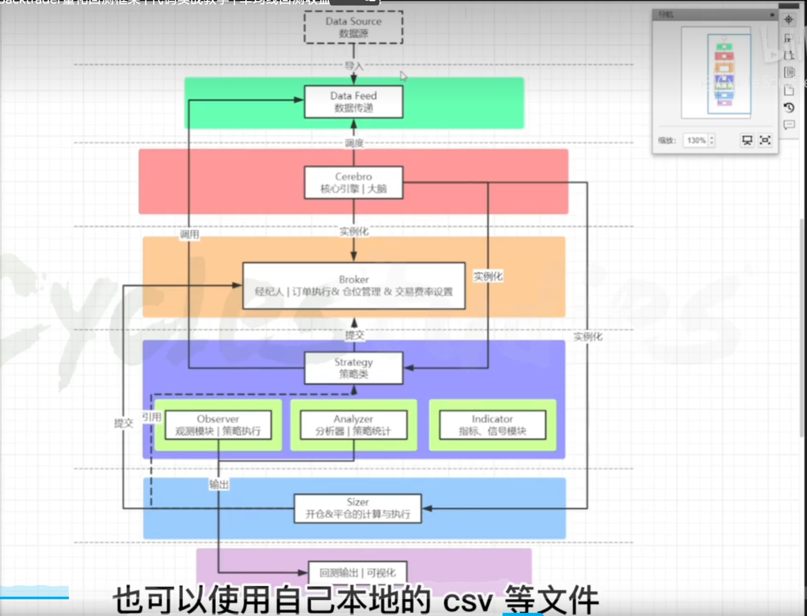

# [Backtrader实战教学](https://www.bilibili.com/video/BV1QR4y147rS/?spm_id_from=333.880.my_history.page.click&vd_source=c9f7d901dfa9fbc04fdbc2cf37bd0212)




# [Backtrader量化交易策略实战](https://www.bilibili.com/video/BV1RF411v7e1/?p=3&vd_source=c9f7d901dfa9fbc04fdbc2cf37bd0212)

## 1.2 回测应用实例

```python
#!/usr/bin/env python3
import os.path
import sys
from datetime import datetime

import backtrader as bt
import pandas as pd
import tushare as ts


def get_data(code, starttime, endtime, data_file):
    df = load_data(data_file)
    if df is None:
        df = ts.get_k_data(code, start=starttime, end=endtime)
        save_data(df, data_file)
    df.index = pd.to_datetime(df.date)
    df['openinterest'] = 0
    # 对df的数据列进行整合
    df = df[['open', 'high', 'low', 'close', 'volume', 'openinterest']]
    return df


def save_data(df, data_file):
    df.to_pickle(data_file)


def load_data(data_file):
    if os.path.exists(data_file):
        return pd.read_pickle(data_file)
    return None


# 2. 构建策略
# 上穿20日线买入，跌穿20日均线卖出
class MyStrategy(bt.Strategy):
    params = (
        ('maperiod', 5),
    )

    def __init__(self):
        self.order = None
        self.ma = bt.indicators.SimpleMovingAverage(self.datas[0], period=self.params.maperiod)
        self.count_next = 0

    # 每个bar都会执行一次，回测的每个日期都会执行一次
    def next(self):
        self.count_next += 1
        print(f'count_next: {self.count_next}')
        # 判断是否有交易指令正在进行
        if self.order:
            return

        # 空仓
        if not self.position:
            if self.datas[0].close[0] > self.ma[0]:
                self.order = self.buy(size=200)
        else:
            if self.datas[0].close[0] < self.ma[0]:
                self.order = self.sell(size=200)


def get_date(date_str, date_format="%Y-%m-%d"):
    return datetime.strptime(date_str, date_format)


if __name__ == '__main__':
    data_file = sys.argv[1]
    from_date_str = sys.argv[2]
    to_date_str = sys.argv[3]

    fromdate = get_date(from_date_str)
    todate = get_date(to_date_str)
    code = '600519'

    # 1. 数据加载
    stock_df = get_data(code, from_date_str, to_date_str, data_file)
    print(stock_df)
    # 加载并读取数据源
    data = bt.feeds.PandasData(dataname=stock_df, fromdate=fromdate, todate=todate)

    # 3. 策略设置
    cerebro = bt.Cerebro()  # 创建大脑
    # 将数据加入回测系统
    cerebro.adddata(data)
    # 加入自己的策略
    cerebro.addstrategy(MyStrategy)
    # 经纪人
    start_cash = 100000
    cerebro.broker.setcash(start_cash)
    # 设置手续费
    cerebro.broker.setcommission(0.0002)

    # 4. 执行回测
    print(f'初始资金：{start_cash}\n回测时间：{from_date_str}~{to_date_str}')
    cerebro.run()
    port_val = cerebro.broker.getvalue()
    print(f'剩余资金：{port_val}\n回测时间：{from_date_str}~{to_date_str}')
    # 5. 画图
    cerebro.plot()

# 输出 data_all.pkl 2017-01-01 2020-01-01
                open      high       low     close   volume  openinterest
date                                                                     
2017-01-03   196.141   198.861   194.671   196.421  20763.0             0
2017-01-04   196.481   214.031   196.461   213.771  65257.0             0
2017-01-05   211.861   213.311   207.301   208.601  41704.0             0
2017-01-06   208.501   221.641   207.961   212.621  68095.0             0
2017-01-09   209.661   214.741   208.401   210.371  35405.0             0
...              ...       ...       ...       ...      ...           ...
2019-12-25  1037.186  1037.186  1024.196  1027.886  24305.0             0
2019-12-26  1026.186  1036.166  1014.176  1029.286  22877.0             0
2019-12-27  1044.186  1066.186  1044.186  1057.186  47066.0             0
2019-12-30  1064.386  1089.686  1064.386  1079.986  40760.0             0
2019-12-31  1077.186  1082.186  1070.696  1077.186  22588.0             0

[731 rows x 6 columns]
初始资金：100000
回测时间：2017-01-01~2020-01-01
...
count_next: 711
count_next: 712
剩余资金：273148.54396
回测时间：2017-01-01~2020-01-01
```


```python
#!/usr/bin/env python3
import os.path
import sys
from datetime import datetime

import backtrader as bt
import pandas as pd
import tushare as ts


def get_data(code, starttime, endtime, data_file):
    df = load_data(data_file)
    if df is None:
        df = ts.get_k_data(code, start=starttime, end=endtime)
        save_data(df, data_file)
    df.index = pd.to_datetime(df.date)
    df['openinterest'] = 0
    # 对df的数据列进行整合
    df = df[['open', 'high', 'low', 'close', 'volume', 'openinterest']]
    return df


def save_data(df, data_file):
    df.to_pickle(data_file)


def load_data(data_file):
    if os.path.exists(data_file):
        return pd.read_pickle(data_file)
    return None


# 2. 构建策略
# 上穿20日线买入，跌穿20日均线卖出
class MyStrategy(bt.Strategy):
    params = (
        ('maperiod', 5),
    )

    def __init__(self):
        self.order = None
        self.ma = bt.indicators.SimpleMovingAverage(self.datas[0], period=self.params.maperiod)
        self.count_next = 0

    # 每个bar都会执行一次，回测的每个日期都会执行一次
    def next(self):
        self.count_next += 1
        print(f'count_next: {self.count_next}')
        # 判断是否有交易指令正在进行
        if self.order:
            return

        # 空仓
        if not self.position:
            if self.datas[0].close[0] > self.ma[0]:
                self.order = self.buy(size=200)
        else:
            if self.datas[0].close[0] < self.ma[0]:
                self.order = self.sell(size=200)


if __name__ == '__main__':
    data_file = sys.argv[1]
    fromdate = datetime(2019, 12, 1)
    todate = datetime(2019, 12, 10)
    code = '600519'
    s = fromdate.strftime("%Y-%m-%d")
    t = todate.strftime("%Y-%m-%d")

    # 1. 数据加载
    stock_df = get_data(code, s, t, data_file)
    print(stock_df)
    # 加载并读取数据源
    data = bt.feeds.PandasData(dataname=stock_df, fromdate=fromdate, todate=todate)

    # 3. 策略设置
    cerebro = bt.Cerebro()  # 创建大脑
    # 将数据加入回测系统
    cerebro.adddata(data)
    # 加入自己的策略
    cerebro.addstrategy(MyStrategy)
    # 经纪人
    start_cash = 100000
    cerebro.broker.setcash(start_cash)
    # 设置手续费
    cerebro.broker.setcommission(0.0002)

    # 4. 执行回测
    print(f'初始资金：{start_cash}\n回测时间：{s} {t}')
    cerebro.run()
    port_val = cerebro.broker.getvalue()
    print(f'剩余资金：{port_val}\n回测时间：{s} {t}')
# 输出
                open      high       low     close   volume  openinterest
date                                                                     
2019-12-02  1012.386  1034.206  1012.386  1027.186  30784.0             0
2019-12-03  1027.186  1027.186  1011.926  1012.186  27340.0             0
2019-12-04  1034.186  1038.846  1012.186  1016.516  35283.0             0
2019-12-05  1019.186  1026.196  1012.186  1023.986  21338.0             0
2019-12-06  1030.156  1064.186  1024.286  1064.186  39506.0             0
2019-12-09  1069.186  1070.186  1050.286  1052.886  21824.0             0
2019-12-10  1053.786  1059.186  1045.186  1058.586  15086.0             0
初始资金：100000
回测时间：2019-12-01 2019-12-10
count_next: 1
count_next: 2
count_next: 3
剩余资金：100000.0
回测时间：2019-12-01 2019-12-10
```

入参：data_30.pkl 2017-01-01 2017-02-01

```python
class MyStrategy(bt.Strategy):
    params = (
        ('ma5', 5),
        ('ma10', 10),
    )

    def __init__(self):
        self.order = None
        self.ma5 = bt.indicators.MovingAverageSimple(self.datas[0], period=self.params.ma5)
        self.ma10 = bt.indicators.MovingAverageSimple(self.datas[0], period=self.params.ma10)
        self.ma_5_10 = self.ma5 - self.ma10
        self.count_next = 0

    # 每个bar都会执行一次，回测的每个日期都会执行一次
    def next(self): # 从10日均线开始进入
        self.count_next += 1
        print(f'count_next: {self.count_next}, self.ma5[0]: {self.ma5[0]}, self.ma10[0]: {self.ma10[0]},  ma_5_10[0]: {self.ma_5_10[0]}')

#
D:\ProgramFiles\Anaconda3\envs\test310\python.exe "D:\Program Files\JetBrains\PythonProjects\backtesting\src\main.py" data_30.pkl 2017-01-01 2017-02-01 
               open     high      low    close   volume  openinterest
date                                                                 
2017-01-03  196.141  198.861  194.671  196.421  20763.0             0
2017-01-04  196.481  214.031  196.461  213.771  65257.0             0
2017-01-05  211.861  213.311  207.301  208.601  41704.0             0
2017-01-06  208.501  221.641  207.961  212.621  68095.0             0
2017-01-09  209.661  214.741  208.401  210.371  35405.0             0
2017-01-10  210.311  213.861  208.461  210.861  31727.0             0
2017-01-11  209.861  209.861  205.361  207.311  23598.0             0
2017-01-12  208.411  209.261  206.371  208.911  17779.0             0
2017-01-13  208.841  209.251  205.741  206.731  18282.0             0
2017-01-16  205.991  206.661  200.661  203.331  36855.0             0
2017-01-17  204.461  213.361  203.861  210.991  35188.0             0
2017-01-18  210.741  218.631  209.071  216.941  46005.0             0
2017-01-19  216.861  220.341  213.561  216.581  28523.0             0
2017-01-20  216.761  219.261  214.891  216.851  21344.0             0
2017-01-23  218.741  221.661  211.321  213.081  32581.0             0
2017-01-24  213.131  214.661  208.611  212.171  26914.0             0
2017-01-25  211.841  211.841  208.061  209.491  22990.0             0
2017-01-26  210.001  210.661  203.161  206.281  37826.0             0
初始资金：100000
回测时间：2017-01-01~2017-02-01
count_next: 1, self.ma5[0]: 207.429, self.ma10[0]: 207.89299999999997,  ma_5_10[0]: -0.4639999999999702
count_next: 2, self.ma5[0]: 207.455, self.ma10[0]: 209.35,  ma_5_10[0]: -1.8949999999999818
count_next: 3, self.ma5[0]: 209.381, self.ma10[0]: 209.667,  ma_5_10[0]: -0.28600000000000136
count_next: 4, self.ma5[0]: 210.91500000000002, self.ma10[0]: 210.465,  ma_5_10[0]: 0.45000000000001705
count_next: 5, self.ma5[0]: 212.939, self.ma10[0]: 210.888,  ma_5_10[0]: 2.0509999999999877
count_next: 6, self.ma5[0]: 214.88899999999998, self.ma10[0]: 211.15900000000002,  ma_5_10[0]: 3.7299999999999613
count_next: 7, self.ma5[0]: 215.125, self.ma10[0]: 211.29000000000002,  ma_5_10[0]: 3.8349999999999795
count_next: 8, self.ma5[0]: 213.635, self.ma10[0]: 211.50799999999998,  ma_5_10[0]: 2.1270000000000095
count_next: 9, self.ma5[0]: 211.575, self.ma10[0]: 211.24499999999998,  ma_5_10[0]: 0.3300000000000125
剩余资金：100000.0
回测时间：2017-01-01~2017-02-01

Process finished with exit code 0

```


## 1.3 数据解析

```python
    def next(self):
        self.count_next += 1
        # self.data == self.datas[0] == self.data0 # 都表示添加的第一个数据集
        # print(f'self.datas[0]._name: {self.datas[0]._name}, self.datas[1]._name: {self.datas[1]._name}') # self.datas[0]._name: maotai, self.datas[1]._name: tianrun
        # print(f'self.data0._name: {self.data0._name}, self.data1._name: {self.data1._name}') #
        # 拿到lines中各个line的name
        print(self.datas[0].lines.getlinealiases()) # ('close', 'low', 'high', 'open', 'volume', 'openinterest', 'datetime')
        # 拿到茅台当天的close的第一个数据集
        # self.data.lines[0] == self.data.close == self.data.lines.close 都表示close的那条链
        print(self.data.close[0], self.data.close[-1]) # 1064.186 1023.986
        # 日期
        print(self.data.lines[6][0], bt.num2date(self.data.lines[6][0]))  # 737403.0 2019-12-10 00:00:00
```

## 1.4 交易篇（上）

### 1.4.1 交易操作方式

调用broker中的“set_xxx"方法修改条件，可通过”get_xxx"方法查看当前设置的条件取值。

### 1.4.2 资金管理

```sh
set_cash | setcash // 设置初始资金
get_cash | getcash // 获取初始资金
add_cash(1000) | add_cash(-1000) // 增加或减少资金
```

### 1.4.3 滑点管理

```shell
# 方式1：通过BackBroker类中的slip_perc参数设置百分比滑点
cerebro.broker = bt.brokers.BackBroker(slip_perc=0.0001)
# 方式2：通过调用brokers的set_slippage_perc方法设置百分比滑点
cerebro.broker.set_slippage_perc(perc=0.0001)
```

### 1.4.4 手续费

```sh
cerebro.broker = bt.brokers.BackBroker(commission=0.0002)
cerebro.broker.setcommission(0.0002)  // 手续费万分之2
```

### 1.4.5 交易时机

backtrader提供了一些cheating式的交易时机模式：Cheat-On-Open和Cheat-On-Close。

默认是“当时收盘后下单，次日以开盘价成交”，这种模式在回测过程中能有效避免使用未来数据。

> Cheat-On-Open是“当日下单，当日以开盘价成交”模式

* 方式1：bt.Cerebro(cheat_on_open=True);
* 方式2：cerebro.broker.set_coo(True); 使用最多
* 方式3：BackBroker(coo=True)

> Cheat-On-Close是“当日下单，当日以收盘价成交”模式

* cerebro.broker.set_coc(True)

## 1.5 交易篇（下）

```python
class TestStrategy(bt.Strategy):
    def next(self):
        self.order = self.buy(...) # 买入、做多 long
        self.order = self.sell(...) # 卖出、做空 short
        self.order = self.close(...) # 平仓 cover
```

* data(默认:None)：用于指定哪个数据集（即哪个证券）创建订单，默认为None，表示给第1个数据集（self.datas[0]、self.data0对应的证券）创建订单。
* size(默认:None)：订单委托数量（正数），默认为None，表示会自动通过getsizer获取sizer。
* price(默认:None)：订单委托价，None表示不指定具体的委托价，而是由市场决定最终的成交价。

```python
class TestStrategy(bt.Strategy):
    def next(self):
        # 按目标数量下单
        self.order = self.order_target_size(target=size)
        # 按目标金额下单
        self.order = self.order_target_value(target=value)
        # 按目标百分比下单
        self.order = self.order_target_percent(target=percent)
```

# 量化回测平台Backtrader实战教程backtrader

## [05. 第五章：策略结果分析和评价 01 Observer与Analyzer](https://www.bilibili.com/video/BV1hD4y1W7he/?p=7&spm_id_from=pageDriver&vd_source=c9f7d901dfa9fbc04fdbc2cf37bd0212)

```python
if __name__ == '__main__':
    data_file = sys.argv[1]
    from_date_str = sys.argv[2]
    to_date_str = sys.argv[3]

    fromdate = get_date(from_date_str)
    todate = get_date(to_date_str)
    code = '600519'
    code1 = '600419'

    # 1. 数据加载
    stock_df = get_data(code, from_date_str, to_date_str, data_file)
    # stock_df.to_csv("data_all.csv")
    stock_df1 = get_data(code1, from_date_str, to_date_str, f'{data_file}_1')
    print(f'stock_df: {stock_df}')
    print(f'stock_df1: {stock_df1}')
    # 加载并读取数据源
    data = bt.feeds.PandasData(dataname=stock_df, fromdate=fromdate, todate=todate)
    data1 = bt.feeds.PandasData(dataname=stock_df1, fromdate=fromdate, todate=todate)

    # 3. 策略设置
    cerebro = bt.Cerebro(stdstats=False)  # 创建大脑
    cerebro.addobserver(bt.observers.Trades)
    cerebro.addobserver(bt.observers.BuySell)
    cerebro.addobserver(bt.observers.DrawDown)
    cerebro.addobserver(bt.observers.Value)
    cerebro.addobserver(bt.observers.TimeReturn)
    # 将数据加入回测系统
    cerebro.adddata(data, name='maotai')
    # cerebro.adddata(data1, name='tianrun')
    # 加入自己的策略
    cerebro.addstrategy(MyStrategy)
    # 经纪人
    start_cash = 100000
    cerebro.broker.setcash(start_cash)
    # 设置手续费
    # cerebro.broker = bt.brokers.BackBroker(slip_perc=0.01)
    # cerebro.broker.set_slippage_perc(1)
    # cerebro.broker = bt.brokers.BackBroker(commission=0.0002)
    cerebro.broker.setcommission(0.0002)

    cerebro.addanalyzer(bt.analyzers.SharpeRatio)
    cerebro.addanalyzer(bt.analyzers.DrawDown)  # 回撤
    cerebro.addanalyzer(bt.analyzers.TradeAnalyzer)
    cerebro.addanalyzer(bt.analyzers.Transactions)

    # 4. 执行回测
    print(f'初始资金：{start_cash}\n回测时间：{from_date_str}~{to_date_str}')
    res = cerebro.run()[0]
    port_val = cerebro.broker.getvalue()
    print(f'剩余资金：{port_val}\n回测时间：{from_date_str}~{to_date_str}')

    # print('SharpeRatio:', res.analyzers.sharperatio.get_analysis())

    # print('DrawDown:', res.analyzers.drawdown.get_analysis())
    # draw_down_data = res.analyzers.drawdown.get_analysis()
    # print(f'max drawdown: {draw_down_data["max"]["drawdown"]}')
    # print(f'max money drawdown: {draw_down_data["max"]["moneydown"]}')

    # print('TradeAnalyzer:', res.analyzers.tradeanalyzer.get_analysis())

    trading_data = res.analyzers.tradeanalyzer.get_analysis()
    print('TradeAnalyzer:', trading_data)

    # print('Transactions:', res.analyzers.transactions.get_analysis())

    # cerebro.plot(style='candle')
```

TradeAnalyzer结果：

```txt
TradeAnalyzer: 
AutoOrderedDict([
('total', AutoOrderedDict([
    ('total', 27), ('open', 0), ('closed', 27)])),
('streak', AutoOrderedDict([
    ('won', AutoOrderedDict([('current', 0), ('longest', 3)])),
    ('lost', AutoOrderedDict([('current', 1), ('longest', 7)]))])),
('pnl', AutoOrderedDict([
    ('gross', AutoOrderedDict([('total', 75643.60000000006), ('average', 2801.6148148148172)])),
    ('net', AutoOrderedDict([('total', 74458.73680000004), ('average', 2757.7309925925942)]))])),
('won', AutoOrderedDict([
    ('total', 9), 
    ('pnl', AutoOrderedDict([('total', 151238.40368000002), ('average', 16804.26707555556), ('max', 29767.10856000001)]))])),
('lost', AutoOrderedDict([
    ('total', 18), 
    ('pnl', AutoOrderedDict([('total', -76779.66687999998), ('average', -4265.5370488888875), ('max', -12221.05616000001)]))])),
('long', AutoOrderedDict([('total', 27), 
   ('pnl', AutoOrderedDict([('total', 74458.73680000004), ('average', 2757.7309925925942), 
       ('won', AutoOrderedDict([('total', 151238.40368000002), ('average', 16804.26707555556), ('max', 29767.10856000001)])),
       ('lost', AutoOrderedDict([('total', -76779.66687999998), ('average', -4265.5370488888875), ('max', -12221.05616000001)]))])),
   ('won', 9), 
   ('lost', 18)])),
('short', AutoOrderedDict([('total', 0), 
   ('pnl', AutoOrderedDict([('total', 0.0), ('average', 0.0), 
       ('won', AutoOrderedDict([('total', 0.0), ('average', 0.0), ('max', 0.0)])),
       ('lost', AutoOrderedDict([('total', 0.0), ('average', 0.0), ('max', 0.0)]))])),
   ('won', 0), 
   ('lost', 0)])),
('len', AutoOrderedDict([('total', 406), ('average', 15.037037037037036), ('max', 53), ('min', 1), 
   ('won', AutoOrderedDict([('total', 333), ('average', 37.0), ('max', 53), ('min', 24)])),
   ('lost', AutoOrderedDict([('total', 73), ('average', 4.055555555555555), ('max', 13), ('min', 1)])),
   ('long', AutoOrderedDict([('total', 406), ('average', 15.037037037037036), ('max', 53), ('min', 1), ('won', AutoOrderedDict([('total', 333), ('average', 37.0), ('max', 53), ('min', 24)])),
       ('lost', AutoOrderedDict([('total', 73), ('average', 4.055555555555555), ('max', 13), ('min', 1)]))])),
   ('short', AutoOrderedDict([('total', 0), ('average', 0.0), ('max', 0), ('min', 9223372036854775807), ('won', AutoOrderedDict([('total', 0), ('average', 0.0), ('max', 0), ('min', 9223372036854775807)])),
       ('lost', AutoOrderedDict([('total', 0), ('average', 0.0), ('max', 0), ('min', 9223372036854775807)]))]))]))
])
```

# 交易系统

交易系统可以讲四个部分：行情处理，交易实施（订单生成），中央仲裁（风控）以及柜台对接（券商接口）

流程：行情 - 策略 - 订单生成 - 风控 - 发送订单

正常行情是从第三方的行情数据提供中心来的，可以是websocket推过来的，也可以是tcp/ip, 甚至是http传输过来的一个个包。

行情每天推数据，按ticket，快照等方式推送过来，这种服务线上的交易系统。这些数据存下来，作为历史数据，服务的是回测系统

评价策略好坏的指标就是周末那几个，最大回撤，夏普，年化，收益，再记住个alpha和beta

市场，最基础也是最全面的信息就是两个，价格和成交量，price && volume。很多策略基本都是基于这两维度信息做各种东西的。基本上模拟市场环境，就是回放市场各个时间段的价格和成交量以及其他的信息。


